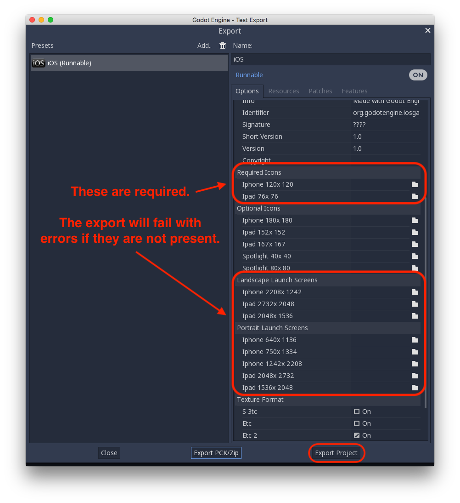
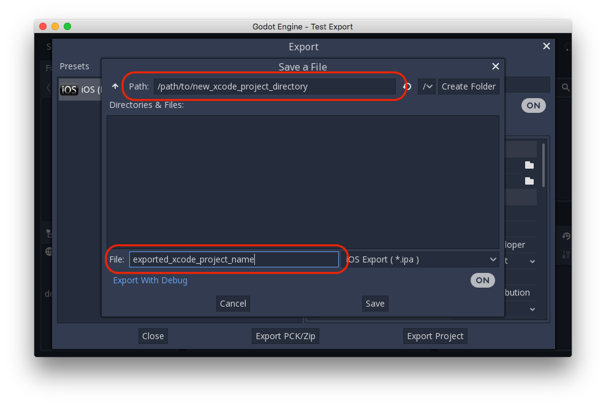

.. _doc_exporting_for_ios:

Exporting for iOS
=================

Exporting for iOS is done manually at the moment. These are the steps to
load your game in an XCode project, where you can deploy to a device,
publish, etc.

Requirements
------------

-  You must export for iOS on a mac
-  Download the export templates. Use the Godot menu: Editor > Manage Export Templates

Exporting your project
---------------------

In the Godot editor, open the Export window from the Project menu. When the 
Export window opens, click Add.. and select iOS. 

If you haven't downloaded the Godot export templates for your version, a 
"Manage Export Templates" link will appear on the bottom of the window. Click
that link and install the templates, it may take several minutes. 

Once the templates are installed, fill in your export options.
Several are required. 

After you click Export Project, there are still two important options left. 

Make sure to specify the File field. It will be used as your Xcode project name. 

Go to the export directory you specified, open the .xcodeproj file and build and 
run as normal. 

Services for iOS
----------------

Special iOS services can be used in Godot. Check out the
:ref:`doc_services_for_ios` page.
