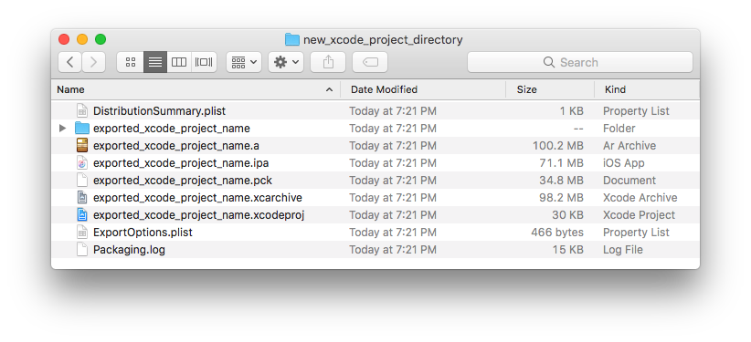
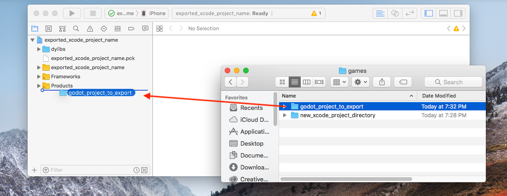
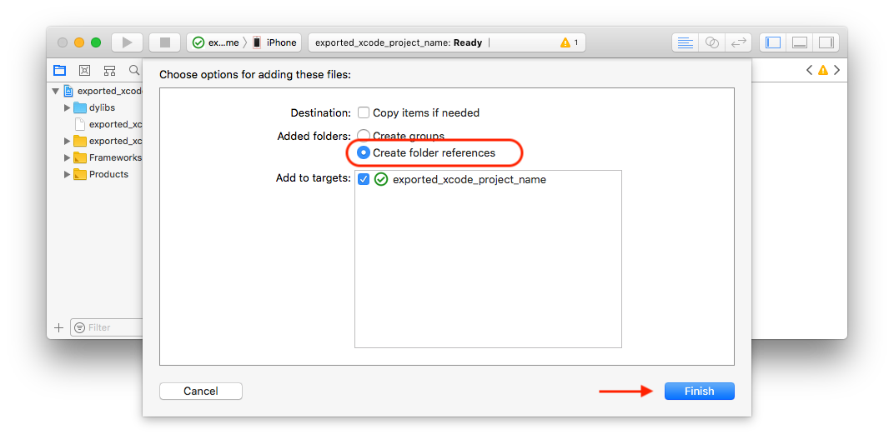
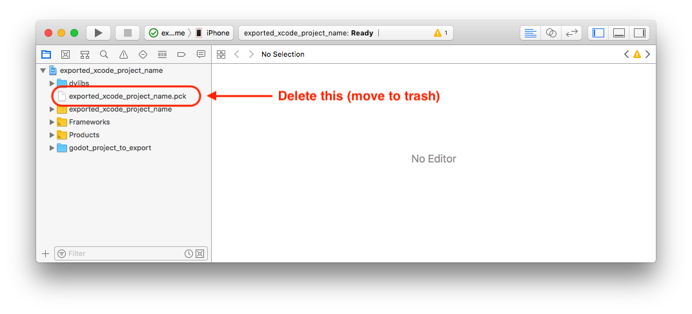
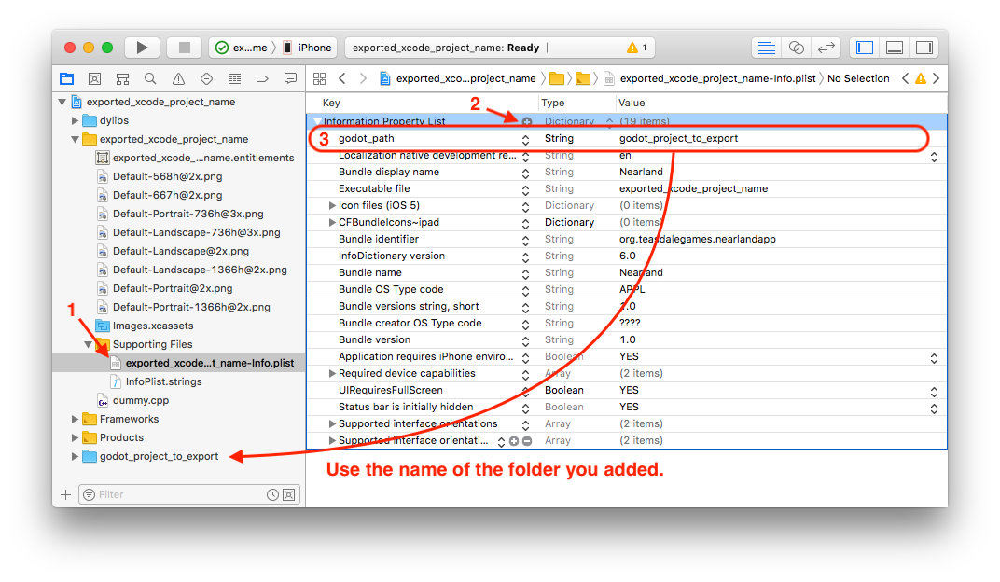

.. _doc_exporting_for_ios:

Exporting for iOS
=================

These are the steps to load your game in an Xcode project, where you can deploy to a device,
publish, etc.

Requirements
------------

-  You must export for iOS from a comupter running macOS with Xcode installed.
-  Download the Godot export templates. Use the Godot menu: Editor > Manage Export Templates

Exporting your project
----------------------

In the Godot editor, open the **Export** window from the **Project** menu. When the 
Export window opens, click **Add..** and select **iOS**. 

The following export options are required. Leaving any blank with cause the 
exporter to throw an error:

  * In the **Application** category
    * **App Store Team ID**
  * Everything in the **Required Icons** category
  * Everything in the **Landscape Launch Screens** category
  * Everything in the **Portrait Launch Screens** category

After you click **Export Project**, there are still two important options left:

  * **Path** should be an empty folder that will contain your exported Xcode project files. 
  * **File** will be the name of your Xcode project and several project specific files and directories.  

.. image:: img/ios_export_file.png

When the export completes, the options I used will create a directory that looks like this:

I can now open **exported_xcode_project_name.xcodeproj** to build and deploy my game
like any other iOS app. 

Active development considerations
---------------------------------

The above method creates an exported project that you can build for release, but you
have to re-export every time you make a change in Godot. 

While developing your game, you can speed this process up by building your Godot project
files directly into your app. 

In the following example:

  * **exported_xcode_project_name** is the name of the exported iOS application (as above). 
  * **godot_project_to_export** is the name of the Godot project I exported it from. 

Steps to use your Godot project directory in Xcode
~~~~~~~~~~~~~~~~~~~~~~~~~~~~~~~~~~~~~~~~~~~~~~~~~~

1. Start from an exported iOS project like I created above.
2. In Finder, drag your Godot project folder into the Xcode file browser. 

3. In the dialog, make sure **Create folder references** is selected. This means
that you can continue to edit your Godot project in its current location.

4. You now see the **godot_project_to_export** directory in the Xcode file browser. 
5. Delete **exported_xcode_project_name.pck** from the Xcode project.

6. Open **exported_xcode_project_name-Info.plist** and add a string property named
**godot_path** (this is the real key name) with a value **godot_project_to_export** 
(this is the name of your project)

That's it! Continue to edit your project in the Godot editor and build it in Xcode when you 
want to run it on a device. 

Services for iOS
----------------

Special iOS services can be used in Godot. Check out the
:ref:`doc_services_for_ios` page.
