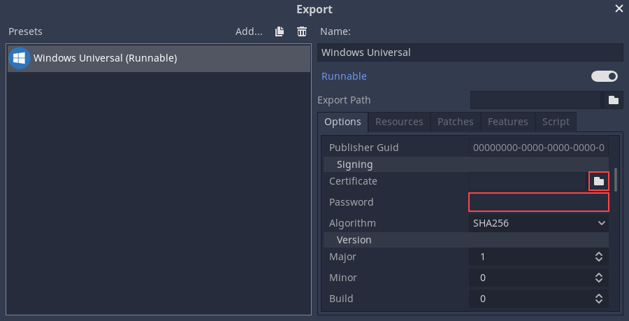

.. _doc_exporting_for_uwp:

Exporting for Universal Windows Platform
========================================

There's no extra requirement to export an ``.appx`` package that can be
installed as a Windows App or submitted to the Windows Store. Exporting UWP
packages also works from any platform, not only from Windows.

However, if you want to install and run the app, you need to sign it with a
trusted signature. Godot supports automatic signing of packages with
external tools.

Also, make sure the Publisher Name you set when exporting the package matches
the name used on the certificate.

Limitations on Xbox One
-----------------------

As described in the `UWP documentation <https://docs.microsoft.com/en-us/windows/uwp/xbox-apps/system-resource-allocation>`__:

- Submitted as an "App"
    - available memory is 1GB
    - share of 2-4 CPU cores
    - shared access of GPU power (45%)

- Submitted as a "Game" (through `Xbox Live Creators Program <https://www.xbox.com/en-US/developers/creators-program>`__)
    - available memory is 5GB
    - 4 exclusive CPU cores and 2 shared CPU cores
    - exclusive access to GPU power (100%)

- Exceeding these memory limitations will cause allocation failures and the application will crash.

Creating a signing certificate
------------------------------

This requires the ``MakeCert.exe`` and ``Pvk2Pfx.exe`` tools, which come with
the Windows SDK. If you use Visual Studio, you can open one of its Developer
Prompts, since it comes with these tools and they can be located in the path.

You can get more detailed instructions from `Microsoft's documentation
<https://msdn.microsoft.com/en-us/library/windows/desktop/jj835832(v=vs.85).aspx>`__.

First, run ``MakeCert`` to create a private key::

    MakeCert /n publisherName /r /h 0 /eku "1.3.6.1.5.5.7.3.3,1.3.6.1.4.1.311.10.3.13" /e expirationDate /sv MyKey.pvk MyKey.cer

Where ``publisherName`` matches the Publisher Name of your package and
``expirationDate`` is in the ``mm/dd/yyyy`` format.

Next, create a Personal Information Exchange (.pfx) file using ``Pvk2Pfx.exe``::

    Pvk2Pfx /pvk MyKey.pvk /pi pvkPassword /spc MyKey.cer /pfx MyKey.pfx [/po pfxPassword]

If you don't specify a password with ``/po`` argument, the PFX will have the
same password as the private key.

You will also need to trust this certificate in order to be able to install your
app. Open the Command Prompt as Administrator and run the following command::

    Certutil -addStore TrustedPeople MyKey.cer

Setting up automatic signing
----------------------------

To setup automatic signing on export you need to go to Editor Settings > Export > Uwp.
From there you need to click on the folder for ``Signtool``, and navigate to
the ``SignTool.exe`` file on your computer.

.. image:: img/UWP_sign_tool.png

After setting that up close the editor settings, go to Project > Export,
and select the UWP preset. Under the ``Signing`` options click on the folder
next to ``Certificate`` and go to the certificate file. Then enter the
pfxPassword in the password field.

Your project will now be automatically signed on export.

If you want to sign an exported app manually run ``SignTool.exe`` and use the
following command.

    SignTool sign /fd SHA256 /a /f MyKey.pfx /p pfxPassword package.appx

Installing the package
----------------------

As of the Windows 10 Anniversary Update, you are able to install packages simply by
double clicking the ``.appx`` file from Windows Explorer.

It's also possible to install by using the ``Add-AppxPackage`` PowerShell cmdlet.

.. note:: If you want to update your already installed app, you must
          update the version number on the new package or first uninstall
          the previous package.
