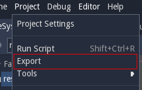
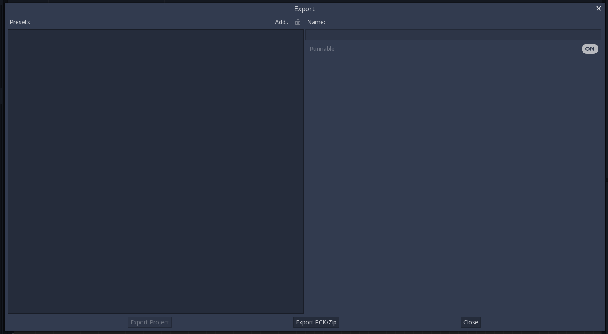
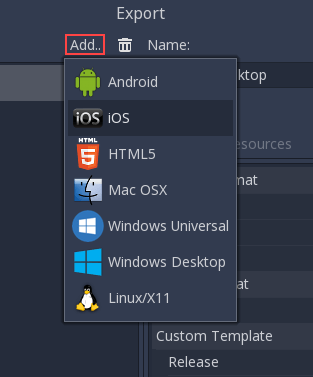
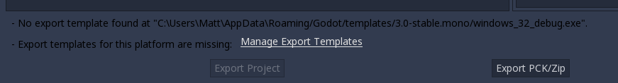
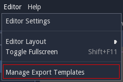
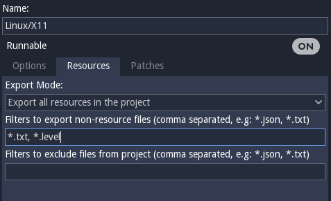
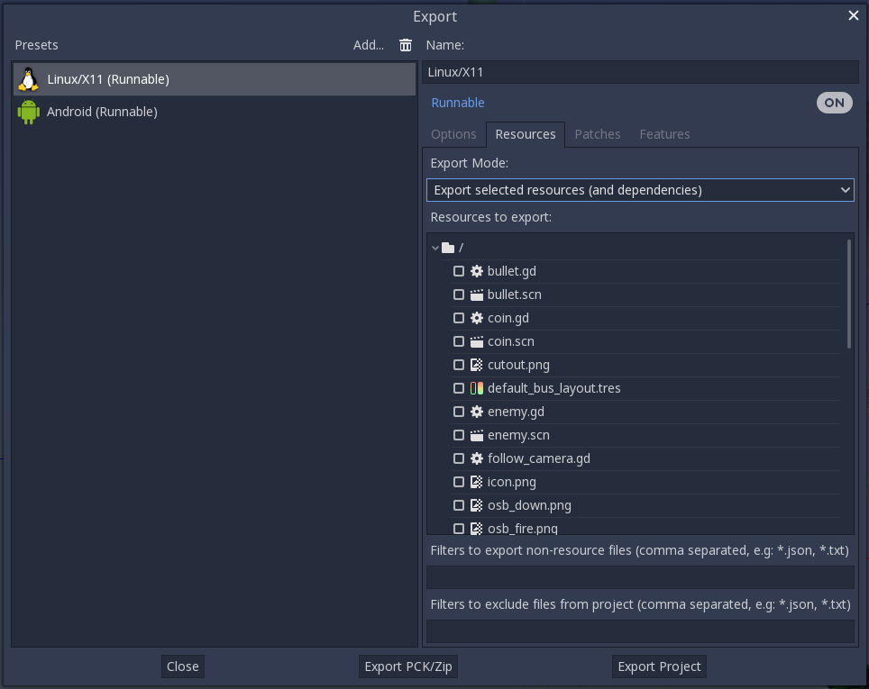

.. _doc_exporting_projects:

Exporting projects
==================

Why exporting?
--------------

Originally, Godot did not have any means to export projects. The
developers would compile the proper binaries and build the packages for
each platform manually.

When more developers (and even non-programmers) started using it, and
when our company started taking more projects at the same time, it
became evident that this was a bottleneck.

On PC
~~~~~

Distributing a game project on PC with Godot is rather easy. Drop
the godot.exe (or godot) binary together in the same place as the
engine.cfg file, zip it and you are done. This can be taken advantage of to
make custom installers.

It sounds simple, but there are probably a few reasons why the developer
may not want to do this. The first one is that it may not be desirable
to distribute loads of files. Some developers may not like curious users
peeking at how the game was made, others may find it inelegant,
etc.

Another reason is that, for distribution, the developer might prefer a
specially compiled binary, which is smaller in size, more optimized and
does not include tools inside (like the editor, debugger, etc.).

Finally, Godot has a simple but efficient system for creating DLCs as
extra package files.

On mobile
~~~~~~~~~

The same scenario in mobile is a little worse. To distribute a project
in those devices, a binary for each of those platforms is built, then
added to a native project together with the game data.

This can be troublesome because it means that the developer must be
familiarized with the SDK of each platform before even being able to
export. While learning each SDK is always encouraged, it can be
frustrating to be forced to do it at an undesired time.

There is also another problem with this approach. Different devices
prefer some data in different formats to run. The main example of this
is texture compression. All PC hardware uses S3TC (BC) compression and
that has been standardized for more than a decade, but mobile devices
use different formats for texture compression, such as PVRCT (iOS) or
ETC (Android).

Export menu
-----------

After many attempts at different export workflows, the current one has
proven to work the best. At the time of this writing, not all platforms are
supported yet, but the supported platforms continue to grow.

To open the export menu, click the "Export" button:

The export menu will open, however it will be completely empty.

That is because we need to add an export preset. To do that click the
`Add..` button at the top of the export menu. This will open a drop down
list of platforms to choose from for an export preset.

The default options are often enough to export, so tweaking them is not
necessary, but provide extra control. However, many platforms require additional
tools (SDKs) to be installed to be able to export. Additionally, Godot
needs export templates installed to create packages. The export menu
will complain when something is missing and will not allow the user to
export for that platform until they resolve it:

At that time, the user is expected to come back to the documentation and follow
instructions on how to properly set up that platform.

Export templates
~~~~~~~~~~~~~~~~

Apart from setting up the platform, the export templates must be
installed to be able to export projects. They can be obtained as a
.tpz (a renamed .zip) file from the `download page of the website
<https://www.godotengine.org/download>`_.

Once downloaded, they can be installed using the "Install Export
Templates" option in the editor:

Export mode
~~~~~~~~~~~

When exporting, Godot makes a list of all the files to export and then
creates the package. There are 3 different modes for exporting:

-  Export every single file in the project
-  Export only resources (+custom filter), this is default.
-  Export only selected resources (+custom filter)

-  **Export every single file** - This mode exports every single file in
   the project. This is good to test if something is being forgotten,
   but developers often have a lot of unrelated stuff around in the dev
   directory, which makes it a bad idea.

-  **Export only resources** - Only resources are exported. For most
   projects, this is enough. However many developers like to use custom
   datafiles in their games. To compensate for this, filters can be
   added for extra extensions (like, *.txt,*.csv, etc.).

-  **Export only selected resources** - Only select resources from a
   list are exported. This is probably overkill for most projects, but
   in some cases it is justified (usually huge projects). This mode
   offers total control of what is exported. Individual resources can be
   selected and dependency detection is performed to ensure that
   everything needed is added. As a plus, this mode allows to
   "Bundle" scenes and dependencies into a single file, which is
   *really* useful for games distributed on optical media.

Export from Command Line
------------------------

In production it is useful to automate builds, and Godot supports this
with the ``--export`` and ``--export-debug`` command line parameters.
Exporting from command line still requires an export template to define
the export parameters. A basic invocation of the export would be
``godot --export "Windows Desktop" some_name``

Which, assuming there is a preset called "Windows Desktop" and the 
template can be found, will export to ``some_name.exe``. The output
path is relative to the project path or absolute. It does not respect
the directory the command was invoked from.

You can also configure it to export only the .pck or .zip file (allowing 
a single export to be used with multiple Godot executables). This
takes place if:

 - The export preset is not marked as runnable
 - The target name ends with `.pck` or with `.zip`

It is often useful to combine the ``--export`` flag with the ``--path``
flag, and to create a dedicated export template for automated export:
``godot --path path/to/project --export "pck" game_name.pck``

