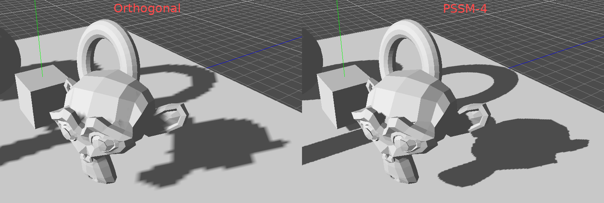
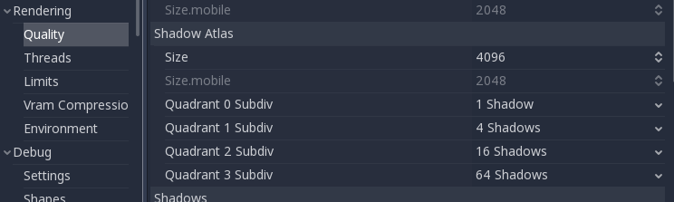

.. _doc_lighting:

Lighting
========

Introduction
------------

Lights emit light that mix with the materials and produces a visible
result. Light can come from several types of sources in a scene:

-  From the Material itself, in the form of the emission color (though
   it does not affect nearby objects unless baked).
-  Light Nodes: Directional, Omni and Spot.
-  Ambient Light in the
   :ref:`Environment <class_Environment>`.
-  Baked Light (read :ref:`doc_light_baking`).

The emission color is a material property. You can read more about it
in the :ref:`doc_fixed_materials` tutorial.

Light nodes
-----------

As mentioned before, there are three types of light nodes: Directional,
Omni and Spot. Each has different uses and will be described in
detail below, but first let's take a look at the common parameters for
lights:

.. image:: img/light_params.png

Each one has a specific function:

-  **Color**: Base color for emitted light.
-  **Energy**: Energy multiplier. This is useful to saturate lights or working with :ref:`doc_high_dynamic_range`.
-  **Indirect Energy**: Secondary multiplier used with indirect light (light bounces). This works in baked light or GIProbe.
-  **Negative**: Light becomes substractive instead of additive. It's sometimes useful to manually compensate some dark corners.
-  **Specular**: Affects the intensity of the specular blob in objects affected by this light. At zero, this light becomes a pure diffuse light. 
-  **Cull Mask**: Objects that are in the selected layers below will be affected by this light.

Shadow Mapping
^^^^^^^^^^^^^^

Lights can optionally cast shadows. This gives them greater realism (light does not reach occluded areas), but it can incur a bigger performance cost.
There is a list of generic shadow parameters, each also has a specific function:

-  **Enabled**: Check to enable shadow mapping in this light.
-  **Color**: Areas occluded are multiplied by this color. It is black by default, but it can be changed to tint shadows.
-  **Bias**: When this parameter is too small, self shadowing occurs. When too large, shadows separate from the casters. Tweak to what works best for you.
-  **Contact**: Performs a short screen-space raycast to reduce the gap generated by the bias.
-  **Reverse Cull Faces**: Some scenes work better when shadow mapping is rendered with face-culling inverted.

Below is an image of how tweaking bias looks like. Default values work for most cases, but in general it depends on the size and complexity of geometry.

.. image:: img/shadow_bias.png

Finally, if gaps cant be solved, the Contact option can help:

.. image:: img/shadow_contact.png

Any sort of bias issues can always be fixed by increasing the shadow map resolution, although that may run worse in lower end hardware.

Directional light
~~~~~~~~~~~~~~~~~

This is the most common type of light and represents a light source 
very far away (such as the sun). It is also the cheapest light to compute and should be used whenever possible
(although it's not the cheapest shadow-map to compute, but more on that later). 

Directional light models an infinite number of parallel light rays
covering the whole scene. The directional light node is represented by a big arrow, which
indicates the direction of the light rays. However, the position of the node
does not affect the lighting at all, and can be anywhere.

.. image:: img/light_directional.png

Every face whose front-side is hit by the light rays is lit, the others stay dark. Most light types
have specific parameters but directional lights are pretty simple in nature so they don't.

Directional Shadow Mapping
^^^^^^^^^^^^^^^^^^^^^^^^^^

To compute shadow maps, the scene is rendered (only depth) from an orthogonal point of view that covers
the whole scene (or up to the max distance). There is, however, a problem with this approach because objects
closer to the camera receive blocky shadows.

.. image:: img/shadow_blocky.png

To fix this, a technique named "Parallel Split Shadow Maps" (or PSSM) is used. This splits the view frustum in 2 or 4 areas. Each
area gets it's own shadow map. This allows small, close areas to the viewer to have the same shadow resolution as a huge, far-away area.

.. image:: img/pssm_explained.png

With this, shadows become more detailed:

To control PSSM, a number of parameters are exposed:

.. image:: img/directional_shadow_params.png

Each split distance is controlled relative to the camera far (or max distance), so 0 is where the eye and 1 is where the shadow ends far away.
Default values generally work well, but tweaking the first split a bit is often common to give more detail to close objects.

Always make sure to set a shadow max distance according to what the scene needs. The closer the max distance, the higher quality they shadows will have.

Sometimes, the transition between a split and the next can look bad. To fix this, the **"Blend Splits"** option can be turned own, which sacrifices detail for smoother
transitions.

.. image:: img/blend_splits.png

The **"Normal Bias"** parameter can be used to fix special cases of self shadowing when objects are perpendicular to the light. The only downside is that it makes
the shadow a bit thinner.

.. image:: img/normal_bias.png

The **"Bias Split Scale"** parameter can control extra bias for the splits that are far away. If self shadowing occurs only on the splits far away, this value can fix them.

Finally, the **"Depth Range"** setting allows choosing between a stable shadow with motion, or maximizing the depth range. The former ensures that, when the camera moves, the blockyness
of the shadow does not appear to wobble, while the later ensures more resolution (which can compensate the wobbliness). Just experiment which setting works better for your scene.

Shadowmap size for directional lights can be changed in Project Settings -> Rendering -> Quality:

.. image:: img/project_setting_shadow.png

Increasing it can solve bias problems, but reduce performance. Shadow mapping is an art of tweaking.

Omni light
~~~~~~~~~~

Omni light is a point source that emits light spherically in all directions up to a given
radius .

.. image:: img/light_omni.png

In real life, light attenuation is an inverse function, which means omni lights don't really have a radius.
This is a problem, because it means computing several omni lights would become really demanding.

To solve this, a radius is introduced, together with an attenuation function. 

.. image:: img/light_omni_params.png

These two parameters allow tweaking how this works visually, in order to find aesthetically pleasing results.

.. image:: img/light_attenuation.png

Omni Shadow Mapping
^^^^^^^^^^^^^^^^^^^

Omni light shadow mapping is relatively straightforward, as it just works. The main issue that needs to be
considered is the algorithm used to render it. 

Omni Shadows can be rendered as either "Dual Paraboloid" or "Cube Mapped". The former renders very quickly but can cause deformations,
while the later is more correct but more costly. 

.. image:: img/shadow_omni_dp_cm.png

If the objects being renderer are mostly irregular, Dual Paraboloid is usually enough. In any case, shadows are often cached too, so it may
not make much of a difference (more on that later).

Spot light
~~~~~~~~~~

Spot lights are similar to omni lights, except they emit light only into a cone
(or "cutoff"). They are useful to simulate flashlights,
car lights, refletors, spots, etc. This type of light is also attenuated towards the
opposite direction it points to.

.. image:: img/light_spot.png

Spot lights share the same **Range** and **Attenuation** as **OmniLight**, and add two extra parameters:

- **Angle**: The aperture angle of the light
- **Angle Attenuation**: The cone attenuation, which helps soften the cone borders.

Spot Shadow Mapping
^^^^^^^^^^^^^^^^^^^

Spots dont need any parameters for shadow mapping, they should just work. Keep in mind that, at more than 89 degrees, shadows
stop functioning for spots, and you should consider using an Omni light.

Shadow Atlas
~~~~~~~~~~~~

Unlike Directional lights, which have their own shadow texture, Omni and Spot lights are assigned to slots of a shadow atlas.
This atlas can be configured in Project Settings -> Rendering -> Quality -> Shadow Atlas.

The resolution applies to the whole Shadow Atlas. This atlas is divided in four quadrants:

.. image:: img/shadow_quadrants.png

Each quadrant, can be subdivided to allocate any number of shadow maps, following is the default subdivision:

.. image:: img/shadow_quadrants2.png

The allocation logic is simple, the biggest shadow map represents a light the size of the screen (or bigger), and
as soon as lights get further away from the screen (hence) smaller shadow mapps represent slots for lights that
appear smaller on screen.

Every frame, the following logic is done for all lights:

1. Check if the light is on a slot of the right size, if not, re-render it and move it to a larger/smaller slot.
2. Check if any object affecting the shadow map has changed, if it did, re-render the light.
3. If neither of the above has happened, nothing is done and the shadow is left untouched.

If the slots in a quadrant are full, lights are pushed back to smaller slots depending on size and distance.

This allocation strategy works for most games, but you may to use a separate one in some cases (as example, a top-down game where
all lights are around the same size and quadrands may have all the same subdivision).

