Introduction to the 2D animation features
=========================================

Overview
--------

The :ref:`class_AnimationPlayer` node allows you to create anything from simple
to complex animations.

In this guide you learn to:

-  Work with the Animation Panel
-  Animate any property of any node
-  Create a simple animation
-  Call functions with the powerful Call Function Tracks

In Godot you can animate anything you find in the Inspector. Animations
are changes to properties over time. This means you can animate anything
visual in nature: sprites, UI elements, particles, the visibility, and
color of textures. But not only. You can also control gameplay related
values and call any function.

Create an AnimationPlayer node
------------------------------

To use the animation tools we first have to create an
``AnimationPlayer`` node.

The AnimationPlayer node type is the data container for your animations.
One AnimationPlayer node can hold multiple animations, that can
automatically transition to one another.

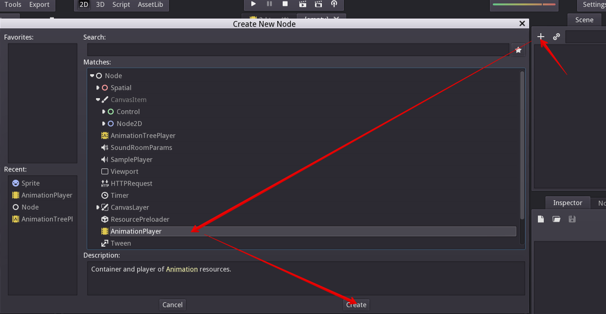

   The AnimationPlayer node

Click on the AnimationPlayer node in the Node tab to open the Animation
Panel at the bottom of the viewport.

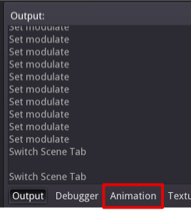

   The animation panel position

It consists of five parts:

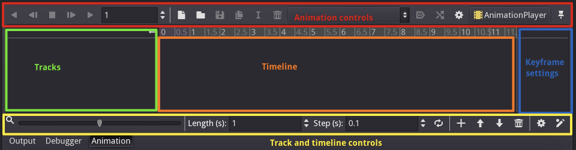

   The animation panel

-  Animation controls (i.e. add, load, save, and delete animations)
-  The tracks listing
-  The timeline with keyframes
-  The track modifiers and keyframe editor (when enabled)
-  The timeline and track controls, where you can zoom the timeline and
   edit tracks for example.

See the `animation panel reference <#animation-panel-reference>`__ below
for details.

Computer animation relies on keyframes
--------------------------------------

On the computer animations rely on keyframes. A keyframe defines the
value of a property at a certain point in time.

White and blue diamond shapes represent keyframes in the timeline.

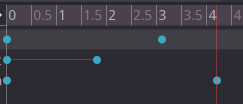

   Keyframes in Godot

The engine interpolates values between keyframes, resulting in a gradual
change in values over time.

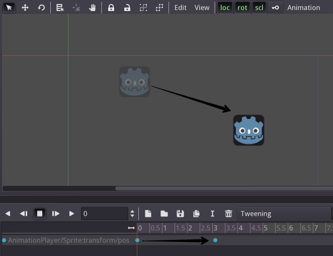

   Two keyframes are all it takes to obtain a smooth motion

The timeline lets you insert keyframes and change their timing. It also
defines how long the animation is.

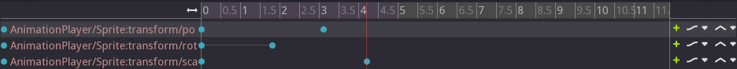

   The timeline in the animation panel

Each line of the Animation Panel is an animation track. Normal and
Transform tracks reference node properties. Their name or id is a path
to the node.

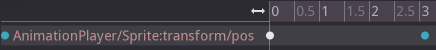

   Example of Normal animation tracks

.. tip::

   If you animate the wrong property, you can edit a track's path anytime.
   Double click on it and type the new path. Play the animation using the
   "Play from beginning" button |Play from beginning| (Default shortcut:
   Shift+D) to see the changes instantly.

Tutorial: Creating a simple animation
-------------------------------------

Scene setup
~~~~~~~~~~~

For this tutorial, we'll going to create an AnimationPlayer node and a
sprite node as a AnimationPlayer node child.

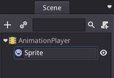

   Our scene setup

The sprite holds an image texture and we animate that sprite to move
between two points on the screen. As a starting point, move the sprite
to a left position on the screen.

.. tip::

   Adding animated nodes as children to the AnimationPlayer node is not
   required, but it is a nice way of distinguishing animated nodes from
   non-animated nodes in the Scene Tree.

Select the AnimationPlayer node and click on "Add animation" (|Add
Animation|) in the animation tab to add a new animation.

Enter a name for the animation in the dialog box.

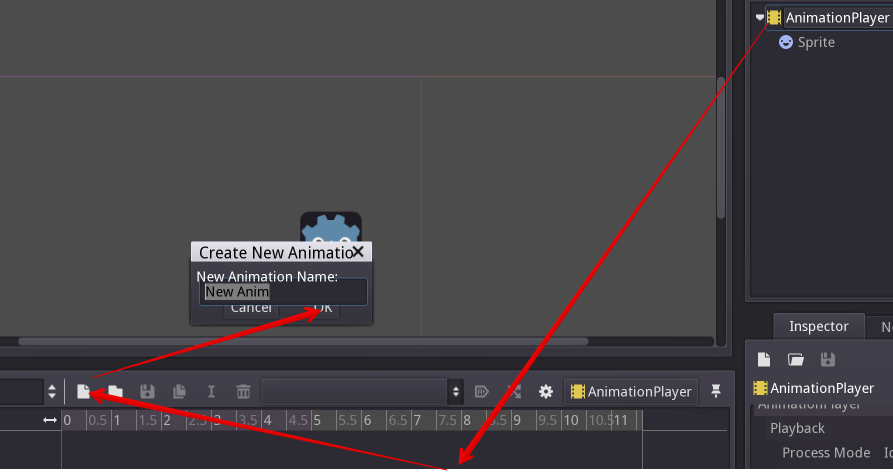

   Add a new animation

Adding a track
~~~~~~~~~~~~~~

To add a new track for our sprite, select it and take a look in the
toolbar:

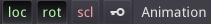

   Convenience buttons

These switches and buttons allow you to add keyframes for the selected
node's location, rotation, and scale respectively.

Deselect rotation, because we are only interested in the location of our
sprite for this tutorial and click on the key button.

As we don't have a track already set up for the transform/location
property, Godot asks, wether it should set it up for us. Click on
"Create".

This creates a new track and our very first keyframe at the beginning of
the timeline:

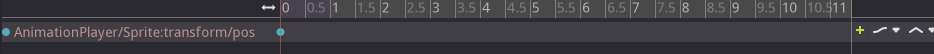

   The sprite track

The track name consists of a Node Path, followed by a colon, followed by
a reference to its property, that we would like to modify.

In our example, the path is ``AnimationPlayer/Sprite`` and the property
is ``transform/pos``.

The path always starts at the AnimationPlayer node's parent (so paths
always have to include the AnimationPlayer node itself).

\` .. note::

Don't worry if you change the names of nodes in the Scene Tree, that you
already have tracks for. Godot automatically updates the paths in the
tracks. \`

The second keyframe
~~~~~~~~~~~~~~~~~~~

Now we need to set the destination where our sprite should be headed and
how much time it takes to get there.

Let's say, we want it to take 2 seconds to go to the other point. By
default the animation is set to last only 1 second, so change this in
the timeline controls animation panel's lower panel to 2.

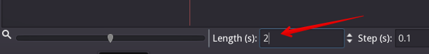

   Animation length

Click on the timeline header near the 2 second mark and move the sprite
to the target destination on the right side.

Again, click the key button in the toolbar. This creates our second
keyframe.

Run the animation
~~~~~~~~~~~~~~~~~

Click on the "Play from beginning" (|Play from beginning|) button.

Yay! Our animation runs:

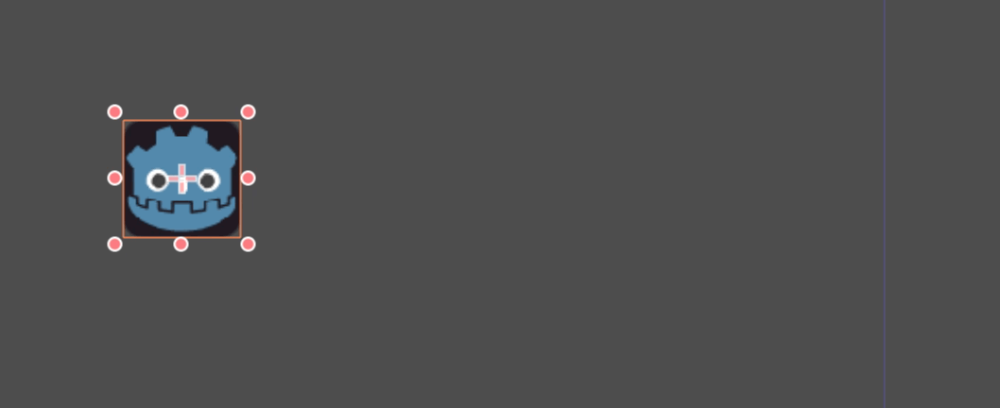

   The animation

Back and forth
~~~~~~~~~~~~~~

As you can see, the "loop" button is enabled by default and our
animation loops. Godot has an additional feature here. Like said before,
Godot always calculates the frames between two keyframes. In a loop, the
first keyframe is also the last keyframe, if no keyframe is specified at
the end.

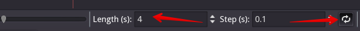

   Animation loop

If you set the animation length to 4 seconds now, the animation moves
back and forth.

Track settings
~~~~~~~~~~~~~~

Each track has a settings panel at the end, where you can set the update
rate and the track interpolation.

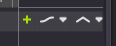

   Track settings

The update rate of a track tells Godot when to update the property
values. This can be:

-  Continuous: Update the property on each frame
-  Discrete: Only update the property on keyframes
-  Trigger: Only update the property on keyframes or triggers

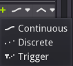

   Track rate

In normal animations, you usually use "Continuous". The other types are
used to script complex animations.

The interpolation tells Godot how to calculate the frame values between
the keyframes. These interpolation modes are supported:

-  Nearest: Set the nearest keyframe value
-  Linear: Set the value based on a linear function calculation between
   the two keyframes
-  Cubic: Set the value based on a curved function calculation between
   the two keyframes

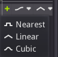

   Track interpolation

Cubic interpolation leads to a more natural movement, where the
animation is slower at a keyframe and faster between keyframes. This is
usually used for character animation. Linear interpolation creates more
of a robotic movement.

Keyframes for other properties
------------------------------

Godot doesn't restrict to only edit transform properties. Every property
can be used as a track where you can set keyframes.

If you select your sprite while the animation panel is visible, you get
a small keyframe button for all of the sprite's properties. Click on
this button and Godot automatically adds a track and keyframe to the
current animation.

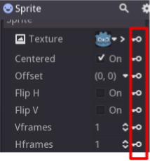

   Keyframes for other properties

Edit keyframes
--------------

For advanced use and to edit keyframe in detail, enable the keyframe
editor (|Keyframe editor|).

This adds an editor pane on the right side of the track settings. When
you select a keyframe, you can directly edit its values in this editor:

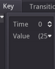

   Keyframe editor editing a key

Additionally, you can also edit the transition value for this keyframe:

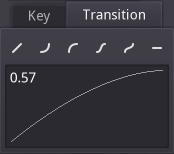

   Keyframe editor editing a transition

This tells Godot, how to change the property values when it reaches this
keyframe.

You usually tweak your animations this way, when the movement doesn't
"look right".

Advanced: Call Func tracks
--------------------------

Godot's animation engine doesn't stop here. If you're already
comfortable with Godot's scripting language GDScript and API you know
that each node type is a class and has a bunch of callable functions.

For example, the :ref:`class_SamplePlayer2D` node type has a function to play a
sample.

Wouldn't it be great to play a sample at a specific keyframe in an
animation? This is where "Call Func Tracks" come in handy. These tracks
reference a node again, this time without a reference to a property.
Instead a keyframe holds the name and arguments of a function, that
Godot should call when reaching this keyframe.

To let Godot play a sample when it reaches a keyframe, follow this list:

Add a SamplePlayer2D to the Scene Tree and add a sample library and a
sample to it.

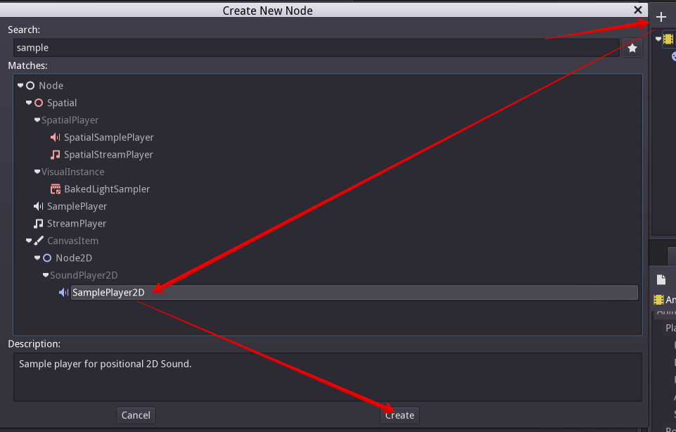

   Add SamplePlayer2D

Click on "Add track" (|Add track|) on the animation panel's track
controls.

Select "Add Call Func Track" from the list of possible track types.

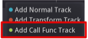

   Add Call Func Track

Select the SamplePlayer2D node in the selection window. Godot adds the
track with the reference to the node.

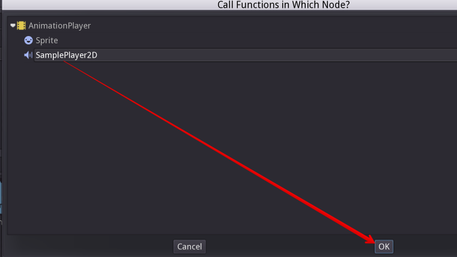

   Select SamplePlayer2D

Select the timeline position, where Godot should play the sample by
clicking on the timeline header.

Enable the Keyframe Editor by clicking on |Keyframe editor|.

Click on "Add keyframe" near the settings of our func track (|Add
keyframe|) and select the keyframe.

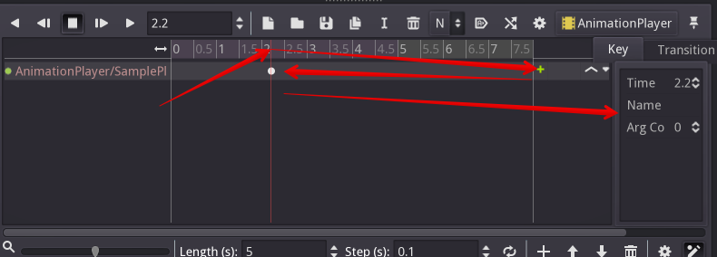

   Add a keyframe to the call func track

Enter "play" as the function name and set the argument counter to 1.
Select "String" as the first argument type and use the sample name as
the argument value.

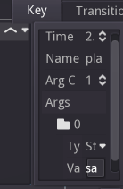

   Keyframe settings of a call func track

When Godot reaches the keyframe, Godot calls the SamplePlayer2D node's
"play" function with the sample name.

References
----------

Animation panel reference
~~~~~~~~~~~~~~~~~~~~~~~~~

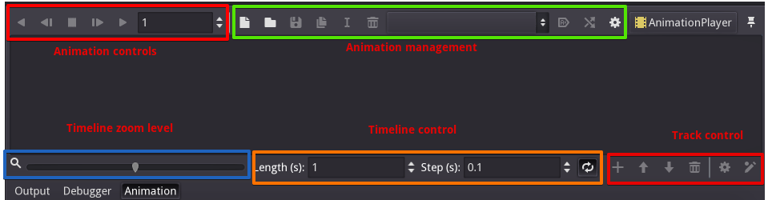

   The animation panel reference

The animation panel has the following parts (from left to right):

Animation controls
^^^^^^^^^^^^^^^^^^

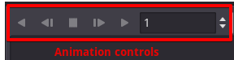

   Animation controls

-  Play animation backwards from current position
-  Play animation backwards from the animation end
-  Stop animation
-  Play animation forwards from the animation beginning
-  Play animation forwards from the current position
-  Direct time selection

Animation management
^^^^^^^^^^^^^^^^^^^^

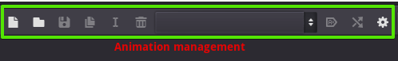

   Animation management

-  Create a new animation
-  Load animation
-  Save animation
-  Duplicate animation
-  Rename animation
-  Delete animation
-  Animation selection
-  Automatically play selected animation
-  Edit animation blend times
-  Extended animation Tools

Timeline zoom level control
^^^^^^^^^^^^^^^^^^^^^^^^^^^

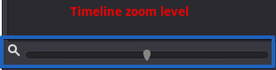

   Timeline zoom level contro

Timeline control
^^^^^^^^^^^^^^^^

.. figure:: img/animation_reference_timeline_controls.png
   :alt: Timeline control

   Timeline control

-  Length of animation
-  Steps of animation
-  Toggle loop animation

Track control
^^^^^^^^^^^^^

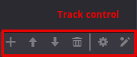

   Track control

-  Add track
-  Move track up
-  Move track down
-  Delete track
-  Extended track tools
-  Toggle keyframe editor

.. |Play from beginning| image:: img/animation_play_from_beginning.png
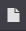
.. |Keyframe editor| image:: img/animation_keyframe_editor_toggle.png
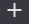
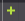
