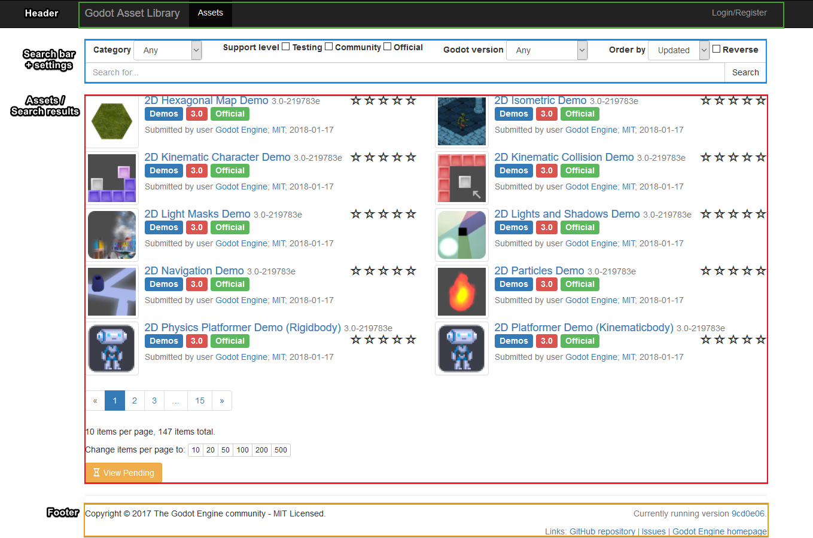
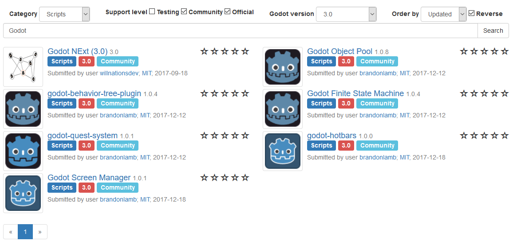
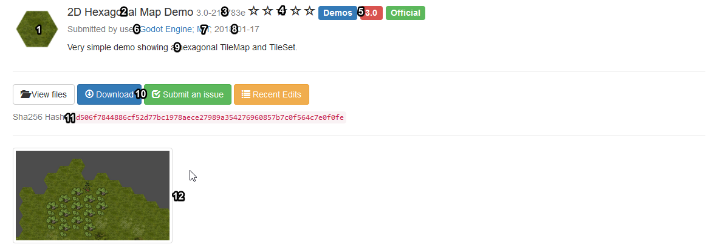
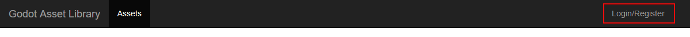
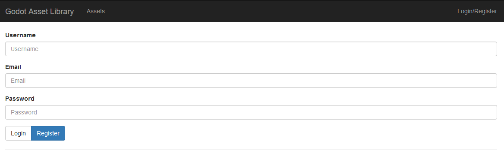
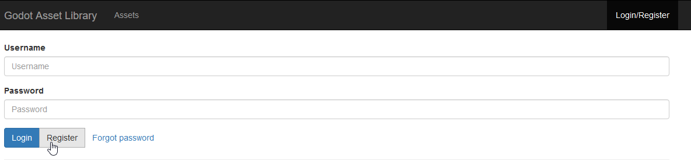
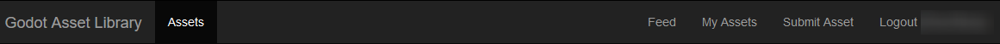

.. _doc_using_assetlib:

Using the AssetLib
==================

On the website
--------------

Overview
~~~~~~~~

As mentioned before, you can access the web frontend of the AssetLib
on `Godot's official website <https://godotengine.org/asset-library>`_, and this
is what it looks like when you first visit it:

|image0|

At the top you see the **header** which takes you to various other parts of the
AssetLib - at the moment it's empty as we are not logged in.

Searching
~~~~~~~~~

In the center is the **search bar + settings** section, and the **assets** section
below it - this lets you filter out certain kinds of assets based on a host
of criteria. These include the asset **category** (such as 2D tools, scripts
and demos), **engine version** they are intended for, **sorting order** (by
update date, by name, etc.) and **support level**.

While most other filter settings should be fairly self-explanatory, it's worth
going over what "support level" means in the Asset Library.
Currently there are three support levels, and each asset can belong to only one.

**Official** assets are created and maintained by the official Godot Engine
developers. Currently, these include the official engine demos, which showcase
how various areas of the engine work.

**Community** assets are submitted and maintained by the members of the
Godot community.

**Testing** assets are works-in-progress, and may contain bugs and usability
issues. They are not recommended for use in serious projects, but you are
encouraged to download, test them, and submit issues to the original authors.

You can mix and match any of the search filters and criteria, and upon clicking
the Search button, receive the list of all assets in the Library that match them.

|image1|

Note that the search results are not updated in real-time, so you will have to
re-submit the search query each time you change the query settings.

Breakdown of an asset
~~~~~~~~~~~~~~~~~~~~~

Now let's take a look at what an asset's page looks like and what it contains.

|image2|

1. Asset's thumbnail/icon.
2. Asset's name.
3. Current version number of the asset.
4. Asset's average rating, displayed in stars. (This is currently unimplemented.)
5. Asset's category, Godot version, and support status.
6. Asset's original author/submitter.
7. The license the asset is distributed under.
8. The date of the asset's latest edit/update.
9. A textual description of the asset.
10. Links related to the asset (download link, file list, issue tracker).
11. A SHA-256 of the asset, for download validation purposes.
12. Images and videos showcasing the asset.

Registering and logging in
~~~~~~~~~~~~~~~~~~~~~~~~~~

In order to upload assets to the AssetLib, you need to be logged in, and to do 
that, you need a registered user account. In the future, this may also give you
access to other features, such as commenting on or rating the existing assets.
You do *not* need to be logged in to browse and download the assets.

The login/registration page can be accessed from the AssetLib header.

|image3|

From here, you can register your account, which requires a valid email address,
a username, and a (preferably strong) password.

|image4|

Then, you can use your username and password to log in.

|image5|

This will change the look of the AssetLib header. Now you can see a feed of the
assets (TODO: what does that mean?), an overview of your submitted assets, and
the ability to submit new assets to the Library. 

|image6|

You can learn how to submit assets to the Library, and what the asset submission
guidelines are, in the next part of this tutorial, ::ref:`doc_uploading_to_assetlib`.

In the editor
-------------

[TODO]

