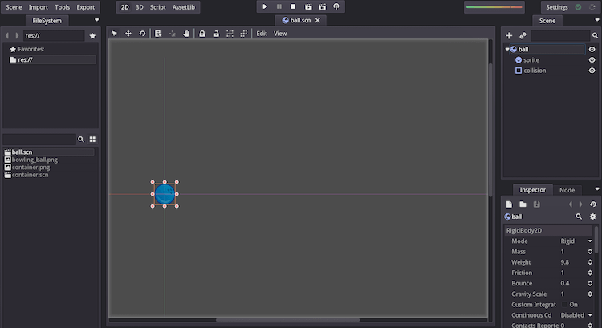
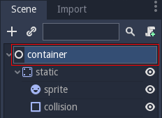
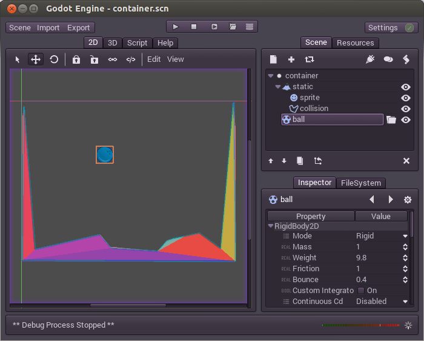
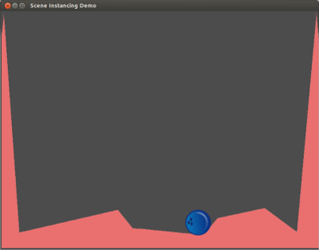
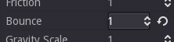

.. _doc_instancing:

Instancing
==========

Rationale
---------

Having a scene and throwing nodes into it might work for small projects, but as
a project grows, you will naturally add more and more nodes and it can quickly
become unmanageable. To solve this, Godot allows a project to be separated into
several scenes. This, however, does not work the same way as in other game
engines. In fact, it's quite different, so please do not skip this tutorial!

To recap: A scene is a collection of nodes organized as a tree, where
they can have only one single node as the tree root.

.. image:: img/tree.png

Recall that a scene can be created and saved to disk. You can create and save
as many scenes as you desire.

.. image:: img/instancingpre.png

Afterwards, while editing any scene, you can instance other scenes as part of
it:

.. image:: img/instancing.png

In the above picture, Scene B was added to Scene A as an instance. It may seem
weird at first, but by the end of this tutorial it should make complete sense.

Instancing, step by step
------------------------

To learn how to do instancing, let's start with downloading a sample
project: :download:`instancing.zip </files/instancing.zip>`.

Unzip this project anywhere you like. Then, open Godot and add this project to
the project manager using the 'Import' option:

.. image:: img/importproject.png

Simply browse to the folder you extracted and open the "project.godot" file you
can find inside it. After doing this, the new project will appear on the list
of projects. Edit the project by pressing the 'Edit' button.

This project contains two scenes, "ball.tscn" and "container.tscn". The ball
scene is just a ball with physics, while the container scene has a nicely
shaped collision, so balls can be dropped in there.

.. image:: img/contscene.png

Open the container scene, and then select the root node:

Afterwards, push the link shaped button. This is the instancing button!

.. image:: img/continst.png

Select the ball scene (ball.tscn). The ball should appear at the origin (0,0)
which is at the top-left of the container scene. Drag the ball to the center of
the scene, like this:

Press Play and Voila!

The instanced ball should fall somewhere to the bottom of the pit before coming
to rest.

A little more
-------------

You can create as many instances as you desire within a scene. Just try instancing
more balls or duplicating them (via Ctrl-D or the duplicate button):

.. image:: img/instmany.png

Then try running the scene again:

.. image:: img/instmanyrun.png

Cool, huh? This is how instancing works.

Editing instances
-----------------

Select one of the many copies of the balls and go to the property
editor. Let's make it bounce a lot more, so look for the Bounce
parameter and set it to 1.0:

Grey "revert" button will appear. When
this button is present, it means we modified a property in the
instanced scene to override a specific value in this instance. Even
if that property is modified in the original scene, the custom value
will always overwrite it. Pressing the revert button will restore the
property to the original value that came from the scene.

Conclusion
----------

Instancing seems handy, but there is more to it than meets the eye!
The next part of the instancing tutorial should cover the rest..
