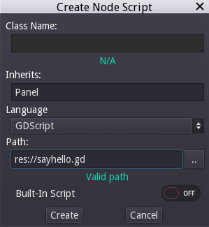
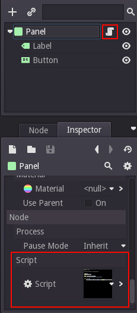
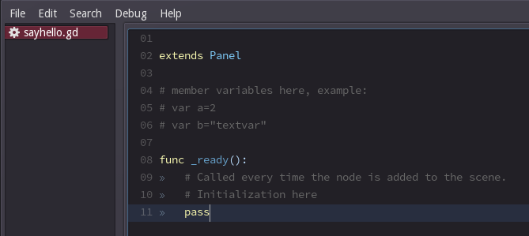
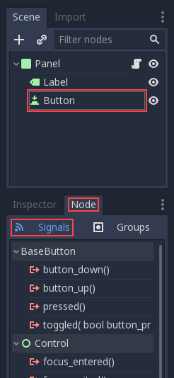

.. _doc_scripting:

Scripting
=========

Introduction
------------

Before Godot 3.0, the only choice for scripting a game in Godot was to use
:ref:`doc_gdscript`. Nowadays, Godot has four (yes four!) official languages
and the ability to add extra scripting languages dynamically!

This is great, mostly, due the large amount of flexibility provided, but
it also makes our work of supporting languages more difficult.

The "Main" languages in Godot, though, are GDScript and VisualScript. The
main reason to choose them is the level of integration with Godot, as this
makes the experience smoother (both have very slick editor integration, while
C# and C++ need to be edited in a separate IDE). If you are a big fan of statically typed languages, though, go with C# and C++.

There are more languages available via GDNative interface, but keep in mind
we don't have official support for them so you will have to work with the
provided in that case.

GDScript
~~~~~~~~

:ref:`doc_gdscript` is, as mentioned above, the main language used in Godot.
Using it has some really positive points compared to other languages due
to the high integration with Godot:

* It's simple, elegant and designed to be friendly with users of other languages such as Lua, Python, Squirrel, etc.
* Loads and compiles blazingly fast.
* The editor integration is a pleasure to work with, with code completion expanding as far as completing nodes, signals, and many other items pertaining to the current scene being edited.
* Has vector types built-in (such as Vectors, transorms etc), making it efficient for heavy linear algebra.
* It supports multiple threads as well as statically typed languages (which is one of the limitation that avoided us going for other VMs such as Lua, Squirrel, etc).
* It uses no garbage collector, so it trades a small bit of automation (most objects are reference counted anyway), by determinism.
* The dynamic nature of it makes it easy to optimize chunks of it in C++ (via GDNative) if more performance is required at some point, without recompiling the engine.

If undecided, and have experience in programming (specially dynamically
typed languages), go for GDScript!

Visual Script
~~~~~~~~~~~~~

Begining 3.0, Godot offers :ref:`visualscript<Visual Scripting>`. This is a
somewhat typical implementation of blocks and connections language, but
adapted to how Godot works. 

Visual Scripting is a great tool for non-programmers, or even for developers
with ample programming experience that want to make parts of the code more
accessible to others (like Game/Level Designers or Artists).

It can also be used by programmers to build state machines or custom
visual node workflows (like a Dialogue System).

Microsoft C#
~~~~~~~~~~~~

As Microsoft's C# is a favorite amongst game developers, we have added
solid and official support for it. C# is a very mature language with tons of code
written for it. Support for this language was added thanks to a generous
donation from Microsoft.

It has an excellent tradeoff between performance and ease to use, although
the main item one must be aware of is the garbage collector.

For companies, this is usually the best choice, given the large amount of
programmers that can be found in the labor market familiar with it, which
reduces the learning time of the engine.

GDNative C++
~~~~~~~~~~~~

Finally, this is one of our brightest additions for the 3.0 release.
GDNative allows scripting in C++ without requiring to recompile (or even
restart) Godot. 

Any C++ version can be used, and mixing compiler brands and versions for the 
generated shared libraries works perfectly, thanks to our use of an internal C
API Bridge.

This language is the best choice for performance and does not need to be
used for an entire game (other parts can be written in GDScript or Visual
Script). Yet, the API is very clear and easy to use as it resembles, mostly,
Godot actual C++ API.

Scripting a scene
-----------------

In the rest of this tutorial, we'll set up a simple GUI scene consisting of a
button and a label, where pressing the button will update the label. This will
demonstrate:

- how to write a basic script and attach it to a node
- how to hook up UI elements via *signals*
- how to write a script that can access other nodes in the scene

Before continuing, please make sure to read the :ref:`doc_gdscript` reference.
It's a simple language and the reference is short, so it will not take more
than a few minutes to get an overview of the concepts.

Scene setup
~~~~~~~~~~~

Use the add node dialog to create the following hierarchy, with the following
nodes:

- Panel

  * Label
  * Button

It should look like this in the scene tree:

.. image:: img/scripting_scene_tree.png

Use the 2D editor to position and resize the button and label so that they
look like the image below. You can set the text in the Inspector pane.

.. image:: img/label_button_example.png

Finally, save the scene, with a name such as "sayhello.tscn"

.. _doc_scripting-adding_a_script:

Adding a script
~~~~~~~~~~~~~~~

Right click on the panel node, and then select "Add Script" in the context
menu:

.. image:: img/add_script.png

The script creation dialog will pop up. This dialog allows you to set the
language, class name, and other relevant options.

Actually, in GDScript, the file itself represents the class, so in this case,
the class name field is not editable.

The node we're attaching the script to is a panel, so the "Inherits" field
should automatically be filled in with "Panel". This is what we want as our
script's goal is to extend this panel node's functionality.

Finally, enter a path name for the script and select "Create":

Once this is done, the script will be created and added to the node. You can
see this both as an extra icon in the node as well as in the script property:

To edit the script, select either of the highlighted buttons. This will bring
you to the script editor where an existing template will be included by default:

There is not much in there. The "_ready()" function is called when the
node (and all its children) enter the active scene. (Note: "_ready()" is not
the a constructor; the constructor is "_init()").

The role of the script
~~~~~~~~~~~~~~~~~~~~~~

A script adds behavior to a node. It is used to control how the node functions
as well as how it interacts with other nodes (children, parent, siblings,
etc.). The local scope of the script is the node. In other words, the script
inherits the functions provided by that node.

.. image:: /img/brainslug.jpg

Handling a signal
~~~~~~~~~~~~~~~~~

Signals are "emitted" when some specific kind of action happens, and they can be
connected to any function of any script instance. Signals are used mostly in
GUI nodes (although other nodes have them too, and you can even define custom
signals in your own scripts).

In this step, we'll connect the "pressed" signal to a custom function.

The editor provides an interface for connecting signals to your scripts. You
can access this by selecting the node in the scene tree and then selecting the
"Node" tab. Next, make sure that you have "Signals" selected.

At this point, you could use the visual interface to hook up the "pressed"
signal by double clicking on it and selecting a target node that already has a
script attached to it. But for the sake of learning, we're going to code up the
connection manually.

To accomplish this, we will introduce a function that is probably the most used
by Godot programmers, namely :ref:`Node.get_node() <class_Node_get_node>`.
This function uses paths to fetch nodes anywhere in the scene, relative to the
node that owns the script.

In our case, because the button and the label are siblings under the panel
where the script is attached, you can fetch the button as follows:

::

    get_node("Button")

Next, write a function which will be called when the button is pressed:

.. tabs::
 .. code-tab:: gdscript GDScript

    func _on_button_pressed():  
        get_node("Label").text="HELLO!"

 .. code-tab:: csharp

   // i dont know how this is supposed to be in C#

 .. group-tab:: VS

    .. image:: img/signals.png

Finally, connect the button's "pressed" signal to that callback in _ready(), by
using :ref:`Object.connect() <class_Object_connect>`.

::

    func _ready():
        get_node("Button").connect("pressed",self,"_on_button_pressed")

The final script should look basically like this:

::

    extends Panel

    func _on_button_pressed():
        get_node("Label").text="HELLO!"

    func _ready():
        get_node("Button").connect("pressed",self,"_on_button_pressed")

Run the scene and press the button. You should get the following result:

.. image:: img/scripting_hello.png

Why hello there! Congratulations on scripting your first scene.

**Note:** A common misunderstanding in this tutorial is how get_node(path)
works. For some given node, get_node(path) searches its immediate children.
In the above code, this means that *Button* must be a child of *Panel*. If
*Button* were instead a child of *Label*, the code to obtain it would be:

::

    # not for this case
    # but just in case
    get_node("Label/Button") 

Also, remember that nodes are referenced by name, not by type.
