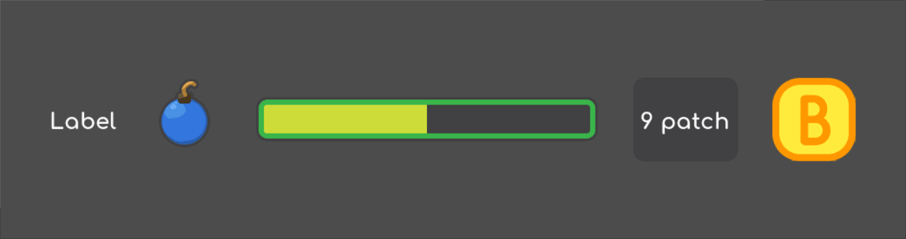
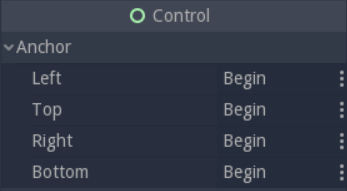
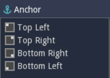
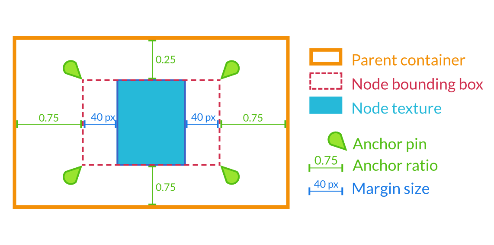

Design interfaces with the Control nodes
========================================

Computer displays, mobile phones, and TV screen come in all shapes and
sizes. To ship a game, you'll need to support different screen ratios
and resolutions. It can be hard to build responsive interfaces that
adapt to all platforms. Thankfully, Godot comes with robust tools to
design and manage responsive User Interface. To design your UI, you'll
use the Control nodes. These are the nodes with green icons in the
editor. There are dozens of them, to create anything from life bars to
complex applications. Godot's entire editor and plugins use these nodes.

.. figure:: img/godot_editor_ui.png
   :alt: Godot's editor is made with the engine's UI framework

   Godot's editor is made with the engine's UI framework

This guide will get you started with UI design. You will learn:

-  The five most useful control nodes to build your games’ interface
-  How to work with the anchor of UI elements
-  How to efficiently place and arrange your user interface using
   containers
-  The five most common containers

To learn how to control the interface and connect it to other scripts,
read `Build your first game UI in Godot <#>`__.

Only use Control nodes when you design your interfaces. They have unique
properties that allow them to work with one another. Other nodes like
Node2D, Sprite, etc. will not work. You can still use some nodes that
work with others like the AnimationPlayer, Tween or the StreamPlayer.
Control nodes are CanvasItems like Node2D, so you can apply shaders to
them.

All control nodes share the same main properties: the anchor, the
bounding rectangle, focus and focus neighbour, two properties related to
mouse and keyboard input, the size flags, the margin, and the optional
UI theme. Once you understand these, any Control nodes you use will add
just a handful of additional properties. Once you understand the basics
of the UI control nodes, it will take you far less time to learn all the
special nodes.

    CB: *That list of properties is very long. Maybe better as bullets?*

    CB: *I would remove this last sentence. It sounds too close to "it's
    easy".*

The 5 most common UI elements
-----------------------------

Godot ships with dozens of Control nodes. A lot of them are here to help
you build editor plugins and applications. To learn more about them,
check the guide about `Advanced UI nodes and Themes `__.

For most games, you'll only need five types of UI elements, and a few
Containers. These five Control nodes are:

1. Label: for displaying text
2. TextureRect: used mostly for backgrounds, or everything that should
   be a static image
3. TextureProgress: for lifebars, loading bars, horizontal, vertical or
   radial
4. NinePatchRect: for scalable panels
5. TextureButton: to create buttons

    CB: *reordered to match image*

   The 5 most common Control nodes for UI design

TextureRect
~~~~~~~~~~~

    CB: *Should this be a subheading? The transitions between the five
    are hard to see.*

    **TextureRect** displays a texture or image. The main difference
    from a Sprite node is that it can position itself and scale in
    different ways. Set the Stretch Mode property to change its
    behaviour:

    CB: *Saying it displays a "sprite" may confuse. Didn't say
    difference from what? It being a Control and positions/scales
    differently is the same thing.*

-  ``Tile`` makes the texture repeat, but it won't scale
-  The default, ``Scale and Expand (compat)``, lets you scale the
   texture up, but it forces a minimal size
-  ``Keep`` and ``Keep Centered`` force the texture to remain at its
   original size, in the top left corner or the center of the frame
   respectively

    CB: *center vs centre spelling needs to be consistent. I'm using
    "center" because Godot does.*

As with Sprite nodes, you can modulate the TextureRect's colour. Click
the ``Modulate`` property and use the color picker.

.. figure:: img/5_common_nodes_TextureFrame.png
   :alt: TextureRect modulated with a red color

   TextureRect modulated with a red color

TextureButton
~~~~~~~~~~~~~

**TextureButton** is like TextureRect, except it has 5 texture slots:
one for each of the button's states. Most of the time, you'll use the
Normal, Pressed, and Hover textures. Focused is useful if your interface
listens to the keyboard's input. The sixth image slot, the Click Mask,
lets you define the clickable area using a 2-bit, pure black and white
image.

In the Base Button section, you'll find a few checkboxes that change how
the button behaves. When Toggle Mode is on, the button will toggle
between active and normal states when you press it. Disabled makes it
disabled by default, in which case it will use the Disabled texture.
TextureButton shares a few properties with the texture frame: it has a
modulate property, to change its color, and Resize and Stretch modes, to
change its scale behavior.

    CB: *Should the property names be ``code`` tagged?*

.. figure:: img/5_common_nodes_TextureButton.png
   :alt: TextureButton and its 5 texture slots

   TextureButton and its 5 texture slots

TextureProgress
~~~~~~~~~~~~~~~

**TextureProgress** layers up to 3 sprites to create a progress bar. The
Under and Over textures sandwich the Progress one, which displays the
bar's value.

The ``Mode`` property controls the direction in which the bar grows:
horizontally, vertically, or radially. If you set it to radial, the
Initial Angle and Fill Degrees properties let you limit the range of the
gauge.

To animate the bar, you'll want to look at the Range section. Set the
Min and Max properties to define the range of the gauge. For instance,
to represent a character's life, you'll want to set Min to 0, and Max to
the character's maximum life. Change the Value property to update the
bar. If you leave the Min and Max values to the default of 1 and 100,
and set the Value property to 40, 40% of the Progress texture will show
up, and 60% of it will stay hidden.

.. figure:: img/5_common_nodes_TextureProgress.png
   :alt: TextureProgress bar, two thirds filled

   TextureProgress bar, two thirds filled

Label
~~~~~

**Label** prints text to the screen. You'll find all its properties in
the Label section, in the Inspector. Write the text in the ``Text``
property, and check Autowrap if you want it to respect the textbox's
size. If Autowrap is off, you won't be able to scale the node. You can
align the text horizontally and vertically with Align and Valign
respectively.

.. figure:: img/5_common_nodes_Label.png
   :alt: Picture of a Label

   Picture of a Label

NinePatchRect
~~~~~~~~~~~~~

**NinePatchRect** takes a texture split in 3 rows and 3 columns. The
center and the sides tile when you scale the texture, but it never
scales the corners. It is very useful to build panels, dialogue boxes
and scalable backgrounds for your UI.

.. figure:: img/5_common_nodes_NinePatchRect.png
   :alt: NinePatchRect scaled with the min\_size property

   NinePatchRect scaled with the min\_size property

Place UI elements precisely with anchors
----------------------------------------

Control nodes have a position and size, but they also have anchors and
margins. Anchors define the origin, or the reference point, for the
Left, Top, Right and Bottom edges of the node. Change any of the 4
anchors, and the margins will update automatically.

   The anchor property

How to change the anchor
~~~~~~~~~~~~~~~~~~~~~~~~

Like any properties, you can edit the 4 anchor points in the Inspector,
but this is not the most convenient way. When you select a control node,
the anchor menu appears above the viewport, in the toolbar. It gives you
a list of icons to set all 4 anchors with a single click, instead of
using the inspector’s 4 properties. The anchor menu will only show up
when you select a control node.

   The anchor menu in the viewport

Anchors are relative to the parent container
~~~~~~~~~~~~~~~~~~~~~~~~~~~~~~~~~~~~~~~~~~~~

Each anchor is a value between 0 and 1. For the left and top anchors, a
value of 0 means that without any margin, the node's edges will align
with the left and top edges of its parent. For the right and bottom
edges, a value of 1 means they'll align with the parent container's
right and bottom edges. On the other hand, margins represent a distance
to the anchor position in pixels, while anchors are relative to the
parent container's size.

   to the anchors. In practice, you'll often let the container update
   margins for you

   Margins are relative to the anchor position, which is relative to the
   anchors. In practice, you'll often let the container update margins
   for you

Margins change with the anchor
~~~~~~~~~~~~~~~~~~~~~~~~~~~~~~

Margins update automatically when you move or resize a control node.
They represent the distance from the control node's edges to its anchor,
which is relative to the parent control node or container. That's why
your control nodes should always be inside a container, as we'll see in
a moment. If there's no parent, the margins will be relative to the
node's own bounding Rectangle, set in the Rect section, in the
inspector.

.. figure:: img/control_node_margin.png
   :alt: Margins on a CenterContainer set to the "Full Rect" anchor

   Margins on a CenterContainer set to the "Full Rect" anchor

Try to change the anchors or nest your Control nodes inside Containers:
the margins will update. You'll rarely need to edit the margins
manually. Always try to find a container to help you first; Godot comes
with nodes to solve all the common cases for you. Need to add space
between a lifebar and the border of the screen? Use the MarginContainer.
Want to build a vertical menu? Use the VBoxContainer. More on these
below.

Use size tags to change how UI elements fill the available space
~~~~~~~~~~~~~~~~~~~~~~~~~~~~~~~~~~~~~~~~~~~~~~~~~~~~~~~~~~~~~~~~

Every control node has Size Flags. They tell containers how the UI
elements should scale. If you add the "Fill" flag to the Horizontal or
Vertical property, the node's bounding box will take all the space it
can, but it'll respect its siblings and retain its size. If there are 3
TextureFrame nodes in an HBoxContainer, with the "Fill" flags on both
axes, they'll each take up to a third of the available space, but no
more. The container will take over the node and resize it automatically.

.. figure:: img/TextureFrame_in_box_container_fill.png
   :alt: 3 UI elements in an HBoxContainer, they align horizontally

   3 UI elements in an HBoxContainer, they align horizontally

The "Expand" flag lets the UI element take all the space it can, and
push against its siblings. Its bounding rectangle will grow against the
edges of its parent, or until it's blocked by another UI node.

.. figure:: img/TextureFrame_in_box_container_expand.png
   :alt: The same example as bove, but the left node has the "Expand"
   size flag

   The same example as bove, but the left node has the "Expand" size
   flag

You'll need some practice to understand the size tags, as their effect
can change quite a bit depending on how you set up your interface.

Arrange control nodes automatically with containers
---------------------------------------------------

Containers automatically arrange all children Control nodes including
other containers in rows, columns, and more. Use them to add padding
around your interface or center nodes in their bounding rectangles. All
built-in containers update in the editor so you can see the effect
instantly.

Containers have a few special properties to control how they arrange UI
elements. To change them, navigate down to the Custom Constants section
in the Inspector.

The 5 most useful containers
~~~~~~~~~~~~~~~~~~~~~~~~~~~~

If you build tools, you might need all of the containers. But for most
games, a handful will be enough:

-  MarginContainer, to add margins around part of the UI
-  CenterContainer, to center its children in its bounding box
-  VboxContainer and HboxContainer, to arrange UI elements in rows or
   columns
-  GridContainer, to arrange Controls nodes in a grid-like pattern

CenterContainer centers all its children inside of its bounding
rectangle. It's one you typically use for title screens, if you want the
options to stay in the center of the viewport. As it centers everything,
you'll often want a single container nested inside it. If you use
textures and buttons instead, they'll stack up.

.. figure:: img/5_containers_CenterContainer.png
   :alt: CenterContainer in action. The life bar centers inside its
   parent container.

   CenterContainer in action. The life bar centers inside its parent
   container.

The MarginContainer adds a margin on any side of the child nodes. Add a
MarginContainer that encompasses the entire viewport to add a separation
between the edge of the window and the UI. You can set a margin on the
top, left, right, or bottom side of the container. No need to tick the
checkbox: click the corresponding value box and type any number. It will
activate automatically.

.. figure:: img/5_containers_MarginContainer.png
   :alt: The MarginContainer adds a 40px margin around the Game User
   Interface

   The MarginContainer adds a 40px margin around the Game User Interface

There are two BoxContainers: VBoxContainer and HBoxContainer. You cannot
add the BoxContainer node itself, as it is a helper class, but you can
use vertical and horizontal box containers. They arrange nodes either in
rows or columns. Use them to line up items in a shop, or to build
complex grids with rows and columns of different sizes, as you can nest
them to your heart's content.

.. figure:: img/5_containers_BoxContainer.png
   :alt: The HBoxContainer horizontally aligns UI elements

   The HBoxContainer horizontally aligns UI elements

VBoxContainer automatically arranges its children into a column. It puts
them one after the other. If you use the separation parameter, it will
leave a gap between its children. HBoxContainer arranges UI elements in
a row. It's similar to the VBoxContainer, with an extra ``add_spacer``
method to add a spacer control node before its first child or after its
last child, from a script.

The GridContainer lets you arrange UI elements in a grid-like pattern.
You can only control the number of columns it has, and it will set the
number of rows by itself, based on its children's count. If you have
nine children and three columns, you will have 9÷3 = 3 rows. Add three
more children and you'll have four rows. In other words, it will create
new rows as you add more textures and buttons. Like the box containers,
it has two properties to set the vertical and horizontal separation
between the rows and columns respectively.

.. figure:: img/5_containers_GridContainer.png
   :alt: A GridContainer with 2 columns. It sizes each column
   automatically.

   A GridContainer with 2 columns. It sizes each column automatically.

Godot's UI system is complex, and has a lot more to offer. To learn how
to design more advanced interface, read `Design advanced UI with other
Control nodes `__.
