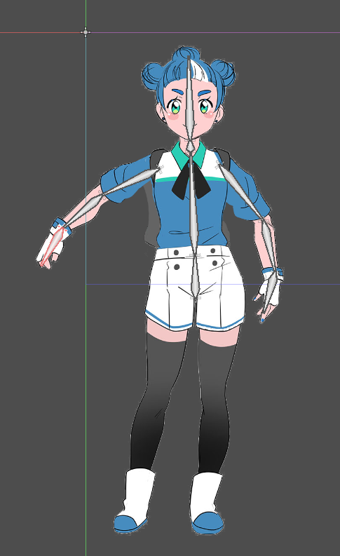

.. _doc_2d_skeletal_deform:

2D skeletal deform overview
===========================

Godot 3.1 has the ability to do custom mesh deformation based on the same bones used to animate texture sprites.

Nodes for 2D skeletal deform
----------------------------

:ref:`Skeleton2D <class_Skeleton2D>`, :ref:`Bone2D <class_Bone2D>`, and Polygon2D are the basic component for 2D skeletal deform.

.. note:: The new :ref:`MeshInstance2D <class_MeshInstance>` node supports skeletal deforms, but it can't be created with skeletal deform in the editor. It is mainly for writing importers from tools like Spine.

You use these 3 nodes to achieve 2D skeletal deform. ``Skeleton2D`` and `Bone2D` form the armature, Polygon2D is the mesh with texture to be deformed by the armature.

2D skeletal deform set-up
-------------------------

We have invited Godette to help us in the demo.　

.. note:: Godette is the personified Godot character licensed under `CC-BY-4.0 <https://creativecommons.org/licenses/by/4.0/>_. The character sheet is available on `godot-design <https://github.com/godotengine/godot-design>` inside the ``godette`` folder.

We will be using a modified texture from the character sheet. Download it here to follow along.

Create a new scene with ``Node2D`` as root. Then, add a ``Polygon2D`` node.

Godette is composed of 3 parts: the body, left hand, and the right hand.

Create the body part
~~~~~~~~~~~~~~~~~~~~

We begin with the creation of the body.

Assign ``godette.png`` as the texture of ``Polygon2D``

Click on ``UV`` next to the ``view`` button on the toolbar and the ``Polygon 2D UV Editor`` will open.

Before we continue, here is an explanation of the UI.

The editor has 4 modes: ``UV``, ``Poly``, ``Split``, and ``Bones``. We will walk trough the UI of each mode in the following sessions.

Now, switch to ``Polygon`` mode and draw a polygon around the texture.

Exit the ``Polygon 2D UV Editor`` and add a ``Skeleton2D`` node under the ``Node2D`` root node. Create a ``Bone2D`` node as the base and start adding the require bones with more ``bone2D`` nodes.

After creating the bones, select the `Skeleton2D` node. There is an menu button `Skeleton2D` in the toolbar, open it and click ``Make Rest Pose from Bones``. This create the rest pose from the current Bones' Transform. The second option ``Set Bones to Rest Bones`` reset the bones to the rest pose.

Select the ``Polygon2D`` node and open the ``Polygon 2D UV Editor``, switch to ``Splits`` mode.

You can adjust the topology of the mesh by splitting the polygon, connect the points to create a segment that creates suitable deformation.

.. notes:: This process may demand some trial an error, as for complex polygons, several readjustment may be required.

Select the ``Polygon2D`` node and open the ``Polygon 2D UV Editor``, switch to ``Bones`` mode. 

Click on ``Sync bones to Polygon``. The bones are now display on the mesh. Paint the weight of each points according to the desire deformation.

.. notes:: If you later add, remove or reparent the nodes, you need to click on the button again. This will ensure that the minimum possible paint information is lost each time the skeleton hierarchy is modified.

Exit the editor and test the rigged polygon by rotating the bones. Your result should look like this:

Create the left hand
~~~~~~~~~~~~~~~~~~~~

Repeat the same steps: Create a polygon2D, assign it with the left hand texture. Draw the polygon, create the bones, set rest poses. Split the polygon and paint the weight of each points.

Create the right hand
~~~~~~~~~~~~~~~~~~~~~

Repeat the same steps: Create a polygon2D, assign it with the left hand texture. Draw the polygon, create the bones, set rest poses. Split the polygon and paint the weight of each points.

Animate Godette
~~~~~~~~~~~~~~~~~

Animate Godette by animating the bones and here is the result:

