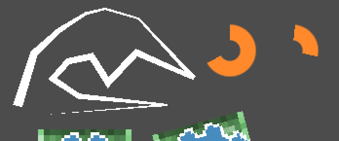
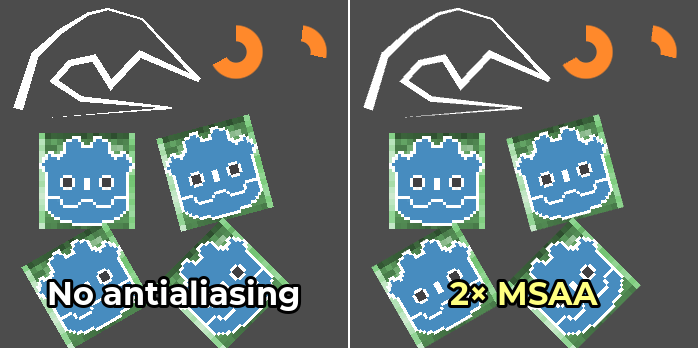
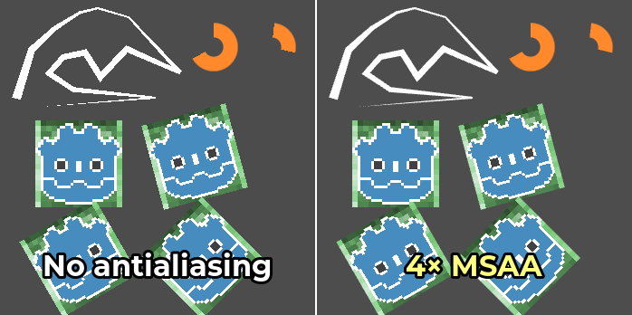
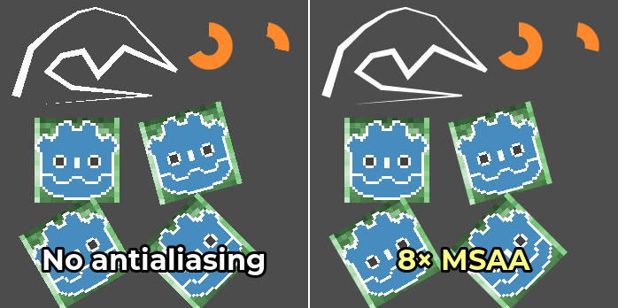

.. _doc_2d_antialiasing:

2D antialiasing
===============

.. Images on this page were generated using the project below
.. (except for `antialiasing_none_scaled.webp`):
.. https://github.com/Calinou/godot-antialiasing-comparison

.. seealso::

    Godot also supports antialiasing in 3D rendering. This is covered on the
    :ref:`doc_3d_antialiasing` page.

Introduction
------------

Due to their limited resolution, scenes rendered in 2D can exhibit aliasing
artifacts. These artifacts usually manifest in the form of a "staircase" effect on
geometry edges, and are most noticeable when using nodes such as :ref:`class_Line2D`,
:ref:`class_Polygon2D` or :ref:`class_TextureProgressBar`. :ref:`doc_custom_drawing_in_2d`
can also have aliasing artifacts for methods that don't support antialiasing.

In the example below, you can notice how
edges have a blocky appearance:

   Image is scaled by 2× with nearest-neighbor filtering to make aliasing more noticeable.

To combat this, Godot supports several methods of enabling antialiasing on 2D rendering.

Antialiasing property in Line2D and custom drawing
--------------------------------------------------

This is the recommended method, as it has a lower performance impact in most cases.

Line2D has an **Antialiased** property which you can enable in the inspector.
Also, several methods for :ref:`doc_custom_drawing_in_2d` support an optional
``antialiased`` parameter, which can be set to ``true`` when calling the
function.

These methods do not require MSAA to be enabled, which makes their *baseline*
performance cost low. In other words, there is no permanent added cost if you're
not drawing any antialiased geometry at some point.

The downside of these antialiasing methods is that they work by generating
additional geometry. If you're generating complex 2D geometry that's updated
every frame, this may be a bottleneck. Also, Polygon2D, TextureProgressBar, and
several custom drawing methods don't feature an antialiased property. For these
nodes, you can use 2D multisample antialiasing instead.

Multisample antialiasing (MSAA)
-------------------------------

Before enabling MSAA in 2D, it's important to understand what MSAA will operate
on. MSAA in 2D follows similar restrictions as in 3D. While it does not
introduce any blurriness, its scope of application is limited. The main
applications of 2D MSAA are:

- Geometry edges, such as line and polygon drawing.
- Sprite edges *only for pixels touching one of the texture's edges*. This works
  for both linear and nearest-neighbor filtering. Sprite edges created using
  transparency on the image are not affected by MSAA.

The downside of MSAA is that it only operates on edges. This is because MSAA
increases the number of *coverage* samples, but not the number of *color*
samples. However, since the number of color samples did not increase, fragment
shaders are still run for each pixel only once. As a result, MSAA will **not
affect** the following kinds of aliasing in any way:

- Aliasing *within* nearest-neighbor filtered textures (pixel art).
- Aliasing caused by custom 2D shaders.
- Specular aliasing when using Light2D.
- Aliasing in font rendering.

MSAA can be enabled in the Project Settings by changing the value of the
**Rendering > Anti Aliasing > Quality > MSAA 2D** setting. It's important to change
the value of the **MSAA 2D** setting and not **MSAA 3D**, as these are entirely
separate settings.

Comparison between no antialiasing (left) and various MSAA levels (right). The
top-left corner contains a Line2D node, the top-right corner contains 2
TextureProgressBar nodes. The bottom contains 8 pixel art sprites, with 4 of
them touching the edges (green background) and 4 of them not touching the edges
(Godot logo):

