.. _doc_2d_lights_and_shadows:

2D lights and shadows
=====================

Introduction
------------

This tutorial explains how the 2D lighting works in the
`lights and shadows <https://github.com/godotengine/godot-demo-projects/tree/master/2d/lights_and_shadows>`_ demo project.
It begins with a brief description of the resources used in the final demo and then describes how
to make a scene like the demo step by step.

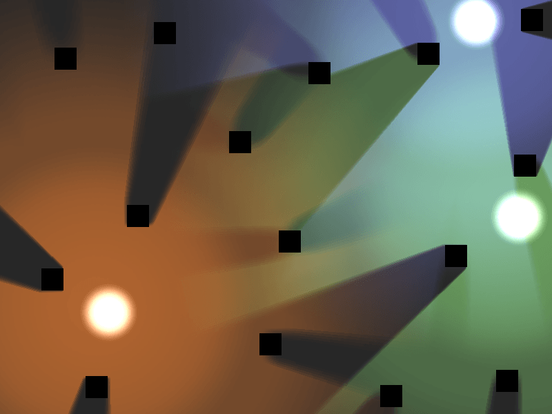

All the resources for this tutorial can be found in the `official demo repository <https://github.com/godotengine/godot-demo-projects>`_
on GitHub. I suggest you download it before starting. Alternatively,
it can be downloaded from the Project Manager. Launch Godot and in the top
bar select "Templates" and search for "2D Lights and Shadows Demo".

Setup
-----

For this demo we use four textures: two for the lights, one for the shadow casters,
and one for the background. I've included links to them all here if you want to download them
separately from the demo.

The first is the background image (`background.png <https://raw.githubusercontent.com/godotengine/godot-demo-projects/master/2d/lights_and_shadows/background.png>`_)
used in the demo. You do not necessarily need a background, but we use one for the demo.

The second is a plain black image (`caster.png <https://raw.githubusercontent.com/godotengine/godot-demo-projects/master/2d/lights_and_shadows/caster.png>`_)
to use as our shadow caster object. For a top down game this could be a wall or any
other object that casts a shadow.

Next is the light itself (`light.png <https://raw.githubusercontent.com/godotengine/godot-demo-projects/master/2d/lights_and_shadows/light.png>`_).
If you click the link you will notice how large it is. The image you use
for a light should cover the area you want your light to cover. This image is
1024x1024 pixels, so you should use it to cover 1024x1024 pixels in your game.

Lastly, we have the spotlight image (`spot.png <https://raw.githubusercontent.com/godotengine/godot-demo-projects/master/2d/lights_and_shadows/spot.png>`_).
The demo uses a blob to show where the light is and the larger light
image to show the effect of the light upon the rest of the scene.

Nodes
-----

The demo uses four different nodes:
  * :ref:`CanvasModulate <class_CanvasModulate>`
  * :ref:`Sprite <class_Sprite>`
  * :ref:`Light2D <class_Light2D>`
  * :ref:`LightOccluder2D <class_LightOccluder2D>`

:ref:`CanvasModulate<class_CanvasModulate>` is used to darken the scene.

:ref:`Sprites <class_Sprite>` are used to display the textures for the light blobs, the
background, and for the shadow casters.

:ref:`Light2Ds <class_Light2D>` are used to light the scene. The way a light typically works
is by adding a selected texture over the rest of the scene to simulate lighting. But it can be
used in other ways, for example masking out parts of the scene.

:ref:`LightOccluder2Ds <class_LightOccluder2D>` are used to tell the shader which parts of
the scene cast shadows. The shadows appear only on areas covered by the :ref:`Light2D <class_Light2D>` and
their direction is based on the center of the :ref:`Light <class_Light2D>`.

Lights
------

:ref:`Lights <class_Light2D>` cover the entire extent of their respective Texture. They use additive
blending to add the color of their texture to the scene.

:ref:`Lights <class_Light2D>` have four ``Modes``: ``Add``, ``Sub``, ``Mix``, and ``Mask``.

``Add`` adds the color of the light texture to the scene. It brightens the area under the light.

``Sub`` subtracts the color of the light from the scene. It darkens the area under the light.

``Mix`` mixes the color of the light with the underlying scene. The resulting brightness is
halfway between the color of the light and the color underneath.

``Mask`` is used to mask out areas that are covered by the light. Masked out areas are hidden or revealed based on
the color of the light.

For the demo the lights have two components, the :ref:`Light <class_Light2D>` itself (which
is the effect of the light), and a :ref:`Sprite <class_Sprite>` blob which is an image showing the
location of the light source. A child :ref:`Sprite <class_Sprite>` is not necessary to make a
:ref:`Light <class_Light2D>` work.

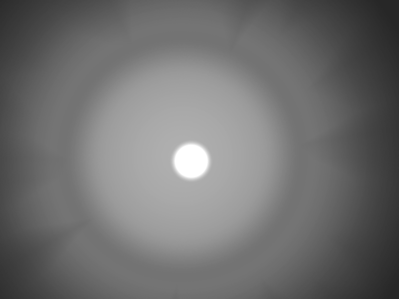

Shadows
-------

Shadows are made by intersecting a :ref:`Light <class_Light2D>` with a :ref:`LightOccluder2D <class_LightOccluder2D>`.

By default shadows are turned off. To turn them on click on the :ref:`Light <class_Light2D>`
and under the Shadows section check ``Enabled``.

In the demo we are using a :ref:`Sprite <class_Sprite>` with a Texture on it to make the "Shadow Casters",
but in reality all you need is a couple of :ref:`LightOccluder2Ds <class_LightOccluder2D>`. By itself
the :ref:`LightOccluder2D <class_LightOccluder2D>` looks like a dark spot and in this demo the :ref:`Sprite <class_Sprite>` is
just a black square.

Step by step
------------

Now that we have covered the basics of the nodes being used, we can now walk step by step through
the process of making a scene like the one found in the demo.

First add a :ref:`Sprite <class_Sprite>` and set its texture to the `background image <https://raw.githubusercontent.com/godotengine/godot-demo-projects/master/2d/lights_and_shadows/background.png>`_. For your game this can be any
background you choose. For this style of shadow it is most likely to be a floor texture.

Next create three :ref:`Light2D's <class_Light2D>` and set their textures to the `light image <https://raw.githubusercontent.com/godotengine/godot-demo-projects/master/2d/lights_and_shadows/light.png>`_. You can alter their
color in the top section. By default shadows are turned off and the ``mode`` is set to ``add``. This
means that each light adds its own color to whatever is underneath.

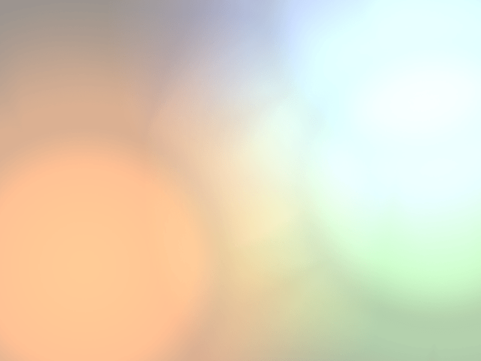

Next add a child :ref:`Sprite <class_Sprite>` to each of the :ref:`Light <class_Light2D>` nodes, and set
the :ref:`Sprite's <class_Sprite>` texture to the `blob image <https://raw.githubusercontent.com/godotengine/godot-demo-projects/master/2d/lights_and_shadows/spot.png>`_. Each of these
should stay centered on the :ref:`Light <class_Light2D>` node. The blob is the image of the light
itself while the :ref:`Light <class_Light2D>` shows the effect that the light has on the scene. The
:ref:`LightOccluder2D's <class_LightOccluder2D>` will treat the position of the light as the center of the :ref:`Light <class_Light2D>`
node, which is why we want the blob to be centered on its parent :ref:`Light <class_Light2D>`.

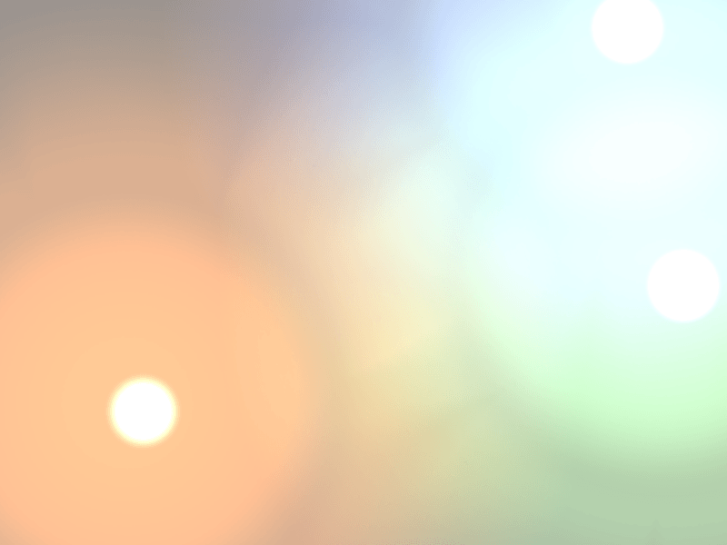

.. note:: At the time of writing, 3.0 is the stable release version. The 3.1 development branch contains
          many changes to the animation system, so the animations in the demo will not be covered here.
          See :ref:`doc_introduction_2d_animation` for more information.

Right now the scene should look too bright. This is because all three lights are adding color to the scene.
This is why the demo uses a :ref:`CanvasModulate <class_CanvasModulate>` in the scene. The
:ref:`CanvasModulate <class_CanvasModulate>` multiples the entire viewport by a specific color.

Add a :ref:`CanvasModulate <class_CanvasModulate>` to the scene and set its color to ``rgb(70, 70, 70)``.
This will make the scene sufficiently dark to see the effects of the lights distinctly.

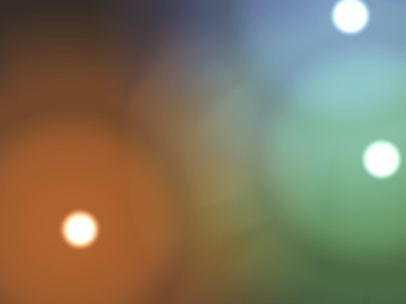

Now we add the shadow casters.

The demo uses a :ref:`Node <class_Node2D>` named "casters" to organize the shadow casters. Add a
:ref:`Node2D <class_Node2D>` to the scene. It will be used to group all the shadow casters together.
This way we can show and hide them all at the same time.

Each shadow caster is made of a :ref:`Sprite <class_Sprite>`, with a :ref:`LightOccluder2D <class_LightOccluder2D>`
child. For the demo the :ref:`Sprite <class_Sprite>` has a texture
set to the `caster image <https://raw.githubusercontent.com/godotengine/godot-demo-projects/master/2d/lights_and_shadows/caster.png>`_ and nothing else. The child :ref:`LightOccluder2D <class_LightOccluder2D>` is where all the magic happens. In a
game the :ref:`Sprite <class_Sprite>` could be more than a black box; it could be an image of whatever object is casting
the shadow: a wall, a magical chest, or anything else.

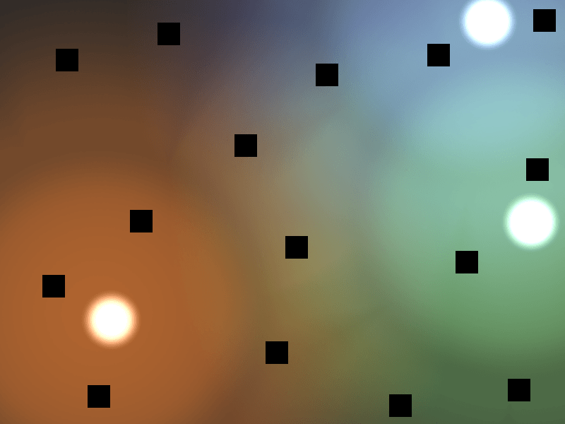

:ref:`LightOccluder2Ds <class_LightOccluder2D>` tell the game what shape the occluder has. They hold
an :ref:`OccluderPolygon2D <class_OccluderPolygon2D>`, which is a container
for a polygon and some other information. For this demo, since our wall is a square, we
set ``Polygon`` to a square. The other default settings are fine.

The first setting, ``Closed`` can be either ``on`` or ``off``. A closed polygon occludes light
coming from all directions. An open polygon only occludes light from one direction

``Cull Mode`` lets you select which direction gets culled. The default is ``Disabled``, meaning the occluder
will cast a shadow no matter which side the light is on. The other two settings ``Clockwise`` and
``Counter-Clockwise`` refer to the winding order of the vertices of the polygon. The winding order
is used to determine which side of the line is inside the polygon. Only outward facing lines cast shadows.

To illustrate the difference, here is an image of a :ref:`LightOccluder2D <class_LightOccluder2D>` with ``Closed``
set to ``off`` in the corresponding :ref:`OccluderPolygon2D <class_OccluderPolygon2D>`, so that the
lines of the polygon can be seen:

.. image:: img/light_shadow_cull_disabled.png

.. note:: ``Cull Mode`` is set to ``Disabled``. All three lines cast shadows.

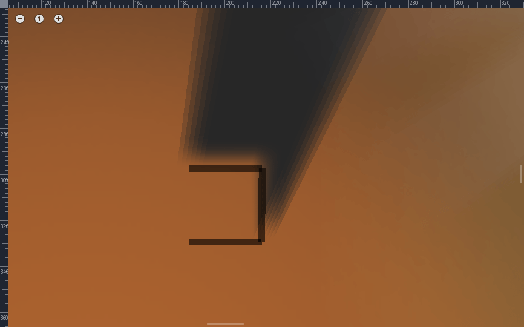

.. note:: ``Cull Mode`` is set to ``Clockwise``. Only the top and right lines cast shadows.

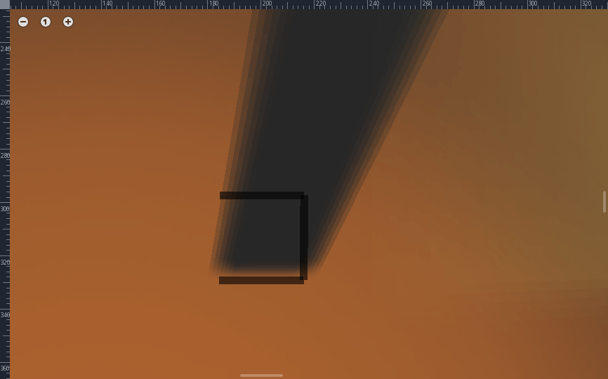

.. note:: ``Cull Mode`` is set to ``Counter-Clockwise``. Only the bottom line casts a shadow.
          If ``Closed`` was set to ``on`` there would be an additional vertical line on the
          left which would cast a shadow as well.

When you have added the :ref:`LightOccluder2Ds <class_LightOccluder2D>` the shadows still won't
appear. You need to go back into the :ref:`Light2Ds <class_Light2D>` and under the Shadow
section set ``Enable`` to ``on``. This turns on shadows with hard edges like in the image below.

To give the shadows that nice, soft edge look we set the variables ``filter``, ``filter smooth``, and
``gradient length``. Godot supports `Percentage Closer Filtering <https://developer.nvidia.com/gpugems/GPUGems/gpugems_ch11.html>`_
(PCF), which takes multiple samples of the shadow map around a pixel and blurs them to create
a smooth shadow effect. The higher the number of samples the smoother the shadow will
look, but the slower it will run. That is why Godot provides 3-13 samples by default and allows you to choose.
The demo uses PCF7.

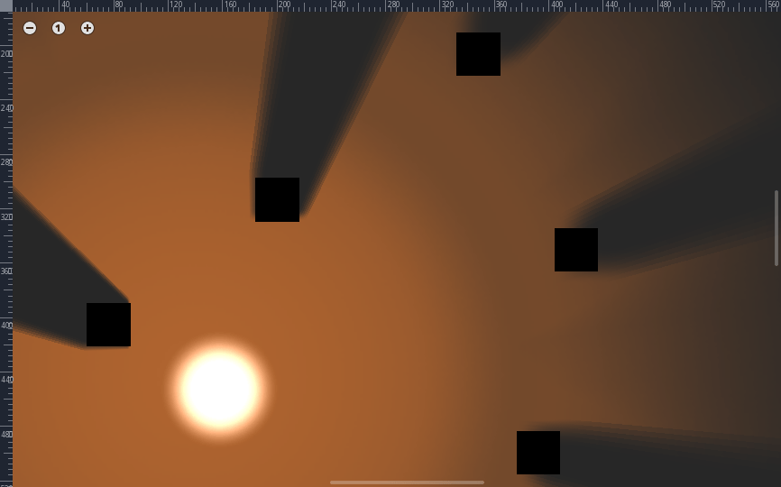

.. note:: This is a shadow rendered with the demo's settings. ``gradient length`` is set
          to ``1.3``, ``filter smooth`` is set to ``11.1``, and ``filter`` is set to ``PCF7``.

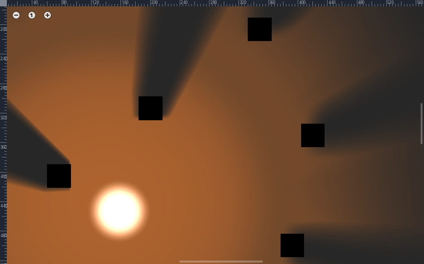

.. note:: ``filter`` is set to ``PCF13``. Notice how the shadow becomes wider, this is because the
          distance between samples is based on the variable ``filter smooth``.

In order to make use of filtering you need to set the ``filter smooth`` variable.
This dictates how far apart the samples are. If you want the soft area to extend quite far, you can increase
the size of ``filter smooth``. However, with few samples and a large filter smooth, you can see lines
forming between the samples.

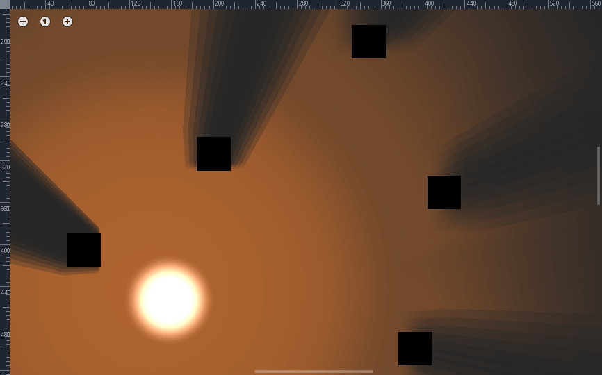

.. note:: ``filter smooth`` is set to ``30``.

The different :ref:`Light <class_Light2D>` nodes in the demo use different values for filter smooth.
Play around with it and see what you like.

.. note:: ``filter smooth`` is set to ``0``.

Lastly, there is the variable ``gradient length``. For some smooth shadows it is preferable not to have the
shadow start immediately on the object, as this produces a hard edge. The gradient length variable creates
a smooth gradient to begin the shadow to reduce the effect of the hard edge.

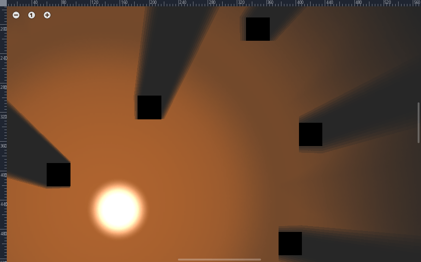

.. note:: ``gradient length`` is set to ``0``.

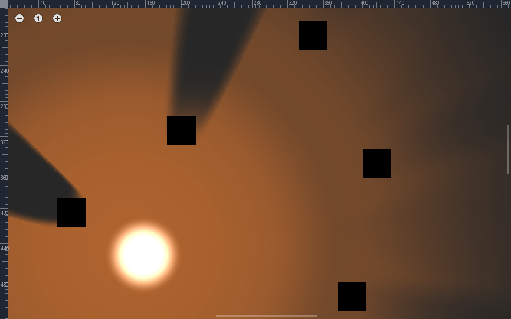

.. note:: ``gradient length`` is set to ``10``.

You will need to play around with the options a bit to find settings that suit your project. There is no right solution
for everyone, which is why Godot provides so much flexibility. Just keep in mind that the higher ``filter``
set the more expensive the shadows will be.
