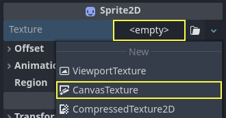

.. _doc_2d_lights_and_shadows:

2D lights and shadows
=====================

Introduction
------------

By default, 2D scenes in Godot are unshaded, with no lights and shadows visible.
While this is fast to render, unshaded scenes can look bland. Godot provides the
ability to use real-time 2D lighting and shadows, which can greatly enhance the
sense of depth in your project.

.. figure:: img/2d_lights_and_shadows_disabled.webp
   :align: center
   :alt: No 2D lights or shadows, scene is unshaded

   No 2D lights or shadows, scene is unshaded

.. figure:: img/2d_lights_and_shadows_enabled_no_shadows.webp
   :align: center
   :alt: 2D lights enabled (without shadows)

   2D lights enabled (without shadows)

.. figure:: img/2d_lights_and_shadows_enabled.webp
   :align: center
   :alt: 2D lights and shadows enabled

   2D lights and shadows enabled

Nodes
-----

There are several nodes involved in a complete 2D lighting setup:

- :ref:`CanvasModulate <class_CanvasModulate>` (to darken the rest of the scene)
- :ref:`PointLight2D <class_PointLight2D>` (for omnidirectional or spot lights)
- :ref:`DirectionalLight2D <class_DirectionalLight2D>` (for sunlight or moonlight)
- :ref:`LightOccluder2D <class_LightOccluder2D>` (for light shadow casters)
- Other 2D nodes that receive lighting, such as Sprite2D or TileMapLayer.

:ref:`CanvasModulate <class_CanvasModulate>` is used to darken the scene by
specifying a color that will act as the base "ambient" color. This is the final
lighting color in areas that are *not* reached by any 2D light. Without a
CanvasModulate node, the final scene would look too bright as 2D lights would
only brighten the existing unshaded appearance (which appears fully lit).

:ref:`Sprite2Ds <class_Sprite2D>` are used to display the textures for the light
blobs, the background, and for the shadow casters.

:ref:`PointLight2Ds <class_PointLight2D>` are used to light the scene. The way a
light typically works is by adding a selected texture over the rest of the scene
to simulate lighting.

:ref:`LightOccluder2Ds <class_LightOccluder2D>` are used to tell the shader
which parts of the scene cast shadows. These occluders can be placed as
independent nodes or can be part of a TileMapLayer node.

The shadows appear only on areas covered by the :ref:`PointLight2D
<class_PointLight2D>` and their direction is based on the center of the
:ref:`Light <class_PointLight2D>`.

.. note::

    The background color does **not** receive any lighting. If you want light to
    be cast on the background, you need to add a visual representation for the
    background, such as a Sprite2D.

    The Sprite2D's **Region** properties can be helpful to quickly create a
    repeating background texture, but remember to also set **Texture > Repeat** to
    **Enabled** in the Sprite2D's properties.

Point lights
------------

Point lights (also called positional lights) are the most common element in 2D
lighting. Point lights can be used to represent light from torches, fire,
projectiles, etc.

PointLight2D offers the following properties to tweak in the inspector:

- **Texture:** The texture to use as a light source. The texture's size
  determines the size of the light. The texture may have an alpha channel, which
  is useful when using Light2D's **Mix** blend mode, but it is not required if
  using the **Add** (default) or **Subtract** blend modes.
- **Offset:** The offset for the light texture. Unlike when you move the light
  node, changing the offset does *not* cause shadows to move.
- **Texture Scale:** The multiplier for the light's size. Higher values will
  make the light extend out further. Larger lights have a higher performance
  cost as they affect more pixels on screen, so consider this before increasing
  a light's size.
- **Height:** The light's virtual height with regards to normal mapping. By
  default, the light is very close to surfaces receiving lights. This will make
  lighting hardly visible if normal mapping is used, so consider increasing this
  value. Adjusting the light's height only makes a visible difference on
  surfaces that use normal mapping.

If you don't have a pre-made texture to use in a light, you can use this "neutral"
point light texture (right-click > **Save Image As…**):

.. figure:: img/2d_lights_and_shadows_neutral_point_light.webp
   :align: center
   :alt: Neutral point light texture

   Neutral point light texture

If you need different falloff, you can procedurally create a texture by assigning
a **New GradientTexture2D** on the light's **Texture** property. After creating
the resource, expand its **Fill** section and set the fill mode to **Radial**.
You will then have to adjust the gradient itself to start from opaque white to
transparent white, and move its starting location to be in the center.

Directional light
-----------------

New in Godot 4.0 is the ability to have directional lighting in 2D. Directional
lighting is used to represent sunlight or moonlight. Light rays are casted
parallel to each other, as if the sun or moon was infinitely far away from the
surface that is receiving the light.

DirectionalLight2D offers the following properties:

- **Height:** The light's virtual height with regards to normal mapping (``0.0``
  = parallel to surfaces, ``1.0`` = perpendicular to surfaces). By default, the
  light is fully parallel with the surfaces receiving lights. This will make
  lighting hardly visible if normal mapping is used, so consider increasing this
  value. Adjusting the light's height only makes a visual difference on surfaces
  that use normal mapping. **Height** does not affect shadows' appearance.
- **Max Distance:** The maximum distance from the camera center objects can be
  before their shadows are culled (in pixels). Decreasing this value can prevent
  objects located outside the camera from casting shadows (while also improving
  performance). Camera2D zoom is not taken into account by **Max Distance**,
  which means that at higher zoom values, shadows will appear to fade out sooner
  when zooming onto a given point.

.. note::

    Directional shadows will always appear to be infinitely long, regardless
    of the value of the **Height** property. This is a limitation of the shadow
    rendering method used for 2D lights in Godot.

    To have directional shadows that are not infinitely long, you should disable
    shadows in the DirectionalLight2D and use a custom shader that reads from
    the 2D signed distance field instead. This distance field is automatically
    generated from LightOccluder2D nodes present in the scene.

Common light properties
-----------------------

Both PointLight2D and DirectionalLight2D offer common properties, which are part
of the Light2D base class:

- **Enabled:** Allows toggling the light's visibility. Unlike hiding the light
  node, disabling this property will not hide the light's children.
- **Editor Only:** If enabled, the light is only visible within the editor. It
  will be automatically disabled in the running project.
- **Color:** The light's color.
- **Energy:** The light's intensity multiplier. Higher values result in a brighter light.
- **Blend Mode:** The blending formula used for light computations. The default
  **Add** is suited for most use cases. **Subtract** can be used for negative
  lights, which are not physically accurate but can be used for special effects.
  The **Mix** blend mode mixes the value of pixels corresponding to the light's
  texture with the values of pixels under it by linear interpolation.
- **Range > Z Min:** The lowest Z index affected by the light.
- **Range > Z Max:** The highest Z index affected by the light.
- **Range > Layer Min:** The lowest visual layer affected by the light.
- **Range > Layer Max:** The highest visual layer affected by the light.
- **Range > Item Cull Mask:** Controls which nodes receive light from this node,
  depending on the other nodes' enabled visual layers **Occluder Light Mask**.
  This can be used to prevent certain objects from receiving light.

.. _doc_2d_lights_and_shadows_setting_up_shadows:

Setting up shadows
------------------

After enabling the **Shadow > Enabled** property on a PointLight2D or
DirectionalLight2D node, you will not see any visual difference initially. This
is because no nodes in your scene have any *occluders* yet, which are used as a
basis for shadow casting.

For shadows to appear in the scene, LightOccluder2D nodes must be added to the
scene. These nodes must also have occluder polygons that are designed to match
the sprite's outline.

Along with their polygon resource (which must be set to have any visual effect),
LightOccluder2D nodes have 2 properties:

- **SDF Collision:** If enabled, the occluder will be part of a real-time
  generated *signed distance field* that can be used in custom shaders. When not
  using custom shaders that read from this SDF, enabling this makes no visual
  difference and has no performance cost, so this is enabled by default for
  convenience.
- **Occluder Light Mask:** This is used in tandem with PointLight2D and
  DirectionalLight2D's **Shadow > Item Cull Mask** property to control which
  objects cast shadows for each light. This can be used to prevent specific
  objects from casting shadows.

There are two ways to create light occluders:

Automatically generating a light occluder
~~~~~~~~~~~~~~~~~~~~~~~~~~~~~~~~~~~~~~~~~

Occluders can be created automatically from Sprite2D nodes by selecting the
node, clicking the **Sprite2D** menu at the top of the 2D editor then choosing
**Create LightOccluder2D Sibling**.

In the dialog that appears, an outline will surround your sprite's edges. If the
outline matches the sprite's edges closely, you can click **OK**. If the outline
is too far away from the sprite's edges (or is "eating" into the sprite's
edges), adjust **Grow (pixels)** and **Shrink (pixels)**, then click **Update
Preview**. Repeat this operation until you get satisfactory results.

Manually drawing a light occluder
~~~~~~~~~~~~~~~~~~~~~~~~~~~~~~~~~

Create a LightOccluder2D node, then select the node and click the "+" button at
the top of the 2D editor. When asked to create a polygon resource, answer
**Yes**. You can then start drawing an occluder polygon by clicking to create
new points. You can remove existing points by right-clicking them, and you can
create new points from the existing line by clicking on the line then dragging.

The following properties can be adjusted on 2D lights that have shadows enabled:

- **Color:** The color of shaded areas. By default, shaded areas are fully
  black, but this can be changed for artistic purposes. The color's alpha
  channel controls how much the shadow is tinted by the specified color.
- **Filter:** The filter mode to use for shadows. The default **None** is the
  fastest to render, and is well suited for games with a pixel art aesthetic
  (due to its "blocky" visuals). If you want a soft shadow, use **PCF5**
  instead. **PCF13** is even softer, but is the most demanding to render. PCF13
  should only be used for a few lights at once due to its high rendering cost.
- **Filter Smooth:** Controls how much softening is applied to shadows when
  **Filter** is set to **PCF5** or **PCF13**. Higher values result in a softer
  shadow, but may cause banding artifacts to be visible (especially with PCF5).
- **Item Cull Mask:** Controls which LightOccluder2D nodes cast shadows,
  depending on their respective **Occluder Light Mask** properties.

.. figure:: img/2d_lights_and_shadows_hard_shadow.webp
   :align: center
   :alt: Hard shadows

   Hard shadows

.. figure:: img/2d_lights_and_shadows_soft_shadow.webp
   :align: center
   :alt: Soft shadows (PCF13, Filter Smooth 1.5)

   Soft shadows (PCF13, Filter Smooth 1.5)

.. figure:: img/2d_lights_and_shadows_soft_shadow_streaks.webp
   :align: center
   :alt: Soft shadows with streaking artifacts due to Filter Smooth being too high (PCF5, Filter Smooth 4)

   Soft shadows with streaking artifacts due to Filter Smooth being too high (PCF5, Filter Smooth 4)

Normal and specular maps
------------------------

Normal maps and specular maps can greatly enhance the sense of depth of your 2D
lighting. Similar to how these work in 3D rendering, normal maps can help make
lighting look less flat by varying its intensity depending on the direction of
the surface receiving light (on a per-pixel basis). Specular maps further help
improve visuals by making some of the light reflect back to the viewer.

Both PointLight2D and DirectionalLight2D support normal mapping and specular
mapping. Since Godot 4.0, normal and specular maps can be assigned to any 2D
element, including nodes that inherit from Node2D or Control.

A normal map represents the direction in which each pixel is "pointing" towards.
This information is then used by the engine to correctly apply lighting to 2D
surfaces in a physically plausible way. Normal maps are typically created from
hand-painted height maps, but they can also be automatically generated from
other textures.

A specular map defines how much each pixel should reflect light (and in which
color, if the specular map contains color). Brighter values will result in a
brighter reflection at that given spot on the texture. Specular maps are
typically created with manual editing, using the diffuse texture as a base.

.. tip::

    If you don't have normal or specular maps for your sprites, you can generate
    them using the free and open source `Laigter <https://azagaya.itch.io/laigter>`__
    tool.

To set up normal maps and/or specular maps on a 2D node, create a new
CanvasTexture resource for the property that draws the node's texture. For
example, on a Sprite2D:

   Creating a CanvasTexture resource for a Sprite2D node

Expand the newly created resource. You can find several properties you will need
to adjust:

- **Diffuse > Texture:** The base color texture. In this property, load the
  texture you're using for the sprite itself.
- **Normal Map > Texture:** The normal map texture. In this property, load a
  normal map texture you've generated from a height map (see the tip above).
- **Specular > Texture:** The specular map texture, which controls the specular
  intensity of each pixel on the diffuse texture. The specular map is usually
  grayscale, but it can also contain color to multiply the color of reflections
  accordingly. In this property, load a specular map texture you've created (see
  the tip above).
- **Specular > Color:** The color multiplier for specular reflections.
- **Specular > Shininess:** The specular exponent to use for reflections. Lower
  values will increase the brightness of reflections and make them more diffuse,
  while higher values will make reflections more localized. High values are more
  suited for wet-looking surfaces.
- **Texture > Filter:** Can be set to override the texture filtering mode,
  regardless of what the node's property is set to (or the
  **Rendering > Textures > Canvas Textures > Default Texture Filter** project
  setting).
- **Texture > Repeat:** Can be set to override the texture filtering mode,
  regardless of what the node's property is set to (or the
  **Rendering > Textures > Canvas Textures > Default Texture Repeat** project
  setting).

After enabling normal mapping, you may notice that your lights appear to be
weaker. To resolve this, increase the **Height** property on your PointLight2D
and DirectionalLight2D nodes. You may also want to increase the lights's
**Energy** property slightly to get closer to how your lighting's intensity
looked prior to enabling normal mapping.

Using additive sprites as a faster alternative to 2D lights
-----------------------------------------------------------

If you run into performance issues when using 2D lights, it may be worth
replacing some of them with Sprite2D nodes that use additive blending. This is
particularly suited for short-lived dynamic effects, such as bullets or explosions.

Additive sprites are much faster to render, since they don't need to go through
a separate rendering pipeline. Additionally, it is possible to use this approach
with AnimatedSprite2D (or Sprite2D + AnimationPlayer), which allows for animated
2D "lights" to be created.

However, additive sprites have a few downsides compared to 2D lights:

- The blending formula is inaccurate compared to "actual" 2D lighting. This is
  usually not a problem in sufficiently lit areas, but this prevents additive
  sprites from correctly lighting up areas that are fully dark.
- Additive sprites cannot cast shadows, since they are not lights.
- Additive sprites ignore normal and specular maps used on other sprites.

To display a sprite with additive blending, create a Sprite2D node and assign a
texture to it. In the inspector, scroll down to the **CanvasItem > Material**
section, unfold it and click the dropdown next to the **Material** property.
Choose **New CanvasItemMaterial**, click the newly created material to edit it,
then set **Blend Mode** to **Add**.
