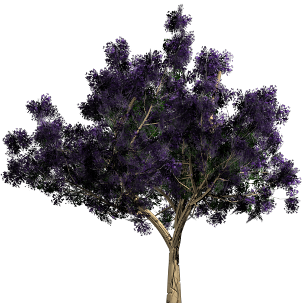
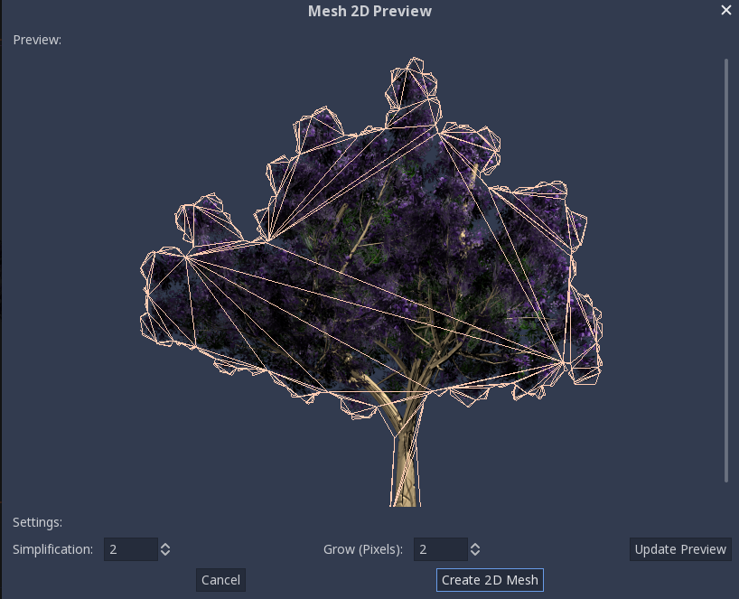
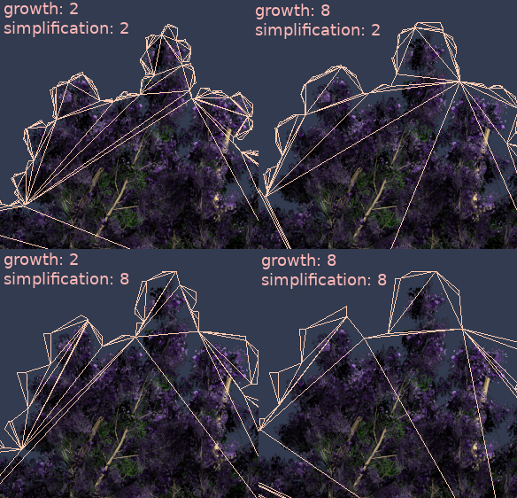
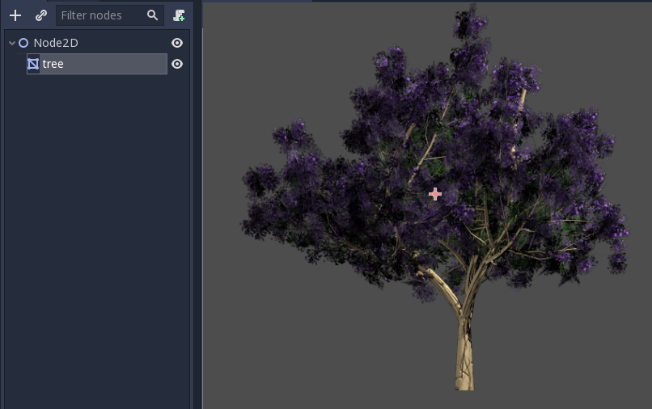

:article_outdated: True

.. _doc_2d_meshes:

2D meshes
=========

Introduction
------------

In 3D, meshes are used to display the world. In 2D, they are rare as images are used more often.
Godot's 2D engine is a pure two-dimensional engine, so it can't really display 3D meshes directly (although it can be done
via ``Viewport`` and ``ViewportTexture``).

.. seealso:: If you are interested in displaying 3D meshes on a 2D viewport, see the :ref:`doc_viewport_as_texture` tutorial.

2D meshes are meshes that contain two-dimensional geometry (Z can be omitted or ignored) instead of 3D.
You can experiment creating them yourself using ``SurfaceTool`` from code and displaying them in a ``MeshInstance2D`` node.

Currently, the only way to generate a 2D mesh within the editor is by either importing an OBJ file as a mesh, or converting it from a Sprite2D.

Optimizing pixels drawn
-----------------------

This workflow is useful for optimizing 2D drawing in some situations. When drawing large images with transparency, Godot will draw the whole quad to the screen. The large transparent areas will still be drawn.

This can affect performance, especially on mobile devices, when drawing very large images (generally screen sized),
or layering multiple images on top of each other with large transparent areas (for example, when using ``ParallaxBackground``).

Converting to a mesh will ensure that only the opaque parts will be drawn and the rest will be ignored.

Converting Sprite2Ds to 2D meshes
---------------------------------

You can take advantage of this optimization by converting a ``Sprite2D`` to a ``MeshInstance2D``.
Start with an image that contains large amounts of transparency on the edges, like this tree:

Put it in a ``Sprite2D`` and select "Convert to 2D Mesh" from the menu:

.. image:: img/mesh2d2.png

A dialog will appear, showing a preview of how the 2D mesh will be created:

The default values are good enough for many cases, but you can change growth and simplification according to your needs:

Finally, push the :button:`Convert 2D Mesh` button and your Sprite2D will be replaced:

