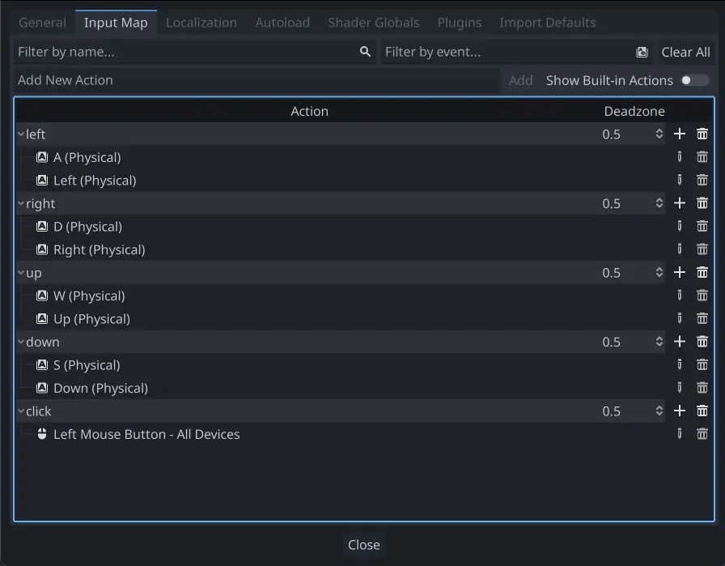
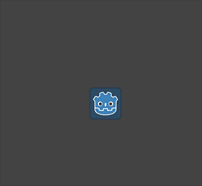

.. _doc_2d_movement:

2D movement overview
====================

Introduction
------------

Every beginner has been there: "How do I move my character?" Depending on the
style of game you're making, you may have special requirements, but in general
the movement in most 2D games is based on a small number of designs.

We'll use :ref:`CharacterBody2D <class_CharacterBody2D>` for these examples,
but the principles will apply to other node types (Area2D, RigidBody2D) as well.

.. _doc_2d_movement_setup:

Setup
-----

Each example below uses the same scene setup. Start with a ``CharacterBody2D`` with two
children: ``Sprite2D`` and ``CollisionShape2D``. You can use the Godot icon ("icon.png")
for the Sprite2D's texture or use any other 2D image you have.

Open ``Project -> Project Settings`` and select the "Input Map" tab. Add the following
input actions (see :ref:`InputEvent <doc_inputevent>` for details):

8-way movement
--------------

In this scenario, you want the user to press the four directional keys (up/left/down/right
or W/A/S/D) and move in the selected direction. The name "8-way movement" comes from the
fact that the player can move diagonally by pressing two keys at the same time.

Add a script to the character body and add the following code:

.. tabs::
 .. code-tab:: gdscript GDScript

    extends CharacterBody2D

    @export var speed = 400

    func get_input():
        var input_direction = Input.get_vector("left", "right", "up", "down")
        velocity = input_direction * speed

    func _physics_process(delta):
        get_input()
        move_and_slide()

 .. code-tab:: csharp

    using Godot;

    public partial class Movement : CharacterBody2D
    {
        [Export]
        public int Speed { get; set; } = 400;

        public void GetInput()
        {

            Vector2 inputDirection = Input.GetVector("left", "right", "up", "down");
            Velocity = inputDirection * Speed;
        }

        public override void _PhysicsProcess(double delta)
        {
            GetInput();
            MoveAndSlide();
        }
    }

In the ``get_input()`` function, we use :ref:`Input <class_Input>` ``get_vector()`` to check for the
four key events and sum return a direction vector.

We can then set our velocity by multiplying this direction vector, which has a
length of ``1``, by our desired speed.

.. tip:: If you've never used vector math before, or need a refresher,
         you can see an explanation of vector usage in Godot at :ref:`doc_vector_math`.

.. note::

    If the code above does nothing when you press the keys, double-check that
    you've set up input actions correctly as described in the
    :ref:`doc_2d_movement_setup` part of this tutorial.

Rotation + movement
-------------------

This type of movement is sometimes called "Asteroids-style" because it resembles
how that classic arcade game worked. Pressing left/right rotates the character,
while up/down moves it forward or backward in whatever direction it's facing.

.. image:: img/movement_rotate1.gif

.. tabs::
 .. code-tab:: gdscript GDScript

    extends CharacterBody2D

    @export var speed = 400
    @export var rotation_speed = 1.5

    var rotation_direction = 0

    func get_input():
        rotation_direction = Input.get_axis("left", "right")
        velocity = transform.x * Input.get_axis("down", "up") * speed

    func _physics_process(delta):
        get_input()
        rotation += rotation_direction * rotation_speed * delta
        move_and_slide()

 .. code-tab:: csharp

    using Godot;

    public partial class Movement : CharacterBody2D
    {
        [Export]
        public int Speed { get; set; } = 400;

        [Export]
        public float RotationSpeed { get; set; } = 1.5f;

        private float _rotationDirection;

        public void GetInput()
        {
            _rotationDirection = Input.GetAxis("left", "right");
            Velocity = Transform.X * Input.GetAxis("down", "up") * Speed;
        }

        public override void _PhysicsProcess(double delta)
        {
            GetInput();
            Rotation += _rotationDirection * RotationSpeed * (float)delta;
            MoveAndSlide();
        }
    }

Here we've added two variables to track our rotation direction and speed.
The rotation is applied directly to the body's ``rotation`` property.

To set the velocity, we use the body's ``transform.x`` which is a vector pointing
in the body's "forward" direction, and multiply that by the speed.

Rotation + movement (mouse)
---------------------------

This style of movement is a variation of the previous one. This time, the direction
is set by the mouse position instead of the keyboard. The character will always
"look at" the mouse pointer. The forward/back inputs remain the same, however.

.. image:: img/movement_rotate2.gif

.. tabs::
 .. code-tab:: gdscript GDScript

    extends CharacterBody2D

    @export var speed = 400

    func get_input():
        look_at(get_global_mouse_position())
        velocity = transform.x * Input.get_axis("down", "up") * speed

    func _physics_process(delta):
        get_input()
        move_and_slide()

 .. code-tab:: csharp

    using Godot;

    public partial class Movement : CharacterBody2D
    {
        [Export]
        public int Speed { get; set; } = 400;

        public void GetInput()
        {
            LookAt(GetGlobalMousePosition());
            Velocity = Transform.X * Input.GetAxis("down", "up") * Speed;
        }

        public override void _PhysicsProcess(double delta)
        {
            GetInput();
            MoveAndSlide();
        }
    }

Here we're using the :ref:`Node2D <class_Node2D>` ``look_at()`` method to
point the player towards the mouse's position. Without this function, you
could get the same effect by setting the angle like this:

.. tabs::
 .. code-tab:: gdscript GDScript

    rotation = get_global_mouse_position().angle_to_point(position)

 .. code-tab:: csharp

    var rotation = GetGlobalMousePosition().AngleToPoint(Position);

Click-and-move
--------------

This last example uses only the mouse to control the character. Clicking
on the screen will cause the player to move to the target location.

.. tabs::
 .. code-tab:: gdscript GDScript

    extends CharacterBody2D

    @export var speed = 400

    var target = position

    func _input(event):
        if event.is_action_pressed("click"):
            target = get_global_mouse_position()

    func _physics_process(delta):
        velocity = position.direction_to(target) * speed
        # look_at(target)
        if position.distance_to(target) > 10:
            move_and_slide()

 .. code-tab:: csharp

    using Godot;

    public partial class Movement : CharacterBody2D
    {
        [Export]
        public int Speed { get; set; } = 400;

        private Vector2 _target;

        public override void _Input(InputEvent @event)
        {
            if (@event.IsActionPressed("click"))
            {
                _target = GetGlobalMousePosition();
            }
        }

        public override void _PhysicsProcess(double delta)
        {
            Velocity = Position.DirectionTo(_target) * Speed;
            // LookAt(_target);
            if (Position.DistanceTo(_target) > 10)
            {
                MoveAndSlide();
            }
        }
    }

Note the ``distance_to()`` check we make prior to movement. Without this test,
the body would "jitter" upon reaching the target position, as it moves
slightly past the position and tries to move back, only to move too far and
repeat.

Uncommenting the ``look_at()`` line will also turn the body to point in its
direction of motion if you prefer.

.. tip:: This technique can also be used as the basis of a "following" character.
         The ``target`` position can be that of any object you want to move to.

Summary
-------

You may find these code samples useful as starting points for your own projects.
Feel free to use them and experiment with them to see what you can make.

You can download this sample project here:
`2d_movement_starter.zip <https://github.com/godotengine/godot-docs-project-starters/releases/download/latest-4.x/2d_movement_starter.zip>`_
