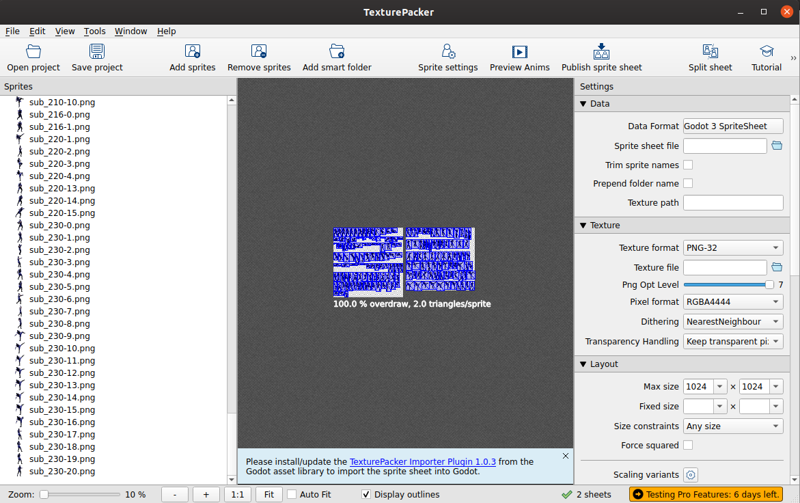
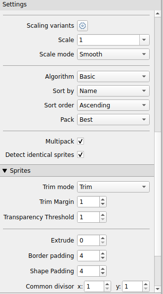
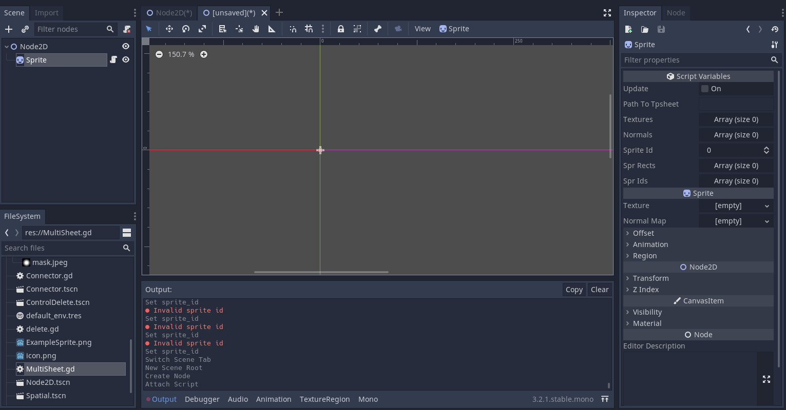
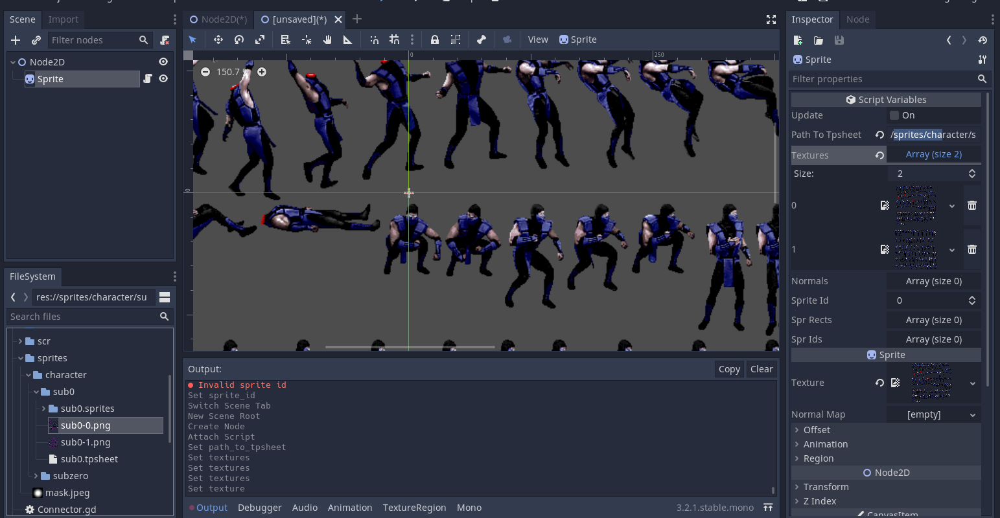
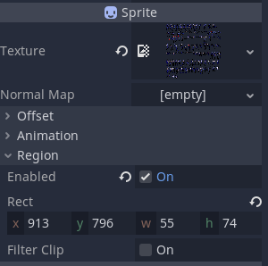
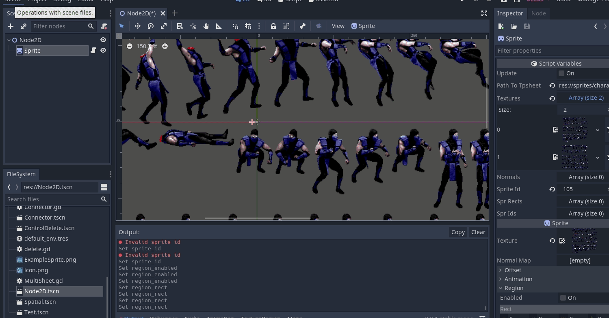

.. _doc_2d_multi_sprite_sheet:

2D Multiple Sprite Sheets
===================

Introduction
------------

In this tutorial, you'll learn how to deal with a scenerio where you have multiple spritesheets
and normal maps for a single character in your 2d game.

.. note:: The spritesheets used here does not need to be aligned. 

Tools used in this tutorial
-------------------------------------

- TexturePacker (Trial Test version)
- MultiSheet plugin (Github latest version)

.. note:: For this tutorial you must have to know how to use TP(Texture Packer)
	  and have Multisheet plugin activated

Files for Tutorial Following:
-------------------------------------

:download:`multi_sheet.zip <files/multi_sheet.zip>` - Sprites
https://github.com/nonunknown/multi-sheet - Script

Generating SpriteSheets:
-------------------------------------
Why should you use spritesheets instead of single sprites? Simple less draw calls in your game
if you don't know what draw call is, I suggest you to make some research on it.
Okay, with sprites in hand:

* Open TP
* Click Add Sprites
* Make sure your settings is the same as the following images

.. note:: Only change values if you know what you are doing

With everything done click Pulish sprite sheet, and select a folder into your godot project

Inside Godot:
-------------------------------------
Make sure your generated spritesheets and the tp file generated by TexturePacker are inside your project.
Create a Node2D scene with a sprite and attach the MultiSheet.gd at the sprite node:

.. note:: After attaching the MultiSheet.gd since its a tool, save the scene
	  ,close it and open again to take effect.

Now lets fill some parameters:
* For a better description take a look at the github repo's multisheet mentioned above.
* Path to Tpsheet is where your .tpsheet file is located
* Textures are all our generated spritesheets (in numerical order)
* Make sure to set the spritesheet0 (in this tutorial: sub0-0.png) to be in the Sprite/Texture
 

* Enable Region

* Click at **Update** in MultiSheet and change **sprite_id**, if you've followed this tutorial correctly the result will be something like this:

Now just use AnimationTree node changing sprite_id, adjusting position and you're done.

Summary
-------

From now on, you should be able to deal with multiple png files for a single character in your
game. Any doubt you can find me in discord or github by the nickname: @nonunknown
