.. _doc_2d_parallax:

2D Parallax
===========

Introduction
------------

Parallax is an effect used to simulate depth by having textures move at different speeds relative to the camera. Godot
provides the :ref:`Parallax2D<class_parallax2d>` node to achieve this effect. It can still be easy to get tripped
up though, so this page provides in-depth descriptions of some properties and how to fix some common mistakes.

.. note::

    This page covers how to use :ref:`Parallax2D<class_parallax2d>`, which is
    recommended to use over the :ref:`ParallaxLayer<class_parallaxlayer>` and
    :ref:`ParallaxBackground<class_parallaxbackground>` nodes.

Scroll scale
------------

The backbone of the parallax effect is the :ref:`scroll_scale <class_parallax2d_property_scroll_scale>` property.
It works as a scroll-speed multiplier, allowing layers to move at a different speed than the camera for each axis set.
A value of 1 makes the parallax node scroll at the same speed as the camera. If you want your image to look further away
when scrolling, use a value lower than 1, with 0 bringing it to a complete stop. If you want something to appear closer
to the camera, use a value higher than 1, making it scroll faster.

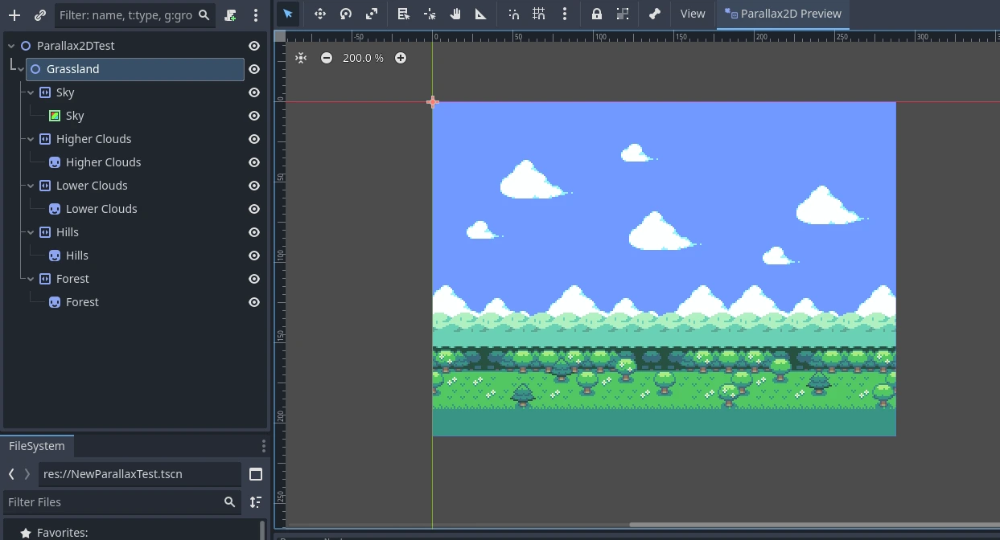

The scene above is comprised of five layers. Some good :ref:`scroll_scale <class_parallax2d_property_scroll_scale>`
values might be:

- ``(0.7, 1)`` - Forest
- ``(0.5, 1)`` - Hills
- ``(0.3, 1)`` - Lower Clouds
- ``(0.2, 1)`` - Higher Clouds
- ``(0.1, 1)`` - Sky

The video below displays how these values affect scrolling while in-game:

.. video:: video/2d_parallax_scroll_scale.webm
   :alt: A scene with five layers scrolling at different speeds
   :autoplay:
   :loop:
   :muted:

Infinite repeat
---------------

:ref:`Parallax2D<class_parallax2d>` provides a bonus effect that gives textures the illusion of repeating infinitely.
:ref:`repeat_size<class_parallax2d_property_repeat_size>` tells the node to snap its position forward or back when the
camera scrolls by the set value. This effect is achieved by adding a single repeat to all the child canvas items offset
by the value. While the camera scrolls between the image and its repeat, it invisibly snaps back giving the appearance
of a looping image.

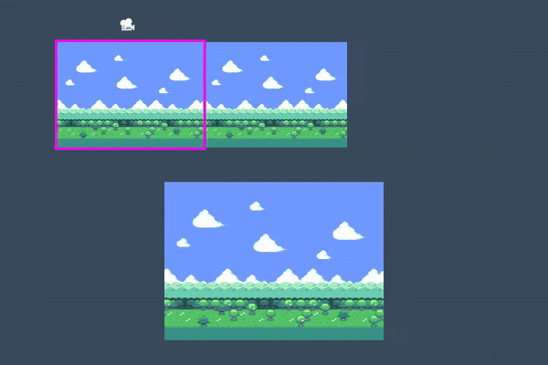

Being a delicate effect, it's easy for unfamiliar users to make mistakes with their setup. Let's go over the "how" and
"why" of a few common problems users encounter.

Poor sizing
~~~~~~~~~~~

The infinite repeat effect is easiest to work with when you have an image designed to repeat seamlessly and is the same
size or larger than your viewport **before** setting the :ref:`repeat_size<class_parallax2d_property_repeat_size>`. If
you aren't able to obtain assets that are designed for this task, there are some other things you can do to better
prepare your image in regards to size.

Here is an example of a texture that is too small for its viewport:

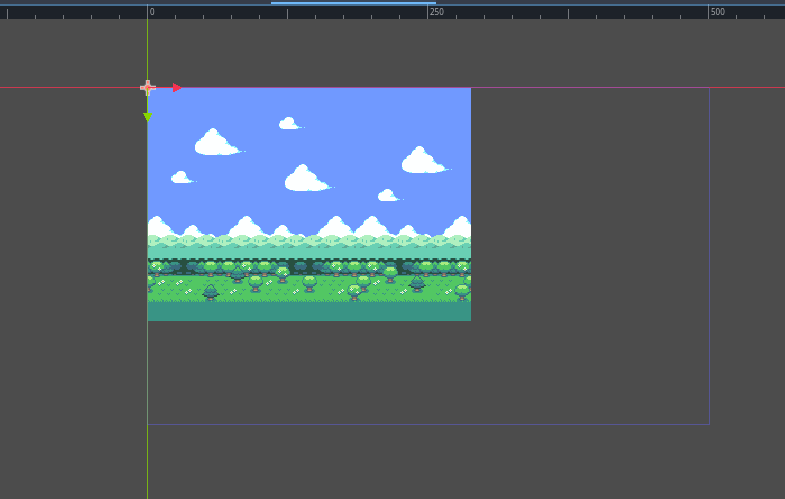

We can see that the viewport size is 500x300 but the texture is 288x208. If we set the
:ref:`repeat_size<class_parallax2d_property_repeat_size>` to the size of our image, the infinite repeat effect doesn't
scroll properly because the original texture doesn't cover the viewport. If we set the
:ref:`repeat_size<class_parallax2d_property_repeat_size>` to the size of the viewport, we have a large gap. What can we
do?

Make the viewport smaller
^^^^^^^^^^^^^^^^^^^^^^^^^

The simplest answer is to make the viewport the same size or smaller than your textures. 
In **Project Settings > Display > Window**, change the
:ref:`Viewport Width<class_ProjectSettings_property_display/window/size/viewport_width>`
and :ref:`Viewport Height<class_ProjectSettings_property_display/window/size/viewport_height>`
settings to match your background.

Scale the Parallax2D
^^^^^^^^^^^^^^^^^^^^

If you're not aiming for a pixel-perfect style, or don't mind a little blurriness, you may opt to scale the textures
larger to fit your screen. Set the :ref:`scale<class_node2d_property_scale>` of the :ref:`Parallax2D<class_parallax2d>`,
and all child textures scale with it.

Scale the child nodes
^^^^^^^^^^^^^^^^^^^^^

Similar to scaling the :ref:`Parallax2D<class_parallax2d>`, you can scale your :ref:`Sprite2D<class_sprite2d>` nodes to
be large enough to cover the screen. Keep in mind that some settings like
:ref:`Parallax2D.repeat_size<class_parallax2d_property_repeat_size>` and
:ref:`Sprite2D.region_rect<class_sprite2d_property_region_rect>` do not take scaling into account, so it's necessary to
adjust these values based on the scale.

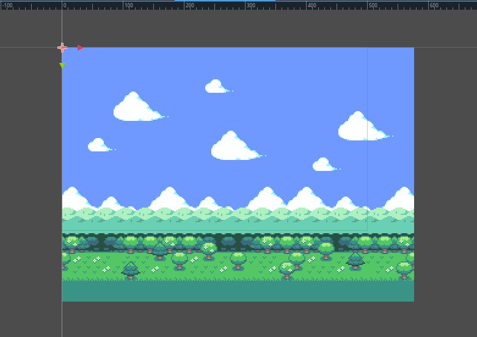

Repeat the textures
^^^^^^^^^^^^^^^^^^^

You can also start off on the right foot by preparing child nodes earlier in the process. If you have a
:ref:`Sprite2D<class_sprite2d>` you'd like to repeat, but is too small, you can do the following to repeat it:

- set :ref:`texture_repeat<class_canvasitem_property_texture_repeat>` to :ref:`CanvasItem.TEXTURE_REPEAT_ENABLED<class_canvasitem_constant_TEXTURE_REPEAT_ENABLED>`
- set :ref:`region_enabled<class_sprite2d_property_region_enabled>` to ``true``
- set the :ref:`region_rect<class_sprite2d_property_region_rect>` to a multiple of the size of your texture large enough to cover the viewport.

Below, you can see that repeating the image twice makes it large enough to cover the screen.

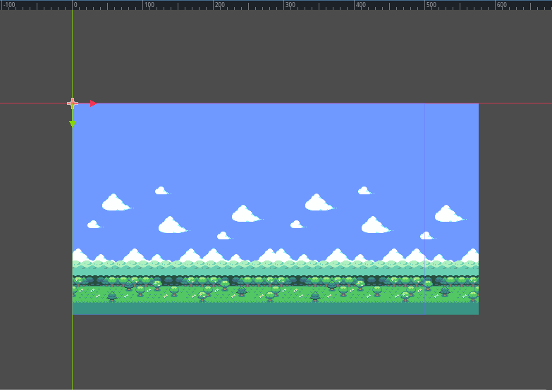

Poor positioning
~~~~~~~~~~~~~~~~

It's common to see users mistakenly set all of their textures to be centered at ``(0,0)``:

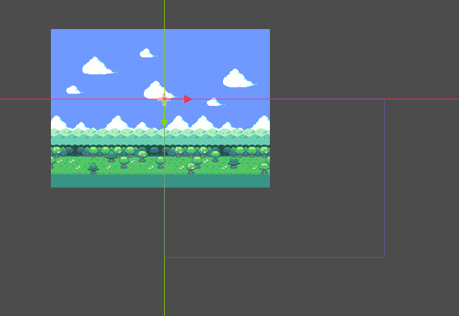

This creates problems with the infinite repeat effect and should be avoided. The "infinite repeat canvas" starts at
``(0,0)`` and expands down and to the right to the size of the :ref:`repeat_size<class_parallax2d_property_repeat_size>`
value.

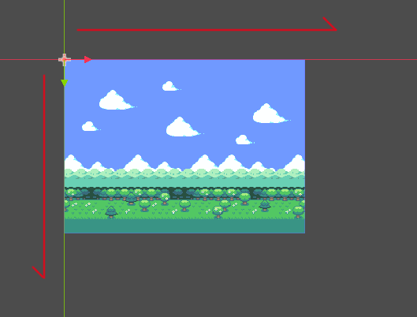

If the textures are centered on the ``(0,0)`` crossing, the infinite repeat canvas is only partly covered, so it
only partly repeats.

Would increasing ``repeat_times`` fix this?
^^^^^^^^^^^^^^^^^^^^^^^^^^^^^^^^^^^^^^^^^^^^^^

Increasing :ref:`repeat_times<class_parallax2d_property_repeat_times>` technically *would* work in some scenarios, but
is a brute force solution and not the problem it is designed to solve (we'll go over this in a bit). A better fix is to
understand how the repeat effect works and set up the parallax textures appropriately to begin with.

First, check to see if any textures are spilling over onto the negative parts of the canvas. Make sure the textures
used in the parallax nodes fit inside the "infinite repeat canvas" starting at ``(0,0)``. That way, if
:ref:`Parallax2D.repeat_size<class_parallax2d_property_repeat_size>` is set correctly, it should look something like
this, with one single loop of the image the same size or larger than the viewport:

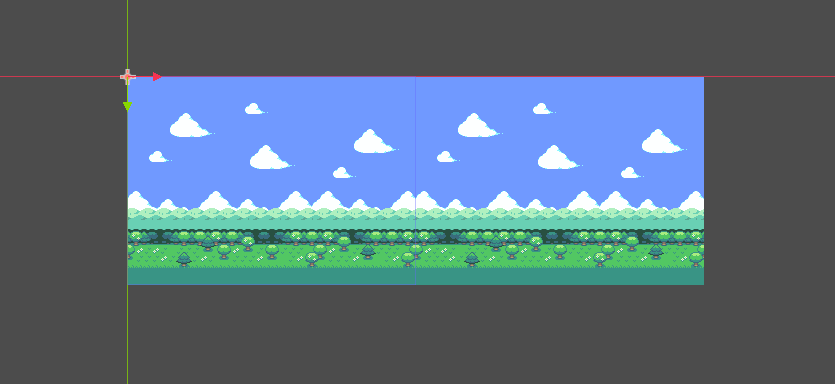

If you think of how the image scrolls across the screen, it starts by displaying what's inside the red rectangle
(determined by :ref:`repeat_size<class_parallax2d_property_repeat_size>`), and when it reaches what's inside the yellow
rectangle it zips the image forward to give the illusion of scrolling forever.

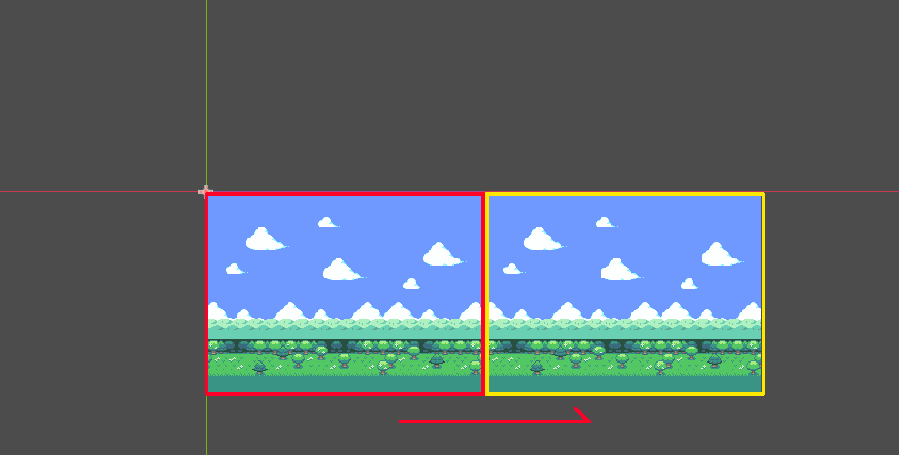

If you have the image positioned away from the "infinite repeat canvas", when the camera reaches the yellow rectangle,
half of the image is cut off before it jumps forward like in the image below:

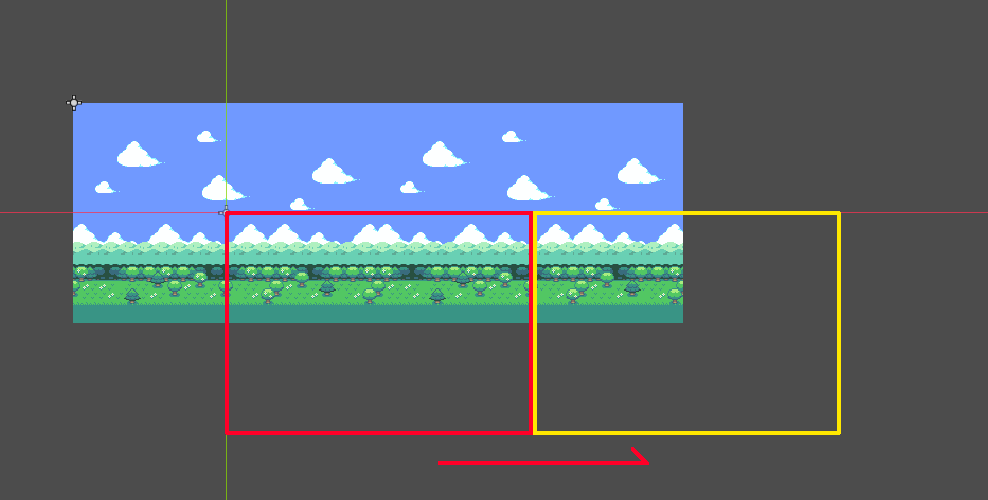

Scroll offset
-------------

If your parallax textures are already working correctly, but you prefer it to start at a different point,
:ref:`Parallax2D<class_parallax2d>` comes with a :ref:`scroll_offset<class_parallax2d_property_scroll_offset>` property
used to offset where the infinite repeat canvas starts. As an example, if your image is 288x208, setting
the :ref:`scroll_offset<class_parallax2d_property_scroll_offset>` to ``(-144,0)`` or ``(144,0)`` allows it to begin
halfway across the image.

Repeat times
------------

Ideally, following this guide, your parallax textures are large enough to cover the screen even when zoomed out.
Until now, we have had a perfectly fitting 288x208 texture inside of a 288x208 viewport. However, problems 
occur when we zoom out by setting the :ref:`Camera2D.zoom<class_camera2d_property_zoom>` to ``(0.5, 0.5)``:

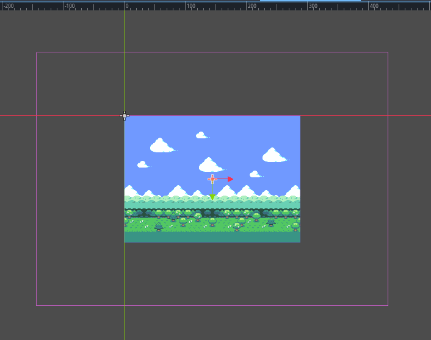

Even though everything is correctly set for the viewport at the default zoom level, zooming out makes it smaller than
the viewport, breaking the infinite repeat effect. This is where
:ref:`repeat_times<class_parallax2d_property_repeat_times>` can help out. Setting a value of ``3`` (one extra
repeat behind and in front), it is now large enough to accommodate the infinite repeat effect.

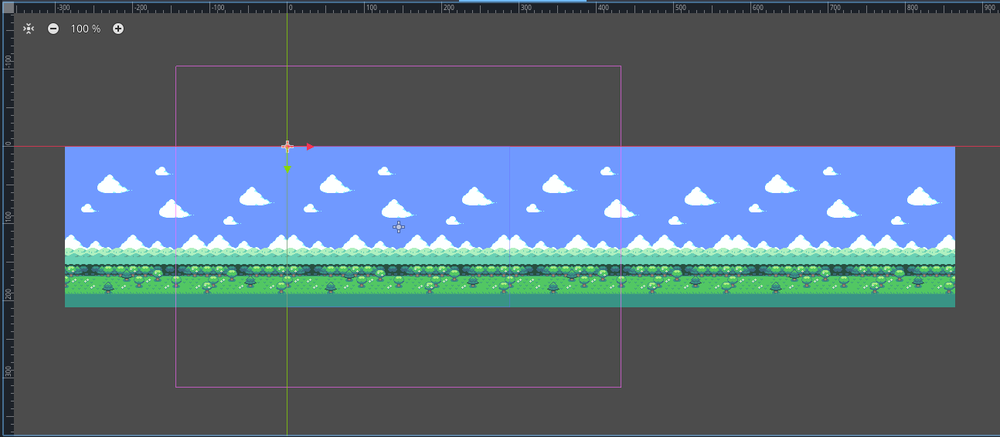

If these textures were meant to be repeated vertically, we would have specified a ``y`` value for the
:ref:`repeat_size<class_parallax2d_property_repeat_size>`. The
:ref:`repeat_times<class_parallax2d_property_repeat_times>` would automatically add a repeat above and below as well.
This is only a horizontal parallax, so it leaves an empty block above and below the image. How do we solve this? We
need to get creative! In this example, we stretch the sky higher, and grass sprite lower. The textures now support the
normal zoom level and zooming out to half size.

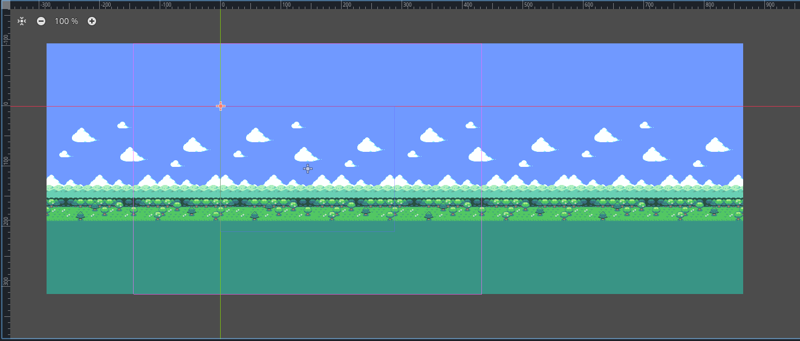

Split screen
------------

Most tutorials for making a split screen game in Godot begin by writing a small script to assign
the :ref:`Viewport.world_2d<class_viewport_property_world_2d>` of the first SubViewport to the second, so they have a
shared display. Questions often pop up about how to share a parallax effect between both screens.

The parallax effect fakes a perspective by moving the positions of different textures in relation to the camera. This is
understandably problematic if you have multiple cameras, because your textures can't be in two places at once!

This is still achievable by cloning the parallax nodes into the second (or third or fourth)
:ref:`SubViewport<class_subviewport>`. Here's how a setup looks for a two player game:

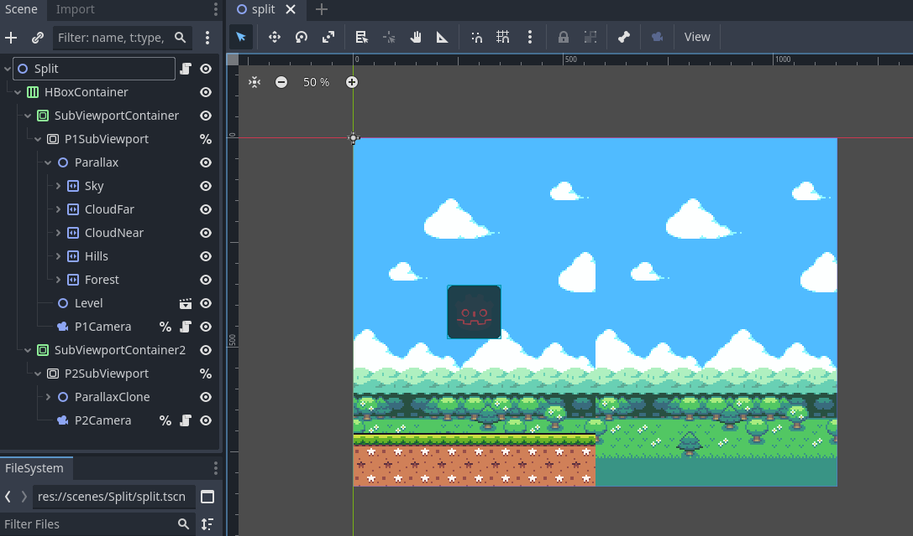

Of course, now both backgrounds show in both SubViewports. What we want is for each parallax to only show in their
corresponding viewport. We can achieve this by doing the following:

- Leave all parallax nodes at their default :ref:`visibility_layer<class_canvasitem_property_visibility_layer>` of 1.
- Set the first SubViewport's :ref:`canvas_cull_mask<class_viewport_property_canvas_cull_mask>` to only layers 1 and 2.
- Do the same for the second SubViewport but use layers 1 and 3.
- Give your parallax nodes in the first SubViewport a common parent and set its :ref:`visibility_layer<class_canvasitem_property_visibility_layer>` to 2.
- Do the same for the second SubViewport's parallax nodes, but use a layer of 3.

How does this work? If a canvas item has a :ref:`visibility_layer<class_canvasitem_property_visibility_layer>` that
doesn't match the SubViewport's :ref:`canvas_cull_mask<class_viewport_property_canvas_cull_mask>`, it will hide all
children, even if they do. We use this to our advantage, letting the SubViewports cut off rendering of parallax nodes
whose parent doesn't have a supported :ref:`visibility_layer<class_canvasitem_property_visibility_layer>`.

Previewing in the editor
------------------------

Prior to 4.3, the recommendation was to place every layer in their own
:ref:`ParallaxBackground<class_parallaxbackground>`, enable the
:ref:`follow_viewport_enabled<class_canvaslayer_property_follow_viewport_enabled>` property, and scale the individual
layer. This method has always been tricky to get right, but is still achievable by using a
:ref:`CanvasLayer<class_canvaslayer>` instead of a :ref:`ParallaxBackground<class_parallaxbackground>`.

.. note::
    Another recommendation is `KoBeWi's "Parallax2D Preview" addon <https://github.com/KoBeWi/Godot-Parallax2D-Preview>`_.
    It provides a few different preview modes and is very handy!
