.. _doc_2d_skeletons:

2D skeletons
====================

Introduction
------------

When working with 3D, skeletal deforms are common for characters and creatures and most 3D modelling
applications support it. For 2D, as this function is not used as often, it's difficult to
find mainstream software aimed for this.

One option is to create animations in third party software such as Spine or Dragonbons. From Godot 3.1
onwards, though, this functionality is supported built in.

Why would you want to do skeletal animations directly in Godot? The answer is, there are many advantages to it:

* Better integration to the engine, so less hassle importing and editing from an external tool.
* Ability to control particle systems, shaders, sounds, call scripts, colors, transparency, etc. in animations.
* Built-in skeletal system in Godot is very efficient and designed for performance.

The following tutorial will, then, explain 2D skeletal deformations.

Setup
-----

Before starting, it is advised that the :ref:`cutout animation <cutout_animations>` is followed to gain a general
idea of animating within Godot.

For this tutorial, we will be using a single image to construct our character, so just right click over it on your browser to download it:

.. image:: img/gBot_pieces.png

It is also advised to download the final character image, to have a good reference for putting the different pieces together:

.. image:: img/gBot_complete.png

Creating the Polygons
--------------------

Create a new scene for your model (if it's going to be an animated character, you may want to use a ``KinematicBody2D``). For ease of use, an empty 2D node is created as a root for the polygons.

Begin with a ``Polygon2D`` node. There is no need to place it anywhere in the scene for now, so simply create it like this:

.. image:: img/skel2d1.png

Select it and assign the texture with the character pieces you have downloaded before:

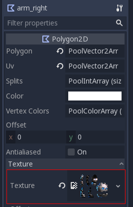

Drawing a polygon directly is not advised. Instead, open the "uv" dialog for the polygon:

.. image:: img/skel2d3.png

Head over to the *Points* mode, select the pencil and draw a polygon around the desired piece:

.. image:: img/skel2d4.png

Duplicate the polygon node, rename it properly, enter "uv" dialog and replace the old polygon for another one in the new desired piece.

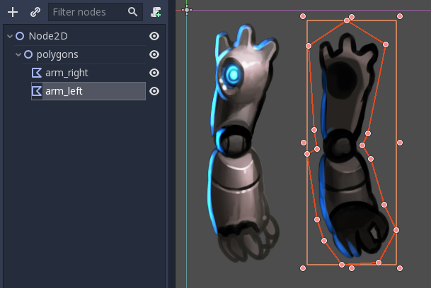

Keep doing this until all pieces have been mapped.

.. image:: img/skel2d6.png

You will notice that pieces for nodes appear in the same layout as they do in the original texture. This is because (by default) when you draw a polygon, the uv and points are the same.

Rearrange the pieces and build the character. This should be pretty quick. There is no need to change pivots so don't bother making sure rotation pivots for each piece are right so leave them be for now.

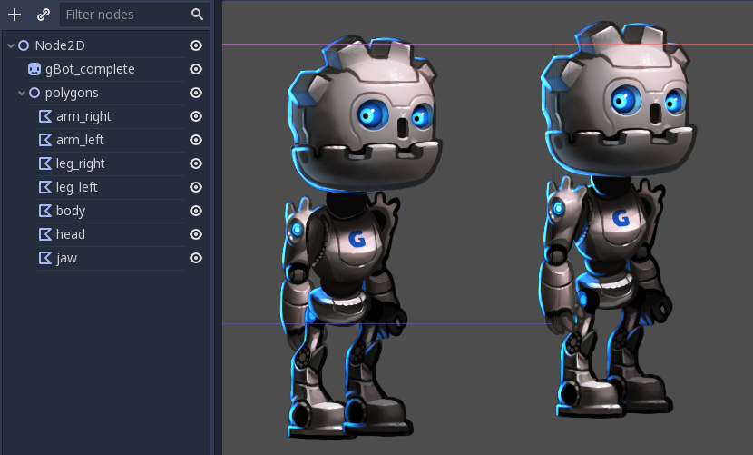

Ah, the visual order of the pieces is not the right now as some are covering wrong pieces. Just rearrange the order of the nodes to fix this:

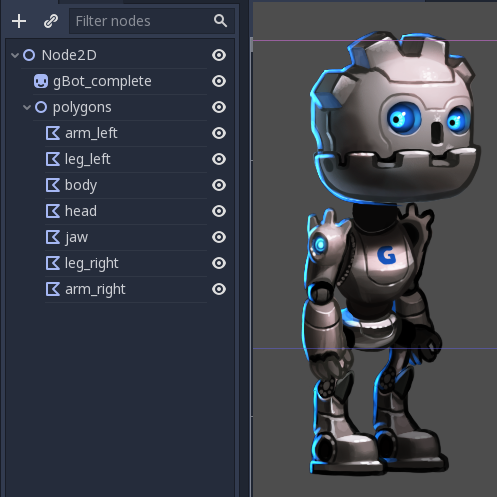

And there you go! It was definitely much easier than in the cutout tutorial.

Creating the Skeleton
--------------------

As a child of the root, create a ``Skeleton2D`` node. This will be the base of our skeleton:

.. image:: img/skel2d9.png

As a child of it, create a ``Bone2D`` node. Put it on the hip (usually skeletons start here). The bone will be pointing to the right,
but just ignore this for now.

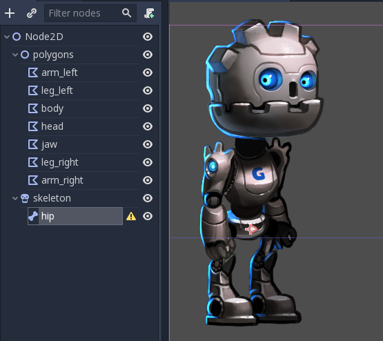

Keep creating bones in hierarchy and naming them accordingly. 

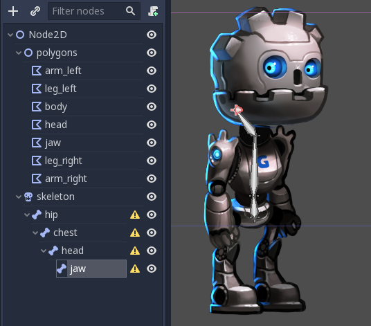

At the end of this chain there will be a *jaw* node. It is, again, very short pointing to the right. This is normal for bones without children. The length of *tip* bones can be changed with a property in the inspector:

.. image:: img/skel2d12.png

In this case we don't need to rotate the bone (coincidentially jaw points right), but in case you need to, feel free to do it. Again,
this is only really needed for tip bones as nodes with children don't usually need a length or a specific rotation.

Keep going and build the whole skeleton:

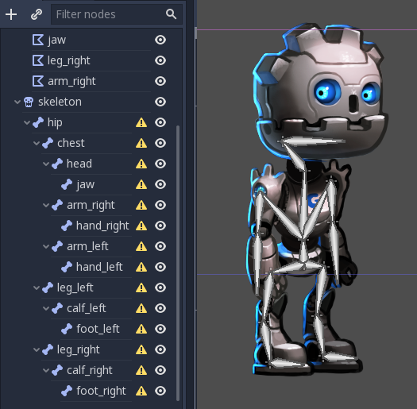

You will notice that all bones have this annoying warning about a missing rest pose. This means it's time to set one. Go to the *skeleton* node and create a rest pose. This pose is the default one, you can come back to it anytime you want (which is very handy for animating):

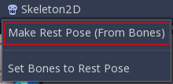

The warnings will go away. If you modify the skeleton (add/remove bones) you will need to set the rest pose again.

Deforming the polygons
--------------------

Select the previously created polygons and assign them the skeleton node. This will ensure that they can eventually by deformed by it:

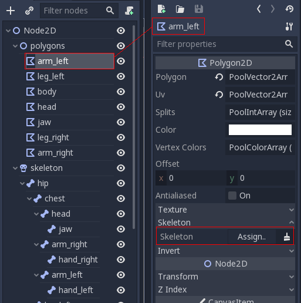

Just click the above property and select the skeleton:

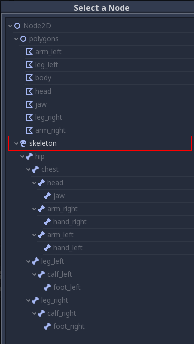

Again, open the UV editor for the polygon and go to the *Bones* section. 

.. image:: img/skel2d17.png

You will not be able to paint weights yet. For this you need to synchronize the list of bones from the skeleton with the polygon. This step is done only once and manually (unless you modify the skeleton). It ensures that your rigging information is kept in the polygon, even if a skeleton node is accidentally lost or the skeleton modified. Push the "Sync Bones to Polygon" button to sync the list.

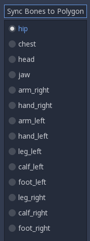

The list of bones will automatically appear. By default, your polygon has no weight assigned to any of them. Select the bones you want to assign weight to and paint them:

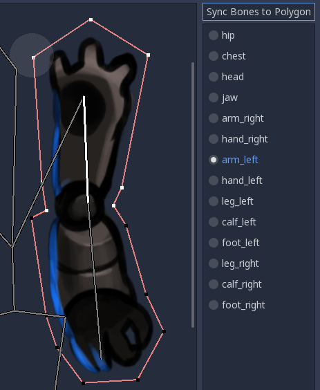

Points in white have a full weight assigned, while points in black are not influenced by the bone. If the same point is painted white for multiple bones, the influence will be distributed amongst them (so usually there is not that much need to use colors in-between unless you want to polish the bending effect).

.. image:: img/skel2d20.gif

After painting the weights, animating the bones (NOT the polygons!) will have the desired effect of modifying and bending the polygons after them. As you only need to animate bones in this approach, work becomes much easier!

But it's not all roses. Trying to animate bones that bend the polygon will often yield unexpected results:

.. image:: img/skel2d21.gif

This happens because Godot generates internal triangles that connect the points when drawing the polygon. They don't always bend the way you would expect. To solve this, you need to hint better in the geometry how you expect it to deform.

Internal vertices
-----------------

Open the UV menu for each bone again and go to the *Points* section. Add some internal vertices in the regions where you expect the geometry to bend:

.. image:: img/skel2d22.png

Now, go to the *Polygon* section and redraw your own polygons, with more detail. Imagine that, as your polygons bend, you need to make sure they deform as least as possible, so just be smart and experiment a bit. 

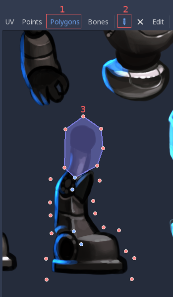

Once you start drawing, the original polygon will disappear and you will be free to create your own:

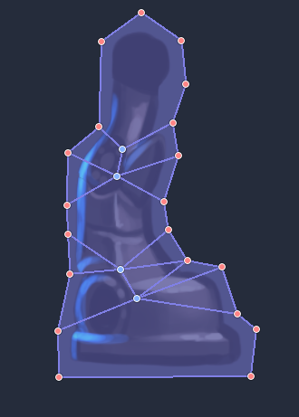

This amount of detail is usually fine, though you may want to have more fine grained control over where triangles go. Just experiment yourself until you get the results you like.

**NOTE**: Don't forget that your newly added internal vertices also need weight painting! Go to the *Bones* section again to assign them to the right bones.

Once you are all set, you will get much better results:

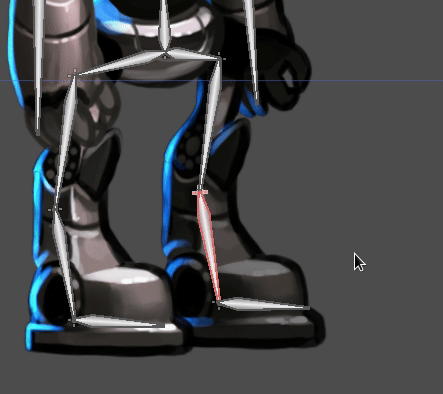

