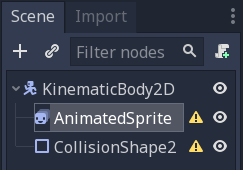
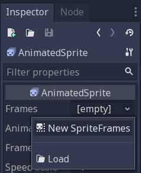
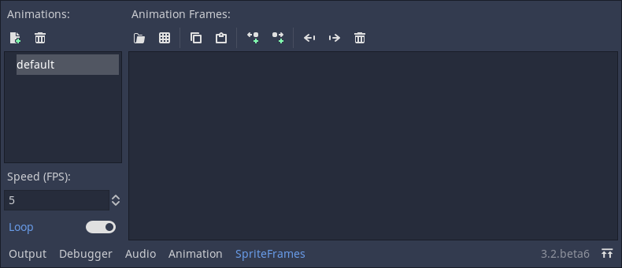
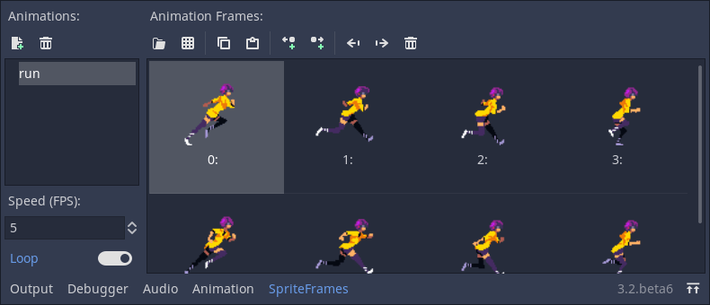
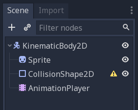
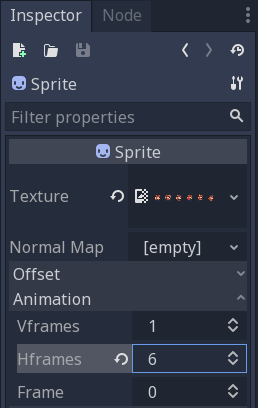
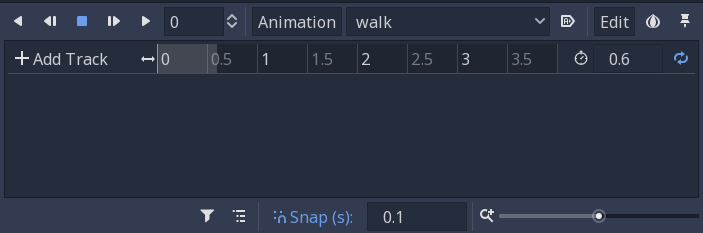
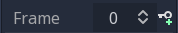
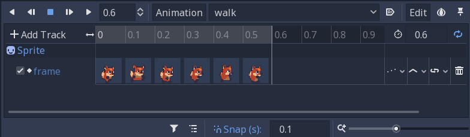

.. _doc_2d_sprite_animation:

2D Sprite animation
===================

Introduction
------------

In this tutorial, you'll learn two different ways to create 2D animated
characters. Typically, when you create or download an animated character, it
will come in one of two ways: as individual images or as a single sprite sheet
containing all the animation's frames. Depending on which type of assets you
have, you can choose one of the following solutions.

First, we'll use :ref:`AnimatedSprite <class_AnimatedSprite>` to
animate a collection of individual images. Then, to use a sprite sheet, we'll
use :ref:`AnimationPlayer <class_AnimationPlayer>` along with the *Animation*
property of :ref:`Sprite <class_Sprite>`.

.. note:: Art for the following examples by https://opengameart.org/users/ansimuz

Individual images with AnimatedSprite
-------------------------------------

In this scenario, you have a collection of images, each containing one of your
character's animation frames. For this example, we'll use the following
animation:

.. image:: img/2d_animation_run_preview.gif

You can download the images here:
:download:`run_animation.zip <files/run_animation.zip>`

Unzip the images and place them in your project folder. Set up your scene tree
with the following nodes:

.. note:: The root node could also be :ref:`Area2D <class_Area2D>` or
          :ref:`RigidBody2D <class_RigidBody2D>`. The animation will still be
          made in the same way. Once the animation is completed, you can
          assign a shape to the CollisionShape2D. See
          :ref:`Physics Introduction <doc_physics_introduction>` for more
          information.

Now select the ``AnimatedSprite`` and in its *SpriteFrames* property, select
"New SpriteFrames".

Click on the new SpriteFrames resource and you'll see a new panel appear at the
bottom of the editor window:

From the FileSystem dock on the left side, drag the 8 individual images into
the center part of the SpriteFrames panel. On the left side, change the name
of the animation from "default" to "run".

Back in the Inspector, check the box for the *Playing* property. You should
now see the animation playing in the viewport. However, it is a bit slow. To
fix this, change the *Speed (FPS)* setting in the SpriteFrames panel.

You can add additional animations by clicking the "New Animation" button and
adding additional images.

Controlling the animation
~~~~~~~~~~~~~~~~~~~~~~~~~

Once the animation is complete, you can control the animation via code using
the ``play()`` and ``stop()`` methods. Here is a brief example to play the
animation while the right arrow key is held, and stop it when the key is
released.

.. tabs::
 .. code-tab:: gdscript GDScript

    extends KinematicBody2D

    func _process(delta):
        if Input.is_action_pressed("ui_right"):
            $AnimatedSprite.play("run")
        else:
            $AnimatedSprite.stop()

Sprite sheet with AnimationPlayer
---------------------------------

In the event you have a sprite sheet containing all of your animation frames,
you can't easily use ``AnimatedSprite``. Instead, you can use a standard
:ref:`Sprite <class_Sprite>` node to display the texture, and then animate the
change from texture to texture with :ref:`AnimationPlayer <class_AnimationPlayer>`.

Consider this sprite sheet, which contains 6 frames of animation:

.. image:: img/2d_animation_player-run.png

Right-click the image and choose "Save Image As" to download, then copy the
image into your project folder.

Our goal is to display these images one after another in a loop. Start by
setting up your scene tree:

.. note:: The root node could also be :ref:`Area2D <class_Area2D>` or
          :ref:`RigidBody2D <class_RigidBody2D>`. The animation will still be
          made in the same way. Once the animation is completed, you can
          assign a shape to the CollisionShape2D. See
          :ref:`Physics Introduction <doc_physics_introduction>` for more
          information.

Drag the spritesheet into the Sprite's *Texture* property, and you'll see the
whole sheet displayed on the screen. To slice it up into individual frames,
expand the *Animation* section in the Inspector and set the *Hframes* to ``6``.
*Hframes* and *Vframes* are the number of horizontal and vertical frames in
your sprite sheet.

Now try changing the value of the *Frame* property. You'll see that it ranges
from ``0`` to ``5`` and the image displayed by the Sprite changes accordingly.
This is the property we'll be animating.

Select the ``AnimationPlayer`` and click the "Animation" button followed by
"New". Name the new animation "walk". Set the animation length to ``0.6`` and
click the "Loop" button so that our animation will repeat.

Now select the ``Sprite`` node and click the key icon to add a new track.

Continue adding frames at each point in the timeline (``0.1`` seconds by
default), until you have all the frames from 0 to 5. You'll see the frames
actually appearing in the animation track:

Press "Play" on the animation to see how it looks.

.. image:: img/2d_animation_running.gif

Summary
-------

These examples illustrate the two most common situations you'll encounter in
2D animation. Each has its benefits. Working with ``AnimationPlayer`` is
a bit more complex, but provides additional functionality, since you can also
animate other properties like position or scale. Experiment and see which
works best for your needs.
