.. _doc_2d_sprite_animation:

2D sprite animation
===================

Introduction
------------

In this tutorial, you'll learn how to create 2D animated
characters with the AnimatedSprite2D class and the AnimationPlayer.
Typically, when you create or download an animated character,
it will come in one of two ways: as individual images or as a single sprite sheet
containing all the animation's frames.
Both can be animated in Godot with the AnimatedSprite2D class.

First, we'll use :ref:`AnimatedSprite2D <class_AnimatedSprite2D>` to
animate a collection of individual images.
Then we will animate a sprite sheet using this class.
Finally, we will learn another way to animate a sprite sheet
with :ref:`AnimationPlayer <class_AnimationPlayer>` and the *Animation*
property of :ref:`Sprite2D <class_Sprite2D>`.

.. note:: Art for the following examples by https://opengameart.org/users/ansimuz and tgfcoder.

Individual images with AnimatedSprite2D
---------------------------------------

In this scenario, you have a collection of images, each containing one of your
character's animation frames. For this example, we'll use the following
animation:

You can download the images here:
`2d_sprite_animation_assets.zip <https://github.com/godotengine/godot-docs-project-starters/releases/download/latest-4.x/2d_sprite_animation_assets.zip>`_

Unzip the images and place them in your project folder. Set up your scene tree
with the following nodes:

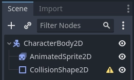

.. note:: The root node could also be :ref:`Area2D <class_Area2D>` or
          :ref:`RigidBody2D <class_RigidBody2D>`. The animation will still be
          made in the same way. Once the animation is completed, you can
          assign a shape to the CollisionShape2D. See
          :ref:`Physics Introduction <doc_physics_introduction>` for more
          information.

Now select the ``AnimatedSprite2D`` and in its *SpriteFrames* property, select
"New SpriteFrames".

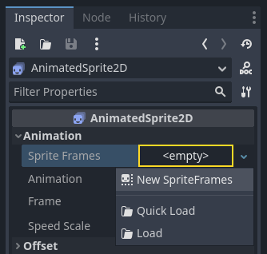

Click on the new SpriteFrames resource and you'll see a new panel appear at the
bottom of the editor window:

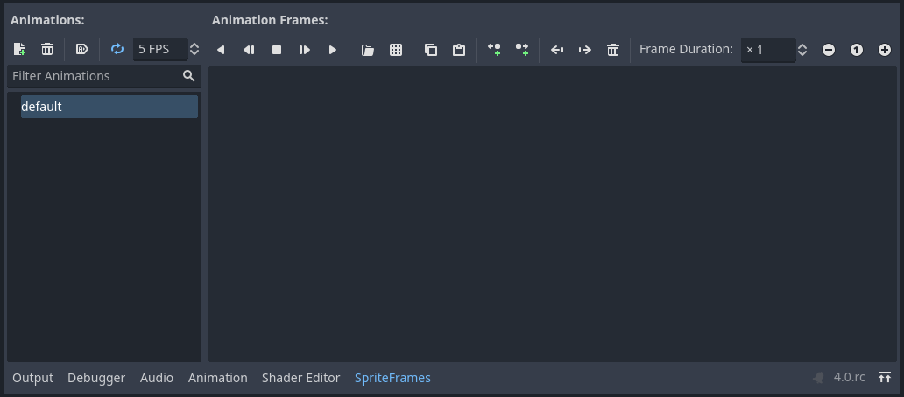

From the FileSystem dock on the left side, drag the 8 individual images into
the center part of the SpriteFrames panel. On the left side, change the name
of the animation from "default" to "run".

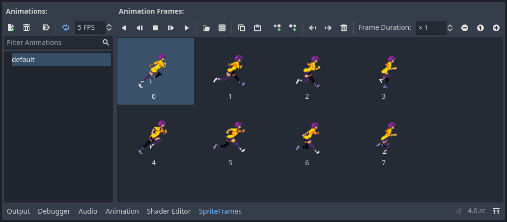

Use the "Play" buttons on the top-right of the *Filter Animations* input to preview the animation.
You should now see the animation playing in the viewport.
However, it is a bit slow. To fix this,
change the *Speed (FPS)* setting in the SpriteFrames panel to 10.

You can add additional animations by clicking the "Add Animation" button and
adding additional images.

Controlling the animation
~~~~~~~~~~~~~~~~~~~~~~~~~

Once the animation is complete, you can control the animation via code using
the ``play()`` and ``stop()`` methods. Here is a brief example to play the
animation while the right arrow key is held, and stop it when the key is
released.

.. tabs::
 .. code-tab:: gdscript GDScript

    extends CharacterBody2D

    @onready var _animated_sprite = $AnimatedSprite2D

    func _process(_delta):
        if Input.is_action_pressed("ui_right"):
            _animated_sprite.play("run")
        else:
            _animated_sprite.stop()

 .. code-tab:: csharp

    using Godot;

    public partial class Character : CharacterBody2D
    {
        private AnimatedSprite2D _animatedSprite;

        public override void _Ready()
        {
            _animatedSprite = GetNode<AnimatedSprite>("AnimatedSprite");
        }

        public override _Process(float _delta)
        {
            if (Input.IsActionPressed("ui_right"))
            {
                _animatedSprite.Play("run");
            }
            else
            {
                _animatedSprite.Stop();
            }
        }
    }

Sprite sheet with AnimatedSprite2D
----------------------------------

You can also easily animate from a sprite sheet with the class ``AnimatedSprite2D``.
We will use this public domain sprite sheet:

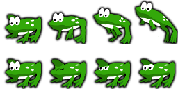

Right-click the image and choose "Save Image As" to download it,
and then copy the image into your project folder.

Set up your scene tree the same way you did previously when using individual images.
Select the ``AnimatedSprite2D`` and in its *SpriteFrames* property, select "New SpriteFrames".

Click on the new SpriteFrames resource.
This time, when the bottom panel appears, select "Add frames from a Sprite Sheet".

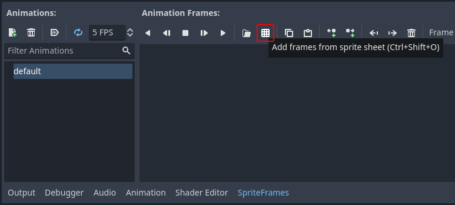

You will be prompted to open a file. Select your sprite sheet.

A new window will open, showing your sprite sheet.
The first thing you will need to do is to change the number of vertical and horizontal images in your sprite sheet.
In this sprite sheet, we have four images horizontally and two images vertically.

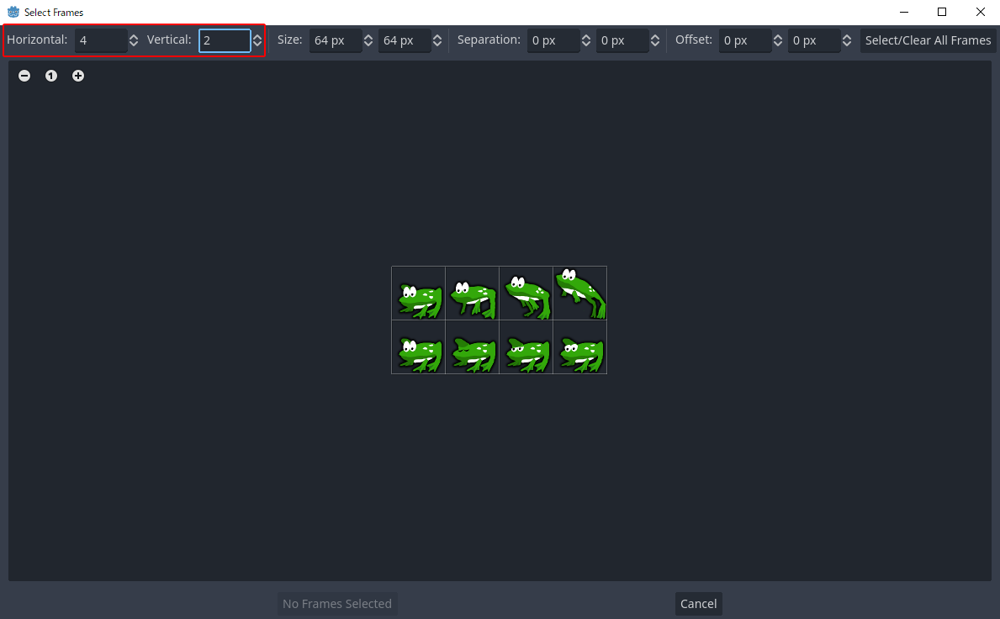

Next, select the frames from the sprite sheet that you want to include in your animation.
We will select the top four, then click "Add 4 frames" to create the animation.

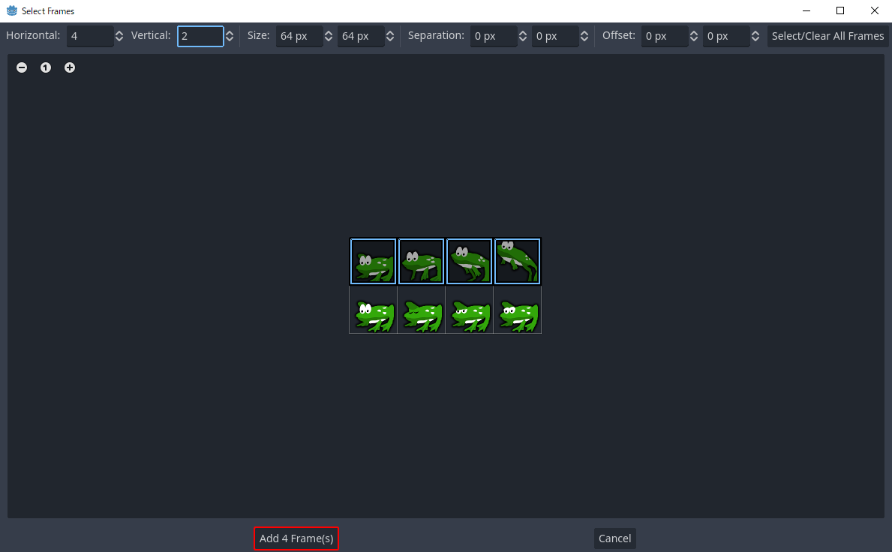

You will now see your animation under the list of animations in the bottom panel.
Double click on default to change the name of the animation to jump.

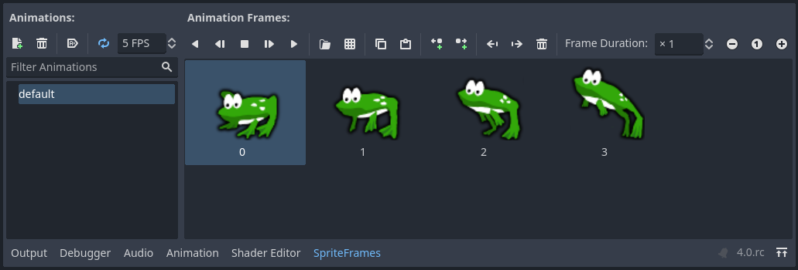

Finally, check the play button on the SpriteFrames editor to see your frog jump!

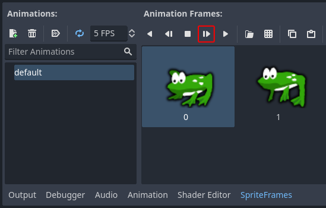

Sprite sheet with AnimationPlayer
---------------------------------

Another way that you can animate when using a sprite sheet is to use a standard
:ref:`Sprite2D <class_Sprite2D>` node to display the texture, and then animating the
change from texture to texture with :ref:`AnimationPlayer <class_AnimationPlayer>`.

Consider this sprite sheet, which contains 6 frames of animation:

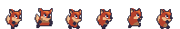

Right-click the image and choose "Save Image As" to download, then copy the
image into your project folder.

Our goal is to display these images one after another in a loop. Start by
setting up your scene tree:

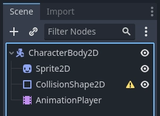

.. note:: The root node could also be :ref:`Area2D <class_Area2D>` or
          :ref:`RigidBody2D <class_RigidBody2D>`. The animation will still be
          made in the same way. Once the animation is completed, you can
          assign a shape to the CollisionShape2D. See
          :ref:`Physics Introduction <doc_physics_introduction>` for more
          information.

Drag the spritesheet into the Sprite's *Texture* property, and you'll see the
whole sheet displayed on the screen. To slice it up into individual frames,
expand the *Animation* section in the Inspector and set the *Hframes* to ``6``.
*Hframes* and *Vframes* are the number of horizontal and vertical frames in
your sprite sheet.

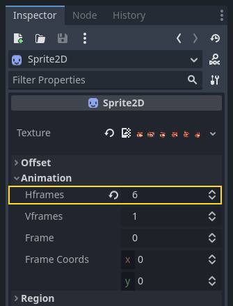

Now try changing the value of the *Frame* property. You'll see that it ranges
from ``0`` to ``5`` and the image displayed by the Sprite2D changes accordingly.
This is the property we'll be animating.

Select the ``AnimationPlayer`` and click the "Animation" button followed by
"New". Name the new animation "walk". Set the animation length to ``0.6`` and
click the "Loop" button so that our animation will repeat.

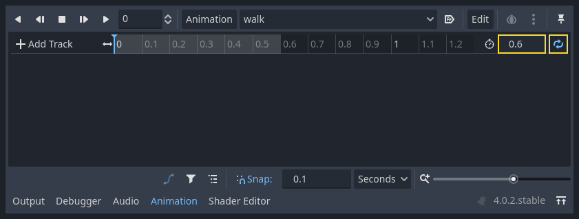

Now select the ``Sprite2D`` node and click the key icon to add a new track.

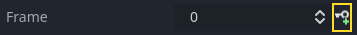

Continue adding frames at each point in the timeline (``0.1`` seconds by
default), until you have all the frames from 0 to 5. You'll see the frames
actually appearing in the animation track:

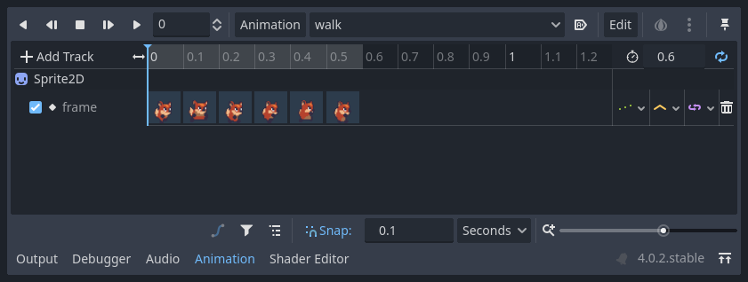

Press "Play" on the animation to see how it looks.

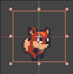

Controlling an AnimationPlayer animation
~~~~~~~~~~~~~~~~~~~~~~~~~~~~~~~~~~~~~~~~

Like with AnimatedSprite2D, you can control the animation via code using
the ``play()`` and ``stop()`` methods. Again, here is an example to play the
animation while the right arrow key is held, and stop it when the key is
released.

.. tabs::
 .. code-tab:: gdscript GDScript

    extends CharacterBody2D

    @onready var _animation_player = $AnimationPlayer

    func _process(_delta):
        if Input.is_action_pressed("ui_right"):
            _animation_player.play("walk")
        else:
            _animation_player.stop()

 .. code-tab:: csharp

    using Godot;

    public partial class Character : CharacterBody2D
    {
        private AnimationPlayer _animationPlayer;

        public override void _Ready()
        {
            _animationPlayer = GetNode<AnimationPlayer>("AnimationPlayer");
        }

        public override void _Process(float _delta)
        {
            if (Input.IsActionPressed("ui_right"))
            {
                _animationPlayer.Play("walk");
            }
            else
            {
                _animationPlayer.Stop();
            }
        }
    }

.. note:: If updating both an animation and a separate property at once
          (for example, a platformer may update the sprite's ``h_flip``/``v_flip``
          properties when a character turns while starting a 'turning' animation),
          it's important to keep in mind that ``play()`` isn't applied instantly.
          Instead, it's applied the next time the :ref:`AnimationPlayer <class_AnimationPlayer>` is processed.
          This may end up being on the next frame, causing a 'glitch' frame,
          where the property change was applied but the animation was not.
          If this turns out to be a problem, after calling ``play()``, you can call ``advance(0)``
          to update the animation immediately.

Summary
-------

These examples illustrate the two classes you can use in Godot for 2D animation.
``AnimationPlayer`` is a bit more complex than ``AnimatedSprite2D``,
but it provides additional functionality, since you can also
animate other properties like position or scale.
The class ``AnimationPlayer`` can also be used with an ``AnimatedSprite2D``.
Experiment to see what works best for your needs.
