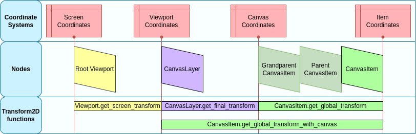

.. _doc_viewport_and_canvas_transforms:

Viewport and canvas transforms
==============================

Introduction
------------

This is an overview of the 2D transforms going on for nodes from the
moment they draw their content locally to the time they are drawn onto
the screen. This overview discusses very low level details of the engine.

The goal of this tutorial is to teach a way for feeding input events to the
Input with a position in the correct coordinate system.

A more extensive description of all coordinate systems and 2d transforms is
available in :ref:`doc_2d_coordinate_systems`.

Canvas transform
----------------

As mentioned in the previous tutorial, :ref:`doc_canvas_layers`, every
CanvasItem node (remember that Node2D and Control based nodes use
CanvasItem as their common root) will reside in a *Canvas Layer*. Every
canvas layer has a transform (translation, rotation, scale, etc.) that
can be accessed as a :ref:`Transform2D <class_Transform2D>`.

Also covered in the previous tutorial, nodes are drawn by default in Layer 0,
in the built-in canvas. To put nodes in a different layer, a :ref:`CanvasLayer
<class_CanvasLayer>` node can be used.

Global canvas transform
-----------------------

Viewports also have a Global Canvas transform (also a
:ref:`Transform2D <class_Transform2D>`). This is the master transform and
affects all individual *Canvas Layer* transforms. Generally, this is primarily
used in Godot's CanvasItem Editor.

Stretch transform
-----------------

Finally, viewports have a *Stretch Transform*, which is used when
resizing or stretching the screen. This transform is used internally (as
described in :ref:`doc_multiple_resolutions`), but can also be manually set
on each viewport.

Input events are multiplied by this transform but lack the ones above. To
convert InputEvent coordinates to local CanvasItem coordinates, the
:ref:`CanvasItem.make_input_local() <class_CanvasItem_method_make_input_local>`
function was added for convenience.

Window transform
----------------

The root viewport is a :ref:`Window <class_Window>`. In order to scale and
position the *Window's* content as described in :ref:`doc_multiple_resolutions`,
each :ref:`Window <class_Window>` contains a *window transform*. It is for
example responsible for the black bars at the *Window's* sides so that the
*Viewport* is displayed with a fixed aspect ratio.

Transform order
---------------

To convert a CanvasItem local coordinate to an actual screen coordinate,
the following chain of transforms must be applied:

Transform functions
-------------------

The above graphic shows some available transform functions. All transforms are directed from right
to left, this means multiplying a transform with a coordinate results in a coordinate system
further to the left, multiplying the :ref:`affine inverse <class_Transform2D_method_affine_inverse>`
of a transform results in a coordinate system further to the right:

.. tabs::
 .. code-tab:: gdscript GDScript

    # Called from a CanvasItem.
    canvas_pos = get_global_transform() * local_pos
    local_pos = get_global_transform().affine_inverse() * canvas_pos

 .. code-tab:: csharp

    // Called from a CanvasItem.
    canvasPos = GetGlobalTransform() * localPos;
    localPos = GetGlobalTransform().AffineInverse() * canvasPos;

Finally, then, to convert a CanvasItem local coordinates to screen coordinates, just multiply in
the following order:

.. tabs::
 .. code-tab:: gdscript GDScript

    var screen_coord = get_viewport().get_screen_transform() * get_global_transform_with_canvas() * local_pos

 .. code-tab:: csharp

    var screenCord = GetViewport().GetScreenTransform() * GetGlobalTransformWithCanvas() * localPos;

Keep in mind, however, that it is generally not desired to work with screen coordinates. The
recommended approach is to simply work in Canvas coordinates
(``CanvasItem.get_global_transform()``), to allow automatic screen resolution resizing to work
properly.

Feeding custom input events
---------------------------

It is often desired to feed custom input events to the game. With the above knowledge, to correctly
do this in the focused window, it must be done the following way:

.. tabs::
 .. code-tab:: gdscript GDScript

    var local_pos = Vector2(10, 20) # Local to Control/Node2D.
    var ie = InputEventMouseButton.new()
    ie.button_index = MOUSE_BUTTON_LEFT
    ie.position = get_viewport().get_screen_transform() * get_global_transform_with_canvas() * local_pos
    Input.parse_input_event(ie)

 .. code-tab:: csharp

    var localPos = new Vector2(10,20); // Local to Control/Node2D.
    var ie = new InputEventMouseButton()
    {
        ButtonIndex = MouseButton.Left,
        Position = GetViewport().GetScreenTransform() * GetGlobalTransformWithCanvas() * localPos,
    };
    Input.ParseInputEvent(ie);
