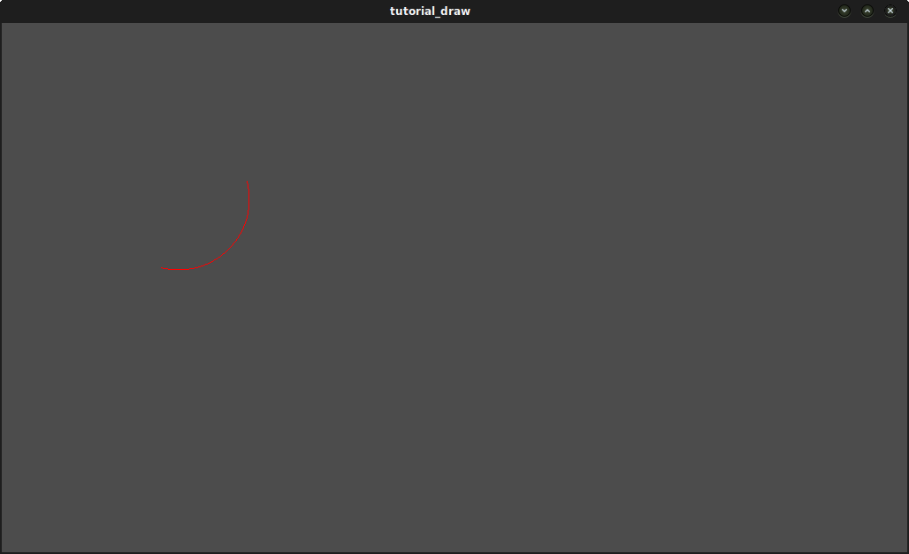
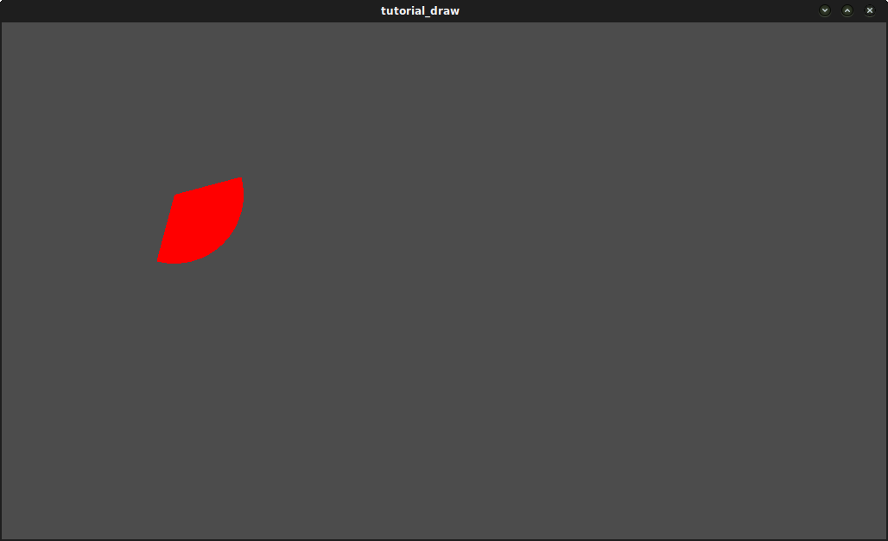

.. _doc_custom_drawing_in_2d:

Custom drawing in 2D
====================

Why?
----

Godot has nodes to draw sprites, polygons, particles, and all sorts of
stuff. For most cases, this is enough; but not always. Before crying in fear,
angst, and rage because a node to draw that specific *something* does not exist...
it would be good to know that it is possible to easily make any 2D node (be it
:ref:`Control <class_Control>` or :ref:`Node2D <class_Node2D>`
based) draw custom commands. It is *really* easy to do it, too.

But...
------

Custom drawing manually in a node is *really* useful. Here are some
examples why:

-  Drawing shapes or logic that is not handled by nodes (example: making
   a node that draws a circle, an image with trails, a special kind of
   animated polygon, etc).
-  Visualizations that are not that compatible with nodes: (example: a
   tetris board). The tetris example uses a custom draw function to draw
   the blocks.
-  Drawing a large number of simple objects. Custom drawing avoids the
   overhead of using nodes which makes it less memory intensive and
   potentially faster.
-  Making a custom UI control. There are plenty of controls available,
   but it's easy to run into the need to make a new, custom one.

OK, how?
--------

Add a script to any :ref:`CanvasItem <class_CanvasItem>`
derived node, like :ref:`Control <class_Control>` or
:ref:`Node2D <class_Node2D>`. Then override the ``_draw()`` function.

.. tabs::
 .. code-tab:: gdscript GDScript

    extends Node2D

    func _draw():
        # Your draw commands here
        pass

 .. code-tab:: csharp

    public override void _Draw()
    {
        // Your draw commands here
    }

Draw commands are described in the :ref:`CanvasItem <class_CanvasItem>`
class reference. There are plenty of them.

Updating
--------

The ``_draw()`` function is only called once, and then the draw commands
are cached and remembered, so further calls are unnecessary.

If re-drawing is required because a state or something else changed,
simply call :ref:`CanvasItem.update() <class_CanvasItem_method_update>`
in that same node and a new ``_draw()`` call will happen.

Here is a little more complex example, a texture variable that will be
redrawn if modified:

.. tabs::
 .. code-tab:: gdscript GDScript

    extends Node2D

    export (Texture) var texture setget _set_texture

    func _set_texture(value):
        # If the texture variable is modified externally,
        # this callback is called.
        texture = value  # Texture was changed.
        update()  # Update the node's visual representation.

    func _draw():
        draw_texture(texture, Vector2())

 .. code-tab:: csharp

    public class CustomNode2D : Node2D
    {
        private Texture _texture;
        public Texture Texture
        {
            get
            {
                return _texture;
            }

            set
            {
                _texture = value;
                Update();
            }
        }

        public override void _Draw()
        {
            DrawTexture(_texture, new Vector2());
        }
    }

In some cases, it may be desired to draw every frame. For this, just
call ``update()`` from the ``_process()`` callback, like this:

.. tabs::
 .. code-tab:: gdscript GDScript

    extends Node2D

    func _draw():
        # Your draw commands here
        pass

    func _process(delta):
        update()

 .. code-tab:: csharp

    public class CustomNode2D : Node2D
    {
        public override void _Draw()
        {
            // Your draw commands here
        }

        public override void _Process(float delta)
        {
            Update();
        }
    }

An example: drawing circular arcs
----------------------------------

We will now use the custom drawing functionality of the Godot Engine to draw
something that Godot doesn't provide functions for. As an example, Godot provides
a ``draw_circle()`` function that draws a whole circle. However, what about drawing a
portion of a circle? You will have to code a function to perform this and draw it yourself.

Arc function
^^^^^^^^^^^^

An arc is defined by its support circle parameters, that is, the center position
and the radius. The arc itself is then defined by the angle it starts from
and the angle at which it stops. These are the 4 arguments that we have to provide to our drawing function.
We'll also provide the color value, so we can draw the arc in different colors if we wish.

Basically, drawing a shape on the screen requires it to be decomposed into a certain number of points
linked from one to the next. As you can imagine, the more points your shape is made of,
the smoother it will appear, but the heavier it will also be in terms of processing cost. In general,
if your shape is huge (or in 3D, close to the camera), it will require more points to be drawn without
it being angular-looking. On the contrary, if your shape is small (or in 3D, far from the camera),
you may decrease its number of points to save processing costs; this is known as *Level of Detail (LOD)*.
In our example, we will simply use a fixed number of points, no matter the radius.

.. tabs::
 .. code-tab:: gdscript GDScript

    func draw_circle_arc(center, radius, angle_from, angle_to, color):
        var nb_points = 32
        var points_arc = PoolVector2Array()

        for i in range(nb_points + 1):
            var angle_point = deg2rad(angle_from + i * (angle_to-angle_from) / nb_points - 90)
            points_arc.push_back(center + Vector2(cos(angle_point), sin(angle_point)) * radius)

        for index_point in range(nb_points):
            draw_line(points_arc[index_point], points_arc[index_point + 1], color)

 .. code-tab:: csharp

    public void DrawCircleArc(Vector2 center, float radius, float angleFrom, float angleTo, Color color)
    {
        int nbPoints = 32;
        var pointsArc = new Vector2[nbPoints];

        for (int i = 0; i < nbPoints; ++i)
        {
            float anglePoint = Mathf.Deg2Rad(angleFrom + i * (angleTo - angleFrom) / nbPoints - 90f);
            pointsArc[i] = center + new Vector2(Mathf.Cos(anglePoint), Mathf.Sin(anglePoint)) * radius;
        }

        for (int i = 0; i < nbPoints - 1; ++i)
            DrawLine(pointsArc[i], pointsArc[i + 1], color);
    }

Remember the number of points our shape has to be decomposed into? We fixed this
number in the ``nb_points`` variable to a value of ``32``. Then, we initialize an empty
``PoolVector2Array``, which is simply an array of ``Vector2``\ s.

The next step consists of computing the actual positions of these 32 points that
compose an arc. This is done in the first for-loop: we iterate over the number of
points for which we want to compute the positions, plus one to include the last point.
We first determine the angle of each point, between the starting and ending angles.

The reason why each angle is decreased by 90° is that we will compute 2D positions
out of each angle using trigonometry (you know, cosine and sine stuff...). However,
to be simple, ``cos()`` and ``sin()`` use radians, not degrees. The angle of 0° (0 radian)
starts at 3 o'clock, although we want to start counting at 12 o'clock. So we decrease
each angle by 90° in order to start counting from 12 o'clock.

The actual position of a point located on a circle at angle ``angle`` (in radians)
is given by ``Vector2(cos(angle), sin(angle))``. Since ``cos()`` and ``sin()`` return values
between -1 and 1, the position is located on a circle of radius 1. To have this
position on our support circle, which has a radius of ``radius``, we simply need to
multiply the position by ``radius``. Finally, we need to position our support circle
at the ``center`` position, which is performed by adding it to our ``Vector2`` value.
Finally, we insert the point in the ``PoolVector2Array`` which was previously defined.

Now, we need to actually draw our points. As you can imagine, we will not simply
draw our 32 points: we need to draw everything that is between each of them.
We could have computed every point ourselves using the previous method, and drew
it one by one. But this is too complicated and inefficient (except if explicitly needed),
so we simply draw lines between each pair of points. Unless the radius of our
support circle is big, the length of each line between a pair of points will
never be long enough to see them. If that were to happen, we would simply need to
increase the number of points.

Draw the arc on the screen
^^^^^^^^^^^^^^^^^^^^^^^^^^

We now have a function that draws stuff on the screen;
it is time to call it inside the ``_draw()`` function:

.. tabs::

 .. code-tab:: gdscript GDScript

    func _draw():
        var center = Vector2(200, 200)
        var radius = 80
        var angle_from = 75
        var angle_to = 195
        var color = Color(1.0, 0.0, 0.0)
        draw_circle_arc(center, radius, angle_from, angle_to, color)

 .. code-tab:: csharp

    public override void _Draw()
    {
        var center = new Vector2(200, 200);
        float radius = 80;
        float angleFrom = 75;
        float angleTo = 195;
        var color = new Color(1, 0, 0);
        DrawCircleArc(center, radius, angleFrom, angleTo, color);
    }

Result:

Arc polygon function
^^^^^^^^^^^^^^^^^^^^

We can take this a step further and not only write a function that draws the plain
portion of the disc defined by the arc, but also its shape. The method is exactly
the same as before, except that we draw a polygon instead of lines:

.. tabs::
 .. code-tab:: gdscript GDScript

    func draw_circle_arc_poly(center, radius, angle_from, angle_to, color):
        var nb_points = 32
        var points_arc = PoolVector2Array()
        points_arc.push_back(center)
        var colors = PoolColorArray([color])

        for i in range(nb_points + 1):
            var angle_point = deg2rad(angle_from + i * (angle_to - angle_from) / nb_points - 90)
            points_arc.push_back(center + Vector2(cos(angle_point), sin(angle_point)) * radius)
        draw_polygon(points_arc, colors)

 .. code-tab:: csharp

    public void DrawCircleArcPoly(Vector2 center, float radius, float angleFrom, float angleTo, Color color)
    {
        int nbPoints = 32;
        var pointsArc = new Vector2[nbPoints + 1];
        pointsArc[0] = center;
        var colors = new Color[] { color };

        for (int i = 0; i < nbPoints; ++i)
        {
            float anglePoint = Mathf.Deg2Rad(angleFrom + i * (angleTo - angleFrom) / nbPoints - 90);
            pointsArc[i + 1] = center + new Vector2(Mathf.Cos(anglePoint), Mathf.Sin(anglePoint)) * radius;
        }

        DrawPolygon(pointsArc, colors);
    }

Dynamic custom drawing
^^^^^^^^^^^^^^^^^^^^^^

All right, we are now able to draw custom stuff on the screen. However, it is static;
let's make this shape turn around the center. The solution to do this is simply
to change the angle_from and angle_to values over time. For our example,
we will simply increment them by 50. This increment value has to remain
constant or else the rotation speed will change accordingly.

First, we have to make both angle_from and angle_to variables global at the top
of our script. Also note that you can store them in other nodes and access them
using ``get_node()``.

.. tabs::
 .. code-tab:: gdscript GDScript

    extends Node2D

    var rotation_angle = 50
    var angle_from = 75
    var angle_to = 195

 .. code-tab:: csharp

    public class CustomNode2D : Node2D
    {
        private float _rotationAngle = 50;
        private float _angleFrom = 75;
        private float _angleTo = 195;
    }

We make these values change in the _process(delta) function.

We also increment our angle_from and angle_to values here. However, we must not
forget to ``wrap()`` the resulting values between 0 and 360°! That is, if the angle
is 361°, then it is actually 1°. If you don't wrap these values, the script will
work correctly, but the angle values will grow bigger and bigger over time until
they reach the maximum integer value Godot can manage (``2^31 - 1``).
When this happens, Godot may crash or produce unexpected behavior.

Finally, we must not forget to call the ``update()`` function, which automatically
calls ``_draw()``. This way, you can control when you want to refresh the frame.

.. tabs::
 .. code-tab:: gdscript GDScript

    func _process(delta):
        angle_from += rotation_angle
        angle_to += rotation_angle

        # We only wrap angles when both of them are bigger than 360.
        if angle_from > 360 and angle_to > 360:
            angle_from = wrapf(angle_from, 0, 360)
            angle_to = wrapf(angle_to, 0, 360)
        update()

 .. code-tab:: csharp

    private float Wrap(float value, float minVal, float maxVal)
    {
        float f1 = value - minVal;
        float f2 = maxVal - minVal;
        return (f1 % f2) + minVal;
    }

    public override void _Process(float delta)
    {
        _angleFrom += _rotationAngle;
        _angleTo += _rotationAngle;

        // We only wrap angles when both of them are bigger than 360.
        if (_angleFrom > 360 && _angleTo > 360)
        {
            _angleFrom = Wrap(_angleFrom, 0, 360);
            _angleTo = Wrap(_angleTo, 0, 360);
        }
        Update();
    }

Also, don't forget to modify the ``_draw()`` function to make use of these variables:

.. tabs::
 .. code-tab:: gdscript GDScript

     func _draw():
        var center = Vector2(200, 200)
        var radius = 80
        var color = Color(1.0, 0.0, 0.0)

        draw_circle_arc( center, radius, angle_from, angle_to, color )

 .. code-tab:: csharp

    public override void _Draw()
    {
        var center = new Vector2(200, 200);
        float radius = 80;
        var color = new Color(1, 0, 0);

        DrawCircleArc(center, radius, _angleFrom, _angleTo, color);
    }

Let's run!
It works, but the arc is rotating insanely fast! What's wrong?

The reason is that your GPU is actually displaying the frames as fast as it can.
We need to "normalize" the drawing by this speed; to achieve that, we have to make
use of the ``delta`` parameter of the ``_process()`` function. ``delta`` contains the
time elapsed between the two last rendered frames. It is generally small
(about 0.0003 seconds, but this depends on your hardware), so using ``delta`` to
control your drawing ensures that your program runs at the same speed on
everybody's hardware.

In our case, we simply need to multiply our ``rotation_angle`` variable by ``delta``
in the ``_process()`` function. This way, our 2 angles will be increased by a much
smaller value, which directly depends on the rendering speed.

.. tabs::
 .. code-tab:: gdscript GDScript

    func _process(delta):
        angle_from += rotation_angle * delta
        angle_to += rotation_angle * delta

        # We only wrap angles when both of them are bigger than 360.
        if angle_from > 360 and angle_to > 360:
            angle_from = wrapf(angle_from, 0, 360)
            angle_to = wrapf(angle_to, 0, 360)
        update()

 .. code-tab:: csharp

    public override void _Process(float delta)
    {
        _angleFrom += _rotationAngle * delta;
        _angleTo += _rotationAngle * delta;

        // We only wrap angles when both of them are bigger than 360.
        if (_angleFrom > 360 && _angleTo > 360)
        {
            _angleFrom = Wrap(_angleFrom, 0, 360);
            _angleTo = Wrap(_angleTo, 0, 360);
        }
        Update();
    }

Let's run again! This time, the rotation displays fine!

Tools
-----

Drawing your own nodes might also be desired while running them in the
editor to use as a preview or visualization of some feature or
behavior.

Remember to use the "tool" keyword at the top of the script
(check the :ref:`doc_gdscript` reference if you forgot what this does).
