.. _doc_custom_drawing_in_2d:

Custom drawing in 2D
====================

Introduction
------------

Godot has nodes to draw sprites, polygons, particles, text, and many other
common game development needs. However, if you need something specific
not covered with the standard nodes you can make any 2D node (for example,
:ref:`Control <class_Control>` or :ref:`Node2D <class_Node2D>`-based)
draw on screen using custom commands.

Custom drawing in a 2D node is *really* useful. Here are some use cases:

-  Drawing shapes or logic that existing nodes can't do, such as an image
   with trails or a special animated polygon.
-  Drawing a large number of simple objects, such as a grid or a board
   for a 2d game. Custom drawing avoids the overhead of using a large number
   of nodes, possibly lowering memory usage and improving performance.
-  Making a custom UI control. There are plenty of controls available,
   but when you have unusual needs, you will likely need a custom
   control.

Drawing
-------

Add a script to any :ref:`CanvasItem <class_CanvasItem>`
derived node, like :ref:`Control <class_Control>` or
:ref:`Node2D <class_Node2D>`. Then override the
:ref:`_draw()<class_CanvasItem_private_method__draw>` function.

.. tabs::
 .. code-tab:: gdscript GDScript

    extends Node2D

    func _draw():
        pass  # Your draw commands here.

 .. code-tab:: csharp

    using Godot;

    public partial class MyNode2D : Node2D
    {
        public override void _Draw()
        {
            // Your draw commands here.
        }
    }

Draw commands are described in the :ref:`CanvasItem <class_CanvasItem>`
class reference. There are plenty of them and we will see some of them
in the examples below.

Updating
--------

The :ref:`_draw <class_CanvasItem_private_method__draw>` function is only called
once, and then the draw commands are cached and remembered, so further calls
are unnecessary.

If re-drawing is required because a variable or something else changed,
call :ref:`CanvasItem.queue_redraw <class_CanvasItem_method_queue_redraw>`
in that same node and a new ``_draw()`` call will happen.

Here is a little more complex example, where we have a texture variable
that can be modified at any time, and using a
:ref:`setter<doc_gdscript_basics_setters_getters>`, it forces a redraw
of the texture when modified:

.. tabs::
 .. code-tab:: gdscript GDScript

    extends Node2D

    @export var texture : Texture2D:
        set(value):
            texture = value
            queue_redraw()

    func _draw():
        draw_texture(texture, Vector2())

 .. code-tab:: csharp

    using Godot;

    public partial class MyNode2D : Node2D
    {
        private Texture2D _texture;

        [Export]
        public Texture2D Texture
        {
            get
            {
                return _texture;
            }

            set
            {
                _texture = value;
                QueueRedraw();
            }
        }

        public override void _Draw()
        {
            DrawTexture(_texture, new Vector2());
        }
    }

To see it in action, you can set the texture to be the Godot icon on the
editor by dragging and dropping the default ``icon.svg`` from the
``FileSystem`` tab to the Texture property on the ``Inspector`` tab.
When changing the ``Texture`` property value while the previous script is
running, the texture will also change automatically.

In some cases, we may need to redraw every frame. For this,
call :ref:`queue_redraw <class_CanvasItem_method_queue_redraw>`
from the :ref:`_process <class_Node_private_method__process>` method, like this:

.. tabs::
 .. code-tab:: gdscript GDScript

    extends Node2D

    func _draw():
        pass  # Your draw commands here.

    func _process(_delta):
        queue_redraw()

 .. code-tab:: csharp

    using Godot;

    public partial class MyNode2D : Node2D
    {
        public override void _Draw()
        {
            // Your draw commands here.
        }

        public override void _Process(double delta)
        {
            QueueRedraw();
        }
    }

Coordinates and line width alignment
------------------------------------

The drawing API uses the CanvasItem's coordinate system, not necessarily pixel
coordinates. This means ``_draw()`` uses the coordinate space created after
applying the CanvasItem's transform. Additionally, you can apply a custom
transform on top of it by using
:ref:`draw_set_transform<class_CanvasItem_method_draw_set_transform>` or
:ref:`draw_set_transform_matrix<class_CanvasItem_method_draw_set_transform_matrix>`.

When using :ref:`draw_line <class_CanvasItem_method_draw_line>`, you should
consider the width of the line. When using a width that is an odd size, the
position of the start and end points should be shifted by ``0.5`` to keep the
line centered, as shown below.

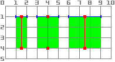

.. tabs::
 .. code-tab:: gdscript GDScript

    func _draw():
        draw_line(Vector2(1.5, 1.0), Vector2(1.5, 4.0), Color.GREEN, 1.0)
        draw_line(Vector2(4.0, 1.0), Vector2(4.0, 4.0), Color.GREEN, 2.0)
        draw_line(Vector2(7.5, 1.0), Vector2(7.5, 4.0), Color.GREEN, 3.0)

 .. code-tab:: csharp

    public override void _Draw()
    {
        DrawLine(new Vector2(1.5f, 1.0f), new Vector2(1.5f, 4.0f), Colors.Green, 1.0f);
        DrawLine(new Vector2(4.0f, 1.0f), new Vector2(4.0f, 4.0f), Colors.Green, 2.0f);
        DrawLine(new Vector2(7.5f, 1.0f), new Vector2(7.5f, 4.0f), Colors.Green, 3.0f);
    }

The same applies to the :ref:`draw_rect <class_CanvasItem_method_draw_rect>`
method with ``filled = false``.

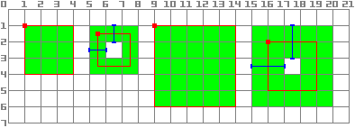

.. tabs::
 .. code-tab:: gdscript GDScript

    func _draw():
        draw_rect(Rect2(1.0, 1.0, 3.0, 3.0), Color.GREEN)
        draw_rect(Rect2(5.5, 1.5, 2.0, 2.0), Color.GREEN, false, 1.0)
        draw_rect(Rect2(9.0, 1.0, 5.0, 5.0), Color.GREEN)
        draw_rect(Rect2(16.0, 2.0, 3.0, 3.0), Color.GREEN, false, 2.0)

 .. code-tab:: csharp

    public override void _Draw()
    {
        DrawRect(new Rect2(1.0f, 1.0f, 3.0f, 3.0f), Colors.Green);
        DrawRect(new Rect2(5.5f, 1.5f, 2.0f, 2.0f), Colors.Green, false, 1.0f);
        DrawRect(new Rect2(9.0f, 1.0f, 5.0f, 5.0f), Colors.Green);
        DrawRect(new Rect2(16.0f, 2.0f, 3.0f, 3.0f), Colors.Green, false, 2.0f);
    }

Antialiased drawing
-------------------

Godot offers method parameters in :ref:`draw_line<class_CanvasItem_method_draw_line>`
to enable antialiasing, but not all custom drawing methods offer this ``antialiased``
parameter.

For custom drawing methods that don't provide an ``antialiased`` parameter,
you can enable 2D MSAA instead, which affects rendering in the entire viewport.
This provides high-quality antialiasing, but a higher performance cost and only
on specific elements. See :ref:`doc_2d_antialiasing` for more information.

Here is a comparison of a line of minimal width (``width=-1``) drawn with
``antialiased=false``, ``antialiased=true``, and ``antialiased=false`` with
2D MSAA 2x, 4x, and 8x enabled.

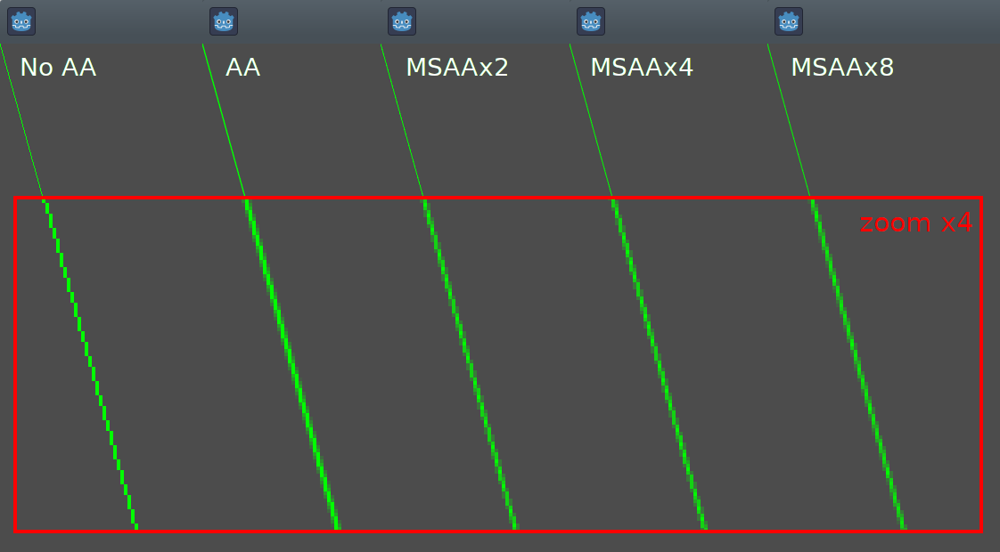

Tools
-----

Drawing your own nodes might also be desired while running them in the
editor. This can be used as a preview or visualization of some feature or
behavior.

To do this, you can use the :ref:`tool annotation<doc_gdscript_tool_mode>`
on both GDScript and C#. See
:ref:`the example below<doc_draw_show_drawing_while_editing_example>` and
:ref:`doc_running_code_in_the_editor` for more information.

.. _doc_draw_custom_example_1:

Example 1: drawing a custom shape
---------------------------------

We will now use the custom drawing functionality of the Godot Engine to draw
something that Godot doesn't provide functions for. We will recreate the Godot
logo but with code- only using drawing functions.

You will have to code a function to perform this and draw it yourself.

.. note::

    The following instructions use a fixed set of coordinates that could be too small
    for high resolution screens (larger than 1080p). If that is your case, and the
    drawing is too small consider increasing your window scale in
    ``Menu > Project > Project settings > display/window/stretch/scale`` to adjust
    the project to a higher resolution (a 2 or 4 scale tends to work well).

Drawing a custom polygon shape
^^^^^^^^^^^^^^^^^^^^^^^^^^^^^^

While there is a dedicated node to draw custom polygons (
:ref:`Polygon2D <class_Polygon2D>`), we will use in this case exclusively lower
level drawing functions to combine them on the same node and be able to create
more complex shapes later on.

First, we will define a set of points -or X and Y coordinates- that will form
the base of our shape:

.. tabs::
 .. code-tab:: gdscript GDScript

    extends Node2D

    var coords_head : Array = [
        [ 22.952, 83.271 ],  [ 28.385, 98.623 ],
        [ 53.168, 107.647 ], [ 72.998, 107.647 ],
        [ 99.546, 98.623 ],  [ 105.048, 83.271 ],
        [ 105.029, 55.237 ], [ 110.740, 47.082 ],
        [ 102.364, 36.104 ], [ 94.050, 40.940 ],
        [ 85.189, 34.445 ],  [ 85.963, 24.194 ],
        [ 73.507, 19.930 ],  [ 68.883, 28.936 ],
        [ 59.118, 28.936 ],  [ 54.494, 19.930 ],
        [ 42.039, 24.194 ],  [ 42.814, 34.445 ],
        [ 33.951, 40.940 ],  [ 25.637, 36.104 ],
        [ 17.262, 47.082 ],  [ 22.973, 55.237 ]
    ]

 .. code-tab:: csharp

    using Godot;

    public partial class MyNode2D : Node2D
    {
        private float[,] _coordsHead =
        {
            { 22.952f, 83.271f },  { 28.385f, 98.623f },
            { 53.168f, 107.647f }, { 72.998f, 107.647f },
            { 99.546f, 98.623f },  { 105.048f, 83.271f },
            { 105.029f, 55.237f }, { 110.740f, 47.082f },
            { 102.364f, 36.104f }, { 94.050f, 40.940f },
            { 85.189f, 34.445f },  { 85.963f, 24.194f },
            { 73.507f, 19.930f },  { 68.883f, 28.936f },
            { 59.118f, 28.936f },  { 54.494f, 19.930f },
            { 42.039f, 24.194f },  { 42.814f, 34.445f },
            { 33.951f, 40.940f },  { 25.637f, 36.104f },
            { 17.262f, 47.082f },  { 22.973f, 55.237f }
        };
    }

This format, while compact, is not the one that Godot understands to
draw a polygon. In a different scenario we could have to load
these coordinates from a file or calculate the positions while the
application is running, so some transformation may be needed.

To transform these coordinates into the right format, we will create a new
method ``float_array_to_Vector2Array()``. Then we will override the ``_ready()``
function, which Godot will call only once -at the start of the execution-
to load those coordinates into a variable:

.. tabs::
 .. code-tab:: gdscript GDScript

    var head : PackedVector2Array

    func float_array_to_Vector2Array(coords : Array) -> PackedVector2Array:
        # Convert the array of floats into a PackedVector2Array.
        var array : PackedVector2Array = []
        for coord in coords:
            array.append(Vector2(coord[0], coord[1]))
        return array

    func _ready():
        head = float_array_to_Vector2Array(coords_head);

 .. code-tab:: csharp

    private Vector2[] _head;

    private Vector2[] FloatArrayToVector2Array(float[,] coords)
    {
        // Convert the array of floats into an array of Vector2.
        int size = coords.GetUpperBound(0);
        Vector2[] array = new Vector2[size + 1];
        for (int i = 0; i <= size; i++)
        {
            array[i] = new Vector2(coords[i, 0], coords[i, 1]);
        }
        return array;
    }

    public override void _Ready()
    {
        _head = FloatArrayToVector2Array(_coordsHead);
    }

To finally draw our first shape, we will use the method
:ref:`draw_polygon <class_CanvasItem_method_draw_polygon>`
and pass the points (as an array of Vector2 coordinates) and its color,
like this:

.. tabs::
 .. code-tab:: gdscript GDScript

    func _draw():
        # We are going to paint with this color.
        var godot_blue : Color = Color("478cbf")
        # We pass the PackedVector2Array to draw the shape.
        draw_polygon(head, [ godot_blue ])

 .. code-tab:: csharp

    public override void _Draw()
    {
        // We are going to paint with this color.
        Color godotBlue = new Color("478cbf");
        // We pass the array of Vector2 to draw the shape.
        DrawPolygon(_head, new Color[]{ godotBlue });
    }

When running it you should see something like this:

.. image:: img/draw_godot_logo_polygon.webp

Note the lower part of the logo looks segmented- this is because a low
amount of points were used to define that part. To simulate a smooth curve,
we could add more points to our array, or maybe use a mathematical function to
interpolate a curve and create a smooth shape from code (see
:ref:`example 2<doc_draw_custom_example_2>`).

Polygons will always **connect its last defined point to its first
one** in order to have a closed shape.

Drawing connected lines
^^^^^^^^^^^^^^^^^^^^^^^

Drawing a sequence of connected lines that don't close down to form a polygon
is very similar to the previous method. We will use a connected set of lines to
draw Godot's logo mouth.

First, we will define the list of coordinates that form the mouth shape, like this:

.. tabs::
 .. code-tab:: gdscript GDScript

    var coords_mouth = [
        [ 22.817, 81.100 ], [ 38.522, 82.740 ],
        [ 39.001, 90.887 ], [ 54.465, 92.204 ],
        [ 55.641, 84.260 ], [ 72.418, 84.177 ],
        [ 73.629, 92.158 ], [ 88.895, 90.923 ],
        [ 89.556, 82.673 ], [ 105.005, 81.100 ]
    ]

 .. code-tab:: csharp

    private float[,] _coordsMouth =
    {
        { 22.817f, 81.100f }, { 38.522f, 82.740f },
        { 39.001f, 90.887f }, { 54.465f, 92.204f },
        { 55.641f, 84.260f }, { 72.418f, 84.177f },
        { 73.629f, 92.158f }, { 88.895f, 90.923f },
        { 89.556f, 82.673f }, { 105.005f, 81.100f }
    };

We will load these coordinates into a variable and define an additional
variable with the configurable line thickness:

.. tabs::
 .. code-tab:: gdscript GDScript

    var mouth : PackedVector2Array
    var _mouth_width : float = 4.4

    func _ready():
        head = float_array_to_Vector2Array(coords_head);
        mouth = float_array_to_Vector2Array(coords_mouth);

 .. code-tab:: csharp

    private Vector2[] _mouth;
    private float _mouthWidth = 4.4f;

    public override void _Ready()
    {
        _head = FloatArrayToVector2Array(_coordsHead);
        _mouth = FloatArrayToVector2Array(_coordsMouth);
    }

And finally we will use the method
:ref:`draw_polyline <class_CanvasItem_method_draw_polyline>` to actually
draw the line, like this:

.. tabs::
 .. code-tab:: gdscript GDScript

    func _draw():
        # We will use white to draw the line.
        var white : Color = Color.WHITE
        var godot_blue : Color = Color("478cbf")

        draw_polygon(head, [ godot_blue ])

        # We draw the while line on top of the previous shape.
        draw_polyline(mouth, white, _mouth_width)

 .. code-tab:: csharp

    public override void _Draw()
    {
        // We will use white to draw the line.
        Color white = Colors.White;
        Color godotBlue = new Color("478cbf");

        DrawPolygon(_head, new Color[]{ godotBlue });

        // We draw the while line on top of the previous shape.
        DrawPolyline(_mouth, white, _mouthWidth);
    }

You should get the following output:

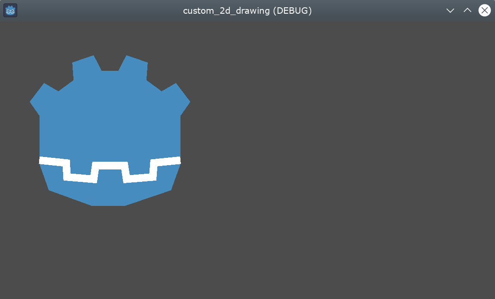

Unlike ``draw_polygon()``, polylines can only have a single unique color
for all its points (the second argument). This method has 2 additional
arguments: the width of the line (which is as small as possible by default)
and enabling or disabling the anti-aliasing (it is disabled by default).

The order of the ``_draw`` calls is important- like with the Node positions on
the tree hierarchy, the different shapes will be drawn from top to bottom,
resulting in the latest shapes hiding earlier ones if they overlap. In this
case we want the mouth drawn over the head, so we put it afterwards.

Notice how we can define colors in different ways, either with a hexadecimal
code or a predefined color name. Check the class :ref:`Color <class_Color>` for other
constants and ways to define Colors.

Drawing circles
^^^^^^^^^^^^^^^

To create the eyes, we are going to add 4 additional calls to draw the eye
shapes, in different sizes, colors and positions.

To draw a circle, you position it based on its center using the
:ref:`draw_circle <class_CanvasItem_method_draw_circle>` method. The first
parameter is a :ref:`Vector2<class_Vector2>` with the coordinates of its center, the second is
its radius, and the third is its color:

.. tabs::
 .. code-tab:: gdscript GDScript

    func _draw():
        var white : Color = Color.WHITE
        var godot_blue : Color = Color("478cbf")
        var grey : Color = Color("414042")

        draw_polygon(head, [ godot_blue ])
        draw_polyline(mouth, white, _mouth_width)

        # Four circles for the 2 eyes: 2 white, 2 grey.
        draw_circle(Vector2(42.479, 65.4825), 9.3905, white)
        draw_circle(Vector2(85.524, 65.4825), 9.3905, white)
        draw_circle(Vector2(43.423, 65.92), 6.246, grey)
        draw_circle(Vector2(84.626, 66.008), 6.246, grey)

 .. code-tab:: csharp

    public override void _Draw()
    {
        Color white = Colors.White;
        Color godotBlue = new Color("478cbf");
        Color grey = new Color("414042");

        DrawPolygon(_head, new Color[]{ godotBlue });
        DrawPolyline(_mouth, white, _mouthWidth);

        // Four circles for the 2 eyes: 2 white, 2 grey.
        DrawCircle(new Vector2(42.479f, 65.4825f), 9.3905f, white);
        DrawCircle(new Vector2(85.524f, 65.4825f), 9.3905f, white);
        DrawCircle(new Vector2(43.423f, 65.92f), 6.246f, grey);
        DrawCircle(new Vector2(84.626f, 66.008f), 6.246f, grey);
    }

When executing it, you should have something like this:

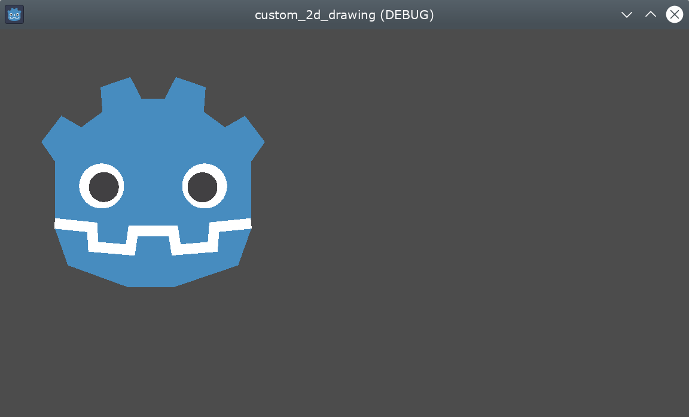

For partial, unfilled arcs (portions of a circle shape between certain
arbitrary angles), you can use the method
:ref:`draw_arc <class_CanvasItem_method_draw_arc>`.

Drawing lines
^^^^^^^^^^^^^

To draw the final shape (the nose) we will use a line to approximate it.

:ref:`draw_line <class_CanvasItem_method_draw_line>` can be used to draw
a single segment by providing its start and end coordinates as arguments,
like this:

.. tabs::
 .. code-tab:: gdscript GDScript

    func _draw():
        var white : Color = Color.WHITE
        var godot_blue : Color = Color("478cbf")
        var grey : Color = Color("414042")

        draw_polygon(head, [ godot_blue ])
        draw_polyline(mouth, white, _mouth_width)
        draw_circle(Vector2(42.479, 65.4825), 9.3905, white)
        draw_circle(Vector2(85.524, 65.4825), 9.3905, white)
        draw_circle(Vector2(43.423, 65.92), 6.246, grey)
        draw_circle(Vector2(84.626, 66.008), 6.246, grey)

        # Draw a short but thick white vertical line for the nose.
        draw_line(Vector2(64.273, 60.564), Vector2(64.273, 74.349), white, 5.8)

 .. code-tab:: csharp

    public override void _Draw()
    {
        Color white = Colors.White;
        Color godotBlue = new Color("478cbf");
        Color grey = new Color("414042");

        DrawPolygon(_head, new Color[]{ godotBlue });
        DrawPolyline(_mouth, white, _mouthWidth);
        DrawCircle(new Vector2(42.479f, 65.4825f), 9.3905f, white);
        DrawCircle(new Vector2(85.524f, 65.4825f), 9.3905f, white);
        DrawCircle(new Vector2(43.423f, 65.92f), 6.246f, grey);
        DrawCircle(new Vector2(84.626f, 66.008f), 6.246f, grey);

        // Draw a short but thick white vertical line for the nose.
        DrawLine(new Vector2(64.273f, 60.564f), new Vector2(64.273f, 74.349f),
                 white, 5.8f);
    }

You should now be able to see the following shape on screen:

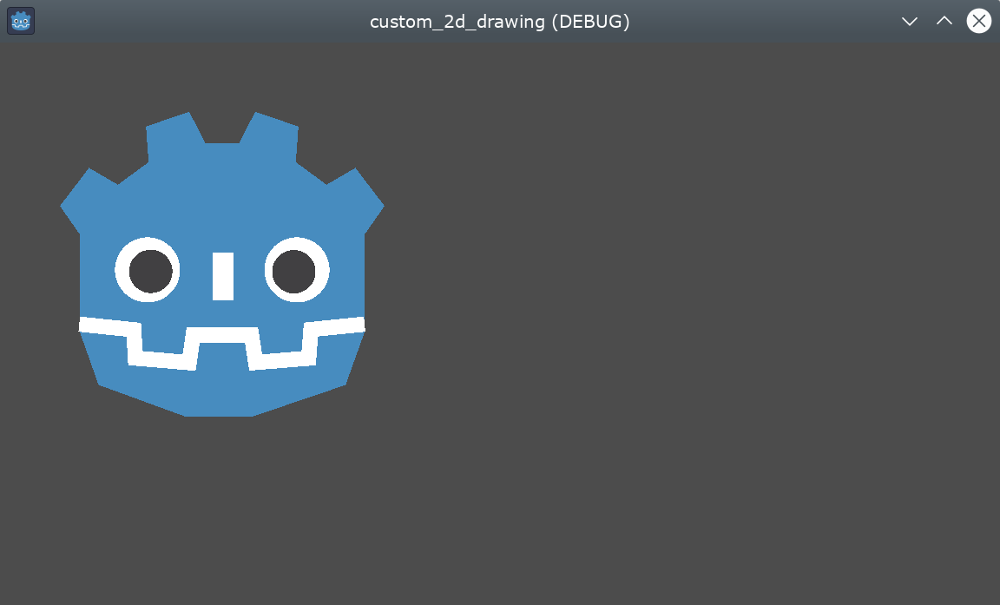

Note that if multiple unconnected lines are going to be drawn at the same time,
you may get additional performance by drawing all of them in a single call, using
the :ref:`draw_multiline <class_CanvasItem_method_draw_multiline>` method.

Drawing text
^^^^^^^^^^^^

While using the :ref:`Label <class_Label>` Node is the most common way to add
text to your application, the low level `_draw` function includes functionality
to add text to your custom Node drawing. We will use it to add the name "GODOT"
under the robot head.

We will use the :ref:`draw_string <class_CanvasItem_method_draw_string>` method
to do it, like this:

.. tabs::
 .. code-tab:: gdscript GDScript

    var default_font : Font = ThemeDB.fallback_font;

    func _draw():
        var white : Color = Color.WHITE
        var godot_blue : Color = Color("478cbf")
        var grey : Color = Color("414042")

        draw_polygon(head, [ godot_blue ])
        draw_polyline(mouth, white, _mouth_width)
        draw_circle(Vector2(42.479, 65.4825), 9.3905, white)
        draw_circle(Vector2(85.524, 65.4825), 9.3905, white)
        draw_circle(Vector2(43.423, 65.92), 6.246, grey)
        draw_circle(Vector2(84.626, 66.008), 6.246, grey)
        draw_line(Vector2(64.273, 60.564), Vector2(64.273, 74.349), white, 5.8)

        # Draw GODOT text below the logo with the default font, size 22.
        draw_string(default_font, Vector2(20, 130), "GODOT",
                    HORIZONTAL_ALIGNMENT_CENTER, 90, 22)

 .. code-tab:: csharp

    private Font _defaultFont = ThemeDB.FallbackFont;

    public override void _Draw()
    {
        Color white = Colors.White;
        Color godotBlue = new Color("478cbf");
        Color grey = new Color("414042");

        DrawPolygon(_head, new Color[]{ godotBlue });
        DrawPolyline(_mouth, white, _mouthWidth);
        DrawCircle(new Vector2(42.479f, 65.4825f), 9.3905f, white);
        DrawCircle(new Vector2(85.524f, 65.4825f), 9.3905f, white);
        DrawCircle(new Vector2(43.423f, 65.92f), 6.246f, grey);
        DrawCircle(new Vector2(84.626f, 66.008f), 6.246f, grey);
        DrawLine(new Vector2(64.273f, 60.564f), new Vector2(64.273f, 74.349f),
                 white, 5.8f);

        // Draw GODOT text below the logo with the default font, size 22.
        DrawString(_defaultFont, new Vector2(20f, 130f), "GODOT",
                   HorizontalAlignment.Center, 90, 22);
    }

Here we first load into the defaultFont variable the configured default theme
font (a custom one can be set instead) and then we pass the following
parameters: font, position, text, horizontal alignment, width, and font size.

You should see the following on your screen:

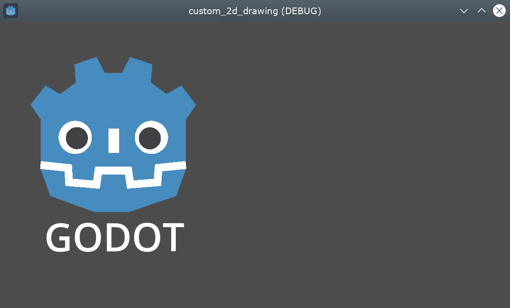

Additional parameters as well as other methods related to text and characters
can be found on the :ref:`CanvasItem <class_CanvasItem>` class reference.

.. _doc_draw_show_drawing_while_editing_example:

Show the drawing while editing
^^^^^^^^^^^^^^^^^^^^^^^^^^^^^^

While the code so far is able to draw the logo on a running window, it will
not show up on the ``2D view`` on the editor. In certain cases you would
also like to show your custom Node2D or control on the editor, to position
and scale it appropriately, like most other nodes do.

To show the logo directly on the editor (without running it), you can use the
:ref:`@tool<doc_gdscript_tool_mode>` annotation to request the custom drawing
of the node to also appear while editing, like this:

.. tabs::
 .. code-tab:: gdscript GDScript

    @tool
    extends Node2D

 .. code-tab:: csharp

    using Godot;

    [Tool]
    public partial class MyNode2D : Node2D

You will need to save your scene, rebuild your project (for C# only) and reload
the current scene manually at the menu option ``Scene > Reload Saved Scene``
to refresh the current node in the ``2D`` view the first time you add or remove
the ``@tool`` annotation.

Animation
^^^^^^^^^

If we wanted to make the custom shape change at runtime, we could modify the
methods called or its arguments at execution time, or apply a transform.

For example, if we want the custom shape we just designed to rotate, we could add
the following variable and code to the ``_ready`` and ``_process`` methods:

.. tabs::
 .. code-tab:: gdscript GDScript

    extends Node2D

    @export var rotation_speed : float = 1  # In radians per second.

    func _ready():
        rotation = 0
        ...

    func _process(delta: float):
        rotation -= rotation_speed * delta

 .. code-tab:: csharp

    [Export]
    public float RotationSpeed { get; set; } = 1.0f;  // In radians per second.

    public override void _Ready()
    {
        Rotation = 0;
        ...
    }

    public override void _Process(double delta)
    {
        Rotation -= RotationSpeed * (float)delta;
    }

The problem with the above code is that because we have created the points
approximately on a rectangle starting from the upper left corner, the ``(0, 0)``
coordinate and extending to the right and down, we see that the rotation is done
using the top left corner as pivot. A position transform change on the node
won't help us here, as the rotation transform is applied first.

While we could rewrite all of the points' coordinates to be centered around
``(0, 0)``, including negative coordinates, that would be a lot of work.

One possible way to work around this is to use the lower level
:ref:`draw_set_transform<class_CanvasItem_method_draw_set_transform>`
method to fix this issue, translating all points in the CanvasItem's own space,
and then moving it back to its original place with a regular node transform,
either in the editor or in code, like this:

.. tabs::
 .. code-tab:: gdscript GDScript

    func _ready():
        rotation = 0
        position = Vector2(60, 60)
        ...

    func _draw():
        draw_set_transform(Vector2(-60, -60))
        ...

 .. code-tab:: csharp

    public override void _Ready()
    {
        Rotation = 0;
        Position = new Vector2(60, 60);
        ...
    }

    public override void _Draw()
    {
        DrawSetTransform(new Vector2(-60.0f, -60.0f));
        ...
    }

This is the result, rotating around a pivot now on ``(60, 60)``:

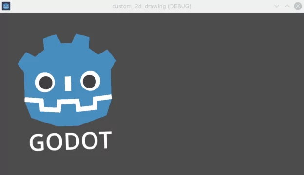

If what we wanted to animate was a property inside the ``_draw()`` call, we must remember to
call ``queue_redraw()`` to force a refresh, as otherwise it would not be updated on screen.

For example, this is how we can make the robot appear to open and close its mouth, by
changing the width of its mouth line follow a sinusoidal (:ref:`sin<class_@globalscope_method_sin>`) curve:

.. tabs::
 .. code-tab:: gdscript GDScript

    var _mouth_width : float = 4.4
    var _max_width : float = 7
    var _time : float = 0

    func _process(delta : float):
        _time += delta
        _mouth_width = abs(sin(_time) * _max_width)
        queue_redraw()

    func _draw():
        ...
        draw_polyline(mouth, white, _mouth_width)
        ...

 .. code-tab:: csharp

    private float _mouthWidth = 4.4f;
    private float _maxWidth = 7f;
    private float _time = 0f;

    public override void _Process(double delta)
    {
        _time += (float)delta;
        _mouthWidth = Mathf.Abs(Mathf.Sin(_time) * _maxWidth);
        QueueRedraw();
    }

    public override void _Draw()
    {
        ...
        DrawPolyline(_mouth, white, _mouthWidth);
        ...
    }

It will look somewhat like this when run:

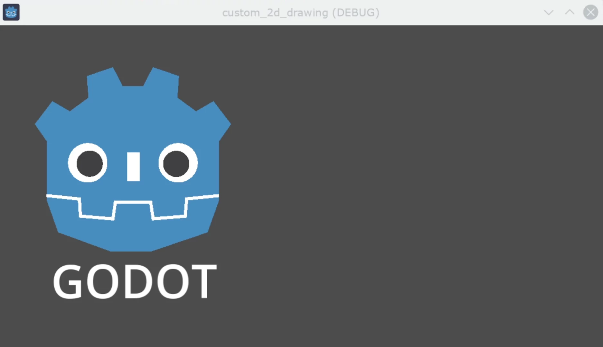

Please note that ``_mouth_width`` is a user defined property like any other
and it or any other used as a drawing argument can be animated using more
standard and high level methods such as a :ref:`Tween<class_Tween>` or an
:ref:`AnimationPlayer<class_AnimationPlayer>` Node. The only difference is
that a ``queue_redraw()`` call is needed to apply those changes so they get
shown on screen.

.. _doc_draw_custom_example_2:

Example 2: drawing a dynamic line
---------------------------------

The previous example was useful to learn how to draw and modify nodes with
custom shapes and animations. This could have some advantages, such as using
exact coordinates and vectors for drawing, rather than bitmaps -which means
they will scale well when transformed on screen. In some cases, similar results
could be achieved composing higher level functionality with nodes such as
:ref:`sprites<class_Sprite2D>` or
:ref:`AnimatedSprites<class_AnimatedSprite2D>` loading SVG resources (which are
also images defined with vectors) and the
:ref:`AnimationPlayer<class_AnimationPlayer>` node.

In other cases that will not be possible because we will not know what the
resulting graphical representation will be before running the code. Here we
will see how to draw a dynamic line whose coordinates are not known beforehand,
and are affected by the user's input.

Drawing a straight line between 2 points
^^^^^^^^^^^^^^^^^^^^^^^^^^^^^^^^^^^^^^^^

Let's assume we want to draw a straight line between 2 points, the first one
will be fixed on the upper left corner ``(0, 0)`` and the second will be defined
by the cursor position on screen.

We could draw a dynamic line between those 2 points like this:

.. tabs::
 .. code-tab:: gdscript GDScript

    extends Node2D

    var point1 : Vector2 = Vector2(0, 0)
    var width : int = 10
    var color : Color = Color.GREEN

    var _point2 : Vector2

    func _process(_delta):
        var mouse_position = get_viewport().get_mouse_position()
        if mouse_position != _point2:
            _point2 = mouse_position
            queue_redraw()

    func _draw():
        draw_line(point1, _point2, color, width)

 .. code-tab:: csharp

    using Godot;
    using System;

    public partial class MyNode2DLine : Node2D
    {
        public Vector2 Point1 { get; set; } = new Vector2(0f, 0f);
        public int Width { get; set; } = 10;
        public Color Color { get; set; } = Colors.Green;

        private Vector2 _point2;

        public override void _Process(double delta)
        {
            Vector2 mousePosition = GetViewport().GetMousePosition();
            if (mousePosition != _point2)
            {
                _point2 = mousePosition;
                QueueRedraw();
            }
        }

        public override void _Draw()
        {
            DrawLine(Point1, _point2, Color, Width);
        }
    }

In this example we obtain the position of the mouse in the default viewport
every frame with the method
:ref:`get_mouse_position <class_Viewport_method_get_mouse_position>`. If the
position has changed since the last draw request (a small optimization to
avoid redrawing on every frame)- we will schedule a redraw. Our ``_draw()``
method only has one line: requesting the drawing of a green line of
width 10 pixels between the top left corner and that obtained position.

The width, color, and position of the starting point can be configured with
with the corresponding properties.

It should look like this when run:

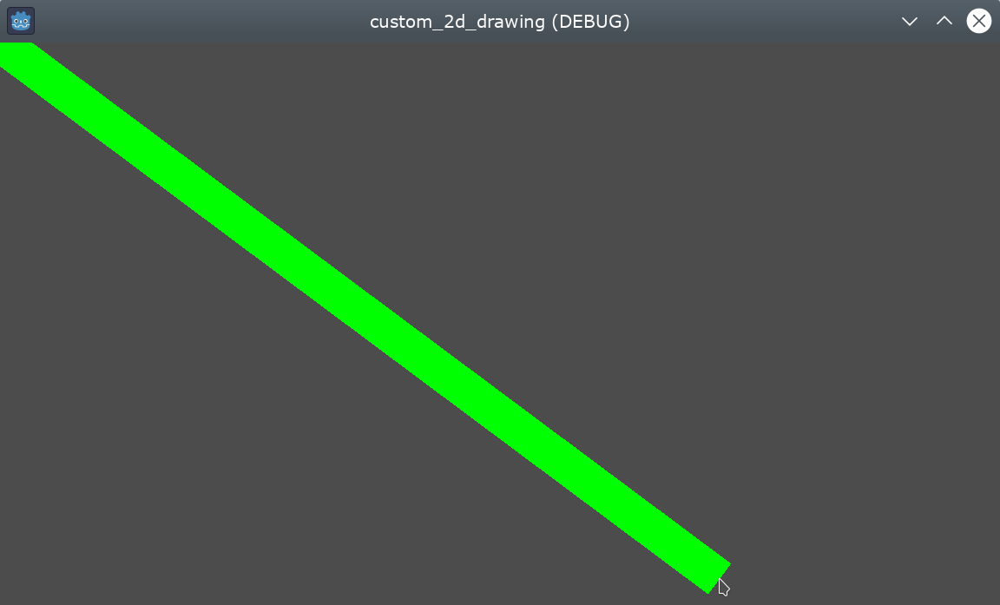

Drawing an arc between 2 points
^^^^^^^^^^^^^^^^^^^^^^^^^^^^^^^

The above example works, but we may want to join those 2 points with a
different shape or function, other than a straight line.

Let's try now creating an arc (a portion of a circumference) between
both points.

Exporting the line starting point, segments, width, color, and antialiasing will
allow us to modify those properties very easily directly from the editor
inspector panel:

.. tabs::
 .. code-tab:: gdscript GDScript

    extends Node2D

    @export var point1 : Vector2 = Vector2(0, 0)
    @export_range(1, 1000) var segments : int = 100
    @export var width : int = 10
    @export var color : Color = Color.GREEN
    @export var antialiasing : bool = false

    var _point2 : Vector2

 .. code-tab:: csharp

    using Godot;
    using System;

    public partial class MyNode2DLine : Node2D
    {
        [Export]
        public Vector2 Point1 { get; set; } = new Vector2(0f, 0f);
        [Export]
        public float Length { get; set; } = 350f;
        [Export(PropertyHint.Range, "1,1000,")]
        public int Segments { get; set; } = 100;
        [Export]
        public int Width { get; set; } = 10;
        [Export]
        public Color Color { get; set; } = Colors.Green;
        [Export]
        public bool AntiAliasing { get; set; } = false;

        private Vector2 _point2;
    }

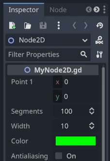

To draw the arc, we can use the method
:ref:`draw_arc<class_CanvasItem_method_draw_arc>`. There are many
arcs that pass through 2 points, so we will chose for this example
the semicircle that has its center in the middle point between the 2 initial
points.

Calculating this arc will be more complex than in the case of the line:

.. tabs::
 .. code-tab:: gdscript GDScript

    func _draw():
        # Calculate the arc parameters.
        var center : Vector2 = Vector2((_point2.x - point1.x) / 2,
                                       (_point2.y - point1.y) / 2)
        var radius : float = point1.distance_to(_point2) / 2
        var start_angle : float = (_point2 - point1).angle()
        var end_angle : float = (point1 - _point2).angle()
        if end_angle < 0:  # end_angle is likely negative, normalize it.
            end_angle += TAU

        # Finally, draw the arc.
        draw_arc(center, radius, start_angle, end_angle, segments, color,
                 width, antialiasing)

 .. code-tab:: csharp

    public override void _Draw()
    {
        // Calculate the arc parameters.
        Vector2 center = new Vector2((_point2.X - Point1.X) / 2.0f,
                                        (_point2.Y - Point1.Y) / 2.0f);
        float radius = Point1.DistanceTo(_point2) / 2.0f;
        float startAngle = (_point2 - Point1).Angle();
        float endAngle = (Point1 - _point2).Angle();
        if (endAngle < 0.0f)  // endAngle is likely negative, normalize it.
        {
            endAngle += Mathf.Tau;
        }

        // Finally, draw the arc.
        DrawArc(center, radius, startAngle, endAngle, Segments, Color,
                Width, AntiAliasing);
    }

The center of the semicircle will be the middle point between both points.
The radius will be half the distance between both points.
The start and end angles will be the angles of the vector from point1
to point2 and vice-versa.
Note we had to normalize the ``end_angle`` in positive values because if
``end_angle`` is less than ``start_angle``, the arc will be drawn
counter-clockwise, which we don't want in this case (the arc would be
upside-down).

The result should be something like this, with the arc going down and
between the points:

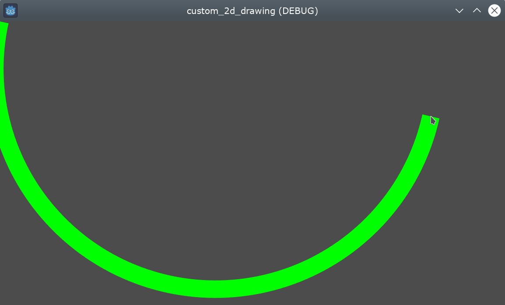

Feel free to play with the parameters in the inspector to obtain different
results: change the color, the width, the antialiasing, and increase the
number of segments to increase the curve smoothness, at the cost of extra
performance.
