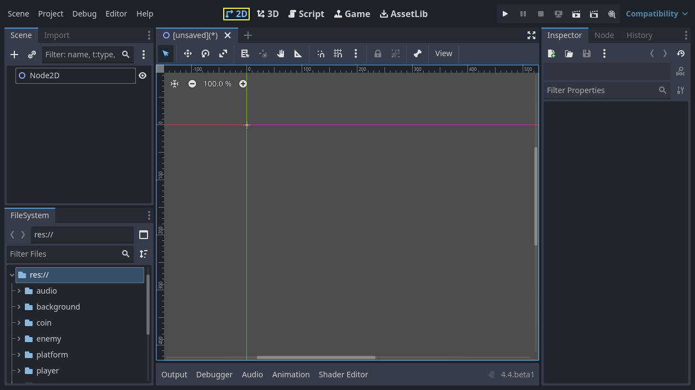
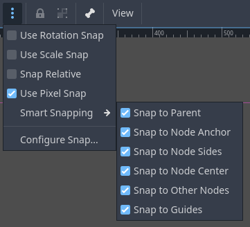
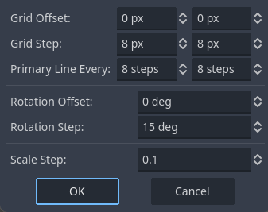

.. _doc_introduction_to_2d:

Introduction to 2D
==================

Godot's 2D game development tools include a dedicated 2D rendering engine, physics system, 
and features tailored specifically for creating 2D experiences. You can efficiently design 
levels with the TileMap system, animate characters with 2D sprite or Cutout animation, 
and leverage 2D lighting for dynamic scene illumination. The built-in 2D particle system 
allows you to create complex visual effects, and Godot also supports custom shaders to 
enhance your graphics. These features, combined with Godot's accessibility and 
flexibility, provide a solid foundation for creating engaging 2D games.

   
   2D Platformer Demo available on the Asset Library.

This page will show you the 2D workspace and how you can get to know it.

.. tip:: If you would like to get an introduction to 3D, see :ref:`doc_introduction_to_3d`.

2D workspace
------------

You will use the 2D workspace to work with 2D scenes, design levels, or create user 
interfaces.
To switch to the 2D workspace, you can either select a 2D node from the scene tree, 
or use the workspace selector located at the top edge of the editor:

Similar to 3D, you can use the tabs below the workspace selector to change between currently 
opened scenes or create a new one using the plus (+) button. The left and right docks should 
be familiar from :ref:`editor introduction <toc-editor-interface>`.

Below the scene selector is the main toolbar, and beneath the main toolbar
is the 2D viewport.

You can drag and drop compatible nodes from the FileSystem dock to add them to the 
viewport as nodes.
Dragging and dropping adds the dragged node as a sibling of the selected node 
(if the root node is selected, adds as a child).
Keeping :kbd:`Shift` pressed when dropping adds the node as a child of the selected node.
Holding :kbd:`Alt` when dropping adds the node as a child of the root node.
If :kbd:`Alt + Shift` is held when dropping, the node type can be selected if 
applicable.

Main toolbar
~~~~~~~~~~~~

Some buttons in the main toolbar are the same as those in the 3D workspace. A brief explanation
is given with the shortcut if the mouse cursor is hovered over a button for one second. 
Some buttons may have additional functionality if another keypress is performed. 
A recap of main functionality of each button with its default shortcut is provided below 
from left to right:

- **Select Mode** (:kbd:`Q`): Allows selection of nodes in the viewport. Left clicking on a node 
  in the viewport selects it.
  Left clicking and dragging a rectangle selects all nodes within the rectangle's boundaries,
  once released.
  Holding :kbd:`Shift` while selecting adds more nodes to the selection.
  Clicking on a selected node while holding :kbd:`Shift` deselects the node.
  In this mode, you can drag the selected node(s) to move, press :kbd:`Ctrl` to switch to the 
  rotation mode temporarily, or use the red circles to scale it. If multiple nodes are 
  selected, only movement and rotation are possible. In this mode, rotation and scaling 
  will not use the snapping options if snapping is enabled.
- **Move Mode** (:kbd:`W`): Enables move (or translate) mode for the selected nodes. See 
  :ref:`doc_introduction_to_2d_the_viewport` for more details.
- **Rotate Mode** (:kbd:`E`): Enables rotation mode for the selected nodes. See 
  :ref:`doc_introduction_to_2d_the_viewport` for more details.
- **Scale Mode** (:kbd:`S`): Enables scaling and displays scaling gizmos in both 
  axes for the selected node(s). See :ref:`doc_introduction_to_2d_the_viewport` for more details.
- **Show list of selectable nodes at position clicked**: As the description suggests, 
  this provides a list of selectable nodes at the clicked position as a context menu, if 
  there is more than one node in the clicked area.
- **Rotation pivot**: Sets the rotation pivot to rotate node(s) around.
  An added node has its rotation pivot at ``x: 0``, ``y: 0``, by default, with
  exceptions. For example, the default pivot for a :ref:`Sprite2D <class_Sprite2D>` is its 
  center if the ``centered`` property is set to ``true``. If you would like to change the 
  rotation pivot of a node, click this button and choose a new location by left clicking. 
  The node rotates considering this point. If you have multiple nodes selected, this icon 
  will add a temporary pivot to be used commonly by all selected nodes. Pressing :kbd:`Shift` 
  and clicking this button will create the pivot at the center of selected nodes. If any of 
  the snap options are enabled, the pivot will also snap to them when dragged.
- **Pan Mode** (:kbd:`G`): Allows you to navigate in the viewport without accidentally selecting any nodes.
  In other modes, you can also hold :kbd:`Space` and drag with the left mouse button to do the same.
- **Ruler Mode**: After enabling, click on the viewport to display the current global 
  x and y coordinates. Dragging from a position to another one measures the distance in pixels.
  If you drag diagonally, it will draw a triangle and show the separate distances in terms 
  of x, y, and total distance to the target, including the angles to the axes in degrees.
  The :kbd:`R` key activates the ruler. If snapping is enabled, it also displays the 
  measurements in terms of grid count:

   
   Using ruler with snapping enabled.

- **Use Smart Snap**: Toggles smart snapping for move, rotate, and scale modes; and 
  the rotation pivot. Customize it using the three-dot menu next to the snap tools.
- **Use Grid Snap**: Toggles snapping to grid for move and scale mode, rotation pivot, 
  and the ruler. Customize it using the three-dot menu next to the snap tools.

You can customize the grid settings so that move mode, rotate mode, scale mode, ruler, 
and rotation pivot uses snapping.
Use the three-dot menu for this:

- **Use Rotation Snap**: Toggles snapping using the configured rotation setting.
- **Use Scale Snap**: Toggles snapping using the configured scaling step setting.
- **Snap Relative**: Toggles the usage of snapping based on the selected node's current 
  transform values. For example, if the grids are set to 32x32 pixels and if the selected node 
  is located at ``x: 1, y: 1``, then, enabling this option will temporarily shift the grids by 
  ``x: 1, y: 1``.
- **Use Pixel Snap**: Toggles the use of subpixels for snapping. If enabled, the position values 
  will be integers, disabling will enable subpixel movement as decimal values. For the runtime 
  property, consider checking `Project Settings > Rendering > 2D > Snapping` property for 
  Node2D nodes, and `Project Settings > GUI > General > Snap Controls to Pixels` for 
  Control nodes.
- **Smart Snapping**: Provides a set of options to snap to specific positions if they are enabled:

  - Snap to Parent: Snaps to parent's edges. For example, scaling a child control node while 
    this is enabled will snap to the boundaries of the parent.
  - Snap to Node Anchor: Snaps to the node's anchor. For example, if anchors of a control 
    node is positioned at different positions, enabling this will snap to the sides and 
    corners of the anchor.
  - Snap to Node Sides: Snaps to the node's sides, such as for the rotation pivot or anchor 
    positioning.
  - Snap to Node Center: Snaps to the node's center, such as for the rotation pivot or 
    anchor positioning.
  - Snap to Other Nodes: Snaps to other nodes while moving or scaling. Useful to align nodes 
    in the editor.
  - Snap to Guides: Snaps to custom guides drawn using the horizontal or vertical ruler. More 
    on the ruler and guides below.

- **Configure Snap**: Opens the window shown above, offering a set of snapping parameters.

  - Grid Offset: Allows you to shift grids with respect to the origin. ``x`` and ``y`` can 
    be adjusted separately.
  - Grid Step: The distance between each grid in pixels. ``x`` and ``y`` can be adjusted separately.
  - Primary Line Every: The number of grids in-between to draw infinite lines as indication of 
    main lines.
  - Rotation Offset: Sets the offset to shift rotational snapping.
  - Rotation Step: Defines the snapping degree. E.g., 15 means the node will rotate and snap 
    at multiples of 15 degrees if rotation snap is enabled and the rotate mode is used.
  - Scale Step: Determines the scaling increment factor. For example, if it is 0.1, it will 
    change the scaling at 0.1 steps if scaling snap is enabled and the scaling mode is used.

- **Lock selected nodes** (:kbd:`Ctrl + L`). Locks the selected nodes, preventing selection and movement in the 
  viewport. Clicking the button again (or using :kbd:`Ctrl + Shift + L`) unlocks the selected 
  nodes. Locked nodes can only be selected in the scene tree.
  They can easily be identified by a padlock next to their node names in the scene tree. 
  Clicking on this padlock also unlocks the nodes.
- **Group selected nodes** (:kbd:`Ctrl + G`). This allows selection of the root node if any 
  of the children are selected. Using :kbd:`Ctrl + G` ungroups them. Additionally, clicking 
  the ungroup button in the scene tree performs the same action.
- **Skeleton Options**: Provides options to work with Skeleton2D and Bone2D.

  - Show Bones: Toggles the visibility of bones for the selected node.
  - Make Bone2D Node(s) from Node(s): Converts selected node(s) into Bone2D. 

.. seealso:: To learn more about Skeletons, see :ref:`doc_cutout_animation`.
  
- **View** menu: Provides options to control the viewport view. Since its options 
  depend heavily on the viewport, it is covered in the :ref:`doc_introduction_to_2d_the_viewport` 
  section.

Next to the View menu, additional buttons may be visible. In the toolbar image
at the beginning of this chapter, an additional *Sprite2D* button appears because a
Sprite2D is selected. This menu provides some quick actions and tools to
work on a specific node or selection. For example, while drawing a polygon, it
provides buttons to add, modify, or remove points.

Coordinate system
~~~~~~~~~~~~~~~~~

In the 2D editor, unlike 3D, there are only two axes: ``x`` and ``y``. Also, the viewing 
angle is fixed.

In the viewport, you will see two lines in two colors going across the screen infinitely: 
red for the x-axis, and green for the y-axis.
In Godot, going right and down are positive directions.
Where these two lines intersect is the origin: ``x: 0, y: 0``.

A root node will have its origin at this position once added.
Switching to the `move` or `scale` modes after selecting a node will display the gizmos at the 
node's offset position.
The gizmos will point to the positive directions of the x and y axes.
In the move mode, you can drag the green line to move only in the ``y`` axis.
Similarly, you can hold the red line to move only in the ``x`` axis.

In the scale mode, the gizmos will have a square shape. You can hold and drag the green and 
red squares to scale the nodes in the ``y`` or ``x`` axes.
Dragging in a negative direction flips the node horizontally or vertically.

.. _doc_introduction_to_2d_the_viewport:

2D Viewport
~~~~~~~~~~~

The viewport will be the area you spend the most time if you plan to design levels or user 
interfaces visually:

.. image:: img/2d_editor_viewport_with_viewmenu.webp

Middle-clicking and dragging the mouse will pan the view. 
The scrollbars on the right or bottom of the viewport also move the view.
Alternatively, the :kbd:`G` or :kbd:`Space` keys can be used.
If you enable `Editor Settings > Editors > Panning > Simple Panning`, you can activate
panning directly with :kbd:`Space` only, without requiring dragging.

The viewport has buttons on the top-left.
**Center View** centers the selected node(s) in the screen. Useful if you have a large scene 
with many nodes, and want to see the node selected in the scene tree.
Next to it are the zoom controls. **-** zooms out, **+** zooms in, and clicking on the number 
with percentage defaults to 100%.
Alternatively, you can use middle-mouse scrolling to zoom in (scroll up) and out (scroll down).

The black bars at the viewport's left and top edges are the **rulers**. You can use them to 
orient yourself in the viewport.
By default, the rulers will display the pixel coordinates of the viewport, numbered at 
100 pixel steps. Changing the zoom factor will change the shown values.
Enabling `Grid Snap` or changing the snapping options will update the ruler's scaling and 
the shown values.

You can also create multiple custom guides to help you make measurements or align 
nodes with them:

.. image:: img/2d_editor_guidelines.webp

If you have at least one node in the scene, you can create guides by dragging from the horizontal 
or vertical ruler towards the viewport. A purple guide will appear, showing its position, and will 
remain there when you release the mouse. You can create both horizontal and vertical guides 
simultaneously by dragging from the gray square at the rulers' intersection. Guides can be 
repositioned by dragging them back to their respective rulers, and they can be removed by 
dragging them all the way back to the ruler.

You can also enable snapping to the created guides using the `Smart Snap` menu.

.. note:: If you cannot create a line, or do not see previously created guides, make sure that 
          they are visible by checking the `View` menu of the viewport. :kbd:`Y` toggles their visibility, 
          by default. Also, make sure you have at least one node in the scene.

Depending on the tool chosen in the toolbar, left-clicking will have a primary action in the 
viewport.
For example, the `Select Mode` will select the left-clicked node in the viewport.
Sometimes, left-clicking can be combined with a modifier (e.g., :kbd:`Ctrl`, or :kbd:`Shift`) to 
perform secondary actions.
For example, keeping :kbd:`Shift` pressed while dragging a node in the Select or Move modes will 
try to snap the node in a single axis while moving.

Right clicking in the viewport provides two options to create a node or instantiate a scene 
at the chosen position.
If at least one node is selected, right clicking also provides the option to move the selected 
node(s) to this position.

Viewport has a **View** menu which provides several options to change the look of the viewport:

- **Grid**: Allows you to show grids all the time, only when using snapping, or not at all. You 
  can also toggle them with the provided option.
- **Show Helpers**: Toggles the temporary display of an outline of the node, with the previous 
  transform properties (position, scaling, or rotation) if a transform operation has been 
  initiated. For `Control` nodes, it also shows the sizing parameters. Useful to see the deltas.
- **Show Rulers**: Toggles the visibility of horizontal and vertical rulers. See 
  :ref:`doc_introduction_to_2d_the_viewport` more on rulers.
- **Show Guides**: Toggles the visibility of created guides. See 
  :ref:`doc_introduction_to_2d_the_viewport` for on how to create them.
- **Show Origin**: Toggles the display of the green and red origin lines drawn at ``x: 0, y: 0``.
- **Show Viewport**: Toggles the visibility of the game's default 
  viewport, indicated by an indigo-colored rectangle. It is also the default window size on desktop 
  platforms, which can be changed by going to `Project Settings > Display > Window > Size` and 
  setting `Viewport Width` and `Viewport Height`.
- **Gizmos**: Toggles the visibility of `Position` (shown with cross icon), `Lock` 
  (shown with padlock), `Groups` (shown with two squares), and `Transformation` (shown with 
  green and red lines) indicators.
- **Center Selection**: The same as the **Center View** button inside the viewport. Centers the selected 
  node(s) in the view. :kbd:`F` is the default shortcut.
- **Frame to Selection**: Similar to `Center Selection`, but also changes the zoom factor to fit the 
  contents in the screen. :kbd:`Shift + F` is the default shortcut.
- **Clear Guides**: Deletes all guides from the screen. You will need to recreate them if 
  you plan to use them later. 
- **Preview Canvas Scale**: Toggles the preview for scaling of canvas in the editor when the zoom 
  factor or view of the viewport changes. Useful to see how the controls will look like after scaling 
  and moving, without running the game.
- **Preview Theme**: Allows to choose from the available themes to change the look of control items 
  in the editor, without requiring to run the game.

Node2D and Control node
-----------------------

:ref:`CanvasItem <class_CanvasItem>` is the base node for 2D. :ref:`Node2D <class_Node2D>` is the base node
for 2D game objects, and :ref:`Control <class_Control>` is the base node 
for everything GUI. For 3D, Godot uses the :ref:`Node3D <class_Node3D>` node.

3D in 2D
--------

It is possible to display 3D scenes in 2D screen, You can see this in the demo `3D in 2D Viewport <https://godotengine.org/asset-library/asset/2804>`__.

