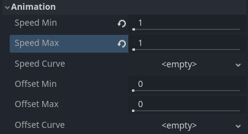
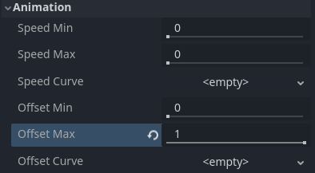

.. _doc_particle_process_material_2d:

ParticleProcessMaterial 2D Usage
================================

Process material properties
---------------------------

   Min, max, and curve properties

The properties in this material control how particles behave and change over their lifetime.
A lot of them have ``Min``, ``Max``, and ``Curve`` values that allow you to fine-tune
their behavior. The relationship between these values is this: When a particle is spawned,
the property is set with a random value between ``Min`` and ``Max``. If ``Min`` and ``Max`` are
the same, the value will always be the same for every particle. If the ``Curve`` is also set,
the value of the property will be multiplied by the value of the curve at the current point
in a particle's lifetime. Use the curve to change a property over the particle lifetime. Very
complex behavior can be expressed this way.

.. note::
  This page covers how to use ParticleProcessMaterial for 2D scenes specifically.
  For information on how to use it in a 3D scene see :ref:`doc_process_material_properties`.

Lifetime Randomness
~~~~~~~~~~~~~~~~~~~

The ``Lifetime Randomness`` property controls how much randomness to apply to each particle's
lifetime. A value of ``0`` means there is no randomness at all and all particles live for
the same amount of time, set by the :ref:`Lifetime <doc_3d_particles_properties_time>` property. A value of ``1`` means
that a particle's lifetime is completely random within the range of [0.0, ``Lifetime``].

Particle Flags
--------------

Spawn
-----

Angle
~~~~~

Determines the initial angle of the particle (in degrees). This parameter
is mostly useful randomized.

.. image:: img/paranim11.gif

Velocity
~~~~~~~~

Direction
^^^^^^^^^

This is the base direction at which particles emit. The default is
``Vector3(1, 0, 0)`` which makes particles emit to the right. However,
with the default gravity settings, particles will go straight down.

.. image:: img/direction1.png

For this property to be noticeable, you need an *initial velocity* greater
than 0. Here, we set the initial velocity to 40. You'll notice that
particles emit toward the right, then go down because of gravity.

.. image:: img/direction2.png

Spread
^^^^^^

This parameter is the angle in degrees which will be randomly added in
either direction to the base ``Direction``. A spread of ``180`` will emit
in all directions (+/- 180). For spread to do anything the "Initial Velocity"
parameter must be greater than 0.

.. image:: img/paranim3.gif

Flatness
^^^^^^^^

This property is only useful for 3D particles.

Initial Velocity
^^^^^^^^^^^^^^^^

Initial velocity is the speed at which particles will be emitted (in
pixels/sec). Speed might later be modified by gravity or other
accelerations (as described further below).

.. image:: img/paranim4.gif

Animated Velocity
-----------------

Angular Velocity
~~~~~~~~~~~~~~~~

Angular velocity is the speed at which particles rotate around their center
(in degrees/sec).

.. image:: img/paranim5.gif

Orbit Velocity
~~~~~~~~~~~~~~

Orbit velocity is used to make particles turn around their center.

.. image:: img/paranim6.gif

Accelerations
-------------

Gravity
~~~~~~~

The gravity applied to every particle.

.. image:: img/paranim7.gif

Linear Acceleration
~~~~~~~~~~~~~~~~~~~

The linear acceleration applied to each particle.

Radial Acceleration
~~~~~~~~~~~~~~~~~~~

If this acceleration is positive, particles are accelerated away from
the center. If negative, they are absorbed towards it.

.. image:: img/paranim8.gif

Tangential Acceleration
~~~~~~~~~~~~~~~~~~~~~~~

This acceleration will use the tangent vector to the center. Combining
with radial acceleration can do nice effects.

.. image:: img/paranim9.gif

Damping
~~~~~~~

Damping applies friction to the particles, forcing them to stop. It is
especially useful for sparks or explosions, which usually begin with a
high linear velocity and then stop as they fade.

.. image:: img/paranim10.gif

Display
-------

Scale
~~~~~

Determines the initial scale of the particles.

.. image:: img/paranim12.gif

Color Curves
~~~~~~~~~~~~

Color
^^^^^

Used to change the color of the particles being emitted.

Hue Variation
~~~~~~~~~~~~~

The ``Variation`` value sets the initial hue variation applied to each
particle. The ``Variation Random`` value controls the hue variation
randomness ratio.

.. _doc_particle_systems_2d_animation:

Animation
~~~~~~~~~

.. note::

    Particle flipbook animation is only effective if the CanvasItemMaterial used
    on the GPUParticles2D or CPUParticles2D node has been
    :ref:`configured accordingly <doc_particle_systems_2d_using_flipbook>`.

To set up the particle flipbook for linear playback, set the **Speed Min** and **Speed Max** values to 1:

   Setting up particle animation for playback during the particle's lifetime

By default, looping is disabled. If the particle is done playing before its
lifetime ends, the particle will keep using the flipbook's last frame (which may
be fully transparent depending on how the flipbook texture is designed). If
looping is enabled, the animation will loop back to the first frame and resume
playing.

Depending on how many images your sprite sheet contains and for how long your
particle is alive, the animation might not look smooth. The relationship between
particle lifetime, animation speed, and number of images in the sprite sheet is
this:

.. note::

   At an animation speed of ``1.0``, the animation will reach the last image
   in the sequence just as the particle's lifetime ends.

   .. math::
      Animation\ FPS = \frac{Number\ of\ images}{Lifetime}

If you wish the particle flipbook to be used as a source of random particle
textures for every particle, keep the speed values at 0 and set **Offset Max**
to 1 instead:

   Setting up particle animation for random offset on emission

Note that the GPUParticles2D node's **Fixed FPS** also affects animation
playback. For smooth animation playback, it's recommended to set it to 0 so that
the particle is simulated on every rendered frame. If this is not an option for
your use case, set **Fixed FPS** to be equal to the effective framerate used by
the flipbook animation (see above for the formula).

Emission Shapes
---------------

ParticleProcessMaterials allow you to set an Emission Mask, which dictates
the area and direction in which particles are emitted.
These can be generated from textures in your project.

Ensure that a ParticleProcessMaterial is set, and the GPUParticles2D node is selected.
A "Particles" menu should appear in the Toolbar:

Open it and select "Load Emission Mask":

Then select which texture you want to use as your mask:

A dialog box with several settings will appear.

Emission Mask
~~~~~~~~~~~~~

Three types of emission masks can be generated from a texture:

-  Solid Pixels: Particles will spawn from any area of the texture,
   excluding transparent areas.

.. image:: img/emission_mask_solid.gif

-  Border Pixels: Particles will spawn from the outer edges of the texture.

.. image:: img/emission_mask_border.gif

-  Directed Border Pixels: Similar to Border Pixels, but adds extra
   information to the mask to give particles the ability to emit away
   from the borders. Note that an ``Initial Velocity`` will need to
   be set in order to utilize this.

.. image:: img/emission_mask_directed_border.gif

Emission Colors
~~~~~~~~~~~~~~~

``Capture from Pixel`` will cause the particles to inherit the color of the mask at their spawn points.

Once you click "OK", the mask will be generated and set to the
ParticleProcessMaterial, under ``Spawn`` and  then ``Position``

All of the values within this section have been automatically generated by the
"Load Emission Mask" menu, so they should generally be left alone.

.. note:: An image should not be added to ``Point Texture`` or ``Color Texture`` directly.
          The "Load Emission Mask" menu should always be used instead.

Customizing the process material
--------------------------------

If you need to change or implement new behaviors in shader code, you can do so by converting
the current ParticleProcessMaterial to a :ref:`class_ShaderMaterial`. Existing properties
are preserved by the conversion process. Features that are enabled will also affect
what's present in the converted shader code.

To do so, right-click on the material in the FileSystem dock and choose
**Convert to ShaderMaterial**. You can also do so by right-clicking on any
property holding a reference to the material in the inspector.
