:article_outdated: True

.. _doc_particle_systems_2d:

2D particle systems
===================

Intro
-----

Particle systems are used to simulate complex physical effects,
such as sparks, fire, magic particles, smoke, mist, etc.

The idea is that a "particle" is emitted at a fixed interval and with a
fixed lifetime. During its lifetime, every particle will have the same
base behavior. What makes each particle different from the rest and provides a more
organic look is the "randomness" associated with each parameter. In
essence, creating a particle system means setting base physics
parameters and then adding randomness to them.

Particle nodes
~~~~~~~~~~~~~~

Godot provides two different nodes for 2D particles, :ref:`class_GPUParticles2D`
and :ref:`class_CPUParticles2D`. GPUParticles2D is more advanced and uses the
GPU to process particle effects. CPUParticles2D is a CPU-driven option with
near-feature parity with GPUParticles2D, but lower performance when using large
amounts of particles. On the other hand, CPUParticles2D may perform better on
low-end systems or in GPU-bottlenecked situations.

While GPUParticles2D is configured via a :ref:`class_ParticleProcessMaterial`
(and optionally with a custom shader), the matching options are provided via
node properties in CPUParticles2D (with the exception of the trail settings).

You can convert a GPUParticles2D node into a CPUParticles2D node by clicking on
the node in the inspector, selecting the 2D viewport, and selecting
**GPUParticles2D > Convert to CPUParticles2D** in the viewport toolbar.

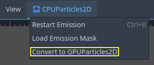

The rest of this tutorial is going to use the GPUParticles2D node. First, add a GPUParticles2D
node to your scene. After creating that node you will notice that only a white dot was created,
and that there is a warning icon next to your GPUParticles2D node in the scene dock. This
is because the node needs a ParticleProcessMaterial to function.

ParticleProcessMaterial
~~~~~~~~~~~~~~~~~~~~~~~

To add a process material to your particles node, go to ``Process Material`` in
your inspector panel. Click on the box next to ``Material``, and from the dropdown
menu select ``New ParticleProcessMaterial``.

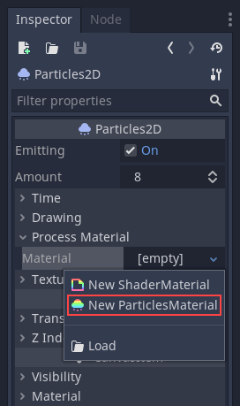

Your GPUParticles2D node should now be emitting
white points downward.

Texture
~~~~~~~

A particle system can use a single texture or an animation *flipbook*. A
flipbook is a texture that contains several frames of animation that can be
played back, or chosen at random during emission. This is equivalent to a
spritesheet for particles.

The texture is set via the **Texture** property:

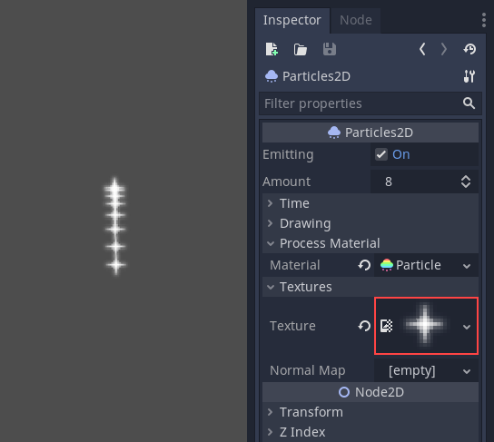

.. _doc_particle_systems_2d_using_flipbook:

Using an animation flipbook
^^^^^^^^^^^^^^^^^^^^^^^^^^^

Particle flipbooks are suited to reproduce complex effects such as smoke, fire,
explosions. They can also be used to introduce random texture variation, by
making every particle use a different texture. You can find existing particle
flipbook images online, or pre-render them using external tools such as `Blender
<https://www.blender.org/>`__ or `EmberGen <https://jangafx.com/software/embergen/>`__.

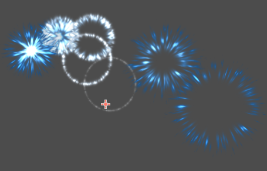

   Example of a particle system that uses a flipbook texture

Using an animation flipbook requires additional configuration compared to a
single texture. For demonstration purposes, we'll use this texture with 5
columns and 7 rows (right-click and choose **Save as…**):

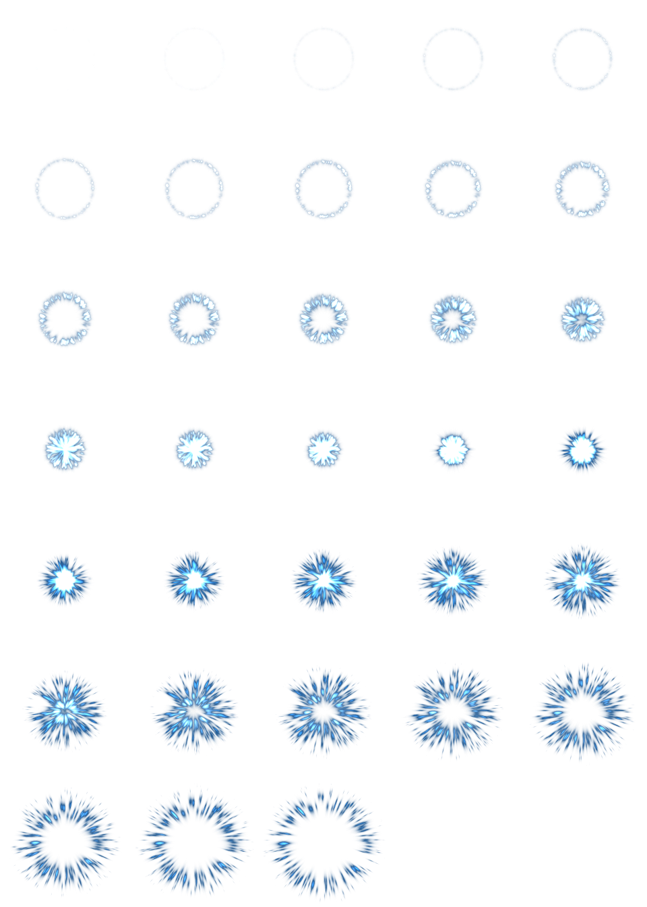

   Credit: `JoesAlotofthings <https://opengameart.org/content/alot-of-particles-indispersal-special-effect-alotofparticles30>`__
   (CC BY 4.0)

To use an animation flipbook, you must create a new CanvasItemMaterial in the
Material section of the GPUParticles2D (or CPUParticles2D) node:

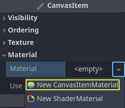

   Creating a CanvasItemMaterial at the bottom of the particles node inspector

In this CanvasItemMaterial, enable **Particle Animation** and set **H Frames** and **V Frames**
to the number of columns and rows present in your flipbook texture:

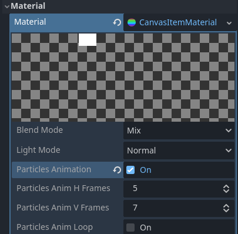

   Configuring the CanvasItemMaterial for the example flipbook texture

Once this is done, the :ref:`Animation section <doc_particle_systems_2d_animation>`
in ParticleProcessMaterial (for GPUParticles2D) or in the CPUParticles2D inspector
will be effective.

.. tip::

    If your flipbook texture has a black background instead of a transparent
    background, you will also need to set the blend mode to **Add** instead of
    **Mix** for correct display. Alternatively, you can modify the texture to
    have a transparent background in an image editor. In `GIMP <https://gimp.org>`__,
    this can be done using the **Color > Color to Alpha** menu.

Time parameters
---------------

Lifetime
~~~~~~~~

The time in seconds that every particle will stay alive. When lifetime
ends, a new particle is created to replace it.

Lifetime: 0.5

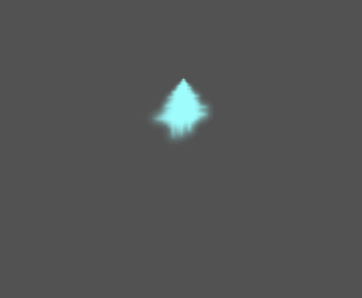

Lifetime: 4.0

.. image:: img/paranim15.gif

One Shot
~~~~~~~~

When enabled, a GPUParticles2D node will emit all of its particles once
and then never again.

Preprocess
~~~~~~~~~~

Particle systems begin with zero particles emitted, then start emitting.
This can be an inconvenience when loading a scene and systems like
a torch, mist, etc. begin emitting the moment you enter. Preprocess is
used to let the system process a given number of seconds before it is
actually drawn the first time.

Speed Scale
~~~~~~~~~~~

The speed scale has a default value of ``1`` and is used to adjust the
speed of a particle system. Lowering the value will make the particles
slower while increasing the value will make the particles much faster.

Explosiveness
~~~~~~~~~~~~~

If lifetime is ``1`` and there are 10 particles, it means a particle
will be emitted every 0.1 seconds. The explosiveness parameter changes
this, and forces particles to be emitted all together. Ranges are:

-  0: Emit particles at regular intervals (default value).
-  1: Emit all particles simultaneously.

Values in the middle are also allowed. This feature is useful for
creating explosions or sudden bursts of particles:

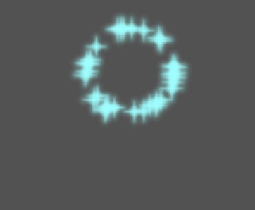

Randomness
~~~~~~~~~~

All physics parameters can be randomized. Random values range from ``0`` to
``1``. The formula to randomize a parameter is:

::

    initial_value = param_value + param_value * randomness

Fixed FPS
~~~~~~~~~

This setting can be used to set the particle system to render at a fixed
FPS. For instance, changing the value to ``2`` will make the particles render
at 2 frames per second. Note this does not slow down the particle system itself.

Fract Delta
~~~~~~~~~~~

This can be used to turn Fract Delta on or off.

Drawing parameters
------------------

Visibility Rect
~~~~~~~~~~~~~~~

The visibility rectangle controls the visibility of the particles on screen. If this rectangle is outside of the viewport, the engine will not render the particles on screen.

The rectangle's ``W`` and ``H`` properties respectively control its Width and its Height.
The ``X`` and ``Y`` properties control the position of the upper-left
corner of the rectangle, relative to the particle emitter.

You can have Godot generate a Visibility Rect automatically using the toolbar above the 2d view. To do so, select the GPUParticles2D node and Click ``Particles > Generate Visibility Rect``. Godot will simulate the Particles2D node emitting particles for a few seconds and set the rectangle to fit the surface the particles take.

You can control the emit duration with the ``Generation Time (sec)`` option. The maximum value is 25 seconds. If you need more time for your particles to move around, you can temporarily change the ``preprocess`` duration on the Particles2D node.

Local Coords
~~~~~~~~~~~~

By default this option is on, and it means that the space that particles
are emitted to is relative to the node. If the node is moved, all
particles are moved with it:

.. image:: img/paranim20.gif

If disabled, particles will emit to global space, meaning that if the
node is moved, already emitted particles are not affected:

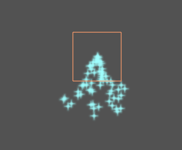

Draw Order
~~~~~~~~~~

This controls the order in which individual particles are drawn. ``Index``
means particles are drawn according to their emission order (default).
``Lifetime`` means they are drawn in order of remaining lifetime.

ParticleProcessMaterial settings
--------------------------------

Direction
~~~~~~~~~

This is the base direction at which particles emit. The default is
``Vector3(1, 0, 0)`` which makes particles emit to the right. However,
with the default gravity settings, particles will go straight down.

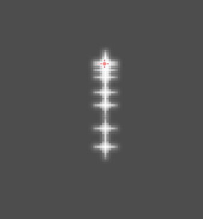

For this property to be noticeable, you need an *initial velocity* greater
than 0. Here, we set the initial velocity to 40. You'll notice that
particles emit toward the right, then go down because of gravity.

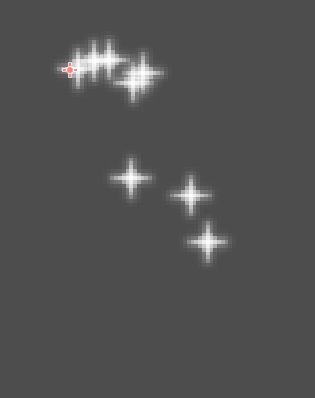

Spread
~~~~~~

This parameter is the angle in degrees which will be randomly added in
either direction to the base ``Direction``. A spread of ``180`` will emit
in all directions (+/- 180). For spread to do anything the "Initial Velocity"
parameter must be greater than 0.

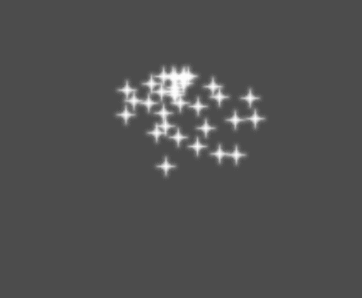

Flatness
~~~~~~~~

This property is only useful for 3D particles.

Gravity
~~~~~~~

The gravity applied to every particle.

.. image:: img/paranim7.gif

Initial Velocity
~~~~~~~~~~~~~~~~

Initial velocity is the speed at which particles will be emitted (in
pixels/sec). Speed might later be modified by gravity or other
accelerations (as described further below).

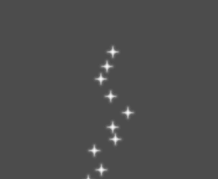

Angular Velocity
~~~~~~~~~~~~~~~~

Angular velocity is the initial angular velocity applied to particles.

Spin Velocity
~~~~~~~~~~~~~

Spin velocity is the speed at which particles turn around their center
(in degrees/sec).

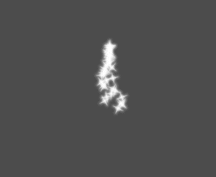

Orbit Velocity
~~~~~~~~~~~~~~

Orbit velocity is used to make particles turn around their center.

Linear Acceleration
~~~~~~~~~~~~~~~~~~~

The linear acceleration applied to each particle.

Radial Acceleration
~~~~~~~~~~~~~~~~~~~

If this acceleration is positive, particles are accelerated away from
the center. If negative, they are absorbed towards it.

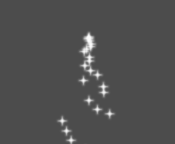

Tangential Acceleration
~~~~~~~~~~~~~~~~~~~~~~~

This acceleration will use the tangent vector to the center. Combining
with radial acceleration can do nice effects.

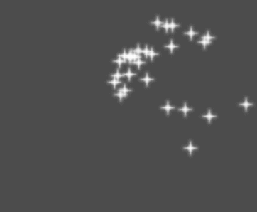

Damping
~~~~~~~

Damping applies friction to the particles, forcing them to stop. It is
especially useful for sparks or explosions, which usually begin with a
high linear velocity and then stop as they fade.

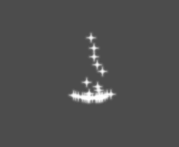

Angle
~~~~~

Determines the initial angle of the particle (in degrees). This parameter
is mostly useful randomized.

.. image:: img/paranim11.gif

Scale
~~~~~

Determines the initial scale of the particles.

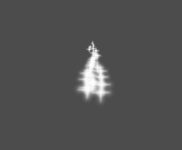

Color
~~~~~

Used to change the color of the particles being emitted.

Hue Variation
~~~~~~~~~~~~~

The ``Variation`` value sets the initial hue variation applied to each
particle. The ``Variation Random`` value controls the hue variation
randomness ratio.

.. _doc_particle_systems_2d_animation:

Animation
~~~~~~~~~

.. note::

    Particle flipbook animation is only effective if the CanvasItemMaterial used
    on the GPUParticles2D or CPUParticles2D node has been
    :ref:`configured accordingly <doc_particle_systems_2d_using_flipbook>`.

To set up the particle flipbook for linear playback, set the **Speed Min** and **Speed Max** values to 1:

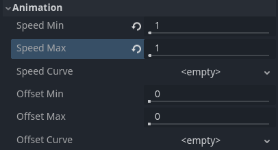

   Setting up particle animation for playback during the particle's lifetime

By default, looping is disabled. If the particle is done playing before its
lifetime ends, the particle will keep using the flipbook's last frame (which may
be fully transparent depending on how the flipbook texture is designed). If
looping is enabled, the animation will loop back to the first frame and resume
playing.

Depending on how many images your sprite sheet contains and for how long your
particle is alive, the animation might not look smooth. The relationship between
particle lifetime, animation speed, and number of images in the sprite sheet is
this:

.. note::

   At an animation speed of ``1.0``, the animation will reach the last image
   in the sequence just as the particle's lifetime ends.

   .. math::
      Animation\ FPS = \frac{Number\ of\ images}{Lifetime}

If you wish the particle flipbook to be used as a source of random particle
textures for every particle, keep the speed values at 0 and set **Offset Max**
to 1 instead:

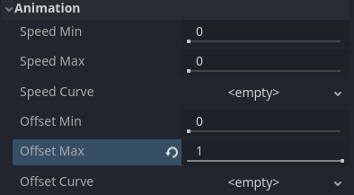

   Setting up particle animation for random offset on emission

Note that the GPUParticles2D node's **Fixed FPS** also affects animation
playback. For smooth animation playback, it's recommended to set it to 0 so that
the particle is simulated on every rendered frame. If this is not an option for
your use case, set **Fixed FPS** to be equal to the effective framerate used by
the flipbook animation (see above for the formula).

Emission Shapes
---------------

ParticleProcessMaterials allow you to set an Emission Mask, which dictates
the area and direction in which particles are emitted.
These can be generated from textures in your project.

Ensure that a ParticleProcessMaterial is set, and the GPUParticles2D node is selected.
A "Particles" menu should appear in the Toolbar:

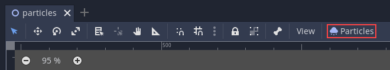

Open it and select "Load Emission Mask":

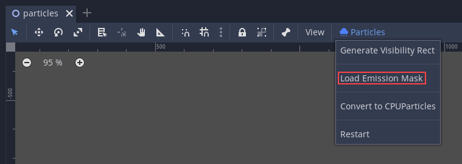

Then select which texture you want to use as your mask:

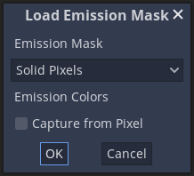

A dialog box with several settings will appear.

Emission Mask
~~~~~~~~~~~~~

Three types of emission masks can be generated from a texture:

-  Solid Pixels: Particles will spawn from any area of the texture,
   excluding transparent areas.

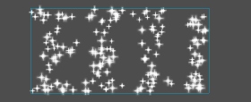

-  Border Pixels: Particles will spawn from the outer edges of the texture.

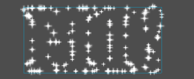

-  Directed Border Pixels: Similar to Border Pixels, but adds extra
   information to the mask to give particles the ability to emit away
   from the borders. Note that an ``Initial Velocity`` will need to
   be set in order to utilize this.

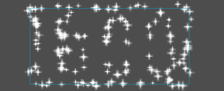

Emission Colors
~~~~~~~~~~~~~~~

``Capture from Pixel`` will cause the particles to inherit the color of the mask at their spawn points.

Once you click "OK", the mask will be generated and set to the ParticleProcessMaterial, under the ``Emission Shape`` section:

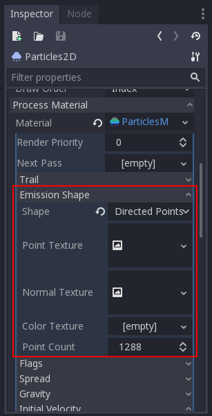

All of the values within this section have been automatically generated by the
"Load Emission Mask" menu, so they should generally be left alone.

.. note:: An image should not be added to ``Point Texture`` or ``Color Texture`` directly.
          The "Load Emission Mask" menu should always be used instead.
