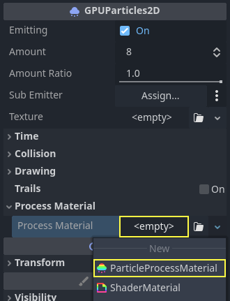
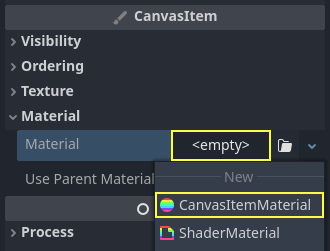

:article_outdated: True

.. _doc_particle_systems_2d:

2D particle systems
===================

Intro
-----

Particle systems are used to simulate complex physical effects,
such as sparks, fire, magic particles, smoke, mist, etc.

The idea is that a "particle" is emitted at a fixed interval and with a
fixed lifetime. During its lifetime, every particle will have the same
base behavior. What makes each particle different from the rest and provides a more
organic look is the "randomness" associated with each parameter. In
essence, creating a particle system means setting base physics
parameters and then adding randomness to them.

Particle nodes
~~~~~~~~~~~~~~

Godot provides two different nodes for 2D particles, :ref:`class_GPUParticles2D`
and :ref:`class_CPUParticles2D`. GPUParticles2D is more advanced and uses the
GPU to process particle effects. CPUParticles2D is a CPU-driven option with
near-feature parity with GPUParticles2D, but lower performance when using large
amounts of particles. On the other hand, CPUParticles2D may perform better on
low-end systems or in GPU-bottlenecked situations.

While GPUParticles2D is configured via a :ref:`class_ParticleProcessMaterial`
(and optionally with a custom shader), the matching options are provided via
node properties in CPUParticles2D (with the exception of the trail settings).

Going forward there are no plans to add new features to CPUParticles2D, though
pull requests to add features already in GPUParticles2D will be accepted. For
that reason we recommend using GPUParticles2D unless you have an explicit reason
not to.

You can convert a CPUParticles2D node into a GPUParticles2D node by clicking on
the node in the scene tree, selecting the 2D workspace, and selecting
**CPUParticles2D > Convert to GPUParticles2D** in the toolbar.

.. image:: img/particles_convert.webp

It is also possible to convert a GPUParticles2D node to a CPUParticles2D node,
however there may be issues if you use GPU-only features.

The rest of this tutorial is going to use the GPUParticles2D node. First, add a GPUParticles2D
node to your scene. After creating that node you will notice that only a white dot was created,
and that there is a warning icon next to your GPUParticles2D node in the scene dock. This
is because the node needs a ParticleProcessMaterial to function.

ParticleProcessMaterial
~~~~~~~~~~~~~~~~~~~~~~~

To add a process material to your particles node, go to ``Process Material`` in
your inspector panel. Click on the box next to ``Material``, and from the dropdown
menu select ``New ParticleProcessMaterial``.

Your GPUParticles2D node should now be emitting
white points downward.

.. image:: img/particles1.png

Texture
~~~~~~~

A particle system can use a single texture or an animation *flipbook*. A
flipbook is a texture that contains several frames of animation that can be
played back, or chosen at random during emission. This is equivalent to a
spritesheet for particles.

The texture is set via the **Texture** property:

.. _doc_particle_systems_2d_using_flipbook:

Using an animation flipbook
^^^^^^^^^^^^^^^^^^^^^^^^^^^

Particle flipbooks are suited to reproduce complex effects such as smoke, fire,
explosions. They can also be used to introduce random texture variation, by
making every particle use a different texture. You can find existing particle
flipbook images online, or pre-render them using external tools such as `Blender
<https://www.blender.org/>`__ or `EmberGen <https://jangafx.com/software/embergen/>`__.

   Example of a particle system that uses a flipbook texture

Using an animation flipbook requires additional configuration compared to a
single texture. For demonstration purposes, we'll use this texture with 5
columns and 7 rows (right-click and choose **Save as…**):

.. figure:: img/particles_flipbook_example.webp
   :align: center
   :width: 240
   :alt: Particle flipbook texture example

   Credit: `JoesAlotofthings <https://opengameart.org/content/alot-of-particles-indispersal-special-effect-alotofparticles30>`__
   (CC BY 4.0)

To use an animation flipbook, you must create a new CanvasItemMaterial in the
Material section of the GPUParticles2D (or CPUParticles2D) node:

   Creating a CanvasItemMaterial at the bottom of the particles node inspector

In this CanvasItemMaterial, enable **Particle Animation** and set **H Frames** and **V Frames**
to the number of columns and rows present in your flipbook texture:

.. figure:: img/particles_flipbook_configure_canvasitemmaterial.webp
   :align: center
   :alt: Configuring the CanvasItemMaterial for the example flipbook texture

   Configuring the CanvasItemMaterial for the example flipbook texture

Once this is done, the :ref:`Animation section <doc_particle_systems_2d_animation>`
in ParticleProcessMaterial (for GPUParticles2D) or in the CPUParticles2D inspector
will be effective.

.. tip::

    If your flipbook texture has a black background instead of a transparent
    background, you will also need to set the blend mode to **Add** instead of
    **Mix** for correct display. Alternatively, you can modify the texture to
    have a transparent background in an image editor. In `GIMP <https://gimp.org>`__,
    this can be done using the **Color > Color to Alpha** menu.

Time parameters
---------------

Lifetime
~~~~~~~~

The time in seconds that every particle will stay alive. When lifetime
ends, a new particle is created to replace it.

Lifetime: 0.5

.. image:: img/paranim14.gif

Lifetime: 4.0

.. image:: img/paranim15.gif

One Shot
~~~~~~~~

When enabled, a GPUParticles2D node will emit all of its particles once
and then never again.

Preprocess
~~~~~~~~~~

Particle systems begin with zero particles emitted, then start emitting.
This can be an inconvenience when loading a scene and systems like
a torch, mist, etc. begin emitting the moment you enter. Preprocess is
used to let the system process a given number of seconds before it is
actually drawn the first time.

Speed Scale
~~~~~~~~~~~

The speed scale has a default value of ``1`` and is used to adjust the
speed of a particle system. Lowering the value will make the particles
slower while increasing the value will make the particles much faster.

Explosiveness
~~~~~~~~~~~~~

If lifetime is ``1`` and there are 10 particles, it means a particle
will be emitted every 0.1 seconds. The explosiveness parameter changes
this, and forces particles to be emitted all together. Ranges are:

-  0: Emit particles at regular intervals (default value).
-  1: Emit all particles simultaneously.

Values in the middle are also allowed. This feature is useful for
creating explosions or sudden bursts of particles:

.. image:: img/paranim18.gif

Randomness
~~~~~~~~~~

All physics parameters can be randomized. Random values range from ``0`` to
``1``. The formula to randomize a parameter is:

::

    initial_value = param_value + param_value * randomness

Fixed FPS
~~~~~~~~~

This setting can be used to set the particle system to render at a fixed
FPS. For instance, changing the value to ``2`` will make the particles render
at 2 frames per second. Note this does not slow down the particle system itself.

.. note::

    Godot 4.3 does not currently support physics interpolation for 2D particles.
    As a workaround, disable physics interpolation for the particles node by setting
    **Node > Physics Interpolation > Mode** at the bottom of the inspector.

Fract Delta
~~~~~~~~~~~

Setting Fract Delta to ``true`` results in fractional delta calculation,
which has a smoother particles display effect.
This increased smoothness stems from higher accuracy.
The difference is more noticeable in systems with high randomness or fast-moving particles.
It helps maintain the visual consistency of the particle system,
making sure that each particle's motion aligns with its actual lifespan.
Without it, particles might appear to jump or move more than they should in a single frame
if they are emitted at a point within the frame.
The greater accuracy has a performance tradeoff,
particularly in systems with a higher amount of particles.

Drawing parameters
------------------

Visibility Rect
~~~~~~~~~~~~~~~

The visibility rectangle controls the visibility of the particles on screen. If this rectangle is outside of the viewport, the engine will not render the particles on screen.

The rectangle's ``W`` and ``H`` properties respectively control its Width and its Height.
The ``X`` and ``Y`` properties control the position of the upper-left
corner of the rectangle, relative to the particle emitter.

You can have Godot generate a Visibility Rect automatically using the toolbar above the 2d view. To do so, select the GPUParticles2D node and Click ``Particles > Generate Visibility Rect``. Godot will simulate the Particles2D node emitting particles for a few seconds and set the rectangle to fit the surface the particles take.

You can control the emit duration with the ``Generation Time (sec)`` option. The maximum value is 25 seconds. If you need more time for your particles to move around, you can temporarily change the ``preprocess`` duration on the Particles2D node.

Local Coords
~~~~~~~~~~~~

By default, this option is off. It means that the space that particles are
emitted to is global, and **not** relative to the node. If the node is moved,
existing particles are not moved with it:

.. image:: img/paranim21.gif

If enabled, particles will emit to local space, meaning that if the
node is moved, already emitted particles are also affected:

.. image:: img/paranim20.gif

Draw Order
~~~~~~~~~~

This controls the order in which individual particles are drawn. ``Index``
means particles are drawn according to their emission order (default).
``Lifetime`` means they are drawn in order of remaining lifetime.

Particle Process Material Settings
----------------------------------

For information on the settings in the ParticleProcessMaterial see :ref:`this page<doc_particle_process_material_2d>`.
