.. _doc_using_tilemaps:

Using tilemaps
~~~~~~~~~~~~~~

Introduction
------------

Tilemaps can be used to make levels for 2D games. 
A tilemap is a grid of (usually square) image tiles which form the scenery of a level or area in a game. The placed tiles in a tilemap are instances of 'reference tiles' from a tileset. The tileset can be thought of as a pallete with which a tilemap (level) can be 'painted':

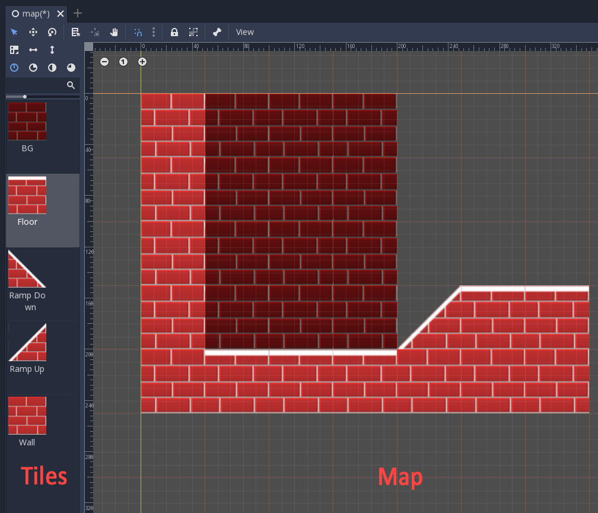

Collision shapes can be added to the tiles in a tileset to create solid geometry. Tilemaps can be used for both side view and top-down 2D games.

Making a tileset
----------------

Here are some tiles for a tileset.
They are all part of the same image file. This is helpful for a game's performance.
There are so-called *texture packers* that will generate these spritesheets
out of several separate tile images.
But keeping them as separate images also works.

.. image:: img/tileset.png

Create a new project and move the above PNG image into the project directory. Next,
go into the image's import settings and turn off ``Filter``. Keeping it on will cause
issues later. ``Mipmaps`` should already be disabled; if not, disable this too.

The easiest way to edit and maintain a tileset is exporting
it from a specially prepared scene. We'll create that next.

TileSet scene
-------------

Create a new scene with a regular Node or Node2D as root. For each reference tile you want to define,
add a sprite node as a child. Since our tiles measure 50x50 pixels, you should turn on the grid
(``View -> Show Grid`` or ``G`` key) and enable snap (``Use Snap`` icon or ``Shift + S`` keys).
Moving tiles with the mouse might still be inaccurate,
so use your arrow keys as well.

If more than one tile is present in the source image, make sure to use
the region property of the sprite to adjust which part of the texture is being
used.

Give the sprite node an appropriate and unique name. This will ensure
that, in subsequent edits to the tileset (for example, if you've added
collision, changed the region, etc), the tile will still be **identified
correctly and updated**.

Here's a screenshot that shows
where everything of relevance is:

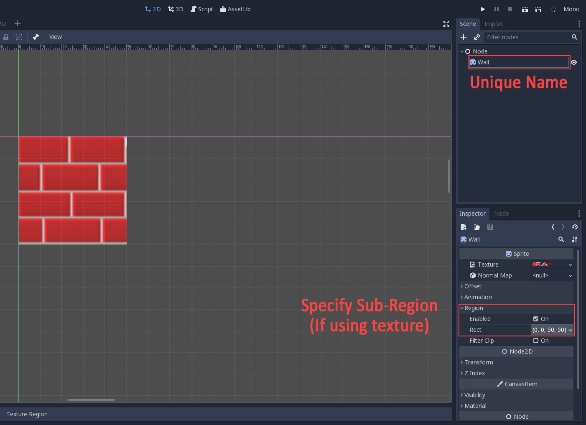

Add all the reference tiles in the way described above, adjusting the offsets as needed (that is, if you have
multiple tiles in a single source image). Again, *remember that their names must
be unique*.

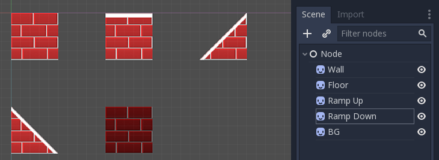

Collision Shapes
----------------

To add collision shapes to the tiles, create a StaticBody2D child for each sprite.
This is a static collision node. Then create a CollisionShape2D or
CollisionPolygon as a child of the StaticBody2D. The CollisionPolygon is easier to edit.

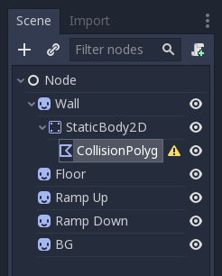

Edit the polygon; this will give the tile a collision shape and remove
the warning icon next to the CollisionPolygon node. **Remember to use snap!**
Using snap will make sure collision polygons are aligned properly, allowing
a character to walk seamlessly from tile to tile. Also **do not scale or move**
the collision and/or collision polygon nodes. Leave them at offset 0,0, with
scale 1,1 and rotation 0 with respect to the parent sprite.

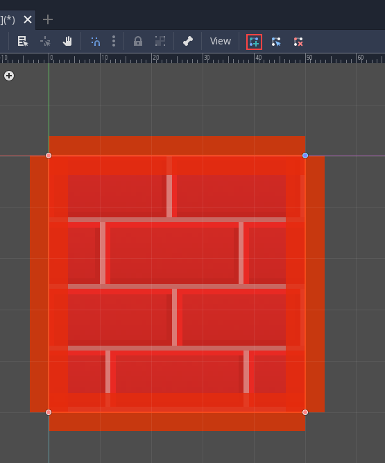

Keep adding collision shapes to all tiles that need them. Note that BG is
a background tile, so it should not have a collision shape.

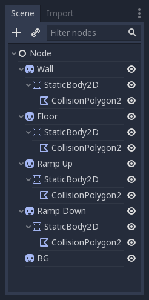

Then save this scene for future editing.
"tileset_edit.scn" would be a sensible name for it.

Exporting a TileSet
-------------------

With the scene created and still open in the editor, use Scene > Convert To > Tile Set from the Scene Menu:

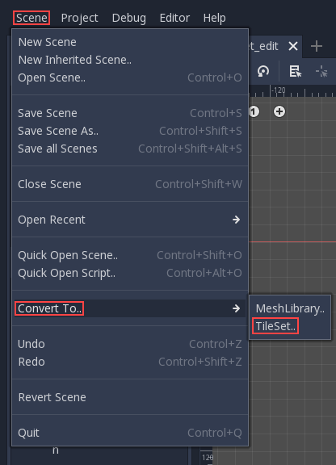

Then choose a filename, like "mytiles.tres". Make sure the "Merge With
Existing" option is toggled on. This way, every time the tileset
resource file is overwritten, existing tiles are merged and updated
(they are referenced by their unique name, so again, **name your tiles
properly**).

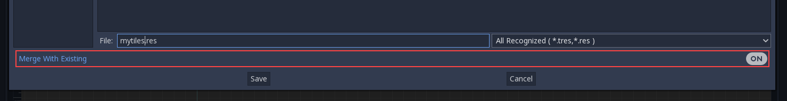

Using the TileSet in a TileMap
------------------------------

Create a new scene, using any node or node2d as root, and then create a
:ref:`TileMap <class_TileMap>` as
a child.

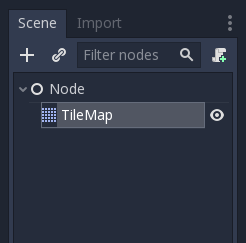

Go to the TileSet property of this node and assign the one created in
previous steps:

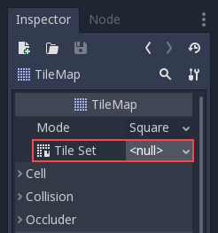

Also set the cell size to '50', since that is the size used by the
tiles. Quadrant size is a tuning value. The default value of 16 means that the engine will
draw and cull (erase) the tilemap in blocks of 16x16 tiles. This value is
usually fine, but can be used to fine tune
performance in specific cases if you know what you're doing.

Painting your world
-------------------

Make sure the TileMap node is selected. A red grid will
appear on the screen, allowing you to paint on it with the tile currently selected in the
left palette.

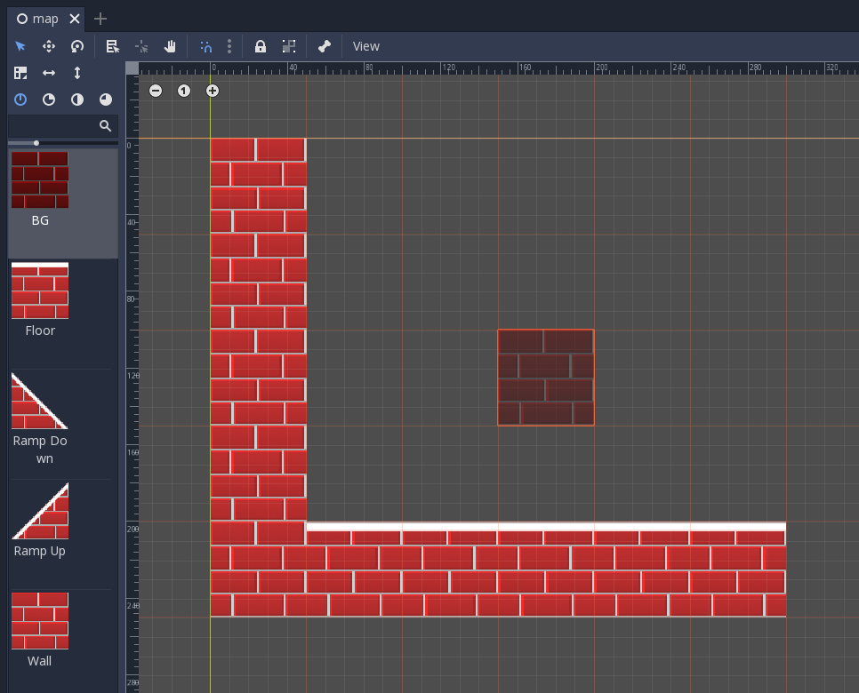

It's easy to accidentally select and move the tilemap node. To avoid this
use the node's lock button:

.. image:: img/tile_lock.png

If you accidentally place a tile somewhere you don't want it to be, you
can delete it with ``RMB`` (the right mouse button) while in the tilemap editor.

You can flip and rotate sprites in the TileMap editor (note:
flipping the sprite in the TileSet will have no effect). Icons at the
top right of the editor allow flipping and rotating of the currently
selected sprite - you can also use the A and S keys to flip the sprite
horizontally and vertically. With a brick pattern like this tutorial uses,
flipping the sprites would create unpleasant discontinuities unless you're
flipping an entire region of bricks. But for some kinds of tiles, flipping
can be a convenient and space-saving feature.

Offset and scaling artifacts
----------------------------

When using a single texture for all the tiles, scaling the tileset or moving it to a non pixel-aligned location can cause filtering artifacts:

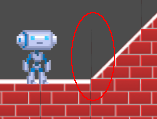

To avoid this situation use the approach below that makes the most sense for your game:

-  Disable filtering and mipmaps for either the tileset texture or all tile textures if using separate images (see the :ref:`doc_import_images` asset pipeline tutorial).
-  Enable pixel snap (Set ``Project > Project Settings >
   Rendering > Quality > 2d > Use Pixel Snap`` to true; you can also search for ``Pixel Snap``).
-  Viewport Scaling can often help with shrinking the map (see the
   :ref:`doc_viewports` tutorial). Adding a camera, setting it to ``Current`` and playing around with its ``Zoom`` may be a good starting point.
-  You can use a single, separate image for each tile. This will remove all artifacts, but
   can be more cumbersome to implement and is less optimized.
