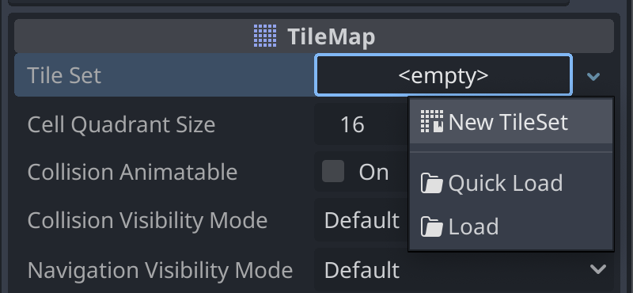
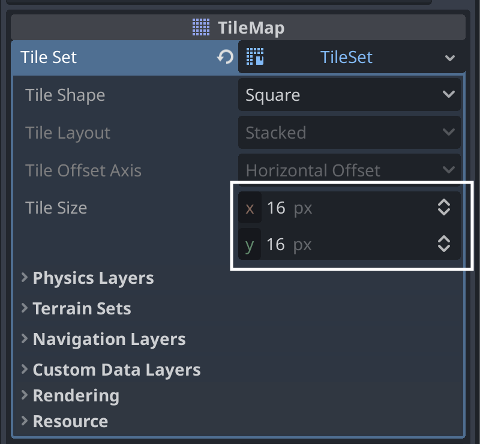
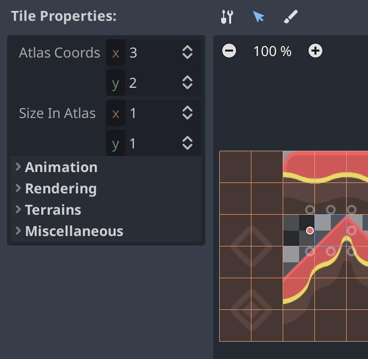
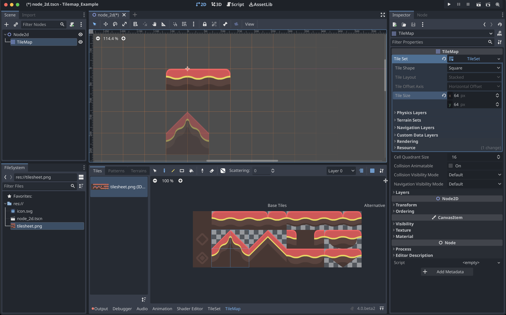
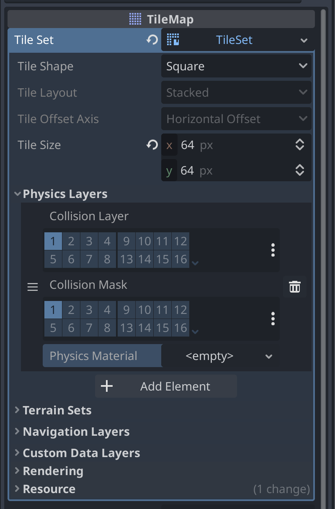
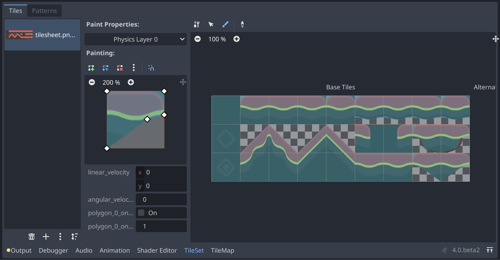

.. _doc_using_tilemaps:

Using TileMaps
==============

Introduction
------------

A tilemap is a grid of tiles used to create a game's layout. There are several
benefits to using :ref:`TileMap <class_TileMap>` nodes to design your levels.
First, they make it possible to draw the layout by "painting" the tiles onto a
grid, which is much faster than placing individual :ref:`Sprite2D <class_Sprite2D>`
nodes one by one. Second, they allow for much larger levels because they are
optimized for drawing large numbers of tiles. Finally, you can add collision,
occlusion, and navigation shapes to tiles, adding additional functionality to
the TileMap.

TODO: Add final image result

Project setup
-------------

This demo will use the following tiles taken from Kenney's "Abstract Platformer"
art pack. You can find the complete set `here <https://kenney.nl/assets/abstract-platformer>`_
but for this demo we'll stick to this small set.

.. image:: img/tilesheet.png

Create a new project and place the above image in the project folder. Then create a new scene and add a new :ref:`TileMap <class_TileMap>` node.

Creating a TileSet
------------------

After creating the :ref:`TileMap <class_TileMap>` node, needs to create a new :ref:`TileSet <class_TileSet>`. A TileSet is a :ref:`Resource <class_Resource>` that contains the data about your tiles - their textures, collision shapes, and other properties. When the game runs, the TileMap combines the individual tiles into a single object.

To add a new TileSet, click on the "Tile Set" property and select "New
TileSet".

On the tile set property you can expand the options for the :ref:`tile set <class_TileSet>`.

After creating the new tile set we can make change the "Cell Size". The example tile we are using does have the cell size of 64px x 64px, we should update this value in the "Cell Size".

.. seealso:: For more information you can see the :ref:`tile set <class_TileSet>`.

After changing this value we can add our graphics to the tile set. We can do that on the **bottom panel**, select the TileSet option and click on the plus sign button, select the "Atlas" option.

.. image:: img/tilemap_tileset_bottom.png

.. note:: There is two options. TileSet and TileMap. TileSet will define the tiles available. TileMap will paint the tile on the viewport.

On this atlas map you can drag the ``tilesheet.png`` to texture field. Accepting the option will automatically select all the tiles that is not transparent.

You have three main tool to change the tile set, "Atlas Setup", "Select Tiles" and "Paint Properties". While in the "Atlas Setup" you also have the "Eraser" tool.

With the "Atlas Setup" tool selected you can click on any tile to add on the tile atlas list. Or with the "Eraser" selected you can click on any tile to remove from the atlas.

.. image:: img/tilemap_tileset_texture.png

With the "Select Tiles" tool you can use the handlers to change the shape of the tile selected, increasing the size for example. You can also change his properties, like animation, module, probability, sorting...

Painting Tiles on the Viewport
------------------------------

You can select the "TileMap" option on the bottom panel and you can start to add tiles to the viewport. You have the "Selection", "Paint", "Line", "Rect", "Bucket". Some of the tools have extra options.

For now use the "Paint" tool and click on one of the tiles in the TileMap area, after that you can start to paint tiles on the viewport. You can also select multiple tiles and paint multiple tiles at once.

Painting properties on the TileSet
----------------------------------

You can change multiple properties on the tiles

Collision shapes
~~~~~~~~~~~~~~~~

If you're making a map that needs collisions - walls, floor, or other obstacles, for example - then you'll need to add collision shapes to any tiles that you want to be considered "solid".

For this we need to add a physics layers. On the tile set properties expand the "Physics Layers" and select the option "Add Element". You can select collisions, masks and materials if needed.

Click on the "TileSet", and on the "Paint Tool", select on the dropdown the option "Physics Layer 0", you can paint the square on the tiles. You can change the shape of the painting shape to add on the tiles. You can add, remove and change the position of the handler to change the shape of the collision shape.

Collision shapes
~~~~~~~~~~~~~~~~

By default, each tile in the tileset has an equal likelihood of occurring. You can change the likelihood by setting different priorities for each tile For example, a tile with priority 2 is twice as likely to be selected as a tile with priority 1, and a tile with priority 3 is 50% more likely to be selected than a tile with priority 2.

Terrains
--------

Terrains (also know as Autotiles) allow you to define a group of tiles, then add rules to control which tile gets used for drawing based on the content of adjacent cells.

To create a new terrain, on the tileset properties expand the "Terrain Sets", add a new terrain set. On the terrain set you can choose the type, "Match Corners", "Match Sides" or "Match Corners and Sides". Each terrain sets can have multiple terrain.

Match Sides
~~~~~~~~~~~~

TODO: How this works?!

Match Corners
~~~~~~~~~~~~~

TODO: How this works?!

Match Corners and Sides
~~~~~~~~~~~~~~~~~~~~~~~

TODO: How this works?!

Painting Terrains
~~~~~~~~~~~~~~~~~

TODO: Add images and painting

