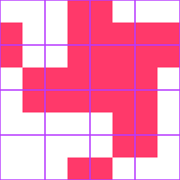
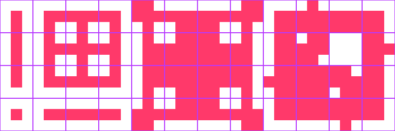
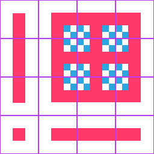
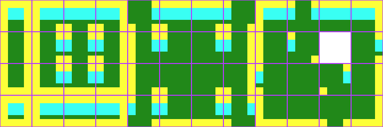
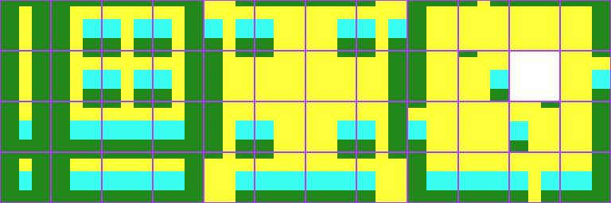
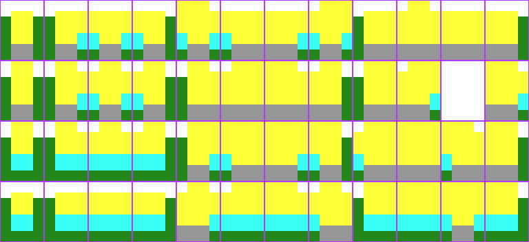
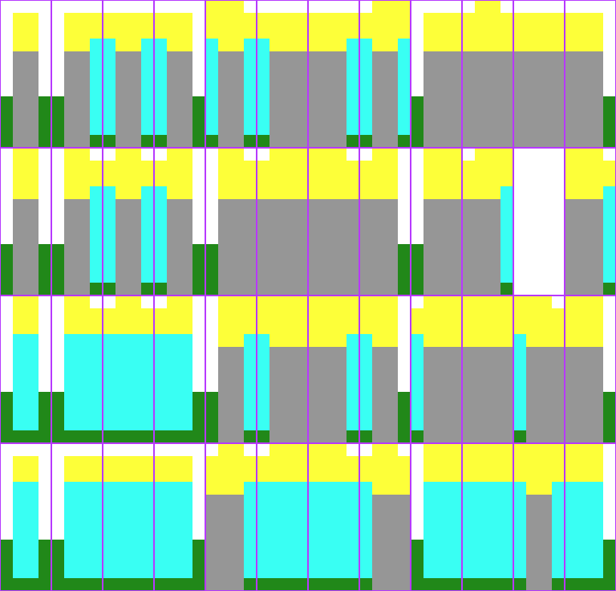

.. _doc_using_tilemaps:

Using TileMaps
==============

Introduction
------------

A tilemap is a grid of tiles used to create a game's layout. There are several
benefits to using :ref:`TileMap <class_TileMap>` nodes to design your levels.
First, they make it possible to draw the layout by "painting" the tiles onto a
grid, which is much faster than placing individual :ref:`Sprite2D <class_Sprite2D>`
nodes one by one. Second, they allow for much larger levels because they are
optimized for drawing large numbers of tiles. Finally, you can add collision,
occlusion, and navigation shapes to tiles, adding additional functionality to
the TileMap.

.. image:: img/tileset_draw_atlas.png

Project setup
-------------

This demo will use the following tiles taken from Kenney's "Abstract Platformer"
art pack. You can find the complete set `here <https://kenney.nl/assets/abstract-platformer>`_
but for this demo we'll stick to this small set.

.. image:: img/tilesheet.png

Create a new project and place the above image in the project folder.

When using a tileset, it's important that adjacent tiles match up. Godot's default
is to import 2D images using an interpolated "filter" mode, which will result in
ugly borders between the tiles. Select the image and click the Import tab. Turn
off ``Filter`` and click "Reimport". See :ref:`doc_import_images` for details.

TileMap node
------------

Add a new :ref:`TileMap <class_TileMap>` node to the scene. By default, a TileMap
uses a square grid of tiles. You can also use a perspective-based "Isometric" mode
or define your own custom tile shape.

.. image:: img/tilemap_mode.png

Under the "Cell" section in the Inspector are many properties you can adjust to
customize your tilemap's behavior:

.. image:: img/tilemap_size.png

- ``Cell Size``
    This defines the size of the grid. This should match the pixel size
    of your tiles. The default value is ``(64, 64)``.

- ``YSort``
    This causes tiles to be drawn in order of their ``Y`` position, so that
    "lower" tiles are drawn on top of "higher" ones.

- ``Half Offset`` and ``Tile Origin``
    These properties affect the position of the tile relative to the grid position.

- ``Quadrant``
    Defines the chunk size used for batched drawing. This can negatively
    affect performance. Don't change it unless you know what you're doing.

- ``Custom Transform``
    Used to alter the tile's shape. Use this if you have non-square tiles.

All of these options can be left at their defaults for this demo.

Creating a TileSet
------------------

Once you've configured your tilemap, it's time to add a
:ref:`TileSet <class_TileSet>`. A TileSet is a
:ref:`Resource <class_Resource>` that contains the data about your
tiles - their   textures, collision shapes, and other properties. When the game
runs, the TileMap combines the individual tiles into a single object.

To add a new TileSet, click on the "Tile Set" property and select "New
TileSet".

.. image:: img/tilemap_add_tileset.png

Click on the TileSet property, and the "TileSet" panel will open at the bottom
of the editor window:

.. image:: img/tilemap_tool.png

First, you need to add the texture(s) that you'll use for the tiles. Click the
"Add Texture(s) to TileSet" button and select the ``tilesheet.png`` image.

Next, click "New Single Tile" and drag in the image to select the tile you want.
Click the "Enable Snap" button to make it easier to select the entire tile. A
yellow rectangle appears around the selected tile.

.. image:: img/tilemap_add_tile.png

Click on the TileMap in the scene tree, and you'll see that the newly created
tile now appears on the right side. Click in the viewport and you can place
tiles. Right-click to remove them.

.. image:: img/tilemap_draw.png

It's easy to accidentally select and move the tilemap node. To avoid this, use
the node's lock button:

.. image:: img/tile_lock.png

Collision shapes
----------------

If you're making a map that needs collisions - walls, floor, or other obstacles,
for example - then you'll need to add collision shapes to any tiles that you
want to be considered "solid".

Click "TileSet" at the bottom of the editor window to return to the tileset
tool. Click the tile you previously defined (outlined in yellow). Select the
"Collision" tab and click the "Create a new rectangle" button. Make sure you
still have grid snap enabled, then click and drag in the tile. A square
collision shape appears in light blue:

.. image:: img/tileset_add_collision.png

You can add occlusion and navigation shapes to the tile in the same way.

Atlas tiles
-----------

Rather than adding individual tiles one at a time, you can define a group of
tiles all at once using an atlas. This also allows you to randomly generate
tiles from the group.

Click "New Atlas" and drag to select the entire tile sheet.

.. image:: img/tileset_atlas.png

If you haven't already, make sure to change the "Step" in the snap settings to
`(64, 64)`, or your tiles may be chopped into smaller pieces. You can find
this in the Inspector:

.. image:: img/tileset_snap.png

Once you've defined the atlas you can add collision shapes to the individual
tiles as before. You can also click "Icon" to select one of the tiles to represent
the atlas.

Back in the TileMap, you can select the atlas tile and you'll see all of the
tiles it contains:

.. image:: img/tileset_draw_atlas.png

In addition to saving time when defining the tiles, this can help by grouping
similar tiles together when you're working with a large number of tiles.

Random tile priorities
~~~~~~~~~~~~~~~~~~~~~~

When drawing with atlas tiles, enabling the "Use priority" option causes tiles
to be selected at random. By default, each tile in the tileset has an equal
likelihood of occurring. You can change the likelihood by setting different
priorities for each tile. For example, a tile with priority 2 is twice as
likely to be selected as a tile with priority 1, and a tile with priority 3 is
50% more likely to be selected than a tile with priority 2.

Autotiles
---------

Autotiles allow you to define a group of tiles, then add rules to control which
tile gets used for drawing based on the content of adjacent cells.

Click "New Autotile" and drag to select the tiles you wish to use. You can add
collisions, occlusion, navigation shapes, tile priorties, and select an icon
tile in the same manner as for atlas tiles.

Tile selection is controlled by bitmasks. Bitmasks can be added by clicking
"Bitmask", then clicking parts of the tiles to add or remove bits in the mask.
Left-clicking an area of the tile adds a bit, right-click removes "off",
and shift-left-click sets an "ignore" bit.

Whenever Godot updates a cell using an autotile, it first creates a pattern
based on which adjacent cells are already set. Then, it searches the autotile
for a single tile with a bitmask matching the created pattern. If no matching
bitmask is found, the "icon" tile will be used instead. If more than one
matching bitmask is found, one of them will be selected randomly, using the
tile priorities.

The rules for matching a bitmask to a pattern depend on the tileset's autotile
bitmask mode. This can be set in the "Inspector" tab, under the "Selected Tile"
heading. Allowed values are "2x2", "3x3 (minimal)", and "3x3".

All "on" and "off" bits must be satisfied for a bitmask to match, but "ignore"
bits are ignored.

2x2
~~~

In 2x2 mode, each bitmask contains four bits, one for each corner.

Where a bit is "on", all cells connected to that corner must be filled using
the same autotile, in order for the bitmask to match.
For example, if the top-left bit is set, the cell directly above,
directly left, and diagonally above-left must be filled.

Where a bit is "off", at least one cell connected to that corner must not be
set using the same autotile.

At least one bit must be set for the tile to be used, so a total of 15 tiles
would be needed to provide exactly one tile for each arrangement that this mode
can test for.

2x2 mode can only match cells that are part of a 2-by-2 block - cells with no
neighbors and lines only one cell wide are not supported.

**Template - Generic:**

This template can be used for sideways or fully top-down perspectives.
It's designed for a TileMap cell size of 64x64.

Key:

- Red: "on"
- White: "off"

3x3 (minimal)
~~~~~~~~~~~~~

In 3x3 (minimal) mode, each bitmask contains 9 bits (4 corners, 4 edges,
1 center). The 4 corner bits work the same as in 2x2 mode.

When an edge bit is "on", the cell which shares that edge must be filled.
When an edge bit is "off", the cell which shares that edge must be empty.

The center bit should be "on" for any tile you wish to use. Note that in this
mode, it makes no sense for a corner bit to be "on" when either edge bit
adjacent to it is not "on".

A total of 47 tiles would be needed to provide exactly one bitmask for each
arrangement that this mode can test for.

.. note::

    Right-click an image and choose **Save image as…** to save it.

**Template - Generic:**

This template can be used for sideways or fully top-down perspectives.
All templates below are designed for a TileMap cell size of 64x64, but you may
have to use different subtile sizes for top-down templates as described below.

Key:

- Red: "on"
- White: "off"

**Template - Generic 16 tiles:**

This template can be used for tilesets that only have 16 tiles - for simpler art
styles the missing tiles will not be noticeable.

Key:

- Red: "on"
- White: "off"
- Blue-checkered: "ignore"

**Template - Top-down floor in 3/4 perspective:**

Key (applies to the four templates below):

- Green: floor
- Cyan: wall
- Yellow: top of wall
- Transparent: air

**Template - Top-down wall in 3/4 perspective:**

**Template - Top-down wall in 3/4 perspective (thick walls):**

When using this template, set the TileSet subtile size to ``Vector2(64, 88)``.

**Template - Top-down wall in 3/4 perspective (tall walls):**

When using this template, set the "Snap Options" Step to ``Vector2(64, 184)``
and the "Selected Tile" Texture offset to height minus the cell size.
This means the texture offset should be ``Vector2(0, -120)``:

3x3
~~~

In 3x3 mode, each bitmask contains 9 bits (4 corners, 4 edges, 1 center)

Each bit checks a single adjacent cell. Corner bits only check diagonally
adjacent cells. The center bit should be "on" for any tile you wish to use.

A total of 256 tiles would be needed to provide exactly one bitmask for each
arrangement that this mode can test for.

Disabling autotile
~~~~~~~~~~~~~~~~~~

When using an autotile, it is possible to turn off the autotile behaviour and
select tiles manually, by clicking "Disable Autotile" at the top of the tile
selection window.

Autotile binding
~~~~~~~~~~~~~~~~

By default, autotile only checks for adjacent cells filled using the same
autotile. This behaviour can be overridden in order to have autotiles bind to
each other, or even bind to empty cells. At present, this can only be done
through scripting. You will need to add a script to your tileset, and define
a function named "_is_tile_bound(drawn_id, neighbor_id)". This function will
be called for each adjacent cell that does not contain the same autotile, and
should return true if you want the drawn cell to "bind" to the neighbor cell.
You can find the id of an autotile using "find_tile_by_name(name)", empty cells
are given an id of -1.

Note that to use this in the editor, the script should start with a "tool"
declaration, and you may need to close and reload the scene for these changes
to take effect.

Tips and tricks
---------------

- If you're using a :ref:`Camera2D <class_Camera2D>` to scroll your level, you
  may notice lines appearing between your tiles. To fix this, open Project
  Settings and enable **Use Gpu Pixel Snap** in the **Rendering > 2d > Snapping** section.

- You can flip and rotate tiles using the icons at the top right of the editor.

- To draw straight lines, hold :kbd:`Shift` while clicking and dragging a tile.

- Tools such as copy, paste, and bucket fill, can be found in the "TileMap"
  menu in the upper-right.

.. image:: img/tilemap_menu.png
