.. _doc_using_tilemaps:

Using tilemaps
~~~~~~~~~~~~~~

Introduction
------------

A tilemap is a grid of tiles used to create a game's layout. There are several
benefits to using :ref:`TileMap <class_TileMap>` nodes to design your levels.
First, they make it possible to draw the layout by "painting" the tiles onto a
grid, which is much faster than placing individual :ref:`Sprite <class_Sprite>`
nodes one by one. Second, they allow for much larger levels because they are
optimized for drawing large numbers of tiles. Finally, you can add collision,
occlusion, and navigation shapes to tiles, adding additional functionality to
the TileMap.

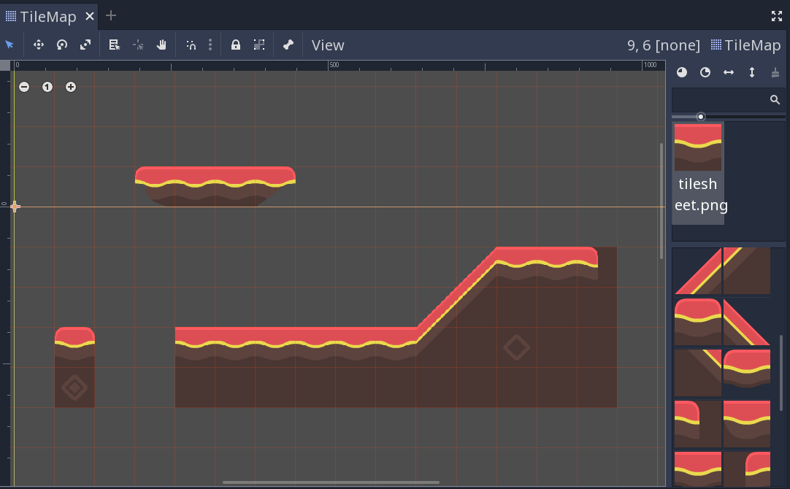

Project setup
-------------

This demo we'll use the following tiles taken from Kenney's "Abstract Platformer"
art pack. You can find the complete set `here <https://kenney.nl/assets/abstract-platformer>`_
but for this demo we'll stick to this small set.

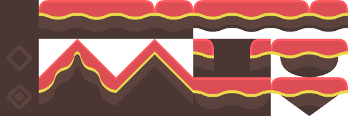

Create a new project and place the above image in the project folder.

When using a tileset, it's important that adjacent tiles match up. Godot's default
is to import 2D images using an interpolated "filter" mode, which will result in
ugly borders between the tiles. Select the image and click the Import tab. Turn
off ``Filter`` and click "Reimport". See :ref:`doc_import_images` for details.

TileMap node
------------

Add a new :ref:`TileMap <class_TileMap>` node to the scene. By default, a TileMap
uses a square grid of tiles. You can also use a perspective-based "Isometric" mode
or define your own custom tile shape.

.. image:: img/tilemap_mode.png

Under the "Cell" section in the Inspector are many properties you can adjust to
customize your tilemap's behavior:

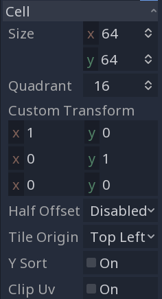

- ``Cell Size``
    This defines the size of the grid. This should match the pixel size
    of your tiles. The default value is ``(64, 64)``.

- ``YSort``
    This causes tiles to be drawn in order of their ``Y`` position, so that
    "lower" tiles are drawn on top of "higher" ones.

- ``Half Offset`` and ``Tile Origin``
    These properties affect the position of the tile relative to the grid position.

- ``Quadrant``
    Defines the chunk size used for batched drawing. This can negatively
    affect performance. Don't change it unless you know what you're doing.

- ``Custom Transform``
    Used to alter the tile's shape. Use this if you have non-square tiles.

All of these options can be left at their defaults for this demo.

Creating a TileSet
------------------

Once you've configured your tilemap, it's time to add a
:ref:`TileSet <class_TileSet>`. A TileSet is a
:ref:`Resource <class_Resource>` that contains the data about your
tiles - their   textures, collision shapes, and other properties. When the game
runs, the TileMap combines the individual tiles into a single object.

To add a new TileSet, click on the "Tile Set" property and select "New
TileSet".

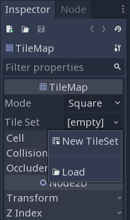

When you do this, the "TileSet" panel will open at the bottom of the editor
window:

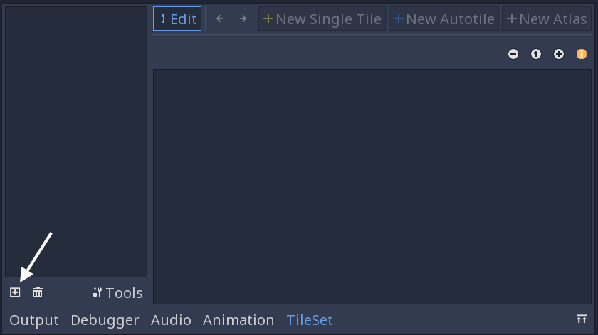

First, you need to add the texture(s) that you'll use for the tiles. Click the
"Add Texture(s) to TileSet" button and select the ``tilesheet.png`` image.

Next, click "New Single Tile" and drag in the image to select the tile you want.
Click the "Enable Snap" button to make it easier to select the entire tile. A
yellow rectangle appears around the selected tile.

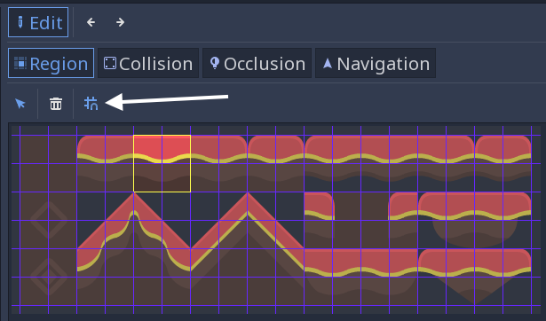

Click on the TileMap in the scene tree, and you'll see that the newly created
tile now appears on the right side. Click in the viewport and you can place
tiles. Right-click to remove them.

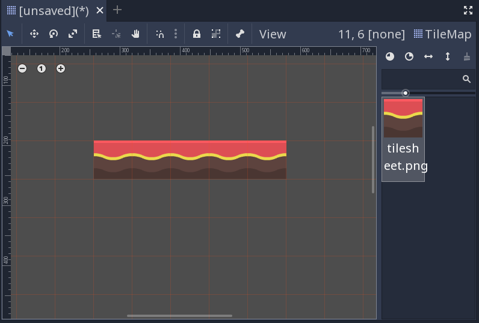

It's easy to accidentally select and move the tilemap node. To avoid this, use
the node's lock button:

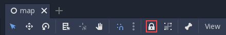

Collision shapes
----------------

If you're making a map that needs collisions - walls, floor, or other obstacles,
for example - then you'll need to add collision shapes to any tiles that you
want to be considered "solid".

Click "TileSet" at the bottom of the editor window to return to the tileset
tool. Click the tile you previously defined (outlined in yellow). Select the
"Collision" tab and click the "Create a new rectangle" button. Make sure you
still have grid snap enabled, then click and drag in the tile. A square
collision shape appears in light blue:

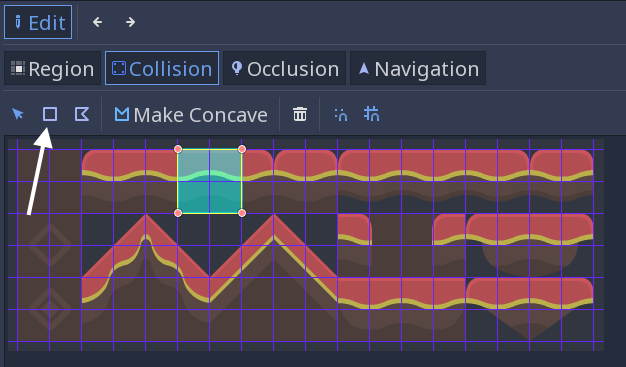

You can add occlusion and navigation shapes to the tile in the same way.

Atlas tiles
-----------

Rather than adding individual tiles one at a time, you can define a group of
tiles all at once using an atlas. Click "New Atlas" and drag to select the
entire tile sheet.

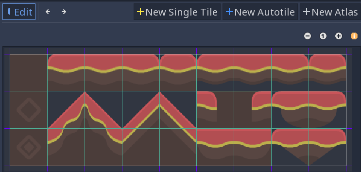

If you haven't already, make sure to change the "Step" in the snap settings to
`(64, 64)`, or your tiles may be chopped into smaller pieces. You can find
this in the Inspector:

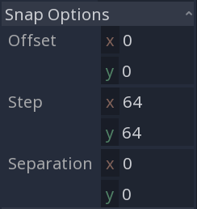

Once you've defined the atlas you can add collision shapes to the individual
tiles as before. You can also click "Icon" to select one of the tiles to represent
the atlas.

Back in the TileMap, you can select the atlas tile and you'll see all of the
tiles it contains:

In addition to saving time when defining the tiles, this can help by grouping
similar tiles together when you're working with a large number of tiles.

Tips and tricks
---------------

- If you're using a :ref:`Camera2D <class_Camera2D>` to scroll your level, you
  may notice lines appearing between your tiles. To fix this, open Project
  Settings and enable "Use Pixel Snap" in the "Rendering/Quality" section.

- You can flip and rotate tiles using the icons at the top right of the editor.

- To draw straight lines, hold :kbd:`Shift` while clicking and dragging a tile.

- Tools such as copy, paste, and bucket fill, can be found in the "TileMap"
  menu in the upper-right.

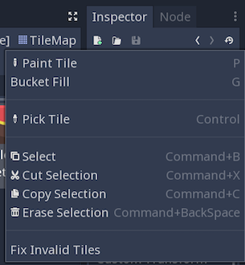
