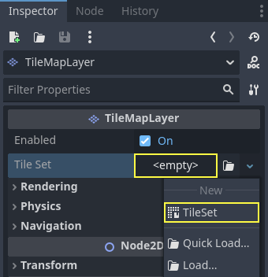

.. _doc_using_tilesets:

Using TileSets
==============

Introduction
------------

A tilemap is a grid of tiles used to create a game's layout. There are several
benefits to using :ref:`TileMap <class_TileMap>` nodes to design your levels.
First, they let you draw a layout by "painting" tiles onto a grid,
which is much faster than placing individual :ref:`Sprite2D
<class_Sprite2D>` nodes one by one. Second, they allow for larger levels
because they are optimized for drawing large numbers of tiles.
Finally, they allow you to add greater functionality to your tiles with
collision, occlusion, and navigation shapes.

To use tilemaps, you will need to create a TileSet first. A TileSet is a
collection of tiles that can be placed in a TileMap node. After creating a
TileSet, you will be able to place them :ref:`using the TileMap editor
<doc_using_tilemaps>`.

To follow this guide, you will need an image containing your tiles where every
tile has the same size (large objects can be split into several tiles). This
image is called a *tilesheet*. Tiles do not have to be square: they can be
rectangular, hexagonal, or isometric (pseudo-3D perspective).

Creating a new TileSet
----------------------

.. _doc_creating_tilesets_using_tilesheet:

Using a tilesheet
^^^^^^^^^^^^^^^^^

This demonstration will use the following tiles taken from
`Kenney's "Abstract Platformer" pack <https://kenney.nl/assets/abstract-platformer>`__.
We'll use this particular *tilesheet* from the set:

.. figure:: img/using_tilesets_kenney_abstract_platformer_tile_sheet.webp
   :align: center
   :alt: Tilesheet example with 64×64 tiles

   Tilesheet with 64×64 tiles. Credit: `Kenney <https://kenney.nl/assets/abstract-platformer>`__

Create a new **TileMap** node, then select it and create a new TileSet resource in the inspector:

   Creating a new TileSet resource within the TileMap node

After creating the TileSet resource, click the value to unfold it in the
inspector. The default tile shape is Square, but you can also choose Isometric,
Half-Offset Square or Hexagon (depending on the shape of your tile images). If
using a tile shape other than Square, you may also need to adjust the **Tile
Layout** and **Tile Offset Axis** properties. Lastly, enabling the
**Rendering > UV Clipping** property may be useful if you wish tiles to be clipped
by their tile coordinates. This ensures tiles cannot draw outside their allocated
area on the tilesheet.

Set the tile size to 64×64 in the inspector to match the example tilesheet:

   Setting the tile size to 64×64 to match the example tilesheet

If relying on automatic tiles creation (like we're about to do here), you must
set the tile size **before** creating the *atlas*. The atlas will
determine which tiles from the tilesheet can be added to a TileMap node
(as not every part of the image may be a valid tile).

Open the **TileSet** panel at the bottom of the editor, then click the "+" icon
in the bottom-left corner to add a new atlas:

.. figure:: img/using_tilesets_create_new_atlas.webp
   :align: center
   :alt: Creating a new atlas in a TileSet resource using the bottom panel

   Creating a new atlas in a TileSet resource using the bottom panel

After creating an atlas, you must assign a tilesheet texture to it.
This can be done by choosing it on the left column of the bottom panel, then
clicking the value of the **Texture** property and choosing **Quick Load** (or **Load**).
Specify the path to the image file using the file dialog that appears.

.. figure:: img/using_tilesets_load_tilesheet.webp
   :align: center
   :alt: Loading a tilesheet image in the newly created TileSet atlas

   Loading a tilesheet image in the newly created TileSet atlas

After specifying a valid image, you will be asked whether to create tiles
automatically. Answer **Yes**:

.. figure:: img/using_tilesets_create_tiles_automatically.webp
   :align: center
   :alt: Automatically creating tiles based on tilesheet image content

   Automatically creating tiles based on tilesheet image content

This will automatically create tiles according to the tile size you specified
earlier in the TileSet resource. This greatly speeds up initial tile setup.

.. note::

    When using automatic tile generation based on image contents, parts of the
    tilesheet that are *fully* transparent will not have tiles generated.

If there are tiles from the tilesheet you do not wish to be present in atlas,
choose the Eraser tool at the top of the tileset preview, then click the tiles
you wish to remove:

.. figure:: img/using_tilesets_eraser_tool.webp
   :align: center
   :alt: Using the Eraser tool to remove unwanted tiles from the TileSet atlas

   Using the Eraser tool to remove unwanted tiles from the TileSet atlas

You can also right-click a tile and choose **Delete**, as an alternative to the
Eraser tool.

.. tip::

    Like in the 2D and TileMap editors, you can pan across the TileSet panel using
    the middle or right mouse buttons, and zoom using the mouse wheel or buttons in
    the top-left corner.

If you wish to source tiles from several tilesheet images for a single TileSet,
create additional atlases and assign textures to each of them before continuing.
It is also possible to use one image per tile this way (although using
tilesheets is recommended for better usability).

You can adjust properties for the atlas in the middle column:

.. figure:: img/using_tilesets_properties.webp
   :align: center
   :alt: Adjusting TileSet atlas properties in the dedicated inspector (part of the TileSet panel)

   Adjusting TileSet atlas properties in the dedicated inspector (part of the TileSet panel)

The following properties can be adjusted on the atlas:

- **ID:** The identifier (unique within this TileSet), used for sorting.
- **Name:** The human-readable name for the atlas. Use a descriptive name
  here for organizational purposes (such as "terrain", "decoration", etc).
- **Margins:** The margins on the image's edges that should not be selectable as
  tiles (in pixels). Increasing this can be useful if you download a tilesheet
  image that has margins on the edges (e.g. for attribution).
- **Separation:** The separation between each tile on the atlas in pixels.
  Increasing this can be useful if the tilesheet image you're using contains
  guides (such as outlines between every tile).
- **Texture Region Size:** The size of each tile on the atlas in pixels. In most
  cases, this should match the tile size defined in the TileMap property
  (although this is not strictly necessary).
- **Use Texture Padding:** If checked, adds a 1-pixel transparent edge around
  each tile to prevent texture bleeding when filtering is enabled.
  It's recommended to leave this enabled unless you're running into rendering issues
  due to texture padding.

Note that changing texture margin, separation and region size may cause tiles to
be lost (as some of them would be located outside the atlas image's
coordinates). To regenerate tiles automatically from the tilesheet, use the
three vertical dots menu button at the top of the TileSet editor and choose
**Create Tiles in Non-Transparent Texture Regions**:

.. figure:: img/using_tilesets_recreate_tiles_automatically.webp
   :align: center
   :alt: Recreating tiles automatically after changing atlas properties

   Recreating tiles automatically after changing atlas properties

Using a collection of scenes
^^^^^^^^^^^^^^^^^^^^^^^^^^^^

Since Godot 4.0, you can place actual *scenes* as tiles. This allows you to use
any collection of nodes as a tile. For example, you could use scene tiles to
place gameplay elements, such as shops the player may be able to interact with.
You could also use scene tiles to place AudioStreamPlayer2Ds (for ambient
sounds), particle effects, and more.

.. warning::

   Scene tiles come with a greater performance overhead compared to atlases, as
   every scene is instanced individually for every placed tile.

   It's recommended to use only scene tiles when necessary. To draw sprites in a
   tile without any kind of advanced manipulation,
   :ref:`use atlases instead <doc_creating_tilesets_using_tilesheet>`.

For this example, we'll create a scene containing a CPUParticles2D root node.
Save this scene to a scene file (separate from the scene containing the
TileMap), then switch to the scene containing the TileMap node. Open the TileSet
editor, and create a new **Scenes Collection** in the left column:

.. figure:: img/using_tilesets_creating_scene_collection.webp
   :align: center
   :alt: Creating a scenes collection in the TileSet editor

   Creating a scenes collection in the TileSet editor

After creating a scenes collection, you can enter a descriptive name for the
scenes collection in the middle column if you wish. Select this scenes
collection then create a new scene slot:

.. figure:: img/using_tilesets_scene_collection_create_scene_tile.webp
   :align: center
   :alt: Creating a scene tile after selecting the scenes collection in the TileSet editor

   Creating a scene tile after selecting the scenes collection in the TileSet editor

Select this scene slot in the right column, then use **Quick Load** (or
**Load**) to load the scene file containing the particles:

.. figure:: img/using_tilesets_adding_scene_tile.webp
   :align: center
   :alt: Creating a scene slot, then loading a scene file into it in the TileSet editor

   Creating a scene slot, then loading a scene file into it in the TileSet editor

You now have a scene tile in your TileSet. Once you switch to the TileMap
editor, you'll be able to select it from the scenes collection and paint it like
any other tile.

Merging several atlases into a single atlas
-------------------------------------------

Using multiple atlases within a single TileSet resource can sometimes be useful,
but it can also be cumbersome in certain situations (especially if you're using
one image per tile). Godot allows you to merge several atlases into a single
atlas for easier organization.

To do so, you must have more than one atlas created in the TileSet resource.
Use the "three vertical dots" menu button located at the bottom of the list of
atlases, then choose **Open Atlas Merging Tool**:

.. figure:: img/using_tilesets_open_atlas_merging_tool.webp
   :align: center
   :alt: Opening the atlas merging tool after creating multiple atlases

   Opening the atlas merging tool after creating multiple atlases

This will open a dialog, in which you can select several atlases by holding
:kbd:`Shift` or :kbd:`Ctrl` then clicking on multiple elements:

.. figure:: img/using_tilesets_atlas_merging_tool_dialog.webp
   :align: center
   :alt: Using the atlas merging tool dialog

   Using the atlas merging tool dialog

Choose **Merge** to merge the selected atlases into a single atlas image (which
translates to a single atlas within the TileSet). The unmerged atlases will be
removed within the TileSet, but *the original tilesheet images will be kept on
the filesystem*. If you don't want the unmerged atlases to be removed from the
TileSet resource, choose **Merge (Keep Original Atlases)** instead.

.. tip::

    TileSet features a system of *tile proxies*. Tile proxies are a mapping
    table that allows notifying the TileMap using a given TileSet that a given
    set of tile identifiers should be replaced by another one.

    Tile proxies are automatically set up when merging different atlases, but
    they can also be set manually thanks to the **Manage Tile Proxies** dialog
    you can access using the "three vertical dots" menu mentioned above.

    Manually creating tile proxies may be useful when you changed an atlas ID or
    want to replace all tiles from an atlas by the ones from another atlas. Note
    that when editing a TileMap, you can replace all cells by their
    corresponding mapped value.

Adding collision, navigation and occlusion to the TileSet
---------------------------------------------------------

We've now successfully created a basic TileSet. We could start using in the
TileMap node now, but it currently lacks any form of collision detection.
This means the player and other objects could walk straight through the floor or
walls.

If you use :ref:`2D navigation <doc_navigation_overview_2d>`, you'll also need
to define navigation polygons for tiles to generate a navigation mesh that
agents can use for pathfinding.

Lastly, if you use :ref:`doc_2d_lights_and_shadows` or GPUParticles2D, you may
also want your TileSet to be able to cast shadows and collide with particles.
This requires defining occluder polygons for "solid" tiles on the TileSet.

To be able to define collision, navigation and occlusion shapes for each tile,
you will need to create a physics, navigation or occlusion layer for the TileSet
resource first. To do so, select the TileMap node, click the TileSet property
value in the inspector to edit it then unfold **Physics Layers** and choose
**Add Element**:

   Creating a physics layer in the TileSet resource inspector (within the TileMap node)

If you also need navigation support, now is a good time to create a navigation layer:

   Creating a navigation layer in the TileSet resource inspector (within the TileMap node)

If you need support for light polygon occluders, now is a good time to create an occlusion layer:

   Creating an occlusion layer in the TileSet resource inspector (within the TileMap node)

.. note::

    Future steps in this tutorial are tailored to creating collision polygons,
    but the procedure for navigation and occlusion is very similar.
    Their respective polygon editors behave in the same way, so these steps are
    not repeated for brevity.

    The only caveat is that the tile's occlusion polygon property is part of a
    **Rendering** subsection in the atlas inspector. Make sure to unfold this
    section so you can edit the polygon.

After creating a physics layer, you have access to the **Physics Layer** section
in the TileSet atlas inspector:

.. figure:: img/using_tilesets_selecting_collision_editor.webp
   :align: center
   :alt: Opening the collision editor while in Select mode

   Opening the collision editor while in Select mode

You can quickly create a rectangle collision shape by pressing :kbd:`F` while
the TileSet editor is focused. If the keyboard shortcut doesn't work, try
clicking in the empty area around the polygon editor to focus it:

.. figure:: img/using_tilesets_using_default_rectangle_collision.webp
   :align: center
   :alt: Using default rectangle collision shape by pressing :kbd:`F`

   Using default rectangle collision shape by pressing :kbd:`F`

In this tile collision editor, you have access to all the 2D polygon editing tools:

- Use the toolbar above the polygon to toggle between creating a new polygon,
  editing an existing polygon and removing points on the polygon. The "three vertical dots"
  menu button offers additional options, such as rotating and flipping the polygon.
- Create new points by clicking and dragging a line between two points.
- Remove a point by right-clicking it (or using the Remove tool described above
  and left-clicking).
- Pan in the editor by middle-clicking or right-clicking. (Right-click panning
  can only be used in areas where there is no point nearby.)

You can use the default rectangle shape to quickly create a triangle-shaped
collision shape by removing one of the points:

.. figure:: img/using_tilesets_creating_triangle_collision.webp
   :align: center
   :alt: Creating a triangle collision shape by right-clicking one of the corners to remove it

   Creating a triangle collision shape by right-clicking one of the corners to remove it

You can also use the rectangle as a base for more complex shapes by adding more points:

.. figure:: img/using_tilesets_drawing_custom_collision.webp
   :align: center
   :alt: Drawing a custom collision for a complex tile shape

   Drawing a custom collision for a complex tile shape

.. tip::

    If you have a large tileset, specifying the collision for each tile
    individually could take a lot of time. This is especially true as TileMaps
    tend to have many tiles with common collision patterns (such as solid blocks
    or 45-degree slopes). To apply a similar collision shape to several tiles
    quickly, use functionality to
    :ref:`assign properties to multiple tiles at once <doc_using_tilemaps_assigning_properties_to_multiple_tiles>`.

Assigning custom metadata to the TileSet's tiles
------------------------------------------------

You can assign custom data on a per-tile basis using *custom data layers*.
This can be useful to store information specific to your game, such as the damage
that a tile should deal when the player touches it, or whether a tile can be
destroyed using a weapon.

The data is associated with the tile in the TileSet: all instances of the placed
tile will use the same custom data. If you need to create a variant of a tile
that has different custom data, this can be done by :ref:`creating an
alternative tile <doc_using_tilesets_creating_alternative_tiles>` and changing
the custom data for the alternative tile only.

   Creating a custom data layer in the TileSet resource inspector (within the TileMap node)

.. figure:: img/using_tilesets_custom_data_layers_example.webp
   :align: center
   :alt: Example of configured custom data layers with game-specific properties

   Example of configured custom data layers with game-specific properties

You can reorder custom data without breaking existing metadata: the TileSet
editor will update automatically after reordering custom data properties.

Note that in the editor, property names do not appear (only their index, which
matches the order in which they are defined). For example, with the custom data
layers example shown above, we're assigning a tile to have the
``damage_per_second`` metadata set to ``25`` and the ``destructible`` metadata
to ``false``:

   Editing custom data in the TileSet editor while in Select mode

:ref:`Tile property painting <doc_using_tilemaps_using_tile_property_painting>`
can also be used for custom data:

   Assigning custom data in the TileSet editor using tile property painting

.. _doc_using_tilesets_creating_terrain_sets:

Creating terrain sets (autotiling)
----------------------------------

.. note::

    Godot 4's terrains are a more powerful replacement for Godot 3.x's
    autotiles. You could only set autotile bits either on or off. But, with
    terrain tiles, you can set each bit to a specific terrain. When you paint
    terrains on the TileMap, Godot chooses tiles to handle transitions between
    terrains automatically.

    In addition, an autotile in Godot 3.x was a specific kind of tile, different
    from an atlas tile. But, in Godot 4, a terrain tile is still an atlas tile,
    but with terrain data assigned. This means that you can use it as a terrain
    or as a single atlas tile. And any property that you can assign to an atlas
    tile, you can also assign to a terrain tile.

When you create a game level using tiles, you may need many variations on a
single tile with different corners or edges. You might use them to create
complex shapes in a platformer, to draw walls or cliffs in a top-down level, or
to transition between different terrains on a world map.

You can end up with a large number of tile variants, and it can be tedious to
place them all manually. Using them for procedurally generated levels can be
difficult, too, and require a lot of code.

Godot offers *terrains* to automatically handle the placement of these kinds of
tiles.

Terrains can be complicated to understand. This section starts with
introductions to how :ref:`terrains
<doc_using_tilesets_terrains_understanding_terrains>` and :ref:`terrain modes
<doc_using_tilesets_terrains_choosing_a_terrain_mode>` work. If you're ready to
create your own, go to :ref:`doc_using_tilesets_terrains_setting_up`. If you're
an experienced user or you're here to troubleshoot, you may want
:ref:`doc_using_tilesets_terrains_special_cases`.

.. hint::

    All the examples in this section use public domain tilesheets. To use any of
    them in your own project, right-click and save the tilesheet's image to your
    project folder.

    You can also download the starter project
    `2d_using_tilesets_terrain_starter.zip
    <https://github.com/godotengine/godot-docs-project-starters/releases/download/latest-4.x/2d_using_tilesets_terrain_starter.zip>`__.
    It contains scenes for every example with the TileSets and terrains already
    set up.

.. _doc_using_tilesets_terrains_understanding_terrains:

Understanding how terrains work
^^^^^^^^^^^^^^^^^^^^^^^^^^^^^^^

The terrains system is made up of **terrain sets**, **terrains**, and **tiles**.
A TileSet can have one or more *terrain sets*, a terrain set can have one or
more *terrains*, and a terrain can have one or more *tiles*.

Terrain tiles have one *center bit* and multiple *peering bits*. Each bit can
have one *terrain*. We often refer to a tile's specific configuration of
terrains assigned to center and peering bits as its **bitmask**.

.. figure:: img/using_tilesets_terrain_intro_diagram.webp
    :align: center
    :alt: A tile with center and peering bits in Match Corners and Sides mode.

    A tile with center and peering bits in
    :ref:`doc_using_tilesets_terrains_match_corners_and_sides` mode.

The center bit, or the tile's **terrain**, is the terrain the whole tile belongs
to, while **peering bits** are like the edges of a jigsaw puzzle piece: they
determine which other tiles they can fit next to. The tile's shape and the
terrain mode determine which peering bits it has, and what they look like.

In this tilesheet, there are three terrains: water, grass and dirt:

.. figure:: img/using_tilesets_terrain_floating_islands_corners_and_sides.webp
    :align: center
    :alt: Adapted from The Field of Floating Islands by Buch (CC0).

    Adapted from `The Field of Floating Islands
    <https://opengameart.org/content/the-field-of-the-floating-islands>`__ by
    `Buch <https://opengameart.org/users/buch>`__ (CC0).

You would assign the water tile to a ``Water`` terrain, the grass tiles to a
``Grass`` terrain, and the dirt tiles to a ``Dirt`` terrain. Then, instead of
placing the individual *tiles* onto a TileMap, you could paint individual
*terrains*, and Godot would automatically choose which tile to put in each cell.

As seen below, when you paint the ``Dirt`` terrain onto a cell, Godot chooses a
tile that has the ``Dirt`` terrain as its *terrain* (center bit), and whose peering
bits match the neighboring tiles.

.. figure:: img/using_tilesets_terrain_intro_simulation.webp
    :align: center
    :alt: Before and after painting in Connect Mode.

    Before and after painting in Connect Mode.

In *Connect Mode*, Godot may also change the tiles in the neighboring cells to
find the best match. In this example, it changed three of the neighbor tiles.

.. note::

    When you paint on the TileMap in *Connect Mode*, Godot may change tiles in the
    neighboring cells so that all the peering bits match. But it will **not**
    change the *terrain* of the neighboring cells. This means that it will only
    place a tile with the same center bit as the tile that was there before.

.. seealso::

    For more information about Connect Mode and painting terrains on a TileMap,
    see :ref:`doc_using_tilemaps`.

.. _doc_using_tilesets_terrains_choosing_a_terrain_mode:

Choosing a terrain mode
^^^^^^^^^^^^^^^^^^^^^^^

Godot has three terrain modes: :ref:`doc_using_tilesets_terrains_match_sides`,
:ref:`doc_using_tilesets_terrains_match_corners`, and
:ref:`doc_using_tilesets_terrains_match_corners_and_sides`. The terrain mode
determines which peering bits a terrain tile has. This changes what kind of
shapes you can make with the tiles, and also how many tiles are needed to paint
all the possible shapes.

.. note::

    Terrain modes are similar to Godot 3.x's autotile bitmask modes.
    :ref:`doc_using_tilesets_terrains_match_corners` corresponds to **2x2**, and
    :ref:`doc_using_tilesets_terrains_match_corners_and_sides` corresponds to
    **3x3 minimal**.

    While :ref:`doc_using_tilesets_terrains_match_sides` does not correspond to
    a separate autotile mode, a similar sides-matching autotile was possible in
    Godot 3.x by using a 16-tile subset of 3x3 minimal.

    **3x3** mode in Godot 3.x, which allowed *individual* diagonal corners to
    match together and required 256 tiles for a full set, does not have an
    equivalent in Godot 4.

.. seealso::

    These tile-matching modes are not unique to Godot. To learn about the theory
    behind matching tiles in this way, see cr31's `Wang Tiles
    <http://www.cr31.co.uk/stagecast/wang/intro.html>`__.

.. _doc_using_tilesets_terrains_match_sides:

Match Sides
"""""""""""

* **Peering bits:** Match Sides mode uses peering bits on the tiles' edges. This
  means that square and isometric tiles have four peering bits, and hexagonal
  tiles have six. For all shapes, there is only one neighboring tile at each
  peering bit. Neighbors at the corners do not have any effect.

.. figure:: img/using_tilesets_terrain_sides_diagram.webp
    :align: center
    :alt: How peering bits match with their neighbors in Match Sides mode.

    How peering bits match with their neighbors in Match Sides mode.

* **Tiles needed:** 16.

* **Advantages:** These tiles are the easiest to set up and use. You can paint
  straight lines. You can also paint *either* turns and intersections *or*
  filled-in rectangles. The :ref:`top-down example
  <doc_using_tilesets_terrains_match_sides_topdown>` has both uses in the same
  terrain set.

* **Limitations:** You can't paint diagonal lines. In addition, when you are
  painting rectangles, there is no difference between outside and inside
  corners. For many tiles, the artwork requires that inside corners have a
  different appearance from outside corners. If this is the case, you can't
  paint shapes that are more complex than single rectangles.

.. seealso::

    See the :ref:`alternative tiles example
    <doc_using_tilesets_terrains_alternative_tiles>` for flexible tiles that do
    *not* require separate art for inside and outside corners, and can be
    painted in complex shapes in Match Sides mode.

* **Template:**

.. figure:: img/using_tilesets_terrain_sides_template.webp
    :align: center
    :alt: Template for Match Sides mode.

    Right-click and choose **Save as…** to download.

.. note::

    This section includes one or more templates for each terrain mode. You can
    use them as references for assigning peering bits, or as guides in a paint
    program. All templates have a square tile size of 64px x 64px, but they are
    designed to be scaled to other sizes.

    You can download the templates' image files individually from this page. Or
    you can download the starter project (`2d_using_tilesets_terrain_starter.zip
    <https://github.com/godotengine/godot-docs-project-starters/releases/download/latest-4.x/2d_using_tilesets_terrain_starter.zip>`__)
    to get all the templates in ``png`` format.

.. _doc_using_tilesets_terrains_match_sides_sidescroller:

* **Sidescroller example:** Note the simple rectangles and the straight lines
  for platforms. For comparison, see the :ref:`Match Corners
  <doc_using_tilesets_terrains_match_corners_sidescroller>` and :ref:`Match
  Corners and Sides
  <doc_using_tilesets_terrains_match_corners_and_sides_sidescroller>`
  sidescroller examples.

.. seealso::

    To learn how to create a terrain set and use the bitmasks for tiles like
    these, see :ref:`doc_using_tilesets_terrains_setting_up` and
    :ref:`doc_using_tilesets_terrains_setting_up_paint_mode`.

.. list-table::
  :class: wrap-normal
  :width: 100%
  :widths: 100

  * - Tilesheet

  * - .. figure:: img/using_tilesets_terrain_treasure_hunters_sides.webp
        :align: center
        :alt: Adapted from Treasure Hunters by Pixel Frog (CC0).

        Adapted from `Treasure Hunters
        <https://pixelfrog-assets.itch.io/treasure-hunters>`__ by `Pixel Frog
        <https://pixelfrog-assets.itch.io/>`__ (CC0). Right-click and choose
        **Save as…** to download.

  * - Bitmask

  * - .. figure:: img/using_tilesets_terrain_sides_sidescroller_setup.webp
        :align: center
        :alt: Bitmask setup.

  * - Level

  * - .. figure:: img/using_tilesets_terrain_sides_sidescroller_result.webp
        :align: center
        :alt: Example level.

.. _doc_using_tilesets_terrains_match_sides_topdown:

* **Top-down example:** Note the different uses of Match Sides mode for grass
  and dirt terrains. The grass tiles are painted as rectangular patches of
  terrain, and the dirt tiles are painted as roads with turns and intersections.
  For comparison, see the :ref:`Match Corners
  <doc_using_tilesets_terrains_match_corners_topdown>` and :ref:`Match Corners
  and Sides <doc_using_tilesets_terrains_match_corners_and_sides_topdown>`
  top-down examples.

.. list-table::
  :class: wrap-normal
  :width: 100%
  :widths: 100

  * - Tilesheet

  * - .. figure:: img/using_tilesets_terrain_floating_islands_sides.webp
        :align: center
        :alt: Adapted from The Field of Floating Islands by Buch (CC0).

        Adapted from `The Field of Floating Islands
        <https://opengameart.org/content/the-field-of-the-floating-islands>`__
        by `Buch <https://opengameart.org/users/buch>`__ (CC0). Right-click and
        choose **Save as…** to download.

  * - Bitmask

  * - .. figure:: img/using_tilesets_terrain_sides_topdown_setup.webp
        :align: center
        :alt: Bitmask setup.

  * - Level

  * - .. figure:: img/using_tilesets_terrain_sides_topdown_result.webp
        :align: center
        :alt: Example level.

.. _doc_using_tilesets_terrains_match_corners:

Match Corners
"""""""""""""

* **Peering bits:** Match Corners mode uses peering bits on the tiles' corners.
  Square and isometric tiles have four peering bits, and three neighbors at each
  peering bit. Hexagonal tiles have six peering bits, but only two neighbors at
  each peering bit. All tiles that share the same corner must have their peering
  bit set to the same terrain. This means that *square and isometric tiles must
  be connected in groups of four*, and *hexagonal tiles must be connected in
  groups of three*.

.. figure:: img/using_tilesets_terrain_corners_diagram.webp
    :align: center
    :alt: How peering bits match with their neighbors in Match Corners mode.

    How peering bits match with their neighbors in Match Corners mode.

* **Tiles needed:** 16.

* **Advantages:** You can paint complex shapes. Match Corners is good for
  painting large patches of landscape or caves.

* **Limitations:** You can only connect tiles together in groups of four
  (two-by-two blocks). This means that small details and lines only one-tile
  wide are not possible.

.. warning::

    In Match Corners mode, the corner bits of *all* neighboring tiles must
    match.

    .. figure:: img/using_tilesets_terrain_corners_warning.webp
        :align: center
        :alt: In Match Corners mode, all neighboring corners must match.

.. tip::

    To prevent errors when painting on the TileMap, try using the rectangle
    tool. With the rectangle, you can make sure you are always painting at least
    four tiles of the same terrain together.

    In procedural generation, you will need to make sure that your script
    doesn't assign fewer than four cells together to a terrain. If you're using
    pixel values from noise to set terrains, you can scale up the noise x2 to
    make sure that all terrains are painted in groups of four.

* **Templates:** In this first template for Match Corners mode, all the tiles
  connect to each other.

.. figure:: img/using_tilesets_terrain_corners_template.webp
    :align: center
    :alt: Template for Match Corners mode.

    Right-click and choose **Save as…** to download.

In this alternate template, the tiles are arranged according to outside and
inside corners. Publicly available tilesheets are frequently set up like this.
Note that this template only has 15 tiles: it is missing the single tile.

.. figure:: img/using_tilesets_terrain_corners_template_alt.webp
    :align: center
    :alt: Alternate template for Match Corners mode.

    Right-click and choose **Save as…** to download.

.. _doc_using_tilesets_terrains_match_corners_sidescroller:

* **Sidescroller example:** Note the complex shapes of the caves in this level.
  There are also small single-tile platforms, but no long, thin platforms. For
  comparison, see the :ref:`Match Sides
  <doc_using_tilesets_terrains_match_corners_sidescroller>` and :ref:`Match
  Corners and Sides
  <doc_using_tilesets_terrains_match_corners_and_sides_sidescroller>`
  sidescroller examples.

.. list-table::
  :class: wrap-normal
  :width: 100%
  :widths: 100

  * - Tilesheet

  * - .. figure:: img/using_tilesets_terrain_treasure_hunters_corners.webp
        :align: center
        :alt: Adapted from Treasure Hunters by Pixel Frog (CC0).

        Adapted from `Treasure Hunters
        <https://pixelfrog-assets.itch.io/treasure-hunters>`__ by `Pixel Frog
        <https://pixelfrog-assets.itch.io/>`__ (CC0). Right-click and choose
        **Save as…** to download.

  * - Bitmask

  * - .. figure:: img/using_tilesets_terrain_corners_sidescroller_setup.webp
        :align: center
        :alt: Bitmask setup.

  * - Level

  * - .. figure:: img/using_tilesets_terrain_corners_sidescroller_result.webp
        :align: center
        :alt: Example level.

.. _doc_using_tilesets_terrains_match_corners_topdown:

* **Top-down example:** Note the large patches of terrain in this level, but the
  lack of single-tile roads or small details. For comparison, see the
  :ref:`Match Sides <doc_using_tilesets_terrains_match_corners_topdown>` and
  :ref:`Match Corners and Sides
  <doc_using_tilesets_terrains_match_corners_and_sides_topdown>` top-down
  examples.

.. list-table::
  :class: wrap-normal
  :width: 100%
  :widths: 100

  * - Tilesheet

  * - .. figure:: img/using_tilesets_terrain_floating_islands_corners.webp
        :align: center
        :alt: Adapted from The Field of Floating Islands by Buch (CC0).

        Adapted from `The Field of Floating Islands
        <https://opengameart.org/content/the-field-of-the-floating-islands>`__
        by `Buch <https://opengameart.org/users/buch>`__ (CC0). Right-click and
        choose **Save as…** to download.

  * - Bitmask

  * - .. figure:: img/using_tilesets_terrain_corners_topdown_setup.webp
        :align: center
        :alt: Bitmask setup.

  * - Level

  * - .. figure:: img/using_tilesets_terrain_corners_topdown_result.webp
        :align: center
        :alt: Example level.

.. _doc_using_tilesets_terrains_match_corners_and_sides:

Match Corners and Sides
"""""""""""""""""""""""

* **Peering bits:** Match Corners and Sides mode uses peering bits on the tiles'
  corners and edges. Square and isometric tiles have 8 peering bits, and
  hexagonal tiles have 12. As in the other modes, tiles have only one neighbor
  at each side, while square and isometric tiles have three neighbors at each
  corner, and hexagonal tiles have two. All tiles that share the same corner
  must have that corner's peering bit set to the same terrain.

.. figure:: img/using_tilesets_terrain_cs_diagram.webp
    :align: center
    :alt: How peering bits match with their neighbors in Match Corners and Sides mode.

    How peering bits match with their neighbors in Match Corners and Sides mode.

* **Tiles needed:** 47.

* **Advantages:** This is the most versatile terrain mode. You can draw all the
  shapes from the other modes, but without their limitations. You can create
  single-tile paths, complex regions of terrain, and any needed twists or turns
  between them.

* **Limitations:** It requires more tiles than the other modes. But there is
  only one limitation for shapes: you cannot create diagonal lines.

.. seealso::

    Free tools like `Webtyler <https://wareya.github.io/webtyler/>`__ and
    `TilePipe2 <https://aleksandrbazhin.itch.io/tilepipe2>`__ can automatically
    generate the full 47 tiles for Match Corners and Sides mode from only a few
    tiles.

* **Templates:**

.. figure:: img/using_tilesets_terrain_corners_and_sides_template.webp
    :align: center
    :alt: Template for Match Corners and Sides mode.

    Right-click and choose **Save as…** to download.

.. _doc_using_tilesets_terrains_match_corners_and_sides_sidescroller:

* **Sidescroller example:** Note that complex caves and narrow platforms are
  possible in the same TileMap. For comparison, see the :ref:`Match Sides
  <doc_using_tilesets_terrains_match_corners_topdown>` and :ref:`Match Corners
  <doc_using_tilesets_terrains_match_corners_topdown>` sidescroller examples.

.. list-table::
  :class: wrap-normal
  :width: 100%
  :widths: 100

  * - Tilesheet

  * - .. figure:: img/using_tilesets_terrain_treasure_hunters_corners_and_sides.webp
        :align: center
        :alt: Adapted from Treasure Hunters by Pixel Frog (CC0).

        Adapted from `Treasure Hunters
        <https://pixelfrog-assets.itch.io/treasure-hunters>`__ by `Pixel Frog
        <https://pixelfrog-assets.itch.io/>`__ (CC0). Right-click and choose
        **Save as…** to download.

  * - Bitmask

  * - .. figure:: img/using_tilesets_terrain_cs_sidescroller_setup.webp
        :align: center
        :alt: Bitmask setup.

  * - Level

  * - .. figure:: img/using_tilesets_terrain_cs_sidescroller_result.webp
        :align: center
        :alt: Example level.

.. _doc_using_tilesets_terrains_match_corners_and_sides_topdown:

* **Top-down example:** Note the complex terrain shapes, as well as roads and
  small details. For comparison, see the :ref:`Match Corners
  <doc_using_tilesets_terrains_match_corners_topdown>` and :ref:`Match Corners
  and Sides <doc_using_tilesets_terrains_match_corners_and_sides_topdown>`
  top-down examples.

.. note::

    This tilesheet was automatically generated from the original source using
    `Webtyler <https://wareya.github.io/webtyler/>`__. To try it yourself, you
    can use the *minitile* in the starter project
    (`2d_using_tilesets_terrain_starter.zip
    <https://github.com/godotengine/godot-docs-project-starters/releases/download/latest-4.x/2d_using_tilesets_terrain_starter.zip>`__).

.. list-table::
  :class: wrap-normal
  :width: 100%
  :widths: 100

  * - Tilesheet

  * - .. figure:: img/using_tilesets_terrain_floating_islands_corners_and_sides.webp
        :align: center
        :alt: Adapted from The Field of Floating Islands by Buch (CC0).

        Adapted from `The Field of Floating Islands
        <https://opengameart.org/content/the-field-of-the-floating-islands>`__
        by `Buch <https://opengameart.org/users/buch>`__ (CC0). Right-click and
        choose **Save as…** to download.

  * - Bitmask

  * - .. figure:: img/using_tilesets_terrain_cs_topdown_setup.webp
        :align: center
        :alt: Bitmask setup.

  * - Level

  * - .. figure:: img/using_tilesets_terrain_cs_topdown_result.webp
        :align: center
        :alt: Example level.

.. _doc_using_tilesets_terrains_setting_up:

Setting up a new terrain set
^^^^^^^^^^^^^^^^^^^^^^^^^^^^^

In this section, we will create a terrain set for the ground and mushroom tiles
in the Pixel Platformer tilesheet. (We will set up the water tiles later in
:ref:`doc_using_tilesets_terrains_animating`.)

.. list-table::
  :class: wrap-normal
  :width: 100%
  :widths: 100

  * - Pixel Platformer tilesheet

  * - .. figure:: img/using_tilesets_terrain_pixel_platformer.webp
        :align: center
        :alt: Tilesheet adapted from Pixel Platformer by Kenney (CC0).

        Adapted from `Pixel Platformer
        <https://www.kenney.nl/assets/pixel-platformer>`__ by `Kenney
        <https://www.kenney.nl/>`__ (CC0). Right-click and choose **Save as…**
        to download.

The ground tiles match by their corners, so they will need
:ref:`doc_using_tilesets_terrains_match_corners` mode, and the mushroom tiles
match according to their sides, so they will need
:ref:`doc_using_tilesets_terrains_match_sides` mode. A terrain set can only have
one mode, so we will create two separate terrain sets.

.. caution::

    Tiles in different terrain sets cannot match with each other, since they use
    different peering bits. In this case, it doesn't matter, since we will be
    painting the ground and mushrooms separately over a background of empty
    cells.

    If we needed to paint them both over the same background terrain, or if they
    needed to transition to each other, we would have to put them in the same
    terrain set. We could do this using Match Corners and Sides mode. We could
    automatically generate the extra tiles we need using the tools from the
    :ref:`doc_using_tilesets_terrains_match_corners_and_sides` section, or we
    could reuse tiles using :ref:`alternative tiles
    <doc_using_tilesets_terrains_alternative_tiles>`.

To create a terrain set, select the **TileMap** node, go to the inspector, and
open the **TileSet** *resource*. (See :ref:`Creating a new TileSet
<doc_creating_tilesets_using_tilesheet>`.)

Open the **Terrain Sets** section and press the **Add Element** button.

.. figure:: img/using_tilesets_terrain_setup_open_tileset.webp
    :align: center
    :alt: Creating a terrain set in the TileSet resource inspector (within the TileMap node).

    Creating a terrain set in the TileSet resource inspector (within the TileMap
    node).

Use the **Mode** dropdown menu to choose a terrain mode. We will use
:ref:`doc_using_tilesets_terrains_match_corners` mode for this terrain set.

.. figure:: img/using_tilesets_terrain_setup_mode_dropdown.webp
    :align: center
    :alt: Selecting a terrain mode.

    Selecting a terrain mode.

Open the **Terrains** section and press the **Add Element** button to add a new
terrain.

.. figure:: img/using_tilesets_terrain_setup_add_terrain.webp
    :align: center
    :alt: Adding a terrain.

    Adding a terrain.

You can then edit the terrain's name and color. We will use this terrain for our
ground tiles, so we'll call it ``Ground``.

.. figure:: img/using_tilesets_terrain_setup_terrain_created.webp
    :align: center
    :alt: Editing a terrain's name and color.

    Editing a terrain's name and color.

.. tip::

    A terrain's color will be used as an overlay for the tiles' bitmasks. If the
    bits are hard to see, you can change this color at any time. A bright color
    that contrasts with the tile's texture is often easiest to see.

Follow the same steps to create a second terrain set. This time, choose
:ref:`doc_using_tilesets_terrains_match_sides` mode and add the ``Mushroom``
terrain.

.. figure:: img/using_tilesets_terrain_setup_done.webp
    :align: center
    :alt: Setting up the second terrain set.

    Setting up the second terrain set.

Next, we need to set up the tiles with terrain properties. We will learn how to
do this in Paint mode and in Select mode here. You can also access these
properties from a script using the :ref:`TileData <class_TileData>` class.

.. _doc_using_tilesets_terrains_setting_up_paint_mode:

Setting up terrain tiles in Paint mode
""""""""""""""""""""""""""""""""""""""

First, open the **TileSet editor** in the bottom panel, open **Setup** mode, and
add the ground and mushroom tiles. (See :ref:`Creating a new TileSet: Using a
tilesheet <doc_creating_tilesets_using_tilesheet>`).

.. figure:: img/using_tilesets_terrain_assign_paint_tileset_editor.webp
    :align: center
    :alt: Creating tiles in Setup mode.

    Creating tiles in Setup mode.

Open **Paint** mode by clicking the button at the top. Then open the **Paint
Properties** dropdown menu and choose **Terrains**.

.. figure:: img/using_tilesets_terrain_assign_paint_paint_mode_terrains.webp
    :align: center
    :alt: Choosing Terrains under Paint Properties.

    Choosing Terrains under Paint Properties.

Before you can assign terrains, you must first assign a terrain set. Choose
``Terrain Set 0`` for the ground tiles.

.. note::

    Terrain sets are listed according to their order in the TileSet, starting
    with an index of ``0``.

.. figure:: img/using_tilesets_terrain_assign_paint_terrain_sets_dropdown.webp
    :align: center
    :alt: Choosing a terrain set.

    Choosing a terrain set.

.. figure:: img/using_tilesets_terrain_assign_paint_paint_terrain_set.webp
    :align: center
    :alt: Tiles with no terrain sets assigned have an overlay of ``-``.

    Tiles with no terrain sets assigned have an overlay of ``-``.

Click and drag to paint the ground tiles with the terrain set.

Then open the **Terrain** dropdown and select the ``Ground`` terrain.

.. figure:: img/using_tilesets_terrain_assign_paint_terrain_dropdown.webp
    :align: center
    :alt: Selecting the ``Ground`` terrain.

    Selecting the ``Ground`` terrain.

.. tip::

    Sometimes it is hard to tell which peering bits to paint based on the tiles'
    texture alone. Using a reference, like the templates, can be helpful. In
    this example, the ground tiles are arranged according to the following
    template:

    .. figure:: img/using_tilesets_terrain_corners_template_alt.webp
        :align: center
        :alt: Alternate template for Match Corners mode.

        Alternate template for Match Corners mode.

Using the template as a guide, paint the tiles with the ``Ground`` terrain.

.. figure:: img/using_tilesets_terrain_assign_paint_after_painting_terrain.webp
    :align: center
    :alt: Painting the ``Ground`` terrain.

    Painting the ``Ground`` terrain.

Later, when we paint the ``Ground`` terrain on the TileMap, we will be painting
it on an empty background. We will leave the peering bits that don't match to
other ground tiles empty so they will match to empty space.

.. warning::

    Note that we've assigned the ``Ground`` terrain to all the ground tiles'
    center bits. This means that when we paint on TileMap with the ``Ground``
    terrain, Godot will choose one of these tiles to place.

    If you leave a tile's center bit empty, Godot will have to guess what
    terrain the tile belongs to. This can lead to unexpected results, so it is
    not recommended.

Normally, we would now paint the mushroom tiles with ``Terrain Set 1`` and the
``Mushroom`` terrain. For this example, however, we are going to set them up in
Select mode.

.. _doc_using_tilesets_terrains_setting_up_select_mode:

Setting up terrain tiles in Select mode
"""""""""""""""""""""""""""""""""""""""

In the **TileSet editor**, open **Select** mode. Then left-click on one of the
mushroom tiles to select it.

.. figure:: img/using_tilesets_terrain_assign_select_select_tile.webp
    :align: center
    :alt: Selecting a tile.

    Selecting a tile.

Expand the **Terrains** section.

.. figure:: img/using_tilesets_terrain_assign_select_terrain_section.webp
    :align: center
    :alt: Expanding the Terrains section.

    Expanding the Terrains section.

The tile we selected does not yet have a terrain set or terrain assigned, so
both values are set to a default of ``-1``. ``-1`` means "no terrain set" or "no
terrain".

.. note::

    In Paint mode, we could select the terrain set and terrain from dropdown
    menus. But in Select mode (or in scripting), we need to know the exact
    values for each one.

    A *terrain set*'s index is based on its order inside the *TileSet*. The
    first terrain set has an index of ``0``, not ``1``. A *terrain*'s index is
    based on its order inside its *terrain set*, with numbering also starting
    from ``0``.

    In this example, the ``Ground`` terrain has a terrain set of ``0`` and a
    terrain of ``0``. The ``Mushroom`` terrain has a terrain set of ``1`` and a
    terrain of ``0``. They have the same terrain index since the numbering is
    independent for each terrain set.

Since this tile belongs to the ``Mushroom`` terrain, set the **Terrain Set** to
``1`` and the **Terrain** to ``0``. *Terrain* is the same as the center bit that
we assigned in Paint mode.

Once you set these values, the **Terrains Peering Bit** section appears.

.. figure:: img/using_tilesets_terrain_assign_select_assign_terrain_values.webp
    :align: center
    :alt: The terrains peering bit section appears.

    The terrains peering bit section appears.

By default, all the peering bits are set to a *terrain index* of ``-1``. In the
same way that we painted terrains onto peering bits in Paint mode, we now need
to assign terrain indexes to them.

.. note::

   For peering bits, ``-1`` is a special value which refers to empty space.
   Setting a peering bit to ``-1`` is the same as leaving it empty when painting
   a bitmask.

The ``Mushroom`` terrain's index is ``0``. We should set the peering bits to
``0`` in directions where we want other mushroom tiles placed. Because we will
be painting the mushroom tiles on a background of empty space, we can leave any
other bits set to ``-1``.

.. figure:: img/using_tilesets_terrain_assign_select_peering_bits_set.webp
    :align: center
    :alt: Setting peering bits.

    When peering bits are set, they appear as an overlay in the color of their
    terrain.

Finish setting the terrain set, terrain, and peering bits for the other mushroom
tiles.

.. figure:: img/using_tilesets_terrain_assign_select_bitmask_finished.webp
    :align: center
    :alt: Finished bitmask.

    Finished bitmask.

You can now open the **TileMap editor** and paint the ``Ground`` and
``Mushroom`` terrains. (See: :ref:`doc_using_tilemaps`).

.. figure:: img/using_tilesets_terrain_assign_select_tilemap_result.webp
    :align: center
    :alt: Painting the ``Ground`` and ``Mushroom`` terrains on the TileMap.

    Painting the ``Ground`` and ``Mushroom`` terrains on the TileMap.

.. _doc_using_tilesets_terrains_special_cases:

Special cases
^^^^^^^^^^^^^

.. seealso::

    The examples in this section assume you are already familiar with the
    following concepts. If you're not, you can review their sections first:

    * :ref:`Creating a new TileSet <doc_creating_tilesets_using_tilesheet>`
    * :ref:`doc_using_tilesets_terrains_setting_up`
    * :ref:`doc_using_tilesets_terrains_setting_up_paint_mode`

.. _doc_using_tilesets_terrains_animating:

Animating terrain tiles
"""""""""""""""""""""""

Terrain tiles are atlas tiles that have terrain properties assigned. This means
you can also assign other properties of atlas tiles to them, including
*animation*.

We will use the TileSet from :ref:`doc_using_tilesets_terrains_setting_up`, with
the ground and mushroom tiles already set up.

.. note::

    To start from this point, download the starter project
    (`2d_using_tilesets_terrain_starter.zip
    <https://github.com/godotengine/godot-docs-project-starters/releases/download/latest-4.x/2d_using_tilesets_terrain_starter.zip>`__)
    and open the ``setting_up_example`` scene.

.. list-table::
  :class: wrap-normal
  :width: 100%
  :widths: 100

  * - Pixel Platformer tilesheet

  * - .. figure:: img/using_tilesets_terrain_pixel_platformer.webp
        :align: center
        :alt: Tilesheet adapted from Pixel Platformer by Kenney (CC0).

        Adapted from `Pixel Platformer
        <https://www.kenney.nl/assets/pixel-platformer>`__ by `Kenney
        <https://www.kenney.nl/>`__ (CC0). Right-click and choose **Save as…**
        to download.

The waterfall and river tiles have a two-frame animation arranged in two
columns. The bottom river tile only has one texture, so it will not be animated.

They both need to matched according to their sides, so we can add them to the
:ref:`doc_using_tilesets_terrains_match_sides` terrain set we already created
for the mushroom tiles.

.. figure:: img/using_tilesets_terrain_animation_setup_terrain_set.webp
    :align: center
    :alt: Adding ``Waterfall`` and ``River`` terrains.

    Adding ``Waterfall`` and ``River`` terrains.

Go to the **TileSet editor**. In the **Setup** tab, create new tiles in the
column for the *first frame* of the animation only. If there are already tiles
created in the column for the *second frame*, **right-click** on each of them
and press **Delete**.

.. figure:: img/using_tilesets_terrain_animation_create_tiles.webp
    :align: center
    :alt: Creating tiles for the first frame of the animation.

    Creating tiles for the first frame of the animation.

Open **Paint** mode and paint the bitmasks for the ``Waterfall`` and ``River``
terrains.

.. figure:: img/using_tilesets_terrain_animation_set_bitmask.webp
    :align: center
    :alt: Setting up terrain bitmasks.

    Setting up terrain bitmasks.

Next, open the **Select** tab and select the tiles in the first frame of the
animation. Make sure not to select the bottom river tile, as it does not have an
animation. Then expand the **Animation** section.

.. figure:: img/using_tilesets_terrain_animation_select.webp
    :align: center
    :alt: Selecting tiles to animate.

    Selecting tiles to animate.

Under the **Frames** section, press the **Add Element** button to add a new
frame.

.. figure:: img/using_tilesets_terrain_animation_add_frame.webp
    :align: center
    :alt: Adding a second frame.

    Adding a second frame.

The second frame of the animation represents extra textures for the original
tiles. They are not their own tiles, so they do not need -- and cannot have --
their own terrain bitmasks or any atlas tile properties.

Now, if we add waterfalls and a river to our TileMap, they will play their
two-frame animation in the editor:

.. figure:: img/using_tilesets_terrain_animation_result.webp
    :align: center
    :alt: Animated TileMap level.

    Animated TileMap level.

.. note::

    In this example, the river and waterfall tiles were painted on a new TileMap
    *layer*, so that they are on top of the ground tiles. See
    :ref:`doc_using_tilemaps` for more information on using layers.

.. _doc_using_tilesets_terrains_probabilities:

Using probabilities for multiple tiles with the same bitmask
""""""""""""""""""""""""""""""""""""""""""""""""""""""""""""

When you have more than one tile with the same bitmask, Godot will choose among
them using weighted random **probabilities**. You can use this to add variety to
your levels.

For this example, we will use the Tiny Town tilesheet. It has a plain grass tile
at the top left. It also has other variations of it with clovers, mushrooms, and
flowers.

.. list-table::
  :class: wrap-normal
  :width: 100%
  :widths: 100

  * - Tiny Town tilesheet

  * - .. figure:: img/using_tilesets_terrain_tiny_town.webp
        :align: center
        :alt: Tilesheet adapted from Tiny Town by Kenney (CC0).

        Tilesheet adapted from `Tiny Town
        <https://www.kenney.nl/assets/tiny-town>`__ by `Kenney
        <https://www.kenney.nl/>`__ (CC0). Right-click and choose **Save as…**
        to download.

First, set up a **terrain set** in
:ref:`doc_using_tilesets_terrains_match_corners` mode and add ``Grass`` and
``Dirt`` terrains.

.. figure:: img/using_tilesets_terrain_probability_tileset_setup.webp
    :align: center
    :alt: Setting up the terrain set.

    Setting up the terrain set.

In the **TileSet editor**, create tiles and paint the initial bitmask. To start,
we will only give the plain grass tile a bitmask.

.. figure:: img/using_tilesets_terrain_probability_initial_bitmask.webp
    :align: center
    :alt: Painting the initial bitmask.

    Painting the initial bitmask.

If you paint on the TileMap now, it will look like this:

.. figure:: img/using_tilesets_terrain_probability_initial_results.webp
    :align: center
    :alt: TileMap with a single grass tile.

    TileMap with a single grass tile.

Now add bitmasks for all the grass tile variations.

.. figure:: img/using_tilesets_terrain_probability_full_bitmask.webp
    :align: center
    :alt: Painting bitmasks for grass tile variations.

    Painting bitmasks for grass tile variations.

If you re-paint the ``Grass`` terrain on the TileMap, it will now look
similar to this:

.. figure:: img/using_tilesets_terrain_probability_full_results.webp
    :align: center
    :alt: TileMap with grass tile variations added.

    TileMap with grass tile variations added.

The TileMap has more variety now, but it is more cluttered than we'd like. Maybe
we want the plain grass tile to still be the most common one, and we'd like
tiles like the mushrooms to be rare.

Open **Select** mode and **left-click** on one of the grass tiles to select it.
Then open the **Miscellaneous** section. Click on the **Probability** label to
see its overlay.

.. figure:: img/using_tilesets_terrain_probability_probability_before.webp
    :align: center
    :alt: Tiles with default probability values.

    Tiles with default probability values.

By default, every tile has a probability of ``1.00``. For terrain tiles, this
value is only relevant when multiple tiles have the same bitmask. So, we will
focus only on the grass tiles here.

Try assigning new *probability* values to the grass tiles like this:

.. figure:: img/using_tilesets_terrain_probability_probability_after.webp
    :align: center
    :alt: Tiles with custom probability values.

    Tiles with custom probability values.

If you repaint the ``Grass`` terrain on the TileMap again, you will now get a
result like this:

.. figure:: img/using_tilesets_terrain_probability_probability_result.webp
    :align: center
    :alt: TileMap level with custom probabilities.

    TileMap level with custom probabilities.

.. _doc_using_tilesets_terrains_alternative_tiles:

Using alternative tiles for one tile with multiple bitmasks
"""""""""""""""""""""""""""""""""""""""""""""""""""""""""""
.. note::

    In Godot 3.x, you could set *ignore bits* in an autotile so that one tile
    could fill the role of multiple bitmasks. Terrain tiles do not have ignore
    bits, but you can turn any tile in Godot 4 into an *alternative tile*. If
    you set different combinations of peering bits on the alternative tiles,
    they can serve a similar function.

You can use **alternative tiles** to assign different combinations of peering
bits to a single tile. One use for alternative tiles is to make a working
terrain set from an incomplete set of tiles.

.. seealso::

    For general information on alternative tiles, see
    :ref:`doc_using_tilesets_creating_alternative_tiles`.

For this example, we will use the Abstract Platformer tilesheet.

.. list-table::
  :class: wrap-normal
  :width: 100%
  :widths: 100

  * - Abstract Platformer tilesheet

  * - .. figure:: img/using_tilesets_kenney_abstract_platformer_tile_sheet.webp
        :align: center
        :alt: Tilesheet adapted from Abstract Platformer by Kenney (CC0).

        `Abstract Platformer
        <https://www.kenney.nl/assets/abstract-platformer>`__ by `Kenney
        <https://www.kenney.nl/>`__ (CC0). Right-click and choose **Save as…**
        to download.

Let's say we want to create a terrain for the first group of tiles at the top.
They aren't laid out like a traditional autotile, so we'll use a paint program
to arrange them over one of the terrain mode templates to see how they will fit.

.. figure:: img/using_tilesets_terrain_alternative_missing_tiles.webp
    :align: center
    :alt: Arranging tiles over the template.

    Arranging tiles over the template.

The top row of tiles seems like it would work well as a
:ref:`doc_using_tilesets_terrains_match_sides` terrain set. The only problem is
that we are missing some tiles. It seems that the middle tile with the solid
color is meant to be reused for the bottom and sides. But we can only assign one
bitmask to it. So, if we create the terrain set like this, Godot will have to
guess which tiles to use for the other bitmasks, and it may not choose the tile
we want.

We could create a new tilesheet by duplicating the tile we need in our paint
program like this:

.. figure:: img/using_tilesets_terrain_alternative_fill_missing_tiles.webp
    :align: center
    :alt: Filling in the missing tiles in a paint program.

    Filling in the missing tiles in a paint program.

This would be a good solution. But let's say that we want to use the original
tilesheet without creating extra textures. **Alternative tiles** will allow us
to reuse the same tile texture for multiple bitmasks.

Let's go back to Godot. Open the **TileSet** inspector and create a terrain set
in :ref:`doc_using_tilesets_terrains_match_sides` mode. Then add a ``Platform``
terrain.

.. figure:: img/using_tilesets_terrain_alternative_setup_terrain_set.webp
    :align: center
    :alt: Setting up the terrain set.

    Setting up the terrain set.

Then go to the **TileSet editor**, open **Setup** mode, and create tiles for the
top row.

.. figure:: img/using_tilesets_terrain_alternative_add_tiles.webp
    :align: center
    :alt: Creating tiles.

    Creating tiles.

Open **Paint** mode and paint the ``Platform`` terrain onto these base tiles.

.. figure:: img/using_tilesets_terrain_alternative_initial_bitmask.webp
    :align: center
    :alt: Painting terrains onto the base tiles.

    Painting terrains onto the base tiles.

Then open **Select** mode and **right-click** on the first tile at the top-left.
In the popup menu, select **Create an Alternative Tile**.

.. figure:: img/using_tilesets_terrain_alternative_create.webp
    :align: center
    :alt: Creating an alternative tile.

    Creating an alternative tile.

The new alternative tile appears to the right of the base tiles. We may need to
zoom out to see it.

.. figure:: img/using_tilesets_terrain_alternative_appear.webp
    :align: center
    :alt: Creating an alternative tile.

    Creating an alternative tile.

Press the ``+`` button to create more copies of the same tile, until you have
the seven that we need.

.. figure:: img/using_tilesets_terrain_alternative_seven_tiles_created.webp
    :align: center
    :alt: Creating seven alternative tiles.

    Creating seven alternative tiles.

Go back to **Paint** mode and paint the terrain set and the ``Platform`` terrain
directly onto the new alternative tiles. We can use the Match Sides template
from before as a reference for the bitmasks that we need.

.. figure:: img/using_tilesets_terrain_alternative_final_bitmask.webp
    :align: center
    :alt: Finishing the bitmask.

    Finishing the bitmask.

Now we can switch to the **TileMap editor** and paint a level with our
``Platform`` terrain.

.. figure:: img/using_tilesets_terrain_alternative_tilemap_level.webp
    :align: center
    :alt: TileMap level with Alternative terrains tiles.

    In the TileMap **Terrains** tab, the alternative tiles are listed alongside
    the base tiles.

.. _doc_using_tilemaps_assigning_properties_to_multiple_tiles:

Assigning properties to multiple tiles at once
----------------------------------------------

There are two ways to assign properties to multiple tiles at once.
Depending on your use cases, one method may be faster than the other:

Using multiple tile selection
^^^^^^^^^^^^^^^^^^^^^^^^^^^^^

If you wish to configure various properties on several times at once,
choose the **Select** mode at the top of the TileSet editor:

After doing this, you can select multiple tiles on the right column by holding
:kbd:`Shift` then clicking on tiles. You can also perform rectangle selection by
holding down the left mouse button then dragging the mouse. Lastly, you can
deselect tiles that were already selected (without affecting the rest of the
selection) by holding :kbd:`Shift` then clicking on a selected tile.

You can then assign properties using the inspector in the middle column of the
TileSet editor. Only properties that you change here will be applied to all
selected tiles. Like in the editor's inspector, properties that differ on
selected tiles will remain different until you edit them.

With numerical and color properties, you will also see a preview of the
property's value on all tiles in the atlas after editing a property:

.. figure:: img/using_tilesets_select_and_set_tile_properties.webp
   :align: center
   :alt: Selecting multiple tiles using the Select mode, then applying properties

   Selecting multiple tiles using the Select mode, then applying properties

.. _doc_using_tilemaps_using_tile_property_painting:

Using tile property painting
^^^^^^^^^^^^^^^^^^^^^^^^^^^^

If you wish to apply a single property to several tiles at once,
you can use the *property painting* mode for this purpose.

Configure a property to be painted in the middle column, then
click on tiles (or hold down the left mouse button) in the right column
to "paint" properties onto tiles.

.. figure:: img/using_tilesets_paint_tile_properties.webp
   :align: center
   :alt: Painting tile properties using the TileSet editor

   Painting tile properties using the TileSet editor

Tile property painting is especially useful with properties that are
time-consuming to set manually, such as collision shapes:

.. figure:: img/using_tilesets_paint_tile_properties_collision.webp
   :align: center
   :alt: Painting a collision polygon, then left-clicking tiles to apply it

   Painting a collision polygon, then left-clicking tiles to apply it

.. _doc_using_tilesets_creating_alternative_tiles:

Creating alternative tiles
--------------------------

Sometimes, you want to use a single tile image (found only once within the
atlas), but configured in different ways. For example, you may want to use the
same tile image, but rotated, flipped, or modulated with a different color. This
can be done using *alternative tiles*.

To create an alternative tile, right-click a base tile in the atlas displayed by
the TileSet editor, then choose **Create an Alternative Tile**:

.. figure:: img/using_tilesets_create_alternative_tile.webp
   :align: center
   :alt: Creating an alternative tile by right-clicking a base tile in the TileSet editor

   Creating an alternative tile by right-clicking a base tile in the TileSet editor

If currently in Select mode, the alternative tile will already be selected
for editing. If not currently in Select mode, you can still create alternative
tiles, but you will need to switch to Select mode and select the alternative
tile to edit it.

If you don't see the alternative tile, pan over to the right of the atlas image,
as alternative tiles always appear on the right of base tiles of a given atlas
in the TileSet editor:

.. figure:: img/using_tilesets_configure_alternative_tile.webp
   :align: center
   :alt: Configuring an alternative tile after clicking it in the TileSet editor

   Configuring an alternative tile after clicking it in the TileSet editor

After selecting an alternative tile, you can change any properties using the
middle column like you would on a base tile. However, the list of exposed
properties is different compared to base tiles:

- **Alternative ID:** The unique numerical identifier for this alternative tile.
  Changing it will break existing TileMaps, so be careful! This ID also controls
  the sorting in the list of alternative tiles displayed in the editor.
- **Rendering > Flip H:** If ``true``, the tile is horizontally flipped.
- **Rendering > Flip V:** If ``true``, the tile is vertically flipped.
- **Rendering > Transpose:** If ``true``, the tile is rotated 90 degrees
  counter-clockwise. Combine this with **Flip H** and/or **Flip V** to perform
  180-degree or 270-degree rotation.
- **Rendering > Texture Origin:** The origin to use for drawing the tile. This
  can be used to visually offset the tile compared to the base tile.
- **Rendering > Modulate:** The color multiplier to use when rendering the tile.
- **Rendering > Material:** The material to use for this tile. This can be used
  to apply a different blend mode or custom shaders to a single tile.
- **Z Index:** The sorting order for this tile. Higher values will make the tile
  render in front of others on the same layer.
- **Y Sort Origin:** The vertical offset to use for tile sorting based on its Y
  coordinate (in pixels). This allows using layers as if they were on different
  height for top-down games. Adjusting this can help alleviate issues with
  sorting certain tiles. Only effective if **Y Sort Enabled** is ``true`` on
  the TileMap layer the tile is placed on.

You can create an additional alternative tile variant by clicking the large "+"
icon next to the alternative tile. This is equivalent to selecting the base tile
and right-clicking it to choose **Create an Alternative Tile** again.

.. note::

    When creating an alternative tile, none of the properties from the base tile
    are inherited. You must set properties again on the alternative tile if you
    wish those to be identical on the base tile and the alternative tile.
