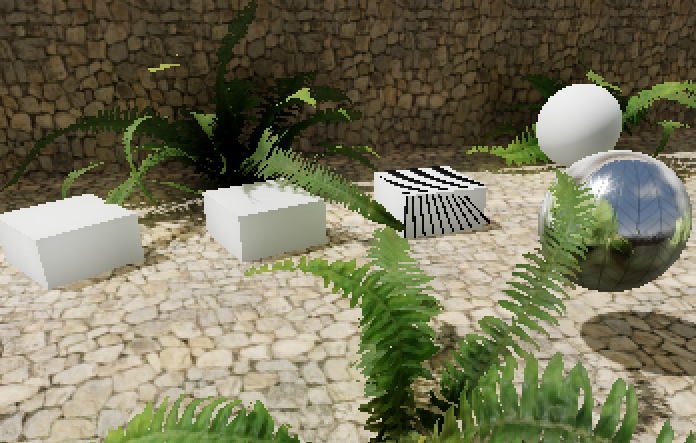
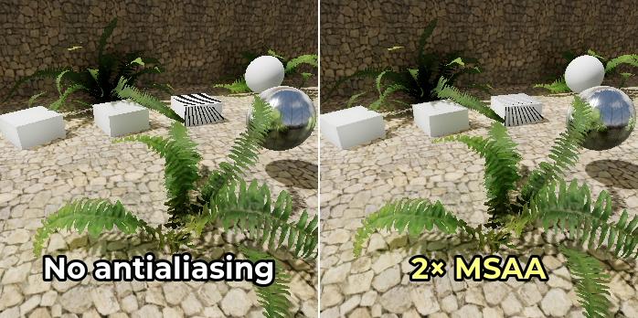
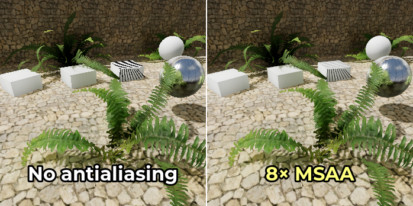
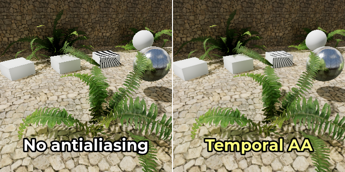
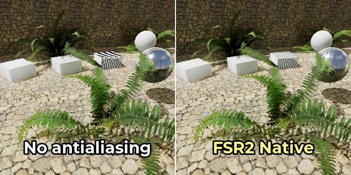
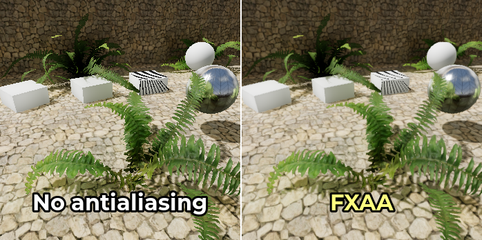
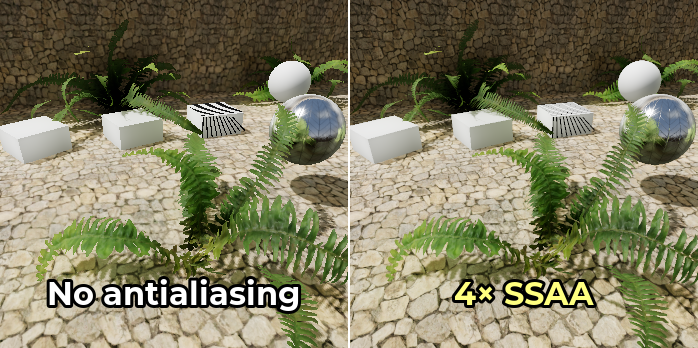

.. _doc_3d_antialiasing:

3D antialiasing
===============

.. Images on this page were generated using the project below
.. (except for `antialiasing_none_scaled.webp`):
.. https://github.com/Calinou/godot-antialiasing-comparison

.. seealso::

    Godot also supports antialiasing in 2D rendering. This is covered on the
    :ref:`doc_2d_antialiasing` page.

Introduction
------------

Due to their limited resolution, scenes rendered in 3D can exhibit aliasing
artifacts. These artifacts commonly manifest as a "staircase" effect on surface
edges (edge aliasing) and as flickering and/or sparkles on reflective surfaces
(specular aliasing).

In the example below, you can notice how
edges have a blocky appearance. The vegetation is also flickering in and out,
and thin lines on top of the box have almost disappeared:

   Image is scaled by 2× with nearest-neighbor filtering to make aliasing more noticeable.

To combat this, various antialiasing techniques can be used in Godot. These are
detailed below.

.. seealso::

    You can compare antialiasing algorithms in action using the
    `3D Antialiasing demo project <https://github.com/godotengine/godot-demo-projects/tree/master/3d/antialiasing>`__.

Multisample antialiasing (MSAA)
-------------------------------

This technique is the "historical" way of dealing with aliasing. MSAA is very
effective on geometry edges (especially at higher levels). MSAA does not
introduce any blurriness whatsoever.

MSAA is available in 3 levels: 2×, 4×, 8×. Higher levels are more effective at
antialiasing edges, but are significantly more demanding. In games with modern
visuals, sticking to 2× or 4× MSAA is highly recommended as 8× MSAA is usually
too demanding.

The downside of MSAA is that it only operates on edges. This is because MSAA
increases the number of *coverage* samples, but not the number of *color*
samples. However, since the number of color samples did not increase, fragment
shaders are still run for each pixel only once. Therefore, MSAA does not reduce
transparency aliasing for materials using the **Alpha Scissor** transparency
mode (1-bit transparency). MSAA is also ineffective on specular aliasing.

To mitigate aliasing on alpha scissor materials,
:ref:`alpha antialiasing <doc_standard_material_3d_alpha_antialiasing>`
(also called *alpha to coverage*) can be enabled on specific materials in the
StandardMaterial3D or ORMMaterial3D properties. Alpha to coverage has a
moderate performance cost, but it's effective at reducing aliasing on
transparent materials without introducing any blurriness.

MSAA can be enabled in the Project Settings by changing the value of the
**Rendering > Anti Aliasing > Quality > MSAA 3D** setting. It's important to change
the value of the **MSAA 3D** setting and not **MSAA 2D**, as these are entirely
separate settings.

Comparison between no antialiasing (left) and various MSAA levels (right).
Note that alpha antialiasing is not used here:

.. _doc_3d_antialiasing_taa:

Temporal antialiasing (TAA)
---------------------------

*This is only available in the Clustered Forward backend, not the Forward Mobile
or Compatibility backends.*

Temporal antialiasing works by *converging* the result of previously rendered
frames into a single, high-quality frame. This is a continuous process that
works by jittering the position of all vertices in the scene every frame. This
jittering is done to capture sub-pixel detail and should be unnoticeable except
in extreme situations.

This technique is commonly used in modern games, as it provides the most
effective form of antialiasing against specular aliasing and other
shader-induced artifacts. TAA also provides full support for transparency
antialiasing.

TAA introduces a small amount of blur when enabled in still scenes, but this
blurring effect becomes more pronounced when the camera is moving. Another
downside of TAA is that it can exhibit *ghosting* artifacts behind moving
objects. Rendering at a higher framerate will allow TAA to converge faster,
therefore making those ghosting artifacts less visible.

Temporal antialiasing can be enabled in the Project Settings by changing the
value of the **Rendering > Anti Aliasing > Quality > Use TAA** setting.

Comparison between no antialiasing (left) and TAA (right):

.. _doc_3d_antialiasing_fsr2:

AMD FidelityFX Super Resolution 2.2 (FSR2)
------------------------------------------

Since Godot 4.2, there is built-in support for
`AMD FidelityFX Super Resolution <https://www.amd.com/en/technologies/fidelityfx-super-resolution>`__
2.2. This is an :ref:`upscaling method <doc_resolution_scaling>`
compatible with all recent GPUs from any vendor. FSR2 is normally designed to
improve performance by lowering the internal 3D rendering resolution,
then upscaling to the output resolution.

However, unlike FSR1, FSR2 also provides temporal antialiasing. This means FSR2
can be used at native resolution for high-quality antialiasing, with the input
resolution being equal to the output resolution. In this situation, enabling
FSR2 will actually *decrease* performance, but it will significantly improve
rendering quality.

Using FSR2 at native resolution is more demanding than using TAA at native
resolution, so its use is only recommended if you have significant GPU headroom.
On the bright side, FSR2 provides better antialiasing coverage with less
blurriness compared to TAA, especially in motion.

Comparison between no antialiasing (left) and FSR2 at native resolution (right):

..  note::

    By default, the **FSR Sharpness** project setting is set to ``0.2`` (higher
    values result in less sharpening). For the purposes of comparison, FSR
    sharpening has been disabled by setting it to ``2.0`` on the above screenshot.

.. _doc_3d_antialiasing_fxaa:

Fast approximate antialiasing (FXAA)
------------------------------------

*This is only available in the Clustered Forward and Forward Mobile backends,
not the Compatibility backend.*

Fast approximate antialiasing is a post-processing antialiasing solution. It is
faster to run than any other antialiasing technique and also supports
antialiasing transparency. However, since it lacks temporal information, it will
not do much against specular aliasing.

This technique is still sometimes used in mobile games. However, on desktop
platforms, FXAA generally fell out of fashion in favor of temporal antialiasing,
which is much more effective against specular aliasing. Nonetheless, exposing FXAA
as an in-game option may still be worthwhile for players with low-end GPUs.

FXAA introduces a moderate amount of blur when enabled (more than TAA when
still, but less than TAA when the camera is moving).

FXAA can be enabled in the Project Settings by changing the
value of the **Rendering > Anti Aliasing > Quality > Screen Space AA** setting to
**FXAA**.

Comparison between no antialiasing (left) and FXAA (right):

Supersample antialiasing (SSAA)
-------------------------------

*This is only available in the Clustered Forward and Forward Mobile backends,
not the Compatibility backend.*

Supersampling provides the highest quality of antialiasing possible, but it's
also the most expensive. It works by shading every pixel in the scene multiple
times. This allows SSAA to antialias edges, transparency *and* specular aliasing
at the same time, without introducing potential ghosting artifacts.

The downside of SSAA is its *extremely* high cost. This cost generally makes
SSAA difficult to use for game purposes, but you may still find supersampling
useful for :ref:`offline rendering <doc_creating_movies>`.

Supersample antialiasing is performed by increasing the **Rendering > Scaling 3D
> Scale** advanced project setting above ``1.0`` while ensuring
**Rendering > Scaling 3D > Mode** is set to **Bilinear** (the default).
Since the scale factor is defined per-axis, a scale factor of ``1.5`` will result
in 2.25× SSAA while a scale factor of ``2.0`` will result in 4× SSAA. Since Godot
uses the hardware's own bilinear filtering to perform the downsampling, the result
will look crisper at integer scale factors (namely, ``2.0``).

Comparison between no antialiasing (left) and various SSAA levels (right):

.. warning::

    Supersampling also has high video RAM requirements, since it needs to render
    in the target resolution then *downscale* to the window size. For example,
    displaying a project in 3840×2160 (4K resolution) with 4× SSAA will require
    rendering the scene in 7680×4320 (8K resolution), which is 4 times more
    pixels.

    If you are using a high window size such as 4K, you may find that increasing
    the resolution scale past a certain value will cause a heavy slowdown (or
    even a crash) due to running out of VRAM.

Screen-space roughness limiter
------------------------------

*This is only available in the Clustered Forward and Forward Mobile backends,
not the Compatibility backend.*

This is not an edge antialiasing method, but it is a way of reducing specular
aliasing in 3D.

The screen-space roughness limiter works best on detailed geometry. While it has
an effect on roughness map rendering itself, its impact is limited there.

The screen-space roughness limiter is enabled by default; it doesn't require
any manual setup. It has a small performance impact, so consider disabling it
if your project isn't affected by specular aliasing much.

Texture roughness limiter on import
-----------------------------------

Like the screen-space roughness limiter, this is not an edge antialiasing
method, but it is a way of reducing specular aliasing in 3D.

Roughness limiting on import works by specifying a normal map to use as a guide
for limiting roughness. This is done by selecting the roughness map in the
FileSystem dock, then going to the Import dock and setting **Roughness > Mode**
to the color channel the roughness map is stored in (typically **Green**), then
setting the path to the material's normal map. Remember to click **Reimport**
at the bottom of the Import dock after setting the path to the normal map.

Since this processing occurs purely on import, it has no performance cost
whatsoever. However, its visual impact is limited. Limiting roughness on import
only helps reduce specular aliasing within textures, not the aliasing that
occurs on geometry edges on detailed meshes.

Which antialiasing technique should I use?
------------------------------------------

**There is no "one size fits all" antialiasing technique.** Since antialiasing is
often demanding on the GPU or can introduce unwanted blurriness, you'll want to
add a setting to allow players to disable antialiasing.

For projects with a photorealistic art direction, TAA is generally the most
suitable option. While TAA can introduce ghosting artifacts, there is no other
technique that combats specular aliasing as well as TAA does. The screen-space
roughness limiter helps a little, but is far less effective against specular
aliasing overall. If you have spare GPU power, you can use FSR2 at native
resolution for a better-looking form of temporal antialiasing compared to
standard TAA.

For projects with a low amount of reflective surfaces (such as a cartoon
artstyle), MSAA can work well. MSAA is also a good option if avoiding blurriness
and temporal artifacts is important, such as in competitive games.

When targeting low-end platforms such as mobile or integrated graphics, FXAA is
usually the only viable option. 2× MSAA may be usable in some circumstances,
but higher MSAA levels are unlikely to run smoothly on mobile GPUs.

Godot allows using multiple antialiasing techniques at the same time. This is
usually unnecessary, but it can provide better visuals on high-end GPUs or for
:ref:`non-real-time rendering <doc_creating_movies>`. For example, to make
moving edges look better when TAA is enabled, you can also enable MSAA at the
same time.
