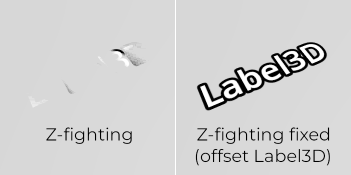
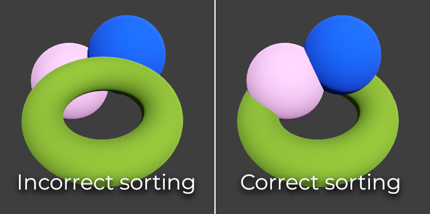

.. _doc_3d_rendering_limitations:

3D rendering limitations
========================

Introduction
------------

Due to their focus on performance, real-time rendering engines have many
limitations. Godot's renderer is no exception. To work effectively with those
limitations, you need to understand them.

Texture size limits
-------------------

On desktops and laptops, textures larger than 8192×8192 may not be supported on
older devices. You can check your target GPU's limitations on
`GPUinfo.org <https://www.gpuinfo.org/>`__.

Mobile GPUs are typically limited to 4096×4096 textures. Also, some mobile GPUs
don't support repeating non-power-of-two-sized textures. Therefore, if you want
your texture to display correctly on all platforms, you should avoid using
textures larger than 4096×4096 and use a power of two size if the texture needs
to repeat.

To limit the size of a specific texture that may be too large to render, you can
set the **Process > Size Limit** import option to a value greater than ``0``.
This will reduce the texture's dimensions on import (preserving aspect ratio)
without affecting the source file.

.. _doc_3d_rendering_limitations_color_banding:

Color banding
-------------

When using the Forward+ or Forward Mobile rendering methods, Godot's 3D engine
renders internally in HDR. However, the rendering output will be tonemapped to a
low dynamic range so it can be displayed on the screen. This can result in
visible banding, especially when using untextured materials. For performance
reasons, color precision is also lower when using the Forward Mobile rendering
method compared to Forward+.

When using the Compatibility rendering method, HDR is not used and the color
precision is the lowest of all rendering methods. This also applies to 2D
rendering, where banding may be visible when using smooth gradient textures.

There are two main ways to alleviate banding:

- If using the Forward+ or Forward Mobile rendering methods, enable **Use
  Debanding** in the advanced Project Settings. This applies a fullscreen debanding
  shader as a post-processing effect and is very cheap.
- Alternatively, bake some noise into your textures. This is mainly effective in
  2D, e.g. for vignetting effects. In 3D, you can also use a `custom debanding
  shader <https://github.com/fractilegames/godot-gles2-debanding-material>`__ to
  be applied on your *materials*. This technique works even if your project is
  rendered with low color precision, which means it will work when using the
  Mobile and Compatibility rendering methods.

.. figure:: img/3d_rendering_limitations_banding.webp
   :align: center
   :alt: Color banding comparison (contrast increased for more visibility)

   Color banding comparison (contrast increased for more visibility)

.. seealso::

    See `Banding in Games: A Noisy Rant (PDF) <https://loopit.dk/banding_in_games.pdf>`__
    for more details about banding and ways to combat it.

Depth buffer precision
----------------------

To sort objects in 3D space, rendering engines rely on a *depth buffer* (also
called *Z-buffer*). This buffer has a finite precision: 24-bit on desktop
platforms, sometimes 16-bit on mobile platforms (for performance reasons). If
two different objects end up on the same buffer value, then Z-fighting will
occur. This will materialize as textures flickering back and forth as the camera
moves or rotates.

To make the depth buffer more precise over the rendered area, you should
*increase* the Camera node's **Near** property. However, be careful: if you set
it too high, players will be able to see through nearby geometry. You should
also *decrease* the Camera node's **Far** property to the lowest permissible value
for your use case, though keep in mind it won't impact precision as much as the
**Near** property.

If you only need high precision when the player can see far away, you could
change it dynamically based on the game conditions. For instance, if the player
enters an airplane, the **Near** property can be temporarily increased to avoid
Z-fighting in the distance. It can then be decreased once the player leaves the
airplane.

Depending on the scene and viewing conditions, you may also be able to move the
Z-fighting objects further apart without the difference being visible to the
player.

   Z-fighting comparison (before and after tweaking the scene by offsetting the Label3D away from the floor)

.. _doc_3d_rendering_limitations_transparency_sorting:

Transparency sorting
--------------------

In Godot, transparent materials are drawn after opaque materials. Transparent
objects are sorted back to front before being drawn based on the Node3D's
position, not the vertex position in world space. Due to this, overlapping
objects may often be sorted out of order. To fix improperly sorted objects,
tweak the material's
:ref:`Render Priority <class_Material_property_render_priority>`
property or the node's
:ref:`Sorting Offset <class_VisualInstance3D_property_sorting_offset>`.
Render Priority will force specific materials to appear in front of or behind
other transparent materials, while Sorting Offset will move the object
forward or backward for the purpose of sorting. Even then, these may not
always be sufficient.

Some rendering engines feature *order-independent transparency* techniques to
alleviate this, but this is costly on the GPU. Godot currently doesn't provide
this feature. There are still several ways to avoid this problem:

- Only make materials transparent if you actually need it. If a material only
  has a small transparent part, consider splitting it into a separate material.
  This will allow the opaque part to cast shadows and will also improve performance.

- If your texture mostly has fully opaque and fully transparent areas, you can
  use alpha testing instead of alpha blending. This transparency mode is faster
  to render and doesn't suffer from transparency issues. Enable **Transparency >
  Transparency** to **Alpha Scissor** in StandardMaterial3D, and adjust
  **Transparency > Alpha Scissor Threshold** accordingly if needed. Note that
  MSAA will not antialias the texture's edges unless alpha antialiasing is
  enabled in the material's properties. However, FXAA, TAA and supersampling
  will be able to antialias the texture's edges regardless of whether alpha
  antialiasing is enabled on the material.

- If you need to render semi-transparent areas of the texture, alpha scissor
  isn't suitable. Instead, setting the StandardMaterial3D's
  **Transparency > Transparency** property to **Depth Pre-Pass** can sometimes
  work (at a performance cost). You can also try the **Alpha Hash** mode.

- If you want a material to fade with distance, use the StandardMaterial3D
  distance fade mode **Pixel Dither** or **Object Dither** instead of
  **Pixel Alpha**. This will make the material opaque, which also speeds up rendering.

   Transparency sorting comparison (alpha-blended materials on the left, alpha scissor materials on the right)

Multi-sample antialiasing
-------------------------

.. seealso::

    Antialiasing is explained in detail on the :ref:`doc_3d_antialiasing` page.

Multi-sample antialiasing (MSAA) takes multiple *coverage* samples at the edges
of polygons when rendering objects. It does not increase the number of *color*
samples used to render a scene. Here's what this means in practice:

- Edges of meshes will be smoothed out nicely (as well as supersampling would).
- Transparent materials that use *alpha testing* (1-bit transparency) won't be smoothed out.
- Specular aliasing ("sparkles" that appear on reflective surfaces) won't be reduced.

There are several ways to work around this limitation depending on your performance budget:

- To make specular aliasing less noticeable, open the Project Settings and enable
  **Rendering > Quality > Screen Space Filters > Screen Space Roughness Limiter**.
  This filter has a moderate cost on performance, so it should only be enabled if
  you actually need it.

- Enable fast approximate antialiasing (FXAA) in addition to (or instead of)
  MSAA. Since FXAA is a screen-space antialiasing method, it will smooth out
  anything. As a downside, FXAA also makes the scene appear blurrier, especially
  at resolutions below 1440p. FXAA also lacks temporal information, which means
  its impact on specular aliasing is limited.

- Enable temporal antialiasing (TAA) in addition to (or instead of) MSAA. Since
  TAA is a screen-space antialiasing method, it will smooth out anything. As a
  downside, TAA also makes the scene appear blurrier, especially at resolutions
  below 1440p. TAA provides superior quality compared to FXAA and can
  effectively combat specular aliasing. However, TAA has a greater performance
  cost compared to FXAA, and TAA can introduce ghosting artifacts with fast
  movement.

- Render the scene at a higher resolution by increasing the **Scaling 3D >
  Scale** project setting above ``1.0``. This technique is called supersample
  antialiasing (SSAA) and is very slow. Its use is generally only recommended
  for offline rendering.
