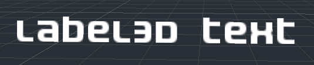
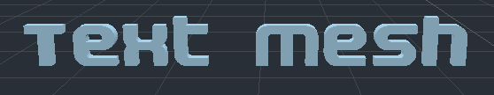
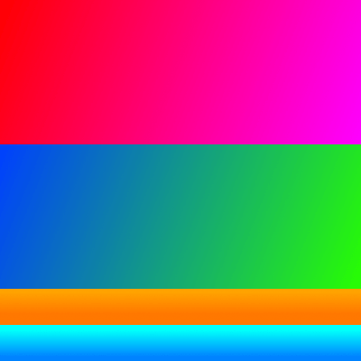
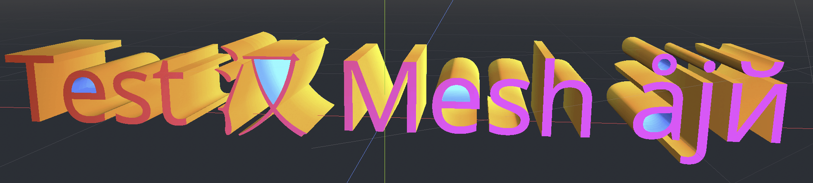

.. _doc_3d_text:

3D text
=======

Introduction
------------

In a project, there may be times when text needs to be created as part of a 3D
scene and not just in the HUD. Godot provides 2 methods to do this: the
Label3D node and the TextMesh *resource* for a MeshInstance3D node.

Additionally, Godot makes it possible to position Control nodes according to a
3D point's position on the camera. This can be used as an alternative to "true"
3D text in situations where Label3D and TextMesh aren't flexible enough.

.. seealso::

    You can see 3D text in action using the
    `3D Labels and Texts demo project <https://github.com/godotengine/godot-demo-projects/tree/master/3d/labels_and_texts>`__.

    This page does **not** cover how to display a GUI scene within a 3D
    environment. For information on how to achieve that, see the
    `GUI in 3D <https://github.com/godotengine/godot-demo-projects/tree/master/viewport/gui_in_3d>`__
    demo project.

Label3D
-------

Label3D behaves like a Label node, but in 3D space. Unlike the Label node, this
Label3D node does **not** inherit properties of a GUI theme. However, its look
remains customizable and uses the same font subresource as Control nodes
(including support for :abbr:`MSDF (Multi-channel Signed Distance Font)` font
rendering).

Advantages
^^^^^^^^^^

- Label3D is faster to generate than TextMesh. While both use a caching
  mechanism to only render new glyphs once, Label3D will still be faster to
  (re)generate, especially for long text. This can avoid stuttering during
  gameplay on low-end CPUs or mobile.
- Label3D can use bitmap fonts and dynamic fonts (with and without
  :abbr:`MSDF (Multi-channel Signed Distance Font)` or mipmaps). This makes it
  more flexible on that aspect compared to TextMesh, especially for rendering
  fonts with self-intersecting outlines.

.. seealso::

    See :ref:`doc_gui_using_fonts` for guidelines on configuring font imports.

Limitations
^^^^^^^^^^^

By default, Label3D has limited interaction with a 3D environment. It can be
occluded by geometry and lit by light sources if the **Shaded** flag is enabled.
However, it will not cast shadows even if **Cast Shadow** is set to **On** in
the Label3D's GeometryInstance3D properties. This is because the node internally
generates a quad mesh (one glyph per quad) with transparent textures and has the
same limitations as Sprite3D. Transparency sorting issues can also become apparent
when several Label3Ds overlap, especially if they have outlines.

This can be mitigated by setting the Label3D's transparency mode to **Alpha
Cut**, at the cost of less smooth text rendering. The **Opaque Pre-Pass**
transparency mode can preserve text smoothness while allowing the Label3D to
cast shadows, but some transparency sorting issues will remain.

See :ref:`Transparency sorting <doc_3d_rendering_limitations_transparency_sorting>`
section in the 3D rendering limitations page for more information.

TextMesh
--------

The TextMesh resource has similarities to Label3D. They both display text in a
3D scene, and will use the same font subresource. However, instead of generating
transparent quads, TextMesh generates 3D geometry that represents the glyphs'
contours and has the properties of a mesh. As a result, a TextMesh is shaded by
default and automatically casts shadows onto the environment. A TextMesh can
also have a material applied to it (including custom shaders).

Here is an example of a texture and how it's applied to the mesh. You can use
the texture below as a reference for the generated mesh's UV map:

Advantages
^^^^^^^^^^

TextMesh has a few advantages over Label3D:

- TextMesh can use a texture to modify text color on a per-side basis.
- TextMesh geometry can have actual depth to it, giving glyphs a 3D look.
- TextMesh can use custom shaders, unlike Label3D.

Limitations
^^^^^^^^^^^

There are some limitations to TextMesh:

- No built-in outline support, unlike Label3D. This can be simulated using custom
  shaders though.
- Only dynamic fonts are supported (``.ttf``, ``.otf``, ``.woff``, ``.woff2``).
  Bitmap fonts in the ``.fnt`` or ``.font`` formats are **not** supported.
- Fonts with self-intersecting outlines will not render correctly.
  If you notice rendering issues on fonts downloaded from websites such as
  Google Fonts, try downloading the font from the font author's official
  website instead.

Projected Label node (or any other Control)
-------------------------------------------

There is a last solution that is more complex to set up, but provides the most
flexibility: projecting a 2D node onto 3D space. This can be achieved using the
return value of :ref:`unproject_position<class_Camera3D_method_unproject_position>`
method on a Camera3D node in a script's ``_process()`` function. This return value
should then be used to set the ``position`` property of a Control node.

See the `3D waypoints <https://github.com/godotengine/godot-demo-projects/tree/master/3d/waypoints>`__
demo for an example of this.

Advantages
^^^^^^^^^^

- Any Control node can be used, including Label, RichTextLabel or even nodes such
  as Button. This allows for powerful formatting and GUI interaction.
- The script-based approach allows for complete freedom in positioning.
  For example, this makes it considerably easier to pin Controls to the screen's
  edges when they go off-screen (for in-game 3D markers).
- Control theming is obeyed. This allows for easier customization that globally
  applies to the project.

Limitations
^^^^^^^^^^^

- Projected Controls cannot be occluded by 3D geometry in any way. You can use a
  RayCast to fully hide the control if its target position is occluded by a
  collider, but this doesn't allow for partially hiding the control behind a
  wall.
- Changing text size depending on distance by adjusting the Control's ``scale``
  property is possible, but it needs to be done manually. Label3D and TextMesh
  automatically take care of this, at the cost of less flexibility (can't set a
  minimum/maximum text size in pixels).
- Handling resolution and aspect ratio changes must be taken into account in the
  script, which can be challenging.

Should I use Label3D, TextMesh or a projected Control?
------------------------------------------------------

In most scenarios, Label3D is recommended as it's easier to set up and provides
higher rendering quality (especially if 3D antialiasing is disabled).

For advanced use cases, TextMesh is more flexible as it allows styling the text
with custom shaders. Custom shaders allow for modifying the final geometry, such
as curving the text along a surface. Since the text is actual 3D geometry, the
text can optionally have depth to it and can also contribute to global
illumination.

If you need features such as BBCode or Control theming support, then using a projected
RichTextLabel node is the only way to go.
