.. _doc_baked_lightmaps:

Baked lightmaps
===============

Introduction
------------

Baked lightmaps are an alternative workflow for adding indirect (or baked)
lighting to a scene. Unlike the :ref:`doc_gi_probes` approach,
baked lightmaps work fine on low-end PCs and mobile devices, as they consume
almost no resources at run-time.

Unlike ``GIProbe``\ s, Baked Lightmaps are completely static. Once baked, they can't be
modified at all. They also don't provide the scene with
reflections, so using :ref:`doc_reflection_probes` together with it on interiors
(or using a Sky on exteriors) is a requirement to get good quality.

As they are baked, they have fewer problems than ``GIProbe`` regarding light bleeding,
and indirect light can look better if using Raytrace
mode on high quality setting (but baking can take a while).

In the end, deciding which indirect lighting approach is better depends on your
use case. In general, GIProbe looks better and is much
easier to set up. For mobile or low-end compatibility, though, Baked Lightmaps
are your only choice.

Visual comparison
-----------------

Here are some comparisons of how Baked Lightmaps vs. GIProbe look. Notice that
lightmaps are more accurate, but also suffer from the fact
that lighting is on an unwrapped texture, so transitions and resolution may not
be that good. GIProbe looks less accurate (as it's an approximation), but
smoother overall.

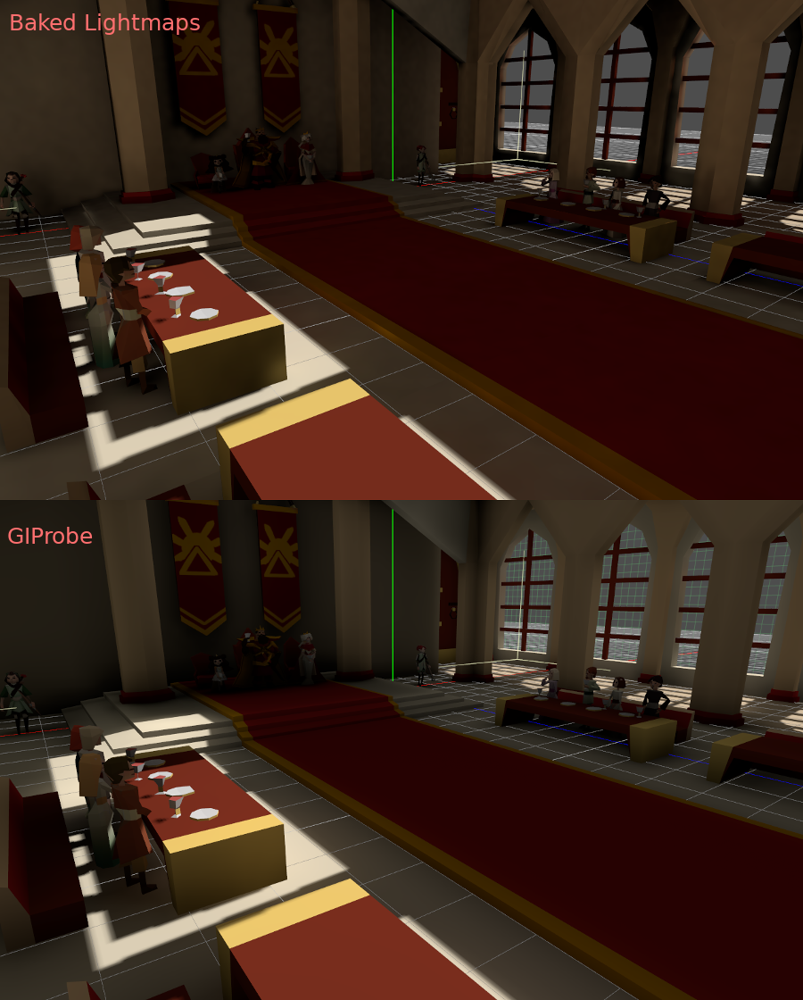

Setting up
----------

First of all, before the lightmapper can do anything, the objects to be baked need
an UV2 layer and a texture size. An UV2 layer is a set of secondary texture coordinates
that ensures any face in the object has its own place in the UV map. Faces must
not share pixels in the texture.

There are a few ways to ensure your object has a unique UV2 layer and texture size:

Unwrap from your 3D DCC
~~~~~~~~~~~~~~~~~~~~~~~

One option is to do it from your favorite 3D app. This approach is generally
not recommended, but it's explained first so that you know it exists.
The main advantage is that, on complex objects that you may want to re-import a
lot, the texture generation process can be quite costly within Godot,
so having it unwrapped before import can be faster.

Simply do an unwrap on the second UV2 layer.

.. image:: img/baked_light_blender.png

And import normally. Remember you will need to set the texture size on the mesh
after import.

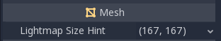

If you use external meshes on import, the size will be kept.
Be wary that most unwrappers in 3D DCCs are not quality oriented, as they are
meant to work quickly. You will mostly need to use seams or other techniques to
create better unwrapping.

Unwrap from within Godot
~~~~~~~~~~~~~~~~~~~~~~~~

Godot has an option to unwrap meshes and visualize the UV channels.
It can be found in the Mesh menu:

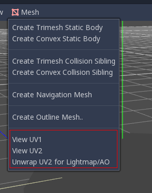

This will generate a second set of UV2 coordinates which can be used for baking,
and it will also set the texture size automatically.

Unwrap on scene import
~~~~~~~~~~~~~~~~~~~~~~

This is probably the best approach overall. The only downside is that, on large
models, unwrapping can take a while on import.
Just select the imported scene in the filesystem dock, then go to the Import tab.
There, the following option can be modified:

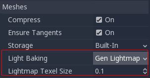

The **Light Baking** mode needs to be set to **"Gen Lightmaps"**. A texel size
in world units must also be provided, as this will determine the
final size of the lightmap texture (and, in consequence, the UV padding in the map).

The effect of setting this option is that all meshes within the scene will have
their UV2 maps properly generated.

As a word of warning: When reusing a mesh within a scene, keep in mind that UVs
will be generated for the first instance found. If the mesh is re-used with different
scales (and the scales are wildly different, more than half or twice), this will
result in inefficient lightmaps. Just don't reuse a source mesh at different scales
if you are planning to use lightmapping.

Checking UV2
~~~~~~~~~~~~

In the mesh menu mentioned before, the UV2 texture coordinates can be visualized.
Make sure, if something is failing, to check that the meshes have these UV2 coordinates:

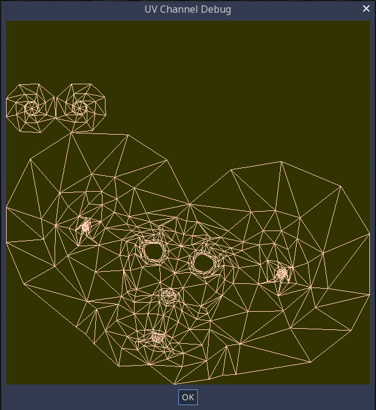

Setting up the scene
--------------------

Before anything is done, a **BakedLightmap** Node needs to be added to a scene.
This will enable light baking on all nodes (and sub-nodes) in that scene, even
on instanced scenes.

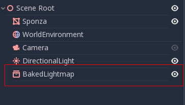

A sub-scene can be instanced several times, as this is supported by the baker, and
each will be assigned a lightmap of its own (just make sure to respect the rule
about scaling mentioned before):

Configure bounds
~~~~~~~~~~~~~~~~

Lightmap needs an approximate volume of the area affected because it uses it to
transfer light to dynamic objects inside it (more on that later). Just
cover the scene with the volume as you do with ``GIProbe``:

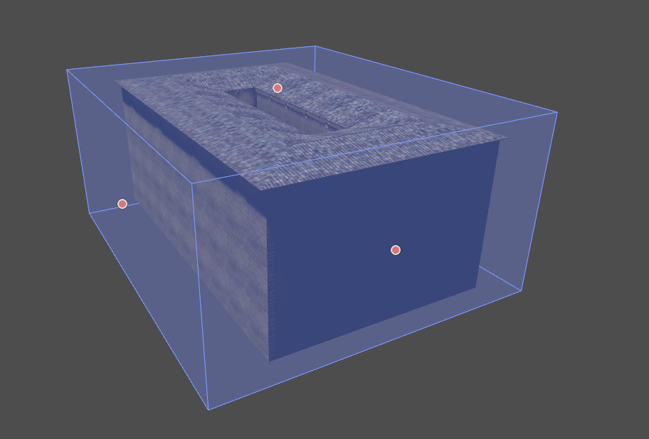

Setting up meshes
~~~~~~~~~~~~~~~~~

For a **MeshInstance** node to take part in the baking process, it needs to have
the "Use in Baked Light" property enabled.

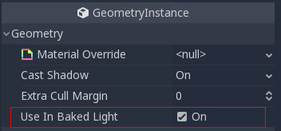

When auto-generating lightmaps on scene import, this is enabled automatically.

Setting up lights
~~~~~~~~~~~~~~~~~

Lights are baked with indirect light by default. This means that shadowmapping
and lighting are still dynamic and affect moving objects, but light bounces from
that light will be baked.

Lights can be disabled (no bake) or be fully baked (direct and indirect). This
can be controlled from the **Bake Mode** menu in lights:

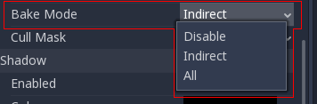

The modes are:

- **Disabled:** Light is ignored in baking. Keep in mind hiding a light will have no effect for baking, so this must be used instead.
- **Indirect:** This is the default mode. Only indirect lighting will be baked.
- **All:** Both indirect and direct lighting will be baked. If you don't want the light to appear twice (dynamically and statically), simply hide it.

Baking quality
~~~~~~~~~~~~~~

``BakedLightmap`` uses, for simplicity, a voxelized version of the scene to compute
lighting. Voxel size can be adjusted with the **Bake Subdiv** parameter.
More subdivision results in more detail, but also takes more time to bake.

In general, the defaults are good enough. There is also a **Capture Subdivision**
(that must always be equal to or less than the main subdivision), which is used
for capturing light in dynamic objects (more on that later). Its default value
is also good enough for most cases.

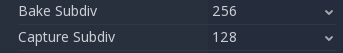

Besides the capture size, quality can be modified by setting the **Bake Mode**.
Two modes of capturing indirect are provided:

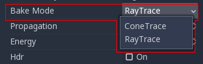

- **Voxel Cone**: Trace: Is the default one; it's less precise, but faster. Looks similar to (but slightly better than) ``GIProbe``.
- **Ray Tracing**: This method is more precise, but can take considerably longer to bake. If used in low or medium quality, some scenes may produce grain.

Baking
------

To begin the bake process, just push the big **Bake Lightmaps** button on top
when selecting the ``BakedLightmap`` node:

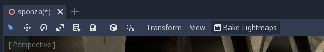

This can take from seconds to minutes (or hours) depending on scene size, bake
method and quality selected.

Configuring bake
~~~~~~~~~~~~~~~~

Several more options are present for baking:

- **Bake Subdiv**: The Godot lightmapper uses a grid to transfer light information around; the default value is fine and should work for most cases. Increase it in case you want better lighting on small details or your scene is large.
- **Capture Subdiv**: This is the grid used for real-time capture information (lighting dynamic objects). Default value is generally OK, it's usually smaller than Bake Subdiv and can't be larger than it.
- **Bake Quality**: Three bake quality modes are provided, Low, Medium and High. Higher quality takes more time.
- **Bake Mode**: The baker can use two different techniques: *Voxel Cone Tracing* (fast, but approximate), or *RayTracing* (slow, but accurate).
- **Propagation**: Used for the *Voxel Cone Trace* mode. Works just like in ``GIProbe``.
- **HDR**: If disabled, lightmaps are smaller, but can't capture any light over white (1.0).
- **Image Path**: Where lightmaps will be saved. By default, on the same directory as the scene ("."), but can be tweaked.
- **Extents**: Size of the area affected (can be edited visually)
- **Light Data**: Contains the light baked data after baking. Textures are saved to disk, but this also contains the capture data for dynamic objects, which can be a bit heavy. If you are using .tscn formats (instead of .scn), you can save it to disk.

Dynamic objects
---------------

In other engines or lightmapper implementations, you are required to manually
place small objects called "lightprobes" all around the level to generate *capture*
data. This is used to, then, transfer the light to dynamic objects that move
around the scene.

However, this implementation of lightmapping uses a different method. The process is
automatic, so you don't have to do anything. Just move your objects around, and
they will be lit accordingly. Of course, you have to make sure you set up your
scene bounds accordingly or it won't work.

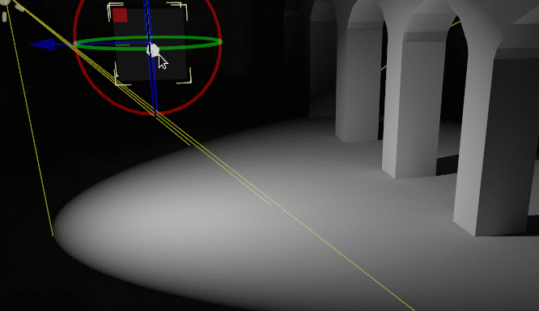
