.. _doc_csg_tools:

CSG
===

CSG stands for "Constructive Solid Geometry", and is a tool to combine basic shapes or custom meshes to create more complex shapes. In 3D modelling software, CSG is mostly known as "Boolean Operators".

The aim of CSG in Godot is for it to be used in level prototyping. This technique allows users to create simple versions of most common shapes by combining primitives. Interior environments can be created by using inverted primitives.

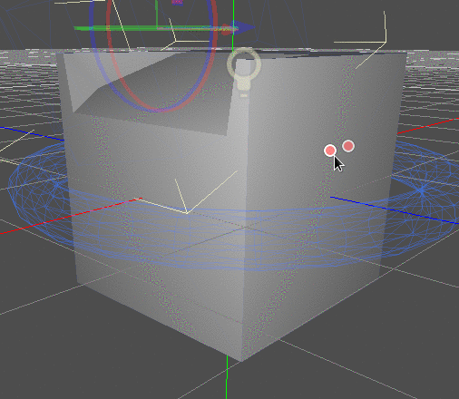

Introduction to CSG nodes
-------------------------

Like other features of Godot, CSG is supported in the form of nodes; these are the CSG nodes:

- :ref:`CSGBox <class_CSGBox>`
- :ref:`CSGCylinder <class_CSGCylinder>` (Also supports cone)
- :ref:`CSGSphere <class_CSGSphere>`
- :ref:`CSGTorus <class_CSGTorus>`
- :ref:`CSGPolygon <class_CSGPolygon>`
- :ref:`CSGMesh <class_CSGMesh>`
- :ref:`CSGCombiner <class_CSGcombiner>`

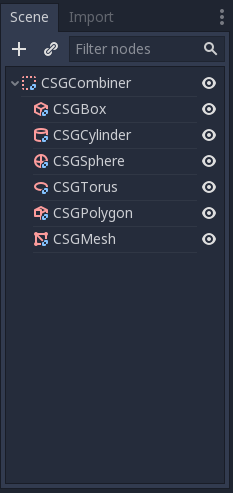

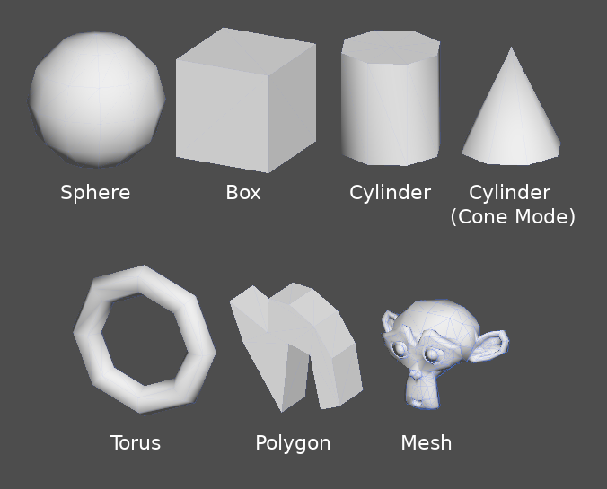

CSG tools features
~~~~~~~~~~~~~~~~~~

Every CSG node supports 3 kinds of boolean operations:

- Union: Geometry of both primitives is merged, intersecting geometry is removed.
- Intersection: Only intersecting geometry remains, the rest is removed.
- Subtraction: The second shape is subtracted from the first, leaving a dent with its shape.

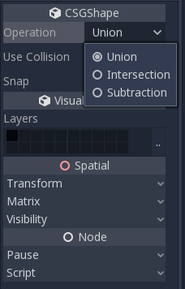

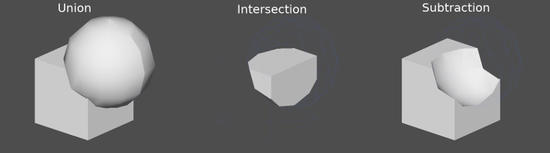

CSGPolygon
~~~~~~~~~~

The :ref:`CSGPolygon <class_CSGPolygon>` node extrude along a Polygon drawn in 2D (in X,Y coordinates) in the following ways:

- Depth: Extruded back a given amount.
- Spin: Extruded while spinning around it's origin.
- Path: Extruded along a Path node. This operation is commonly called lofting.

.. image:: img/csg_poly_mode.png

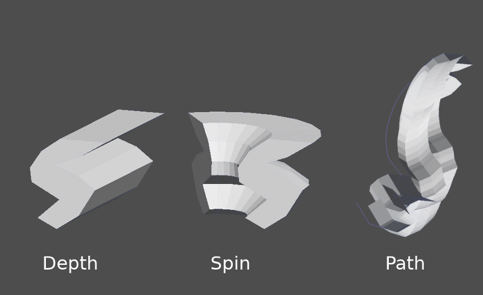

.. note:: The ``Path`` mode must be provided with a :ref:`Path <class_Path>` node to work. In the ``Path`` node, draw the path and the polygon in ``CSGPolygon`` will extrude along the given path.

Custom meshes
~~~~~~~~~~~~~

Any mesh can be used for :ref:`CSGMesh <class_CSGMesh>`; the mesh can be modelled in other software and imported into Godot. Multiple materials are supported. There are some restrictions for geometry:

- It must be closed
- It must not self-intersect
- It must not contain internal faces
- Every edge must connect to only two other faces

.. image:: img/csg_custom_mesh.png

CSGCombiner
~~~~~~~~~~~
The :ref:`CSGCombiner <class_CSGCombiner>` node is an empty shape used for organization. It will only combine children nodes.

Process order
~~~~~~~~~~~~~

Every CSG node will first process its children nodes and their operations: union, intersection or subtraction, in tree order, and apply them to itself one after the other.

.. note:: A note on performance : Make sure CSG geometry remains relatively simple, as complex meshes can take a while to process. If adding objects together (such as table and room objects), please create them as separate CSG trees. Forcing too many objects in a single tree will eventually start affecting performance. Only use binary operations where you actually need them.

Prototyping a level
-------------------

We will prototype a room to practice the use of CSG tools.

.. tip:: Working in ``Orthogonal`` projection gives a better view when combining the CSG shapes.

Our level will contain these objects:

1. A room
2. A bed
3. A lamp
4. A desk
5. A bookshelf

Create a scene with a Spatial node as root node.

.. tip:: The default lighting of the environment cannot provide clear shading at some angles; display in ``overdraw`` mode or add a direction light to help you see clearly.

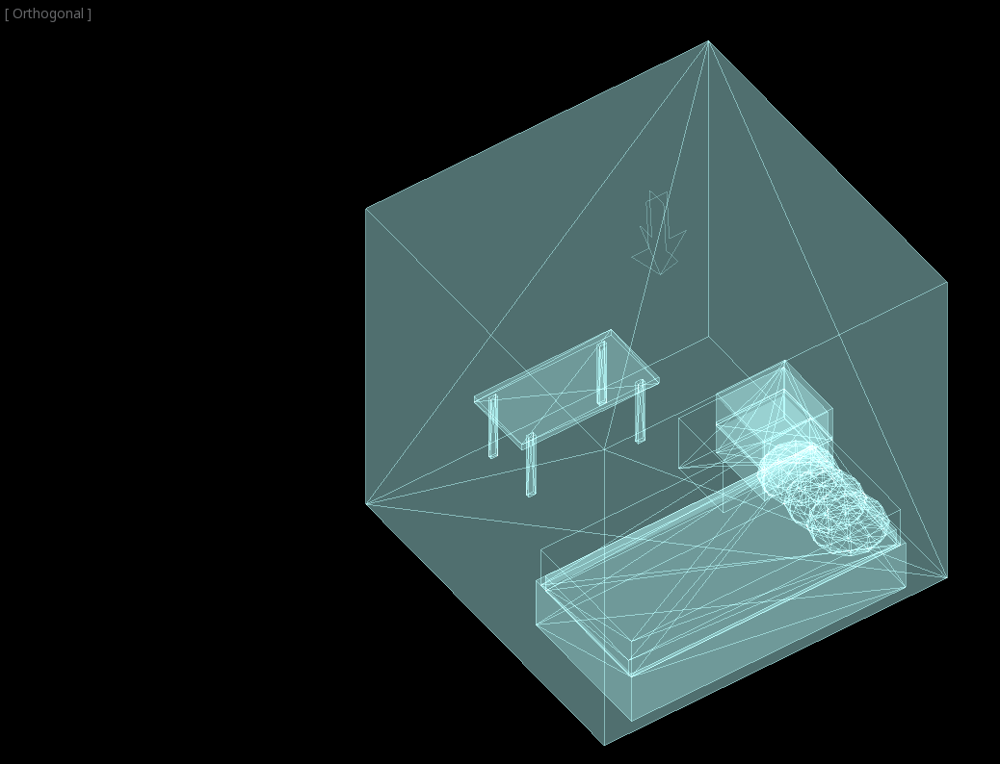

Then, create a CSGBox and name it room, enable ``Invert Faces`` and change the dimensions of your room.

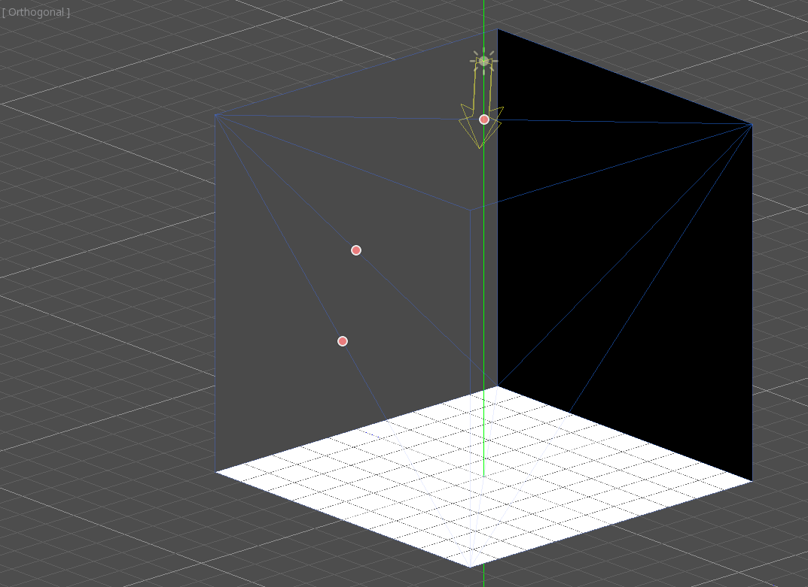

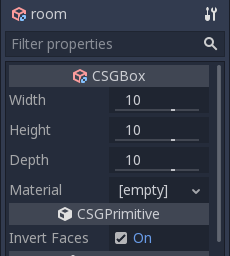

Next, create a CSGCombiner and name it ``desk``.

A desk has one surface and 4 legs.

Create 1 ``CSGBox`` children node in ``union`` mode for the surface and adjust the dimensions.

Create 4 ``CSGBox`` children nodes in ``union`` mode for the legs and adjust the dimensions.

Adjust their placement to resemble a desk.

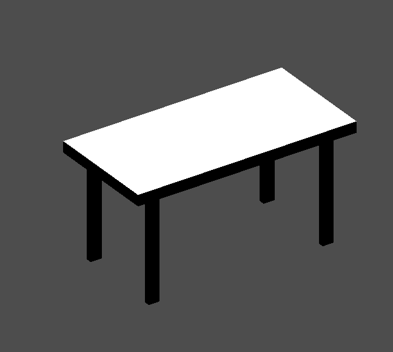

.. note:: CSG nodes inside a ``CSGCombiner`` will only process their operation within the combiner, therefore ``CSGCombiners`` are used to organize the CSG nodes. 

Create a ``CSGCombiner`` and name it ``bed``.

Our bed consists of 3 parts: the bed, the mattress, and a pillow.

Create a ``CSGBox`` and adjust its dimension for the bed. Create another ``CSGBox`` and adjust its dimension for the mattress.

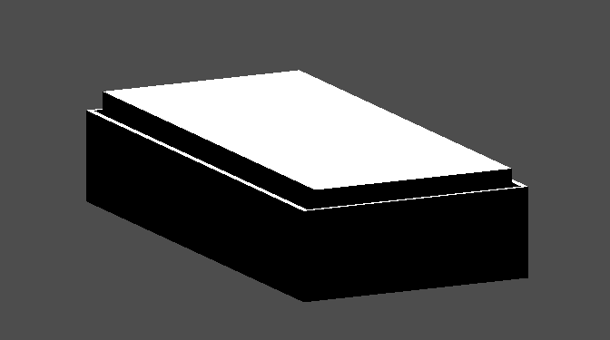

We will create another ``CSGCombiner``, named ``pillow``, as the child of  ``bed``. The scene tree should look like this:

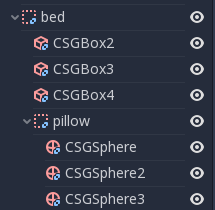

We will combine 3 ``CSGshpere`` in ``union`` mode to form a pillow. Scale the y-axis of the spheres and enable ``smooth faces``.

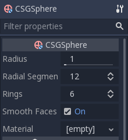

Select the `pillow` node and switch the mode to ``subtraction``; the combined spheres will cut a hole into the mattress.

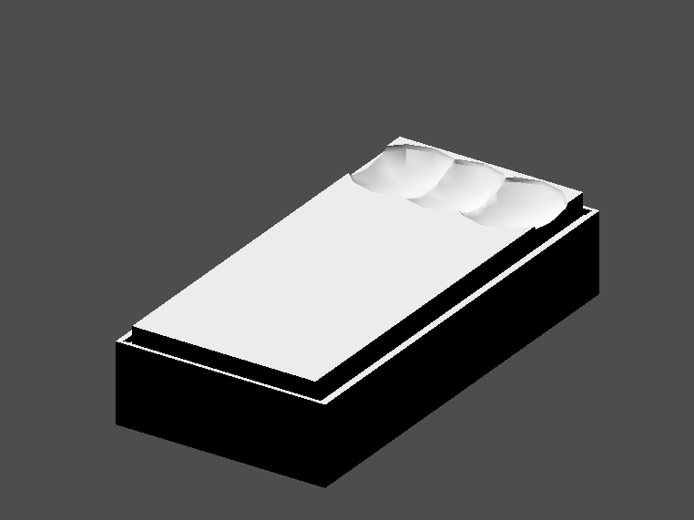

Try to re-parent the ``pillow`` node to the root ``Spatial`` node; the hole will disappear.

.. note:: This is to illustrate the effect of CSG process order. Since the root node is not a CSG node, the ``CSGCombiner`` nodes are the end of the operations; this shows the use of ``CSGCombiner`` to organize the CSG scene. 

Undo the re-parent after observing the effect.

The bed you built should look like this:

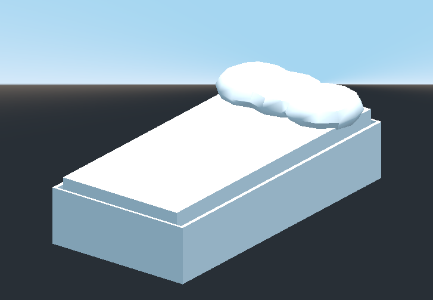

Create a ``CSGCombiner`` and name it ``lamp``.

A lamp consists of 3 parts: the stand, the pole, and the lampshade.

Create a ``CSGCylinder``, enable the ``cone`` option and make it the stand. Create another ``CSGCylinder`` and adjust the dimensions to use it as a pole.

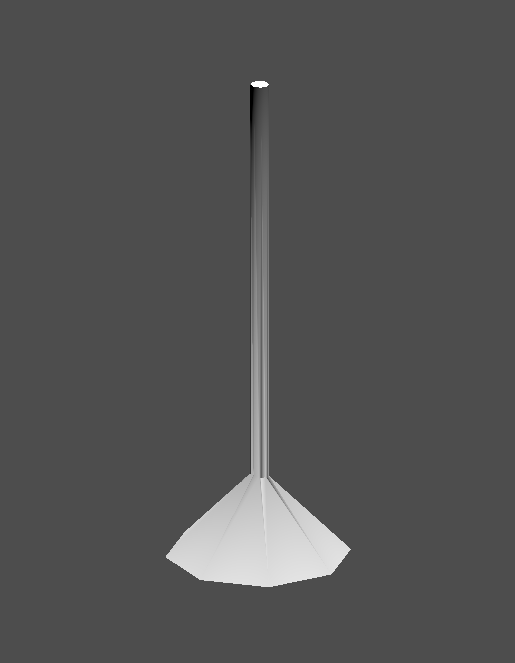

We will use a ``CSGPolygon`` for the lampshade. Use the ``Spin`` mode for the ``CSGPolygon`` and draw a `trapezoid <https://en.wikipedia.org/wiki/Trapezoid>`_ while in ``Front View`` (numeric keypad 1); this shape will extrude around the origin and form the lampshade.

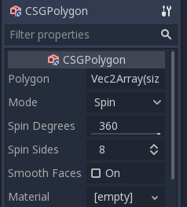

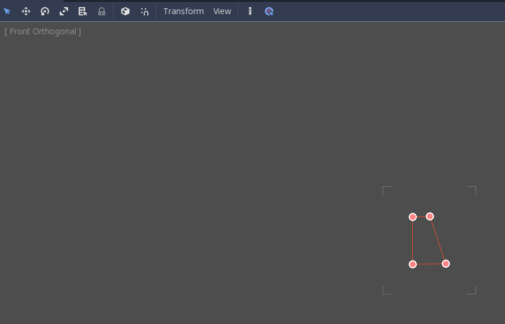

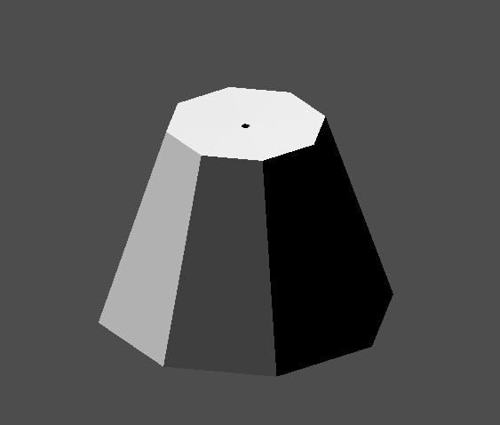

Adjust the placement of the 3 parts to make it a ``lamp``.

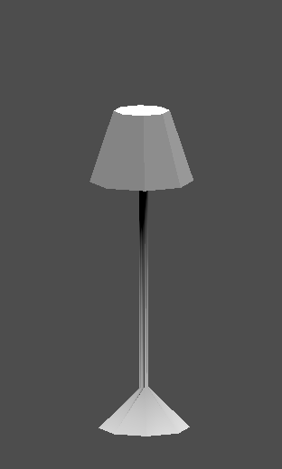

Create a ``CSGCombiner`` and name it ``bookshelf``.

We will use 3 ``CSGBox`` for the bookshelf. Create a ``CSGBox`` and adjust its dimension, this will be the size of the bookshelf. 

.. image:: img/csg_shelf_big.png

Duplicate the ``CSGBox`` and shorten the dimension of each axis and change the mode to ``Subtraction``. 

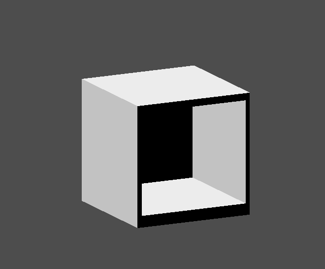

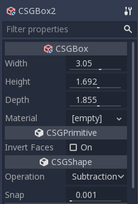

You've almost built a shelf. Create one more ``CSGBox`` for dividing the shelf into two levels.

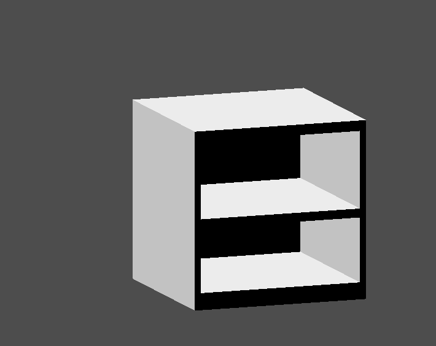

Position your furniture in your room as you like and your scene should look this:

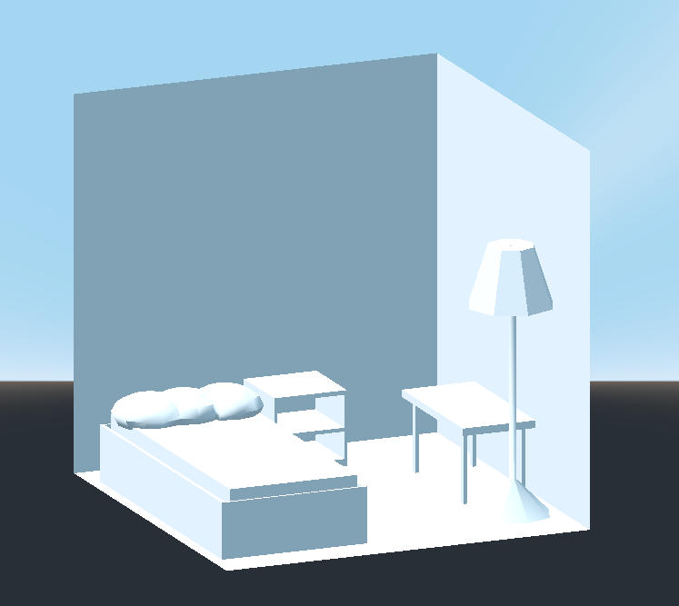

You've successfully prototyped a room level with the CSG tools in Godot. CSG tools can be used for designing all kinds of level, such as a maze or a city; explore the limitations of it when designing your game.

