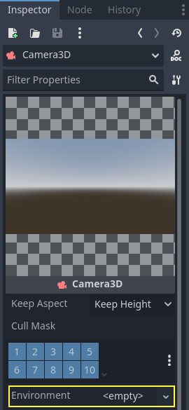
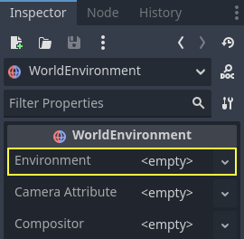
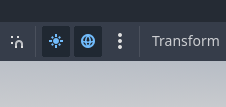
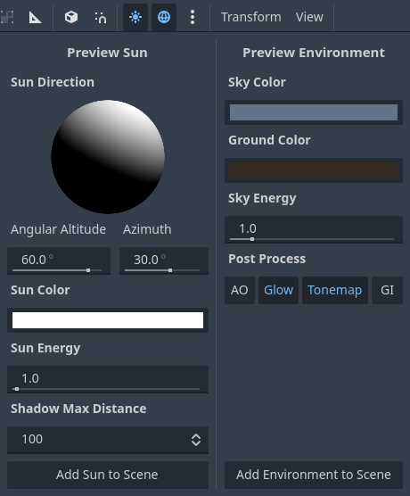
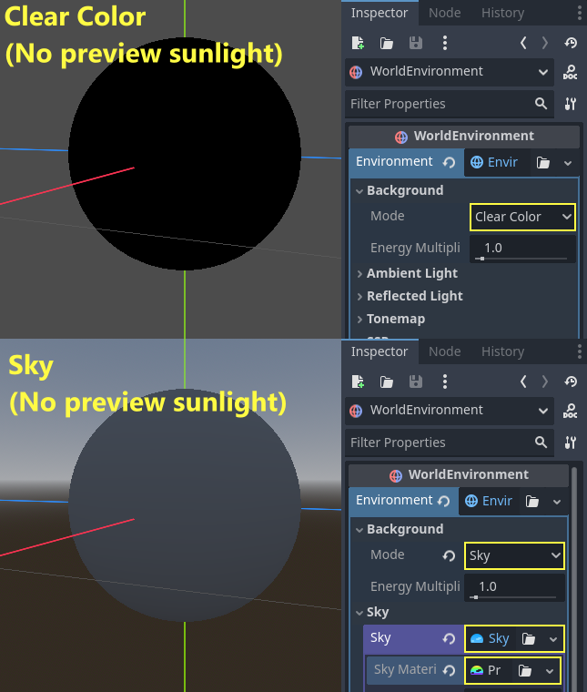
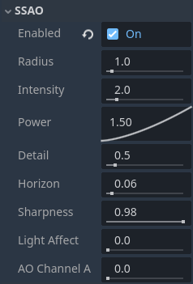
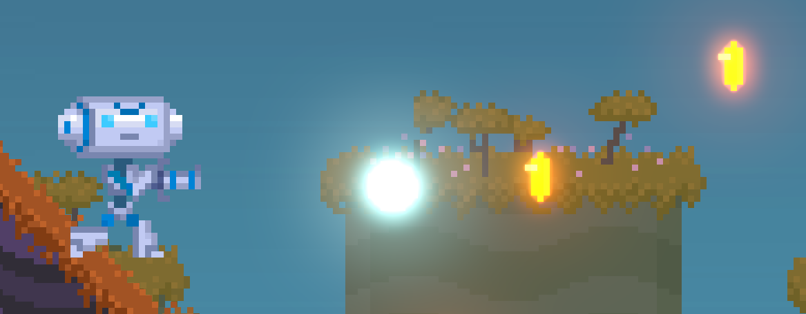
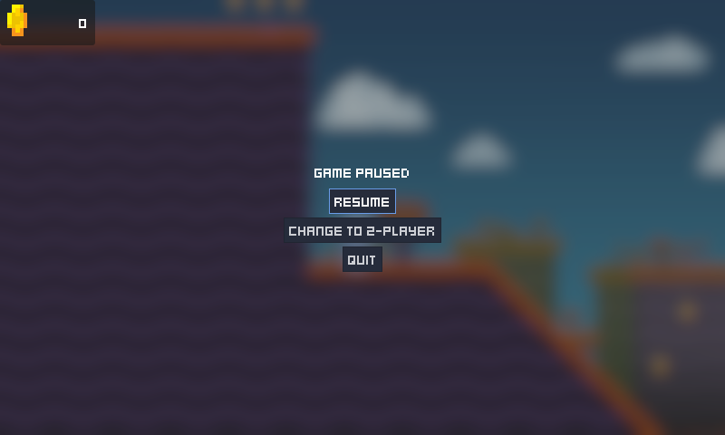
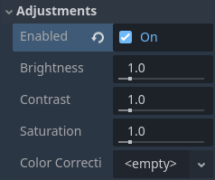

.. _doc_environment_and_post_processing:

Environment and post-processing
===============================

Godot 4 provides a redesigned Environment resource, as well as a new
post-processing system with many available effects right out of the box.

.. note::

    As of Godot 4, Environment *performance/quality* settings are defined in the
    project settings instead of in the Environment resource. This makes global
    adjustments easier, as you no longer have to tweak Environment resources
    individually to suit various hardware configurations.

    Note that most Environment performance/quality settings are only visible
    after enabling the **Advanced** toggle in the Project Settings.

Environment
-----------

The :ref:`class_Environment` resource stores all the information required for
controlling the 2D and 3D rendering environment. This includes the sky, ambient
lighting, tone mapping, effects, and adjustments. By itself, it does nothing,
but you can enable it by using it in one of the following locations, in order
of priority:

Camera3D node (high priority)
^^^^^^^^^^^^^^^^^^^^^^^^^^^^^

An Environment can be set to a Camera3D node. It will have priority over any
other setting.

This is mostly useful when you want to override an existing environment,
but in general it's a better idea to use the option below.

WorldEnvironment node (medium priority, recommended)
^^^^^^^^^^^^^^^^^^^^^^^^^^^^^^^^^^^^^^^^^^^^^^^^^^^^

The WorldEnvironment node can be added to any scene, but only one can exist per
active scene tree. Adding more than one will result in a warning.

Any Environment added has higher priority than the default Environment
(explained below). This means it can be overridden on a per-scene basis,
which makes it quite useful.

Preview environment and sun (low priority)
^^^^^^^^^^^^^^^^^^^^^^^^^^^^^^^^^^^^^^^^^^

.. note::

    Since Godot 4, the preview environment and sun system replace the
    ``default_env.tres`` file that was used in Godot 3 projects.

If no WorldEnvironment node or DirectionalLight3D node is present in the current
scene, the editor will display a preview environment and sun instead. This can
be disabled using the buttons at the top of the 3D editor:

Clicking on the 3 vertical dots on the right will display a dialog which allows
you to customize the appearance of the preview environment:

**The preview sun and sky is only visible in the editor, not in the running
project.** Using the buttons at the bottom of the dialog, you can add the
preview sun and sky into the scene as nodes.

.. tip::

    If you hold :kbd:`Shift` while clicking **Add Sun to Scene** or **Add
    Environment to Scene** in the preview environment editor, this will add both
    a preview sun and environment to the current scene (as if you clicked both
    buttons separately). Use this to speed up project setup and prototyping.

Camera attributes
-----------------

.. note::

    In Godot 4, exposure and depth of field information was split from the
    Environment resource into a separate CameraAttributes resource. This allows
    adjusting those properties independently of other Environment settings more
    easily.

The :ref:`class_CameraAttributes` resource stores exposure and depth of field
information. It also allows enabling automatic exposure adjustments depending on
scene brightness.

There are two kinds of CameraAttribute resources available:

- **CameraAttributesPractical:** Features are exposed using arbitrary units,
  which are easier to reason about for most game use cases.
- **CameraAttributesPhysical:** Features are exposed using real world units,
  similar to a digital camera. For example, field of view is set using a focal
  length in millimeters instead of a value in degrees. Recommended when physical
  accuracy is important, such as for photorealistic rendering.

Both CameraAttribute resource types allow you to use the same features, but they
are configured differently. If you don't know which one to choose, use
**CameraAttributesPractical**.

.. note::

    Using a :ref:`class_CameraAttributesPhysical` on a Camera3D node will lock
    out FOV and aspect adjustments in that Camera3D, as field of view is
    adjusted in the CameraAttributesPhysical resource instead. If used in a
    WorldEnvironment, the CameraAttributesPhysical will not override any
    Camera3D in the scene.

A CameraAttributes resource can be added to a Camera3D or a WorldEnvironment
node. When the current camera has a CameraAttributes set, it will *override* the
one set in WorldEnvironment (if any).

In most situations, setting the CameraAttributes resource on the Camera3D node
instead of the WorldEnvironment is recommended. Unlike WorldEnvironment,
assigning the CameraAttributes resource to the Camera3D node prevents depth of
field from displaying in the 3D editor viewport, unless the camera is being
previewed.

Environment options
-------------------

The following is a detailed description of all environment options and how
they are intended to be used.

Background
^^^^^^^^^^

The Background section contains settings on how to fill the background (parts of
the screen where objects were not drawn). The background not only serves the
purpose of displaying an image or color. By default, it also affects how objects
are affected by ambient and reflected light. This is called image-based lighting
(IBL).

As a result, the background sky may greatly impact your scene's overall
appearance, even if the sky is never directly visible on screen. This should be
taken into account when tweaking lighting in your scene.

There are several background modes available:

- **Clear Color** uses the default clear color defined in the project settings.
  The background will be a constant color.
- **Custom Color** is like Clear Color, but with a custom color value.
- **Sky** lets you define a background sky material (see below). By default,
  objects in the scene will reflect this sky material and absorb ambient light
  from it.
- **Canvas** displays the 2D scene as a background to the 3D scene. This can be used
  to make environment effects visible on 2D rendering, such as
  :ref:`glow in 2D <doc_environment_and_post_processing_using_glow_in_2d>`.
- **Keep** does not draw any sky, keeping what was present on previous frames
  instead. This improves performance in purely indoor scenes, but creates a
  "hall of mirrors" visual glitch if the sky is visible at any time.

Sky materials
^^^^^^^^^^^^^

When using the **Sky** background mode (or the ambient/reflected light mode is
set to **Sky**), a Sky subresource becomes available to edit in the Environment
resource. Editing this subresource allows you to create a SkyMaterial resource
within the Sky.

There are 3 built-in sky materials to choose from:

- **PanoramaSkyMaterial:** Use a 360 degree panorama sky image (2:1 aspect ratio
  recommended). To benefit from high dynamic range, the panorama image must be
  in an HDR-compatible format such as ``.hdr`` or ``.exr`` rather than a
  standard dynamic range format like ``.png`` or ``.jpg``.
- **ProceduralSkyMaterial:** Use a procedurally generated sky with adjustable
  ground, sun, sky and horizon colors. This is the type of sky used in the
  editor preview. The sun's position is automatically derived from the first 4
  DirectionalLight3D nodes present in the scene. There can be up to 4 suns at a
  given time.
- **PhysicalSkyMaterial:** Use a physically-based procedural sky with adjustable
  scattering parameters. The sun's position is automatically derived from the
  first DirectionalLight3D node present in the scene. PhysicalSkyMaterial is
  slightly more expensive to render compared to ProceduralSkyMaterial. There can
  be up to 1 sun at a given time.

Panorama sky images are sometimes called HDRIs (High Dynamic Range Images).
You can find freely licensed HDRIs on `Poly Haven <https://polyhaven.com/hdris>`__.

.. note::

    HDR PanoramaSkyMaterial textures with very bright spots (such as real life
    photos with the sun visible) may result in visible sparkles on ambient and
    specular reflections. This is caused by the texture's peak exposure being
    too high.

    To resolve this, select the panorama texture in the FileSystem dock, go to
    the Import dock, enable **HDR Clamp Exposure** then click **Reimport**.

If you need a custom sky material (e.g. for procedural clouds), you can
create a custom :ref:`sky shader <doc_sky_shader>`.

Ambient light
^^^^^^^^^^^^^

Ambient light (as defined here) is a type of light that affects every piece of
geometry with the same intensity. It is global and independent of lights that
might be added to the scene. Ambient light is one of the two components of
image-based lighting. Unlike reflected light, ambient light does not vary
depending on the camera's position and viewing angle.

There are several types of ambient light to choose from:

- **Background:** Source ambient light from the background, such as the sky,
  custom color or clear color (default). Ambient light intensity will vary
  depending on the sky image's contents, which can result in more visually
  appealing ambient lighting. A sky must be set as background for this mode to
  be visible.
- **Disabled:** Do not use any ambient light. Useful for purely indoor scenes.
- **Color:** Use a constant color for ambient light, ignoring the background
  sky. Ambient light intensity will be the same on all sides, which may result
  in the scene's lighting looking more flat. Useful for indoor scenes where
  pitch black shadows may be too dark, or to maximize performance on low-end
  devices.
- **Sky:** Source ambient light from a specified sky, even if the background is
  set to a mode other than **Sky**. If the background mode is already **Sky**,
  this mode behaves identically to **Background**.

.. image:: img/environment_ambient.webp

When the ambient light mode is set to Sky or Background (and background is set
to Sky), it's possible to blend between the ambient color and sky using the
**Sky Contribution** property. This value is set to ``1.0`` by default, which
means that only the ambient sky is used. The ambient color is ignored unless
**Sky Contribution** is decreased below ``1.0``.

Here is a comparison of how different ambient light affects a scene:

.. image:: img/environment_ambient2.webp

Finally, there is an **Energy** setting which is a multiplier. It's useful when
working with HDR.

In general, you should only rely on ambient light alone for simple scenes or
large exteriors. You may also do so to boost performance. Ambient light is fast
to render, but it doesn't provide the best lighting quality. It's better to
generate ambient light from :ref:`ReflectionProbe <doc_reflection_probes>`,
:ref:`VoxelGI <doc_using_voxel_gi>` or :ref:`SDFGI <doc_using_sdfgi>`, as these
will simulate how indirect light propagates more accurately. Below is a comparison,
in terms of quality, between using a flat ambient color and a VoxelGI:

.. image:: img/environment_ambient_comparison.webp

Using one of the methods described above will replace constant ambient
lighting with ambient lighting from the probes.

Reflected light
^^^^^^^^^^^^^^^

Reflected light (also called specular light) is the other of the two components
of image-based lighting.

Reflected light can be set to one of 3 modes:

- **Background:** Reflect from the background, such as the sky, custom color or
  clear color (default).
- **Disabled:** Do not reflect any light from the environment. Useful for purely
  indoor scenes, or to maximize performance on low-end devices.
- **Sky:** Reflect from the background sky, even if the background is set to a
  mode other than **Sky**. If the background mode is already **Sky**, this mode
  behaves identically to **Background**.

Fog
^^^

.. note::

    This section refers to non-volumetric fog only.
    It is possible to use both non-volumetric fog and :ref:`doc_volumetric_fog`
    at the same time.

Fog, as in real life, makes distant objects fade away into a uniform color.
There are two kinds of fog in Godot:

- **Depth Fog:** This one is applied based on the distance from the camera.
- **Height Fog:** This one is applied to any objects below (or above) a certain
  height, regardless of the distance from the camera.

.. image:: img/environment_fog_depth_height.webp

Both of these fog types can have their curve tweaked, making their transition more or less sharp.

Two properties can be tweaked to make the fog effect more interesting:

The first is **Sun Amount**, which makes use of the Sun Color property of the fog.
When looking towards a directional light (usually a sun), the color of the fog
will be changed, simulating the sunlight passing through the fog.

The second is **Transmit Enabled** which simulates more realistic light transmittance.
In practice, it makes light stand out more across the fog.

.. image:: img/environment_fog_transmission.webp

.. note::

    Fog can cause banding to appear on the viewport, especially at
    higher density levels. See :ref:`doc_3d_rendering_limitations_color_banding`
    for guidance on reducing banding.

Volumetric Fog
^^^^^^^^^^^^^^

Volumetric fog provides a realistic fog effect to the scene, with fog color
being affected by the lights that traverse the fog.

.. seealso::

  See :ref:`doc_volumetric_fog` for documentation on setting up volumetric fog.

Tonemap
^^^^^^^

Tonemap selects the tonemapping curve that will be applied to the scene, from a
list of standard curves used in the film and game industries. Tonemapping operators
other than Linear are used to make light and dark areas more homogeneous,
while also avoiding clipping of bright highlights.

The tone mapping options are:

- **Mode:** The tone mapping mode to use.

  - **Linear:** The default tonemapping mode. This is the fastest and simplest
    tonemapping operator, but it causes bright lighting to look blown out, with
    noticeable clipping in the output colors.
  - **Reinhardt:** Performs a variation on rendered pixels' colors by this
    formula: ``color = color / (1 + color)``. This avoids clipping bright
    highlights, but the resulting image can look a bit dull.
  - **Filmic:** This avoids clipping bright highlights, with a resulting image
    that usually looks more vivid than Reinhardt.
  - **ACES:** Academy Color Encoding System tonemapper.
    ACES is slightly more expensive than other options, but it handles
    bright lighting in a more realistic fashion by desaturating it as it becomes brighter.
    ACES typically has a more contrasted output compared to Reinhardt and Filmic.
    ACES is the recommended option when aiming for photorealistic visuals.
    This tonemapping mode was called "ACES Fitted" in Godot 3.x.

- **Exposure:** Tone mapping exposure which simulates amount of light received
  over time (default: ``1.0``). Higher values result in an overall brighter appearance.
  If the scene appears too dark as a result of a tonemapping operator or whitepoint
  change, try increasing this value slightly.

- **White:** Tone mapping whitepoint, which simulates where in the scale white is
  located (default: ``1.0``). For photorealistic lighting, recommended values are
  between ``6.0`` and ``8.0``. Higher values result in less blown out highlights,
  but make the scene appear slightly darker as a whole.

Mid- and post-processing effects
--------------------------------

The Environment resource supports many popular mid- and post-processing effects.

.. note::

    Screen-space effects such as :abbr:`SSR (Screen-Space Reflections)`,
    :abbr:`SSAO (Screen-Space Ambient Occlusion)`,
    :abbr:`SSIL (Screen-Space Indirect Lighting)` and glow do not operate on
    geometry that is located outside the camera view or is occluded by other
    opaque geometry. Consider this when tweaking their settings to avoid
    distracting changes during gameplay.

Screen-Space Reflections (SSR)
^^^^^^^^^^^^^^^^^^^^^^^^^^^^^^

*This feature is only available when using the Forward+ backend, not
Mobile or Compatibility.*

While Godot supports several sources of reflection data such as
:ref:`doc_reflection_probes`, they may not provide enough detail for all
situations. Scenarios where screen-space reflections make the most sense are
when objects are in contact with each other (object over floor, over a table,
floating on water, etc).

.. image:: img/environment_ssr.webp

On top of providing more detail, screen-space reflections also work in real-time
(while other types of reflections are usually precomputed). This can be used to
make characters, cars, etc. reflect on surrounding surfaces when moving around.

Screen-space reflections can be used at the same time as other reflection
sources to benefit from detailed reflections when possible, while having a
fallback when screen-space reflections cannot be used (for example, to reflect
off-screen objects).

A few user-controlled parameters are available to better tweak the technique:

- **Max Steps:** Determines the length of the reflection. The bigger this
  number, the more costly it is to compute.
- **Fade In:** Allows adjusting the fade-in curve, which is useful to make the
  contact area softer.
- **Fade Out:** Allows adjusting the fade-out curve, so the step limit fades out
  softly.
- **Depth Tolerance:** Can be used to allow screen-space rays to pass behind
  objects. The rays will treat each object as if it has this depth in
  determining if it can pass behind the object. Higher values will make
  screen-space reflections exhibit fewer "breakups", at the cost of some objects
  creating physically incorrect reflections.

Keep in mind that screen-space-reflections only work for reflecting opaque
geometry. Transparent materials won't be reflected, as they don't write to the depth buffer.
This also applies to shaders that use ``hint_screen_texture`` or ``hint_depth_texture``
uniforms.

Screen-Space Ambient Occlusion (SSAO)
^^^^^^^^^^^^^^^^^^^^^^^^^^^^^^^^^^^^^

*This feature is only available when using the Forward+ backend, not
Mobile or Compatibility.*

As mentioned in the **Ambient** section, areas where light from light nodes
does not reach (either because it's outside the radius or shadowed) are lit
with ambient light. Godot can simulate this using VoxelGI, ReflectionProbe,
the Sky, or a constant ambient color. The problem, however, is that all the
methods proposed previously act more on a larger scale (large regions) than at the
smaller geometry level.

Constant ambient color and Sky are the same everywhere, while GI and
Reflection probes have more local detail, but not enough to simulate situations
where light is not able to fill inside hollow or concave features.

This can be simulated with Screen Space Ambient Occlusion. As you can see in the
image below, its purpose is to make sure concave areas are darker, simulating
a narrower path for the light to enter:

.. image:: img/environment_ssao.webp

It is a common mistake to enable this effect, turn on a light, and not be able to
appreciate it. This is because :abbr:`SSAO (Screen-Space Ambient Occlusion)`
only acts on *ambient* light. It does not affect direct light.

This is why, in the image above, the effect is less noticeable under the direct
light (on the left). If you want to force
:abbr:`SSAO (Screen-Space Ambient Occlusion)` to work with direct light too,
use the **Light Affect** parameter. Even though this is not physically correct,
some artists like how it looks.

:abbr:`SSAO (Screen-Space Ambient Occlusion)` looks best when combined with a
real source of indirect light, like VoxelGI:

.. image:: img/environment_ssao2.webp

Tweaking :abbr:`SSAO (Screen-Space Ambient Occlusion)` is possible with several
parameters:

- **Radius:** The distance at which objects can occlude each other when
  calculating screen-space ambient occlusion. Higher values will result in
  occlusion over a greater distance at the cost of performance and quality.
- **Intensity:** The primary screen-space ambient occlusion intensity. Acts as a
  multiplier for the screen-space ambient occlusion effect. A higher value
  results in darker occlusion.
  Since :abbr:`SSAO (Screen-Space Ambient Occlusion)` is a screen-space effect,
  it's recommended to remain conservative with this value.
  :abbr:`SSAO (Screen-Space Ambient Occlusion)` that is too strong can be
  distracting during gameplay.
- **Power:** The distribution of occlusion. A higher value results in darker
  occlusion, similar to **Intensity**, but with a sharper falloff.
- **Detail:** Sets the strength of the additional level of detail for the
  screen-space ambient occlusion effect. A high value makes the detail pass more
  prominent, but it may contribute to aliasing in your final image.
- **Horizon:** The threshold for considering whether a given point on a surface
  is occluded or not represented as an angle from the horizon mapped into the
  0.0-1.0 range. A value of 1.0 results in no occlusion.
- **Sharpness:** The amount that the screen-space ambient occlusion effect is
  allowed to blur over the edges of objects. Setting too high will result in
  aliasing around the edges of objects. Setting too low will make object edges
  appear blurry.
- **Light Affect:** The screen-space ambient occlusion intensity in direct
  light. In real life, ambient occlusion only applies to indirect light, which
  means its effects can't be seen in direct light. Values higher than 0 will
  make the :abbr:`SSAO (Screen-Space Ambient Occlusion)` effect visible in
  direct light. Values above ``0.0`` are not physically accurate, but some
  artists prefer this effect.

.. _doc_environment_and_post_processing_ssil:

Screen-Space Indirect Lighting (SSIL)
^^^^^^^^^^^^^^^^^^^^^^^^^^^^^^^^^^^^^

*This feature is only available when using the Forward+ backend, not
Mobile or Compatibility.*

:abbr:`SSIL (Screen-Space Indirect Lighting)` provides indirect lighting for
small details or dynamic geometry that other global illumination techniques
cannot cover. This applies to bounced diffuse lighting, but also emissive
materials. When :abbr:`SSIL (Screen-Space Indirect Lighting)` is enabled on its
own, the effect may not be that noticeable, which is intended.

Instead, :abbr:`SSIL (Screen-Space Indirect Lighting)` is meant to be used as a
*complement* to other global illumination techniques such as VoxelGI, SDFGI and
LightmapGI. :abbr:`SSIL (Screen-Space Indirect Lighting)` also provides
a subtle ambient occlusion effect, similar to SSAO but with less detail.

This feature only provides indirect lighting. It is not a full global illumination
solution. This makes it different from screen-space global illumination (SSGI)
offered by other 3D engines. :abbr:`SSIL (Screen-Space Indirect Lighting)`
can be combined with :abbr:`SSR (Screen-Space Reflections)` and/or
:abbr:`SSAO (Screen-Space Ambient Occlusion)` for greater visual quality
(at the cost of performance).

Tweaking :abbr:`SSIL (Screen-Space Indirect Lighting)` is possible with several parameters:

- **Radius:** The distance that bounced lighting can travel when using the
  screen space indirect lighting effect. A larger value will result in light
  bouncing further in a scene, but may result in under-sampling artifacts which
  look like long spikes surrounding light sources.
- **Intensity:** The brightness multiplier for the screen-space indirect
  lighting effect. A higher value will result in brighter light.
- **Sharpness:** The amount that the screen-space indirect lighting effect is
  allowed to blur over the edges of objects. Setting too high will result in
  aliasing around the edges of objects. Setting too low will make object edges
  appear blurry.
- **Normal Rejection:** Amount of normal rejection used when calculating
  screen-space indirect lighting. Normal rejection uses the normal of a given
  sample point to reject samples that are facing away from the current pixel.
  Normal rejection is necessary to avoid light leaking when only one side of an
  object is illuminated. However, normal rejection can be disabled if light
  leaking is desirable, such as when the scene mostly contains emissive objects
  that emit light from faces that cannot be seen from the camera.

.. image:: img/environment_ssil.webp

Signed Distance Field Global Illumination (SDFGI)
^^^^^^^^^^^^^^^^^^^^^^^^^^^^^^^^^^^^^^^^^^^^^^^^^

*This feature is only available when using the Forward+ backend, not
Mobile or Compatibility.*

Signed distance field global illumination (SDFGI) is a form of real-time global
illumination. It is not a screen-space effect, which means it can provide global
illumination for off-screen elements (unlike :abbr:`SSIL (Screen-Space Indirect Lighting)`).

.. seealso::

    See :ref:`doc_using_sdfgi` for instructions on setting up this global
    illumination technique.

.. image:: img/environment_sdfgi.webp

.. _doc_environment_and_post_processing_glow:

Glow
^^^^

.. note::

    When using the Compatibility rendering method, glow uses a different
    implementation with some properties being unavailable and hidden from the
    inspector: **Levels**, **Normalized**, **Strength**, **Blend Mode**,
    **Mix**, **Map**, and **Map Strength**.

    This implementation is optimized to run on low-end devices and is less
    flexible as a result.

In photography and film, when light amount exceeds the maximum *luminance*
(brightness) supported by the media, it generally bleeds outwards to darker
regions of the image. This is simulated in Godot with the **Glow** effect.

.. image:: img/environment_glow1.webp

By default, even if the effect is enabled, it will be weak or invisible. One of
two conditions need to happen for it to actually show:

- 1) The light in a pixel surpasses the **HDR Threshold** (where 0 is all light
     surpasses it, and 1.0 is light over the tonemapper **White** value).
     Normally, this value is expected to be at 1.0, but it can be lowered to
     allow more light to bleed. There is also an extra parameter, **HDR Scale**,
     that allows scaling (making brighter or darker) the light surpassing the
     threshold.

.. image:: img/environment_glow_threshold.webp

- 2) The **Bloom** property has a value greater than ``0.0``. As it increases,
     it sends the whole screen to the glow processor at higher amounts.

.. image:: img/environment_glow_bloom.webp

Both will cause the light to start bleeding out of the brighter areas.

Once glow is visible, it can be controlled with a few extra parameters:

- **Intensity** is an overall scale for the effect, it can be made stronger or
  weaker (``0.0`` removes it).
- **Strength** is how strong the gaussian filter kernel is processed. Greater
  values make the filter saturate and expand outwards. In general, changing this
  is not needed, as the size can be adjusted more efficiently with the **Levels**.

The **Blend Mode** of the effect can also be changed:

- **Additive** is the strongest one, as it only adds the glow effect over the
  image with no blending involved. In general, it's too strong to be used, but
  can look good with low-intensity **Bloom** (produces a dream-like effect).
- **Screen** ensures glow never brightens more than itself and it works great as
  an all around.
- **Softlight** is the default and weakest one, producing only a subtle color
  disturbance around the objects. This mode works best on dark scenes.
- **Replace** can be used to
  :ref:`blur the whole screen <doc_environment_and_post_processing_using_glow_to_blur_the_screen>`
  or debug the effect. It only shows the glow effect without the image below.
- **Mix** mixes the glow effect with the main image. This can be used for
  greater artistic control. The mix factor is controlled by the **Mix** property
  which appears above the blend mode (only when the blend mode is set to Mix).
  High mix factor values will appear to darken the image unless **Bloom** is
  increased.

To change the glow effect size and shape, Godot provides **Levels**. Smaller
levels are strong glows that appear around objects, while large levels are hazy
glows covering the whole screen:

.. image:: img/environment_glow_layers.webp

The real strength of this system, though, is to combine levels to create more
interesting glow patterns:

.. image:: img/environment_glow_layers2.webp

Finally, the glow effect can be controlled using a *glow map*, which is a
texture that determines how bright glow should be on each part of the screen.
This texture can optionally be colored to tint the glow effect to the glow map's
color. The texture is stretched to fit the viewport, so using an aspect ratio
that matches your viewport's most common aspect ratio (such as 16:9) is recommended
to avoid visible distortion.

There are 2 main use cases for a glow map texture:

- Create a "lens dirt" effect using a dirt pattern texture.
- Make glow less strong on specific parts of the screen by using a gradient texture.

.. image:: img/environment_glow_map.webp

.. _doc_environment_and_post_processing_using_glow_in_2d:

Using glow in 2D
^^^^^^^^^^^^^^^^

There are 2 ways to use glow in 2D:

- Since Godot 4.2, you can enable HDR for 2D rendering when using the Forward+
  and Mobile rendering methods. This has a performance cost, but it allows for a
  greater dynamic range. This also allows you to control which objects glow
  using their individual **Modulate** or **Self Modulate** properties (use the
  RAW mode in the color picker). Enabling HDR can also reduce banding in the 2D
  rendering output.

  - To enable HDR in 2D, open the Project Settings, enable
    **Rendering > Viewport > HDR 2D** then restart the editor.

- If you want to maximize performance, you can leave HDR disabled for 2D
  rendering. However, you will have less control on which objects glow.

  - Enable glow, set the environment background mode to **Canvas** then decrease
    **Glow HDR Threshold** so that pixels that are not overbright will still
    glow. To prevent UI elements from glowing, make them children of a
    :ref:`class_CanvasLayer` node. You can control which layers are affected by
    glow using the **Background > Canvas Max Layer** property of the Environment
    resource.

   Example of using glow in a 2D scene. HDR 2D is enabled, while coins and the
   bullet have their **Modulate** property increased to overbright values using the
   RAW mode in the color picker.

.. warning::

    The 2D renderer renders in linear color space if the
    **Rendering > Viewport > HDR 2D** project setting is enabled, so
    ``source_color`` must also be used for uniform samplers that are
    used as color input in ``canvas_item`` shaders. If this is not done,
    the texture will appear washed out.

    If 2D HDR is disabled, ``source_color`` will keep working correctly in
    ``canvas_item`` shaders, so it's recommend to use it when relevant either
    way.

.. _doc_environment_and_post_processing_using_glow_to_blur_the_screen:

Using glow to blur the screen
^^^^^^^^^^^^^^^^^^^^^^^^^^^^^

Glow can be used to blur the whole viewport, which is useful for background blur
when a menu is open. Only 3D rendering will be affected unless the environment's
background mode is set to **Canvas**. To prevent UI elements from being blurred
when using the Canvas background mode, make them children of a :ref:`class_CanvasLayer`
node. You can control which layers are affected by this blurring effect using the
**Background > Canvas Max Layer** property of the Environment resource.

To use glow as a blurring solution:

- Enable **Normalized** and adjust levels according to preference. Increasing
  higher level indices will result in a more blurred image. It's recommended to
  leave a single glow level at ``1.0`` and leave all other glow levels at
  ``0.0``, but this is not required. Note that the final appearance will vary
  depending on viewport resolution.
- Set **Intensity** to ``1.0`` and **Bloom** to ``1.0``.
- Set the blend mode to **Replace** and **HDR Luminance Cap** to ``1.0``.

   Example of using glow to blur the 2D rendering in the menu's background

Adjustments
^^^^^^^^^^^

At the end of processing, Godot offers the possibility to do some standard
image adjustments.

**Basic BCS adjustments**

The first adjustment is being able to change the typical **Brightness**, **Contrast**,
and **Saturation** properties:

.. image:: img/environment_adjustments_bcs.webp

**Color correction using a 1D gradient**

The second adjustment is by supplying a color correction gradient. This can be
done by assigning a GradientTexture1D resource to the **Color Correction**
property, or by loading a texture containing a horizontal gradient. The leftmost
part of the gradient represents black in the source image, whereas the rightmost
part of the gradient represents white in the source image.

A linear black-to-white gradient like the following one will produce no effect:

.. image:: img/environment_adjustments_default_gradient.webp

But creating custom ones will allow to map each channel to a different color:

.. image:: img/environment_adjustments_custom_gradient.webp

**Color correction using a 3D LUT**

A 3D look-up-texture (LUT) can also be used for color correction. This is a
special texture used to modify each color channel separately from one another
(red, green, blue). This image can be of any resolution, but since color
correction is low-frequency data, sticking to low resolutions is recommended for
performance reasons. A LUT texture's resolution is typically 17×17×17, 33×33×33,
51×51×51 or 65×65×65 (the odd size allows for better interpolation).

For this to work, the look-up texture's import mode must be set to Texture3D
in the Import dock (instead of being imported as a regular Texture2D):

.. image:: img/environment_adjustments_3d_lut_import.webp

Make sure to configure the number of horizontal and vertical slices to import as
well. If you don't do this, the LUT texture will not affect the viewport
correctly when used. You can preview how the 3D texture was imported by
double-clicking it, in the FileSystem dock, then going to the inspector to flip
through the texture's layers.

You can use this neutral 33×33×33 LUT template as a base (right-click and choose
**Save as…**):

.. image:: img/environment_adjustments_3d_lut_template.webp

With the above LUT template, after changing its import mode to **Texture3D**,
set its number of **Horizontal** slices to ``33`` in the Import dock then click
**Reimport**. If you load this LUT into the **Color Correction** property, you
won't see any visible difference for now since this texture is designed to be a
neutral starting point.

This LUT template can be modified in an image editor to provide a different
mood to the image. A common workflow is to place the LUT image next to a
screenshot of the project's 3D viewport, then use an image editor to modify both
the LUT image and the screenshot at the same time. The LUT can then be saved and
applied to the game engine to perform the same color correction in real-time.

For example, modifying the LUT template in an image editor to give it a
"sepia" look results in the image on the right:

.. image:: img/environment_adjustments_3d_lut_comparison.webp

.. note::

    Adjustments and color correction are applied *after* tonemapping.
    This means the tonemapping properties defined above still have an effect
    when adjustments are enabled.

Camera attribute options
------------------------

Depth of Field / Far Blur
^^^^^^^^^^^^^^^^^^^^^^^^^

This effect simulates focal distance on cameras. It blurs objects behind
a given range. It has an initial **Distance** with a **Transition** region
(in world units):

.. image:: img/environment_dof_far.webp

The **Amount** parameter controls the amount of blur. For larger blurs, tweaking
the depth of field quality in the advanced project settings may be needed to
avoid artifacts.

Depth of Field / Near Blur
^^^^^^^^^^^^^^^^^^^^^^^^^^

This effect simulates focal distance on cameras. It blurs objects close
to the camera (acts in the opposite direction as far blur).
It has an initial **Distance** with a **Transition** region (in world units):

.. image:: img/environment_dof_near.webp

The **Amount** parameter controls the amount of blur. For larger blurs, tweaking
the **Quality** may be needed in order to avoid artifacts.

It is common to use both blurs together to focus the viewer's attention on a
given object, or create a so-called
`"tilt shift" effect <https://en.wikipedia.org/wiki/Miniature_faking>`__.

.. image:: img/environment_mixed_blur.webp

.. note::

    When using CameraAttributesPhysical instead of CameraAttributesPractical,
    depth of field is automatically computed from the camera attributes' focus
    distance, focal length, and aperture.

Exposure
^^^^^^^^

This multiplies the overall scene brightness visible from the camera. Higher
values result in a visually brighter scene.

Auto Exposure
^^^^^^^^^^^^^

*This feature is only available when using the Forward+ backend, not
Mobile or Compatibility.*

Even though, in most cases, lighting and texturing are heavily artist controlled,
Godot supports a basic high dynamic range implementation with the auto exposure
mechanism. This is generally used to add realism when combining interior areas
with low light and bright outdoor areas. Auto exposure simulates the camera
(or eye) in an effort to adapt between light and dark locations and their
different amounts of light.

.. note::

    Auto exposure needs to evaluate the scene's brightness every frame, which
    has a moderate performance cost. Therefore, it's recommended to leave Auto
    Exposure disabled if it doesn't make much of a difference in your scene.

.. image:: img/environment_hdr_autoexp.webp

The simplest way to use auto exposure is to make sure outdoor lights (or other
strong lights) have energy beyond 1.0. This is done by tweaking their **Energy**
multiplier (on the Light itself). To make it consistent, the **Sky** usually
needs to use the energy multiplier too, to match with the directional light.
Normally, values between 3.0 and 6.0 are enough to simulate indoor-outdoor conditions.

By combining Auto Exposure with :ref:`doc_environment_and_post_processing_glow`
post-processing, pixels that go over the tonemap **White** will bleed to the
glow buffer, creating the typical bloom effect in photography.

.. image:: img/environment_hdr_bloom.webp

The user-controllable values in the Auto Exposure section come with sensible
defaults, but you can still tweak them:

.. image:: img/environment_hdr.webp

- **Scale:** Value to scale the lighting. Higher values produce brighter
  images, and lower values produce darker ones.
- **Min Sensitivity / Min Exposure Value:** Minimum luminance that auto exposure
  will aim to adjust for (in ISO when using CameraAttributesPractical, or in
  EV100 when using CameraAttributesPhysical). Luminance is the average of the
  light in all the pixels of the screen.
- **Max Sensitivity / Max Exposure Value:** Maximum luminance that auto exposure
  will aim to adjust for (in ISO when using CameraAttributesPractical, or in
  EV100 when using CameraAttributesPhysical).
- **Speed:** Speed at which luminance corrects itself. The higher the value, the
  faster luminance correction happens. High values may be more suited to
  fast-paced games, but can be distracting in some scenarios.

When using CameraAttributesPractical, exposure is set using *sensitivity*
defined in ISO instead of an exposure value in EV100. Typical ISO values are
between 50 and 3200, with higher values resulting in higher final exposure. In
real life, daytime photography generally uses ISO values between 100 and 800.

.. seealso::

    See :ref:`doc_physical_light_and_camera_units` if you wish to use real world
    units to configure your camera's exposure, field of view and depth of field.
