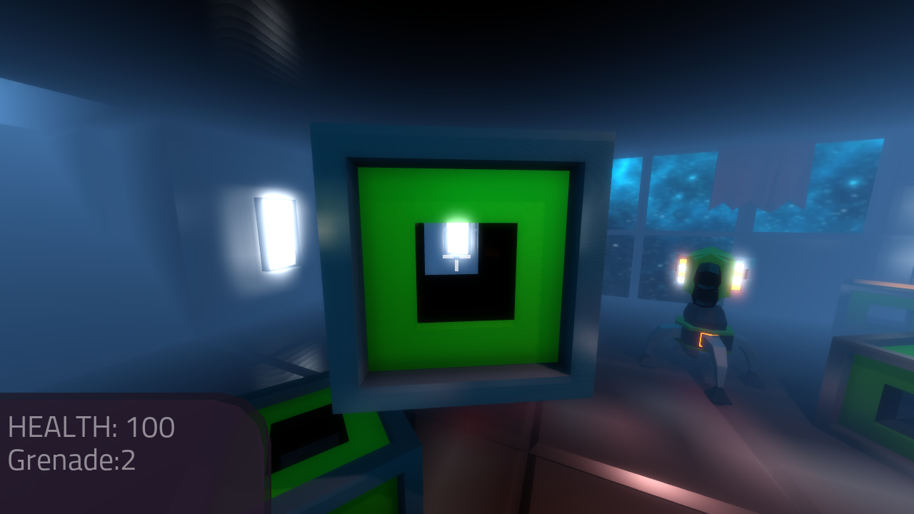

.. _doc_fps_tutorial_part_five:

Part 5
======

Part overview
-------------

In this part, we're going to add grenades to the player, give the player the ability to grab and throw objects, and add turrets!

.. note:: You are assumed to have finished :ref:`doc_fps_tutorial_part_four` before moving on to this part of the tutorial.
          The finished project from :ref:`doc_fps_tutorial_part_four` will be the starting project for part 5

Let's get started!

Adding grenades
---------------

Firstly, let's give the player some grenades to play with. Open up ``Grenade.tscn``.

There are a few things to note here, the first and foremost being that the grenades are going to use :ref:`RigidBody <class_RigidBody>` nodes.
We're going to use :ref:`RigidBody <class_RigidBody>` nodes for our grenades so they bounce around the world in a (somewhat) realistic manner.

The second thing to note is ``Blast_Area``. This is an :ref:`Area <class_Area>` node that will represent the blast radius of the grenade.

Finally, the last thing to note is ``Explosion``. This is the :ref:`Particles <class_Particles>` node that will emit an explosion effect when
the grenade explodes. One thing to note here is that we have ``One shot`` enabled. This is so we emit all the particles at once. The particles are also emitted using world
coordinates instead of local coordinates, so we have ``Local Coords`` unchecked as well.

.. note:: If you want, you can see how the particles are set up by looking through the particle's ``Process Material`` and ``Draw Passes``.

Let's write the code needed for the grenade. Select ``Grenade`` and make a new script called ``Grenade.gd``. Add the following:

::

    extends RigidBody

    const GRENADE_DAMAGE = 60

    const GRENADE_TIME = 2
    var grenade_timer = 0

    const EXPLOSION_WAIT_TIME = 0.48
    var explosion_wait_timer = 0

    var rigid_shape
    var grenade_mesh
    var blast_area
    var explosion_particles

    func _ready():
        rigid_shape = $Collision_Shape
        grenade_mesh = $Grenade
        blast_area = $Blast_Area
        explosion_particles = $Explosion

        explosion_particles.emitting = false
        explosion_particles.one_shot = true

    func _process(delta):

        if grenade_timer < GRENADE_TIME:
            grenade_timer += delta
            return
        else:
            if explosion_wait_timer <= 0:
                explosion_particles.emitting = true

                grenade_mesh.visible = false
                rigid_shape.disabled = true

                mode = RigidBody.MODE_STATIC

                var bodies = blast_area.get_overlapping_bodies()
                for body in bodies:
                    if body.has_method("bullet_hit"):
                        body.bullet_hit(GRENADE_DAMAGE, body.global_transform.looking_at(global_transform.origin, Vector3(0, 1, 0)))

                # This would be the perfect place to play a sound!

            if explosion_wait_timer < EXPLOSION_WAIT_TIME:
                explosion_wait_timer += delta

                if explosion_wait_timer >= EXPLOSION_WAIT_TIME:
                    queue_free()

Let's go over what's happening, starting with the class variables:

* ``GRENADE_DAMAGE``: The amount of damage the grenade causes when it explodes.
* ``GRENADE_TIME``: The amount of time the grenade takes (in seconds) to explode once it's created/thrown.
* ``grenade_timer``: A variable for tracking how long the grenade has been created/thrown.
* ``EXPLOSION_WAIT_TIME``: The amount of time needed (in seconds) to wait before we destroy the grenade scene after the explosion
* ``explosion_wait_timer``: A variable for tracking how much time has passed since the grenade exploded.
* ``rigid_shape``: The :ref:`CollisionShape <class_CollisionShape>` for the grenade's :ref:`RigidBody <class_RigidBody>`.
* ``grenade_mesh``: The :ref:`MeshInstance <class_MeshInstance>` for the grenade.
* ``blast_area``: The blast :ref:`Area <class_Area>` used to damage things when the grenade explodes.
* ``explosion_particles``: The :ref:`Particles <class_Particles>` that come out when the grenade explodes.

Notice how ``EXPLOSION_WAIT_TIME`` is a rather strange number (``0.48``). This is because we want ``EXPLOSION_WAIT_TIME`` to be equal to the length of time
the explosion particles are emitting, so when the particles are done we destroy/free the grenade. We calculate ``EXPLOSION_WAIT_TIME`` by taking the particle's life time
and dividing it by the particle's speed scale. This gets us the exact time the explosion particles will last.

______

Now let's turn our attention to ``_ready``.

First we get all the nodes we'll need and assign them to the proper class variables.

We need to get the :ref:`CollisionShape <class_CollisionShape>` and :ref:`MeshInstance <class_MeshInstance>` because similarly to the target in :ref:`doc_fps_tutorial_part_four`,
we will be hiding the grenade's mesh and disabling the collision shape when the grenade explodes.

The reason we need to get the blast :ref:`Area <class_Area>` is so we can damage everything inside it when the grenade explodes. We'll be using code similar to the knife
code in the player. We need the :ref:`Particles <class_Particles>` so we can emit particles when the grenade explodes.

After we get all the nodes and assign them to their class variables, we then make sure the explosion particles are not emitting, and that they are set to
emit in one shot. This is to be extra sure the particles will behave the way we expect them to.

______

Now let's look at ``_process``.

Firstly, we check to see if the ``grenade_timer`` is less than ``GRENADE_TIME``. If it is, we add ``delta`` and return. This is so the grenade has to wait ``GRENADE_TIME`` seconds
before exploding, allowing the :ref:`RigidBody <class_RigidBody>` to move around.

If ``grenade_timer`` is at ``GRENADE_TIMER`` or higher, we then need to check if the grenade has waited long enough and needs to explode. We do this by checking to see
if ``explosion_wait_timer`` is equal to ``0`` or less. Since we will be adding ``delta`` to ``explosion_wait_timer`` right after, whatever code under the check
will only be called once, right when the grenade has waited long enough and needs to explode.

If the grenade has waited long enough to explode, we first tell the ``explosion_particles`` to emit. Then we make ``grenade_mesh`` invisible, and disable ``rigid_shape``, effectively
hiding the grenade.

We then set the :ref:`RigidBody <class_RigidBody>`'s mode to ``MODE_STATIC`` so the grenade does not move.

Then we get all the bodies in ``blast_area``, check to see if they have the ``bullet_hit`` method/function, and if they do, we call it and pass in ``GRENADE_DAMAGE`` and
the transform from the body looking at the grenade. This makes it where the bodies exploded by the grenade will explode outwards from the grenade's position.

We then check to see if ``explosion_wait_timer`` is less than ``EXPLOSION_WAIT_TIME``. If it is, we add ``delta`` to ``explosion_wait_timer``.

Next, we check to see if ``explosion_wait_timer`` is greater than or equal to ``EXPLOSION_WAIT_TIME``. Because we added ``delta``, this will only be called once.
If ``explosion_wait_timer`` is greater or equal to ``EXPLOSION_WAIT_TIME``, the grenade has waited long enough to let the :ref:`Particles <class_Particles>` play
and we can free/destroy the grenade, as we no longer need it.

______

Let's quickly get the sticky grenade set up too. Open up ``Sticky_Grenade.tscn``.

``Sticky_Grenade.tscn`` is almost identical to ``Grenade.tscn``, with one small addition. We now have a second
:ref:`Area <class_Area>`, called ``Sticky_Area``. We will be using ``Stick_Area`` to detect when the sticky grenade has collided with
the environment and needs to stick to something.

Select ``Sticky_Grenade`` and make a new script called ``Sticky_Grenade.gd``. Add the following:

::

    extends RigidBody

    const GRENADE_DAMAGE = 40

    const GRENADE_TIME = 3
    var grenade_timer = 0

    const EXPLOSION_WAIT_TIME = 0.48
    var explosion_wait_timer = 0

    var attached = false
    var attach_point = null

    var rigid_shape
    var grenade_mesh
    var blast_area
    var explosion_particles

    var player_body

    func _ready():
        rigid_shape = $Collision_Shape
        grenade_mesh = $Sticky_Grenade
        blast_area = $Blast_Area
        explosion_particles = $Explosion

        explosion_particles.emitting = false
        explosion_particles.one_shot = true

        $Sticky_Area.connect("body_entered", self, "collided_with_body")

    func collided_with_body(body):

        if body == self:
            return

        if player_body != null:
            if body == player_body:
                return

        if attached == false:
            attached = true
            attach_point = Spatial.new()
            body.add_child(attach_point)
            attach_point.global_transform.origin = global_transform.origin

            rigid_shape.disabled = true

            mode = RigidBody.MODE_STATIC

    func _process(delta):

        if attached == true:
            if attach_point != null:
                global_transform.origin = attach_point.global_transform.origin

        if grenade_timer < GRENADE_TIME:
            grenade_timer += delta
            return
        else:
            if explosion_wait_timer <= 0:
                explosion_particles.emitting = true

                grenade_mesh.visible = false
                rigid_shape.disabled = true

                mode = RigidBody.MODE_STATIC

                var bodies = blast_area.get_overlapping_bodies()
                for body in bodies:
                    if body.has_method("bullet_hit"):
                        body.bullet_hit(GRENADE_DAMAGE, body.global_transform.looking_at(global_transform.origin, Vector3(0, 1, 0)))

                # This would be the perfect place to play a sound!

            if explosion_wait_timer < EXPLOSION_WAIT_TIME:
                explosion_wait_timer += delta

                if explosion_wait_timer >= EXPLOSION_WAIT_TIME:
                    if attach_point != null:
                        attach_point.queue_free()
                    queue_free()

The code above is almost identical to the code for ``Grenade.gd``, so let's just go over what's changed.

Firstly, we have a few more class variables:

* ``attached``: A variable for tracking whether or not the sticky grenade has attached to a :ref:`PhysicsBody <class_PhysicsBody>`.
* ``attach_point``: A variable to hold a :ref:`Spatial <class_Spatial>` that will be at the position where the sticky grenade collided.
* ``player_body``: The player's :ref:`KinematicBody <class_KinematicBody>`.

They have been added to enable the sticky grenade to stick to any :ref:`PhysicsBody <class_PhysicsBody>` it might hit. We also now
need the player's :ref:`KinematicBody <class_KinematicBody>` so the sticky grenade does not stick to the player when the player throws it.

______

Now let's look at the small change in ``_ready``. In ``_ready`` we've added a line of code so when any body enters ``Stick_Area``,
the ``collided_with_body`` function is called.

______

Next let's take a look at ``collided_with_body``.

Firstly, we make sure the sticky grenade is not colliding with itself.
Because the sticky :ref:`Area <class_Area>` does not know it's attached to the grenade's :ref:`RigidBody <class_RigidBody>`,
we need to make sure it's not going to stick to itself by checking to make sure the body it has collided with is not itself.
If we have collided with ourself, we ignore it by returning.

We then check to see if we have something assigned to ``player_body``, and if the body the sticky grenade has collided with is the player that threw it.
If the body the sticky grenade has collided with is indeed ``player_body``, we ignore it by returning.

Next, we check if the sticky grenade has attached to something already or not.

If the sticky grenade is not attached, we then set ``attached`` to ``true`` so we know the sticky grenade has attached to something.

We then make a new :ref:`Spatial <class_Spatial>` node, and make it a child of the body the sticky grenade collided with. We then set the :ref:`Spatial <class_Spatial>`'s position
to the sticky grenade's current global position.

.. note:: Because we've added the :ref:`Spatial <class_Spatial>` as a child of the body the sticky grenade has collided with, it will follow along with said body.
          We can then use this :ref:`Spatial <class_Spatial>` to set the sticky grenade's position, so it is always at the same position relative to the body it collided with.

We then disable ``rigid_shape`` so the sticky grenade is not constantly moving whatever body it has collided with.
Finally, we set our mode to ``MODE_STATIC`` so the grenade does not move.

______

Finally, lets go over the few changes in ``_process``.

Now we're checking to see if the sticky grenade is attached right at the top of ``_process``.

If the sticky grenade is attached, we then make sure the attached point is not equal to ``null``.
If the attached point is not equal to ``null``, we set the sticky grenade's global position (using its global :ref:`Transform <class_Transform>`'s origin) to the global position of
the :ref:`Spatial <class_Spatial>` assigned to ``attach_point`` (using its global :ref:`Transform <class_Transform>`'s origin).

The only other change is now before we free/destroy the sticky grenade is to check to see if the sticky grenade has an attached point.
If it does, we also call ``queue_free`` on the attach point, so it's also freed/destroyed.

Adding grenades to the player
-----------------------------

Now we need to add some code to ``Player.gd`` so we can use the grenades.

Firstly, open up ``Player.tscn`` and expand the node tree until you get to ``Rotation_Helper``. Notice how in
``Rotation_Helper`` we have a node called ``Grenade_Toss_Pos``. This is where we will be spawning the grenades.

Also notice how it's slightly rotated on the ``X`` axis, so it's not pointing straight, but rather slightly up. By changing
the rotation of ``Grenade_Toss_Pos``, you can change the angle at which the grenades are tossed.

Okay, now let's start making the grenades work with the player. Add the following class variables to ``Player.gd``:

::

    var grenade_amounts = {"Grenade":2, "Sticky Grenade":2}
    var current_grenade = "Grenade"
    var grenade_scene = preload("res://Grenade.tscn")
    var sticky_grenade_scene = preload("res://Sticky_Grenade.tscn")
    const GRENADE_THROW_FORCE = 50

* ``grenade_amounts``: The amount of grenades the player is currently carrying (for each type of grenade).
* ``current_grenade``: The name of the grenade the player is currently using.
* ``grenade_scene``: The grenade scene we worked on earlier.
* ``sticky_grenade_scene``: The sticky grenade scene we worked on earlier.
* ``GRENADE_THROW_FORCE``: The force at which the player will throw the grenades.

Most of these variables are similar to how we have our weapons set up.

.. tip:: While it's possible to make a more modular grenade system, I found it was not worth the additional complexity for just two grenades.
         If you were going to make a more complex FPS with more grenades, you'd likely want to make a system for grenades similar to how we have the weapons set up.

______

Now we need to add some code in ``_process_input`` Add the following to ``_process_input``:

::

    # ----------------------------------
    # Changing and throwing grenades

    if Input.is_action_just_pressed("change_grenade"):
        if current_grenade == "Grenade":
            current_grenade = "Sticky Grenade"
        elif current_grenade == "Sticky Grenade":
            current_grenade = "Grenade"

    if Input.is_action_just_pressed("fire_grenade"):
        if grenade_amounts[current_grenade] > 0:
            grenade_amounts[current_grenade] -= 1

            var grenade_clone
            if current_grenade == "Grenade":
                grenade_clone = grenade_scene.instance()
            elif current_grenade == "Sticky Grenade":
                grenade_clone = sticky_grenade_scene.instance()
                # Sticky grenades will stick to the player if we do not pass ourselves
                grenade_clone.player_body = self

            get_tree().root.add_child(grenade_clone)
            grenade_clone.global_transform = $Rotation_Helper/Grenade_Toss_Pos.global_transform
            grenade_clone.apply_impulse(Vector3(0, 0, 0), grenade_clone.global_transform.basis.z * GRENADE_THROW_FORCE)
    # ----------------------------------

Let's go over what's happening here.

Firstly, we check to see if the ``change_grenade`` action has just been pressed. If it has, we then check to see which grenade the player is
currently using. Based on the name of the grenade the player is currently using, we change ``current_grenade`` to the opposite grenade name.

Next we check to see if the ``fire_grenade`` action has just been pressed. If it has, we then check to see if the player has more than ``0`` grenades for the
current grenade type selected.

If the player has more than ``0`` grenades, we then remove one from the grenade amounts for the current grenade.
Then, based on the grenade the player is currently using, we instance the proper grenade scene and assign it to ``grenade_clone``.

Next we add ``grenade_clone`` as a child of the node at the root and set its global :ref:`Transform <class_Transform>` to
``Grenade_Toss_Pos``'s global :ref:`Transform <class_Transform>`. Finally, we apply an impulse to the grenade so that it is launched forward, relative
to the ``Z`` directional vector of ``grenade_clone``'s.

______

Now the player can use both types of grenades, but there are still a few things we should probably add before we move on to adding the other things.

We still need a way to show the player how many grenades are left, and we should probably add a way to get more grenades when the player picks up ammo.

Firstly, let's change some of the code in ``Player.gd`` to show how many grenades are left. Change ``process_UI`` to the following:

::

    func process_UI(delta):
        if current_weapon_name == "UNARMED" or current_weapon_name == "KNIFE":
            # First line: Health, second line: Grenades
            UI_status_label.text = "HEALTH: " + str(health) + \
                    "\n" + current_grenade + ": " + str(grenade_amounts[current_grenade])
        else:
            var current_weapon = weapons[current_weapon_name]
            # First line: Health, second line: weapon and ammo, third line: grenades
            UI_status_label.text = "HEALTH: " + str(health) + \
                    "\nAMMO: " + str(current_weapon.ammo_in_weapon) + "/" + str(current_weapon.spare_ammo) + \
                    "\n" + current_grenade + ": " + str(grenade_amounts[current_grenade])

Now we'll show how many grenades the player has left in the UI.

While we're still in ``Player.gd``, let's add a function to add grenades to the player. Add the following function to ``Player.gd``:

::

    func add_grenade(additional_grenade):
        grenade_amounts[current_grenade] += additional_grenade
        grenade_amounts[current_grenade] = clamp(grenade_amounts[current_grenade], 0, 4)

Now we can add a grenade using ``add_grenade``, and it will automatically be clamped to a maximum of ``4`` grenades.

.. tip:: You can change the ``4`` to a constant if you want. You'd need to make a new global constant, something like ``MAX_GRENADES``, and
         then change the clamp from ``clamp(grenade_amounts[current_grenade], 0, 4)`` to ``clamp(grenade_amounts[current_grenade], 0, MAX_GRENADES)``

         If you do not want to limit how many grenades the player can carry, remove the line that clamps the grenades altogether!

Now we have a function to add grenades, let's open up ``AmmoPickup.gd`` and use it!

Open up ``AmmoPickup.gd`` and go to the ``trigger_body_entered`` function. Change it to the following:

::

    func trigger_body_entered(body):
        if body.has_method("add_ammo"):
            body.add_ammo(AMMO_AMOUNTS[kit_size])
            respawn_timer = RESPAWN_TIME
            kit_size_change_values(kit_size, false)

        if body.has_method("add_grenade"):
            body.add_grenade(GRENADE_AMOUNTS[kit_size])
            respawn_timer = RESPAWN_TIME
            kit_size_change_values(kit_size, false)

Now we are also checking to see if the body has the ``add_grenade`` function. If it does, we call it like we call ``add_ammo``.

You may have noticed we are using a new constant we have not defined yet, ``GRENADE_AMOUNTS``. Let's add it! Add the following class variable
to ``AmmoPickup.gd`` with the other class variables:

::

    const GRENADE_AMOUNTS = [2, 0]

* ``GRENADE_AMOUNTS``: The amount of grenades each pickup contains.

Notice how the second element in ``GRENADE_AMOUNTS`` is ``0``. This is so the small ammo pickup does not give the player
any additional grenades.

______

Now you should be able to throw grenades! Go give it a try!

Adding the ability to grab and throw RigidBody nodes to the player
------------------------------------------------------------------

Next, let's give the player the ability to pick up and throw :ref:`RigidBody <class_RigidBody>` nodes.

Open up ``Player.gd`` and add the following class variables:

::

    var grabbed_object = null
    const OBJECT_THROW_FORCE = 120
    const OBJECT_GRAB_DISTANCE = 7
    const OBJECT_GRAB_RAY_DISTANCE = 10

* ``grabbed_object``: A variable to hold the grabbed :ref:`RigidBody <class_RigidBody>` node.
* ``OBJECT_THROW_FORCE``: The force with which the player throws the grabbed object.
* ``OBJECT_GRAB_DISTANCE``: The distance away from the camera at which the player holds the grabbed object.
* ``OBJECT_GRAB_RAY_DISTANCE``: The distance the :ref:`Raycast <class_Raycast>` goes. This is the player's grab distance.

With that done, all we need to do is add some code to ``process_input``:

::

    # ----------------------------------
    # Grabbing and throwing objects

    if Input.is_action_just_pressed("fire_grenade") and current_weapon_name == "UNARMED":
        if grabbed_object == null:
            var state = get_world().direct_space_state

            var center_position = get_viewport().size / 2
            var ray_from = camera.project_ray_origin(center_position)
            var ray_to = ray_from + camera.project_ray_normal(center_position) * OBJECT_GRAB_RAY_DISTANCE

            var ray_result = state.intersect_ray(ray_from, ray_to, [self, $Rotation_Helper/Gun_Fire_Points/Knife_Point/Area])
            if !ray_result.empty():
                if ray_result["collider"] is RigidBody:
                    grabbed_object = ray_result["collider"]
                    grabbed_object.mode = RigidBody.MODE_STATIC

                    grabbed_object.collision_layer = 0
                    grabbed_object.collision_mask = 0

        else:
            grabbed_object.mode = RigidBody.MODE_RIGID

            grabbed_object.apply_impulse(Vector3(0, 0, 0), -camera.global_transform.basis.z.normalized() * OBJECT_THROW_FORCE)

            grabbed_object.collision_layer = 1
            grabbed_object.collision_mask = 1

            grabbed_object = null

    if grabbed_object != null:
        grabbed_object.global_transform.origin = camera.global_transform.origin + (-camera.global_transform.basis.z.normalized() * OBJECT_GRAB_DISTANCE)
    # ----------------------------------

Let's go over what's happening.

Firstly, we check to see if the action pressed is the ``fire`` action, and that the player is using the ``UNARMED`` 'weapon'.
This is because we only want the player to be able to pick up and throw objects when the player is not using any weapons. This is a design choice,
but I feel it gives ``UNARMED`` a use.

Next we check to see whether or not ``grabbed_object`` is ``null``.

______

If ``grabbed_object`` is ``null``, we want to see if we can pick up a :ref:`RigidBody <class_RigidBody>`.

We first get the direct space state from the current :ref:`World <class_World>`. This is so we can cast a ray entirely from code, instead of having to
use a :ref:`Raycast <class_Raycast>` node.

.. note:: see :ref:`Ray-casting <doc_ray-casting>` for more information on raycasting in Godot.

Then we get the center of the screen by dividing the current :ref:`Viewport <class_Viewport>` size in half. We then get the ray's origin point and end point using
``project_ray_origin`` and ``project_ray_normal`` from the camera. If you want to know more about how these functions work, see :ref:`Ray-casting <doc_ray-casting>`.

Next we send the ray into the space state and see if it gets a result. We add the player and the knife's :ref:`Area <class_Area>` as two exceptions so the player cannot carry
themselves or the knife's collision :ref:`Area <class_Area>`.

Then we check to see if we got a result back from the ray. If no object has collided with the ray, an empty Dictionary will be returned. If the Dictionary is not empty (i.e. at least one object has collided), we then see if the collider the ray collided with is a :ref:`RigidBody <class_RigidBody>`.

If the ray collided with a :ref:`RigidBody <class_RigidBody>`, we set ``grabbed_object`` to the collider the ray collided with. We then set the mode on
the :ref:`RigidBody <class_RigidBody>` we collided with to ``MODE_STATIC`` so it doesn't move in our hands.

Finally, we set the grabbed :ref:`RigidBody <class_RigidBody>`'s collision layer and collision mask to ``0``.
This will make the grabbed :ref:`RigidBody <class_RigidBody>` have no collision layer or mask, which means it will not be able to collide with anything as long as we are holding it.

______

If ``grabbed_object`` is not ``null``, then we need to throw the :ref:`RigidBody <class_RigidBody>` the player is holding.

We first set the mode of the :ref:`RigidBody <class_RigidBody>` we are holding to ``MODE_RIGID``.

.. note:: This is making a rather large assumption that all the rigid bodies will be using ``MODE_RIGID``. While that is the case for this tutorial series,
          that may not be the case in other projects.

          If you have rigid bodies with different modes, you may need to store the mode of the :ref:`RigidBody <class_RigidBody>` you
          have picked up into a class variable so you can change it back to the mode it was in before you picked it up.

Then we apply an impulse to send it flying forward. We send it flying in the direction the camera is facing, using the force we set in the ``OBJECT_THROW_FORCE`` variable.

We then set the grabbed :ref:`RigidBody <class_RigidBody>`'s collision layer and mask to ``1``, so it can collide with anything on layer ``1`` again.

.. note:: This is, once again, making a rather large assumption that all the rigid bodies will be only on collision layer ``1``, and all collision masks will be on layer ``1``.
          If you are using this script in other projects, you may need to store the collision layer/mask of the :ref:`RigidBody <class_RigidBody>` in a variable before you change them to ``0``, so you would have the original collision layer/mask to set for them when you are reversing the process.

Finally, we set ``grabbed_object`` to ``null`` since the player has successfully thrown the held object.

______

The last thing we do is check to see whether or not ``grabbed_object`` is equal to ``null``, outside all of the grabbing/throwing related code.

.. note:: While technically not input related, it's easy enough to place the code moving the grabbed object here
          because it's only two lines, and then all of the grabbing/throwing code is in one place

If the player is holding an object, we set its global position to the camera's position plus ``OBJECT_GRAB_DISTANCE`` in the direction the camera is facing.

______

Before we test this, we need to change something in ``_physics_process``. While the player is holding an object, we do not
want the player to be able to change weapons or reload, so change ``_physics_process`` to the following:

::

    func _physics_process(delta):
        process_input(delta)
        process_view_input(delta)
        process_movement(delta)

        if grabbed_object == null:
            process_changing_weapons(delta)
            process_reloading(delta)

        # Process the UI
        process_UI(delta)

Now the player cannot change weapons or reload while holding an object.

Now you can grab and throw RigidBody nodes while you're in the ``UNARMED`` state! Go give it a try!

Adding a turret
---------------

Next, let's make a turret to shoot the player!

Open up ``Turret.tscn``. Expand ``Turret`` if it's not already expanded.

Notice how the turret is broken up into several parts: ``Base``, ``Head``, ``Vision_Area``, and a ``Smoke`` :ref:`Particles <class_Particles>` node.

Open up ``Base`` and you'll find it's a :ref:`StaticBody <class_StaticBody>` and a mesh. Open up ``Head`` and you'll find there are several meshes,
a :ref:`StaticBody <class_StaticBody>` and a :ref:`Raycast <class_Raycast>` node.

One thing to note with the ``Head`` is that the raycast will be where the turret's bullets will fire from if we are using raycasting. We also have two meshes called
``Flash`` and ``Flash_2``. These will be the muzzle flash that briefly shows when the turret fires.

``Vision_Area`` is an :ref:`Area <class_Area>` we'll use as the turret's ability to see. When something enters ``Vision_Area``, we'll assume the turret can see it.

``Smoke`` is a :ref:`Particles <class_Particles>` node that will play when the turret is destroyed and repairing.

______

Now that we've looked at how the scene is set up, lets start writing the code for the turret. Select ``Turret`` and create a new script called ``Turret.gd``.
Add the following to ``Turret.gd``:

::

    extends Spatial

    export (bool) var use_raycast = false

    const TURRET_DAMAGE_BULLET = 20
    const TURRET_DAMAGE_RAYCAST = 5

    const FLASH_TIME = 0.1
    var flash_timer = 0

    const FIRE_TIME = 0.8
    var fire_timer = 0

    var node_turret_head = null
    var node_raycast = null
    var node_flash_one = null
    var node_flash_two = null

    var ammo_in_turret = 20
    const AMMO_IN_FULL_TURRET = 20
    const AMMO_RELOAD_TIME = 4
    var ammo_reload_timer = 0

    var current_target = null

    var is_active = false

    const PLAYER_HEIGHT = 3

    var smoke_particles

    var turret_health = 60
    const MAX_TURRET_HEALTH = 60

    const DESTROYED_TIME = 20
    var destroyed_timer = 0

    var bullet_scene = preload("Bullet_Scene.tscn")

    func _ready():

        $Vision_Area.connect("body_entered", self, "body_entered_vision")
        $Vision_Area.connect("body_exited", self, "body_exited_vision")

        node_turret_head = $Head
        node_raycast = $Head/Ray_Cast
        node_flash_one = $Head/Flash
        node_flash_two = $Head/Flash_2

        node_raycast.add_exception(self)
        node_raycast.add_exception($Base/Static_Body)
        node_raycast.add_exception($Head/Static_Body)
        node_raycast.add_exception($Vision_Area)

        node_flash_one.visible = false
        node_flash_two.visible = false

        smoke_particles = $Smoke
        smoke_particles.emitting = false

        turret_health = MAX_TURRET_HEALTH

    func _physics_process(delta):

        if is_active == true:

            if flash_timer > 0:
                flash_timer -= delta

                if flash_timer <= 0:
                    node_flash_one.visible = false
                    node_flash_two.visible = false

            if current_target != null:

                node_turret_head.look_at(current_target.global_transform.origin + Vector3(0, PLAYER_HEIGHT, 0), Vector3(0, 1, 0))

                if turret_health > 0:

                    if ammo_in_turret > 0:
                        if fire_timer > 0:
                            fire_timer -= delta
                        else:
                            fire_bullet()
                    else:
                        if ammo_reload_timer > 0:
                            ammo_reload_timer -= delta
                        else:
                            ammo_in_turret = AMMO_IN_FULL_TURRET

        if turret_health <= 0:
            if destroyed_timer > 0:
                destroyed_timer -= delta
            else:
                turret_health = MAX_TURRET_HEALTH
                smoke_particles.emitting = false

    func fire_bullet():

        if use_raycast == true:
            node_raycast.look_at(current_target.global_transform.origin + Vector3(0, PLAYER_HEIGHT, 0), Vector3(0, 1, 0))

            node_raycast.force_raycast_update()

            if node_raycast.is_colliding():
                var body = node_raycast.get_collider()
                if body.has_method("bullet_hit"):
                    body.bullet_hit(TURRET_DAMAGE_RAYCAST, node_raycast.get_collision_point())

            ammo_in_turret -= 1

        else:
            var clone = bullet_scene.instance()
            var scene_root = get_tree().root.get_children()[0]
            scene_root.add_child(clone)

            clone.global_transform = $Head/Barrel_End.global_transform
            clone.scale = Vector3(8, 8, 8)
            clone.BULLET_DAMAGE = TURRET_DAMAGE_BULLET
            clone.BULLET_SPEED = 60

            ammo_in_turret -= 1

        node_flash_one.visible = true
        node_flash_two.visible = true

        flash_timer = FLASH_TIME
        fire_timer = FIRE_TIME

        if ammo_in_turret <= 0:
            ammo_reload_timer = AMMO_RELOAD_TIME

    func body_entered_vision(body):
        if current_target == null:
            if body is KinematicBody:
                current_target = body
                is_active = true

    func body_exited_vision(body):
        if current_target != null:
            if body == current_target:
                current_target = null
                is_active = false

                flash_timer = 0
                fire_timer = 0
                node_flash_one.visible = false
                node_flash_two.visible = false

    func bullet_hit(damage, bullet_hit_pos):
        turret_health -= damage

        if turret_health <= 0:
            smoke_particles.emitting = true
            destroyed_timer = DESTROYED_TIME

This is quite a bit of code, so let's break it down function by function. Let's first look at the class variables:

* ``use_raycast``: An exported boolean so we can change whether the turret uses objects or raycasting for bullets.
* ``TURRET_DAMAGE_BULLET``: The amount of damage a single bullet scene does.
* ``TURRET_DAMAGE_RAYCAST``: The amount of damage a single :ref:`Raycast <class_Raycast>` bullet does.
* ``FLASH_TIME``: The amount of time (in seconds) the muzzle flash meshes are visible.
* ``flash_timer``: A variable for tracking how long the muzzle flash meshes have been visible.
* ``FIRE_TIME``: The amount of time (in seconds) needed to fire a bullet.
* ``fire_timer``: A variable for tracking how much time has passed since the turret last fired.
* ``node_turret_head``: A variable to hold the ``Head`` node.
* ``node_raycast``: A variable to hold the :ref:`Raycast <class_Raycast>` node attached to the turret's head.
* ``node_flash_one``: A variable to hold the first muzzle flash :ref:`MeshInstance <class_MeshInstance>`.
* ``node_flash_two``: A variable to hold the second muzzle flash :ref:`MeshInstance <class_MeshInstance>`.
* ``ammo_in_turret``: The amount of ammo currently in the turret.
* ``AMMO_IN_FULL_TURRET``: The amount of ammo in a full turret.
* ``AMMO_RELOAD_TIME``: The amount of time it takes the turret to reload.
* ``ammo_reload_timer``: A variable for tracking how long the turret has been reloading.
* ``current_target``: The turret's current target.
* ``is_active``: A variable for tracking whether the turret is able to fire at the target.
* ``PLAYER_HEIGHT``: The amount of height we're adding to the target so we're not shooting at its feet.
* ``smoke_particles``: A variable to hold the smoke particles node.
* ``turret_health``: The amount of health the turret currently has.
* ``MAX_TURRET_HEALTH``: The amount of health a fully healed turret has.
* ``DESTROYED_TIME``: The amount of time (in seconds) it takes for a destroyed turret to repair itself.
* ``destroyed_timer``: A variable for tracking the amount of time a turret has been destroyed.
* ``bullet_scene``: The bullet scene the turret fires (same scene as the player's pistol)

Whew, that's quite a few class variables!

______

Let's go through ``_ready`` next.

Firstly, we get the vision area and connect the ``body_entered`` and ``body_exited`` signals to ``body_entered_vision`` and ``body_exited_vision``, respectively.

We then get all the nodes and assign them to their respective variables.

Next, we add some exceptions to the :ref:`Raycast <class_Raycast>` so the turret cannot hurt itself.

Then we make both flash meshes invisible at start, since we are not going to be firing during ``_ready``.

We then get the smoke particles node and assign it to the ``smoke_particles`` variable. We also set ``emitting`` to ``false`` to ensure the particles are
not emitting until the turret is broken.

Finally, we set the turret's health to ``MAX_TURRET_HEALTH`` so it starts at full health.

______

Now let's go through ``_physics_process``.

Firstly, we check whether the turret is active. If the turret is active, we want to process the firing code.

Next, if ``flash_timer`` is greater than zero, meaning the flash meshes are visible, we want to remove
delta from ``flash_timer``. If ``flash_timer`` gets to zero or less after we've subtracted ``delta``, we want to hide
both of the flash meshes.

Next, we check whether the turret has a target. If the turret has a target, we make the turret head look at it, adding ``PLAYER_HEIGHT`` so it is not
aiming at the player's feet.

We then check whether the turret's health is greater than zero. If it is, we then check whether there is ammo in the turret.

If there is, we then check whether ``fire_timer`` is greater than zero. If it is, the turret cannot fire and we need to
remove ``delta`` from ``fire_timer``. If ``fire_timer`` is less than or equal to zero, the turret can fire a bullet, so we call the ``fire_bullet`` function.

If there isn't any ammo in the turret, we check whether ``ammo_reload_timer`` is greater than zero. If it is,
we subtract ``delta`` from ``ammo_reload_timer``. If ``ammo_reload_timer`` is less than or equal to zero, we set ``ammo_in_turret`` to ``AMMO_IN_FULL_TURRET`` because
the turret has waited long enough to refill its ammo.

Next, we check whether the turret's health is less than or equal to ``0`` outside of whether it is active or not. If the turret's health is zero or less, we then
check whether ``destroyed_timer`` is greater than zero. If it is, we subtract ``delta`` from ``destroyed_timer``.

If ``destroyed_timer`` is less than or equal to zero, we set ``turret_health`` to ``MAX_TURRET_HEALTH`` and stop emitting smoke particles by setting ``smoke_particles.emitting`` to
``false``.

______

Next let's go through ``fire_bullet``.

Firstly, we check whether the turret is using a raycast.

The code for using a raycast is almost entirely the same as the code in the rifle from :ref:`doc_fps_tutorial_part_two`, so
I'm only going to go over it briefly.

We first make the raycast look at the target, ensuring the raycast will hit the target if nothing is in the way. We then force the raycast to update so we get a frame
perfect collision check. We then check whether the raycast has collided with anything. If it has, we then check
whether the collided body has the ``bullet_hit`` method. If it does, we call it and pass in the damage a single raycast bullet does along with the raycast's transform.
We then subtract ``1`` from ``ammo_in_turret``.

If the turret is not using a raycast, we spawn a bullet object instead. This code is almost entirely the same as the code in the pistol from :ref:`doc_fps_tutorial_part_two`, so
like with the raycast code, I'm only going to go over it briefly.

We first make a bullet clone and assign it to ``clone``. We then add that as a child of the root node. We set the bullet's global transform to
the barrel end, scale it up since it's too small, and set its damage and speed using the turret's constant class variables. We then subtract ``1`` from
``ammo_in_turret``.

Then, regardless of which bullet method we used, we make both of the muzzle flash meshes visible. We set ``flash_timer`` and ``fire_timer``
to ``FLASH_TIME`` and ``FIRE_TIME``, respectively. We then check whether the turret has used the last bullet in its ammo. If it has,
we set ``ammo_reload_timer`` to ``AMMO_RELOAD_TIME`` so the turret reloads.

______

Let's look at ``body_entered_vision`` next, and thankfully it is rather short.

We first check whether the turret currently has a target by checking if ``current_target`` is equal to ``null``.
If the turret does not have a target, we then check whether the body that has just entered the vision :ref:`Area <class_Area>` is a :ref:`KinematicBody <class_KinematicBody>`.

.. note:: We're assuming the turret should only fire at :ref:`KinematicBody <class_KinematicBody>` nodes since that is what the player is using.

If the body that just entered the vision :ref:`Area <class_Area>` is a :ref:`KinematicBody <class_KinematicBody>`, we set ``current_target`` to the body, and set ``is_active`` to
``true``.

______

Now let's look at ``body_exited_vision``.

Firstly, we check whether the turret has a target. If it does, we then check whether the body that has just left the turret's vision :ref:`Area <class_Area>`
is the turret's target.

If the body that has just left the vision :ref:`Area <class_Area>` is the turret's current target, we set ``current_target`` to ``null``, set ``is_active`` to ``false``, and reset
all the variables related to firing the turret since the turret no longer has a target to fire at.

______

Finally, let's look at ``bullet_hit``.

We first subtract however much damage the bullet causes from the turret's health.

Then, we check whether the turret has been destroyed (health being zero or less).
If the turret is destroyed, we start emitting the smoke particles and set ``destroyed_timer`` to ``DESTROYED_TIME`` so the turret has to wait before being repaired.

______

Whew, with all of that done and coded, we only have one last thing to do before the turret is ready for use. Open up ``Turret.tscn`` if it's not already open and
select one of the :ref:`StaticBody <class_StaticBody>` nodes from either ``Base`` or ``Head``. Create a new script called ``TurretBodies.gd`` and attach it to whichever
:ref:`StaticBody <class_StaticBody>` you have selected.

Add the following code to ``TurretBodies.gd``:

::

    extends StaticBody

    export (NodePath) var path_to_turret_root

    func _ready():
        pass

    func bullet_hit(damage, bullet_hit_pos):
        if path_to_turret_root != null:
            get_node(path_to_turret_root).bullet_hit(damage, bullet_hit_pos)

All this code does is call ``bullet_hit`` on whatever node to which ``path_to_turret_root`` leads. Go back to the editor and assign the :ref:`NodePath <class_NodePath>`
to the ``Turret`` node.

Now select the other :ref:`StaticBody <class_StaticBody>` node (either in ``Body`` or ``Head``) and assign ``TurretBodies.gd`` script to it. Once the script is
attached, assign again the :ref:`NodePath <class_NodePath>` to the ``Turret`` node.

______

The last thing we need to do is add a way for the player to be hurt. Since all the bullets use the ``bullet_hit`` function, we need to add that function to the player.

Open ``Player.gd`` and add the following:

::

    func bullet_hit(damage, bullet_hit_pos):
        health -= damage

With all that done, you should have fully operational turrets! Go place a few in one/both/all of the scenes and give them a try!

Final notes
-----------

Now you can pick up :ref:`RigidBody <class_RigidBody>` nodes and throw grenades. We now also have turrets to fire at the player.

In :ref:`doc_fps_tutorial_part_six`, we're going to add a main menu and a pause menu,
add a respawn system for the player, and change/move the sound system so we can use it from any script.

.. warning:: If you ever get lost, be sure to read over the code again!

             You can download the finished project for this part here: :download:`Godot_FPS_Part_5.zip <files/Godot_FPS_Part_5.zip>`
