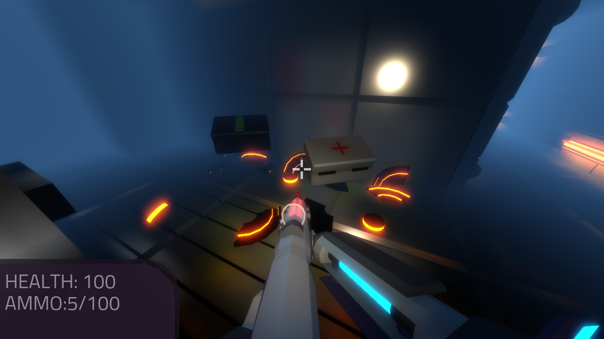
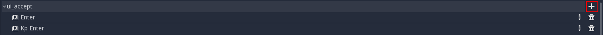

.. _doc_fps_tutorial_part_four:

Part 4
======

Part overview
-------------

In this part, we will be adding health pickups, ammo pickups, targets the player can destroy, support for joypads, and add the ability to change weapons with the scroll wheel.

.. note:: You are assumed to have finished :ref:`doc_fps_tutorial_part_three` before moving on to this part of the tutorial.
          The finished project from :ref:`doc_fps_tutorial_part_three` will be the starting project for part 4

Let's get started!

Adding joypad input
-------------------

.. note:: In Godot, any game controller is referred to as a joypad. This includes:
          Console controllers, Joysticks (like for flight simulators), Wheels (like for driving simulators), VR Controllers, and more!

Firstly, we need to change a few things in our project's input map. Open up the project settings and select the ``Input Map`` tab.

Now we need to add some joypad buttons to our various actions. Click the plus icon and select ``Joy Button``.

Feel free to use whatever button layout you want. Make sure that the device selected is set to ``0``. In the finished project, we will be using the following:

* movement_sprint: ``Device 0, Button 4 (L, L1)``
* fire: ``Device 0, Button 0 (PS Cross, XBox A, Nintendo B)``
* reload: ``Device 0, Button 0 (PS Square, XBox X, Nintendo Y)``
* flashlight: ``Device 0, Button 12 (D-Pad Up)``
* shift_weapon_positive: ``Device 0, Button 15 (D-Pad Right)``
* shift_weapon_negative: ``Device 0, Button 14 (D-Pad Left)``
* fire_grenade: ``Device 0, Button 1 (PS Circle, XBox B, Nintendo A).``

.. note:: These are already set up for you if you downloaded the starter assets

Once you are happy with the input, close the project settings and save.

______

Now let's open up ``Player.gd`` and add joypad input.

First, we need to define a few new class variables. Add the following class variables to ``Player.gd``:

::

    # You may need to adjust depending on the sensitivity of your joypad
    var JOYPAD_SENSITIVITY = 2
    const JOYPAD_DEADZONE = 0.15

Let's go over what each of these does:

* ``JOYPAD_SENSITIVITY``: This is how fast the joypad's joysticks will move the camera.
* ``JOYPAD_DEADZONE``: The dead zone for the joypad. You may need to adjust depending on your joypad.

.. note::  Many joypads jitter around a certain point. To counter this, we ignore any movement
           within a radius of JOYPAD_DEADZONE. If we did not ignore said movement, the camera would jitter.

           Also, we are defining ``JOYPAD_SENSITIVITY`` as a variable instead of a constant because we'll later be changing it.

Now we are ready to start handling joypad input!

______

In ``process_input``, add the following code just before ``input_movement_vector = input_movement_vector.normalized()``:

.. tabs::
 .. code-tab:: gdscript Xbox Controller

    # Add joypad input if one is present
    if Input.get_connected_joypads().size() > 0:

        var joypad_vec = Vector2(0, 0)

        if OS.get_name() == "Windows":
            joypad_vec = Vector2(Input.get_joy_axis(0, 0), -Input.get_joy_axis(0, 1))
        elif OS.get_name() == "X11":
            joypad_vec = Vector2(Input.get_joy_axis(0, 1), Input.get_joy_axis(0, 2))
        elif OS.get_name() == "OSX":
            joypad_vec = Vector2(Input.get_joy_axis(0, 1), Input.get_joy_axis(0, 2))

        if joypad_vec.length() < JOYPAD_DEADZONE:
            joypad_vec = Vector2(0, 0)
        else:
            joypad_vec = joypad_vec.normalized() * ((joypad_vec.length() - JOYPAD_DEADZONE) / (1 - JOYPAD_DEADZONE))

        input_movement_vector += joypad_vec

 .. code-tab:: gdscript PlayStation Controller

    # Add joypad input if one is present
    if Input.get_connected_joypads().size() > 0:

        var joypad_vec = Vector2(0, 0)

        if OS.get_name() == "Windows" or OS.get_name() == "X11":
            joypad_vec = Vector2(Input.get_joy_axis(0, 0), -Input.get_joy_axis(0, 1))
        elif OS.get_name() == "OSX":
            joypad_vec = Vector2(Input.get_joy_axis(0, 1), Input.get_joy_axis(0, 2))

        if joypad_vec.length() < JOYPAD_DEADZONE:
            joypad_vec = Vector2(0, 0)
        else:
            joypad_vec = joypad_vec.normalized() * ((joypad_vec.length() - JOYPAD_DEADZONE) / (1 - JOYPAD_DEADZONE))

        input_movement_vector += joypad_vec

Let's go over what we're doing.

Firstly, we check to see if there is a connected joypad.

If there is a joypad connected, we then get its left stick axes for right/left and up/down.
Because a wired Xbox 360 controller has different joystick axis mapping based on OS, we will use different axes based on
the OS.

.. warning:: This tutorial assumes you are using a XBox 360 or a PlayStation wired controller.
             Also, I do not (currently) have access to a Mac computer, so the joystick axes may need changing.
             If they do, please open a GitHub issue on the Godot documentation repository! Thanks!

Next, we check to see if the joypad vector length is within the ``JOYPAD_DEADZONE`` radius.
If it is, we set ``joypad_vec`` to an empty Vector2. If it is not, we use a scaled Radial Dead zone for precise dead zone calculation.

.. note:: You can find a great article explaining all about how to handle joypad/controller dead zones
          `here <https://web.archive.org/web/20191208161810/http://www.third-helix.com/2013/04/12/doing-thumbstick-dead-zones-right.html>`__.

          We're using a translated version of the scaled radial dead zone code provided in that article.
          The article is a great read, and I highly suggest giving it a look!

Finally, we add ``joypad_vec`` to ``input_movement_vector``.

.. tip:: Remember how we normalize ``input_movement_vector``? This is why! If we did not normalize ``input_movement_vector``, the player could
         move faster if they pushed in the same direction with both the keyboard and the joypad!

______

Make a new function called ``process_view_input`` and add the following:

.. tabs::
 .. code-tab:: gdscript Xbox Controller

    func process_view_input(delta):

        if Input.get_mouse_mode() != Input.MOUSE_MODE_CAPTURED:
            return

        # NOTE: Until some bugs relating to captured mice are fixed, we cannot put the mouse view
        # rotation code here. Once the bug(s) are fixed, code for mouse view rotation code will go here!

        # ----------------------------------
        # Joypad rotation

        var joypad_vec = Vector2()
        if Input.get_connected_joypads().size() > 0:

            if OS.get_name() == "Windows":
                joypad_vec = Vector2(Input.get_joy_axis(0, 2), Input.get_joy_axis(0, 3))
            elif OS.get_name() == "X11":
                joypad_vec = Vector2(Input.get_joy_axis(0, 3), Input.get_joy_axis(0, 4))
            elif OS.get_name() == "OSX":
                joypad_vec = Vector2(Input.get_joy_axis(0, 3), Input.get_joy_axis(0, 4))

            if joypad_vec.length() < JOYPAD_DEADZONE:
                joypad_vec = Vector2(0, 0)
            else:
                joypad_vec = joypad_vec.normalized() * ((joypad_vec.length() - JOYPAD_DEADZONE) / (1 - JOYPAD_DEADZONE))

            rotation_helper.rotate_x(deg2rad(joypad_vec.y * JOYPAD_SENSITIVITY))

            rotate_y(deg2rad(joypad_vec.x * JOYPAD_SENSITIVITY * -1))

            var camera_rot = rotation_helper.rotation_degrees
            camera_rot.x = clamp(camera_rot.x, -70, 70)
            rotation_helper.rotation_degrees = camera_rot
        # ----------------------------------

 .. code-tab:: gdscript PlayStation Controller

     func process_view_input(delta):

        if Input.get_mouse_mode() != Input.MOUSE_MODE_CAPTURED:
            return

        # NOTE: Until some bugs relating to captured mice are fixed, we cannot put the mouse view
        # rotation code here. Once the bug(s) are fixed, code for mouse view rotation code will go here!

        # ----------------------------------
        # Joypad rotation

        var joypad_vec = Vector2()
        if Input.get_connected_joypads().size() > 0:

            if OS.get_name() == "Windows" or OS.get_name() == "X11":
                joypad_vec = Vector2(Input.get_joy_axis(0, 2), Input.get_joy_axis(0, 3))
            elif OS.get_name() == "OSX":
                joypad_vec = Vector2(Input.get_joy_axis(0, 3), Input.get_joy_axis(0, 4))

            if joypad_vec.length() < JOYPAD_DEADZONE:
                joypad_vec = Vector2(0, 0)
            else:
                joypad_vec = joypad_vec.normalized() * ((joypad_vec.length() - JOYPAD_DEADZONE) / (1 - JOYPAD_DEADZONE))

            rotation_helper.rotate_x(deg2rad(joypad_vec.y * JOYPAD_SENSITIVITY))

            rotate_y(deg2rad(joypad_vec.x * JOYPAD_SENSITIVITY * -1))

            var camera_rot = rotation_helper.rotation_degrees
            camera_rot.x = clamp(camera_rot.x, -70, 70)
            rotation_helper.rotation_degrees = camera_rot
        # ----------------------------------

Let's go over what's happening:

Firstly, we check the mouse mode. If the mouse mode is not ``MOUSE_MODE_CAPTURED``, we want to return, which will skip the code below.

Next, we define a new :ref:`Vector2 <class_Vector2>` called ``joypad_vec``. This will hold the right joystick position. Based on the OS, we set its values so
it is mapped to the proper axes for the right joystick.

.. warning:: As stated above, I do not (currently) have access to a Mac computer, so the joystick axes may need changing. If they do,
             please open a GitHub issue on the Godot documentation repository! Thanks!

We then account for the joypad's dead zone, exactly like in ``process_input``.

Then, we rotate ``rotation_helper`` and the player's :ref:`KinematicBody <class_KinematicBody>` using ``joypad_vec``.

Notice how the code that handles rotating the player and ``rotation_helper`` is exactly the same as the
code in ``_input``. All we've done is change the values to use ``joypad_vec`` and ``JOYPAD_SENSITIVITY``.

.. note:: Due to a few mouse-related bugs on Windows, we cannot put mouse rotation in ``process_view`` as well.
          Once these bugs are fixed, this will likely be updated to place the mouse rotation here in ``process_view_input`` as well.

Finally, we clamp the camera's rotation so the player cannot look upside down.

______

The last thing we need to do is add ``process_view_input`` to ``_physics_process``.

Once ``process_view_input`` is added to ``_physics_process``, you should be able to play using a joypad!

.. note:: I decided not to use the joypad triggers for firing because we'd then have to do some more axis managing, and because I prefer to use a shoulder buttons to fire.

          If you want to use the triggers for firing, you will need to change how firing works in ``process_input``. You need to get the axis values for the triggers,
          and check if it's over a certain value, say ``0.8`` for example. If it is, you add the same code as when the ``fire`` action was pressed.

Adding mouse scroll wheel input
-------------------------------

Let's add one more input related feature before we start working on the pickups and the target. Let's add the ability to change weapons using the scroll wheel on the mouse.

Open up ``Player.gd`` and add the following class variables:

::

    var mouse_scroll_value = 0
    const MOUSE_SENSITIVITY_SCROLL_WHEEL = 0.08

Let's go over what each of these new variables will be doing:

* ``mouse_scroll_value``: The value of the mouse scroll wheel.
* ``MOUSE_SENSITIVITY_SCROLL_WHEEL``: How much a single scroll action increases mouse_scroll_value

______

Now let's add the following to ``_input``:

::

    if event is InputEventMouseButton and Input.get_mouse_mode() == Input.MOUSE_MODE_CAPTURED:
        if event.button_index == BUTTON_WHEEL_UP or event.button_index == BUTTON_WHEEL_DOWN:
            if event.button_index == BUTTON_WHEEL_UP:
                mouse_scroll_value += MOUSE_SENSITIVITY_SCROLL_WHEEL
            elif event.button_index == BUTTON_WHEEL_DOWN:
                mouse_scroll_value -= MOUSE_SENSITIVITY_SCROLL_WHEEL

            mouse_scroll_value = clamp(mouse_scroll_value, 0, WEAPON_NUMBER_TO_NAME.size() - 1)

            if changing_weapon == false:
                if reloading_weapon == false:
                    var round_mouse_scroll_value = int(round(mouse_scroll_value))
                    if WEAPON_NUMBER_TO_NAME[round_mouse_scroll_value] != current_weapon_name:
                        changing_weapon_name = WEAPON_NUMBER_TO_NAME[round_mouse_scroll_value]
                        changing_weapon = true
                        mouse_scroll_value = round_mouse_scroll_value

Let's go over what's happening here:

Firstly, we check if the event is an ``InputEventMouseButton`` event and that the mouse mode is ``MOUSE_MODE_CAPTURED``.
Then, we check to see if the button index is either a ``BUTTON_WHEEL_UP`` or ``BUTTON_WHEEL_DOWN`` index.

If the event's index is indeed a button wheel index, we then check to see if it is a ``BUTTON_WHEEL_UP`` or ``BUTTON_WHEEL_DOWN`` index.
Based on whether it is up or down, we add or subtract ``MOUSE_SENSITIVITY_SCROLL_WHEEL`` to/from ``mouse_scroll_value``.

Next, we clamp mouse scroll value to ensure it is inside the range of selectable weapons.

We then check to see if the player is changing weapons or reloading. If the player is doing neither, we round ``mouse_scroll_value`` and cast it to an ``int``.

.. note:: We are casting ``mouse_scroll_value`` to an ``int`` so we can use it as a key in our dictionary. If we left it as a float,
          we would get an error when we tried to run the project.

Next, we check to see if the weapon name at ``round_mouse_scroll_value`` is not equal to the current weapon name using ``WEAPON_NUMBER_TO_NAME``.
If the weapon is different from the player's current weapon, we assign ``changing_weapon_name``, set ``changing_weapon`` to ``true`` so the player will change weapons in
``process_changing_weapon``, and set ``mouse_scroll_value`` to ``round_mouse_scroll_value``.

.. tip:: The reason we are setting ``mouse_scroll_value`` to the rounded scroll value is because we do not want the player to keep their
         mouse scroll wheel just in between values, giving them the ability to switch almost extremely fast. By assigning ``mouse_scroll_value``
         to ``round_mouse_scroll_value``, we ensure that each weapon takes exactly the same amount of scrolling to change.

______

One more thing we need to change is in ``process_input``. In the code for changing weapons, add the following right after the line ``changing_weapon = true``:

::

    mouse_scroll_value = weapon_change_number

Now the scroll value will be changed with the keyboard input. If we did not change this, the scroll value would be out of sync. If the scroll wheel were out of
sync, scrolling forwards or backwards would not transition to the next/last weapon, but rather the next/last weapon the scroll wheel changed to.

______

Now you can change weapons using the scroll wheel! Go give it a whirl!

Adding the health pickups
-------------------------

Now that the player has health and ammo, we ideally need a way to replenish those resources.

Open up ``Health_Pickup.tscn``.

Expand ``Holder`` if it's not already expanded. Notice how we have two Spatial nodes, one called ``Health_Kit`` and another called ``Health_Kit_Small``.

This is because we're actually going to be making two sizes of health pickups, one small and one large/normal. ``Health_Kit`` and ``Health_Kit_Small`` only
have a single :ref:`MeshInstance <class_MeshInstance>` as their children.

Next expand ``Health_Pickup_Trigger``. This is an :ref:`Area <class_Area>` node we're going to use to check if the player has walked close enough to pick up
the health kit. If you expand it, you'll find two collision shapes, one for each size. We will be using a different collision shape size based on the size of the
health pickup, so the smaller health pickup has a trigger collision shape closer to its size.

The last thing to note is how we have an :ref:`AnimationPlayer <class_AnimationPlayer>` node so the health kit bobs and spins around slowly.

Select ``Health_Pickup`` and add a new script called ``Health_Pickup.gd``. Add the following:

::

    extends Spatial

    export (int, "full size", "small") var kit_size = 0 setget kit_size_change

    # 0 = full size pickup, 1 = small pickup
    const HEALTH_AMOUNTS = [70, 30]

    const RESPAWN_TIME = 20
    var respawn_timer = 0

    var is_ready = false

    func _ready():

        $Holder/Health_Pickup_Trigger.connect("body_entered", self, "trigger_body_entered")

        is_ready = true

        kit_size_change_values(0, false)
        kit_size_change_values(1, false)
        kit_size_change_values(kit_size, true)

    func _physics_process(delta):
        if respawn_timer > 0:
            respawn_timer -= delta

            if respawn_timer <= 0:
                kit_size_change_values(kit_size, true)

    func kit_size_change(value):
        if is_ready:
            kit_size_change_values(kit_size, false)
            kit_size = value
            kit_size_change_values(kit_size, true)
        else:
            kit_size = value

    func kit_size_change_values(size, enable):
        if size == 0:
            $Holder/Health_Pickup_Trigger/Shape_Kit.disabled = !enable
            $Holder/Health_Kit.visible = enable
        elif size == 1:
            $Holder/Health_Pickup_Trigger/Shape_Kit_Small.disabled = !enable
            $Holder/Health_Kit_Small.visible = enable

    func trigger_body_entered(body):
        if body.has_method("add_health"):
            body.add_health(HEALTH_AMOUNTS[kit_size])
            respawn_timer = RESPAWN_TIME
            kit_size_change_values(kit_size, false)

Let's go over what this script is doing, starting with its class variables:

* ``kit_size``: The size of the health pickup. Notice how we're using a ``setget`` function to tell if it's changed.
* ``HEALTH_AMMOUNTS``: The amount of health each pickup in each size contains.
* ``RESPAWN_TIME``: The amount of time, in seconds, it takes for the health pickup to respawn
* ``respawn_timer``: A variable used to track how long the health pickup has been waiting to respawn.
* ``is_ready``: A variable to track whether the ``_ready`` function has been called or not.

We're using ``is_ready`` because ``setget`` functions are called before ``_ready``; we need to ignore the
first kit_size_change call, because we cannot access child nodes until ``_ready`` is called. If we did not ignore the
first ``setget`` call, we would get several errors in the debugger.

Also, notice how we are using an exported variable. This is so we can change the size of the health pickups in the editor. This makes it so
we do not have to make two scenes for the two sizes, since we can easily change sizes in the editor using the exported variable.

.. tip:: See :ref:`doc_GDScript` and scroll down to the Exports section for a list of export hints you can use.

______

Let's look at ``_ready``:

Firstly, we connect the ``body_entered`` signal from the ``Health_Pickup_Trigger`` to the ``trigger_body_entered`` function. This makes it so any
body that enters the :ref:`Area <class_Area>` triggers the ``trigger_body_entered`` function.

Next, we set ``is_ready`` to ``true`` so we can use the ``setget`` function.

Then we hide all the possible kits and their collision shapes using ``kit_size_change_values``. The first argument is the size of the kit, while the second argument
is whether to enable or disable the collision shape and mesh at that size.

Then we make only the kit size we selected visible, calling ``kit_size_change_values`` and passing in ``kit_size`` and ``true``, so the size at ``kit_size`` is enabled.

______

Next let's look at ``kit_size_change``.

The first thing we do is check to see if ``is_ready`` is ``true``.

If ``is_ready`` is ``true``, we then make whatever kit already assigned to ``kit_size`` disabled using ``kit_size_change_values``, passing in ``kit_size`` and ``false``.

Then we assign ``kit_size`` to the new value passed in, ``value``. Then we call ``kit_size_change_values`` passing in ``kit_size`` again, but this time
with the second argument as ``true`` so we enable it. Because we changed ``kit_size`` to the passed in value, this will make whatever kit size was passed in visible.

If ``is_ready`` is not ``true``, we simply assign ``kit_size`` to the passed in ``value``.

______

Now let's look at ``kit_size_change_values``.

The first thing we do is check to see which size was passed in. Based on which size we want to enable/disable, we want to get different nodes.

We get the collision shape for the node corresponding to ``size`` and disable it based on the ``enabled`` passed in argument/variable.

.. note:: Why are we using ``!enable`` instead of ``enable``? This is so when we say we want to enable the node, we can pass in ``true``, but since
          :ref:`CollisionShape <class_CollisionShape>` uses disabled instead of enabled, we need to flip it. By flipping it, we can enable the collision shape
          and make the mesh visible when ``true`` is passed in.

We then get the correct :ref:`Spatial <class_Spatial>` node holding the mesh and set its visibility to ``enable``.

This function may be a little confusing; try to think of it like this: We're enabling/disabling the proper nodes for ``size`` using ``enabled``. This is so we cannot pick up
health for a size that is not visible, and so only the mesh for the proper size will be visible.

______

Finally, let's look at ``trigger_body_entered``.

The first thing we do is check whether or not the body that has just entered has a method/function called ``add_health``. If it does, we then
call ``add_health`` and pass in the health provided by the current kit size.

Then we set ``respawn_timer`` to ``RESPAWN_TIME`` so the player has to wait before the player can get health again. Finally, call ``kit_size_change_values``,
passing in ``kit_size`` and ``false`` so the kit at ``kit_size`` is invisible until it has waited long enough to respawn.

_______

The last thing we need to do before the player can use this health pickup is add a few things to ``Player.gd``.

Open up ``Player.gd`` and add the following class variable:

::

    const MAX_HEALTH = 150

* ``MAX_HEALTH``: The maximum amount of health a player can have.

Now we need to add the ``add_health`` function to the player. Add the following to ``Player.gd``:

::

    func add_health(additional_health):
        health += additional_health
        health = clamp(health, 0, MAX_HEALTH)

Let's quickly go over what this does.

We first add ``additional_health`` to the player's current health. We then clamp the health so that it cannot take on a value higher than ``MAX_HEALTH``, nor a value lower
than ``0``.

_______

With that done, the player can now collect health! Go place a few ``Health_Pickup`` scenes around and give it a try. You can change the size of the health pickup in the editor
when a ``Health_Pickup`` instanced scene is selected, from a convenient drop down.

Adding the ammo pickups
-----------------------

While adding health is good and all, we can't reap the rewards from adding it since nothing can (currently) damage us.
Let's add some ammo pickups next!

Open up ``Ammo_Pickup.tscn``. Notice how it's structured exactly the same as ``Health_Pickup.tscn``, but with the meshes and trigger collision shapes changed slightly to account
for the difference in mesh sizes.

Select ``Ammo_Pickup`` and add a new script called ``Ammo_Pickup.gd``. Add the following:

::

    extends Spatial

    export (int, "full size", "small") var kit_size = 0 setget kit_size_change

    # 0 = full size pickup, 1 = small pickup
    const AMMO_AMOUNTS = [4, 1]

    const RESPAWN_TIME = 20
    var respawn_timer = 0

    var is_ready = false

    func _ready():

        $Holder/Ammo_Pickup_Trigger.connect("body_entered", self, "trigger_body_entered")

        is_ready = true

        kit_size_change_values(0, false)
        kit_size_change_values(1, false)

        kit_size_change_values(kit_size, true)

    func _physics_process(delta):
        if respawn_timer > 0:
            respawn_timer -= delta

            if respawn_timer <= 0:
                kit_size_change_values(kit_size, true)

    func kit_size_change(value):
        if is_ready:
            kit_size_change_values(kit_size, false)
            kit_size = value

            kit_size_change_values(kit_size, true)
        else:
            kit_size = value

    func kit_size_change_values(size, enable):
        if size == 0:
            $Holder/Ammo_Pickup_Trigger/Shape_Kit.disabled = !enable
            $Holder/Ammo_Kit.visible = enable
        elif size == 1:
            $Holder/Ammo_Pickup_Trigger/Shape_Kit_Small.disabled = !enable
            $Holder/Ammo_Kit_Small.visible = enable

    func trigger_body_entered(body):
        if body.has_method("add_ammo"):
            body.add_ammo(AMMO_AMOUNTS[kit_size])
            respawn_timer = RESPAWN_TIME
            kit_size_change_values(kit_size, false)

You may have noticed this code looks almost exactly the same as the health pickup. That's because it largely is the same! Only a few things
have been changed, and that's what we're going to go over.

Firstly, notice the change to ``AMMO_AMOUNTS`` from ``HEALTH_AMMOUNTS``. ``AMMO_AMOUNTS`` will be how many ammo clips/magazines the pickup adds to the current weapon.
(Unlike in the case of ``HEALTH_AMMOUNTS``, which has stood for how many health points would be awarded, we add an entire clip to the current weapon instead of the raw ammo amount)

The only other thing to notice is in ``trigger_body_entered``. We're checking for the existence of and calling a function called ``add_ammo`` instead of ``add_health``.

Other than those two small changes, everything else is the same as the health pickup!

_______

All we need to do to make the ammo pickups work is add a new function to the player. Open ``Player.gd`` and add the following function:

::

    func add_ammo(additional_ammo):
        if (current_weapon_name != "UNARMED"):
            if (weapons[current_weapon_name].CAN_REFILL == true):
                weapons[current_weapon_name].spare_ammo += weapons[current_weapon_name].AMMO_IN_MAG * additional_ammo

Let's go over what this function does.

The first thing we check is whether the player is ``UNARMED``. Because ``UNARMED`` does not have a node/script, we want to make sure the player is not
``UNARMED`` before trying to get the node/script attached to ``current_weapon_name``.

Next, we check to see if the current weapon can be refilled. If the current weapon can, we add a full clip/magazine worth of ammo to the weapon by
multiplying the current weapon's ``AMMO_IN_MAG`` value by however many ammo clips we're adding (``additional_ammo``).

_______

With that done, you should now be able to get additional ammo! Go place some ammo pickups in one/both/all of the scenes and give it a try!

.. note:: Notice how we're not limiting the amount of ammo you can carry. To limit the amount of ammo each weapon can carry, you need to add an additional variable to
          each weapon's script, and then clamp the weapon's ``spare_ammo`` variable after adding ammo in ``add_ammo``.

Adding breakable targets
------------------------

Before we end this part, let's add some targets.

Open up ``Target.tscn`` and take a look at the scenes in the scene tree.

Firstly, notice how we're not using a :ref:`RigidBody <class_RigidBody>` node, but a :ref:`StaticBody <class_StaticBody>` one.
The reason behind this is our non-broken targets will not be moving anywhere; using a :ref:`RigidBody <class_RigidBody>` would be more hassle than
it's worth since all it has to do is stay still.

.. tip:: We also save a tiny bit of performance using a :ref:`StaticBody <class_StaticBody>` over a :ref:`RigidBody <class_RigidBody>`.

The other thing to note is we have a node called ``Broken_Target_Holder``. This node is going to hold a spawned/instanced scene called
``Broken_Target.tscn``. Open up ``Broken_Target.tscn``.

Notice how the target is broken up into five pieces, each a :ref:`RigidBody <class_RigidBody>` node. We're going to spawn/instance this scene when the target takes too much damage
and needs to be destroyed. Then, we're going to hide the non-broken target, so it looks like the target shattered rather than a shattered target was
spawned/instanced.

While you still have ``Broken_Target.tscn`` open, attach ``RigidBody_hit_test.gd`` to all of the :ref:`RigidBody <class_RigidBody>` nodes. This will make
it so the player can shoot at the broken pieces and they will react to the bullets.

Alright, now switch back to ``Target.tscn``, select the ``Target`` :ref:`StaticBody <class_StaticBody>` node and create a new script called ``Target.gd``.

Add the following code to ``Target.gd``:

::

    extends StaticBody

    const TARGET_HEALTH = 40
    var current_health = 40

    var broken_target_holder

    # The collision shape for the target.
    # NOTE: this is for the whole target, not the pieces of the target.
    var target_collision_shape

    const TARGET_RESPAWN_TIME = 14
    var target_respawn_timer = 0

    export (PackedScene) var destroyed_target

    func _ready():
        broken_target_holder = get_parent().get_node("Broken_Target_Holder")
        target_collision_shape = $Collision_Shape

    func _physics_process(delta):
        if target_respawn_timer > 0:
            target_respawn_timer -= delta

            if target_respawn_timer <= 0:

                for child in broken_target_holder.get_children():
                    child.queue_free()

                target_collision_shape.disabled = false
                visible = true
                current_health = TARGET_HEALTH

    func bullet_hit(damage, bullet_transform):
        current_health -= damage

        if current_health <= 0:
            var clone = destroyed_target.instance()
            broken_target_holder.add_child(clone)

            for rigid in clone.get_children():
                if rigid is RigidBody:
                    var center_in_rigid_space = broken_target_holder.global_transform.origin - rigid.global_transform.origin
                    var direction = (rigid.transform.origin - center_in_rigid_space).normalized()
                    # Apply the impulse with some additional force (I find 12 works nicely).
                    rigid.apply_impulse(center_in_rigid_space, direction * 12 * damage)

            target_respawn_timer = TARGET_RESPAWN_TIME

            target_collision_shape.disabled = true
            visible = false

Let's go over what this script does, starting with the class variables:

* ``TARGET_HEALTH``: The amount of damage needed to break a fully healed target.
* ``current_health``: The amount of health this target currently has.
* ``broken_target_holder``: A variable to hold the ``Broken_Target_Holder`` node so we can use it easily.
* ``target_collision_shape``: A variable to hold the :ref:`CollisionShape <class_CollisionShape>` for the non-broken target.
* ``TARGET_RESPAWN_TIME``: The length of time, in seconds, it takes for a target to respawn.
* ``target_respawn_timer``: A variable to track how long a target has been broken.
* ``destroyed_target``: A :ref:`PackedScene <class_PackedScene>` to hold the broken target scene.

Notice how we're using an exported variable (a :ref:`PackedScene <class_PackedScene>`) to get the broken target scene instead of
using ``preload``. By using an exported variable, we can choose the scene from the editor, and if we need to use a different scene,
it's as easy as selecting a different scene in the editor; we don't need to go to the code to change the scene we're using.

______

Let's look at ``_ready``.

The first thing we do is get the broken target holder and assign it to ``broken_target_holder``. Notice how we're using ``get_parent().get_node()`` here, instead
of ``$``. If you wanted to use ``$``, then you'd need to change ``get_parent().get_node()`` to ``$"../Broken_Target_Holder"``.

.. note:: At the time of when this was written, I did not realize you can use ``$"../NodeName"`` to get the parent nodes using ``$``, which is why ``get_parent().get_node()``
          is used instead.

Next, we get the collision shape and assign it to ``target_collision_shape``. The reason we need the collision shape is because even when the mesh is invisible, the
collision shape will still exist in the physics world. This makes it so the player could interact with a non-broken target even though it's invisible, which is
not what we want. To get around this, we will disable/enable the collision shape as we make the mesh visible/invisible.

______

Next let's look at ``_physics_process``.

We're only going to be using ``_physics_process`` for respawning, and so the first thing we do is check to see if ``target_respawn_timer`` is greater than ``0``.

If it is, we then subtract ``delta`` from it.

Then we check to see if ``target_respawn_timer`` is ``0`` or less. The reason behind this is since we just removed ``delta`` from ``target_respawn_timer``, if it's
``0`` or less, then the target just got here, effectively allowing us to do whatever we need to do when the timer is finished.

In this case, we want to respawn the target.

The first thing we do is remove all children in the broken target holder. We do this by iterating over all of the children in ``broken_target_holder`` and free them using ``queue_free``.

Next, we enable the collision shape by setting its ``disabled`` boolean to ``false``.

Then we make the target, and all of its children nodes, visible again.

Finally, we reset the target's health (``current_health``) to ``TARGET_HEALTH``.

______

Finally, let's look at ``bullet_hit``.

The first thing we do is subtract however much damage the bullet does from the target's health.

Next we check to see if the target is at ``0`` health or lower. If it is, the target has just died and we need to spawn a broken target.

We first instance a new destroyed target scene, and assign it to a new variable, a ``clone``.

Next we add the ``clone`` as a child of the broken target holder.

For bonus effect, we want to make all the target pieces explode outwards. To do this, we iterate over all the children in ``clone``.

For each child, we first check to see if it's a :ref:`RigidBody <class_RigidBody>` node. If it is, we then calculate the center position of the target relative
to the child node. Then we figure out which direction the child node is relative to the center. Using those calculated variables, we push the child from the calculated center,
in the direction away from the center, using the damage of the bullet as the force.

.. note:: We multiply the damage by ``12`` so it has a more dramatic effect. You can change this to a higher or lower value depending on how explosively you want
          your targets to shatter.

Next, we set the target's respawn timer. We set the timer to ``TARGET_RESPAWN_TIME``, so it takes ``TARGET_RESPAWN_TIME`` in seconds until it is respawned.

Then we disable the non-broken target's collision shape, and set the target's visibility to ``false``.

______

.. warning:: Make sure to set the exported ``destroyed_target`` value for ``Target.tscn`` in the editor! Otherwise the targets will not be destroyed
             and you will get an error!

With that done, go place some ``Target.tscn`` instances around in one/both/all of the levels. You should find they explode into five pieces after they've taken enough
damage. After a little while, they'll respawn into a whole target again.

Final notes
-----------

Now you can use a joypad, change weapons with the mouse's scroll wheel, replenish your health and ammo, and break targets with your weapons.

In the next part, :ref:`doc_fps_tutorial_part_five`, we're going to add grenades to our player, give our player the ability to grab and throw objects, and
add turrets!

.. warning:: If you ever get lost, be sure to read over the code again!

             You can download the finished project for this part here: :download:`Godot_FPS_Part_4.zip <files/Godot_FPS_Part_4.zip>`

