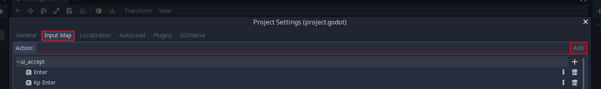

.. _doc_fps_tutorial_part_four:

Part 4
======

Part Overview
-------------

In this part we will be refactoring ``Player.gd`` to use a more modular format, add support for joypads, and add the ability to change weapons with the scroll wheel.

.. image:: img/FinishedTutorialPicture.png

While this part may not be the most interesting, it is very important. Having a clean and modular code base allows us to build
more complex behaviour in the future.

.. note:: You are assumed to have finished :ref:`part three <doc_fps_tutorial_part_three>` before moving on to this part of the tutorial.

.. tip:: You can find the completed code for part three here: https://github.com/TwistedTwigleg/Godot_FPS_Tutorial/tree/part_3
         
         .. image:: img/GithubDownloadZip.png
         
         Just click the green "Clone or download" button and choose "Download Zip" to get the finished project for part 3.

Let's get started!

A quick note
------------

Before we dig into refactoring the code, let's quickly talk about *why* we want to refactor the code.

First, what is refactoring? According to wikipedia:

**"Code refactoring is the process of restructuring existing computer code—changing the factoring—without changing its external behaviour."**

Basically, refactoring is taking code we've already written, and rewriting/restructuring it without changing what it does.

Second, why refactor? There are plenty of reasons why you may want to refactor your code base, but for this tutorial there is really only three
major reasons:

1: By refactoring the code base we can take out certain elements from the various functions in ``player.gd`` and separate them into their own functions/scripts.
``_physics_process`` benefits greatly from this, because while it does work right now, it is very confusing to navigate.

2: With some careful refactoring, we can take out most of the gun logic from ``Player.gd`` and put them into their own scripts. This is key because it easily allows
us to make/edit weapons and their behaviours without having to change much in ``Player.gd``.

3: Currently performance in ``Player.gd`` is okay, but with some work we can make it even better! Performance was not a primary concern for the first three parts
of this tutorial series, and while it still is not a major concern, we ideally want to write code with good performance when possible.

All of these reasons are why we are going to refactor ``Player.gd``.

What we plan on doing in this part is taking our very linear ``Player.gd`` script and make it more modular and extendible. This will allow us
to more easily add features later, as well as make it easier to work with in later parts.

.. note:: Even though part 4 is dedicated to refactoring ``Player.gd``, it is likely we will need to do more refactoring in later parts as we continue to add features!

Breaking it down
----------------

Current a majority of the code in ``Player.gd`` is located in ``_physics_process``. Right now ``_physics_process`` is a huge function with several works parts.
With some refactoring, we can break ``_physics_process`` into several smaller functions.

Ideally we want to make these smaller functions focused on doing a small set of tasks.
This makes it much easier to know where we need to add code to when we are working on new features.

Another benefit of using smaller functions is they are generally easier to debug!

Breaking down input processing
______________________________

First, lets make a function for handling all of the :ref:`Input <class_Input>` related code.
This allows us to more clearly see all of our player input.

Create new function called `process_input` and add the following code:

::
    
    func process_input(delta):
        # ----------------------------------
        # Walking
        
        dir = Vector3()
        var cam_xform = camera.get_global_transform()
        
        var input_movement_vector = Vector2()
        
        # Add keyboard input
        if (Input.is_action_pressed("movement_forward")):
            input_movement_vector.y += 1
        if (Input.is_action_pressed("movement_backward")):
            input_movement_vector.y -= 1
        if (Input.is_action_pressed("movement_left")):
            input_movement_vector.x -= 1
        if (Input.is_action_pressed("movement_right")):
            input_movement_vector.x = 1
        
        input_movement_vector = input_movement_vector.normalized()
        
        dir += -cam_xform.basis.z.normalized() * input_movement_vector.y
        dir += cam_xform.basis.x.normalized() * input_movement_vector.x
        # ----------------------------------
        
        # ----------------------------------
        # Sprinting
        
        if Input.is_action_pressed("movement_sprint"):
            is_spriting = true
        else:
            is_spriting = false
        # ----------------------------------
        
        # ----------------------------------
        # Jumping
        
        if is_on_floor():
            if Input.is_action_just_pressed("movement_jump"):
                vel.y = JUMP_SPEED
        # ----------------------------------
        
        # ----------------------------------
        # Changing weapons.
        
        if changing_gun == false and reloading_gun == false:
            if Input.is_key_pressed(KEY_1):
                current_gun = "UNARMED"
                changing_gun = true
            elif Input.is_key_pressed(KEY_2):
                current_gun = "KNIFE"
                changing_gun = true
            elif Input.is_key_pressed(KEY_3):
                current_gun = "PISTOL"
                changing_gun = true
            elif Input.is_key_pressed(KEY_4):
                current_gun = "RIFLE"
                changing_gun = true
        # ----------------------------------
        
        # ----------------------------------
        # Reloading
        
        if reloading_gun == false:
            if Input.is_action_just_pressed("reload"):
                if current_gun == "PISTOL" or current_gun == "RIFLE":
                    if animation_manager.current_state != "Pistol_reload" and animation_manager.current_state != "Rifle_reload":
                        reloading_gun = true
        # ----------------------------------
        
        # ----------------------------------
        # Firing the weapons
        
        if Input.is_action_pressed("fire"):
            
            if current_gun == "PISTOL":
                if ammo_in_guns["PISTOL"] > 0:
                    if animation_manager.current_state == "Pistol_idle":
                        animation_manager.set_animation("Pistol_fire")
                else:
                    reloading_gun = true
            
            elif current_gun == "RIFLE":
                if ammo_in_guns["RIFLE"] > 0:
                    if animation_manager.current_state == "Rifle_idle":
                        animation_manager.set_animation("Rifle_fire")
                else:
                    reloading_gun = true
            
            elif current_gun == "KNIFE":
                if animation_manager.current_state == "Knife_idle":
                    animation_manager.set_animation("Knife_fire")
        # ----------------------------------
        
        # ----------------------------------
        # Turning the flashlight on/off
        
        if Input.is_action_just_pressed("flashlight"):
            if flashlight.is_visible_in_tree():
                flashlight.hide()
            else:
                flashlight.show()
        # ----------------------------------
        
        # ----------------------------------
        
        # Capturing/Freeing the cursor
        if Input.is_action_just_pressed("ui_cancel"):
            if Input.get_mouse_mode() == Input.MOUSE_MODE_VISIBLE:
                Input.set_mouse_mode(Input.MOUSE_MODE_CAPTURED)
            else:
                Input.set_mouse_mode(Input.MOUSE_MODE_VISIBLE)
        # ----------------------------------

You may have noticed that all of the code so far is exactly the same as the :ref:`Input <class_Input>` relate code already written in ``_physics_process``,
but is now all placed in one function.

There are a few changes though:

Because we are now calling our input code outside of ``_physics_process`` we need to change ``dir`` from a local variable to a global variable.
Add ``var dir = Vector3()`` with the rest of the global variables, ideally nearby the movement code for organization.

.. warning:: Do not forget to change ``dir`` to a global variable!

Another change is we're not directly effecting ``dir`` any more. Before we were changing ``dir`` when a movement action was pressed. Now we are changing a new local variable,
``input_movement_vector``, instead. This will later allow us to have more than one form of directional input. By multiplying ``input_movement_vector`` by the camera's
directional vectors, we get the same result as when we were effecting ``dir`` directly.

Notice how we are normalizing ``input_movement_vector`` as well. This is important because later when we add additional forms of directional input, we do not
want to move faster if two forms of input are moving at the same time. For example, we do not want to move faster if we are pressing the ``UP`` key on the keyboard and also
are pushing forward on a controller. If we did not normalize, then we'd move twice as fast! By normalizing, we make everyone move at the same speed, regardless of how many
input devices they are using.

Breaking down ``KinematicBody`` movement
________________________________________

Next we want to move all of the code relating to moving using the :ref:`KinematicBody <class_KinematicBody>` into its own function.
This allows us to more clearly see what code we are sending :ref:`KinematicBody <class_KinematicBody>` and what it does.

Create a new function and call it ``process_movement``. Lets add the following code:

::
    
    func process_movement(delta):
        var grav = norm_grav
        
        dir.y = 0
        dir = dir.normalized()
        
        vel.y += delta*grav
        
        var hvel = vel
        hvel.y = 0
        
        var target = dir
        if is_spriting:
            target *= MAX_SPRINT_SPEED
        else:
            target *= MAX_SPEED
        
        var accel
        if dir.dot(hvel) > 0:
            if is_spriting:
                accel = SPRINT_ACCEL
            else:
                accel = ACCEL
        else:
            accel = DEACCEL
        
        hvel = hvel.linear_interpolate(target, accel*delta)
        vel.x = hvel.x
        vel.z = hvel.z
        vel = move_and_slide(vel,Vector3(0,1,0), 0.05, 4, deg2rad(MAX_SLOPE_ANGLE))

Thankfully nothing is has changed here, all we've done is moved the code out of ``_physics_process``.

.. warning:: If you are using Godot ``master`` branch (or Godot 3.1), you will need to change ``vel = move_and_slide(vel,Vector3(0,1,0), 0.05, 4, deg2rad(MAX_SLOPE_ANGLE))``
             to ``vel = move_and_slide(vel,Vector3(0,1,0), true, 0.05, 4, deg2rad(MAX_SLOPE_ANGLE))``.

Now when we are ready to have the :ref:`KinematicBody <class_KinematicBody>` process our movement and send us through space, all we need to do is call ``process_movement``.

Changing the weapon code structure
----------------------------------

So far, we have not really changed the structure of the code, we've just shuffled it around, so lets change that.

One of the major things we ideally want to change is how the weapon code is handled. Currently all of the weapon realted code is all in ``Player.gd``, everything
from how much ammo a weapon carries, to firing bullets. While this has the advantage of having all of your code in one place, it would be much
nicer if we make a weapon interface so we can create/change weapons easily without having to scroll through ``Player.gd`` to look for the bit of code we want to add/change.

Open up ``Player.tscn`` and navigate to the ``Gun_fire_points`` node. Lets make the pistol first. Select ``Pistol_point`` and attach a node node and call it
``Weapon_Pistol.gd``.

Our weapon scripts are going to do four things: They're going to handle *firing*, *reloading*, *equipping*, and *unequipping*.

Add the following code to ``Weapon_Pistol.gd``:

::
    
    extends Spatial

    var ammo_in_weapon = 20;
    var spare_ammo = 60;
    const AMMO_IN_MAG = 20;
    const DAMAGE = 15;

    const CAN_RELOAD = true;

    const RELOADING_ANIM_NAME = "Pistol_reload"
    const IDLE_ANIM_NAME = "Pistol_idle"
    const FIRE_ANIM_NAME = "Pistol_fire"

    var is_weapon_enabled = false;

    var bullet_scene = preload("Bullet_Scene.tscn")

    var player_node = null;

    func _ready():
        pass;

    func fire_weapon():
        var clone = bullet_scene.instance()
        var scene_root = get_tree().root.get_children()[0]
        scene_root.add_child(clone)
        
        clone.global_transform = self.global_transform
        clone.scale = Vector3(4, 4, 4)
        clone.BULLET_DAMAGE = DAMAGE;
        ammo_in_weapon -= 1
        
        player_node.create_sound("Pistol_shot", self.global_transform.origin)

    func reload_weapon():
        var can_reload = false;
        
        if player_node.animation_manager.current_state == IDLE_ANIM_NAME:
            can_reload = true
        
        if spare_ammo <= 0 or ammo_in_weapon == AMMO_IN_MAG:
            can_reload = false
        
        if can_reload == true:
            var ammo_needed = AMMO_IN_MAG - ammo_in_weapon;
            
            if spare_ammo >= ammo_needed:
                spare_ammo -= ammo_needed
                ammo_in_weapon = AMMO_IN_MAG;
            else:
                ammo_in_weapon += spare_ammo
                spare_ammo = 0
            
            player_node.animation_manager.set_animation("Pistol_reload")
            
            player_node.create_sound("Gun_cock", player_node.camera.global_transform.origin)
            
            return true;
        
        return false;

    func equip_weapon():
        if player_node.animation_manager.current_state == IDLE_ANIM_NAME:
            is_weapon_enabled = true;
            return true
        
        if player_node.animation_manager.current_state == "Idle_unarmed":
            player_node.animation_manager.set_animation("Pistol_equip")
            
            player_node.create_sound("Gun_cock", player_node.camera.global_transform.origin)
        
        return false

    func unequip_weapon():
        
        if player_node.animation_manager.current_state == IDLE_ANIM_NAME:
            if (player_node.animation_manager.current_state != "Pistol_unequip"):
                player_node.animation_manager.set_animation("Pistol_unequip")
        
        if player_node.animation_manager.current_state == "Idle_unarmed":
            is_weapon_enabled = false;
            return true
        else:
            return false

            
Lets go over what is happening in this script:

______

First lets look at the constants and go over what each will do:

* ``ammo_in_weapon``: How much ammo is *currently* in this weapon.
* ``spare_ammo``: How much spare ammo we have in reserve for this weapon. ``spare_ammo + ammo_in_weapon = total ammo for this weapon``.
* ``AMMO_IN_MAG``: The amount ammo needed to fill the weapon. To put it another way, the amount of ammo in each magazine.
* ``DAMAGE``: The amount of damage a single bullet does.
* ``CAN_RELOAD``: A boolean for tracking whether this weapon has the ability to reload.
* ``RELOADING_ANIM_NAME``: The name of the reloading animation for this weapon.
* ``IDLE_ANIM_NAME``: The name of the idle animation for this weapon.
* ``FIRE_ANIM_NAME``: The name of the firing animation for this weapon.
* ``is_weapon_enabled``: A boolean for tracking whether or not this weapon is the currently used/enabled weapon.
* ``bullet_scene``: The bullet scene we created in part 2 of this tutorial.
* ``player_node``: The player node and script (``Player.gd``).

______

Notice how we do not do anything in ``_ready``.

We could try and grab the player node here, but it makes a messy ``get_node`` call, and because we already
have to aim these points in ``Player.gd`` anyway, we will just pass the player node then.

.. note:: This is just a design choice. Depending on your project, it may be better to use ``get_node`` in the
          weapon scripts.

______

Lets look at ``fire_weapon``.

First we make a clone of the bullet scene and add it as a child of the scene root.
Next we set its global transform to ``self.global_transform``.

.. note:: before we were using a ``get_node`` call to
          get here because we were calling this from ``Player.gd``. Now that we are firing from the fire point itself, we do not
          need to use ``get_node`` any more.

Then we set its scale. As before, the bullet object is too small by default, so we scale it up so it's easier to see.

Next we set its damage. This is new, but nothing crazy. To make this work, we just need to go into
``Bullet_script.gd`` and change ``const BULLET_DAMAGE`` to ``var BULLET_DAMAGE``. The reason behind changing ``BULLET_DAMAGE`` from
a constant to a normal variable is because we may reuse the bullet object later (for a different weapon)

.. warning:: Do not forgot to change ``const BULLET_DAMAGE`` to ``var BULLET_DAMAGE`` in ``Bullet_script.gd``!

Then we remove one from the ammo in our weapon and play a sound (if we have sounds).

.. note:: With the exception of how we are no longer using ``get_node``, everything in ``fire_weapon`` is the same as the code
          as ``Player.gd``'s ``fire_bullet`` function.

______

In ``reload_weapon`` we are doing things a little differently.

First we define a variable to track whether or not we can reload. We then do a couple checks. The first check is checking whether
or not we are in this weapon's idle animation. We do not want to reload while we are playing any other animation, so this check ensures
that does not happen.

The next thing we check is whether or not we have any ammo in reserve and/or if our weapon is full. We cannot reload with no spare ammo, and
we do not want the player to be able to reload if the weapon is already full.

.. tip:: In some games you can reload while full. Many times in these cases you lose whatever ammo was in the weapon when you reload.
         For this tutorial though, we will only allow the player to reload if they do not have a full weapon.

Then we check ``can_reload`` to see if it is true.

If it is, we then calculate how much ammo we need to fill the weapon.

If we have enough ammo in spares to fill the weapon, we remove the ammo we are taking from spares and set ``ammo_in_weapon`` to however much ammo is in a full weapon.

If we do not have enough ammo in spares, we instead add all of the ammo left in spares and then set our spare ammo to zero.

We then play the reloading animation and play a sound. We return ``true`` to signal we have successfully reloaded.

If we cannot reload because ``reload_weapon`` is ``false``, we return ``false`` to signal we did not successfully reload.

______

For ``equip_weapon`` we first check if the player is in the pistol's idle state.

If we are in the pistol's idle state we've successfully equipped the pistol.
We set ``is_weapon_enabled`` to ``true`` because we are now using this weapon, and return ``true``.

.. note:: We need ``is_weapon_enabled`` so we do not keep trying to equip/unequip the weapons over and over again. If we relied only on using
          the ``equip_weapon``/``unequip_weapon`` functions, we could possibility get cases where we are stuck in a loop where we are equipping/unequipping
          the same weapon over and over again.

Next we check if we are in the idle unarmed state, a state where we can transition to our equip animation. If we are, then we change the animation
to ``Pistol_equip`` and play a sound. Finally, we return ``false``.

The reason behind returning ``false`` unless we are in our idle animation is because we will be calling this function more than once, checking to see if we
have successfully equipped the pistol.

______

``unequip_weapon`` is extremely similar to ``equip_weapon``, but the checks are in reverse.

We just check if we are in our idle state. If we are, and we are not already unequipping we set our animation to ``Pistol_unequip``.
Then we check if we are in the idle animation. If we are, we set ``is_weapon_enabled`` to ``false`` because we are no longer using this weapon, and return ``true``.

Finally, if we did not return ``true``, we return false.

As with ``equip_weapon``, we want to return false by default because we will be calling this function until it returns true.

______

Now we just need to do the same thing for the knife and the rifle.

There is only one minor difference with the knife and the rifle. We still define a reload function for the knife, but instead of doing
anything we automatically return false.

Select ``Knife_point``, created a new script called ``Weapon_Knife.gd``, and add the following:

::
    
    extends Spatial

    var ammo_in_weapon = 1;
    var spare_ammo = 1;
    const AMMO_IN_MAG = 1;

    const DAMAGE = 40;

    const CAN_RELOAD = false;
    const RELOADING_ANIM_NAME = ""
    const IDLE_ANIM_NAME = "Knife_idle"
    const FIRE_ANIM_NAME = "Knife_fire"

    var is_weapon_enabled = false;

    var player_node = null;

    func _ready():
        pass;

    func fire_weapon():
        var area = get_node("Area")
        var bodies = area.get_overlapping_bodies()
        
        for body in bodies:
            if body.has_method("bullet_hit"):
                body.bullet_hit(DAMAGE, area.global_transform.origin)

    func reload_weapon():
        return false;

    func equip_weapon():
        if player_node.animation_manager.current_state == IDLE_ANIM_NAME:
            is_weapon_enabled = true;
            return true
        
        if player_node.animation_manager.current_state == "Idle_unarmed":
            player_node.animation_manager.set_animation("Knife_equip")
        
        return false

    func unequip_weapon():
        
        if player_node.animation_manager.current_state == IDLE_ANIM_NAME:
            player_node.animation_manager.set_animation("Knife_unequip")
        
        if player_node.animation_manager.current_state == "Idle_unarmed":
            is_weapon_enabled = false;
            return true
        
        return false

There are only a few things to note here.

The first is we still are defining ``ammo_in_weapon``, ``spare_ammo`` and ``AMMO_IN_MAG``. The reason behind this is so our code has a consistent
interface. We may later need to access these variables in all weapons, so we are adding them for the knife as a way assure all weapons have these variables.

The second thing of note is in ``reload_weapon``. Because we cannot reload a knife (or at least, not this one), we just always return ``false``.

The last thing to note is how ``fire_weapon``'s code is exactly the same as the code from ``Player.gd``. The firing code for all three weapons,
the pistol, rifle, and knife, are exactly the same as the code in ``Player.gd``. The only differences is how we are accessing the spawn point nodes
and their children.

______

Finally, select ``Rifle_point``, create a new script called ``Weapon_Rifle.gd``, and add the following code:

::
    
    extends Spatial

    var ammo_in_weapon = 80;
    var spare_ammo = 160;
    const AMMO_IN_MAG = 80;
    const DAMAGE = 4;

    const CAN_RELOAD = true;
    const RELOADING_ANIM_NAME = "Rifle_reload"
    const IDLE_ANIM_NAME = "Rifle_idle"
    const FIRE_ANIM_NAME = "Rifle_fire"

    var is_weapon_enabled = false;

    var player_node = null;

    func _ready():
        pass;

    func fire_weapon():
        var ray = get_node("RayCast")
        ray.force_raycast_update()
        
        if ray.is_colliding():
            var body = ray.get_collider()
            if body.has_method("bullet_hit"):
                body.bullet_hit(DAMAGE, ray.get_collision_point())
        
        ammo_in_weapon -= 1;
        
        player_node.create_sound("Rifle_shot", ray.global_transform.origin)

    func reload_weapon():
        var can_reload = false;
        
        if player_node.animation_manager.current_state == IDLE_ANIM_NAME:
            can_reload = true
        
        if spare_ammo <= 0 or ammo_in_weapon == AMMO_IN_MAG:
            can_reload = false
        
        if can_reload == true:
            var ammo_needed = AMMO_IN_MAG - ammo_in_weapon;
            
            if spare_ammo >= ammo_needed:
                spare_ammo -= ammo_needed
                ammo_in_weapon = AMMO_IN_MAG;
            else:
                ammo_in_weapon += spare_ammo
                spare_ammo = 0
            
            player_node.animation_manager.set_animation("Rifle_reload")
            
            player_node.create_sound("Gun_cock", player_node.camera.global_transform.origin)
            
            return true;
        
        return false;

    func equip_weapon():
        if player_node.animation_manager.current_state == IDLE_ANIM_NAME:
            is_weapon_enabled = true;
            return true
        
        if player_node.animation_manager.current_state == "Idle_unarmed":
            player_node.animation_manager.set_animation("Rifle_equip")
            
            player_node.create_sound("Gun_cock", player_node.camera.global_transform.origin)
        
        return false

    func unequip_weapon():
        
        if player_node.animation_manager.current_state == IDLE_ANIM_NAME:
            if (player_node.animation_manager.current_state != "Rifle_unequip"):
                player_node.animation_manager.set_animation("Rifle_unequip")
        
        if player_node.animation_manager.current_state == "Idle_unarmed":
            is_weapon_enabled = false;
            return true
        
        return false

Thankfully the code for the rifle is exactly the same as the pistol, with ``fire_weapon`` changed to use the rifle's firing code. Other than that, everything is exactly the same,
just adjusted for the rifle.
        
Finishing refactoring ``Player.gd``
-----------------------------------

Now we are ready to use our newly refactored weapons in ``Player.gd``. First, we need to change some of the global variables.
Find all of the constants relating to the weapons, delete them, and add the following:

::
    
    var current_weapon_name = "UNARMED"
    var weapons = {"UNARMED":null, "KNIFE":null, "PISTOL":null, "RIFLE":null}
    const weapon_number_to_name = {0:"UNARMED", 1:"KNIFE", 2:"PISTOL", 3:"RIFLE"}
    const weapon_name_to_number = {"UNARMED":0, "KNIFE":1, "PISTOL":2, "RIFLE":3}
    var changing_weapon = false
    var changing_weapon_name = "UNARMED"
    var reloading_weapon = false

Lets go over each of these new global variables:

* ``current_weapon_name``: The name of the weapon currently in use.
* ``weapons``: A dictionary holding all of the weapon nodes, allowing us to access them by name instead of using ``get_node``.
* ``weapon_number_to_name``: A dictionary holding all of the weapons and which number they represent.
* ``weapon_name_to_number``: A dictionary holding all of the weapons numbers and which names they represent. Combined with ``weapon_number_to_name``, we can change from number to name and back.
* ``changing_weapon``: A boolean to track whether we are trying to change weapons or not.
* ``changing_weapon_name``: The name of the weapon we are trying to change to.
* ``reloading_weapon``: A boolean to track whether we are reloading or not.

We need to change ``_ready`` to the following:

::
    
    func _ready():
        camera = get_node("Rotation_helper/Camera")
        rotation_helper = get_node("Rotation_helper")
        
        animation_manager = get_node("Rotation_helper/Model/AnimationPlayer")
        animation_manager.callback_function = funcref(self, "fire_bullet")
        
        set_physics_process(true)
        
        Input.set_mouse_mode(Input.MOUSE_MODE_CAPTURED)
        set_process_input(true)
        
        weapons["KNIFE"] = get_node("Rotation_helper/Gun_fire_points/Knife_point")
        weapons["PISTOL"] = get_node("Rotation_helper/Gun_fire_points/Pistol_point")
        weapons["RIFLE"] = get_node("Rotation_helper/Gun_fire_points/Rifle_point")
        
        var gun_aim_point_pos = get_node("Rotation_helper/Gun_aim_point").global_transform.origin
        
        for weapon in weapons:
            var weapon_node = weapons[weapon]
            if weapon_node != null:
                weapon_node.player_node = self
                weapon_node.look_at(gun_aim_point_pos, Vector3(0, 1, 0))
                weapon_node.rotate_object_local(Vector3(0, 1, 0), deg2rad(180))
        
        current_weapon_name = "UNARMED"
        changing_weapon_name = "UNARMED"
        
        UI_status_label = get_node("HUD/Panel/Gun_label")
        flashlight = get_node("Rotation_helper/Flashlight")

Lets quickly go over the new stuff.

Notice how most of the code is exactly the same as before. The only code that's changed is how
we are handling the gun aim points, so let's look at those changes.

First, we get all of the weapon nodes using ``get_node`` and assign them to the ``weapons`` dictionary.

Then we loop through all of the weapons in the ``weapons`` dictionary. For each weapon node, we get the value assigned to that key.

.. tip:: When we are using ``for X in Y`` where ``Y`` is a dictionary, ``X`` is assigned to the each **key** in the dictionary, not the value. To get the value, we
          have to retrieve it using ``Y[X]``.

If the weapon node is not ``null``, we set it's ``player_node`` variable to ``self``, and we make the point look at the gun aim position.

.. note:: The reason we check for ``null`` is because our ``UNARMED`` weapon is ``null``. This is just a design choice, not a requirement for FPS games.
          You could define a "weapon" for the UNARMED state, but in this series we are just going to use ``null``.

Next we flip the aim point by ``180`` degrees so it doesn't fire backwards.

.. warning:: The reason behind rotating the gun aim point is explained in :ref:`part 2 <doc_fps_tutorial_part_two>`

Finally, we set ``current_weapon_name`` and ``changing_weapon_name`` to ``UNARMED`` so our starting weapon is ``UNARMED``.

______

Now we need to change ``_physics_process``. Delete everything in ``_physics_process`` and add the following:

::
    
    func _physics_process(delta):
        process_input(delta)
        #process_view_input(delta)
        process_movement(delta)
        process_changing_weapons(delta)
        process_reloading(delta)
        process_UI(delta)

.. note:: You may have noticed how we have a commented out function, ``process_view_input``. We will be using this later!
          For now just leave it commented out!

Now we are calling each of our modular functions in order. Notice how we are still missing
``process_changing_weapons``, ``process_reloading``, and ``process_UI``. Before we add those functions, lets quickly return to
``process_input``.

Finishing ``process_input``
___________________________

First, lets change ``process_input`` so our weapon related code works with the new weapon system.

First, delete all of the weapon related code in `process_input`. This is the includes:
Changing weapons, Reloading, and Firing.

Now at the bottom of ``process_input``, add the following code:

::
    
    func process_input(delta):
        
        # Other input code (like movement, jumping, etc) above!
        
        # ----------------------------------
        # Changing weapons.
        var weapon_change_number = weapon_name_to_number[current_weapon_name]
        
        if Input.is_key_pressed(KEY_1):
            weapon_change_number = 0
        if Input.is_key_pressed(KEY_2):
            weapon_change_number = 1
        if Input.is_key_pressed(KEY_3):
            weapon_change_number = 2
        if Input.is_key_pressed(KEY_4):
            weapon_change_number = 3
        
        if Input.is_action_just_pressed("shift_weapon_positive"):
            weapon_change_number += 1
        if Input.is_action_just_pressed("shift_weapon_negative"):
            weapon_change_number -= 1
        
        weapon_change_number = clamp(weapon_change_number, 0, weapon_number_to_name.size()-1)
        
        if changing_weapon == false:
            if reloading_weapon == false:
                if weapon_number_to_name[weapon_change_number] != current_weapon_name:
                    changing_weapon_name = weapon_number_to_name[weapon_change_number]
                    changing_weapon = true
        # ----------------------------------
        
        # ----------------------------------
        # Reloading
        if reloading_weapon == false:
            if changing_weapon == false:
                if Input.is_action_just_pressed("reload"):
                    var current_weapon = weapons[current_weapon_name]
                    if current_weapon != null:
                        if current_weapon.CAN_RELOAD == true:
                            var current_anim_state = animation_manager.current_state
                            var is_reloading = false
                            for weapon in weapons:
                                var weapon_node = weapons[weapon]
                                if weapon_node != null:
                                    if current_anim_state == weapon_node.RELOADING_ANIM_NAME:
                                        is_reloading = true
                            if is_reloading == false:
                                reloading_weapon = true
        # ----------------------------------
        
        # ----------------------------------
        # Firing the weapons
        if Input.is_action_pressed("fire"):
            if reloading_weapon == false:
                if changing_weapon == false:
                    var current_weapon = weapons[current_weapon_name]
                    if current_weapon != null:
                        if current_weapon.ammo_in_weapon > 0:
                            if animation_manager.current_state == current_weapon.IDLE_ANIM_NAME:
                                animation_manager.set_animation(current_weapon.FIRE_ANIM_NAME)
                        else:
                            reloading_weapon = true
        # ----------------------------------

Lets go through what each of these sections are doing.

______

Lets look at the weapon changing section first.

The first thing we do is get the current weapon number and assign it to ``weapon_change_number``.

Next we check each of the four number keys and we assign ``weapon_change_number`` to their value if they are pressed.

.. note:: Most keyboards go in the order of ``1234567890``, so we when we set ``weapon_change_number``, we offset the value by ``-1`` so the first key (``1``)
          is actually ``0``, which is our first weapon.

Then we check if two new actions are pressed: ``shift_weapon_positive`` and ``shift_weapon_negative``. We will add these actions once we've finished
going over ``process_input``.

Next we clamp ``weapon_change_number`` so it cannot be higher or lower than the amount of weapons we have.

.. tip:: We are making a small assumption here: We are assuming our weapons are defined in a linear pattern, where we do not have any jumps in number.
         
         Another thing to note is we are getting the maximum value using ``weapon_to_number.size()-1``. We remove ``1`` because ``size`` returns the number
         of elements in the dictionary, starting from ``1``, while GDScript accesses values starting from ``0``.

We do not want to suddenly change weapons while already changing weapons or reload, so we check to make sure both variables are ``false``.

Then we convert ``weapon_change_number`` to a weapon name using ``weapon_number_to_name`` and check to make sure we not trying to change to the weapon we
are already using. If we are indeed changing weapons, we set ``changing_weapon_name`` to the name of the weapon at ``weapon_change_name`` using ``weapon_number_to_name``.
Finally, we set ``changing_weapon`` to true so we can process the actual weapon changing logic in ``process_changing_weapons``.

______

For reloading we first check to make sure we are not already reload, or changing weapons.

Then we check to see if the reloading action has been pressed.
Next we get the current weapon and assign it to ``current_weapon``.
If the current weapon is not ``null`` we then make sure this weapon can reload using the weapon's ``CAN_RELOAD`` constant.

.. tip:: We check for ``null`` because we do not want to reload ``UNARMED``!

Next we check get the current animation state from our animation manager, and we set ``is_reloading`` to ``false``.
The reason we need ``is_reloading`` is because we need to go through each weapon and make sure we are not in it's reloading state already,
because we do not want to allow the player to (potentially) reload if they are already in a reloading animation.

We then go through each weapon in our ``weapons`` dictionary. We then get the weapon node, assign it to ``weapon_node`` and check to make sure it
is not ``null``. If it is not ``null``, we then make sure it's ``RELOADING_ANIM_NAME`` constant to see if it is equal to the animation we are currently in. If it is,
we set ``is_reloading`` to ``true``.

If ``is_reloading`` is still ``false``, we then set ``reloading_weapon`` to true so we can process the reloading weapon logic in ``process_reloading``.

______

Finally, we have the firing section.

The first thing we do is check to see if the ``fire`` action has been pressed. If it has, we then make sure we are not reloading or changing weapons.

Next we get the current weapon and assign it to ``current_weapon``. We then check to make sure it is not equal to ``null``.

If the current weapon is not equal to ``null``, we then make sure the weapon actually has ammo. If it does, we then check to see if we are in the weapon's idle state.
If we are indeed in the weapon's idle state, we set our animation to the weapon's fire animation.

If the current weapon does not have any ammo, we set ``reloading_weapon`` to true.

Adding our new input map actions
________________________________

As mentioned above, we've defined a couple new input actions: ``shift_weapon_positive`` and ``shift_weapon_negative``.
Currently these input actions do not exist in our project, so let's add them!

Open up your project settings and go to the ``Input Map`` tab. In the ``Action`` text field, type ``shift_weapon_positive`` and press enter or press the
button on the side that reads ``Add``. Next write ``shift_weapon_negative`` and press enter or press the ``Add`` button.

Scroll down to the bottom of the list and click the little plus sign next to one of the newly created actions.

.. image:: img/ProjectSettingsAddKey.png

You can assign whatever key you want to either
of these actions. The finished project has the ``Equal`` and ``Kp Add`` keys assigned to ``shift_weapon_positive``. ``shift_weapon_negative`` has ``Minus`` and
``Kp Subtract`` keys assigned in the finished project.

Once you've assigned whatever keys you want to both actions, close the project settings and save.

Adding ``process_changing_weapons``
___________________________________

Lets make the weapon changing logic next. Open up ``Player.gd`` and add the following function:

::
    
    func process_changing_weapons(delta):
        if changing_weapon == true:
            
            var weapon_unequipped = false
            var current_weapon = weapons[current_weapon_name]
            
            if current_weapon == null:
                weapon_unequipped = true
            else:
                if current_weapon.is_weapon_enabled == true:
                    weapon_unequipped = current_weapon.unequip_weapon()
                else:
                    weapon_unequipped = true
            
            if weapon_unequipped == true:
                
                var weapon_equiped = false
                var weapon_to_equip = weapons[changing_weapon_name]
                
                if weapon_to_equip == null:
                    weapon_equiped = true
                else:
                    if weapon_to_equip.is_weapon_enabled == false:
                        weapon_equiped = weapon_to_equip.equip_weapon()
                    else:
                        weapon_equiped = true
                
                if weapon_equiped == true:
                    changing_weapon = false
                    current_weapon_name = changing_weapon_name
                    changing_weapon_name = ""

Lets go over what's happening here.

First we check to make sure ``changing_weapon`` is ``true``.

Next we make a new variable, ``weapon_unequipped``, and set it to ``false``. We will use ``weapon_unequipped`` to check whether or not the current weapon is unequipped.
We then get the current weapon and assign it to ``current_weapon``.

If the current weapon is ``null``, if we are ``UNARMED``, we can conclude the weapon has been successfully unequipped and set ``weapon_unequipped`` to ``true``.

If the weapon is not ``null``, we check if the weapon is enabled. If the weapon is enabled, we call it's ``unequip_weapon`` function. If it is not enabled, we set ``weapon_unequipped`` to ``true``.

Next we check if ``weapon_unequipped`` is ``true`` or not. Remember, ``weapon_unequipped`` will only be true if the current weapon's ``is_weapon_enabled`` variable is ``false`` (or the weapon
is ``null``).

If the current weapon is successfully unequipped, we then make a variable, ``weapon_equipped``. ``weapon_equipped`` will serve the same function as ``weapon_unequipped``, but instead of
tracking if we've successfully unequipped the current weapon, we instead are tracking to see if the weapon we are wanting to change to has been successfully equipped.

We then get the weapon we want to change to and assign it to ``weapon_to_equip``.

Next we check to see if ``weapon_to_equip`` is ``null``. If it is, we set ``weapon_equipped`` to ``true`` because ``UNARMED`` does not need any additional processing.

If ``weapon_to_equip`` is not null, we then check to see if the weapon is not enabled by checking it's ``is_weapon_enabled`` variable. If it is not enabled, we call ``equip_weapon``
on the weapon we are wanting to equip.

If the weapon we are wanting to equip is enabled, we set ``weapon_equipped`` to true.

Finally, we check to see if ``weapon_equipped`` is ``true``. If it is, we set ``changing_weapon`` to ``false``, set ``current_weapon_name`` to the weapon we have changed to (``changing_weapon_name``),
and we set ``changing_weapon_name`` to a empty string.

Adding ``process_reloading``
____________________________

Let's finish up our new modular weapon system and add ``process_reloading``. Make a new funciton called ``process_reloading`` and add the following:

::
    
    
    func process_reloading(delta):
        if reloading_weapon == true:
            var current_weapon = weapons[current_weapon_name]
            if current_weapon != null:
                current_weapon.reload_weapon()
            reloading_weapon = false

Let's go over what's this function does.

First we check to make sure we are wanting to reload. If we are, we then get the current weapon and assign it to ``current_weapon``.
If ``current_weapon`` is not equal to ``null``, we call it's ``reload_weapon`` function.

Finally, we set ``reloading_weapon`` to ``false`` because regardless of whether we've successfully reloaded, we have tried and no longer
need to process weapon reloading.

Changing ``fire_bullet``
________________________

Next we need to change ``fire_bullet`` because we are no longer actually firing the bullets in ``Player.gd``. Change ``fire_bullet`` to the following:

::
    
    func fire_bullet():
        if changing_weapon == true:
            return
        weapons[current_weapon_name].fire_weapon()

Now in ``fire_bullet`` we make sure we are not changing weapons, and if we are not we call the current weapon's ``fire_weapon`` function.
        

Adding ``process_UI``
_____________________

Because we've changed how weapons work, we need to change how we update the UI.
Make a new function called ``process_UI`` and add the following:

::
    
    func process_UI(delta):
        if current_weapon_name == "UNARMED" or current_weapon_name == "KNIFE":
            UI_status_label.text = "HEALTH: " + str(health)
        else:
            var current_weapon = weapons[current_weapon_name]
            UI_status_label.text = "HEALTH: " + str(health) + "\nAMMO:" + \
            str(current_weapon.ammo_in_weapon) + "/" + str(current_weapon.spare_ammo)

        
Nothing much has changed from the code that was in ``_physics_process``, we've mainly just moved the UI processing code to
its own function.

The only major change is how we get the amount counts in the current weapon.

______

Now we have successfully refactored ``Player.gd`` to use a more modular approach and the weapons now are (mainly) processed in their own scripts!
Go give the game a test. If everything is written correctly you should be able to run around and shoot things just like before.

Now that we've refactored ``Player.gd``, lets add something new: Let's allow our plays to play using a joypad!

Adding joypad input
-------------------

.. note:: In Godot any game controller is referred to as a joypad. This includes:
          Console controllers, Joysticks (like for flight simulators), Wheels (like for driving simulators), VR Controllers, and more.

First we need to change a few things in our project's input map. Open up the project settings and select the ``Input Map`` tab.

Now we need to add some joypad buttons to our various actions. Click the plus icon and select ``Joy Button``.

.. image:: img/ProjectSettingsAddKey.png

Feel free to use whatever button layout you want. Make sure that the device selected is set to ``0``. In the finished project, we will be using the following:

* movement_sprint: ``Device 0, Button 4 (L, L1)``
* fire: ``Device 0, Button 0 (PS Cross, XBox A, Nintendo B)``
* reload: ``Device 0, Button 0 (PS Square, XBox X, Nintendo Y)``
* flashlight: ``Device 0, Button 12 (D-Pad Up)``
* shift_weapon_positive: ``Device 0, Button 15 (D-Pad Right)``
* shift_weapon_negative: ``Device 0, Button 14 (D-Pad Right)``

Once you are happy with the input, close the project settings and save.

______

Now let's open up ``Player.gd`` and add joypad input.

First, we need to define a few new global variables. Add the following global variables to ``Player.gd``:

::
    
    # You may need to adjust depending on the sensitivity of your joypad
    const JOYPAD_SENSITIVITY = 2
    const JOYPAD_DEADZONE = 0.15

Lets go over what each of these do:

* ``JOYPAD_SENSITIVITY``: This is how fast our joypad joysticks will move our camera.
* ``JOYPAD_DEADZONE``: The dead zone for the joypad. You may need to adjust depending on your joypad.

.. note::  Many joypads jitter around a certain point. To counter this, we ignore any movement in a
           with a radius of JOYPAD_DEADZONE. If we did not ignore said movement, the camera will jitter.

Now we are ready to start handling joypad input!           

______
           
In ``process_input`` add the following code, just before ``input_movement_vector = input_movement_vector.normalized()``:

::
    
    # Add joypad input, if there is a joypad
	if Input.get_connected_joypads().size() > 0:
		var joypad_vec = Vector2(Input.get_joy_axis(0, 0), -Input.get_joy_axis(0, 1))
		
		if (abs(joypad_vec.x) <= JOYPAD_DEADZONE):
			joypad_vec.x = 0
		if (abs(joypad_vec.y) <= JOYPAD_DEADZONE):
			joypad_vec.y = 0
		
		input_movement_vector += joypad_vec

Lets go over what we're doing.

First we check to see if there is a connected joypad.

If there is a joypad connected, we then get it's left stick axes for right/left and up/down.

.. warning:: This tutorial assumes you are using a XBox 360 wired controller
             on Windows. The axes needed may be different on different operating systems and/or controllers.

Next we check to see if the joypad vector is within the ``JOYPAD_DEADZONE`` radius. If the ``x`` or ``y`` coordinates
are within the ``JOYPAD_DEADZONE`` radius, we set it to zero.

Finally, we add ``joypad_vec`` to ``input_movement_vector``.

.. tip:: Remember how we normalize ``input_movement_vector``? This is why! If we did not normalize ``input_movement_vector`` players could
         move faster if they are pushing in the same direction with both their keyboard and their joypad!
         
______

Remember that commented out function in ``_physics_process``? Lets add it! Remove the ``#`` in ``_physics_process`` and make a new function called ``process_view_input``.
Add the following to ``process_view_input``:

::
    
    func process_view_input(delta):
	
        if Input.get_mouse_mode() != Input.MOUSE_MODE_CAPTURED:
            return
        
        # ----------------------------------
        # Joypad rotation
        
        var joypad_vec = Vector2()
        if Input.get_connected_joypads().size() > 0:
            
            # For windows (XBOX 360)
            joypad_vec = Vector2(Input.get_joy_axis(0, 2), Input.get_joy_axis(0, 3))
            # For Linux (XBOX 360)
            #joypad_vec = Vector2(Input.get_joy_axis(0, 3), Input.get_joy_axis(0, 4))
            # For Mac (XBOX 360) Unknown, but likely:
            #joypad_vec = Vector2(Input.get_joy_axis(0, 3), Input.get_joy_axis(0, 4))
            
            if abs(joypad_vec.x) <= JOYPAD_DEADZONE:
                joypad_vec.x = 0
            if abs(joypad_vec.y) <= JOYPAD_DEADZONE:
                joypad_vec.y = 0
        
        rotation_helper.rotate_x(deg2rad(joypad_vec.y * JOYPAD_SENSITIVITY))
        self.rotate_y(deg2rad(joypad_vec.x * JOYPAD_SENSITIVITY * -1))
        # ----------------------------------
        
        var camera_rot = rotation_helper.rotation_degrees
        camera_rot.x = clamp(camera_rot.x, -70, 70)
        rotation_helper.rotation_degrees = camera_rot
        
Let's go over what's happening:

First we check the mouse mode. If the mouse mode is not ``MOUSE_MODE_CAPTURED``, we want to return, which will skip the code below.

.. note:: The reason we are checking to see if the mouse mode is captured or not is because we may want to add a pause menu later. If we do,
          we do not want players to move around while the game is paused if they are using a joypad!

Next we define a new :ref:`Vector2 <class_Vector2>` called ``joypad_vec``. This will hold the right joystick position if there is one, and if there is not one it will
default to ``(0, 0)``, which will do nothing.

We then check to see if we have a joypad connected. If we do, we then assign ``joypad_vec`` to the proper axes values.

.. warning:: Depending on our OS, you may need to change the axis order. The axis values proved are confirmed to work
             on Linux and Windows 10 using a XBox 360 wired controller.

We then account for the joypad's dead zone, just like in ``process_input``.

Regardless of whehter or not there is a joypad connected, we rotate ``rotation_helper`` and ourselves using ``joypad_vec``. If we do not have a joypad connected,
``joypad_vec`` will be equal to zero, which will do nothing.

Notice how the code that handles rotating ourselves and ``rotation_helper`` is exactly the same as the
code in ``_input``. All we've done is change the values to use ``joypad_vec`` and ``JOYPAD_SENSITIVITY``.

.. note:: Due to few mouse related bugs on Windows, we cannot put mouse rotation in ``process_view`` as well. The tutorial will be updated once the bugs are fixed!

Finally, we clamp the camera's rotation so we cannot look upside down.

______

If everything is setup correctly, you can now play around using a joypad!

.. note:: I decided not to use the joypad triggers for firing because we'd then have to do some more axis managing, and because I prefer to use a shoulder button to fire.
          
          If you want to use the triggers for firing, you will need to change how firing works in ``process_input``. You need to get the proper axis value for the trigger,
          and check if it's over a certain value, say ``0.8`` for example. If it is, you just add the same code as when the ``fire`` action was pressed.
         
Adding mouse scroll wheel input
-------------------------------

Let's add one more feature before we close this part off. Let's add the ability to change weapons using the scroll wheel on the mouse.

Open up ``Player.gd`` and add the following global variables:

::
    
    var mouse_scroll_value = 0
    const MOUSE_SENSITIVITY_SCROLL_WHEEL = 0.08

Lets go over what each of these new varibles will be doing:

* ``mouse_scroll_value``: The value of the mouse scroll wheel.
* ``MOUSE_SENSITIVITY_SCROLL_WHEEL``: How much a single scroll action increases mouse_scroll_value

______

Now lets add the following to ``_input``:

::
    
    if event is InputEventMouseButton && Input.get_mouse_mode() == Input.MOUSE_MODE_CAPTURED:
        if event.button_index == BUTTON_WHEEL_UP or event.button_index == BUTTON_WHEEL_DOWN:
            if event.button_index == BUTTON_WHEEL_UP:
                mouse_scroll_value += MOUSE_SENSITIVITY_SCROLL_WHEEL
            elif event.button_index == BUTTON_WHEEL_DOWN:
                mouse_scroll_value -= MOUSE_SENSITIVITY_SCROLL_WHEEL
            
            mouse_scroll_value = clamp(mouse_scroll_value, 0, weapon_number_to_name.size()-1)
            
            if changing_weapon == false:
                if reloading_weapon == false:
                    var round_mouse_scroll_value = int(round(mouse_scroll_value))
                    if weapon_number_to_name[round_mouse_scroll_value] != current_weapon_name:
                        changing_weapon_name = weapon_number_to_name[round_mouse_scroll_value]
                        changing_weapon = true
                        mouse_scroll_value = round_mouse_scroll_value

                        
Let's go over what's happening here:

First we check if the event is a ``InputEventMouseButton`` event and that our mouse mode is ``MOUSE_MODE_CAPTURED``.
Then we check to see if the button index is either a ``BUTTON_WHEEL_UP`` or ``BUTTON_WHEEL_DOWN`` index.

If the event's index is indeed a button wheel index, we then check to see if it is a ``BUTTON_WHEEL_UP`` or ``BUTTON_WHEEL_DOWN`` index.
Based on whether it is up or down we add/remove ``MOUSE_SENSITIVITY_SCROLL_WHEEL`` to/from ``mouse_scroll_value``.

Next we clamp mouse scroll value to assure it is inside the range of our weapons.

We then check to see if we are changing weapons or reloading. If we are doing neither, we round ``mouse_scroll_value`` and cast it to a ``int``.

.. note:: We are casting ``mouse_scroll_value`` to a ``int`` so we can use it as a key in our dictionary. If we left it as a float,
          we would get an error when we try to run the project.

Next we check to see if the weapon name at ``round_mouse_scroll_value`` is not equal to the current weapon name using ``weapon_number_to_name``.
If the weapon is different than our current weapon, we assign ``changing_weapon_name``, set ``changing_weapon`` to true so we will change weapons in
``process_changing_weapon``, and set ``mouse_scroll_value`` to ``round_mouse_scroll_value``.

.. tip:: The reason we are setting ``mouse_scroll_value`` to the rounded scroll value is because we do not want the player to keep their
         mouse scroll wheel just in between values, giving them the ability to switch almost extremely fast. By assigning ``mouse_scroll_value``
         to ``round_mouse_scroll_value``, we assure that each weapon takes exactly the same amount of scrolling to change.

______

Now you can change weapons using the scroll wheel! Go give it a whirl!

Final notes
-----------

Now ``Player.gd`` is laid out much better, is easier to extend, we've added joypad input, and now the player can change weapons with the scroll wheel!

.. tip:: You can find the finished project for part 4 here: https://github.com/TwistedTwigleg/Godot_FPS_Tutorial/tree/part_4
         
         The completed project has helpful comments every step of the way for almost every line of code!
         
         (Remember, you can download the completed project as a ZIP file if you want)
         
         .. image:: img/GithubDownloadZip.png

If you want to see what is coming next, and what could be coming in the future, check out this issue on the repository: https://github.com/TwistedTwigleg/Godot_FPS_Tutorial/issues/6

How to make ``Test_Level.tscn`` look cool!
__________________________________________

One quick thing! As noted by **MagicLord** from the Godot forums, you can make ``Test_Level.tscn`` look really cool with a little tweaking!

If you change the roughness values down in the Spatial materials for the provided starter assets, you get this:

.. image:: img/PartFourFinished.png

.. note:: Huge thanks to **MagicLord** for sharing! (Credit for the picture goes to **MagicLord** as well!)

All you have to do is lower the roughness (I found a value of ``0.1`` looks nice) in ``LevelAssets_SpatialMaterial.tres`` and ``LevelAssets_Transparent_SpatialMaterial.tres``,
which you can find at ``assets/Level_assets``.

.. note:: Remember, you have to hit the save button or your changes to ``LevelAssets_SpatialMaterial.tres`` and/or ``LevelAssets_Transparent_SpatialMaterial.tres``
          will not be saved! The save icon looks like a little floppy disk!

You can also turn on SSR (Screen Space Reflections) and/or use :ref:`reflection probes <class_ReflectionProbe>`
as well! Turning up the metallic value a little can also give a more realistic look.

In a later part we will likely change ``Test_Level.tscn`` a bit so the sky texture does not leak through the tiles before setting
the material roughness down in the finished project.

