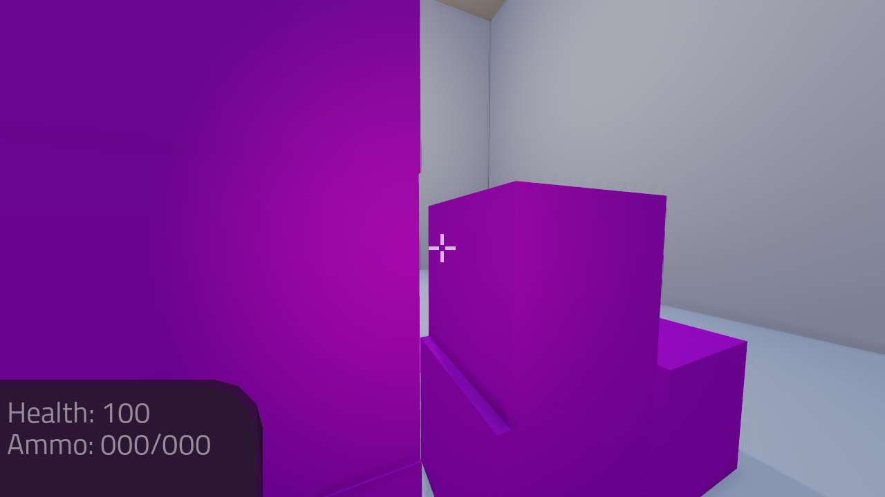
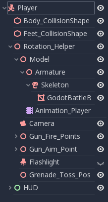
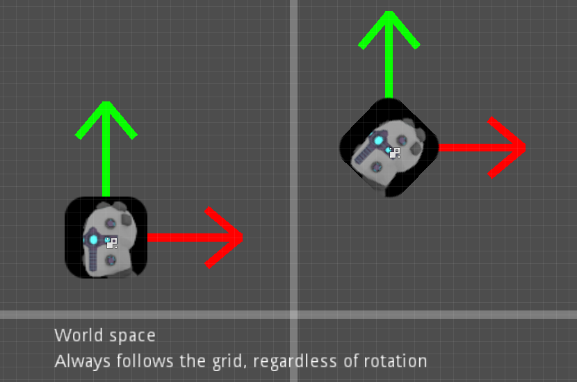
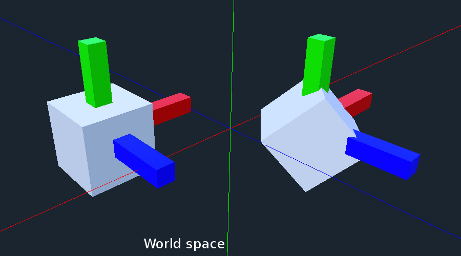
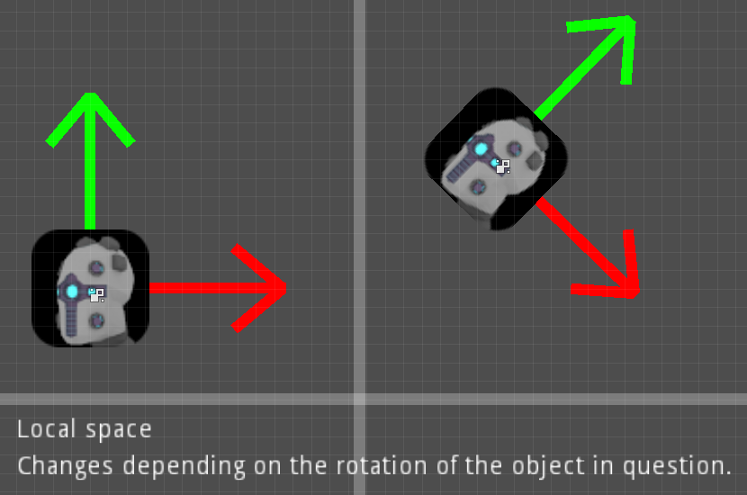
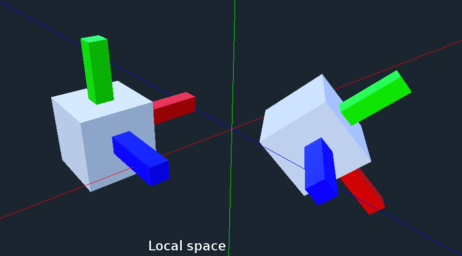
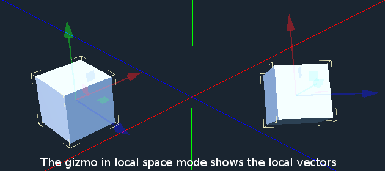

.. _doc_fps_tutorial_part_one:

Part 1
======

Tutorial introduction
---------------------

.. image:: img/FinishedTutorialPicture.png

This tutorial series will show you how to make a single player FPS game.

Throughout the course of this tutorial series, we will cover how:

- To make a first person character that can move, sprint, and jump.
- To make a simple animation state machine for handling animation transitions.
- To add three weapons to the first person character, each using a different way to handle bullet collisions:
- - A knife (using an :ref:`Area <class_Area>`)
- - A pistol (Bullet scenes)
- - A rifle (using a :ref:`Raycast <class_Raycast>`)
- To add two different types of grenades to the first person character:
- - A normal grenade
- - A sticky grenade
- To add the ability to grab and throw :ref:`RigidBody <class_RigidBody>` nodes
- To add joypad input for the player
- To add ammo and reloading for all weapons that consume ammo.
- To add ammo and health pick ups
- - In two sizes: big and small
- To add an automatic turret
- - That can fire using bullet objects or a :ref:`Raycast <class_Raycast>`
- To add targets that break when they've taken enough damage
- To add sounds that play when the guns fire.
- To add a simple main menu:
- - With an options menu for changing how the game runs
- - With a level select screen
- To add a universal pause menu we can access anywhere

.. note:: While this tutorial can be completed by beginners, it is highly
          advised to complete :ref:`doc_your_first_game`,
          if you are new to Godot and/or game development **before** going through
          this tutorial series.

          Remember: Making 3D games is much harder than making 2D games. If you do not know
          how to make 2D games, you will likely struggle making 3D games.

          This tutorial assumes you have experience working with the Godot editor,
          basic programming experience in GDScript, and basic experience in game development.

You can find the start assets for this tutorial here: :download:`Godot_FPS_Starter.zip <files/Godot_FPS_Starter.zip>`

The provided starter assets contain an animated 3D model, a bunch of 3D models for making levels,
and a few scenes already configured for this tutorial.

All assets provided (unless otherwise noted) were originally created by TwistedTwigleg, with changes/additions by the Godot community.
All original assets provided for this tutorial are released under the ``MIT`` license.

Feel free to use these assets however you want! All original assets belong to the Godot community, with the other assets belonging to those listed below:

.. note:: The skybox is created by **StumpyStrust** on OpenGameArt. The skybox used is
          licensed under ``CC0``.

          The font used is **Titillium-Regular**, and is licensed under the ``SIL Open Font License, Version 1.1``.

.. tip:: You can find the finished project for each part at the bottom of each part's page

Part overview
-------------

In this part we will be making a first person player that can move around
the environment.

By the end of this part, you will have a working first-person character who can move around the game environment,
sprint, look around with a mouse based first person camera, jump into the air, and turn a flash light on and off.

Getting everything ready
------------------------

Launch Godot and open up the project included in the starter assets.

.. note:: While these assets are not necessarily required to use the scripts provided in this tutorial,
          they will make the tutorial much easier to follow, as there are several pre-setup scenes we
          will be using throughout the tutorial series.

First, open the project settings and go to the "Input Map" tab. You'll find several
actions have already been defined. We will be using these actions for our player.
Feel free to change the keys bound to these actions if you want.

_________

Let's take a second to see what we have in the starter assets.

Included in the starter assets are several scenes. For example, in ``res://`` we have 14 scenes, most of which we will be visiting as
we go through this tutorial series.

For now let's open up ``Player.tscn``.

.. note:: There are a bunch of scenes and a few textures in the ``Assets`` folder. You can look at these if you want,
          but we will not be exploring through ``Assets`` in this tutorial series. ``Assets`` contains all the models used
          for each of the levels, as well as some textures and materials.

Making the FPS movement logic
-----------------------------

Once you have ``Player.tscn`` open, let's take a quick look at how it is set up

First, notice how the player's collision shapes are set up. Using a vertical pointing
capsule as the collision shape for the player is fairly common in most first person games.

We are adding a small square to the 'feet' of the player so the player does not
feel like they are balancing on a single point.

We do want the 'feet' slightly higher than the bottom of the capsule so we can roll over slight edges.
Where to place the 'feet' is dependent on your levels and how you want your player to feel.

.. note:: Many times the player will notice the collision shape being circular when
          they walk to an edge and slide off. We are adding the small square at the
          bottom of the capsule to reduce sliding on, and around, edges.

Another thing to notice is how many nodes are children of ``Rotation_Helper``. This is because
``Rotation_Helper`` contains all the nodes we want to rotate on the ``X`` axis (up and down).
The reason behind this is so we can rotate ``Player`` on the ``Y`` axis, and ``Rotation_helper`` on
the ``X`` axis.

.. note:: Had we not used ``Rotation_helper``, we would've likely had cases of rotating on
          both the ``X`` and ``Y`` axes simultaneously, potentially further degenerating into a state of
          rotation on all three axes in some cases.

          See :ref:`using transforms <doc_using_transforms>` for more information

_________

Attach a new script to the ``Player`` node and call it ``Player.gd``.

Let's program our player by adding the ability to move around, look around with the mouse, and jump.
Add the following code to ``Player.gd``:

.. tabs::
 .. code-tab:: gdscript GDScript

    extends KinematicBody

    const GRAVITY = -24.8
    var vel = Vector3()
    const MAX_SPEED = 20
    const JUMP_SPEED = 18
    const ACCEL = 4.5

    var dir = Vector3()

    const DEACCEL= 16
    const MAX_SLOPE_ANGLE = 40

    var camera
    var rotation_helper

    var MOUSE_SENSITIVITY = 0.05

    func _ready():
        camera = $Rotation_Helper/Camera
        rotation_helper = $Rotation_Helper

        Input.set_mouse_mode(Input.MOUSE_MODE_CAPTURED)

    func _physics_process(delta):
        process_input(delta)
        process_movement(delta)

    func process_input(delta):

        # ----------------------------------
        # Walking
        dir = Vector3()
        var cam_xform = camera.get_global_transform()

        var input_movement_vector = Vector2()

        if Input.is_action_pressed("movement_forward"):
            input_movement_vector.y += 1
        if Input.is_action_pressed("movement_backward"):
            input_movement_vector.y -= 1
        if Input.is_action_pressed("movement_left"):
            input_movement_vector.x -= 1
        if Input.is_action_pressed("movement_right"):
            input_movement_vector.x += 1

        input_movement_vector = input_movement_vector.normalized()

        # Basis vectors are already normalized.
        dir += -cam_xform.basis.z * input_movement_vector.y
        dir += cam_xform.basis.x * input_movement_vector.x
        # ----------------------------------

        # ----------------------------------
        # Jumping
        if is_on_floor():
            if Input.is_action_just_pressed("movement_jump"):
                vel.y = JUMP_SPEED
        # ----------------------------------

        # ----------------------------------
        # Capturing/Freeing the cursor
        if Input.is_action_just_pressed("ui_cancel"):
            if Input.get_mouse_mode() == Input.MOUSE_MODE_VISIBLE:
                Input.set_mouse_mode(Input.MOUSE_MODE_CAPTURED)
            else:
                Input.set_mouse_mode(Input.MOUSE_MODE_VISIBLE)
        # ----------------------------------

    func process_movement(delta):
        dir.y = 0
        dir = dir.normalized()

        vel.y += delta * GRAVITY

        var hvel = vel
        hvel.y = 0

        var target = dir
        target *= MAX_SPEED

        var accel
        if dir.dot(hvel) > 0:
            accel = ACCEL
        else:
            accel = DEACCEL

        hvel = hvel.linear_interpolate(target, accel * delta)
        vel.x = hvel.x
        vel.z = hvel.z
        vel = move_and_slide(vel, Vector3(0, 1, 0), 0.05, 4, deg2rad(MAX_SLOPE_ANGLE))

    func _input(event):
        if event is InputEventMouseMotion and Input.get_mouse_mode() == Input.MOUSE_MODE_CAPTURED:
            rotation_helper.rotate_x(deg2rad(event.relative.y * MOUSE_SENSITIVITY))
            self.rotate_y(deg2rad(event.relative.x * MOUSE_SENSITIVITY * -1))

            var camera_rot = rotation_helper.rotation_degrees
            camera_rot.x = clamp(camera_rot.x, -70, 70)
            rotation_helper.rotation_degrees = camera_rot

 .. code-tab:: csharp

    using Godot;
    using System;

    public class Player : KinematicBody
    {
        [Export]
        public float Gravity = -24.8f;
        [Export]
        public float MaxSpeed = 20.0f;
        [Export]
        public float JumpSpeed = 18.0f;
        [Export]
        public float Accel = 4.5f;
        [Export]
        public float Deaccel = 16.0f;
        [Export]
        public float MaxSlopeAngle = 40.0f;
        [Export]
        public float MouseSensitivity = 0.05f;

        private Vector3 _vel = new Vector3();
        private Vector3 _dir = new Vector3();

        private Camera _camera;
        private Spatial _rotationHelper;

        // Called when the node enters the scene tree for the first time.
        public override void _Ready()
        {
            _camera = GetNode<Camera>("Rotation_Helper/Camera");
            _rotationHelper = GetNode<Spatial>("Rotation_Helper");

            Input.SetMouseMode(Input.MouseMode.Captured);
        }

        public override void _PhysicsProcess(float delta)
        {
            ProcessInput(delta);
            ProcessMovement(delta);
        }

        private void ProcessInput(float delta)
        {
            //  -------------------------------------------------------------------
            //  Walking
            _dir = new Vector3();
            Transform camXform = _camera.GlobalTransform;

            Vector2 inputMovementVector = new Vector2();

            if (Input.IsActionPressed("movement_forward"))
                inputMovementVector.y += 1;
            if (Input.IsActionPressed("movement_backward"))
                inputMovementVector.y -= 1;
            if (Input.IsActionPressed("movement_left"))
                inputMovementVector.x -= 1;
            if (Input.IsActionPressed("movement_right"))
                inputMovementVector.x += 1;

            inputMovementVector = inputMovementVector.Normalized();

            // Basis vectors are already normalized.
            _dir += -camXform.basis.z * inputMovementVector.y;
            _dir += camXform.basis.x * inputMovementVector.x;
            //  -------------------------------------------------------------------

            //  -------------------------------------------------------------------
            //  Jumping
            if (IsOnFloor())
            {
                if (Input.IsActionJustPressed("movement_jump"))
                    _vel.y = JumpSpeed;
            }
            //  -------------------------------------------------------------------

            //  -------------------------------------------------------------------
            //  Capturing/Freeing the cursor
            if (Input.IsActionJustPressed("ui_cancel"))
            {
                if (Input.GetMouseMode() == Input.MouseMode.Visible)
                    Input.SetMouseMode(Input.MouseMode.Captured);
                else
                    Input.SetMouseMode(Input.MouseMode.Visible);
            }
            //  -------------------------------------------------------------------
        }

        private void ProcessMovement(float delta)
        {
            _dir.y = 0;
            _dir = _dir.Normalized();

            _vel.y += delta * Gravity;

            Vector3 hvel = _vel;
            hvel.y = 0;

            Vector3 target = _dir;

            target *= MaxSpeed;

            float accel;
            if (_dir.Dot(hvel) > 0)
                accel = Accel;
            else
                accel = Deaccel;

            hvel = hvel.LinearInterpolate(target, accel * delta);
            _vel.x = hvel.x;
            _vel.z = hvel.z;
            _vel = MoveAndSlide(_vel, new Vector3(0, 1, 0), false, 4, Mathf.Deg2Rad(MaxSlopeAngle));
        }

        public override void _Input(InputEvent @event)
        {
            if (@event is InputEventMouseMotion && Input.GetMouseMode() == Input.MouseMode.Captured)
            {
                InputEventMouseMotion mouseEvent = @event as InputEventMouseMotion;
                _rotationHelper.RotateX(Mathf.Deg2Rad(mouseEvent.Relative.y * MouseSensitivity));
                RotateY(Mathf.Deg2Rad(-mouseEvent.Relative.x * MouseSensitivity));

                Vector3 cameraRot = _rotationHelper.RotationDegrees;
                cameraRot.x = Mathf.Clamp(cameraRot.x, -70, 70);
                _rotationHelper.RotationDegrees = cameraRot;
            }
        }
    }

This is a lot of code, so let's break it down function by function:

.. tip:: While copy and pasting code is ill advised, as you can learn a lot from manually typing the code in, you can
         copy and paste the code from this page directly into the script editor.

         If you do this, all the code copied will be using spaces instead of tabs.

         To convert the spaces to tabs in the script editor, click the "edit" menu and select "Convert Indent To Tabs".
         This will convert all the spaces into tabs. You can select "Convert Indent To Spaces" to convert tabs back into spaces.

_________

First, we define some class variables to dictate how our player will move about the world.

.. note:: Throughout this tutorial, **variables defined outside functions will be
          referred to as "class variables"**. This is because we can access any of these
          variables from any place in the script.

Let's go through each of the class variables:

- ``GRAVITY``: How strong gravity pulls us down.
- ``vel``: Our :ref:`KinematicBody <class_KinematicBody>`'s velocity.
- ``MAX_SPEED``: The fastest speed we can reach. Once we hit this speed, we will not go any faster.
- ``JUMP_SPEED``: How high we can jump.
- ``ACCEL``: How quickly we accelerate. The higher the value, the sooner we get to max speed.
- ``DEACCEL``: How quickly we are going to decelerate. The higher the value, the sooner we will come to a complete stop.
- ``MAX_SLOPE_ANGLE``: The steepest angle our :ref:`KinematicBody <class_KinematicBody>` will consider as a 'floor'.
- ``camera``: The :ref:`Camera <class_Camera>` node.
- ``rotation_helper``: A :ref:`Spatial <class_Spatial>` node holding everything we want to rotate on the X axis (up and down).
- ``MOUSE_SENSITIVITY``: How sensitive the mouse is. I find a value of ``0.05`` works well for my mouse, but you may need to change it based on how sensitive your mouse is.

You can tweak many of these variables to get different results. For example, by lowering ``GRAVITY`` and/or
increasing ``JUMP_SPEED`` you can get a more 'floaty' feeling character.
Feel free to experiment!

.. note:: You may have noticed that ``MOUSE_SENSITIVITY`` is written in all caps like the other constants, but ``MOUSE_SENSITIVITY`` is not a constant.

          The reason behind this is we want to treat it like a constant variable (a variable that cannot change) throughout our script, but we want to be
          able to change the value later when we add customizable settings. So, in an effort to remind ourselves to treat it like a constant, it's named in all caps.

_________

Now let's look at the ``_ready`` function:

First we get the ``camera`` and ``rotation_helper`` nodes and store them into their variables.

Then we need to set the mouse mode to captured, so the mouse cannot leave the game window.

This will hide the mouse and keep it at the center of the screen. We do this for two reasons:
The first reason being we do not want the player to see their mouse cursor as they play.

The second reason is because we do not want the cursor to leave the game window. If the cursor leaves
the game window there could be instances where the player clicks outside the window, and then the game
would lose focus. To assure neither of these issues happens, we capture the mouse cursor.

.. note:: See :ref:`Input documentation <class_Input>` for the various mouse modes. We will only be using
          ``MOUSE_MODE_CAPTURED`` and ``MOUSE_MODE_VISIBLE`` in this tutorial series.

_________

Next let's take a look at ``_physics_process``:

All we're doing in ``_physics_process`` is calling two functions: ``process_input`` and ``process_movement``.

``process_input`` will be where we store all the code relating to player input. We want to call it first, before
anything else, so we have fresh player input to work with.

``process_movement`` is where we'll send all the data necessary to the :ref:`KinematicBody <class_KinematicBody>`
so it can move through the game world.

_________

Let's look at ``process_input`` next:

First we set ``dir`` to an empty :ref:`Vector3 <class_Vector3>`.

``dir`` will be used for storing the direction the player intends to move towards. Because we do not
want the player's previous input to effect the player beyond a single ``process_movement`` call, we reset ``dir``.

Next we get the camera's global transform and store it as well, into the ``cam_xform`` variable.

The reason we need the camera's global transform is so we can use its directional vectors.
Many have found directional vectors confusing, so let's take a second to explain how they work:

_________

World space can be defined as: The space in which all objects are placed in, relative to a constant origin point.
Every object, no matter if it is 2D or 3D, has a position in world space.

To put it another way: world space is the space in a universe where every object's position, rotation, and scale
can be measured by a single, known, fixed point called the origin.

In Godot, the origin is at position ``(0, 0, 0)`` with a rotation of ``(0, 0, 0)`` and a scale of ``(1, 1, 1)``.

.. note:: When you open up the Godot editor and select a :ref:`Spatial <class_Spatial>` based node, a gizmo pops up.
          Each of the arrows points using world space directions by default.

If you want to move using the world space directional vectors, you'd do something like this:

.. tabs::
 .. code-tab:: gdscript GDScript

    if Input.is_action_pressed("movement_forward"):
        node.translate(Vector3(0, 0, 1))
    if Input.is_action_pressed("movement_backward"):
        node.translate(Vector3(0, 0, -1))
    if Input.is_action_pressed("movement_left"):
        node.translate(Vector3(1, 0, 0))
    if Input.is_action_pressed("movement_right"):
        node.translate(Vector3(-1, 0, 0))

 .. code-tab:: csharp

    if (Input.IsActionPressed("movement_forward"))
        node.Translate(new Vector3(0, 0, 1));
    if (Input.IsActionPressed("movement_backward"))
        node.Translate(new Vector3(0, 0, -1));
    if (Input.IsActionPressed("movement_left"))
        node.Translate(new Vector3(1, 0, 0));
    if (Input.IsActionPressed("movement_right"))
        node.Translate(new Vector3(-1, 0, 0));

.. note:: Notice how we do not need to do any calculations to get world space directional vectors.
          We can define a few :ref:`Vector3 <class_Vector3>` variables and input the values pointing in each direction.

Here is what world space looks like in 2D:

.. note:: The following images are just examples. Each arrow/rectangle represents a directional vector

And here is what it looks like for 3D:

Notice how in both examples, the rotation of the node does not change the directional arrows.
This is because world space is a constant. No matter how you translate, rotate, or scale an object, world
space will *always point in the same direction*.

Local space is different, because it takes the rotation of the object into account.

Local space can be defined as follows:
The space in which an object's position is the origin of the universe. Because the position
of the origin can be at ``N`` many locations, the values derived from local space change
with the position of the origin.

.. note:: This stack overflow question has a much better explanation of world space and local space.

          https://gamedev.stackexchange.com/questions/65783/what-are-world-space-and-eye-space-in-game-development
          (Local space and eye space are essentially the same thing in this context)

To get a :ref:`Spatial <class_Spatial>` node's local space, we need to get its :ref:`Transform <class_Transform>`, so then we
can get the :ref:`Basis <class_Basis>` from the :ref:`Transform <class_Transform>`.

Each :ref:`Basis <class_Basis>` has three vectors: ``X``, ``Y``, and ``Z``.
Each of those vectors point towards each of the local space vectors coming from that object.

To use the :ref:`Spatial <class_Spatial>` node's local directional vectors, we use this code:

.. tabs::
 .. code-tab:: gdscript GDScript

    if Input.is_action_pressed("movement_forward"):
        node.translate(node.global_transform.basis.z.normalized())
    if Input.is_action_pressed("movement_backward"):
        node.translate(-node.global_transform.basis.z.normalized())
    if Input.is_action_pressed("movement_left"):
        node.translate(node.global_transform.basis.x.normalized())
    if Input.is_action_pressed("movement_right"):
        node.translate(-node.global_transform.basis.x.normalized())

 .. code-tab:: csharp

    if (Input.IsActionPressed("movement_forward"))
        node.Translate(node.GlobalTransform.basis.z.Normalized());
    if (Input.IsActionPressed("movement_backward"))
        node.Translate(-node.GlobalTransform.basis.z.Normalized());
    if (Input.IsActionPressed("movement_left"))
        node.Translate(node.GlobalTransform.basis.x.Normalized());
    if (Input.IsActionPressed("movement_right"))
        node.Translate(-node.GlobalTransform.basis.x.Normalized());

Here is what local space looks like in 2D:

And here is what it looks like for 3D:

Here is what the :ref:`Spatial <class_Spatial>` gizmo shows when you are using local space mode.
Notice how the arrows follow the rotation of the object on the left, which looks exactly
the same as the 3D example for local space.

.. note:: You can change between local and world space modes by pressing :kbd:`T` or the little cube button
          when you have a :ref:`Spatial <class_Spatial>` based node selected.

Local vectors are confusing even for more experienced game developers, so do not worry if this all doesn't make a
lot of sense. The key thing to remember about local vectors is that we are using local coordinates to get direction
from the object's point of view, as opposed to using world vectors, which give direction from the world's point of view.

_________

Okay, back to ``process_input``:

Next we make a new variable called ``input_movement_vector`` and assign it to an empty :ref:`Vector2 <class_Vector2>`.
We will use this to make a virtual axis of sorts, to map the player's input to movement.

.. note:: This may seem overkill for just the keyboard, but this will make sense later when we add joypad input.

Based on which directional movement action is pressed, we add to or subtract from ``input_movement_vector``.

After we've checked each of the directional movement actions, we normalize ``input_movement_vector``. This makes it where ``input_movement_vector``'s values
are within a ``1`` radius unit circle.

Next we add the camera's local ``Z`` vector times ``input_movement_vector.y`` to ``dir``. This is so when the player presses forward or backwards, we add the camera's
local ``Z`` axis so the player moves forward or backwards in relation to the camera.

.. note:: Because the camera is rotated by ``-180`` degrees, we have to flip the ``Z`` directional vector.
          Normally forward would be the positive Z axis, so using ``basis.z.normalized()`` would work,
          but we are using ``-basis.z.normalized()`` because our camera's Z axis faces backwards in relation
          to the rest of the player.

We do the same thing for the camera's local ``X`` vector, and instead of using ``input_movement_vector.y`` we instead use ``input_movement_vector.x``.
This makes it where the player moves left/right in relation to the camera when the player presses left/right.

Next we check if the player is on the floor using :ref:`KinematicBody <class_KinematicBody>`'s ``is_on_floor`` function. If it is, then we
check to see if the "movement_jump" action has just been pressed. If it has, then we set the player's ``Y`` velocity to
``JUMP_SPEED``.

Because we're setting the Y velocity, the player will jump into the air.

Then we check for the ``ui_cancel`` action. This is so we can free/capture the mouse cursor when the ``escape`` button
is pressed. We do this because otherwise we'd have no way to free the cursor, meaning it would be stuck until you terminate the
runtime.

To free/capture the cursor, we check to see if the mouse is visible (freed) or not. If it is, we capture it, and if it's not, we make it visible (free it).

That's all we're doing right now for ``process_input``. We'll come back several times to this function as we add more complexities to our player.

_________

Now let's look at ``process_movement``:

First we ensure that ``dir`` does not have any movement on the ``Y`` axis by setting its ``Y`` value to zero.

Next we normalize ``dir`` to ensure we're within a ``1`` radius unit circle. This makes it where we're moving at a constant speed regardless
of whether the player is moving straight or diagonally. If we did not normalize, the player would move faster on the diagonal than when going straight.

Next we add gravity to the player by adding ``GRAVITY * delta`` to the player's ``Y`` velocity.

After that we assign the player's velocity to a new variable (called ``hvel``) and remove any movement on the ``Y`` axis.

Next we set a new variable (``target``) to the player's direction vector.
Then we multiply that by the player's max speed so we know how far the player will move in the direction provided by ``dir``.

After that we make a new variable for acceleration, named ``accel``.

We then take the dot product of ``hvel`` to see if the player is moving according to ``hvel``. Remember, ``hvel`` does not have any
``Y`` velocity, meaning we are only checking if the player is moving forwards, backwards, left, or right.

If the player is moving according to ``hvel``, then we set ``accel`` to the ``ACCEL`` constant so the player will accelerate, otherwise we set ``accel`` to
our ``DEACCEL`` constant so the player will decelerate.

Then we interpolate the horizontal velocity, set the player's ``X`` and ``Z`` velocity to the interpolated horizontal velocity,
and call ``move_and_slide`` to let the :ref:`KinematicBody <class_KinematicBody>` handle moving the player through the physics world.

.. tip:: All the code in ``process_movement`` is exactly the same as the movement code from the Kinematic Character demo!

_________

The final function we have is the ``_input`` function, and thankfully it's fairly short:

First we make sure that the event we are dealing with is an :ref:`InputEventMouseMotion <class_InputEventMouseMotion>` event.
We also want to check if the cursor is captured, as we do not want to rotate if it is not.

.. note:: See :ref:`Mouse and input coordinates <doc_mouse_and_input_coordinates>` for a list of
         possible input events.

If the event is indeed a mouse motion event and the cursor is captured, we rotate
based on the relative mouse motion provided by :ref:`InputEventMouseMotion <class_InputEventMouseMotion>`.

First we rotate the ``rotation_helper`` node on the ``X`` axis, using the relative mouse motion's
``Y`` value, provided by :ref:`InputEventMouseMotion <class_InputEventMouseMotion>`.

Then we rotate the entire :ref:`KinematicBody <class_KinematicBody>` on the ``Y`` axis by the relative mouse motion's ``X`` value.

.. tip:: Godot converts relative mouse motion into a :ref:`Vector2 <class_Vector2>` where mouse movement going
         up and down is ``1`` and ``-1`` respectively. Right and Left movement is
         ``1`` and ``-1`` respectively.

         Because of how we are rotating the player, we multiply the relative mouse motion's
         ``X`` value by ``-1`` so mouse motion going left and right rotates the player left and right
         in the same direction.

Finally, we clamp the ``rotation_helper``'s ``X`` rotation to be between ``-70`` and ``70``
degrees so the player cannot rotate themselves upside down.

.. tip:: See :ref:`using transforms <doc_using_transforms>` for more information on rotating transforms.

_________

To test the code, open up the scene named ``Testing_Area.tscn``, if it's not already opened up. We will be using
this scene as we go through the next few tutorial parts, so be sure to keep it open in one of your scene tabs.

Go ahead and test your code either by pressing :kbd:`F6` with ``Testing_Area.tscn`` as the open tab, by pressing the
play button in the top right corner, or by pressing :kbd:`F5`.
You should now be able to walk around, jump in the air, and look around using the mouse.

Giving the player a flash light and the option to sprint
--------------------------------------------------------

Before we get to making the weapons work, there are a couple more things we should add.

Many FPS games have an option to sprint and a flashlight. We can easily add these to our player,
so let's do that!

First we need a few more class variables in our player script:

.. tabs::
 .. code-tab:: gdscript GDScript

    const MAX_SPRINT_SPEED = 30
    const SPRINT_ACCEL = 18
    var is_sprinting = false

    var flashlight

 .. code-tab:: csharp

    [Export]
    public float MaxSprintSpeed = 30.0f;
    [Export]
    public float SprintAccel = 18.0f;
    private bool _isSprinting = false;

    private SpotLight _flashlight;

All the sprinting variables work exactly the same as the non sprinting variables with
similar names.

``is_sprinting`` is a boolean to track whether the player is currently sprinting, and ``flashlight`` is a variable
we will be using to hold the player's flash light node.

Now we need to add a few lines of code, starting in ``_ready``. Add the following to ``_ready``:

.. tabs::
 .. code-tab:: gdscript GDScript

    flashlight = $Rotation_Helper/Flashlight

 .. code-tab:: csharp

    _flashlight = GetNode<SpotLight>("Rotation_Helper/Flashlight");

This gets the ``Flashlight`` node and assigns it to the ``flashlight`` variable.

_________

Now we need to change some of the code in ``process_input``. Add the following somewhere in ``process_input``:

.. tabs::
 .. code-tab:: gdscript GDScript

    # ----------------------------------
    # Sprinting
    if Input.is_action_pressed("movement_sprint"):
        is_sprinting = true
    else:
        is_sprinting = false
    # ----------------------------------

    # ----------------------------------
    # Turning the flashlight on/off
    if Input.is_action_just_pressed("flashlight"):
        if flashlight.is_visible_in_tree():
            flashlight.hide()
        else:
            flashlight.show()
    # ----------------------------------

 .. code-tab:: csharp

    //  -------------------------------------------------------------------
    //  Sprinting
    if (Input.IsActionPressed("movement_sprint"))
        _isSprinting = true;
    else
        _isSprinting = false;
    //  -------------------------------------------------------------------

    //  -------------------------------------------------------------------
    //  Turning the flashlight on/off
    if (Input.IsActionJustPressed("flashlight"))
    {
        if (_flashlight.IsVisibleInTree())
            _flashlight.Hide();
        else
            _flashlight.Show();
    }

Let's go over the additions:

We set ``is_sprinting`` to ``true`` when the player is holding down the ``movement_sprint`` action, and ``false``
when the ``movement_sprint`` action is released. In ``process_movement`` we'll add the code that makes the player faster when
they sprint. Here in ``process_input`` we are just going to change the ``is_sprinting`` variable.

We do something similar to freeing/capturing the cursor for handling the flashlight. We first check to see if the ``flashlight`` action
was just pressed. If it was, we then check to see if ``flashlight`` is visible in the scene tree. If it is, then we hide it, and if it's not, we show it.

_________

Now we need to change a couple things in ``process_movement``. First, replace ``target *= MAX_SPEED`` with the following:

.. tabs::
 .. code-tab:: gdscript GDScript

    if is_sprinting:
        target *= MAX_SPRINT_SPEED
    else:
        target *= MAX_SPEED

 .. code-tab:: csharp

    if (_isSprinting)
        target *= MaxSprintSpeed;
    else
        target *= MaxSpeed;

Now instead of always multiplying ``target`` by ``MAX_SPEED``, we first check to see if the player is sprinting or not.
If the player is sprinting, we instead multiply ``target`` by ``MAX_SPRINT_SPEED``.

Now all that's left is to change the acceleration when sprinting. Change ``accel = ACCEL`` to the following:

.. tabs::
 .. code-tab:: gdscript GDScript

    if is_sprinting:
        accel = SPRINT_ACCEL
    else:
        accel = ACCEL

 .. code-tab:: csharp

    if (_isSprinting)
        accel = SprintAccel;
    else
        accel = Accel;

Now, when the player is sprinting, we'll use ``SPRINT_ACCEL`` instead of ``ACCEL``, which will accelerate the player faster.

_________

You should now be able to sprint if you press :kbd:`Shift`, and can toggle the flash light on and off by pressing :kbd:`F`!

Go try it out! You can change the sprint-related class variables to make the player faster or slower when sprinting!

Final notes
-----------

Whew! That was a lot of work. Now you have a fully working first person character!

In :ref:`doc_fps_tutorial_part_two` we will add some guns to our player character.

.. note:: At this point we've recreated the Kinematic character demo from first person perspective with sprinting and a flash light!

.. tip:: Currently the player script would be at an ideal state for making all sorts of
         first person games. For example: Horror games, platformer games, adventure games, and more!

.. warning:: If you ever get lost, be sure to read over the code again!

             You can download the finished project for this part here: :download:`Godot_FPS_Part_1.zip <files/Godot_FPS_Part_1.zip>`
