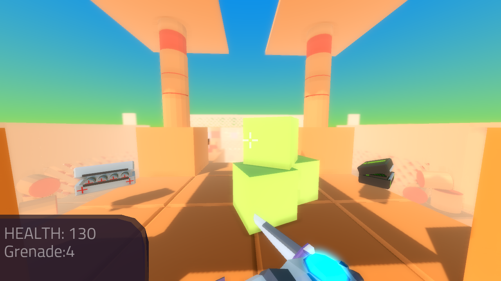
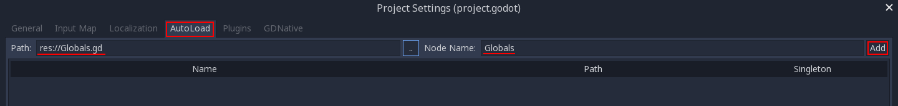

.. _doc_fps_tutorial_part_six:

Part 6
======

Part overview
-------------

In this part, we're going to add a main menu and pause menu,
add a respawn system for the player, and change/move the sound system so we can use it from any script.

This is the last part of the FPS tutorial; by the end of this, you will have a solid base to build amazing FPS games with Godot!

.. note:: You are assumed to have finished :ref:`doc_fps_tutorial_part_five` before moving on to this part of the tutorial.
          The finished project from :ref:`doc_fps_tutorial_part_five` will be the starting project for part 6

Let's get started!

Adding the main menu
--------------------

Firstly, open up ``Main_Menu.tscn`` and take a look at how the scene is set up.

The main menu is broken up into three different panels, each representing a different
'screen' of our main menu.

.. note:: The ``Background_Animation`` node is just so the background of the menu is a bit more interesting than a solid color.
          It's a camera looking around the skybox, nothing fancy.

Feel free to expand all the nodes and see how they're set up. Remember to keep only ``Start_Menu`` visible
when you're done, as that's the screen we want to show first when we enter the main menu.

Select ``Main_Menu`` (the root node) and create a new script called ``Main_Menu.gd``. Add the following:

::

    extends Control

    var start_menu
    var level_select_menu
    var options_menu

    export (String, FILE) var testing_area_scene
    export (String, FILE) var space_level_scene
    export (String, FILE) var ruins_level_scene

    func _ready():
        start_menu = $Start_Menu
        level_select_menu = $Level_Select_Menu
        options_menu = $Options_Menu

        $Start_Menu/Button_Start.connect("pressed", self, "start_menu_button_pressed", ["start"])
        $Start_Menu/Button_Open_Godot.connect("pressed", self, "start_menu_button_pressed", ["open_godot"])
        $Start_Menu/Button_Options.connect("pressed", self, "start_menu_button_pressed", ["options"])
        $Start_Menu/Button_Quit.connect("pressed", self, "start_menu_button_pressed", ["quit"])

        $Level_Select_Menu/Button_Back.connect("pressed", self, "level_select_menu_button_pressed", ["back"])
        $Level_Select_Menu/Button_Level_Testing_Area.connect("pressed", self, "level_select_menu_button_pressed", ["testing_scene"])
        $Level_Select_Menu/Button_Level_Space.connect("pressed", self, "level_select_menu_button_pressed", ["space_level"])
        $Level_Select_Menu/Button_Level_Ruins.connect("pressed", self, "level_select_menu_button_pressed", ["ruins_level"])

        $Options_Menu/Button_Back.connect("pressed", self, "options_menu_button_pressed", ["back"])
        $Options_Menu/Button_Fullscreen.connect("pressed", self, "options_menu_button_pressed", ["fullscreen"])
        $Options_Menu/Check_Button_VSync.connect("pressed", self, "options_menu_button_pressed", ["vsync"])
        $Options_Menu/Check_Button_Debug.connect("pressed", self, "options_menu_button_pressed", ["debug"])

        Input.set_mouse_mode(Input.MOUSE_MODE_VISIBLE)

        var globals = get_node("/root/Globals")
        $Options_Menu/HSlider_Mouse_Sensitivity.value = globals.mouse_sensitivity
        $Options_Menu/HSlider_Joypad_Sensitivity.value = globals.joypad_sensitivity

    func start_menu_button_pressed(button_name):
        if button_name == "start":
            level_select_menu.visible = true
            start_menu.visible = false
        elif button_name == "open_godot":
            OS.shell_open("https://godotengine.org/")
        elif button_name == "options":
            options_menu.visible = true
            start_menu.visible = false
        elif button_name == "quit":
            get_tree().quit()

    func level_select_menu_button_pressed(button_name):
        if button_name == "back":
            start_menu.visible = true
            level_select_menu.visible = false
        elif button_name == "testing_scene":
            set_mouse_and_joypad_sensitivity()
            get_node("/root/Globals").load_new_scene(testing_area_scene)
        elif button_name == "space_level":
            set_mouse_and_joypad_sensitivity()
            get_node("/root/Globals").load_new_scene(space_level_scene)
        elif button_name == "ruins_level":
            set_mouse_and_joypad_sensitivity()
            get_node("/root/Globals").load_new_scene(ruins_level_scene)

    func options_menu_button_pressed(button_name):
        if button_name == "back":
            start_menu.visible = true
            options_menu.visible = false
        elif button_name == "fullscreen":
            OS.window_fullscreen = !OS.window_fullscreen
        elif button_name == "vsync":
            OS.vsync_enabled = $Options_Menu/Check_Button_VSync.pressed
        elif button_name == "debug":
            pass

    func set_mouse_and_joypad_sensitivity():
        var globals = get_node("/root/Globals")
        globals.mouse_sensitivity = $Options_Menu/HSlider_Mouse_Sensitivity.value
        globals.joypad_sensitivity = $Options_Menu/HSlider_Joypad_Sensitivity.value

Most of the code here relates to making UIs, which is outside of the purpose of this tutorial series.
**We're only going to look at the UI related code briefly.**

.. tip:: See :ref:`doc_ui_main_menu` and the tutorials following for better ways to make GUIs and UIs!

Let's look at the class variables first.

* ``start_menu``: A variable to hold the ``Start_Menu`` :ref:`Panel <class_Panel>`.
* ``level_select_menu``: A variable to hold the ``Level_Select_Menu`` :ref:`Panel <class_Panel>`.
* ``options_menu``: A variable to hold the ``Options_Menu`` :ref:`Panel <class_Panel>`.
* ``testing_area_scene``: The path to the ``Testing_Area.tscn`` file, so we can change to it from this scene.
* ``space_level_scene``: The path to the ``Space_Level.tscn`` file, so we can change to it from this scene.
* ``ruins_level_scene``: The path to the ``Ruins_Level.tscn`` file, so we can change to it from this scene.

.. warning:: You'll have to set the paths to the correct files in the editor before testing this script! Otherwise it will not work!

______

Now let's go over ``_ready``

Firstly, we get all the :ref:`Panel <class_Panel>` nodes and assign them to the proper variables.

Next, we connect all the buttons ``pressed`` signals to their respective ``[panel_name_here]_button_pressed`` functions.

We then set the mouse mode to ``MOUSE_MODE_VISIBLE`` to ensure whenever the player returns to this scene, the mouse will be visible.

Then we get a singleton, called ``Globals``. We then set the values for the :ref:`HSlider <class_HSlider>` nodes so their values line up with the mouse and joypad sensitivity
in the singleton.

.. note:: We have not made the ``Globals`` singleton yet, so don't worry! We're going to make it soon!

______

In ``start_menu_button_pressed``, we check to see which button is pressed.

Based on the button pressed, we either change the currently visible panel, quit the application, or open the Godot website.

______

In ``level_select_menu_button_pressed``, we check to see which button is pressed.

If the ``back`` button has been pressed, we change the currently visible panels to return to the main menu.

If one of the scene changing buttons is pressed, we fist call ``set_mouse_and_joypad_sensitivity`` so the singleton (``Globals.gd``) has the values from the :ref:`HSlider
<class_HSlider>` nodes.
Then, we tell the singleton to change nodes using its ``load_new_scene`` function, passing in the file path of the scene the player has selected.

.. note:: Don't worry about the singleton, we'll get there soon!

______

In ``options_menu_button_pressed``, we check to see which button is pressed.

If the ``back`` button has been pressed, we change the currently visible panels to return to the main menu.

If the ``fullscreen`` button is pressed, we toggle the :ref:`OS <class_OS>`'s full screen mode by setting it to the flipped version of its current value.

If the ``vsync`` button is pressed, we set the :ref:`OS <class_OS>`'s Vsync based on the state of the Vsync check button.

______

Finally, lets take a look at ``set_mouse_and_joypad_sensitivity``.

Firstly, we get the ``Globals`` singleton and assign it to a local variable.

We then set the ``mouse_sensitivity`` and ``joypad_sensitivity`` variables to the values in their respective :ref:`HSlider <class_HSlider>` node counterparts.

Making the ``Globals`` singleton
--------------------------------

Now, for all this to work, we need to create the ``Globals`` singleton. Make a new script in the ``Script`` tab and call it ``Globals.gd``.

.. note:: To make the ``Globals`` singleton, go to the ``Script`` tab in the editor, then click ``New`` and a ``Create Script`` box will appear, leave everything unchanged except for the ``Path`` where you need to insert the script's name ``Globals.gd``.

Add the following to ``Globals.gd``.

::

    extends Node

    var mouse_sensitivity = 0.08
    var joypad_sensitivity = 2

    func _ready():
        pass

    func load_new_scene(new_scene_path):
        get_tree().change_scene(new_scene_path)

As you can see, it's quite small and simple. As this part progresses, we will
keep adding more complex logic to ``Globals.gd``, but for now, all it is doing is holding two class variables, and abstract defining how we change scenes.

* ``mouse_sensitivity``: The current sensitivity for our mouse, so we can load it in ``Player.gd``.
* ``joypad_sensitivity``: The current sensitivity for our joypad, so we can load it in ``Player.gd``.

Right now, all we will be using ``Globals.gd`` for is a way to carry variables across scenes. Because the sensitivities of our mouse and joypad are
stored in ``Globals.gd``, any changes we make in one scene (like in ``Options_Menu``) will affect the sensitivity for the player.

All we're doing in ``load_new_scene`` is calling :ref:`SceneTree <class_SceneTree>`'s ``change_scene`` function, passing in the scene path given in ``load_new_scene``.

That's all the code needed for ``Globals.gd`` right now! Before we can test the main menu, we first need to set ``Globals.gd`` as an autoload script.

Open up the ``Project Settings`` and click the ``AutoLoad`` tab.

Then select the path to ``Globals.gd`` in the ``Path`` field by clicking the button (``..``) beside it. Make sure the name in the ``Node Name`` field is ``Globals``. If you
have everything like in the picture above, then press ``Add``!

This will make ``Globals.gd`` a singleton/autoload script, which will allow us to access it from any script, in any scene.

.. tip:: For more information on singleton/autoload scripts, see :ref:`doc_singletons_autoload`.

Now that ``Globals.gd`` is a singleton/autoload script, you can test the main menu!

You may want to change the main scene from ``Testing_Area.tscn`` to ``Main_Menu.tscn`` so when we export the game the player will start at the main menu. You can do this
through the ``Project Settings``, under the ``General`` tab. Then in the ``Application`` category, click the ``Run`` subcategory and you can change the main scene by changing
the value in ``Main Scene``.

.. warning:: You'll have to set the paths to the correct files in ``Main_Menu`` in the editor before testing the main menu!
             Otherwise you will not be able to change scenes from the level select menu/screen.

Adding the debug menu
---------------------

Now, let's add a simple debugging scene so we can track things like FPS (Frames Per Second) in-game. Open up ``Debug_Display.tscn``.

You can see it's a :ref:`Panel <class_Panel>` positioned in the top right corner of the screen. It has three :ref:`Labels <class_Label>`,
one for displaying the FPS at which the game is running, one for showing on what OS the game is running, and a label for showing with which Godot version the game is running.

Let's add the code needed to fill these :ref:`Labels <class_Label>`. Select ``Debug_Display`` and create a new script called ``Debug_Display.gd``. Add the following:

::

    extends Control

    func _ready():
        $OS_Label.text = "OS: " + OS.get_name()
        $Engine_Label.text = "Godot version: " + Engine.get_version_info()["string"]

    func _process(delta):
        $FPS_Label.text = "FPS: " + str(Engine.get_frames_per_second())

Let's go over what this script does.

______

In ``_ready``, we set the ``OS_Label``'s text to the name provided by :ref:`OS <class_OS>` using the ``get_name`` function. This will return the
name of the OS (or Operating System) for which Godot was compiled. For example, when you are running Windows, it will return ``Windows``, while when you
are running Linux, it will return ``X11``.

Then, we set the ``Engine_Label``'s text to the version info provided by ``Engine.get_version_info``. ``Engine.get_version_info`` returns a dictionary full
of useful information about the version of Godot which is currently running. We only care about the string version, for this label at least, so we get the string
and assign that as the ``text`` in ``Engine_Label``. See :ref:`Engine <class_Engine>` for more information on the values ``get_version_info`` returns.

In ``_process``, we set the text of the ``FPS_Label`` to ``Engine.get_frames_per_second``, but because ``get_frames_per_second`` returns an integer, we have to cast
it to a string using ``str`` before we can add it to the :ref:`Label <class_Label>`.

______

Now let's jump back to ``Main_Menu.gd`` and change the following in ``options_menu_button_pressed``:

::

    elif button_name == "debug":
        pass

to this instead:

::

    elif button_name == "debug":
        get_node("/root/Globals").set_debug_display($Options_Menu/Check_Button_Debug.pressed)

This will call a new function called ``set_debug_display`` in our singleton, so let's add that next!

______

Open up ``Globals.gd`` and add the following class variables:

::

    # ------------------------------------
    # All the GUI/UI-related variables

    var canvas_layer = null

    const DEBUG_DISPLAY_SCENE = preload("res://Debug_Display.tscn")
    var debug_display = null

    # ------------------------------------

* ``canvas_layer``: A canvas layer so the GUI/UI created in ``Globals.gd`` is always drawn on top.
* ``DEBUG_DISPLAY``: The debug display scene we worked on earlier.
* ``debug_display``: A variable to hold the debug display when/if there is one.

Now that we have the class variables defined, we need to add a few lines to ``_ready`` so ``Globals.gd`` will have a canvas layer to use (which we will store in ``canvas_layer``).
Change ``_ready`` to the following:

::

    func _ready():
        canvas_layer = CanvasLayer.new()
        add_child(canvas_layer)

Now in ``_ready``, we create a new canvas layer, assign it to ``canvas_layer`` and add it as a child.
Because ``Globals.gd`` is an autoload/singleton, Godot will make a :ref:`Node <class_Node>` when the game is launched, and it will have ``Globals.gd`` attached to it.
Since Godot makes a :ref:`Node <class_Node>`, we can treat ``Globals.gd`` like any other node with regard to adding/removing children nodes.

The reason we're adding a :ref:`CanvasLayer <class_CanvasLayer>` is so all our GUI and UI nodes we instance/spawn in ``Globals.gd``
are always drawn on top of everything else.

When adding nodes to a singleton/autoload, you have to be careful not to lose reference to any of the child nodes.
This is because nodes will not be freed/destroyed when you change the active scene, meaning you can run into memory problems if you are
instancing/spawning lots of nodes and you are not freeing them.

______

Now we need to add ``set_debug_display`` to ``Globals.gd``:

::

    func set_debug_display(display_on):
        if display_on == false:
            if debug_display != null:
                debug_display.queue_free()
                debug_display = null
        else:
            if debug_display == null:
                debug_display = DEBUG_DISPLAY_SCENE.instance()
                canvas_layer.add_child(debug_display)

Let's go over what's happening.

First we check to see if ``Globals.gd`` is trying to turn on the debug display, or turn it off.

If ``Globals.gd`` is turning off the display, we then check to see if ``debug_display`` is not equal to ``null``. If ``debug_display`` is not equal to ``null``, then ``Globals.gd``
must have a debug display currently active. If ``Globals.gd`` has a debug display active, we free it using ``queue_free`` and then assign ``debug_display`` to ``null``.

If ``Globals.gd`` is turning on the display, we then check to make sure ``Globals.gd`` do not already have a debug display active.
We do this by making sure ``debug_display`` is equal to ``null``.
If ``debug_display`` is ``null``, we instance a new ``DEBUG_DISPLAY_SCENE``, and add it as a child of ``canvas_layer``.

______

With that done, we can now toggle the debug display on and off by switching the :ref:`CheckButton <class_CheckButton>` in the ``Options_Menu`` panel. Go give it a try!

Notice how the debug display stays even when you change scenes from the ``Main_Menu.tscn`` to another scene (like ``Testing_Area.tscn``). This is the beauty of
instancing/spawning nodes in a singleton/autoload and adding them as children to the singleton/autoload. Any of the nodes added as children of the singleton/autoload will
stay for as long as the game is running, without any additional work on our part!

Adding a pause menu
-------------------

Let's add a pause menu so we can return to the main menu when we press the ``ui_cancel`` action.

Open up ``Pause_Popup.tscn``.

Notice how the root node in ``Pause_Popup`` is a :ref:`WindowDialog <class_WindowDialog>`; :ref:`WindowDialog <class_WindowDialog>` inherits from
:ref:`Popup <class_Popup>`, which means :ref:`WindowDialog <class_WindowDialog>` can act like a popup.

Select ``Pause_Popup`` and scroll down all the way till you get to the ``Pause`` menu in the inspector. Notice how the pause mode is set to
``process`` instead of ``inherit`` like it is normally set by default. This makes it so it will continue to process even when the game is paused,
which we need in order to interact with the UI elements.

Now that we've looked at how ``Pause_Popup.tscn`` is set up, let's write the code to make it work. Normally, we'd attach a script to the root node of
the scene, ``Pause_Popup`` in this case, but since we'll need to receive a couple of signals in ``Globals.gd``, we'll write all the code for
the popup there.

Open up ``Globals.gd`` and add the following class variables:

::

    const MAIN_MENU_PATH = "res://Main_Menu.tscn"
    const POPUP_SCENE = preload("res://Pause_Popup.tscn")
    var popup = null

* ``MAIN_MENU_PATH``: The path to the main menu scene.
* ``POPUP_SCENE``: The pop up scene we looked at earlier.
* ``popup``: A variable to hold the pop up scene.

Now we need to add ``_process`` to ``Globals.gd`` so it can respond when the ``ui_cancel`` action is pressed.
Add the following to ``_process``:

::

    func _process(delta):
        if Input.is_action_just_pressed("ui_cancel"):
            if popup == null:
                popup = POPUP_SCENE.instance()

                popup.get_node("Button_quit").connect("pressed", self, "popup_quit")
                popup.connect("popup_hide", self, "popup_closed")
                popup.get_node("Button_resume").connect("pressed", self, "popup_closed")

                canvas_layer.add_child(popup)
                popup.popup_centered()

                Input.set_mouse_mode(Input.MOUSE_MODE_VISIBLE)

                get_tree().paused = true

Let's go over what's happening here.

______

Firstly, we check to see if the ``ui_cancel`` action is pressed. Then, we check to make sure ``Globals.gd`` does not already
have a ``popup`` open by checking to see if ``popup`` is equal to ``null``.

If ``Globals.gd`` do not have a pop-up open, we instance ``POPUP_SCENE`` and assign it to ``popup``.

We then get the quit button and assign its ``pressed`` signal to ``popup_quit``, which we will be adding shortly.

Next, we assign both the ``popup_hide`` signal from the :ref:`WindowDialog <class_WindowDialog>` and the ``pressed`` signal from the resume button
to ``popup_closed``, which we will be adding shortly.

Then, we add ``popup`` as a child of ``canvas_layer`` so it's drawn on top. We then tell ``popup`` to pop up at the center of the screen using ``popup_centered``.

Next, we make sure the mouse mode is ``MOUSE_MODE_VISIBLE`` so the player can interact with the pop-up. If we did not do this, the player would not be able to
interact with the pop up in any scene where the mouse mode is ``MOUSE_MODE_CAPTURED``.

Finally, we pause the entire :ref:`SceneTree <class_SceneTree>`.

.. note:: For more information on pausing in Godot, see :ref:`doc_pausing_games`

______

Now, we need to add the functions to which we've connected the signals. Let's add ``popup_closed`` first.

Add the following to ``Globals.gd``:

::

    func popup_closed():
        get_tree().paused = false

        if popup != null:
            popup.queue_free()
            popup = null

``popup_closed`` will resume the game and destroy the pop-up if there is one.

``popup_quit`` is similar, but we're also making sure the mouse is visible and changing scenes to the title screen.

Add the following to ``Globals.gd``:

::

    func popup_quit():
        get_tree().paused = false

        Input.set_mouse_mode(Input.MOUSE_MODE_VISIBLE)

        if popup != null:
            popup.queue_free()
            popup = null

        load_new_scene(MAIN_MENU_PATH)

``popup_quit`` will resume the game, set the mouse mode to ``MOUSE_MODE_VISIBLE`` to ensure the mouse is visible in the main menu, destroy
the pop-up if there is one, and change scenes to the main menu.

______

Before we're ready to test the pop-up, we should change one thing in ``Player.gd``.

Open up ``Player.gd`` and in ``process_input``, change the code for capturing/freeing the cursor to the following:

Instead of:

::

    # Capturing/Freeing cursor
    if Input.is_action_just_pressed("ui_cancel"):
        if Input.get_mouse_mode() == Input.MOUSE_MODE_VISIBLE:
            Input.set_mouse_mode(Input.MOUSE_MODE_CAPTURED)
        else:
            Input.set_mouse_mode(Input.MOUSE_MODE_VISIBLE)

You will leave only:

::

    # Capturing/Freeing cursor
    if Input.get_mouse_mode() == Input.MOUSE_MODE_VISIBLE:
        Input.set_mouse_mode(Input.MOUSE_MODE_CAPTURED)

Now, instead of capturing/freeing the mouse, we check whether the current mouse mode is ``MOUSE_MODE_VISIBLE``. If it is, we set it back to
``MOUSE_MODE_CAPTURED``.

Because the pop-up makes the mouse mode ``MOUSE_MODE_VISIBLE`` whenever you pause, we no longer have to worry about freeing and capturing the cursor in ``Player.gd``.

______

Now the pause menu pop-up is finished. You can now pause at any point in the game and return to the main menu!

Starting the respawn system
---------------------------

Since the player can lose all their health, it would be ideal if the player died and respawned too, so let's add that next!

Firstly, open up ``Player.tscn`` and expand ``HUD``. Notice how there is a :ref:`ColorRect <class_ColorRect>` called ``Death_Screen``.
When the player dies, we're going to make ``Death_Screen`` visible, and show them how long they have to wait before the player is able to respawn.

Open up ``Player.gd`` and add the following class variables:

::

    const RESPAWN_TIME = 4
    var dead_time = 0
    var is_dead = false

    var globals

* ``RESPAWN_TIME``: The amount of time (in seconds) it takes to respawn.
* ``dead_time``: A variable to track how long the player has been dead.
* ``is_dead``: A variable to track whether or not the player is currently dead.
* ``globals``: A variable to hold the ``Globals.gd`` singleton.

______

We now need to add a couple lines to ``_ready``, so we can use ``Globals.gd`` in ``Player.gd``. Add the following to ``_ready``:

::

    globals = get_node("/root/Globals")
    global_transform.origin = globals.get_respawn_position()

Now we're getting the ``Globals.gd`` singleton and assigning it to ``globals``. We also set the player's global position
by setting the origin in the player's global :ref:`Transform <class_Transform>` to the position returned by ``globals.get_respawn_position``.

.. note:: Don't worry, we will be adding ``get_respawn_position`` further below!

______

Next, we need to make a few changes to ``_physics_process``. Change ``_physics_process`` to the following:

::

    func _physics_process(delta):

        if !is_dead:
            process_input(delta)
            process_view_input(delta)
            process_movement(delta)

        if (grabbed_object == null):
            process_changing_weapons(delta)
            process_reloading(delta)

        process_UI(delta)
        process_respawn(delta)

Now the player will not be processing input or movement input when the player is dead. We are also now calling ``process_respawn``.

.. note:: The ``if !is_dead:`` expression is equivalent and works in the same way as the expression ``if is_dead == false:``. And by removing the ``!`` sign from the expression we obtain the opposite expression ``if is_dead == true:``. It is just a shorter way of writing the same code functionality.

We have not made ``process_respawn`` yet, so let's change that.

______

Let's add ``process_respawn``. Add the following to ``Player.gd``:

::

    func process_respawn(delta):

        # If we've just died
        if health <= 0 and !is_dead:
            $Body_CollisionShape.disabled = true
            $Feet_CollisionShape.disabled = true

            changing_weapon = true
            changing_weapon_name = "UNARMED"

            $HUD/Death_Screen.visible = true

            $HUD/Panel.visible = false
            $HUD/Crosshair.visible = false

            dead_time = RESPAWN_TIME
            is_dead = true

            if grabbed_object != null:
                grabbed_object.mode = RigidBody.MODE_RIGID
                grabbed_object.apply_impulse(Vector3(0, 0, 0), -camera.global_transform.basis.z.normalized() * OBJECT_THROW_FORCE / 2)

                grabbed_object.collision_layer = 1
                grabbed_object.collision_mask = 1

                grabbed_object = null

        if is_dead:
            dead_time -= delta

            var dead_time_pretty = str(dead_time).left(3)
            $HUD/Death_Screen/Label.text = "You died\n" + dead_time_pretty + " seconds till respawn"

            if dead_time <= 0:
                global_transform.origin = globals.get_respawn_position()

                $Body_CollisionShape.disabled = false
                $Feet_CollisionShape.disabled = false

                $HUD/Death_Screen.visible = false

                $HUD/Panel.visible = true
                $HUD/Crosshair.visible = true

                for weapon in weapons:
                    var weapon_node = weapons[weapon]
                    if weapon_node != null:
                        weapon_node.reset_weapon()

                health = 100
                grenade_amounts = {"Grenade":2, "Sticky Grenade":2}
                current_grenade = "Grenade"

                is_dead = false

Let's go through what this function is doing.

______

Firstly, we check whether the player has just died by checking if ``health`` is less than or equal to ``0`` and ``is_dead`` is ``false``.

If the player has just died, we disable the collision shapes for the player. We do this to make sure the player is not blocking anything with their dead body.

Next, we set ``changing_weapon`` to ``true`` and set ``changing_weapon_name`` to ``UNARMED``. This is so, if the player is using a weapon, it is put away
when they dies.

We then make the ``Death_Screen`` :ref:`ColorRect <class_ColorRect>` visible so the player gets a nice grey overlay over everything when they have died.
We then make the rest of the UI, the ``Panel`` and ``Crosshair`` nodes, invisible.

Next, we set ``dead_time`` to ``RESPAWN_TIME`` so we can start counting down how long the player has been dead. We also set ``is_dead`` to ``true`` so we know the player has died.

If the player is holding an object when they died, we need to throw it. We first check whether the player is holding an object or not.
If the player is holding a object, we throw it using the same code as the throwing code we added in :ref:`doc_fps_tutorial_part_five`.

.. note:: The ``\n`` combination from the expression ``You have died\n`` is a command used to display the text following after it on a new line below. This is always useful when you want to nicely group displayed text in multiple lines so it looks better and is more readable by the players of your games.

______

Then we check whether the player is dead. If so, we then remove ``delta`` from ``dead_time``.

We then make a new variable called ``dead_time_pretty``, where we convert ``dead_time`` to a string, using only the first three characters starting from the left. This gives
the player a nice looking string showing how much time the player has left to wait before the player can respawn.

We then change the :ref:`Label <class_Label>` in ``Death_Screen`` to show how much time the player has left.

Next we check to see if the player has waited long enough and can respawn. We do this by checking to see if ``dead_time`` is ``0`` or less.

If the player has waited long enough to respawn, we set the player's position to a new respawn position provided by ``get_respawn_position``.

We then enable both of the player's collision shapes so the player can collide again with the environment.

Next, we make the ``Death_Screen`` invisible and make the rest of the UI, the ``Panel`` and ``Crosshair`` nodes, visible again.

We then go through each weapon and call its ``reset_weapon`` function, which we will add soon.

Then, we reset ``health`` to ``100``, ``grenade_amounts`` to its default values, and change ``current_grenade`` to ``Grenade``.
This effectively resets these variables to their default values.

Finally, we set ``is_dead`` to ``false``.

______

Before we leave ``Player.gd``, we need to add one quick thing to ``_input``. Add the following at the beginning of ``_input``:

::

    if is_dead:
        return

Now, when the player is dead, they cannot look around with the mouse.

Finishing the respawn system
----------------------------

Firstly, let's open ``Weapon_Pistol.gd`` and add the ``reset_weapon`` function. Add the following:

::

    func reset_weapon():
        ammo_in_weapon = 10
        spare_ammo = 20

Now, when we call ``reset_weapon``, the ammo in the pistol and the ammo in the spares will be reset to their default values.

Now let's add ``reset_weapon`` in ``Weapon_Rifle.gd``:

::

    func reset_weapon():
        ammo_in_weapon = 50
        spare_ammo = 100

And add the following to ``Weapon_Knife.gd``:

::

    func reset_weapon():
        ammo_in_weapon = 1
        spare_ammo = 1

Now all the weapons will reset when the player dies.

______

Now we need to add a few things to ``Globals.gd``. Firstly, add the following class variable:

::

    var respawn_points = null

* ``respawn_points``: A variable to hold all the respawn points in a level

Because we're getting a random spawn point each time, we need to randomize the number generator. Add the following to ``_ready``:

::

    randomize()

``randomize`` will get us a new random seed so we get a (relatively) random string of numbers when we use any of the random functions.

Now let's add ``get_respawn_position`` to ``Globals.gd``:

::

    func get_respawn_position():
        if respawn_points == null:
            return Vector3(0, 0, 0)
        else:
            var respawn_point = rand_range(0, respawn_points.size() - 1)
            return respawn_points[respawn_point].global_transform.origin

Let's go over what this function does.

______

Firstly, we check if ``Globals.gd`` has any ``respawn_points`` by checking whether ``respawn_points`` is ``null`` or not.

If ``respawn_points`` is ``null``, we return a position of empty :ref:`Vector 3 <class_Vector3>` with the position ``(0, 0, 0)``.

If ``respawn_points`` is not ``null``, we then get a random number between ``0`` and the number of elements we have in ``respawn_points``, minus ``1`` since
most programming languages, including ``GDScript``, start counting from ``0`` when you are accessing elements in a list.

We then return the position of the :ref:`Spatial <class_Spatial>` node at ``respawn_point`` position in ``respawn_points``.

______

Before we are done with ``Globals.gd``, we need to add the following to ``load_new_scene``:

::

    respawn_points = null

We set ``respawn_points`` to ``null`` so when/if the player gets to a level with no respawn points, we do not respawn the player
at the respawn points that were in the level prior.

______

Now all we need is a way to set the respawn points. Open up ``Ruins_Level.tscn`` and select ``Spawn_Points``. Add a new script called
``Respawn_Point_Setter.gd`` and attach it to ``Spawn_Points``. Add the following to ``Respawn_Point_Setter.gd``:

::

    extends Spatial

    func _ready():
        var globals = get_node("/root/Globals")
        globals.respawn_points = get_children()

Now, when a node with ``Respawn_Point_Setter.gd`` has its ``_ready`` function called, all the children
nodes of the node with ``Respawn_Point_Setter.gd``, ``Spawn_Points`` in the case of ``Ruins_Level.tscn``, will be added
to ``respawn_points`` in ``Globals.gd``.

.. warning:: Any node with ``Respawn_Point_Setter.gd`` has to be above the player in the :ref:`SceneTree <class_SceneTree>` so the respawn points are set
             before the player needs them in the player's ``_ready`` function.

______

Now, when the player dies, they will respawn after waiting ``4`` seconds!

.. note:: No spawn points are already set up for any of the levels besides ``Ruins_Level.tscn``!
          Adding spawn points to ``Space_Level.tscn`` is left as an exercise for the reader.

Writing a sound system we can use anywhere
------------------------------------------

Finally, let's make a sound system so we can play sounds from anywhere, without having to use the player.

Firstly, open up ``SimpleAudioPlayer.gd`` and change it to the following:

::

    extends Spatial

    var audio_node = null
    var should_loop = false
    var globals = null

    func _ready():
        audio_node = $Audio_Stream_Player
        audio_node.connect("finished", self, "sound_finished")
        audio_node.stop()

        globals = get_node("/root/Globals")

    func play_sound(audio_stream, position=null):
        if audio_stream == null:
            print ("No audio stream passed; cannot play sound")
            globals.created_audio.remove(globals.created_audio.find(self))
            queue_free()
            return

        audio_node.stream = audio_stream

        # If you are using an AudioStreamPlayer3D, then uncomment these lines to set the position.
        #if audio_node is AudioStreamPlayer3D:
        #    if position != null:
        #        audio_node.global_transform.origin = position

        audio_node.play(0.0)

    func sound_finished():
        if should_loop:
            audio_node.play(0.0)
        else:
            globals.created_audio.remove(globals.created_audio.find(self))
            audio_node.stop()
            queue_free()

There are several changes from the old version, first and foremost being we are no longer storing the sound files in ``SimpleAudioPlayer.gd`` anymore.
This is much better for performance since we're no longer loading each audio clip when we create a sound, but instead we are forcing an audio stream to be passed
in to ``play_sound``.

Another change is we have a new class variable called ``should_loop``. Instead of just destroying the audio player every time it's finished, we instead want to check and see if the audio player is set to loop or not. This allows us to have audio like looping background music without having to spawn a new audio player with the music when the old one is finished.

Finally, instead of being instanced/spawned in ``Player.gd``, the audio player is instead going to be spawned in ``Globals.gd`` so we can create sounds from any scene.
Now the audio player stores ``Globals.gd`` singleton so when the audio player is destroyed, we can also remove it from a list in ``Globals.gd``.

Let's go over the changes.

______

For the class variables, we removed all the ``audio_[insert name here]`` variables since we will instead have these passed in from ``Globals.gd``.

We also added two new class variables, ``should_loop`` and ``globals``. We'll use ``should_loop`` to tell whether the audio player should loop when the sound has
finished, and ``globals`` will hold the ``Globals.gd`` singleton.

The only change in ``_ready`` is now audio player is getting the ``Globals.gd`` singleton and assigning it to ``globals``.

``play_sound`` now expects an audio stream, named ``audio_stream``, to be passed in, instead of ``sound_name``. Instead of checking the
sound name and setting the stream for the audio player, we instead check to make sure an audio stream was passed in. If an audio stream was not passed
in, we print an error message, remove the audio player from a list in the ``Globals.gd`` singleton called ``created_audio``, and then free the audio player.

Finally, in ``sound_finished`` we first check to see if the audio player is supposed to loop or not using ``should_loop``. If the audio player is supposed to loop,
we play the sound again from the start, at position ``0.0``. If the audio player is not supposed to loop, we remove the audio player from a list in the ``Globals.gd`` singleton
called ``created_audio``, and then free the audio player.

______

Now that we've finished our changes to ``SimpleAudioPlayer.gd``, we now need to turn our attention to ``Globals.gd``. First, add the following class variables:

::

    # All the audio files.

    # You will need to provide your own sound files.
    var audio_clips = {
        "Pistol_shot": null, #preload("res://path_to_your_audio_here!")
        "Rifle_shot": null, #preload("res://path_to_your_audio_here!")
        "Gun_cock": null, #preload("res://path_to_your_audio_here!")
    }

    const SIMPLE_AUDIO_PLAYER_SCENE = preload("res://Simple_Audio_Player.tscn")
    var created_audio = []

Let's go over these global variables.

* ``audio_clips``: A dictionary holding all the audio clips ``Globals.gd`` can play.
* ``SIMPLE_AUDIO_PLAYER_SCENE``: The simple audio player scene.
* ``created_audio``: A list to hold all the simple audio players ``Globals.gd`` has created.

.. note:: If you want to add additional audio, you need to add it to ``audio_clips``. No audio files are provided in this tutorial,
          so you will have to provide your own.

          One site I'd recommend is **GameSounds.xyz**.
          I'm using the Gamemaster audio gun sound pack included in the Sonniss' GDC Game Audio bundle for 2017.
          The tracks I've used (with some minor editing) are as follows:

          * gun_revolver_pistol_shot_04,
          * gun_semi_auto_rifle_cock_02,
          * gun_submachine_auto_shot_00_automatic_preview_01

______

Now we need to add a new function called ``play_sound`` to ``Globals.gd``:

::

    func play_sound(sound_name, loop_sound=false, sound_position=null):
        if audio_clips.has(sound_name):
            var new_audio = SIMPLE_AUDIO_PLAYER_SCENE.instance()
            new_audio.should_loop = loop_sound

            add_child(new_audio)
            created_audio.append(new_audio)

            new_audio.play_sound(audio_clips[sound_name], sound_position)

        else:
            print ("ERROR: cannot play sound that does not exist in audio_clips!")

Let's go over what this function does.

Firstly, we check whether ``Globals.gd`` has an audio clip with the name ``sound_name`` in ``audio_clips``. If it does not, we print an error message.

If ``Globals.gd`` has an audio clip with the name ``sound_name``, we then instance/spawn a new ``SIMPLE_AUDIO_PLAYER_SCENE`` and assign it to ``new_audio``.

We then set ``should_loop``, and add ``new_audio`` as a child of ``Globals.gd``.

.. note:: Remember, we have to be careful adding nodes to a singleton, since these nodes will not be destroyed when changing scenes.

We add the ``new_audio`` into the ``created_audio`` list to hold all created audios.

We then call ``play_sound``, passing in the audio clip associated with ``sound_name`` and the sound position.

______

Before we leave ``Globals.gd``, we need to add a few lines of code to ``load_new_scene`` so when the player changes scenes, all the audio is destroyed.

Add the following to ``load_new_scene``:

::

    for sound in created_audio:
        if (sound != null):
            sound.queue_free()
    created_audio.clear()

Now, before ``Globals.gd`` changes scenes, it goes through each simple audio player in ``created_sounds`` and frees/destroys them. Once ``Globals.gd`` has gone through
all the sounds in ``created_audio``, we clear ``created_audio`` so it no longer holds any references to any (now freed/destroyed) simple audio players.

______

Let's change ``create_sound`` in ``Player.gd`` to use this new system. First, remove ``simple_audio_player`` from ``Player.gd``'s class variables since we will
no longer be directly instancing/spawning sounds in ``Player.gd``.

Now, change ``create_sound`` to the following:

::

    func create_sound(sound_name, position=null):
        globals.play_sound(sound_name, false, position)

Now, whenever ``create_sound`` is called, we simply call ``play_sound`` in ``Globals.gd``, passing in all the arguments received.

______

Now all the sounds in our FPS can be played from anywhere. All we have to do is get the ``Globals.gd`` singleton, and call ``play_sound``, pass in the name of the sound
we want to play, whether we want it to loop or not, and the position from which to play the sound.

For example, if you want to play an explosion sound when the grenade explodes you'd need to add a new sound to ``audio_clips`` in ``Globals.gd``,
get the ``Globals.gd`` singleton, and then you just need to add something like
``globals.play_sound("explosion", false, global_transform.origin)`` in the grenades
``_process`` function, right after the grenade damages all the bodies within its blast radius.

Final notes
-----------

Now you have a fully working single player FPS!

At this point, you have a good base to build more complicated FPS games.

.. warning:: If you ever get lost, be sure to read over the code again!

             You can download the finished project for the entire tutorial here: :download:`Godot_FPS_Part_6.zip <files/Godot_FPS_Finished.zip>`

.. note:: The finished project source files contain the same code, just written in a different order.
          This is because the finished project source files are what the tutorial is based on.

          The finished project code was written in the order that features were created, not necessarily
          in a order that is ideal for learning.

          Other than that, the source is exactly the same, just with helpful comments explaining what
          each part does.

.. tip:: The finished project source is hosted on GitHub as well: https://github.com/TwistedTwigleg/Godot_FPS_Tutorial

         **Please note that the code in GitHub may or may not be in sync with the tutorial in the documentation**.

         The code in the documentation is likely better managed and/or more up to date.
         If you are unsure of which to use, use the project(s) provided in the documentation, as they are maintained by the Godot community.

You can download all the ``.blend`` files used in this tutorial here: :download:`Godot_FPS_BlenderFiles.zip <files/Godot_FPS_BlenderFiles.zip>`

All assets provided in the started assets (unless otherwise noted) were **originally created by TwistedTwigleg, with changes/additions by the Godot community.**
All original assets provided for this tutorial are released under the ``MIT`` license.

Feel free to use these assets however you want! All original assets belong to the Godot community, with the other assets belonging to those listed below:

The skybox is created by **StumpyStrust** and can be found at OpenGameArt.org. https://opengameart.org/content/space-skyboxes-0
. The skybox is licensed under the ``CC0`` license.

The font used is **Titillium-Regular**, and is licensed under the ``SIL Open Font License, Version 1.1``.

The skybox was converted to a 360 equirectangular image using this tool: https://www.360toolkit.co/convert-cubemap-to-spherical-equirectangular.html

While no sounds are provided, you can find many game ready sounds at https://gamesounds.xyz/

.. warning:: **OpenGameArt.org, 360toolkit.co, the creator(s) of Titillium-Regular, StumpyStrust, and GameSounds.xyz are in no way involved in this tutorial.**

