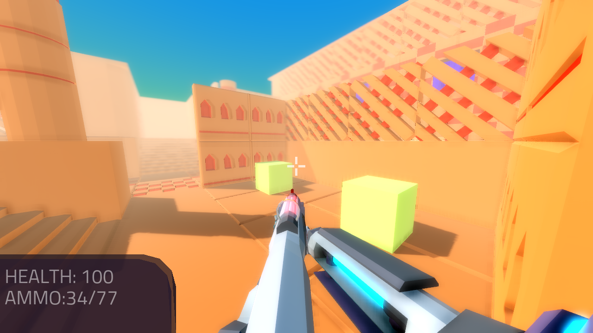

.. _doc_fps_tutorial_part_three:

Part 3
======

Part overview
-------------

In this part, we will be limiting the player's weapons by giving them ammo. We will also
be giving the player the ability to reload, and we will be adding sounds when the
weapons fire.

.. note:: You are assumed to have finished :ref:`doc_fps_tutorial_part_two` before moving on to this part of the tutorial.
          The finished project from :ref:`doc_fps_tutorial_part_two` will be the starting project for part 3

Let's get started!

Changing levels
---------------

Now that we have a fully working FPS, let's move to a more FPS-like level.

Open up ``Space_Level.tscn`` (``assets/Space_Level_Objects/Space_Level.tscn``)
and/or ``Ruins_Level.tscn`` (``assets/Ruin_Level_Objects/Ruins_Level.tscn``).

``Space_Level.tscn`` and ``Ruins_Level.tscn`` are complete custom FPS levels
created for the purpose of this tutorial. Press ``Play Current Scene`` button,
or :kbd:`F6` on keyboard, and give each a try.

.. warning:: ``Space_Level.tscn`` is more graphically demanding of the GPU than ``Ruins_Level.tscn``. If your computer is struggling to render
          ``Space_Level.tscn``, try using ``Ruins_Level.tscn`` instead.

You might have noticed there are several :ref:`RigidBody <class_RigidBody>` nodes placed throughout the level.
We can place ``RigidBody_hit_test.gd`` on them and then they will react to being hit with bullets, so let's do that!

Follow the instructions below for either (or both) of the scenes you want to use

.. tabs::
 .. code-tab:: gdscript Space_Level.tscn

    Expand "Other_Objects" and then expand "Physics_Objects".

    Expand one of the "Barrel_Group" nodes and then select "Barrel_Rigid_Body" and open it using
    the "Open in Editor" button.
    This will bring you to the "Barrel_Rigid_Body" scene. From there, select the root node and
    scroll the inspector down to the bottom.
    Select the drop down arrow under the "Node" tab, and then select "Load". Navigate to
    "RigidBody_hit_test.gd" and select "Open".

    Return back to "Space_Level.tscn".

    Expand one of the "Box_Group" nodes and then select "Crate_Rigid_Body" and open it using the
    "Open in Editor" button.
    This will bring you to the "Crate_Rigid_Body" scene. From there, select the root node and
    scroll the inspector down to the bottom.
    Select the drop down arrow under the "Node" tab, and then select "Load". Navigate to
    "RigidBody_hit_test.gd" and select "Open".

    Return to "Space_Level.tscn".

 .. code-tab:: gdscript Ruins_Level.tscn

    Expand "Misc_Objects" and then expand "Physics_Objects".

    Select all the "Stone_Cube" RigidBodies and then in the inspector scroll down to the bottom.
    Select the drop down arrow under the "Node" tab, and then select "Load". Navigate to
    "RigidBody_hit_test.gd" and select "Open".

    Return to "Ruins_Level.tscn".

Now you can fire at all the rigid bodies in either level and they will react to bullets hitting them!

Adding ammo
-----------

Now that the player has working guns, let's give them a limited amount of ammo.

Firstly, we need to define a few variables in each of our weapon scripts.

Open up ``Weapon_Pistol.gd`` and add the following class variables:

::

    var ammo_in_weapon = 10
    var spare_ammo = 20
    const AMMO_IN_MAG = 10

* ``ammo_in_weapon``: The amount of ammo currently in the pistol
* ``spare_ammo``: The amount of ammo we have left in reserve for the pistol
* ``AMMO_IN_MAG``: The amount of ammo in a fully reloaded weapon/magazine

Now all we need to do is add a single line of code to ``fire_weapon``.

Add the following right under ``Clone.BULLET_DAMAGE = DAMAGE``: ``ammo_in_weapon -= 1``

This will remove one from ``ammo_in_weapon`` every time the player fires. Notice we're not checking to see
if the player has enough ammo or not in ``fire_weapon``. Instead, we're going to check to see if the player has enough ammo in ``Player.gd``.

_______

Now we need to add ammo for both the rifle and the knife.

.. note:: You may be wondering why we are adding ammo for the knife given it does not consume any ammunition.
          The reason we want to add ammo to the knife is so we have a consistent interface for all our weapons.

          If we did not add ammo variables for the knife, we would have to add checks for the knife. By adding the ammo
          variables to the knife, we don't need to worry about whether or not all our weapons have the same variables.

Add the following class variables to ``Weapon_Rifle.gd``:

::

    var ammo_in_weapon = 50
    var spare_ammo = 100
    const AMMO_IN_MAG = 50

And then add the following to ``fire_weapon``: ``ammo_in_weapon -= 1``. Make sure that ``ammo_in_weapon -= 1`` is outside of the ``if ray.is_colliding()`` check so
the player loses ammo regardless of whether the player hit something or not.

Now all that's left is the knife. Add the following to ``Weapon_Knife.gd``:

::

    var ammo_in_weapon = 1
    var spare_ammo = 1
    const AMMO_IN_MAG = 1

Because the knife does not consume ammo, that is all we need to add.

_______

Now we need to change one thing in ``Player.gd``, that is to say,

how we're firing the weapons in ``process_input``. Change the code for firing weapons to the following:

::

    # ----------------------------------
    # Firing the weapons
    if Input.is_action_pressed("fire"):
        if changing_weapon == false:
            var current_weapon = weapons[current_weapon_name]
            if current_weapon != null:
                if current_weapon.ammo_in_weapon > 0:
                    if animation_manager.current_state == current_weapon.IDLE_ANIM_NAME:
                        animation_manager.set_animation(current_weapon.FIRE_ANIM_NAME)
    # ----------------------------------

Now the weapons have a limited amount of ammo, and will stop firing when the player runs out.

_______

Ideally, we'd like to let the player be able to see how much ammo is left. Let's make a new function called ``process_UI``.

First, add ``process_UI(delta)`` to ``_physics_process``.

Now add the following to ``Player.gd``:

::

    func process_UI(delta):
        if current_weapon_name == "UNARMED" or current_weapon_name == "KNIFE":
            UI_status_label.text = "HEALTH: " + str(health)
        else:
            var current_weapon = weapons[current_weapon_name]
            UI_status_label.text = "HEALTH: " + str(health) + \
                    "\nAMMO: " + str(current_weapon.ammo_in_weapon) + "/" + str(current_weapon.spare_ammo)

Let's go over what's happening:

Firstly, we check to see if the current weapon is either ``UNARMED`` or ``KNIFE``. If it is, we
change the ``UI_status_label``'s text to only show the player's health since ``UNARMED`` and ``KNIFE`` do not consume ammo.

If the player is using a weapon that consumes ammo, we first get the weapon node.

Then we change ``UI_status_label``'s text to show the player's health, along with how much ammo the player has in the weapon
and how much spare ammo the player has for that weapon.

Now we can see how much ammo the player has through the HUD.

Adding reloading to the weapons
-------------------------------

Now that the player can run out of ammo, we need a way to let the player fill them back up. Let's add reloading next!

For reloading, we need to add a few more variables and a function to every weapon.

Open up ``Weapon_Pistol.gd`` and add the following class variables:

::

    const CAN_RELOAD = true
    const CAN_REFILL = true

    const RELOADING_ANIM_NAME = "Pistol_reload"

* ``CAN_RELOAD``: A boolean to track whether this weapon has the ability to reload
* ``CAN_REFILL``: A boolean to track whether we can refill this weapon's spare ammo. We will not be using ``CAN_REFILL`` in this part, but we will in the next part!
* ``RELOADING_ANIM_NAME``: The name of the reloading animation for this weapon.

Now we need to add a function for handling reloading. Add the following function to ``Weapon_Pistol.gd``:

::

    func reload_weapon():
        var can_reload = false

        if player_node.animation_manager.current_state == IDLE_ANIM_NAME:
            can_reload = true

        if spare_ammo <= 0 or ammo_in_weapon == AMMO_IN_MAG:
            can_reload = false

        if can_reload == true:
            var ammo_needed = AMMO_IN_MAG - ammo_in_weapon

            if spare_ammo >= ammo_needed:
                spare_ammo -= ammo_needed
                ammo_in_weapon = AMMO_IN_MAG
            else:
                ammo_in_weapon += spare_ammo
                spare_ammo = 0

            player_node.animation_manager.set_animation(RELOADING_ANIM_NAME)

            return true

        return false

Let's go over what's happening:

First we define a variable to see whether or not this weapon can reload.

Then we check to see if the player is in this weapon's idle animation state because we only want to be able to reload when the player is not
firing, equipping, or unequipping.

Next we check to see if the player has spare ammo, and if the ammo already in the weapon is equal to a fully reloaded weapon.
This way we can ensure the player cannot reload when the player has no ammo or when the weapon is already full of ammo.

If we can still reload, then we calculate the amount of ammo needed to reload the weapon.

If the player has enough ammo to fill the weapon, we remove the ammo needed from ``spare_ammo`` and then set ``ammo_in_weapon`` to a full weapon/magazine.

If the player does not have enough ammo, we add all the ammo left in ``spare_ammo``, and then set ``spare_ammo`` to ``0``.

Next we play the reloading animation for this weapon, and then return ``true``.

If the player could not reload, we return ``false``.

_______

Now we need to add reloading to the rifle. Open up ``Weapon_Rifle.gd`` and add the following class variables:

::

    const CAN_RELOAD = true
    const CAN_REFILL = true

    const RELOADING_ANIM_NAME = "Rifle_reload"

These variables are exactly the same as the pistol, just with ``RELOADING_ANIM_NAME`` changed to the rifle's reloading animation.

Now we need to add ``reload_weapon`` to ``Weapon_Rifle.gd``:

::

    func reload_weapon():
        var can_reload = false

        if player_node.animation_manager.current_state == IDLE_ANIM_NAME:
            can_reload = true

        if spare_ammo <= 0 or ammo_in_weapon == AMMO_IN_MAG:
            can_reload = false

        if can_reload == true:
            var ammo_needed = AMMO_IN_MAG - ammo_in_weapon

            if spare_ammo >= ammo_needed:
                spare_ammo -= ammo_needed
                ammo_in_weapon = AMMO_IN_MAG
            else:
                ammo_in_weapon += spare_ammo
                spare_ammo = 0

            player_node.animation_manager.set_animation(RELOADING_ANIM_NAME)

            return true

        return false

This code is exactly the same as the one for the pistol.

_______

The last bit we need to do for the weapons is add 'reloading' to the knife. Add the following class variables to ``Weapon_Knife.gd``:

::

    const CAN_RELOAD = false
    const CAN_REFILL = false

    const RELOADING_ANIM_NAME = ""

Since we both cannot reload or refill a knife, we set both constants to ``false``. We also define ``RELOADING_ANIM_NAME`` as an empty string, since the knife
has no reloading animation.

Now we need to add ``reloading_weapon``:

::

    func reload_weapon():
        return false

Since we cannot reload a knife, we always return ``false``.

Adding reloading to the player
------------------------------

Now we need to add a few things to ``Player.gd``. First we need to define a new class variable:

::

    var reloading_weapon = false

* ``reloading_weapon``: A variable to track whether or not the player is currently trying to reload.

Next we need to add another function call to ``_physics_process``.

Add ``process_reloading(delta)`` to ``_physics_process``. Now ``_physics_process`` should look something like this:

::

    func _physics_process(delta):
        process_input(delta)
        process_movement(delta)
        process_changing_weapons(delta)
        process_reloading(delta)
        process_UI(delta)

Now we need to add ``process_reloading``. Add the following function to ``Player.gd``:

::

    func process_reloading(delta):
        if reloading_weapon == true:
            var current_weapon = weapons[current_weapon_name]
            if current_weapon != null:
                current_weapon.reload_weapon()
            reloading_weapon = false

Let's go over what's happening here.

Firstly, we check to make sure the player is trying to reload.

If the player is trying to reload, we then get the current weapon. If the current weapon does not equal ``null``, we call its ``reload_weapon`` function.

.. note:: If the current weapon is equal to ``null``, then the current weapon is ``UNARMED``.

Finally, we set ``reloading_weapon`` to ``false`` because, regardless of whether the player successfully reloaded, we've tried reloading
and no longer need to keep trying.

_______

Before we can let the player reload, we need to change a few things in ``process_input``.

The first thing we need to change is in the code for changing weapons. We need to add an additional check (``if reloading_weapon == false:``) to see if the player is reloading:

::

    if changing_weapon == false:
        # New line of code here!
        if reloading_weapon == false:
            if WEAPON_NUMBER_TO_NAME[weapon_change_number] != current_weapon_name:
                changing_weapon_name = WEAPON_NUMBER_TO_NAME[weapon_change_number]
                changing_weapon = true

This makes it so the player cannot change weapons if the player is reloading.

Now we need to add the code to trigger a reload when the player pushes the ``reload`` action. Add the following code to ``process_input``:

::

    # ----------------------------------
    # Reloading
    if reloading_weapon == false:
        if changing_weapon == false:
            if Input.is_action_just_pressed("reload"):
                var current_weapon = weapons[current_weapon_name]
                if current_weapon != null:
                    if current_weapon.CAN_RELOAD == true:
                        var current_anim_state = animation_manager.current_state
                        var is_reloading = false
                        for weapon in weapons:
                            var weapon_node = weapons[weapon]
                            if weapon_node != null:
                                if current_anim_state == weapon_node.RELOADING_ANIM_NAME:
                                    is_reloading = true
                        if is_reloading == false:
                            reloading_weapon = true
    # ----------------------------------

Let's go over what's happening here.

First we make sure the player is not reloading already, nor is the player trying to change weapons.

Then we check to see if the ``reload`` action has been pressed.

If the player has pressed ``reload``, we then get the current weapon and check to make sure it is not ``null``. Then we check to see whether the
weapon can reload or not using its ``CAN_RELOAD`` constant.

If the weapon can reload, we then get the current animation state, and make a variable for tracking whether the player is already reloading or not.

We then go through every weapon to make sure the player is not already playing that weapon's reloading animation.

If the player is not reloading any weapon, we set ``reloading_weapon`` to ``true``.

_______

One thing I like to add is where the weapon will reload itself if you try to fire it and it's out of ammo.

We also need to add an additional if check (``is_reloading_weapon == false:``) so the player cannot fire the current weapon while
reloading.

Let's change our firing code in ``process_input`` so it reloads when trying to fire an empty weapon:

::

    # ----------------------------------
    # Firing the weapons
    if Input.is_action_pressed("fire"):
        if reloading_weapon == false:
            if changing_weapon == false:
                var current_weapon = weapons[current_weapon_name]
                if current_weapon != null:
                    if current_weapon.ammo_in_weapon > 0:
                        if animation_manager.current_state == current_weapon.IDLE_ANIM_NAME:
                            animation_manager.set_animation(current_weapon.FIRE_ANIM_NAME)
                    else:
                        reloading_weapon = true
    # ----------------------------------

Now we check to make sure the player is not reloading before we fire the weapon, and when we have ``0`` or less ammo in the current weapon,
we set ``reloading_weapon`` to ``true`` if the player tries to fire.

This will make it so the player will try to reload when attempting to fire an empty weapon.

_______

With that done, the player can now reload! Give it a try! Now you can fire all the spare ammo for each weapon.

Adding sounds
-------------

Finally, let's add some sounds that accompany the player firing, reloading and changing weapons.

.. tip:: There are no game sounds provided in this tutorial (for legal reasons).
         https://gamesounds.xyz/ is a collection of **"royalty free or public domain music and sounds suitable for games"**.
         I used Gamemaster's Gun Sound Pack, which can be found in the Sonniss.com GDC 2017 Game Audio Bundle.

Open up ``Simple_Audio_Player.tscn``. It is simply a :ref:`Spatial <class_Spatial>` with an :ref:`AudioStreamPlayer <class_AudioStreamPlayer>` as its child.

.. note:: The reason this is called a 'simple' audio player is because we are not taking performance into account
          and because the code is designed to provide sound in the simplest way possible.

If you want to use 3D audio, so it sounds like it's coming from a location in 3D space, right click
the :ref:`AudioStreamPlayer <class_AudioStreamPlayer>` and select "Change type".

This will open the node browser. Navigate to :ref:`AudioStreamPlayer3D <class_AudioStreamPlayer3D>` and select "change".
In the source for this tutorial, we will be using :ref:`AudioStreamPlayer <class_AudioStreamPlayer>`, but you can optionally
use :ref:`AudioStreamPlayer3D <class_AudioStreamPlayer3D>` if you desire, and the code provided below will work regardless of which
one you chose.

Create a new script and call it ``Simple_Audio_Player.gd``. Attach it to the :ref:`Spatial <class_Spatial>` in ``Simple_Audio_Player.tscn``
and insert the following code:

::

    extends Spatial

    # All of the audio files.
    # You will need to provide your own sound files.
    var audio_pistol_shot = preload("res://path_to_your_audio_here")
    var audio_gun_cock = preload("res://path_to_your_audio_here")
    var audio_rifle_shot = preload("res://path_to_your_audio_here")

    var audio_node = null

    func _ready():
        audio_node = $Audio_Stream_Player
        audio_node.connect("finished", self, "destroy_self")
        audio_node.stop()

    func play_sound(sound_name, position=null):

        if audio_pistol_shot == null or audio_rifle_shot == null or audio_gun_cock == null:
            print ("Audio not set!")
            queue_free()
            return

        if sound_name == "Pistol_shot":
            audio_node.stream = audio_pistol_shot
        elif sound_name == "Rifle_shot":
            audio_node.stream = audio_rifle_shot
        elif sound_name == "Gun_cock":
            audio_node.stream = audio_gun_cock
        else:
            print ("UNKNOWN STREAM")
            queue_free()
            return

        # If you are using an AudioStreamPlayer3D, then uncomment these lines to set the position.
        #if audio_node is AudioStreamPlayer3D:
        #    if position != null:
        #        audio_node.global_transform.origin = position

        audio_node.play()

    func destroy_self():
        audio_node.stop()
        queue_free()

.. tip:: By setting ``position`` to ``null`` by default in ``play_sound``, we are making it an optional argument,
         meaning ``position`` doesn't necessarily have to be passed in to call ``play_sound``.

Let's go over what's happening here:

_________

In ``_ready``, we get the :ref:`AudioStreamPlayer <class_AudioStreamPlayer>` and connect its ``finished`` signal to the ``destroy_self`` function.
It doesn't matter if it's an :ref:`AudioStreamPlayer <class_AudioStreamPlayer>` or :ref:`AudioStreamPlayer3D <class_AudioStreamPlayer3D>` node,
as they both have the finished signal. To make sure it is not playing any sounds, we call ``stop`` on the :ref:`AudioStreamPlayer <class_AudioStreamPlayer>`.

.. warning:: Make sure your sound files are **not** set to loop! If it is set to loop,
             the sounds will continue to play infinitely and the script will not work!

The ``play_sound`` function is what we will be calling from ``Player.gd``. We check if the sound
is one of the three possible sounds, and if it is one of the three sounds we set the audio stream in :ref:`AudioStreamPlayer <class_AudioStreamPlayer>`
to the correct sound.

If it is an unknown sound, we print an error message to the console and free the audio player.

If you are using an :ref:`AudioStreamPlayer3D <class_AudioStreamPlayer3D>`, remove the ``#`` to set the position of
the audio player node so it plays at the correct position.

Finally, we tell the :ref:`AudioStreamPlayer <class_AudioStreamPlayer>` to play.

When the :ref:`AudioStreamPlayer <class_AudioStreamPlayer>` is finished playing the sound, it will call ``destroy_self`` because
we connected the ``finished`` signal in ``_ready``. We stop the :ref:`AudioStreamPlayer <class_AudioStreamPlayer>` and free the audio player
to save on resources.

.. note:: This system is extremely simple and has some major flaws:

          One flaw is we have to pass in a string value to play a sound. While it is relatively simple
          to remember the names of the three sounds, it can be increasingly complex when you have more sounds.
          Ideally, we'd place these sounds in some sort of container with exposed variables so we do not have
          to remember the name(s) of each sound effect we want to play.

          Another flaw is we cannot play looping sounds effects, nor background music, easily with this system.
          Because we cannot play looping sounds, certain effects, like footstep sounds, are harder to accomplish
          because we then have to keep track of whether or not there is a sound effect and whether or not we
          need to continue playing it.

          One of the biggest flaws with this system is we can only play sounds from ``Player.gd``.
          Ideally we'd like to be able to play sounds from any script at any time.

_________

With that done, let's open up ``Player.gd`` again.
First we need to load the ``Simple_Audio_Player.tscn``. Place the following code in the class variables section of the script:

::

    var simple_audio_player = preload("res://Simple_Audio_Player.tscn")

Now we need to instance the simple audio player when we need it, and then call its
``play_sound`` function and pass the name of the sound we want to play. To make the process simpler,
let's create a ``create_sound`` function in ``Player.gd``:

::

    func create_sound(sound_name, position=null):
        var audio_clone = simple_audio_player.instance()
        var scene_root = get_tree().root.get_children()[0]
        scene_root.add_child(audio_clone)
        audio_clone.play_sound(sound_name, position)

Let's walk through what this function does:

_________

The first line instances the ``Simple_Audio_Player.tscn`` scene and assigns it to a variable
named ``audio_clone``.

The second line gets the scene root, and this has a large (though safe) assumption.

We first get this node's :ref:`SceneTree <class_SceneTree>`,
and then access the root node, which in this case is the :ref:`Viewport <class_Viewport>` this entire game is running under.
Then we get the first child of the :ref:`Viewport <class_Viewport>`, which in our case happens to be the root node in
``Test_Area.tscn`` or any of the other provided levels. **We are making a huge assumption that the first child of the root node
is the root scene that the player is under, which may not always be the case**.

If this doesn't make sense to you, don't worry too much about it. The second line of code only does not work
reliably if you have multiple scenes loaded as children of the root node at a time, which will rarely happen for most projects and will not be happening in this tutorial series.
This is only potentially a issue depending on how you handle scene loading.

The third line adds our newly created ``Simple_Audio_Player`` scene to be a child of the scene root. This
works exactly the same as when we are spawning bullets.

Finally, we call the ``play_sound`` function and pass in the arguments passed in to ``create_sound``. This will call
``Simple_Audio_Player.gd``'s ``play_sound`` function with the passed in arguments.

_________

Now all that is left is playing the sounds when we want to. Let's add sound to the pistol first!

Open up ``Weapon_Pistol.gd``.

Now, we want to make a noise when the player fires the pistol, so add the following to the end of the ``fire_weapon`` function:

::

    player_node.create_sound("Pistol_shot", self.global_transform.origin)

Now when the player fires the pistol, we'll play the ``Pistol_shot`` sound.

To make a sound when the player reloads, we need to add the following right under ``player_node.animation_manager.set_animation(RELOADING_ANIM_NAME)`` in the
``reload_weapon`` function:

::

    player_node.create_sound("Gun_cock", player_node.camera.global_transform.origin)

Now when the player reloads, we'll play the ``Gun_cock`` sound.

_________

Now let's add sounds to the rifle.
Open up ``Weapon_Rifle.gd``.

To play sounds when the rifle is fired, add the following to the end of the ``fire_weapon`` function:

::

    player_node.create_sound("Rifle_shot", ray.global_transform.origin)

Now when the player fires the rifle, we'll play the ``Rifle_shot`` sound.

To make a sound when the player reloads, we need to add the following right under ``player_node.animation_manager.set_animation(RELOADING_ANIM_NAME)`` in the
``reload_weapon`` function:

::

    player_node.create_sound("Gun_cock", player_node.camera.global_transform.origin)

Now when the player reloads, we'll play the ``Gun_cock`` sound.

Final notes
-----------

Now you have weapons with limited ammo that play sounds when you fire them!

At this point, we have all the basics of an FPS game working.
There are still a few things that would be nice to add, and we're going to add them in the next three parts!

For example, right now we have no way to add ammo to our spares, so we'll eventually run out. Also, we don't
have anything to shoot at outside of the :ref:`RigidBody <class_RigidBody>` nodes.

In :ref:`doc_fps_tutorial_part_four` we'll add some targets to shoot at, along with some health and ammo pick ups!
We're also going to add joypad support, so we can play with wired Xbox 360 controllers!

.. warning:: If you ever get lost, be sure to read over the code again!

             You can download the finished project for this part here: :download:`Godot_FPS_Part_3.zip <files/Godot_FPS_Part_3.zip>`
