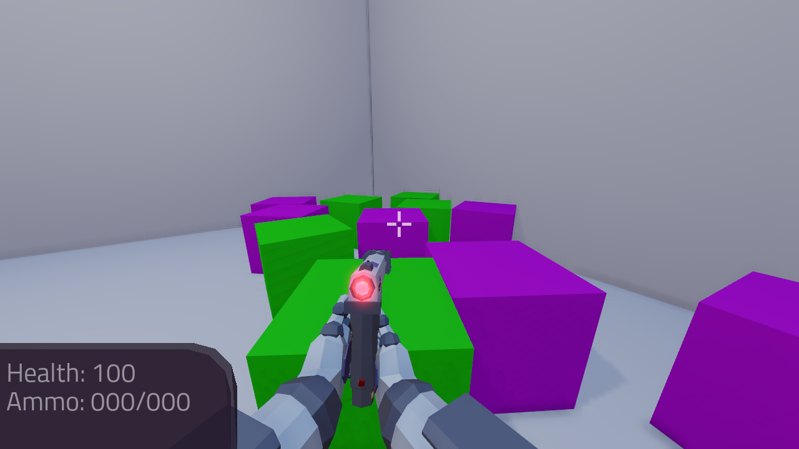
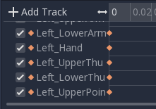
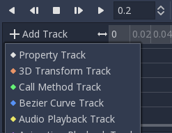
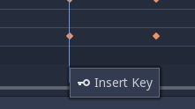

.. _doc_fps_tutorial_part_two:

Part 2
======

Part overview
-------------

In this part we will be giving our player weapons to play with.

By the end of this part, you will have a player that can fire a pistol,
rifle, and attack using a knife. The player will also now have animations with transitions,
and the weapons will interact with objects in the environment.

.. note:: You are assumed to have finished :ref:`doc_fps_tutorial_part_one` before moving on to this part of the tutorial.
          The finished project from :ref:`doc_fps_tutorial_part_one` will be the starting project for part 2

Let's get started!

Making a system to handle animations
------------------------------------

First we need a way to handle changing animations. Open up ``Player.tscn`` and select the :ref:`AnimationPlayer <class_AnimationPlayer>`
Node (``Player`` -> ``Rotation_Helper`` -> ``Model`` -> ``Animation_Player``).

Create a new script called ``AnimationPlayer_Manager.gd`` and attach that to the :ref:`AnimationPlayer <class_AnimationPlayer>`.

Add the following code to ``AnimationPlayer_Manager.gd``:

::

    extends AnimationPlayer

    # Structure -> Animation name :[Connecting Animation states]
    var states = {
        "Idle_unarmed":["Knife_equip", "Pistol_equip", "Rifle_equip", "Idle_unarmed"],

        "Pistol_equip":["Pistol_idle"],
        "Pistol_fire":["Pistol_idle"],
        "Pistol_idle":["Pistol_fire", "Pistol_reload", "Pistol_unequip", "Pistol_idle"],
        "Pistol_reload":["Pistol_idle"],
        "Pistol_unequip":["Idle_unarmed"],

        "Rifle_equip":["Rifle_idle"],
        "Rifle_fire":["Rifle_idle"],
        "Rifle_idle":["Rifle_fire", "Rifle_reload", "Rifle_unequip", "Rifle_idle"],
        "Rifle_reload":["Rifle_idle"],
        "Rifle_unequip":["Idle_unarmed"],

        "Knife_equip":["Knife_idle"],
        "Knife_fire":["Knife_idle"],
        "Knife_idle":["Knife_fire", "Knife_unequip", "Knife_idle"],
        "Knife_unequip":["Idle_unarmed"],
    }

    var animation_speeds = {
        "Idle_unarmed":1,

        "Pistol_equip":1.4,
        "Pistol_fire":1.8,
        "Pistol_idle":1,
        "Pistol_reload":1,
        "Pistol_unequip":1.4,

        "Rifle_equip":2,
        "Rifle_fire":6,
        "Rifle_idle":1,
        "Rifle_reload":1.45,
        "Rifle_unequip":2,

        "Knife_equip":1,
        "Knife_fire":1.35,
        "Knife_idle":1,
        "Knife_unequip":1,
    }

    var current_state = null
    var callback_function = null

    func _ready():
        set_animation("Idle_unarmed")
        connect("animation_finished", self, "animation_ended")

    func set_animation(animation_name):
        if animation_name == current_state:
            print ("AnimationPlayer_Manager.gd -- WARNING: animation is already ", animation_name)
            return true

        if has_animation(animation_name):
            if current_state != null:
                var possible_animations = states[current_state]
                if animation_name in possible_animations:
                    current_state = animation_name
                    play(animation_name, -1, animation_speeds[animation_name])
                    return true
                else:
                    print ("AnimationPlayer_Manager.gd -- WARNING: Cannot change to ", animation_name, " from ", current_state)
                    return false
            else:
                current_state = animation_name
                play(animation_name, -1, animation_speeds[animation_name])
                return true
        return false

    func animation_ended(anim_name):

        # UNARMED transitions
        if current_state == "Idle_unarmed":
            pass
        # KNIFE transitions
        elif current_state == "Knife_equip":
            set_animation("Knife_idle")
        elif current_state == "Knife_idle":
            pass
        elif current_state == "Knife_fire":
            set_animation("Knife_idle")
        elif current_state == "Knife_unequip":
            set_animation("Idle_unarmed")
        # PISTOL transitions
        elif current_state == "Pistol_equip":
            set_animation("Pistol_idle")
        elif current_state == "Pistol_idle":
            pass
        elif current_state == "Pistol_fire":
            set_animation("Pistol_idle")
        elif current_state == "Pistol_unequip":
            set_animation("Idle_unarmed")
        elif current_state == "Pistol_reload":
            set_animation("Pistol_idle")
        # RIFLE transitions
        elif current_state == "Rifle_equip":
            set_animation("Rifle_idle")
        elif current_state == "Rifle_idle":
            pass;
        elif current_state == "Rifle_fire":
            set_animation("Rifle_idle")
        elif current_state == "Rifle_unequip":
            set_animation("Idle_unarmed")
        elif current_state == "Rifle_reload":
            set_animation("Rifle_idle")

    func animation_callback():
        if callback_function == null:
            print ("AnimationPlayer_Manager.gd -- WARNING: No callback function for the animation to call!")
        else:
            callback_function.call_func()

Lets go over what this script is doing:

_________

Lets start with this script's class variables:

- ``states``: A dictionary for holding our animation states. (Further explanation below)
- ``animation_speeds``: A dictionary for holding all the speeds at which we want to play our animations.
- ``current_state``: A variable for holding the name of the animation state we are currently in.
- ``callback_function``: A variable for holding the callback function. (Further explanation below)

If you are familiar with state machines, then you may have noticed that ``states`` is structured
like a basic state machine. Here is roughly how ``states`` is set up:

``states`` is a dictionary with the key being the name of the current state, and the value being
an array holding all the animations (states) we can transition to. For example, if we are currently in the
``Idle_unarmed`` state, we can only transition to ``Knife_equip``, ``Pistol_equip``, ``Rifle_equip``, and
``Idle_unarmed``.

If we try to transition to a state that is not included in the possible transitions states for the state we are in,
then we get a warning message and the animation does not change. We can also automatically
transition from some states into others, as will be explained further below in ``animation_ended``

.. note:: For the sake of keeping this tutorial simple, we are not using a 'proper'
          state machine. If you are interested to know more about state machines,
          see the following articles:

          - (Python example) https://dev.to/karn/building-a-simple-state-machine-in-python
          - (C# example) https://www.codeproject.com/Articles/489136/UnderstandingplusandplusImplementingplusStateplusP
          - (Wiki article) https://en.wikipedia.org/wiki/Finite-state_machine

``animation_speeds`` is how fast each animation will play. Some of the animations are a little slow
and in an effort to make everything look smooth, we need to play them at faster speeds.

.. tip:: Notice that all of the firing animations are faster than their normal speed. Remember this for later!

``current_state`` will hold the name of the animation state we are currently in.

Finally, ``callback_function`` will be a :ref:`FuncRef <class_FuncRef>` passed in by the player for spawning bullets
at the proper frame of animation. A :ref:`FuncRef <class_FuncRef>` allows us to pass in a function as an argument,
effectively allowing us to call a function from another script, which is how we will use it later.

_________

Now let's look at ``_ready``.

First we are setting our animation to ``Idle_unarmed`` using the ``set_animation`` function,
so we for sure start in that animation.

Next we connect the ``animation_finished`` signal to this script and assign it to call ``animation_ended``.
This means whenever an animation is finished, ``animation_ended`` will be called.

_________

Lets look at ``set_animation`` next.

``set_animation`` changes the animation to the animation named ``animation_name``
*if* we can transition to it. In other words, if the animation state we are currently in
has the passed in animation state name in ``states``, then we will change to that animation.

Firstly, we check if the passed in animation name is the same name as the animation currently playing.
If they are the same, then we write a warning to the console and return ``true``.

Secondly, we see if :ref:`AnimationPlayer <class_AnimationPlayer>` has the animation with the name ``animation_name`` using ``has_animation``.
If it does not, we return ``false``.

Thirdly, we check whether ``current_state`` is set. If we have a state in ``current_state``, then we get all the possible states we can transition to.

If the animation name is in the list of possible transitions, we set ``current_state`` to the passed in
animation (``animation_name``), tell :ref:`AnimationPlayer <class_AnimationPlayer>` to play the animation with
a blend time of ``-1`` at the speed set in ``animation_speeds`` and return ``true``.

.. note:: Blend time is how long to blend/mix the two animations together.

          By putting in a value of ``-1``, the new animation instantly plays, overriding whatever animation is already playing.

          If you put in a value of ``1``, for one second the new animation will play with increasing strength, blending the two animations together for one second
          before playing only the new animation. This leads to a smooth transition between animations, which looks great when you are changing from
          a walking animation to a running animation.

          We set the blend time to ``-1`` because we want to instantly change animations.

_________

Now lets look at ``animation_ended``.

``animation_ended`` is the function that will be called by :ref:`AnimationPlayer <class_AnimationPlayer>` when it's done playing an animation.

For certain animation states, we may need to transition into another state when it's finished. To handle this, we
check for every possible animation state. If we need to, we will transition into another state.

.. warning:: If you are using your own animated models, make sure that none of the animations are set
             to loop. Looping animations do not send the ``animation_finished`` signal when they reach
             the end of the animation and are about to loop again.

.. note:: The transitions in ``animation_ended`` would ideally be part of the data in ``states``, but in
          an effort to make the tutorial easier to understand, we'll hard code each state transition
          in ``animation_ended``.

_________

Finally, there is ``animation_callback``. This function will be called by a call method track in our animations.
If we have a :ref:`FuncRef <class_FuncRef>` assigned to ``callback_function``, then we call that passed in function. If we do not
have a :ref:`FuncRef <class_FuncRef>` assigned to ``callback_function``, we print out a warning to the console.

.. tip:: Try running ``Testing_Area.tscn`` to make sure there are no runtime issues. If the game runs but nothing
         seems to have changed, then everything is working correctly.

Getting the animations ready
----------------------------

Now that we have a working animation manager, we need to call it from our player script.
Before that, though, we need to set some animation callback tracks in our firing animations.

Open up ``Player.tscn`` if you don't have it open and navigate to the :ref:`AnimationPlayer <class_AnimationPlayer>` node
(``Player`` -> ``Rotation_Helper`` -> ``Model`` -> ``Animation_Player``).

We need to attach a call method track to three of our animations: The firing animation for the pistol, rifle, and knife.
Let's start with the pistol. Click the animation drop down list and select "Pistol_fire".

Now scroll down to the bottom of the list of animation tracks. The final item in the list should read
``Armature/Skeleton:Left_UpperPointer``. Now above the list, click the "Add track" button, to the left of the time line

This will bring up a window with a few choices. We want to add a call method track, so click the
option that reads "Call Method Track". This will open a window showing the entire node tree. Navigate to the
:ref:`AnimationPlayer <class_AnimationPlayer>` node, select it, and press OK.

Now at the bottom of list of animation tracks you will have a green track that reads "AnimationPlayer".
Now we need to add the point where we want to call our callback function. Scrub the timeline until you
reach the point where the muzzle starts to flash.

.. note:: The timeline is the window where all the points in our animation are stored. Each of the little
          points represents a point of animation data.

          To actually preview the "Pistol_fire" animation, select the :ref:`Camera <class_Camera>` node
          underneath Rotation Helper and check the "Preview" box underneath Perspective in the top-left corner.

          Scrubbing the timeline means moving ourselves through the animation. So when we say "scrub the timeline
          until you reach a point", what we mean is move through the animation window until you reach the point
          on the timeline.

          Also, the muzzle of a gun is the end point where the bullet comes out. The muzzle flash is the flash of
          light that escapes the muzzle when a bullet is fired. The muzzle is also sometimes referred to as the
          barrel of the gun.

.. tip:: For finer control when scrubbing the timeline, press :kbd:`Ctrl` and scroll forward with the mouse wheel to zoom in.
         Scrolling backwards will zoom out.

         You can also change how the timeline scrubbing snaps by changing the value in ``Step (s)`` to a lower/higher value.

Once you get to a point you like, right click on the row for "Animation Player" and press ``Insert Key``.
In the empty name field, enter ``animation_callback`` and press :kbd:`Enter`.

Now when we are playing this animation the call method track will be triggered at that specific point of the animation.

_________

Let's repeat the process for the rifle and knife firing animations!

.. note:: Because the process is exactly the same as the pistol, the process is going to explained in a little less depth.
          Follow the steps from above if you get lost! It is exactly the same, just on a different animation.

Go to the "Rifle_fire" animation from the animation drop down. Add the call method track once you reach the bottom of the
animation track list by clicking the "Add Track" button above the list. Find the point where the muzzle starts
to flash and right click and press ``Insert Key`` to add a call method track point at that position on the track.

Type "animation_callback" into the name field of the pop up which opened and press :kbd:`Enter`.

Now we need to apply the callback method track to the knife animation. Select the "Knife_fire" animation and scroll to the bottom of the
animation tracks. Click the "Add Track" button above the list and add a method track.
Next find a point around the first third of the animation to place the animation callback method point at.

.. note:: We will not actually be firing the knife, and the animation is a stabbing animation rather than a firing one.
         For this tutorial we are reusing the gun firing logic for our knife, so the animation has been named in a style that
         is consistent with the other animations.

From there right click on the timeline and click "Insert Key". Put "animation_callback" into the name field and press :kbd:`Enter`.

.. tip:: Be sure to save your work!

With that done, we are almost ready to start adding the ability to fire to our player script! We need to set up one last scene:
The scene for our bullet object.

Creating the bullet scene
-------------------------

There are several ways to handle a gun's bullets in video games. In this tutorial series,
we will be exploring two of the more common ways: Objects, and raycasts.

_________

One of the two ways is using a bullet object. This will be an object that travels through the world and handles
its own collision code. In this method we create/spawn a bullet object in the direction our gun is facing, and then
it travels forward.

There are several advantages to this method. The first being we do not have to store the bullets in our player. We can simply create the bullet
and then move on, and the bullet itself will handle checking for collisions, sending the proper signal(s) to the object it collides with, and destroying itself.

Another advantage is we can have more complex bullet movement. If we want to make the bullet fall ever so slightly as time goes on, we can make the bullet
controlling script slowly push the bullet towards the ground. Using an object also makes the bullet take time to reach its target, it doesn't instantly
hit whatever it's pointed at. This feels more realistic because nothing in real life moves instantly from one point to another.

One of the huge disadvantages is performance. While having each bullet calculate their own paths and handle their own collision allows for a lot of flexibility,
it comes at the cost of performance. With this method we are calculating every bullet's movement every step, and while this may not be a problem for a few dozen
bullets, it can become a huge problem when you potentially have several hundred bullets.

Despite the performance hit, many first person shooters include some form of object bullets. Rocket launchers are a prime example because in many
first person shooters, rockets do not just instantly explode at their target position. You can also find bullets as objects many times with grenades
because they generally bounce around the world before exploding.

.. note:: While I cannot say for sure this is the case, these games *probably* use bullet objects in some form or another:
          (These are entirely from my observations. **They may be entirely wrong**. I have never worked on **any** of the following games)

          - Halo (Rocket launchers, fragmentation grenades, sniper rifles, brute shot, and more)
          - Destiny (Rocket launchers, grenades, fusion rifles, sniper rifles, super moves, and more)
          - Call of Duty (Rocket launchers, grenades, ballistic knives, crossbows, and more)
          - Battlefield (Rocket launchers, grenades, claymores, mortars, and more)

Another disadvantage with bullet objects is networking. Bullet objects have to sync the positions (at least) with all the clients that are connected
to the server.

While we are not implementing any form of networking (as that would be in its own entire tutorial series), it is a consideration
to keep in mind when creating your first person shooter, especially if you plan on adding some form of networking in the future.

_________

The other way of handling bullet collisions we will be looking at is raycasting.

This method is extremely common in guns that have fast moving bullets that rarely change trajectory over time.

Instead of creating a bullet object and sending it through space, we instead send a ray starting from the barrel/muzzle of the gun forwards.
We set the raycast's origin to the starting position of the bullet, and based on the length we can adjust how far the bullet 'travels' through space.

.. note:: While I cannot say for sure this is the case, these games *probably* use raycasts in some form or another:
          (These are entirely from my observations. **They may be entirely wrong**. I have never worked on **any** of the following games)

          - Halo (Assault rifles, DMRs, battle rifles, covenant carbine, spartan laser, and more)
          - Destiny (Auto rifles, pulse rifles, scout rifles, hand cannons, machine guns, and more)
          - Call of Duty (Assault rifles, light machine guns, sub machine guns, pistols, and more)
          - Battlefield (Assault rifles, SMGs, carbines, pistols, and more)

One huge advantage of this method is that it's light on performance.
Sending a couple hundred rays through space is *much* easier for the computer to calculate than sending a couple hundred
bullet objects.

Another advantage is we can instantly know if we've hit something or not exactly when we call for it. For networking this is important because we do not need
to sync the bullet movements over the Internet, we only need to send whether or not the raycast hit.

Raycasting does have some disadvantages, though. One major disadvantage is we cannot easily cast a ray in anything but a linear line.
This means we can only fire in a straight line for however long our ray length is. You can create the illusion of bullet movement by casting
multiple rays at different positions, but not only is this hard to implement in code, it is also heavier on performance.

Another disadvantage is we cannot see the bullet. With bullet objects we can actually see the bullet travel through space if we attach a mesh
to it, but because raycasts happen instantly, we do not have a decent way of showing the bullets. You could draw a line from the origin of the
raycast to the point where the raycast collided, and that is one popular way of showing raycasts. Another way is simply not drawing the raycast
at all, because theoretically the bullets move so fast our eyes could not see it anyway.

_________

Let's get the bullet object set up. This is what our pistol will create when the "Pistol_fire" animation callback function is called.

Open up ``Bullet_Scene.tscn``. The scene contains :ref:`Spatial <class_Spatial>` node called bullet, with a :ref:`MeshInstance <class_MeshInstance>`
and an :ref:`Area <class_Area>` with a :ref:`CollisionShape <class_CollisionShape>` children to it.

Create a new script called ``Bullet_script.gd`` and attach it to the ``Bullet`` :ref:`Spatial <class_Spatial>`.

We are going to move the entire bullet object at the root (``Bullet``). We will be using the :ref:`Area <class_Area>` to check whether or not we've collided with something

.. note:: Why are we using an :ref:`Area <class_Area>` and not a :ref:`RigidBody <class_RigidBody>`? The main reason we're not using a :ref:`RigidBody <class_RigidBody>`
          is because we do not want the bullet to interact with other :ref:`RigidBody <class_RigidBody>` nodes.
          By using an :ref:`Area <class_Area>` we are ensuring that none of the other :ref:`RigidBody <class_RigidBody>` nodes, including other bullets, will be effected.

          Another reason is simply because it is easier to detect collisions with an :ref:`Area <class_Area>`!

Here's the script that will control our bullet:

::

    extends Spatial

    var BULLET_SPEED = 70
    var BULLET_DAMAGE = 15

    const KILL_TIMER = 4
    var timer = 0

    var hit_something = false

    func _ready():
        $Area.connect("body_entered", self, "collided")

    func _physics_process(delta):
        var forward_dir = global_transform.basis.z.normalized()
        global_translate(forward_dir * BULLET_SPEED * delta)

        timer += delta
        if timer >= KILL_TIMER:
            queue_free()

    func collided(body):
        if hit_something == false:
            if body.has_method("bullet_hit"):
                body.bullet_hit(BULLET_DAMAGE, global_transform)

        hit_something = true
        queue_free()

Let's go through the script:

_________

First we define a few class variables:

- ``BULLET_SPEED``: The speed at which the bullet travels.
- ``BULLET_DAMAGE``: The damage the bullet will cause to anything with which it collides.
- ``KILL_TIMER``: How long the bullet can last without hitting anything.
- ``timer``: A float for tracking how long the bullet has been alive.
- ``hit_something``: A boolean for tracking whether or not we've hit something.

With the exception of ``timer`` and ``hit_something``, all of these variables
change how the bullet interacts with the world.

.. note:: The reason we are using a kill timer is so we do not have a case where we
          get a bullet travelling forever. By using a kill timer, we can ensure that
          no bullets will travel forever and consume resources.

.. tip:: As in :ref:`doc_fps_tutorial_part_one`, we have a couple all uppercase class variables. The reason behind this is the same
         as the reason given in :ref:`doc_fps_tutorial_part_one`: We want to treat these variables like constants, but we want to be
         able to change them. In this case we will later need to change the damage and speed of these bullets,
         so we need them to be variables and not constants.

_________

In ``_ready`` we set the area's ``body_entered`` signal to ourself so that it calls
the ``collided`` function when a body enters the area.

_________

``_physics_process`` gets the bullet's local ``Z`` axis. If you look at the scene
in local mode, you will find that the bullet faces the positive local ``Z`` axis.

Next we translate the entire bullet by that forward direction, multiplying in our speed and delta time.

After that we add delta time to our timer and check whether the timer has reached a value as big or greater
than our ``KILL_TIME`` constant. If it has, we use ``queue_free`` to free the bullet.

_________

In ``collided`` we check whether we've hit something yet.

Remember that ``collided`` is only called when a body has entered the :ref:`Area <class_Area>` node.
If the bullet has not already collided with something, we then proceed to check if the body the bullet has collided
with has a function/method called ``bullet_hit``. If it does, we call it and pass in the bullet's damage and the bullet's global transform
so we can get the bullet's rotation and position.

.. note:: in ``collided``, the passed in body can be a :ref:`StaticBody <class_StaticBody>`,
          :ref:`RigidBody <class_RigidBody>`, or :ref:`KinematicBody <class_KinematicBody>`

We set the Bullet's ``hit_something`` variable to ``true`` because regardless of whether or not the body that
the bullet collided with has the ``bullet_hit`` function/method, it has hit something and so we need to make sure the bullet does not hit anything else.

Then we free the bullet using ``queue_free``.

.. tip:: You may be wondering why we even have a ``hit_something`` variable if we
         free the bullet using ``queue_free`` as soon as it hits something.

         The reason we need to track whether we've hit something or not is because ``queue_free``
         does not immediately free the node, so the bullet could collide with another body
         before Godot has a chance to free it. By tracking whether the bullet has hit something,
         we can make sure that the bullet will only hit one object.

_________

Before we start programming the player again, let's take a quick look at ``Player.tscn``.
Open up ``Player.tscn`` again.

Expand ``Rotation_Helper`` and notice how it has two nodes: ``Gun_Fire_Points`` and
``Gun_Aim_Point``.

``Gun_aim_point`` is the point that the bullets will be aiming at. Notice how it
is lined up with the center of the screen and pulled a distance forward on the Z
axis. ``Gun_aim_point`` will serve as the point where the bullets will for sure collide
with as it goes along.

.. note:: There is a invisible mesh instance for debugging purposes. The mesh is
          a small sphere that visually shows at which target the bullets will be aiming.

Open up ``Gun_Fire_Points`` and you'll find three more :ref:`Spatial <class_Spatial>` nodes, one for each
weapon.

Open up ``Rifle_Point`` and you'll find a :ref:`Raycast <class_Raycast>` node. This is where
we will be sending the raycasts for our rifle's bullets.
The length of the raycast will dictate how far our bullets will travel.

We are using a :ref:`Raycast <class_Raycast>` node to handle the rifle's bullet because
we want to fire lots of bullets quickly. If we use bullet objects, it is quite possible
we could run into performance issues on older machines.

.. note:: If you are wondering from where the positions of the points came, they
          are the rough positions of the ends of each weapon. You can see this by
          going to ``AnimationPlayer``, selecting one of the firing animations
          and scrubbing through the timeline. The point for each weapon should mostly line
          up with the end of each weapon.

Open up ``Knife_Point`` and you'll find an :ref:`Area <class_Area>` node. We are using an :ref:`Area <class_Area>` for the knife
because we only care for all the bodies close to us, and because our knife does
not fire into space. If we were making a throwing knife, we would likely spawn a bullet
object that looks like a knife.

Finally, we have ``Pistol_Point``. This is the point where we will be creating/instancing
our bullet objects. We do not need any additional nodes here, as the bullet handles all
of its own collision detection.

Now that we've seen how we will handle our other weapons, and where we will spawn the bullets,
let's start working on making them work.

.. note:: You can also look at the HUD nodes if you want. There is nothing fancy there and other
         than using a single :ref:`Label <class_Label>`, we will not be touching any of those nodes.
         Check :ref:`doc_design_interfaces_with_the_control_nodes` for a tutorial on using GUI nodes.

Creating the first weapon
-------------------------

Lets write the code for each of our weapons, starting with the pistol.

Select ``Pistol_Point`` (``Player`` -> ``Rotation_Helper`` -> ``Gun_Fire_Points`` -> ``Pistol_Point``) and create a new script called ``Weapon_Pistol.gd``.

Add the following code to ``Weapon_Pistol.gd``:

::

    extends Spatial

    const DAMAGE = 15

    const IDLE_ANIM_NAME = "Pistol_idle"
    const FIRE_ANIM_NAME = "Pistol_fire"

    var is_weapon_enabled = false

    var bullet_scene = preload("Bullet_Scene.tscn")

    var player_node = null

    func _ready():
        pass

    func fire_weapon():
        var clone = bullet_scene.instance()
        var scene_root = get_tree().root.get_children()[0]
        scene_root.add_child(clone)

        clone.global_transform = self.global_transform
        clone.scale = Vector3(4, 4, 4)
        clone.BULLET_DAMAGE = DAMAGE

    func equip_weapon():
        if player_node.animation_manager.current_state == IDLE_ANIM_NAME:
            is_weapon_enabled = true
            return true

        if player_node.animation_manager.current_state == "Idle_unarmed":
            player_node.animation_manager.set_animation("Pistol_equip")

        return false

    func unequip_weapon():
        if player_node.animation_manager.current_state == IDLE_ANIM_NAME:
            if player_node.animation_manager.current_state != "Pistol_unequip":
                player_node.animation_manager.set_animation("Pistol_unequip")

        if player_node.animation_manager.current_state == "Idle_unarmed":
            is_weapon_enabled = false
            return true
        else:
            return false

Let's go over how the script works.

_________

First we define some class variables we'll need in the script:

* ``DAMAGE``: The amount of damage a single bullet does.
* ``IDLE_ANIM_NAME``: The name of the pistol's idle animation.
* ``FIRE_ANIM_NAME``: The name of the pistol's fire animation.
* ``is_weapon_enabled``: A variable for checking whether this weapon is in use/enabled.
* ``bullet_scene``: The bullet scene we worked on earlier.
* ``player_node``: A variable to hold ``Player.gd``.

The reason we define most of these variables is so we can use them in ``Player.gd``.

Each of the weapons we'll make will have all these variables (minus ``bullet_scene``) so we have
a consistent interface to interact with in ``Player.gd``. By using the same variables/functions in each
weapon, we can interact with them without having to know which weapon we are using, which makes our code
much more modular because we can add weapons without having to change much of the code in ``Player.gd`` and it will just work.

We could write all the code in ``Player.gd``, but then ``Player.gd`` will get increasingly harder to manage as we add weapons.
By using a modular design with a consistent interface, we can keep ``Player.gd`` nice and neat, while also making it easier to add/remove/modify weapons.

_________

In ``_ready`` we simply pass over it.

There is one thing of note though, an assumption that we'll fill in ``Player.gd`` at some point.

We are going to assume that ``Player.gd`` will pass themselves in before calling any of the functions in ``Weapon_Pistol.gd``.

While this can lead to situations where the player does not pass themselves in (because we forget), we would have to have a long string
of ``get_parent`` calls to traverse up the scene tree to retrieve the player. This does not look pretty (``get_parent().get_parent().get_parent()`` and so on)
and it is relatively safe to assume we will remember to pass ourselves to each weapon in ``Player.gd``.

_________

Next let's look at ``fire_weapon``:

The first thing we do is instance the bullet scene we made earlier.

.. tip:: By instancing the scene, we are creating a new node holding all the node(s) in the scene we instanced, effectively cloning that scene.

Then we add a ``clone`` to the first child node of the root of the scene we are currently in. By doing this, we're making it a child of the root node of the currently loaded scene.

In other words, we are adding a ``clone`` as a child of the first node (whatever is at the top of the scene tree) in the currently loaded/opened scene.
If the currently loaded/open scene is ``Testing_Area.tscn``, we'd be adding our ``clone`` as a child of ``Testing_Area``, the root node in that scene.

.. warning:: As mentioned later below in the section on adding sounds, this method makes an assumption. This will be explained later
             in the section on adding sounds in :ref:`doc_fps_tutorial_part_three`

Next we set the global transform of the clone to the ``Pistol_Point``'s global transform. The reason we do this is so the bullet is spawned at the end of the pistol.

You can see that ``Pistol_Point`` is positioned right at the end of the pistol by clicking the :ref:`AnimationPlayer <class_AnimationPlayer>` and
scrolling through ``Pistol_fire``. You'll find the position is more or less at the end of the pistol when it fires.

Next we scale it up by a factor of ``4`` because the bullet scene is a little too small by default.

Then we set the bullet's damage (``BULLET_DAMAGE``) to the amount of damage a single pistol bullet does (``DAMAGE``).

_________

Now let's look at ``equip_weapon``:

The first thing we do is check to see whether the animation manager is in the pistol's idle animation.
If we are in the pistol's idle animation, we set ``is_weapon_enabled`` to ``true`` and return ``true`` because the pistol has successfully
been equipped.

Because we know our pistol's ``equip`` animation automatically transitions to the pistol's idle animation, if we are in the pistol's
idle animation the pistol must have finished playing the equip animation.

.. note:: We know these animations will transition because we wrote the code to make them transition in ``Animation_Manager.gd``

Next we check to see if the player is in the ``Idle_unarmed`` animation state. Because all unequipping animations go to this state, and because any
weapon can be equipped from this state, we change animations to ``Pistol_equip`` if the player is in the ``Idle_unarmed`` state.

Since we know ``Pistol_equip`` will transition to ``Pistol_idle``, we do not need to do any more additional processing for equipping weapons,
but since we were not able to equip the pistol yet, we return ``false``.

_________

Finally, let's look at ``unequip_weapon``:

``unequip_weapon`` is similar to ``equip_weapon``, but instead we're checking things in reverse.

First we check to see whether the player is in the idle animation state. Then we check to make sure the player is not in the ``Pistol_unequip`` animation.
If the player is not in the ``Pistol_unequip`` animation, we want to play the ``pistol_unequip`` animation.

.. note:: You may be wondering why we are checking to see whether the player is in the pistol's idle animation, and then making sure the player is not unequipping right after.
          The reason behind the additional check is because we could (in rare cases) call ``unequip_weapon`` twice before we've had a chance to process ``set_animation``,
          so we add this additional check to make sure the unequip animation plays.

Next we check to see whether the player is in ``Idle_unarmed``, which is the animation state we will transition into from ``Pistol_unequip``. If the player is in ``Idle_unarmed``, then we set
``is_weapon_enabled`` to ``false`` since we are no longer using this weapon, and return ``true`` because we have successfully unequipped the pistol.

If the player is not in ``Idle_unarmed``, we return ``false`` because we have not yet successfully unequipped the pistol.

Creating the other two weapons
------------------------------

Now that we have all the code we'll need for the pistol, let's add the code for the rifle and knife next.

Select ``Rifle_Point`` (``Player`` -> ``Rotation_Helper`` -> ``Gun_Fire_Points`` -> ``Rifle_Point``) and create a new script called ``Weapon_Rifle.gd``,
then add the following:

::

    extends Spatial

    const DAMAGE = 4

    const IDLE_ANIM_NAME = "Rifle_idle"
    const FIRE_ANIM_NAME = "Rifle_fire"

    var is_weapon_enabled = false

    var player_node = null

    func _ready():
        pass

    func fire_weapon():
        var ray = $Ray_Cast
        ray.force_raycast_update()

        if ray.is_colliding():
            var body = ray.get_collider()

            if body == player_node:
                pass
            elif body.has_method("bullet_hit"):
                body.bullet_hit(DAMAGE, ray.global_transform)

    func equip_weapon():
        if player_node.animation_manager.current_state == IDLE_ANIM_NAME:
            is_weapon_enabled = true
            return true

        if player_node.animation_manager.current_state == "Idle_unarmed":
            player_node.animation_manager.set_animation("Rifle_equip")

        return false

    func unequip_weapon():

        if player_node.animation_manager.current_state == IDLE_ANIM_NAME:
            if player_node.animation_manager.current_state != "Rifle_unequip":
                player_node.animation_manager.set_animation("Rifle_unequip")

        if player_node.animation_manager.current_state == "Idle_unarmed":
            is_weapon_enabled = false
            return true

        return false

Most of this is exactly the same as ``Weapon_Pistol.gd``, so we're only going to look at what's changed: ``fire_weapon``.

The first thing we do is get the :ref:`Raycast <class_Raycast>` node, which is a child of ``Rifle_Point``.

Next we force the :ref:`Raycast <class_Raycast>` to update using ``force_raycast_update``. This will force the :ref:`Raycast <class_Raycast>` to detect collisions when we call it, meaning
we get a frame perfect collision check with the 3D physics world.

Then we check to see if the :ref:`Raycast <class_Raycast>` collided with something.

If the :ref:`Raycast <class_Raycast>` has collided with something, we first get the collision body it collided with. This can be a :ref:`StaticBody <class_StaticBody>`,
:ref:`RigidBody <class_RigidBody>`, or a :ref:`KinematicBody <class_KinematicBody>`.

Next we want to make sure the body we've collided with is not the player, since we (probably) do not want to give the player the ability to shoot themselves in the foot.

If the body is not the player, we then check to see if it has a function/method called ``bullet_hit``. If it does, we call it and pass in the amount of
damage this bullet does (``DAMAGE``), and the global transform of the :ref:`Raycast <class_Raycast>` so we can tell from which direction the bullet came.

_________

Now all we need to do is write the code for the knife.

Select ``Knife_Point`` (``Player`` -> ``Rotation_Helper`` -> ``Gun_Fire_Points`` -> ``Knife_Point``) and create a new script called ``Weapon_Knife.gd``,
then add the following:

::

    extends Spatial

    const DAMAGE = 40

    const IDLE_ANIM_NAME = "Knife_idle"
    const FIRE_ANIM_NAME = "Knife_fire"

    var is_weapon_enabled = false

    var player_node = null

    func _ready():
        pass

    func fire_weapon():
        var area = $Area
        var bodies = area.get_overlapping_bodies()

        for body in bodies:
            if body == player_node:
                continue

            if body.has_method("bullet_hit"):
                body.bullet_hit(DAMAGE, area.global_transform)

    func equip_weapon():
        if player_node.animation_manager.current_state == IDLE_ANIM_NAME:
            is_weapon_enabled = true
            return true

        if player_node.animation_manager.current_state == "Idle_unarmed":
            player_node.animation_manager.set_animation("Knife_equip")

        return false

    func unequip_weapon():

        if player_node.animation_manager.current_state == IDLE_ANIM_NAME:
            player_node.animation_manager.set_animation("Knife_unequip")

        if player_node.animation_manager.current_state == "Idle_unarmed":
            is_weapon_enabled = false
            return true

        return false

As with ``Weapon_Rifle.gd``, the only differences are in ``fire_weapon``, so let's look at that:

The first thing we do is get the :ref:`Area <class_Area>` child node of ``Knife_Point``.

Next we want to get all the collision bodies inside the :ref:`Area <class_Area>` using ``get_overlapping_bodies``. This will return a
list of every body that touches the :ref:`Area <class_Area>`.

We next want to go through each of those bodies.

First we check to make sure the body is not the player, because we do not want to let the player be able to stab themselves. If the body is the player,
we use ``continue`` so we jump and look at the next body in ``bodies``.

If we have not jumped to the next body, we then check to see if the body has the ``bullet_hit`` function/method. If it does,
we call it, passing in the amount of damage a single knife swipe does (``DAMAGE``) and the global transform of the :ref:`Area <class_Area>`.

.. note:: While we could attempt to calculate a rough location for where the knife hit exactly, we
          are not going to because using the :ref:`Area <class_Area>`'s position works well enough and the extra time
          needed to calculate a rough position for each body is not worth the effort.

Making the weapons work
-----------------------

Let's start making the weapons work in ``Player.gd``.

First let's start by adding some class variables we'll need for the weapons:

::

    # Place before _ready
    var animation_manager

    var current_weapon_name = "UNARMED"
    var weapons = {"UNARMED":null, "KNIFE":null, "PISTOL":null, "RIFLE":null}
    const WEAPON_NUMBER_TO_NAME = {0:"UNARMED", 1:"KNIFE", 2:"PISTOL", 3:"RIFLE"}
    const WEAPON_NAME_TO_NUMBER = {"UNARMED":0, "KNIFE":1, "PISTOL":2, "RIFLE":3}
    var changing_weapon = false
    var changing_weapon_name = "UNARMED"

    var health = 100

    var UI_status_label

Let's go over what these new variables will do:

- ``animation_manager``: This will hold the :ref:`AnimationPlayer <class_AnimationPlayer>` node and its script, which we wrote previously.
- ``current_weapon_name``: The name of the weapon we are currently using. It has four possible values: ``UNARMED``, ``KNIFE``, ``PISTOL``, and ``RIFLE``.
- ``weapons``: A dictionary that will hold all the weapon nodes.
- ``WEAPON_NUMBER_TO_NAME``: A dictionary allowing us to convert from a weapon's number to its name. We'll use this for changing weapons.
- ``WEAPON_NAME_TO_NUMBER``: A dictionary allowing us to convert from a weapon's name to its number. We'll use this for changing weapons.
- ``changing_weapon``: A boolean to track whether or not we are changing guns/weapons.
- ``changing_weapon_name``: The name of the weapon we want to change to.
- ``health``: How much health our player has. In this part of the tutorial we will not be using it.
- ``UI_status_label``: A label to show how much health we have, and how much ammo we have both in our gun and in reserve.

_________

Next we need to add a few things in ``_ready``. Here's the new ``_ready`` function:

::

    func _ready():
        camera = $Rotation_Helper/Camera
        rotation_helper = $Rotation_Helper

        animation_manager = $Rotation_Helper/Model/Animation_Player
        animation_manager.callback_function = funcref(self, "fire_bullet")

        Input.set_mouse_mode(Input.MOUSE_MODE_CAPTURED)

        weapons["KNIFE"] = $Rotation_Helper/Gun_Fire_Points/Knife_Point
        weapons["PISTOL"] = $Rotation_Helper/Gun_Fire_Points/Pistol_Point
        weapons["RIFLE"] = $Rotation_Helper/Gun_Fire_Points/Rifle_Point

        var gun_aim_point_pos = $Rotation_Helper/Gun_Aim_Point.global_transform.origin

        for weapon in weapons:
            var weapon_node = weapons[weapon]
            if weapon_node != null:
                weapon_node.player_node = self
                weapon_node.look_at(gun_aim_point_pos, Vector3(0, 1, 0))
                weapon_node.rotate_object_local(Vector3(0, 1, 0), deg2rad(180))

        current_weapon_name = "UNARMED"
        changing_weapon_name = "UNARMED"

        UI_status_label = $HUD/Panel/Gun_label
        flashlight = $Rotation_Helper/Flashlight

Let's go over what's changed.

First we get the :ref:`AnimationPlayer <class_AnimationPlayer>` node and assign it to the ``animation_manager`` variable. Then we set the callback function
to a :ref:`FuncRef <class_FuncRef>` that will call the player's ``fire_bullet`` function. Right now we haven't written the ``fire_bullet`` function,
but we'll get there soon.

Next we get all the weapon nodes and assign them to ``weapons``. This will allow us to access the weapon nodes only with their name
(``KNIFE``, ``PISTOL``, or ``RIFLE``).

We then get ``Gun_Aim_Point``'s global position so we can rotate the player's weapons to aim at it.

Then we go through each weapon in ``weapons``.

We first get the weapon node. If the weapon node is not ``null``, we then set its ``player_node`` variable to this script (``Player.gd``).
Then we have it look at ``gun_aim_point_pos`` using the ``look_at`` function, and then rotate it by ``180`` degrees on the ``Y`` axis.

.. note:: We rotate all of those weapon points by ``180`` degrees on their ``Y`` axis because our camera is pointing backwards.
          If we did not rotate all of these weapon points by ``180`` degrees, all of the weapons would fire backwards.

Then we set ``current_weapon_name`` and ``changing_weapon_name`` to ``UNARMED``.

Finally, we get the UI :ref:`Label <class_Label>` from our HUD.

_________

Let's add a new function call to ``_physics_process`` so we can change weapons. Here's the new code:

::

    func _physics_process(delta):
        process_input(delta)
        process_movement(delta)
        process_changing_weapons(delta)

Now we will call ``process_changing_weapons``.

_________

Now let's add all the player input code for the weapons in ``process_input``. Add the following code:

::

    # ----------------------------------
    # Changing weapons.
    var weapon_change_number = WEAPON_NAME_TO_NUMBER[current_weapon_name]

    if Input.is_key_pressed(KEY_1):
        weapon_change_number = 0
    if Input.is_key_pressed(KEY_2):
        weapon_change_number = 1
    if Input.is_key_pressed(KEY_3):
        weapon_change_number = 2
    if Input.is_key_pressed(KEY_4):
        weapon_change_number = 3

    if Input.is_action_just_pressed("shift_weapon_positive"):
        weapon_change_number += 1
    if Input.is_action_just_pressed("shift_weapon_negative"):
        weapon_change_number -= 1

    weapon_change_number = clamp(weapon_change_number, 0, WEAPON_NUMBER_TO_NAME.size() - 1)

    if changing_weapon == false:
        if WEAPON_NUMBER_TO_NAME[weapon_change_number] != current_weapon_name:
            changing_weapon_name = WEAPON_NUMBER_TO_NAME[weapon_change_number]
            changing_weapon = true
    # ----------------------------------

    # ----------------------------------
    # Firing the weapons
    if Input.is_action_pressed("fire"):
        if changing_weapon == false:
            var current_weapon = weapons[current_weapon_name]
            if current_weapon != null:
                if animation_manager.current_state == current_weapon.IDLE_ANIM_NAME:
                    animation_manager.set_animation(current_weapon.FIRE_ANIM_NAME)
    # ----------------------------------

Let's go over the additions, starting with how we're changing weapons.

First we get the current weapon's number and assign it to ``weapon_change_number``.

Then we check to see if any of the number keys (keys 1-4) are pressed. If they are, we set
``weapon_change_number`` to the value mapped at that key.

.. note:: The reason key 1 is mapped to ``0`` is because the first element in a list is mapped to zero, not one. Most list/array accessors
          in most programming languages start at ``0`` instead of ``1``. See https://en.wikipedia.org/wiki/Zero-based_numbering for more information.

Next we check to see if ``shift_weapon_positive`` or ``shift_weapon_negative`` is pressed. If one of them is, we add/subtract ``1`` from
``weapon_change_number``.

Because the player may have shifted ``weapon_change_number`` outside of the number of weapons the player has, we clamp it so it cannot exceed the maximum number of weapons
the player has and it ensures ``weapon_change_number`` is ``0`` or more.

Then we check to make sure the player is not already changing weapons. If the player is not, we then check to see if the weapon the player wants to change to
is a new weapon and not the weapon the player is currently using. If the weapon the player is wanting to change to is a new weapon, we then set ``changing_weapon_name`` to
the weapon at ``weapon_change_number`` and set ``changing_weapon`` to ``true``.

For firing the weapon we first check to see if the ``fire`` action is pressed.
Then we check to make sure the player is not changing weapons.
Next we get the weapon node for the current weapon.

If the current weapon node does not equal ``null``, and the player is in its ``IDLE_ANIM_NAME`` state, we set the player's animation
to the current weapon's ``FIRE_ANIM_NAME``.

_________

Let's add ``process_changing_weapons`` next.

Add the following code:

::

    func process_changing_weapons(delta):
        if changing_weapon == true:

            var weapon_unequipped = false
            var current_weapon = weapons[current_weapon_name]

            if current_weapon == null:
                weapon_unequipped = true
            else:
                if current_weapon.is_weapon_enabled == true:
                    weapon_unequipped = current_weapon.unequip_weapon()
                else:
                    weapon_unequipped = true

            if weapon_unequipped == true:

                var weapon_equipped = false
                var weapon_to_equip = weapons[changing_weapon_name]

                if weapon_to_equip == null:
                    weapon_equipped = true
                else:
                    if weapon_to_equip.is_weapon_enabled == false:
                        weapon_equipped = weapon_to_equip.equip_weapon()
                    else:
                        weapon_equipped = true

                if weapon_equipped == true:
                    changing_weapon = false
                    current_weapon_name = changing_weapon_name
                    changing_weapon_name = ""

Let's go over what's happening here:

The first thing we do is make sure we've received input to change weapons. We do this by making sure ``changing_weapons`` is ``true``.

Next we define a variable (``weapon_unequipped``) so we can check whether the current weapon has been successfully unequipped or not.

Then we get the current weapon from ``weapons``.

If the current weapon is not ``null``, then we need to check whether the weapon is enabled. If the weapon is enabled, we call its ``unequip_weapon`` function
so it will start the unequip animation. If the weapon is not enabled, we set ``weapon_unequipped`` to ``true`` because the weapon has successfully been unequipped.

If the current weapon is ``null``, then we can simply set ``weapon_unequipped`` to ``true``. The reason we do this check is because there is no weapon script/node for
``UNARMED``, but there is also no animations for ``UNARMED``, so we can just start equipping the weapon the player wants to change to.

If the player has successfully unequipped the current weapon (``weapon_unequipped == true``), we need to equip the new weapon.

First we define a new variable (``weapon_equipped``) for tracking whether the player has successfully equipped the new weapon or not.

Then we get the weapon the player wants to change to. If the weapon the player wants to change to is not ``null``, we then check to see whether it's enabled or not.
If it is not enabled, we call its ``equip_weapon`` function so it starts to equip the weapon. If the weapon is enabled, we set ``weapon_equipped`` to ``true``.

If the weapon the player wants to change to is ``null``, we simply set ``weapon_equipped`` to ``true`` because we do not have any node/script for ``UNARMED``,
nor do we have any animations.

Finally, we check to see whether the player has successfully equipped the new weapon. If (s)he has done so, we set ``changing_weapon`` to ``false`` because the player is no
longer changing weapons.
We also set ``current_weapon_name`` to ``changing_weapon_name`` since the current weapon has changed, and then we set ``changing_weapon_name`` to an empty string.

_________

Now, we need to add one more function to the player, and then the player is ready to start firing the weapons!

We need to add ``fire_bullet``, which will be called by the :ref:`AnimationPlayer <class_AnimationPlayer>` at those
points we set earlier in the :ref:`AnimationPlayer <class_AnimationPlayer>` function track:

::

    func fire_bullet():
        if changing_weapon == true:
            return

        weapons[current_weapon_name].fire_weapon()

Let's go over what this function does:

First we check to see whether the player is changing weapons. If the player is changing weapons, we do not want shoot, so we ``return``.

.. tip:: Calling ``return`` stops the rest of the function from being called. In this case, we are not returning a variable
         because we are only interested in not running the rest of the code, and because we are not looking for a returned
         variable either when we call this function.

Then we tell the current weapon the player is using to fire by calling its ``fire_weapon`` function.

.. tip:: Remember how we mentioned the speed of the animations for firing was faster than
         the other animations? By changing the firing animation speeds, you can change how
         fast the weapon fires bullets!

_______

Before we are ready to test our new weapons, we still have a bit of work to do.

Creating some test subjects
---------------------------

Create a new script by going to the scripting window, clicking "file", and selecting new.
Name this script ``RigidBody_hit_test`` and make sure it extends :ref:`RigidBody <class_RigidBody>`.

Now we need to add this code:

::

    extends RigidBody

    const BASE_BULLET_BOOST = 9;

    func _ready():
        pass

    func bullet_hit(damage, bullet_global_trans):
        var direction_vect = bullet_global_trans.basis.z.normalized() * BASE_BULLET_BOOST;

        apply_impulse((bullet_global_trans.origin - global_transform.origin).normalized(), direction_vect * damage)

Let's go over how ``bullet_hit`` works:

First we get the bullet's forward directional vector. This is so we can tell from which direction the bullet will hit the :ref:`RigidBody <class_RigidBody>`.
We will use this to push the :ref:`RigidBody <class_RigidBody>` in the same direction as the bullet.

.. note:: We need to boost the directional vector by ``BASE_BULLET_BOOST`` so the bullets pack a bit more of a punch
          and move the :ref:`RigidBody <class_RigidBody>` nodes in a visible way. You can just set ``BASE_BULLET_BOOST`` to lower or higher values if you want
          less or more of a reaction when the bullets collide with the :ref:`RigidBody <class_RigidBody>`.

Then we apply an impulse using ``apply_impulse``.

First, we need to calculate the position for the impulse.
Because ``apply_impulse`` takes a vector relative to the :ref:`RigidBody <class_RigidBody>`, we need to calculate the distance from
the :ref:`RigidBody <class_RigidBody>` to the bullet. We do this by subtracting the :ref:`RigidBody <class_RigidBody>`'s global origin/position from the bullet's global origin/position.
This gets us the distance from the :ref:`RigidBody <class_RigidBody>` to the bullet. We normalize this vector so the size of the collider does not effect how much
the bullets move the :ref:`RigidBody <class_RigidBody>`.

Finally, we need to calculate the force for the impulse. For this, we use the direction the bullet is facing and multiply it by the bullet's damage.
This gives a nice result and for stronger bullets, we get a stronger result.

_______

Now we need to attach this script to all of the :ref:`RigidBody <class_RigidBody>` nodes we want to affect.

Open up ``Testing_Area.tscn`` and select all the cubes parented to the ``Cubes`` node.

.. tip:: If you select the top cube, and then hold down :kbd:`Shift` and select the last cube, Godot will
         select all the cubes in-between!

Once you have all the cubes selected, scroll down in the inspector until you get to
the "scripts" section. Click the drop down and select "Load". Open your newly created ``RigidBody_hit_test.gd`` script.

Final notes
-----------

That was a lot of code! But now, with all that done, you can go and give your weapons a test!

You should now be able to fire as many bullets as you want at the cubes and
they will move in response to the bullets colliding with them.

In :ref:`doc_fps_tutorial_part_three`, we will add ammo to the weapons, as well as some sounds!

.. warning:: If you ever get lost, be sure to read over the code again!

             You can download the finished project for this part here: :download:`Godot_FPS_Part_2.zip <files/Godot_FPS_Part_2.zip>`
