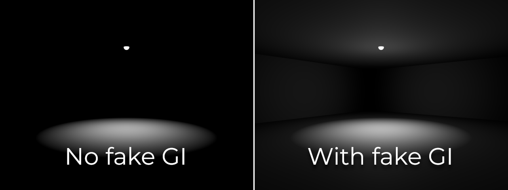

.. _doc_faking_global_illumination:

Faking global illumination
==========================

Why fake global illumination?
-----------------------------

Godot provides several global illumination (GI) techniques, all with their advantages
and drawbacks. Nonetheless, it remains possible to avoid using any GI technique
and use a handmade approach instead. There are a few reasons for using a
"handmade" approach to global illumination instead of VoxelGI, SDFGI or
baked lightmaps:

- You need to have good rendering performance, but can't afford going through
  a potentially cumbersome lightmap baking process.
- You need an approach to GI that is fully real-time *and* works in procedurally
  generated levels.
- You need an approach to GI that is fully real-time *and* does not suffer from
  significant light leaks.

The approaches described below only cover indirect diffuse lighting, not
specular lighting. For specular lighting, consider using ReflectionProbes which
are usually cheap enough to be used in conjunction with this fake GI approach.

.. seealso::

    Not sure if faking global illumination with lights is suited to your needs?
    See :ref:`doc_introduction_to_global_illumination_comparison` for a
    comparison of GI techniques available in Godot 4.

Faking DirectionalLight3D global illumination
---------------------------------------------

While the sky provides its own directional lighting, the scene's main DirectionalLight3D
node typically emits a large amount of light. When using a GI technique, this light
would be reflected on solid surfaces and would bounce back on most outdoors shaded surfaces.

We can fake this by adding a second DirectionalLight3D node with the following changes:

- Rotate the light by 180 degrees. This allows it to represent lighting bounced
  by the main DirectionalLight3D node.
- Set **Shadows** to **Off**. This reduces the secondary light's performance burden
  while also allowing shaded areas to receive *some* lighting (which is what we want here).
- Set **Energy** to 10-40% of the original value. There is no "perfect" value,
  so experiment with various energy values depending on the light and your typical
  material colors.
- Set **Specular** to ``0.0``. Indirect lighting shouldn't emit visible specular
  lobes, so we need to disable specular lighting entirely for the secondary light.

.. note::

    This approach works best in scenes that are mostly outdoors. When going indoors,
    the secondary DirectionalLight3D's light will still be visible as this light
    has shadows disabled.

    This can be worked around by smoothly decreasing the secondary DirectionalLight3D's
    energy when entering an indoor area (and doing the opposite when leaving the indoor area).
    For instance, this can be achieved using an Area3D node and AnimationPlayer.

Faking positional light global illumination
-------------------------------------------

It's possible to follow the same approach as DirectionalLight3D for positional
lights (OmniLight3D and SpotLight3D). However, this will require more manual
work as this operation needs to be repeated for every positional light node in
the scene to look good.

In an ideal scenario, additional OmniLight3Ds should be added at every location
where a significant amount of light hits a bright enough surface. However, due
to time constraints, this isn't always easily feasible (especially when
performing procedural level generation).

If you're in a hurry, you can place a secondary OmniLight3D node at the same position
as the main OmniLight3D node.
You can add this node as a child of the main OmniLight3D node to make it easy to
move and hide both nodes at the same time.

In the secondary OmniLight3D node, perform the following changes:

- Increase the light's **Range** by 25-50%. This allows the secondary light to lighten
  what was previously not lit by the original light.
- Set **Shadows** to **Off**. This reduces the secondary light's performance burden
  while also allowing shaded areas to receive *some* lighting (which is what we want here).
- Set **Energy** to 10-40% of the original value. There is no "perfect" value,
  so experiment with various energy values depending on the light and its surroundings.
- Set **Specular** to 0. Indirect lighting shouldn't emit visible specular lobes,
  so we need to disable specular lighting entirely for the secondary light.

For SpotLight3D, the same trick can be used. In this case, the secondary OmniLight3D
should be placed in a way that reflects where *most* light will be bounced.
This is usually close to the SpotLight3D's primary impact location.

In the example below, a SpotLight3D node is used to light up the room's floor.
However, since there is no indirect lighting, the rest of the room remains
entirely dark. In real life, the room's walls and ceiling would be lit up by
light bouncing around. Using an OmniLight3D node positioned between the
SpotLight3D's origin and the floor allows simulating this effect:

