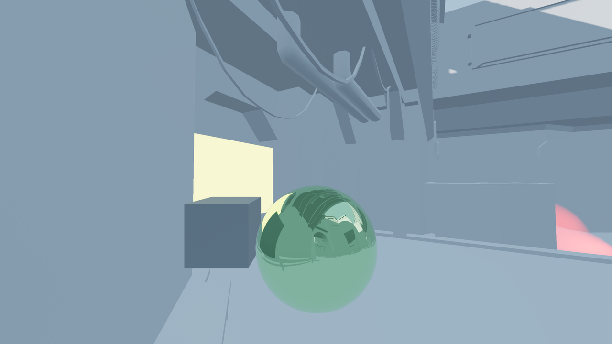
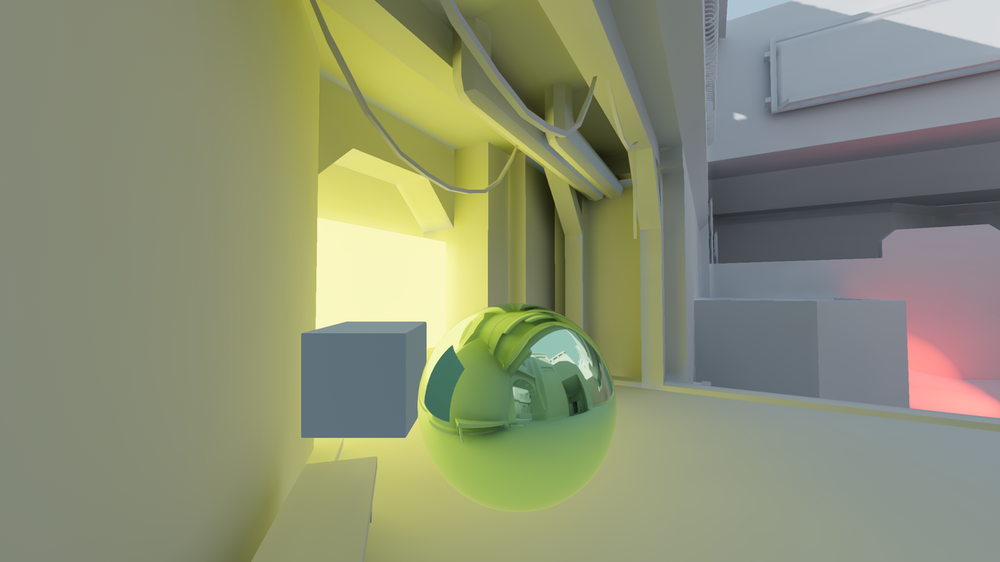
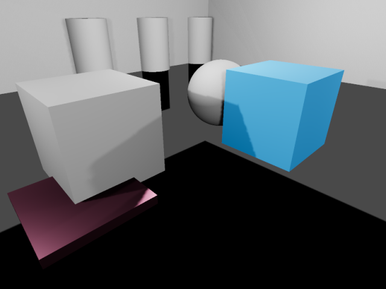
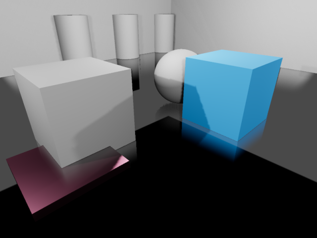

.. _doc_reflection_probes:

Reflection probes
=================

.. note::

    Reflection probes are only supported in the Clustered Forward and Forward
    Mobile rendering backends, not the Compatibility backend.

As stated in the :ref:`doc_standard_material_3d`, objects can show reflected and/or
diffuse light. Reflection probes are used as a source of reflected *and* ambient
light for objects inside their area of influence. They can be used to provide
more accurate reflections than :ref:`VoxelGI <doc_using_voxel_gi>` and
:ref:`SDFGI <doc_using_sdfgi>` while being fairly cheap on system resources.

Since reflection probes can also store ambient light, they can be used as a
low-end alternative to VoxelGI and SDFGI when :ref:`baked lightmaps
<doc_using_lightmap_gi>` aren't viable (e.g. in procedurally generated levels).

Reflection probes can also be used at the same time as screen-space reflections
to provide reflections for off-screen objects. In this case, Godot will blend
together the screen-space reflections and reflections from reflection probes.

.. seealso::

    Not sure if ReflectionProbe is suited to your needs?
    See :ref:`doc_introduction_to_global_illumination_comparison`
    for a comparison of GI techniques available in Godot 4.

Visual comparison
-----------------

.. figure:: img/gi_none.webp
   :align: center
   :alt: Reflection probe disabled. Environment sky is used as a fallback.

   Reflection probe disabled. Environment sky is used as a fallback.

   Reflection probe enabled.

   Reflection probe enabled with LightmapGI used at the same time. The lightmap appears in the reflection.

By combining reflection probes with screen-space reflections, you can get the
best of both worlds: high-quality reflections for general room structure (that
remain present when off-screen), while also having real-time reflections for
small details.

   Reflections in a room using ReflectionProbe only. Notice how small details
   don't have any reflections.

.. figure:: img/reflection_probes_ssr.webp
   :align: center
   :alt: Reflections in a room using screen-space reflections only.

   Reflections in a room using screen-space reflections only. Notice how the
   reflection on the sides of the room's walls is partly missing due to being
   off-screen.

   Reflections in a room using ReflectionProbe and screen-space reflections together.
   The screen-space reflections are blended with the reflection probe,
   acting as a fallback in situations where the reflection probe fails to display
   any reflection.

Setting up a ReflectionProbe
----------------------------

- Add a :ref:`class_ReflectionProbe` node.
- Configure the ReflectionProbe's extents in the inspector to fit your scene. To
  get reasonably accurate reflections, you should generally have one
  ReflectionProbe node per room (sometimes more for large rooms).

.. tip::

    Remember that ReflectionProbe extents don't have to be square, and you can
    even rotate the ReflectionProbe node to fit rooms that aren't aligned with
    the X/Z grid. Use this to your advantage to better cover rooms without
    having to place too many ReflectionProbe nodes.

ReflectionProbe properties
--------------------------

- **Update Mode:** Controls when the reflection probe updates.
  **Once** only renders the scene once every time the ReflectionProbe is moved.
  This makes it much faster to render compared to the **Always** update mode,
  which forces the probe to re-render everything around it every frame.
  Leave this property on **Once** (default) unless you need the reflection probe
  to update every frame.
- **Intensity:** The brightness of the reflections and ambient lighting. This
  usually doesn't need to be changed from its default value of ``1.0``, but you
  can decrease it ``1.0`` if you find that reflections look too strong.
- **Max Distance:** Controls the maximum distance used by the ReflectionProbe's
  internal camera. The distance is always at least equal to the **Extents**, but
  this can be increased to make objects located outside the extents visible in
  reflections. *This property does not affect the maximum distance at which the
  ReflectionProbe itself is visible.*
- **Extents:** The area that will be affected by the ReflectionProbe's lighting
  and reflections.
- **Origin Offset:** The origin to use for the internal camera used for
  reflection probe rendering. This must always be constrained within the
  **Extents**. If needed, adjust this to prevent the reflection from being
  obstructed by a solid object located exactly at the center of the
  ReflectionProbe.
- **Box Projection:** Controls whether parallax correction should be used when
  rendering the reflection probe. This adjusts the reflection's appearance
  depending on the camera's position (relative to the reflection probe). This
  has a small performance cost, but the quality increase is often worth it in
  box-shaped rooms. Note that this effect doesn't work quite as well in rooms
  with less regular shapes (such as ellipse-shaped rooms).
- **Interior:** If enabled, ambient lighting will not be sourced from the
  environment sky, and the background sky won't be rendered onto the reflection
  probe.
- **Enable Shadows:** Controls whether real-time light shadows should be
  rendered within the reflection probe. Enable this to improve reflection
  quality at the cost of performance. This should be left disabled for
  reflection probes with the **Always** mode, as it's very expensive to render
  reflections with shadows every frame. Fully :ref:`baked light <doc_using_lightmap_gi>`
  shadows are not affected by this setting and will be rendered in the
  reflection probe regardless.
- **Cull Mask:** Controls which objects are visible in the reflection. This can
  be used to improve performance by excluding small objects from the reflection.
  This can also be used to prevent an object from having self-reflection
  artifacts in situations where **Origin Offset** can't be used.
- **Mesh LOD Threshold:** The automatic level of detail threshold to use for
  rendering meshes within the reflection. This only affects meshes that have
  automatic LODs generated for them. Higher values can improve performance by
  using less detailed geometry, especially for objects that are far away from
  the reflection's origin. The visual difference of using less detailed objects
  is usually not very noticeable during gameplay, especially in rough
  reflections.

The Ambient category features several properties to adjust ambient lighting
rendered by the ReflectionProbe:

- **Mode:** If set to **Disabled**, no ambient light is added by the probe. If
  set to **Environment**, the ambient light color is automatically sampled from
  the environment sky (if **Interior** is disabled) and the reflection's average
  color. If set to **Constant Color**, the color specified in the **Color**
  property is used instead. The **Constant Color** mode can be used as an
  approximation of area lighting.
- **Color:** The color to use when the ambient light mode is set to **Constant Mode**.
- **Color Energy:** The multiplier to use for the ambient light custom
  **Color**. This only has an effect when the ambient light mode is **Custom
  Color**.

ReflectionProbe blending
------------------------

To make transitions between reflection sources smoother, Godot supports automatic
probe blending:

- Up to 4 ReflectionProbes can be blended together at a given location.
  A ReflectionProbe will also fade out smoothly back to environment lighting
  when it isn't touching any other ReflectionProbe node.
- SDFGI and VoxelGI will blend in smoothly with ReflectionProbes if used.
  This allows placing ReflectionProbes strategically to get more accurate (or fully real-time)
  reflections where needed, while still having rough reflections available in the
  VoxelGI or SDFGI's area of influence.

To make several ReflectionProbes blend with each other, you need to have part of
each ReflectionProbe overlap each other's area. The extents should only overlap
as little possible with other reflection probes to improve rendering performance
(typically a few units in 3D space).

Limitations
-----------

When using the Forward+ renderer, Godot uses a *clustering* approach for
reflection probe rendering. As many reflection probes as desired can be added (as long as
performance allows). However, there's still a default limit of 512 *clustered
elements* that can be present in the current camera view. A clustered element is
an omni light, a spot light, a :ref:`decal <doc_using_decals>` or a
:ref:`reflection probe <doc_reflection_probes>`. This limit can be increased by
adjusting the **Rendering > Limits > Cluster Builder > Max Clustered Elements**
advanced project setting.

When using the Forward Mobile backend, only 8 reflection probes can be applied on each
individual Mesh *resource*. If there are more reflection probes affecting a single mesh,
not all of them will be rendered on the mesh.
