.. _doc_using_lightmap_gi:

Using Lightmap global illumination
==================================

Baked lightmaps are a workflow for adding indirect (or fully baked)
lighting to a scene. Unlike the :ref:`VoxelGI <doc_using_voxel_gi>` and
:ref:`SDFGI <doc_using_sdfgi>` approaches, baked lightmaps work fine on low-end PCs
and mobile devices, as they consume almost no resources at run-time. Also unlike
VoxelGI and SDFGI, baked lightmaps can optionally be used to store direct
lighting, which provides even further performance gains.

Unlike VoxelGI and SDFGI, baked lightmaps are completely static. Once baked, they
can't be modified at all. They also don't provide the scene with reflections, so
using :ref:`doc_reflection_probes` together with it on interiors (or using a Sky
on exteriors) is a requirement to get good quality.

As they are baked, they have fewer problems than VoxelGI and SDFGI regarding
light bleeding, and indirect light will often look better. The downside is that
baking lightmaps takes longer compared to baking VoxelGI. While baking VoxelGI
can be done in a matter of seconds, baking lightmaps can take several minutes if
not more. This can slow down iteration speed significantly, so it is recommended
to bake lightmaps only when you actually need to see changes in lighting. Since
Godot 4.0, lightmaps are baked on the GPU, making light baking faster if you
have a mid-range or high-end dedicated GPU.

Baking lightmaps will also reserve baked materials' UV2 slot, which means you can
no longer use it for other purposes in materials (either in the built-in
:ref:`doc_standard_material_3d` or in custom shaders).

Despite their lack of flexibility, baked lightmaps typically offer both the best
quality *and* performance at the same time in (mostly) static scenes. This makes
lightmaps still popular in game development, despite lightmaps being the
oldest technique for global illumination in video games.

.. seealso::

    Not sure if LightmapGI is suited to your needs?
    See :ref:`doc_introduction_to_global_illumination_comparison`
    for a comparison of GI techniques available in Godot 4.

Visual comparison
-----------------

.. figure:: img/gi_none.webp
   :alt: LightmapGI disabled.

   LightmapGI disabled.

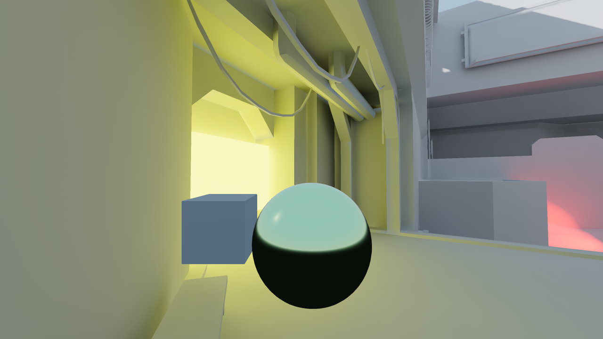

   LightmapGI enabled (with indirect light baked only). Direct light is still
   real-time, allowing for subtle changes during gameplay.

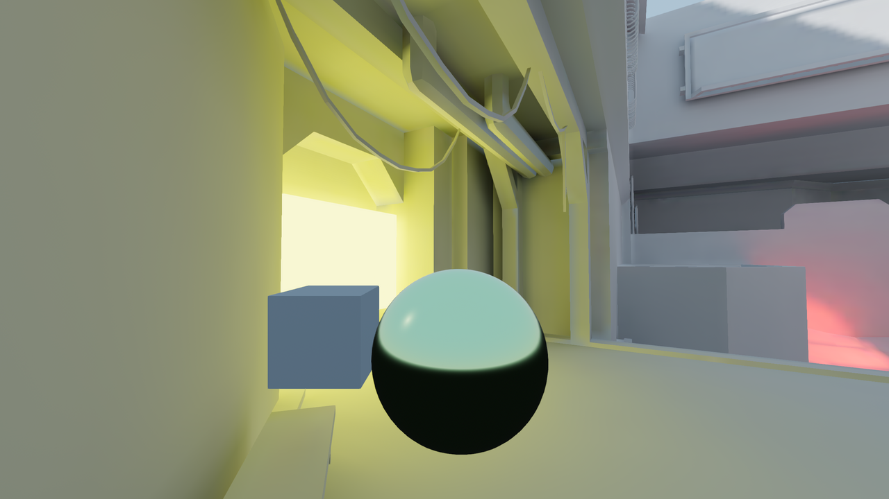

   LightmapGI enabled (with direct and indirect light baked). Best performance,
   but lower quality visuals. Notice the blurrier sun shadow in the top-right
   corner.

Visual comparison
-----------------

Here are some comparisons of how LightmapGI vs. VoxelGI look. Notice that
lightmaps are more accurate, but also suffer from the fact
that lighting is on an unwrapped texture, so transitions and resolution may not
be that good. VoxelGI looks less accurate (as it's an approximation), but
smoother overall.

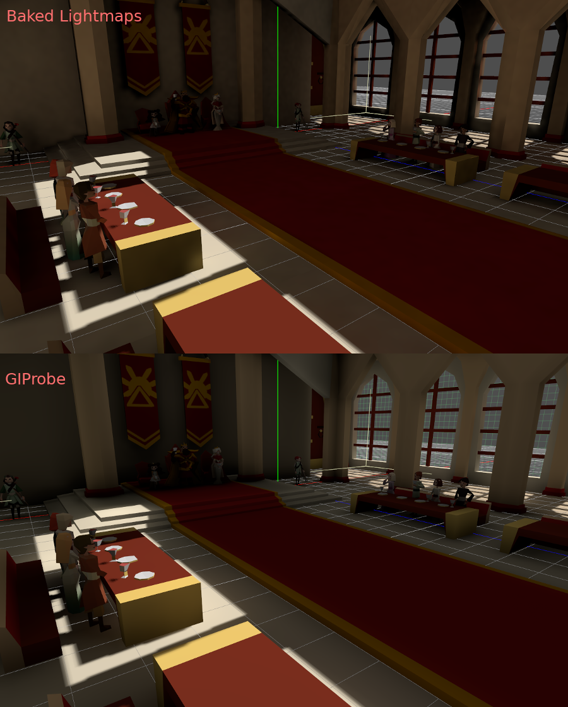

SDFGI is also less accurate compared to LightmapGI. However, SDFGI can support
large open worlds without any need for baking.

Setting up
----------

First of all, before the lightmapper can do anything, the objects to be baked need
an UV2 layer and a texture size. An UV2 layer is a set of secondary texture coordinates
that ensures any face in the object has its own place in the UV map. Faces must
not share pixels in the texture.

There are a few ways to ensure your object has a unique UV2 layer and texture size:

Unwrap on scene import (recommended)
^^^^^^^^^^^^^^^^^^^^^^^^^^^^^^^^^^^^

In most scenarios, this is the best approach to use. The only downside is that,
on large models, unwrapping can take a while on import. Nonetheless, Godot will
cache the UV2 across reimports, so it will only be regenerated when needed.

Select the imported scene in the filesystem dock, then go to the **Import** dock.
There, the following option can be modified:

.. image:: img/lightmap_gi_import.webp

The **Meshes > Light Baking** option must be set to **Static Lightmaps (VoxelGI/SDFGI/LightmapGI)**:

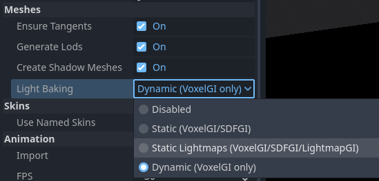

When unwrapping on import, you can adjust the texture size using the **Meshes > Lightmap
Texel Size** option. *Lower* values will result in more detailed lightmaps,
possibly resulting in higher visual quality at the cost of longer bake times and
larger lightmap file sizes. The default value of ``0.2`` is suited for
small/medium-sized scenes, but you may want to increase it to ``0.5`` or even
more for larger scenes. This is especially the case if you're baking indirect
lighting only, as indirect light is low-frequency data (which means it doesn't
need high-resolution textures to be accurately represented).

The effect of setting this option is that all meshes within the scene will have
their UV2 maps properly generated.

.. warning::

    When reusing a mesh within a scene, keep in mind that UVs will be generated
    for the first instance found. If the mesh is re-used with different scales
    (and the scales are wildly different, more than half or twice), this will
    result in inefficient lightmaps. To avoid this, adjust the **Lightmap
    Scale** property in the GeometryInstance3D section of a MeshInstance3D node.
    This lets you *increase* the level of lightmap detail for specific
    MeshInstance3D nodes (but not decrease it).

    Also, the ``*.unwrap_cache`` files should *not* be ignored in version control
    as these files guarantee that UV2 reimports are consistent across platforms
    and engine versions.

Unwrap from within Godot
^^^^^^^^^^^^^^^^^^^^^^^^

.. warning::

    If this Mesh menu operation is used on an imported 3D scene, the generated
    UV2 will be lost when the scene is reloaded.

Godot has an option to unwrap meshes and visualize the UV channels. After
selecting a MeshInstance3D node, it can be found in the **Mesh** menu at the top
of the 3D editor viewport:

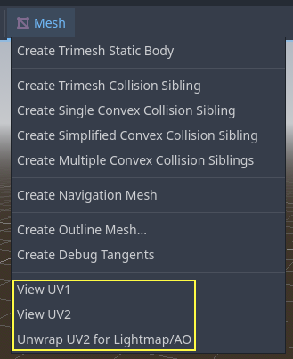

This will generate a second set of UV2 coordinates which can be used for baking.
It will also set the texture size automatically.

Unwrap from your 3D modeling software
^^^^^^^^^^^^^^^^^^^^^^^^^^^^^^^^^^^^^

The last option is to do it from your favorite 3D app. This approach is
generally **not recommended**, but it's explained so that you know it exists.
The main advantage is that, on complex objects that you may want to re-import a
lot, the texture generation process can be quite costly within Godot, so having
it unwrapped before import can be faster.

Simply do an unwrap on the second UV2 layer.

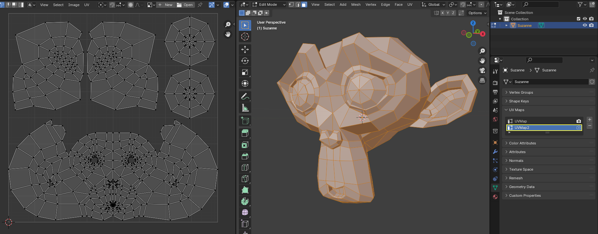

Then import the 3D scene normally. Remember you will need to set the texture
size on the mesh after import.

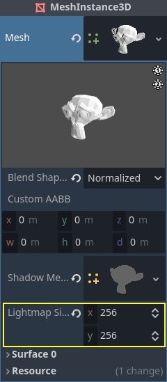

If you use external meshes on import, the size will be kept. Be wary that most
unwrappers in 3D modeling software are not quality-oriented, as they are meant
to work quickly. You will mostly need to use seams or other techniques to create
better unwrapping.

Generating UV2 for primitive meshes
^^^^^^^^^^^^^^^^^^^^^^^^^^^^^^^^^^^

.. note::

    This option is only available for primitive meshes such as :ref:`class_BoxMesh`,
    :ref:`class_CylinderMesh`, :ref:`class_PlaneMesh`, etc.

Enabling UV2 on primitive meshes allows you to make them receive and contribute
to baked lighting. This can be used in certain lighting setups. For instance,
you could hide a torus that has an emissive material after baking lightmaps to
create an area light that follows the shape of a torus.

By default, primitive meshes do not have UV2 generated to save resources (as
these meshes may be created during gameplay). You can edit a primitive mesh in
the inspector and enable **Add UV2** to make the engine procedurally generate
UV2 for a primitive mesh. The default **UV2 Padding** value is tuned to avoid
most lightmap bleeding, without wasting too much space on the edges. If you
notice lightmap bleeding on a specific primitive mesh only, you may have to
increase **UV2 Padding**.

**Lightmap Size Hint** represents the size taken by a single mesh on the
lightmap texture, which varies depending on the mesh's size properties and the
**UV2 Padding** value. **Lightmap Size Hint** should not be manually changed, as
any modifications will be lost when the scene is reloaded.

Checking UV2
^^^^^^^^^^^^

In the **Mesh** menu mentioned before, the UV2 texture coordinates can be visualized.
If something is failing, double-check that the meshes have these UV2 coordinates:

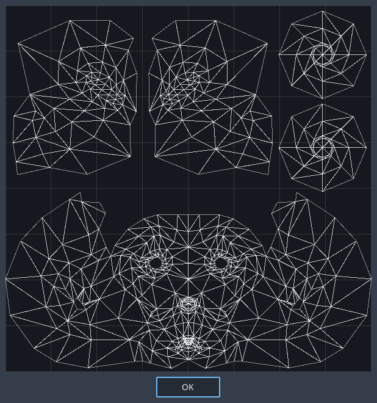

Setting up the scene
--------------------

Before anything is done, a **LightmapGI** node needs to be added to a scene.
This will enable light baking on all nodes (and sub-nodes) in that scene, even
on instanced scenes.

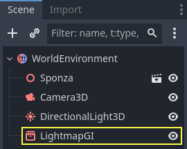

A sub-scene can be instanced several times, as this is supported by the baker.
Each instance will be assigned a lightmap of its own. To avoid issues with
inconsistent lightmap texel scaling, make sure to respect the rule about mesh
scaling mentioned before.

Setting up meshes
^^^^^^^^^^^^^^^^^

For a **MeshInstance3D** node to take part in the baking process, it needs to have
its bake mode set to **Static**. Meshes that have their bake mode set to **Disabled**
or **Dynamic** will be ignored by the lightmapper.

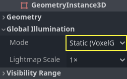

When auto-generating lightmaps on scene import, this is enabled automatically.

Setting up lights
^^^^^^^^^^^^^^^^^

Lights are baked with indirect light only by default. This means that shadowmapping
and lighting are still dynamic and affect moving objects, but light bounces from
that light will be baked.

Lights can be disabled (no bake) or be fully baked (direct and indirect). This
can be controlled from the **Bake Mode** menu in lights:

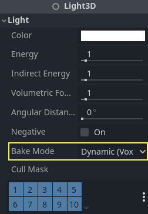

The modes are:

Disabled
^^^^^^^^

The light is ignored when baking lightmaps. This is the mode to use for dynamic
lighting effects such as explosions and weapon effects.

.. warning::

    Hiding a light has no effect on the resulting lightmap bake. This means
    you must use the Disabled bake mode instead of hiding the Light node by
    disabling its **Visible** property.

Dynamic
^^^^^^^

This is the default mode, and is a compromise between performance and real-time
friendliness. Only indirect lighting will be baked. Direct light and shadows are
still real-time, as they would be without LightmapGI.

This mode allows performing *subtle* changes to a light's color, energy and
position while still looking fairly correct. For example, you can use this
to create flickering static torches that have their indirect light baked.

Static
^^^^^^

Both indirect and direct lighting will be baked. Since static surfaces can skip
lighting and shadow computations entirely, this mode provides the best
performance along with smooth shadows that never fade based on distance. The
real-time light will not affect baked surfaces anymore, but it will still affect
dynamic objects. When using the **All** bake mode on a light, dynamic objects
will not cast real-time shadows onto baked surfaces, so you need to use a
different approach such as blob shadows instead. Blob shadows can be implemented
with a Decal node.

The light will not be adjustable at all during gameplay. Moving the light or
changing its color (or energy) will not have any effect on static surfaces.

Since bake modes can be adjusted on a per-light basis, it is possible to create
hybrid baked light setups. One popular option is to use a real-time
DirectionalLight with its bake mode set to **Dynamic**, and use the **Static**
bake mode for OmniLights and SpotLights. This provides good performance while
still allowing dynamic objects to cast real-time shadows in outdoor areas.

Fully baked lights can also make use of light nodes' **Size** (omni/spot) or
**Angular Distance** (directional) properties. This allows for shadows with
realistic penumbra that increases in size as the distance between the caster and
the shadow increases. This also has a lower performance cost compared to
real-time PCSS shadows, as only dynamic objects have real-time shadows rendered
on them.

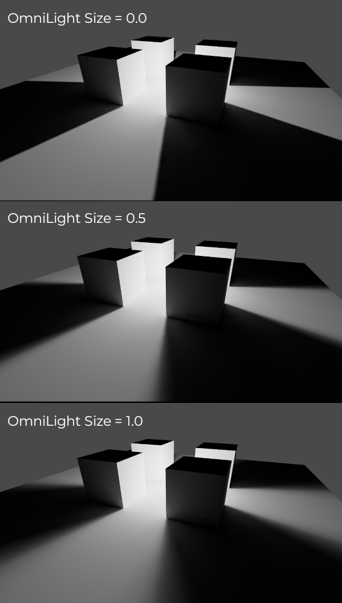

Baking
------

To begin the bake process, click the **Bake Lightmaps** button at the top of the
3D editor viewport when selecting the LightmapGI node:

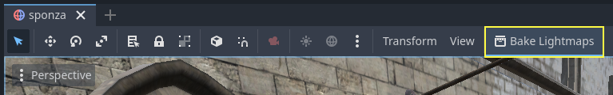

This can take from seconds to minutes (or hours) depending on scene size, bake
method and quality selected.

.. warning::

    Baking lightmaps is a process that can require a lot of video memory,
    especially if the resulting texture is large. Due to internal limitations,
    the engine may also crash if the generated texture size is too large (even
    on systems with a lot of video memory).

    To avoid crashes, make sure the lightmap texel size in the Import dock is
    set to a high enough value.

Tweaks
^^^^^^

- **Quality:** Four bake quality modes are provided: Low, Medium, High, and
  Ultra. Higher quality takes more time, but result in a better-looking lightmap
  with less noise. The difference is especially noticeable with emissive
  materials or areas that get little to no direct lighting. Each bake quality
  mode can be further adjusted in the Project Settings.
- **Bounces:** The number of bounces to use for indirect lighting. The default
  value (``3``) is a good compromise between bake times and quality. Higher
  values will make light bounce around more times before it stops, which makes
  indirect lighting look smoother (but also possibly brighter depending on
  materials and geometry).
- **Bounce Indirect Energy:** The global multiplier to use when baking lights'
  indirect energy. This multiplies each light's own **Indirect Energy** value.
  Values different from ``1.0`` are not physically accurate, but can be used for
  artistic effect.
- **Directional:** If enabled, stores directional information for lightmaps.
  This improves normal mapped materials' appearance for baked surfaces,
  especially with fully baked lights (since they also have direct light baked).
  The downside is that directional lightmaps are slightly more expensive to render.
  They also require more time to bake and result in larger file sizes.
- **Interior:** If enabled, environment lighting will not be sourced. Use this
  for purely indoor scenes to avoid light leaks.
- **Use Texture for Bounces:** If enabled, a texture with the lighting
  information will be generated to speed up the generation of indirect lighting
  at the cost of some accuracy. The geometry might exhibit extra light leak
  artifacts when using low resolution lightmaps or UVs that stretch the lightmap
  significantly across surfaces. Leave this enabled if unsure.
- **Use Denoiser:** If enabled, uses a denoising algorithm to make the lightmap
  significantly less noisy. This increases bake times and can occasionally
  introduce artifacts, but the result is often worth it. See
  :ref:`doc_using_lightmap_gi_denoising` for more information.
- **Denoiser Strength:** The strength of denoising step applied to the generated
  lightmaps. Higher values are more effective at removing noise, but can reduce
  shadow detail for static shadows. Only effective if denoising is enabled and
  the denoising method is :abbr:`JNLM (Non-Local Means with Joint Filtering)`
  (:abbr:`OIDN (Open Image Denoise)` does not have a denoiser strength setting).
- **Bias:** The offset value to use for shadows in 3D units. You generally don't
  need to change this value, except if you run into issues with light bleeding or
  dark spots in your lightmap after baking. This setting does not affect real-time
  shadows casted on baked surfaces (for lights with **Dynamic** bake mode).
- **Max Texture Size:** The maximum texture size for the generated texture
  atlas. Higher values will result in fewer slices being generated, but may not
  work on all hardware as a result of hardware limitations on texture sizes.
  Leave this at its default value of ``16384`` if unsure.
- **Environment > Mode:** Controls how environment lighting is sourced when
  baking lightmaps. The default value of **Scene** is suited for levels with
  visible exterior parts. For purely indoor scenes, set this to **Disabled** to
  avoid light leaks and speed up baking. This can also be set to **Custom Sky**
  or **Custom Color** to use environment lighting that differs from the actual
  scene's environment sky.
- **Gen Probes > Subdiv:** See :ref:`doc_using_lightmap_gi_dynamic_objects`.
- **Data > Light Data:** See :ref:`doc_using_lightmap_gi_data`.

Balancing bake times with quality
---------------------------------

Since high-quality bakes can take very long (up to dozens of minutes for large
complex scenes), it is recommended to use lower quality settings at first. Then,
once you are confident with your scene's lighting setup, raise the quality
settings and perform a "final" bake before exporting your project.

Reducing the lightmap resolution by increasing **Lightmap Texel Size** on the
imported 3D scenes will also speed up baking significantly. However, this will
require you to reimport all lightmapped 3D scenes before you can bake lightmaps
again.

.. _doc_using_lightmap_gi_denoising:

Denoising
---------

Since baking lightmaps relies on raytracing, there will always be visible noise
in the "raw" baked lightmap. Noise is especially visible in areas that are
difficult to reach by bounced light, such as indoor areas with small openings
where the sunlight can enter. Noise can be reduced by increasing bake quality,
but doing so will increase bake times significantly.

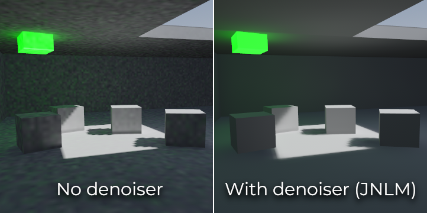

   Comparison between denoising disabled and enabled (with the default JNLM denoiser).

To combat noise without increasing bake times too much, a denoiser can be used.
A denoiser is an algorithm that runs on the final baked lightmap, detects patterns of
noise and softens them while attempting to best preseve detail.
Godot offers two denoising algorithms:

JNLM (Non-Local Means with Joint Filtering)
^^^^^^^^^^^^^^^^^^^^^^^^^^^^^^^^^^^^^^^^^^^

JNLM is the default denoising method and is included in Godot. It uses a simple
but efficient denoising algorithm known as *non-local means*. JNLM runs on the
GPU using a compute shader, and is compatible with any GPU that can run Godot
4's Vulkan-based rendering methods. No additional setup is required.

JNLM's denoising can be adjusted using the **Denoiser Strength** property that
is visible when **Use Denoiser** enabled. Higher values can be more effective at
removing noise, at the cost of suppressing shadow detail for static shadows.

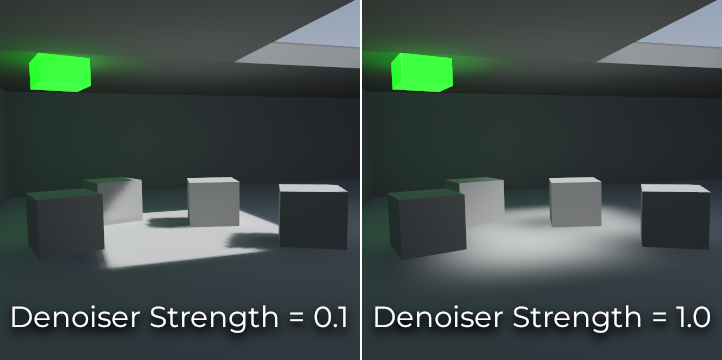

   Comparison between JNLM denoiser strength values. Higher values can reduce detail.

OIDN (Open Image Denoise)
^^^^^^^^^^^^^^^^^^^^^^^^^

Unlike JNLM, OIDN uses a machine learning approach to denoising lightmaps. It
features a model specifically trained to remove noise from lightmaps while
preserving more shadow detail in most scenes compared to JNLM.

OIDN can run on the GPU if hardware acceleration is configured. With a modern
high-end GPU, this can provide a speedup of over 50× over CPU-based denoising:

- On AMD GPUs, HIP must be installed and configured.
- On NVIDIA GPUs, CUDA must be installed and configured. This may automatically
  be done by the NVIDIA installer, but on Linux, CUDA libraries may not be
  installed by default. Double-check that the CUDA packages from your Linux
  distribution are installed.
- On Intel GPUs, SYCL must be installed and configured.

If hardware acceleration is not available, OIDN will fall back to multithreaded
CPU-based denoising. To confirm whether GPU-based denoising is working, use a
GPU utilization monitor while baking lightmaps and look at the GPU utilization
percentage and VRAM utilization while the denoising step is shown in the Godot
editor. The ``nvidia-smi`` command line tool can be useful for this.

OIDN is not included with Godot due to its relatively large download size. You
can download precompiled OIDN binary packages from its
`website <https://www.openimagedenoise.org/downloads.html>`__.
Extract the package to a location on your PC, then specify the path to the
``oidnDenoise`` executable in the Editor Settings (**FileSystem > Tools > OIDN >
OIDN Denoise Path**). This executable is located within the ``bin`` folder of
the binary package you extracted.

After specifying the path to the OIDN denoising executable, change the denoising
method in the project settings by setting **Rendering > Lightmapping >
Denoiser** to **OIDN**. This will affect all lightmap bakes on this project
after the setting is changed.

.. note::

    The denoising method is configured in the project settings instead of the
    editor settings. This is done so that different team members working on the
    same project are assured to be using the same denoising method for
    consistent results.

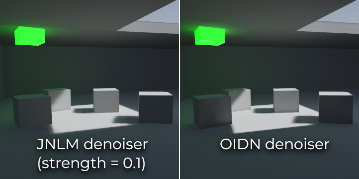

   Comparison between JNLM and OIDN denoisers.
   Notice how OIDN better preserves detail and reduces seams across different objects.

.. _doc_using_lightmap_gi_dynamic_objects:

Dynamic objects
---------------

Unlike VoxelGI and SDFGI, dynamic objects receive indirect lighting differently
compared to static objects. This is because lightmapping is only performed on
static objects.

To display indirect lighting on dynamic objects, a 3D probe system is used, with
light probes being spread throughout the scene. When baking lightmaps, the
lightmapper will calculate the amount of *indirect* light received by the probe.
Direct light is not stored within light probes, even for lights that have their
bake mode set to **Static** (as dynamic objects continue to be lit in
real-time).

There are 2 ways to add light probes to a scene:

- **Automatic:** Set **Gen Probes > Subdiv** to a value other than **Disabled**,
  then bake lightmaps. The default is ``8``, but you can choose a greater value
  to improve precision at the cost of longer bake times and larger output file
  size.
- **Manual:** In addition or as an alternative to generating probes
  automatically, you can add light probes manually by adding :ref:`class_LightmapProbe`
  nodes to the scene. This can be used to improve lighting detail in areas frequently
  travelled by dynamic objects. After placing LightmapProbe nodes in the scene,
  you must bake lightmaps again for them to be effective.

.. note::

    After baking lightmaps, you will notice white spheres in the 3D scene that
    represent how baked lighting will affect dynamic objects. These spheres do
    **not** appear in the running project.

    If you want to hide these spheres in the editor, toggle **View > Gizmos >
    LightmapGI** at the top of the 3D editor (a "closed eye" icon indicates the
    gizmo is hidden).

.. _doc_using_lightmap_gi_data:

Lightmap data
-------------

The **Data > Light Data** property in the LightmapGI node contains the lightmap
data after baking. Textures are saved to disk, but this also contains the
capture data for dynamic objects, which can be heavy. If you are using a scene
in ``.tscn`` format, you should save this resource to an external binary
``.lmbake`` file to avoid bloating the ``.tscn`` scene with binary data encoded
in Base64.

.. tip::

    The generated EXR file can be viewed and even edited using an image editor
    to perform post-processing if needed. However, keep in mind that changes to
    the EXR file will be lost when baking lightmaps again.

Reducing LightmapGI artifacts
-----------------------------

If you notice LightmapGI nodes popping in and out of existence as the camera
moves, this is most likely because the engine is rendering too many LightmapGI
instances at once. Godot is limited to rendering 8 LightmapGI nodes at once,
which means up to 8 instances can be in the camera view before some of them will
start flickering.
