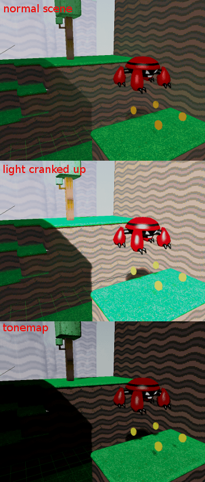
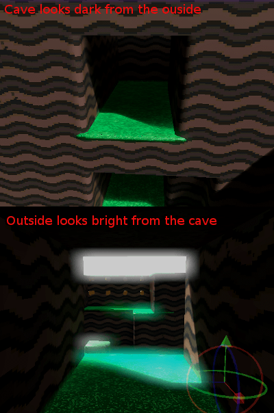

.. _doc_high_dynamic_range:

High dynamic range
==================

Introduction
------------

Normally, an artist does all the 3D modelling, then all the texturing,
looks at their awesome looking model in the 3D DCC and says "looks
fantastic, ready for integration!" then goes into the game, lighting is
setup and the game runs.

So at what point does all this HDR business come into play? The idea is that
instead of dealing with colors that go from black to white (0 to 1), we
use colors whiter than white (for example, 0 to 8 times white).

To be more practical, imagine that in a regular scene, the intensity
of a light (generally 1.0) is set to 5.0. The whole scene will turn
very bright (towards white) and look horrible.

After this, the luminance of the scene is computed by averaging the
luminance of every pixel of it, and this value is used to bring the
scene back to normal ranges. This last operation is called
tone-mapping. Finally, we are at a similar place from where we
started:

Except the scene is more contrasted because there is a higher light
range at play. What is this all useful for? The idea is that the scene
luminance will change while you move through the world, allowing
situations like this to happen:

Additionally, it is possible to set a threshold value to send to the
glow buffer depending on the pixel luminance. This allows for more
realistic light bleeding effects in the scene.

Linear color space
------------------

The problem with this technique is that computer monitors apply a
gamma curve to adapt better to the way the human eye sees. Artists
create their art on the screen too, so their art has an implicit gamma
curve applied to it.

The color space where images created on computer monitors exist is
called "sRGB". All visual content that people have on their computers
or download from the internet (such as pictures, movies, etc.)
is in this colorspace.

.. image:: img/hdr_gamma.png

The mathematics of HDR require that we multiply the scene by different
values to adjust the luminance and exposure to different light ranges,
and this curve gets in the way, as we need colors in linear space for
this.

Linear color space & asset pipeline
-----------------------------------

Working in HDR is not just pressing a switch. First, imported image
assets must be converted to linear space on import. There are two ways
to do this:

sRGB -> linear conversion on image import
~~~~~~~~~~~~~~~~~~~~~~~~~~~~~~~~~~~~~~~~~

This is the most compatible way of using linear-space assets, and it will
work everywhere, including all mobile devices. The main issue with this
is loss of quality, as sRGB exists to avoid this same problem. Using 8
bits per channel to represent linear colors is inefficient from the
point of view of the human eye. These textures might later be compressed
too, which makes the problem worse.

In any case, though, this is the easy solution that works everywhere.

Hardware sRGB -> linear conversion
~~~~~~~~~~~~~~~~~~~~~~~~~~~~~~~~~~

This is the most correct way to use assets in linear-space, as the
texture sampler on the GPU will do the conversion after reading the
texel using floating point. This works fine on PC and consoles, but most
mobile devices do no support it, or do not support it on compressed
texture format (iOS for example).

Linear -> sRGB at the end
~~~~~~~~~~~~~~~~~~~~~~~~~

After all the rendering is done, the linear-space rendered image must be
converted back to sRGB. To do this, simply enable sRGB conversion in the
current :ref:`Environment <class_Environment>` (more on that below).

Keep in mind that sRGB -> Linear and Linear -> sRGB conversions
must always be **both** enabled. Failing to enable one of them will
result in horrible visuals suitable only for avant-garde experimental
indie games.

Parameters of HDR
-----------------

HDR setting can be found in the :ref:`Environment <class_Environment>`
resource. These are found most of the time inside a
:ref:`WorldEnvironment <class_WorldEnvironment>`
node or set in a camera. For more information see
:ref:`doc_environment_and_post_processing`.